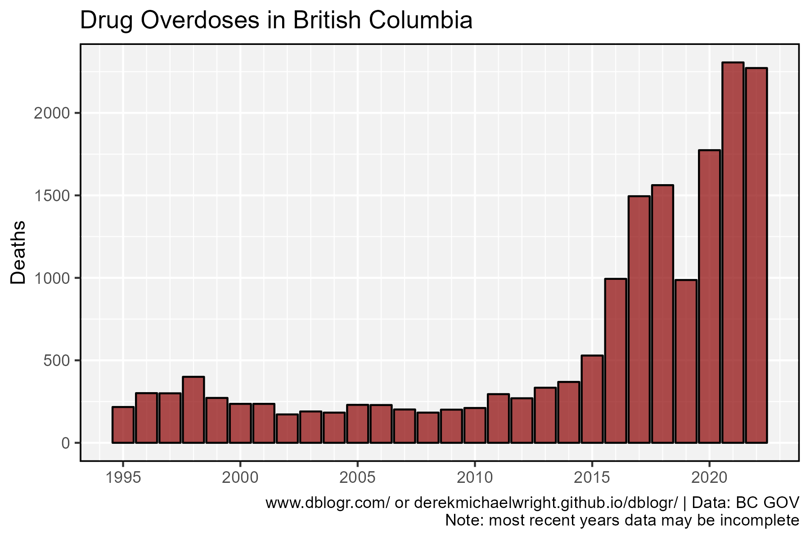
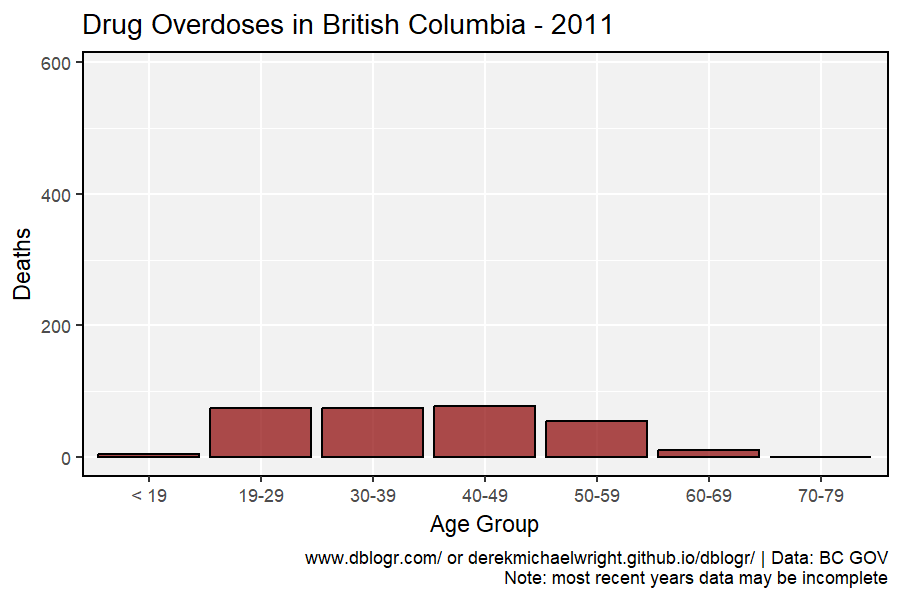
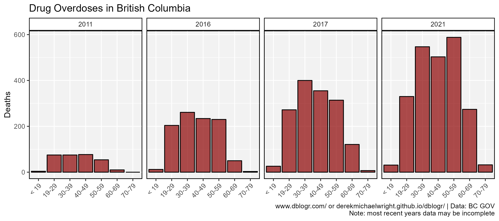
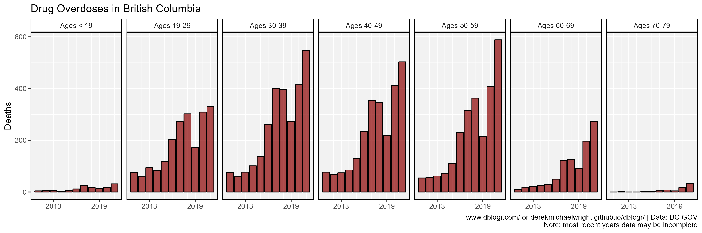

```{r setup, include=FALSE}
knitr::opts_chunk$set(echo = T, message = F, warning = F)
```

---

# Data

`r shiny::icon("globe")` https://www2.gov.bc.ca/assets/gov/birth-adoption-death-marriage-and-divorce/deaths/coroners-service/statistical/illicit-drug.pdf

`r shiny::icon("save")` [data_british_columbia_overdoses.xlsx](data_british_columbia_overdoses.xlsx)

```{r class.source = 'fold-show'}
# devtools::install_github("derekmichaelwright/agData")
library(agData) 
library(readxl) # read_xlsx()
library(gganimate)
```

---

# Prepare Data

```{r}
# Prep data
myCaption <- "derekmichaelwright.github.io/dblogr/ | Data: BC GOV"
#
d1 <- read_xlsx("data_british_columbia_overdoses.xlsx", "Annual")
#
d2 <- read_xlsx("data_british_columbia_overdoses.xlsx", "Monthly") %>%
  gather(Year, Deaths, 2:12) %>%
  mutate(Date = as.Date(paste(Year, Month, "15", sep = "-"), 
                        format = "%Y-%b-%d"))
#
d3 <- read_xlsx("data_british_columbia_overdoses.xlsx", "Sex") %>%
  gather(Sex, Deaths, Female, Male)
#
d4 <- read_xlsx("data_british_columbia_overdoses.xlsx", "Age") %>%
  gather(Year, Deaths, 2:12) %>%
  mutate(Year = as.numeric(Year),
         `Age Group` = factor(`Age Group`, levels = unique(.$`Age Group`)))
```

---

# Annual Drug Overdoses

## Deaths



```{r}
mp <- ggplot(d1, aes(x = Year, y = Deaths)) +
  geom_bar(stat = "identity", fill = "darkred", color = "black", alpha = 0.7) +
  scale_x_continuous(breaks = seq(1995, 2020, by = 5),
                     minor_breaks = 1990:2025) +
  theme_agData() +
  labs(title = "Drug Overdoses in British Columbia", x = NULL,
       caption = myCaption)
ggsave("british_columbia_overdoses_01.png", mp, width = 6, height = 4)
```

```{r echo = F}
ggsave("featured.png", mp, width = 6, height = 4)
```

---

## Rate


```{r}
mp <- ggplot(d1, aes(x = Year, y = Rate)) +
  geom_line(color = "darkred", alpha = 0.7, size = 1) +
  geom_point(alpha = 0.7) +
  geom_label_repel(data = d1 %>% filter(Year %in% c(2008,2021)), 
                   aes(label = Rate)) +
  scale_x_continuous(minor_breaks = 1990:2025) +
  theme_agData() +
  labs(title = "Drug Overdoses in British Columbia", 
       y = "Deaths per 100,000 people", x = NULL,
       caption = myCaption)
ggsave("british_columbia_overdoses_02.png", mp, width = 6, height = 4)
```

---

# Monthly Drug Overdoses

## Line Graph


```{r}
mp <- ggplot(d2, aes(x = Date, y = Deaths)) + 
  geom_vline(xintercept = as.Date(paste0(2011:2022,"-01-01")),
             alpha = 0.5, lty = 2) +
  geom_line(color = "darkred", alpha = 0.7, size = 1.25) +
  scale_x_date(date_breaks = "year", date_labels = "%Y") +
  theme_agData() +
  labs(title = "Drug Overdoses in British Columbia", x = NULL,
       caption = myCaption)
ggsave("british_columbia_overdoses_03.png", mp, width = 6, height = 4)
```

---

## Bar Graph


```{r}
mp <- ggplot(d2, aes(x = Date, y = Deaths)) + 
  geom_vline(xintercept = as.Date(paste0(2011:2022,"-01-01")),
             alpha = 0.5, lty = 2) +
  geom_bar(stat = "identity", fill = "darkred", 
           color = "black", lwd = 0.2, alpha = 0.7) +
  scale_x_date(date_breaks = "year", date_labels = "%Y") +
  theme_agData() +
  labs(title = "Drug Overdoses in British Columbia", x = NULL,
       caption = myCaption)
ggsave("british_columbia_overdoses_04.png", mp, width = 6, height = 4)
```

---

# By Sex


```{r}
mp <- ggplot(d3, aes(x = Year, y = Deaths, fill = Sex)) +
  geom_bar(stat = "identity", position = "dodge", 
           color = "black", alpha = 0.7) +
  scale_fill_manual(name = NULL, values = c("palevioletred3", "steelblue")) +
  scale_x_continuous(breaks = 2011:2021) +
  scale_y_continuous(breaks = seq(0, 1500, by = 500), limits = c(0,1750)) +
  theme_agData(legend.position = "bottom") +
  labs(title = "Drug Overdoses in British Columbia", x = NULL,
       caption = myCaption)
ggsave("british_columbia_overdoses_05.png", mp, width = 6, height = 4)
```

---

# By Age Group

## Animation



```{r}
mp <- ggplot(d4, aes(x = `Age Group`, y = Deaths, fill = `Age Group`)) +
  geom_bar(stat = "identity", position = "dodge", 
           color = "black", fill = "darkred", alpha = 0.7) +
  theme_agData(legend.position = "none") +
  labs(title = "Drug Overdoses in British Columbia - {round(frame_time)}",
       caption = myCaption) +
  transition_time(Year)
anim_save("british_columbia_overdoses_gif_01.gif", mp, 
          nframes = 300, fps = 30, end_pause = 30, 
          width = 900, height = 600, res = 150)
```

---

## 2011 - 2016 - 2017 - 2021


```{r}
# Prep data
xx <- d4 %>% filter(Year %in% c(2011, 2016, 2017, 2021))
# Plot
mp <- ggplot(xx, aes(x = `Age Group`, y = Deaths)) +
  geom_bar(stat = "identity", position = "dodge", 
           color = "black", fill = "darkred", alpha = 0.7) +
  facet_grid(. ~ Year) +
  theme_agData(legend.position = "none",
               axis.text.x = element_text(angle = 45, hjust = 1)) +
  labs(title = "Drug Overdoses in British Columbia", x = NULL,
       caption = myCaption)
ggsave("british_columbia_overdoses_06.png", mp, width = 9, height = 4)
```

---

## Unscaled



```{r}
mp <- ggplot(d4, aes(x = Year, y = Deaths)) +
  geom_bar(stat = "identity", position = "dodge", 
           color = "black", fill = "darkred", alpha = 0.7) +
  facet_grid(. ~ paste("Ages",`Age Group`)) +
  scale_x_continuous(breaks = c(2013, 2019), minor_breaks = 2011:2021) +
  theme_agData(legend.position = "none") +
  labs(title = "Drug Overdoses in British Columbia", x = NULL,
       caption = myCaption)
ggsave("british_columbia_overdoses_07.png", mp, width = 12, height = 4)
```

---

## Scaled



```{r}
mp <- ggplot(d4, aes(x = Year, y = Deaths)) +
  geom_bar(stat = "identity", position = "dodge", 
           color = "black", fill = "darkred", alpha = 0.7) +
  facet_wrap(. ~ paste("Ages",`Age Group`), scales = "free_y", ncol = 7) +
  scale_x_continuous(breaks = c(2013, 2019), minor_breaks = 2011:2021) +
  theme_agData(legend.position = "none") +
  labs(title = "Drug Overdoses in British Columbia", 
       x = NULL, caption = myCaption)
ggsave("british_columbia_overdoses_08.png", mp, width = 12, height = 4)
```

---
