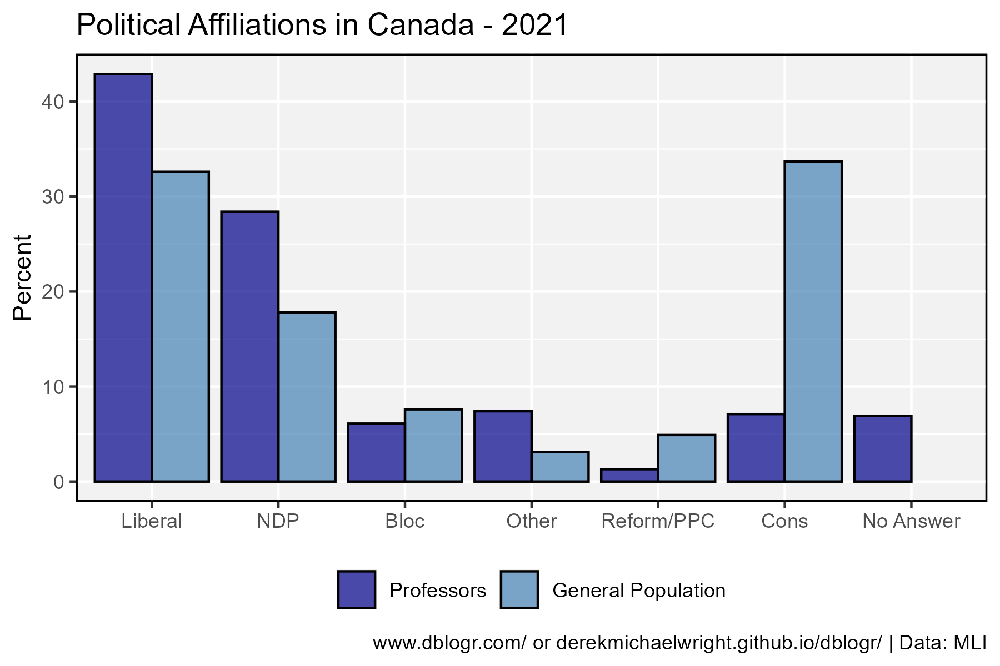
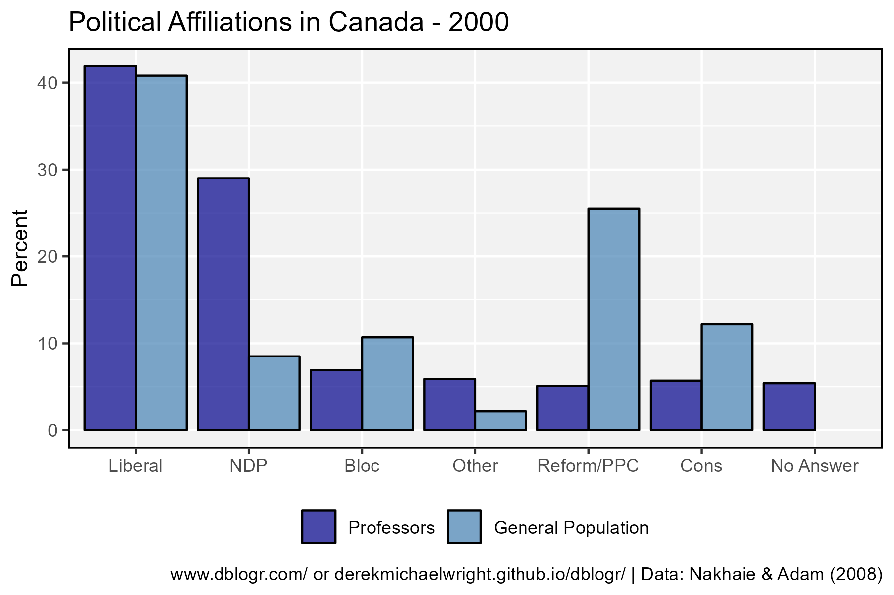
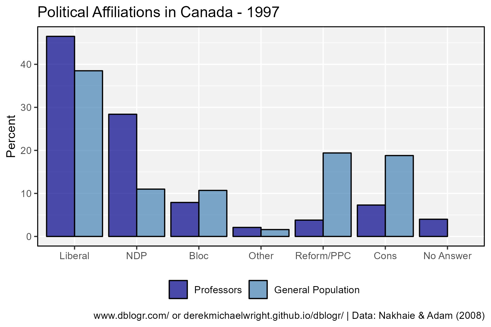
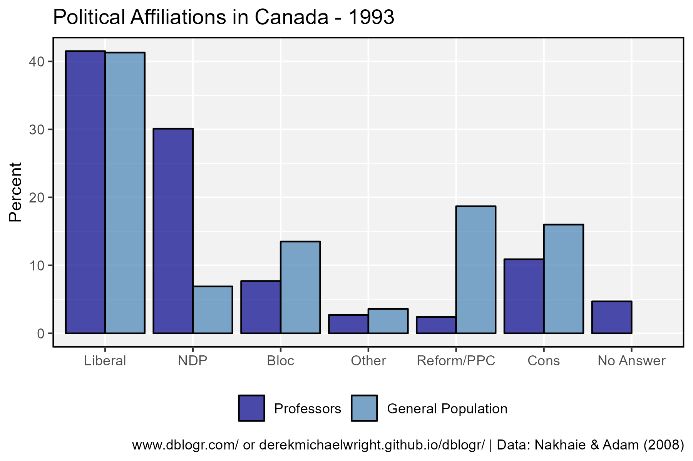

```{r setup, include=FALSE}
knitr::opts_chunk$set(echo = TRUE, message = F, warning = F)
```

---

# Data

> - `r shiny::icon("globe")` https://macdonaldlaurier.ca/the-viewpoint-diversity-crisis-at-canadian-universities/
> - `r shiny::icon("globe")` https://www.jstor.org/stable/pdf/canajsocicahican.33.4.873.pdf
> - `r shiny::icon("save")` [data_canada_academia.csv](data_canada_academia.csv)

---

# Prepare Data

```{r class.source = 'fold-show'}
# devtools::install_github("derekmichaelwright/agData")
library(agData)
```

```{r}
# Prep data
myCaption1 <- "www.dblogr.com/ or derekmichaelwright.github.io/dblogr/ | Data: MLI"
myCaption2 <- "www.dblogr.com/ or derekmichaelwright.github.io/dblogr/ | Data: Nakhaie & Adam (2008)"
dd <- read.csv("data_canada_academia.csv") %>%
  mutate(Party = factor(Party, levels = unique(.$Party)),
         Measurement = factor(Measurement, unique(.$Measurement)))
```

---

# 2021



```{r}
# Plot
mp <- ggplot(dd, aes(x = Party, y = X2021, fill = Measurement)) + 
  geom_bar(stat = "identity", position = "dodge", 
           color = "black", alpha = 0.7) +
  scale_fill_manual(name = NULL, values = c("darkblue", "steelblue")) +
  theme_agData(legend.position = "bottom") +
  labs(title = "Political Affiliations in Canada - 2021",
       y = "Percent", x = NULL, caption = myCaption1)
ggsave("canada_academia_01.png", mp, width = 8, height = 4)
```

```{r echo = F}
ggsave("featured.png", mp, width = 8, height = 4)
```

---

# 2000



```{r}
# Plot
mp <- ggplot(dd, aes(x = Party, y = X2000, fill = Measurement)) + 
  geom_bar(stat = "identity", position = "dodge", 
           color = "black", alpha = 0.7) +
  scale_fill_manual(name = NULL, values = c("darkblue", "steelblue")) +
  theme_agData(legend.position = "bottom") +
  labs(title = "Political Affiliations in Canada - 2000",
       y = "Percent", x = NULL, caption = myCaption2)
ggsave("canada_academia_02.png", mp, width = 8, height = 4)
```

---

# 1997



```{r}
# Plot
mp <- ggplot(dd, aes(x = Party, y = X1997, fill = Measurement)) + 
  geom_bar(stat = "identity", position = "dodge", 
           color = "black", alpha = 0.7) +
  scale_fill_manual(name = NULL, values = c("darkblue", "steelblue")) +
  theme_agData(legend.position = "bottom") +
  labs(title = "Political Affiliations in Canada - 1997",
       y = "Percent", x = NULL, caption = myCaption2)
ggsave("canada_academia_03.png", mp, width = 8, height = 4)
```

---

# 1993



```{r}
# Plot
mp <- ggplot(dd, aes(x = Party, y = X1993, fill = Measurement)) + 
  geom_bar(stat = "identity", position = "dodge", 
           color = "black", alpha = 0.7) +
  scale_fill_manual(name = NULL, values = c("darkblue", "steelblue")) +
  theme_agData(legend.position = "bottom") +
  labs(title = "Political Affiliations in Canada - 1993",
       y = "Percent", x = NULL, caption = myCaption2)
ggsave("canada_academia_04.png", mp, width = 8, height = 4)
```

---
