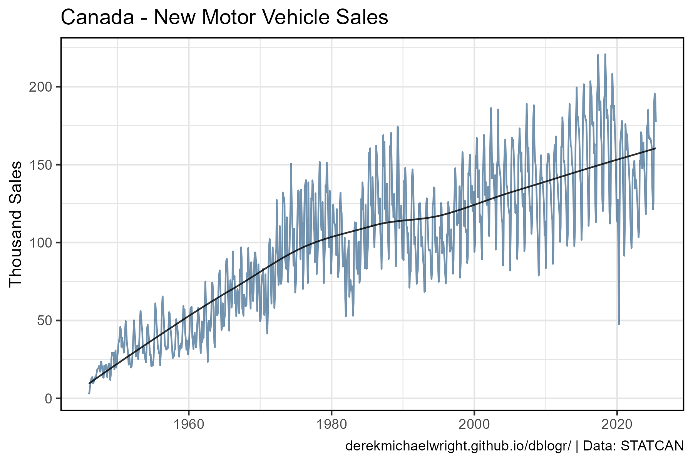
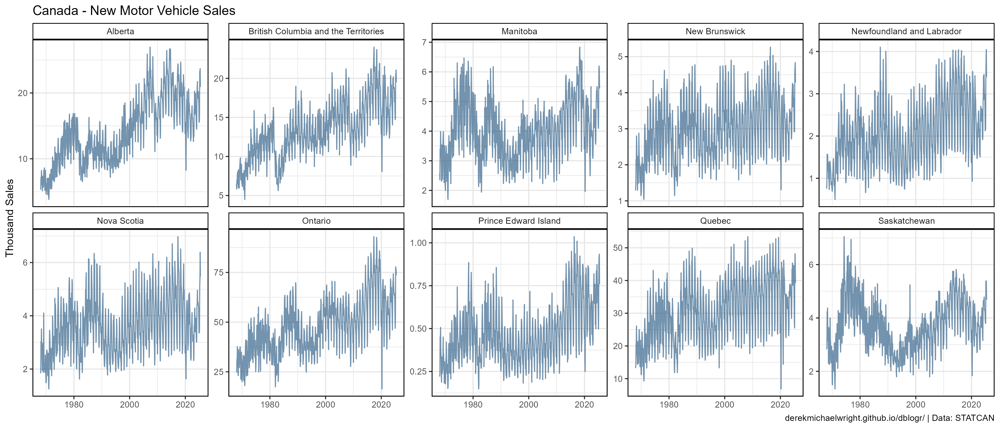
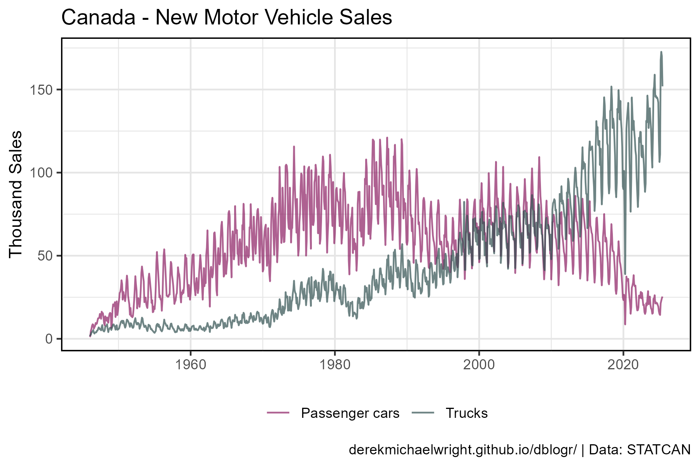
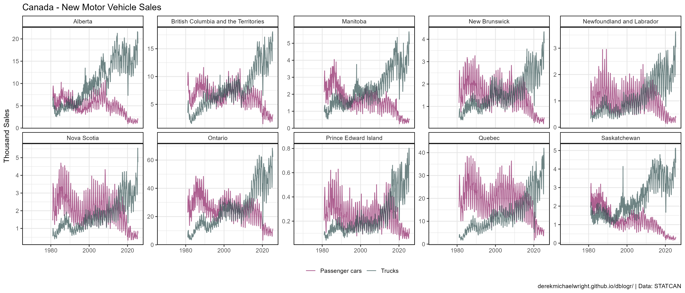
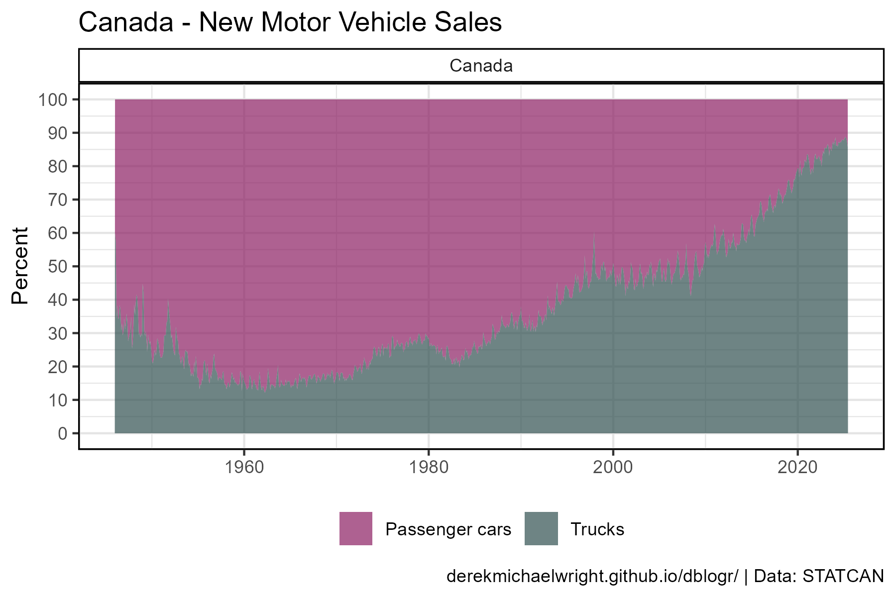
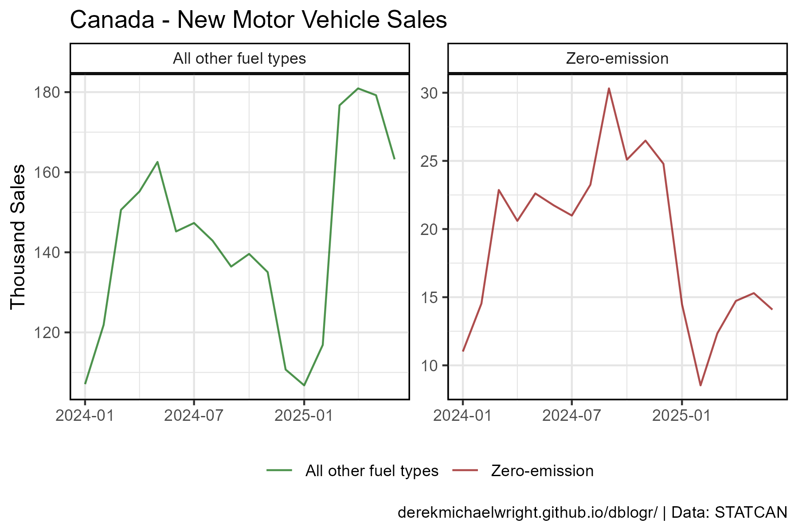
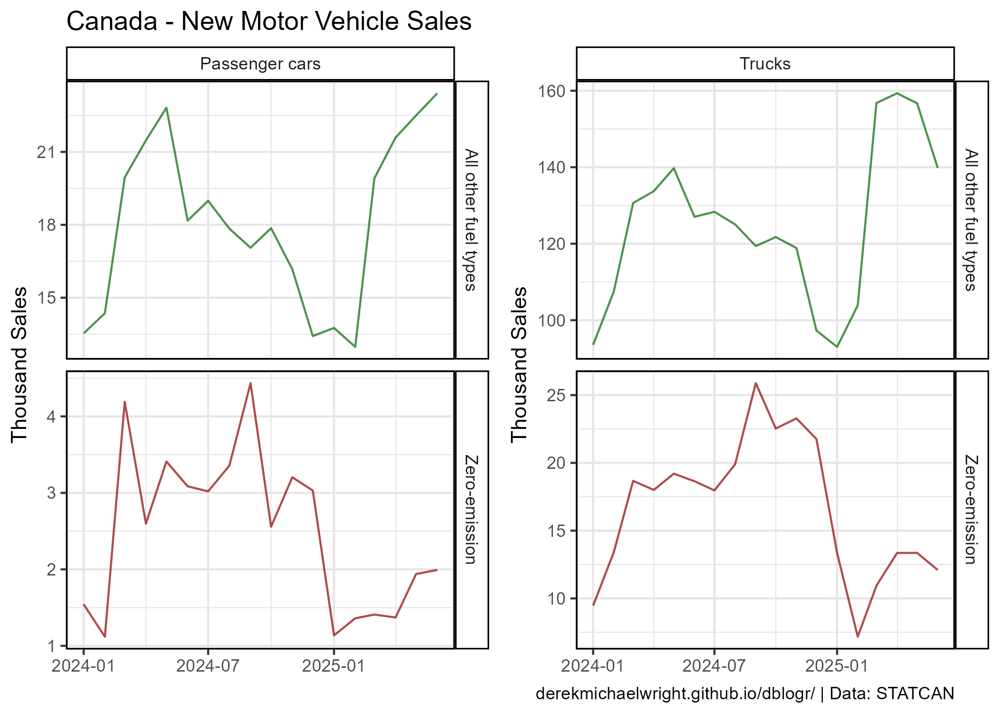
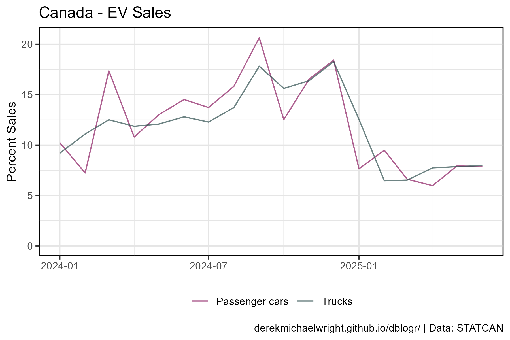
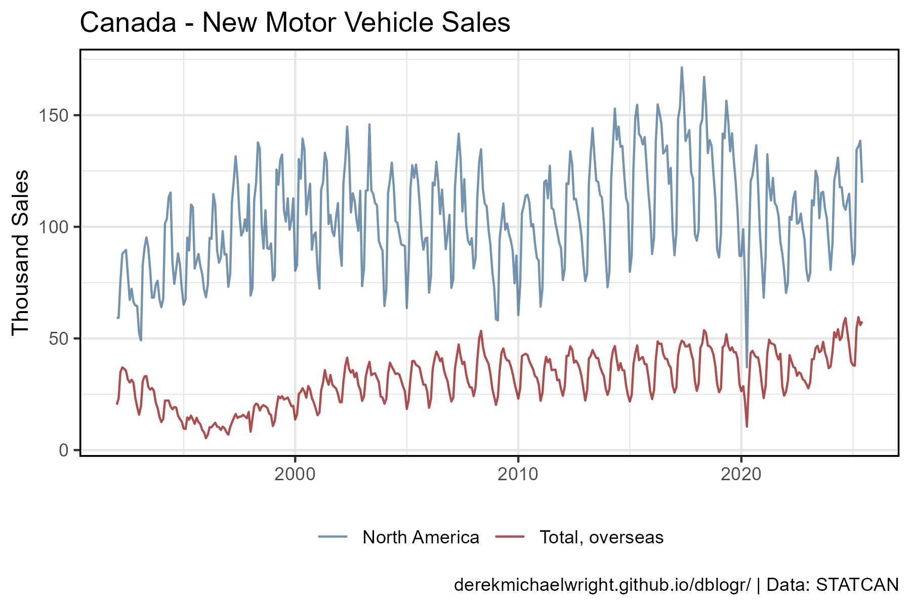

```{r setup, include=FALSE}
knitr::opts_chunk$set(echo = TRUE, message = F, warning = F)
```

---

# Data {.tabset .tabset-pills}

## STATCAN Table: 20-10-0085-01

New motor vehicle sales, monthly

Trucks = minivans, sport-utility vehicles, light and heavy trucks, vans and buses

> - `r shiny::icon("globe")` [https://www150.statcan.gc.ca/t1/tbl1/en/cv.action?pid=2010008501](https://www150.statcan.gc.ca/t1/tbl1/en/cv.action?pid=2010008501){target="_blank"}
> - `r shiny::icon("save")` [2010008501_databaseLoadingData.csv](2010008501_databaseLoadingData.csv)

---

# Prepare Data

```{r class.source = 'fold-show'}
# devtools::install_github("derekmichaelwright/agData")
library(agData)
```

```{r}
# Prep data
myCaption <- "derekmichaelwright.github.io/dblogr/blog/canada_auto_sales | Data: STATCAN"
myColors_Type <- c("maroon4", "darkslategray")
myColors_Fuel <- c("darkgreen", "darkred")

#
dd <- read.csv("2010008501_databaseLoadingData.csv") %>%
  select(Date=REF_DATE, Area=GEO, Vehicle.type, Fuel.type,
         Origin.of.manufacture, Unit=UOM, Value=VALUE) %>%
  mutate(Date = as.Date(paste0(Date,"-01")))
```

---

# Total Auto Sales {.tabset .tabset-pills}

## All Vehicles {.tabset .tabset-pills}

### Canada



```{r}
# Prep data
xx <- dd %>% 
  filter(Area == "Canada", Vehicle.type == "Total, new motor vehicles",
         Fuel.type == "All fuel types", Unit == "Units",
         Origin.of.manufacture == "Total, country of manufacture")
# Plot
mp <- ggplot(xx, aes(x = Date, y = Value / 1000)) + 
  geom_line(color = "steelblue4", alpha = 0.7) +
  stat_smooth(geom = "line", method = "loess", alpha = 0.8) +
  theme_agData(legend.position = "bottom") +
  labs(title = "Canada - New Motor Vehicle Sales",
       y = "Thousand Sales", x = NULL, caption = myCaption)
ggsave("canada_auto_sales_01.png", mp, width = 6, height = 4)
```

---

### Provinces



```{r}
# Prep data
xx <- dd %>% 
  filter(Area != "Canada", Vehicle.type == "Total, new motor vehicles",
         Fuel.type == "All fuel types", Unit == "Units",
         Origin.of.manufacture == "Total, country of manufacture")
# Plot
mp <- ggplot(xx, aes(x = Date, y = Value / 1000)) + 
  geom_line(color = "steelblue4", alpha = 0.7) +
  stat_smooth(geom = "line", method = "loess", alpha = 0.8) +
  facet_wrap(Area ~ ., scales = "free_y", ncol = 5) +
  theme_agData(legend.position = "bottom") +
  labs(title = "Canada - New Motor Vehicle Sales",
       y = "Thousand Sales", x = NULL, caption = myCaption)
ggsave("canada_auto_sales_02.png", mp, width = 14, height = 6)
```

---

## Vehicle Types {.tabset .tabset-pills}

### Canada



```{r}
# Prep data
xx <- dd %>% 
  filter(Area == "Canada", Vehicle.type != "Total, new motor vehicles",
         Fuel.type == "All fuel types", Unit == "Units",
         Origin.of.manufacture == "Total, country of manufacture")
# Plot
mp <- ggplot(xx, aes(x = Date, y = Value / 1000, color = Vehicle.type)) + 
  geom_line(alpha = 0.7) +
  stat_smooth(geom = "line", method = "loess", alpha = 0.8) +
  scale_color_manual(name = NULL, values = myColors_Type) +
  theme_agData(legend.position = "bottom") +
  labs(title = "Canada - New Motor Vehicle Sales",
       y = "Thousand Sales", x = NULL, caption = myCaption)
ggsave("canada_auto_sales_03.png", mp, width = 6, height = 4)
```

```{r echo = F}
ggsave("featured.png", mp, width = 6, height = 4)
```

---

### Provinces



```{r}
# Prep data
xx <- dd %>% 
  filter(Area != "Canada", Vehicle.type != "Total, new motor vehicles",
         Fuel.type == "All fuel types", Unit == "Units", !is.na(Value),
         Origin.of.manufacture == "Total, country of manufacture")
# Plot
mp <- ggplot(xx, aes(x = Date, y = Value / 1000, color = Vehicle.type)) + 
  geom_line(alpha = 0.7) +
  stat_smooth(geom = "line", method = "loess", alpha = 0.8) +
  facet_wrap(Area ~ ., scales = "free_y", ncol = 5) +
  scale_color_manual(name = NULL, values = myColors_Type) +
  theme_agData(legend.position = "bottom") +
  labs(title = "Canada - New Motor Vehicle Sales",
       y = "Thousand Sales", x = NULL, caption = myCaption)
ggsave("canada_auto_sales_04.png", mp, width = 14, height = 6)
```

---

### Percent



```{r}
# Prep data
xx <- dd %>% 
  filter(Area == "Canada", Vehicle.type != "Total, new motor vehicles",
         Fuel.type == "All fuel types", Unit == "Units",
         Origin.of.manufacture == "Total, country of manufacture") %>%
  spread(Vehicle.type, Value) %>%
  rename(Total_cars=`Passenger cars`, Total_trucks=Trucks) %>%
  mutate(Total = Total_cars + Total_trucks,
         `Passenger cars` = 100 * Total_cars / Total,
         Trucks = 100 * Total_trucks / Total) %>%
  select(Date, Area, `Passenger cars`, Trucks) %>%
  gather(Vehicle.type, Value, 3:4)
# Plot
mp <- ggplot(xx, aes(x = Date, y = Value, fill = Vehicle.type)) + 
  geom_area(alpha = 0.8) +
  geom_line(data = xx %>% filter(Vehicle.type == "Trucks")) +
  facet_wrap(Area ~ ., scales = "free_y", ncol = 5) +
  scale_fill_manual(name = NULL, values = myColors_Type) +
  scale_y_continuous(breaks = seq(0,100,by=10)) +
  theme_agData(legend.position = "bottom") +
  labs(title = "Canada - New Motor Vehicle Sales",
       y = "Percent", x = NULL, caption = myCaption)
ggsave("canada_auto_sales_05.png", mp, width = 6, height = 4)
```

---

## Fuel Types {.tabset .tabset-pills}

### Canada



```{r}
# Prep data
xx <- dd %>% 
  filter(Area == "Canada",
         Vehicle.type == "Total, new motor vehicles",
         Fuel.type %in% c("All other fuel types", "Zero-emission"), Unit == "Units")
# Plot
mp <- ggplot(xx, aes(x = Date, y = Value / 1000, fill = Fuel.type)) + 
  geom_col(color = "black", alpha = 0.7) +
  facet_wrap(Fuel.type ~ ., scales = "free_y") +
  scale_fill_manual(name = NULL, values = myColors_Fuel) +
  theme_agData(legend.position = "bottom") +
  labs(title = "Canada - New Motor Vehicle Sales",
       y = "Thousand Sales", x = NULL, caption = myCaption)
ggsave("canada_auto_sales_06.png", mp, width = 6, height = 4)
```

---

### Provinces



```{r}
# Prep data
xx <- dd %>% 
  filter(Area == "Canada", Vehicle.type != "Total, new motor vehicles",
         Fuel.type %in% c("All other fuel types", "Zero-emission"), Unit == "Units")
x1 <- xx %>% filter(Vehicle.type == "Passenger cars")
x2 <- xx %>% filter(Vehicle.type == "Trucks")
# Plot
mp1 <- ggplot(x1, aes(x = Date, y = Value / 1000, fill = Fuel.type)) + 
  geom_col(color = "black", alpha = 0.7) +
  facet_grid(Fuel.type ~ Vehicle.type, scales = "free_y") +
  scale_fill_manual(name = NULL, values = myColors_Fuel) +
  theme_agData(legend.position = "none") +
  labs(title = "Canada - New Motor Vehicle Sales",
       y = "Thousand Sales", x = NULL)
#
mp2 <- ggplot(x2, aes(x = Date, y = Value / 1000, fill = Fuel.type)) + 
  geom_col(color = "black", alpha = 0.7) +
  facet_grid(Fuel.type ~ Vehicle.type, scales = "free_y") +
  scale_fill_manual(name = NULL, values = myColors_Fuel) +
  theme_agData(legend.position = "none") +
  labs(y = "Thousand Sales", x = NULL, caption = myCaption)
#
mp <- ggarrange(mp1, mp2, ncol = 2, align = "h")
ggsave("canada_auto_sales_07.png", mp, width = 7, height = 5, bg = "white")
```

---

## Percent EV



```{r}
# Prep data
xx <- dd %>% 
  filter(Area == "Canada", Unit == "Units",
         Vehicle.type %in% c("Passenger cars", "Trucks")) %>%
  spread(Fuel.type, Value) %>%
  filter(!is.na(`Zero-emission`)) %>%
  mutate(Percent = 100 * `Zero-emission` / `All fuel types`)
# Plot
mp <- ggplot(xx, aes(x = Date, y = Percent, color = Vehicle.type)) + 
  geom_line(size = 2, alpha = 0.7) +
  scale_color_manual(name = NULL, values = myColors_Type) +
  expand_limits(y = 0) +
  theme_agData(legend.position = "bottom") +
  labs(title = "Canada - EV Sales",
       y = "Percent Sales", x = NULL, caption = myCaption)
ggsave("canada_auto_sales_08.png", mp, width = 6, height = 4)
```

---

## Origin



```{r}
# Prep data
xx <- dd %>% 
  filter(Area == "Canada", Vehicle.type == "Total, new motor vehicles",
         Fuel.type == "All fuel types",  Unit == "Units",
         Origin.of.manufacture != "Total, country of manufacture")
# Plot
mp <- ggplot(xx, aes(x = Date, y = Value / 1000, color = Origin.of.manufacture)) + 
  geom_line(alpha = 0.7) +
  scale_color_manual(name = NULL, values = c("steelblue4", "darkred")) +
  theme_agData(legend.position = "bottom") +
  labs(title = "Canada - New Motor Vehicle Sales",
       y = "Thousand Sales", x = NULL, caption = myCaption)
ggsave("canada_auto_sales_09.png", mp, width = 6, height = 4)
```

---
