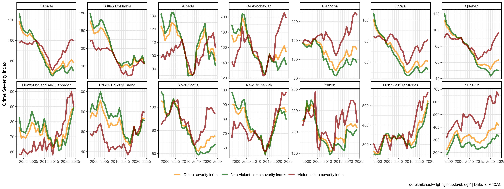
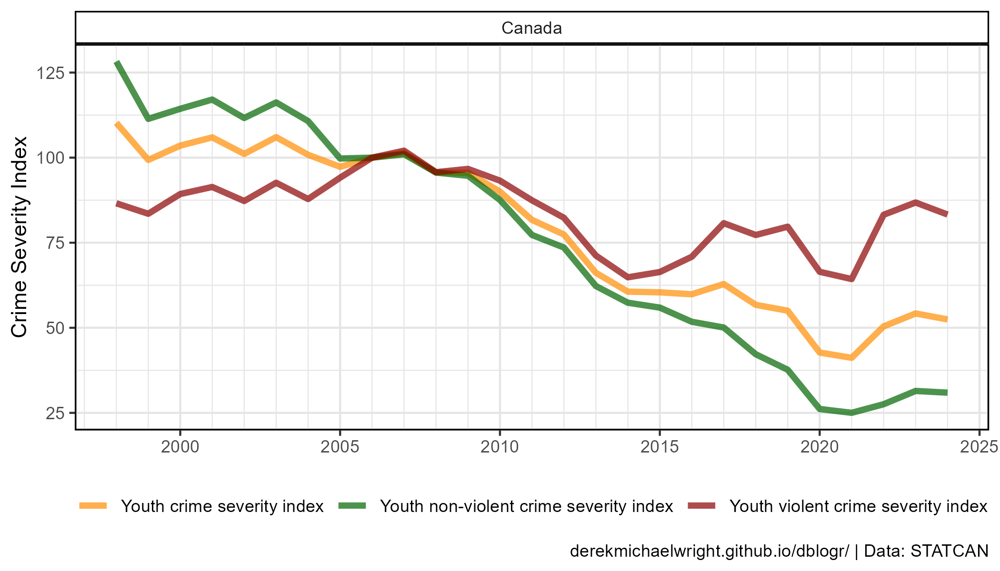
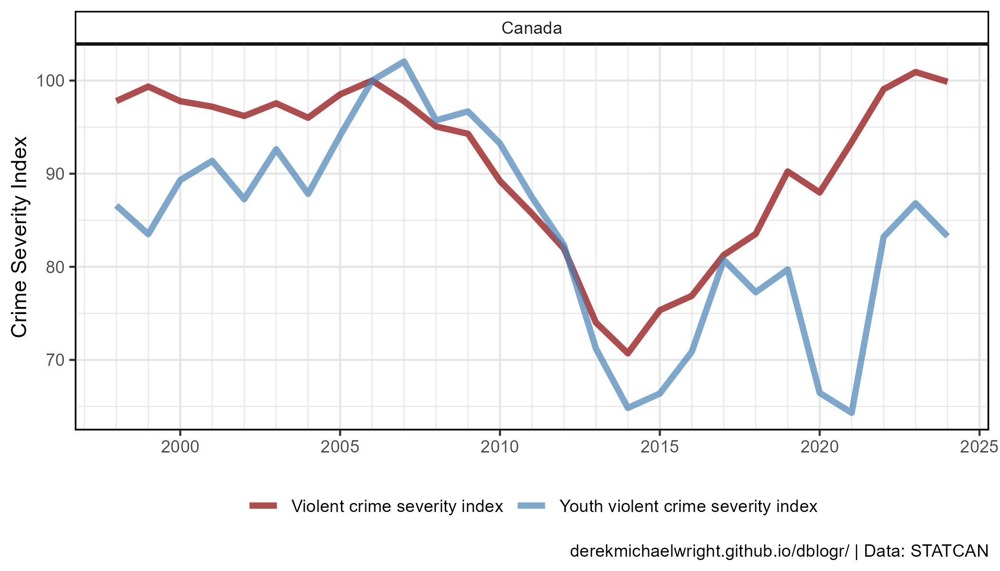
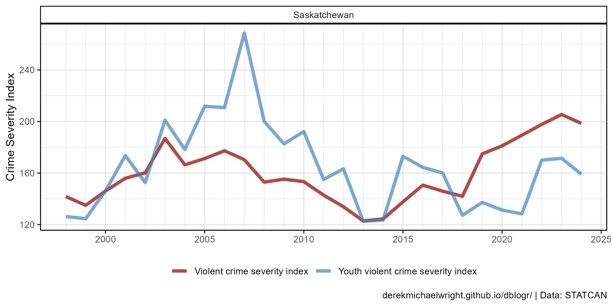
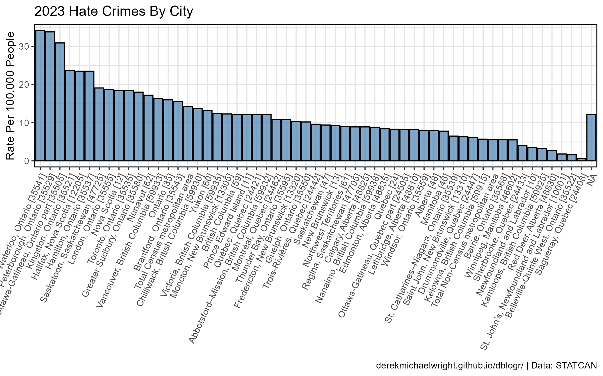
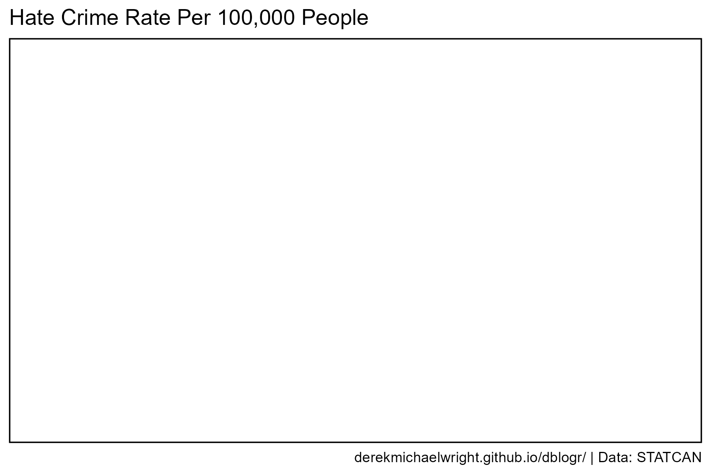
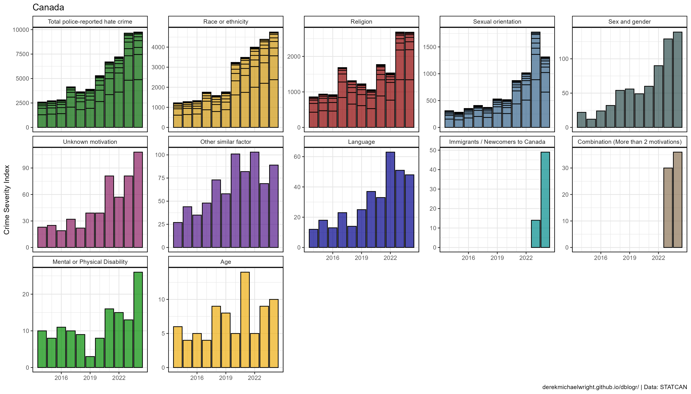
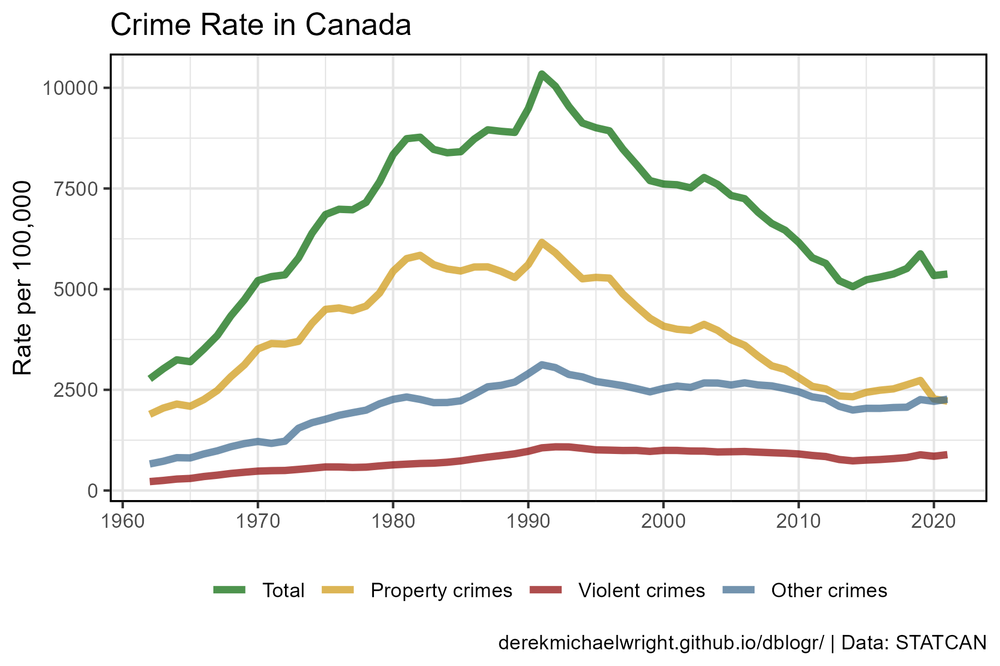
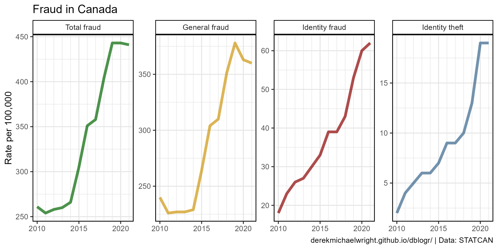

```{r setup, include=FALSE}
knitr::opts_chunk$set(echo = TRUE, message = F, warning = F)
```

---

# Data {.tabset .tabset-pills}

## STATCAN Table: 35-10-0026-01

Crime severity index and weighted clearance rates, Canada, provinces, territories and Census Metropolitan Areas

> - `r shiny::icon("globe")` [https://www150.statcan.gc.ca/t1/tbl1/en/cv.action?pid=3510002601](https://www150.statcan.gc.ca/t1/tbl1/en/cv.action?pid=3510002601){target="_blank"}
> - `r shiny::icon("save")` [3510002601_databaseLoadingData.csv](3510002601_databaseLoadingData.csv)

## STATCAN Table: 35-10-0191-01

Police-reported hate crime, number of incidents and rate per 100,000 population, Provinces, Territories, Census Metropolitan Areas and Canadian Forces Military Police

> - `r shiny::icon("globe")` [https://www150.statcan.gc.ca/t1/tbl1/en/cv.action?pid=3510019101](https://www150.statcan.gc.ca/t1/tbl1/en/cv.action?pid=3510019101){target="_blank"}
> - `r shiny::icon("save")` [3510019101_databaseLoadingData.csv](3510019101_databaseLoadingData.csv)

## STATCAN Table: 35-10-0066-01

Police-reported hate crime, by type of motivation, selected regions and Canada (selected police services)

> - `r shiny::icon("globe")` [https://www150.statcan.gc.ca/t1/tbl1/en/cv.action?pid=3510006601](https://www150.statcan.gc.ca/t1/tbl1/en/cv.action?pid=3510006601){target="_blank"}
> - `r shiny::icon("save")` [3510006601_databaseLoadingData.csv](3510006601_databaseLoadingData.csv)

## Police-reported crime statistics

> - `r shiny::icon("globe")` [https://www150.statcan.gc.ca/n1/daily-quotidien/210329/dq210329a-eng.htm](https://www150.statcan.gc.ca/n1/daily-quotidien/210329/dq210329a-eng.htm){target="_blank"}
> - `r shiny::icon("globe")` [https://www150.statcan.gc.ca/n1/pub/85-002-x/2022001/article/00013-eng.htm](https://www150.statcan.gc.ca/n1/pub/85-002-x/2022001/article/00013-eng.htm){target="_blank"}
> - `r shiny::icon("save")` [data_canada_crime.xlsx](data_canada_crime.xlsx)

---

# Prepare Data

```{r class.source = 'fold-show'}
# devtools::install_github("derekmichaelwright/agData")
library(agData)
library(readxl) # read_xlsx()
```

```{r}
# Prep data
myCaption <- "derekmichaelwright.github.io/dblogr/blog/canada_crime | Data: STATCAN"
myColors <- c("darkorange", "darkgreen", "darkred")
myAreas <- c("Canada", 
    "British Columbia", "Alberta", "Saskatchewan", "Manitoba",
    "Ontario", "Quebec", "Newfoundland and Labrador", 
    "Prince Edward Island", "Nova Scotia", "New Brunswick",
    "Yukon", "Northwest Territories", "Nunavut",
             
    "Kelowna, British Columbia", "Abbotsford-Mission, British Columbia",
    "Vancouver, British Columbia", "Victoria, British Columbia",
    "Lethbridge, Alberta", "Calgary, Alberta", "Edmonton, Alberta",
    "Regina, Saskatchewan", "Saskatoon, Saskatchewan", "Winnipeg, Manitoba",
    "Saguenay, Quebec", "Québec, Quebec", "Sherbrooke, Quebec",
    "Trois-Rivières, Quebec", "Montréal, Quebec", "Ottawa-Gatineau, Quebec part",
    "Ottawa-Gatineau, Ontario/Quebec", "Ottawa-Gatineau, Ontario part",
    "Kingston, Ontario", "Belleville, Ontario", "Peterborough, Ontario",
    "Toronto, Ontario", "Hamilton, Ontario", "St.Catharines-Niagara, Ontario",
    "Kitchener-Cambridge-Waterloo, Ontario", "Brantford, Ontario",
    "Guelph, Ontario", "London, Ontario", "Windsor, Ontario", "Barrie, Ontario",
    "Greater Sudbury, Ontario", "Thunder Bay, Ontario",
    "St. John's, Newfoundland and Labrador", "Halifax, Nova Scotia",
    "Moncton, New Brunswick", "Saint John, New Brunswick" )
d1 <- read.csv("3510002601_databaseLoadingData.csv") %>%
  select(Year=1, Area=GEO, Measurement=Statistics, Unit=UOM, Value=VALUE) %>%
  mutate(Area = ifelse(Area == "Canada", Area, 
                       substr(.$Area, 1, regexpr("\\[", .$Area)-2)),
         Area = factor(Area, levels = myAreas))
d1.1 <- d1 %>% filter(!grepl("Youth",Measurement))
d1.2 <- d1 %>% filter(grepl("Youth",Measurement))
d1.3 <- d1 %>% filter(Measurement %in% c("Violent crime severity index",
                                       "Youth violent crime severity index"))
#
myWCities <- c("Vancouver, British Columbia", "Victoria, British Columbia",
              "Kelowna, British Columbia", "Calgary, Alberta", 
              "Edmonton, Alberta", "Lethbridge, Alberta", 
              "Regina, Saskatchewan", "Saskatoon, Saskatchewan",
              "Winnipeg, Manitoba")
myNonCities <- c("Total Census metropolitan area", "Total Non-Census metropolitan area",
                 "Total police-reported hate crime", "Canadian Forces Military Police")
d2 <- read.csv("3510019101_databaseLoadingData.csv") %>%
  select(Year=1, Area=GEO, Measurement=Statistics, Unit=UOM, Value=VALUE) %>% 
  arrange(desc(Value)) %>%
  mutate(Area = ifelse(Area %in% myNonCities, Area,
                       substr(Area, 1, regexpr("\\[", Area)-2))) %>%
  mutate(Area = factor(Area, levels = unique(Area)),
         Group = ifelse(Area %in% myWCities, "West", "East"),
         Group = factor(Group, levels = c("West", "East")))
#
d3 <- read.csv("3510006601_databaseLoadingData.csv") %>%
  select(Year=1, Area=GEO, Motive=Type.of.motivation, Unit=UOM, Value=VALUE) %>%
  arrange(desc(Value)) %>%
  mutate(Motive = factor(Motive, levels = unique(.$Motive)),
         Area = gsub(", selected police services", "", Area),
         Area = ifelse(Area == "Canada", Area,
                       substr(Area, 1, regexpr("\\[", Area)-2)) )
#
d4 <- read_xlsx("data_canada_crime.xlsx", "Sexual Assault")
#
myTraits <- c("Total", "Property crimes", "Violent crimes", "Other crimes")
d5 <- read_xlsx("data_canada_crime.xlsx", "Crime Rates") %>%
  gather(Trait, Value, 3:ncol(.)) %>%
  mutate(Trait = factor(Trait, levels = myTraits))
#
myTraits <- c("Total fraud", "General fraud", "Identity fraud", "Identity theft")
d6 <- read_xlsx("data_canada_crime.xlsx", "Fraud") %>%
  gather(Trait, Value, 3:ncol(.)) %>%
  mutate(Trait = factor(Trait, levels = myTraits))
```

```{r echo = F, eval = F}
myAreas <- c("Canada", 
             "British Columbia [59]",
             "Alberta [48]",
             "Saskatchewan [47]",
             "Manitoba [46]",
             "Ontario [35]", 
             "Quebec [24]",
             "Newfoundland and Labrador [10]", 
             "Prince Edward Island [11]", 
             "Nova Scotia [12]", 
             "New Brunswick [13]",
             "Yukon [60]",
             "Northwest Territories [61]",
             "Nunavut [62]",
             
             "Kelowna, British Columbia [59915]",
             "Abbotsford-Mission, British Columbia [59932]",
             "Vancouver, British Columbia [59933]",
             "Victoria, British Columbia [59935]",
             "Lethbridge, Alberta [48810]",
             "Calgary, Alberta [48825]",
             "Edmonton, Alberta [48835]",
             "Regina, Saskatchewan [47705]",
             "Saskatoon, Saskatchewan [47725]",
             "Winnipeg, Manitoba [46602]",
             
             "Saguenay, Quebec [24408]",
             "Québec, Quebec [24421]",
             "Sherbrooke, Quebec [24433]",
             "Trois-Rivières, Quebec [24442]",
             "Montréal, Quebec [24462]",
             "Ottawa-Gatineau, Quebec part [24505]",
             
             "Ottawa-Gatineau, Ontario/Quebec [24505/35505]",
             "Ottawa-Gatineau, Ontario part [35505]",
             "Kingston, Ontario [35521]",
             "Belleville, Ontario [35522]",
             "Peterborough, Ontario [35529]",
             "Toronto, Ontario [35535]",
             "Hamilton, Ontario [35537]",
             "St.Catharines-Niagara, Ontario [35539]",
             "Kitchener-Cambridge-Waterloo, Ontario [35541]",
             "Brantford, Ontario [35543]",
             "Guelph, Ontario [35550]",
             "London, Ontario [35555]",
             "Windsor, Ontario [35559]", 
             "Barrie, Ontario [35568]",
             "Greater Sudbury, Ontario [35580]",
             "Thunder Bay, Ontario [35595]",
             
             "St. John's, Newfoundland and Labrador [10001]",
             "Halifax, Nova Scotia [12205]",
             "Moncton, New Brunswick [13305]",
             "Saint John, New Brunswick [13310]" )
```

---

# Crime Severity Index {.tabset .tabset-pills}

## Canada


```{r}
# Prep data
xx <- d1.1 %>% filter(Area == "Canada")
# Plot
mp <- ggplot(xx, aes(x = Year, y = Value, color = Measurement)) + 
  geom_line(size = 1.5, alpha = 0.7) +
  facet_wrap(Area ~ .) +
  scale_color_manual(name = NULL, values = myColors) +
  scale_x_continuous(minor_breaks = 1995:2025) +
  theme_agData(legend.position = "bottom") +
  labs(y = "Crime Severity Index", x = NULL,
       caption = myCaption)
ggsave("canada_crime_1_01.png", mp, width = 7, height = 4)
```

```{r echo = F}
ggsave("featured.png", mp, width = 7, height = 4)
```

```{r eval = F, echo = F}
# Prep data
xx <- d1.1 %>% filter(Area == "Canada", Year > 2005, Measurement == "Violent crime severity index") %>%
  mutate(Values_m = ifelse(Year < 2016, Value, NA))
fit <- lm(Values_m ~ Year, data = xx)
xx <- xx %>% mutate(Values_p = as.numeric(predict(fit, newdata = xx)))
xd1.2 <- d1.1 %>% filter(Year < 2016)
xd1.3 <- d1.1 %>% filter(Year > 2015)
# Plot
mp <- ggplot(xx, aes(x = Year)) + 
  geom_line(aes(y = Value), size = 1.5, alpha = 0.7) +
  geom_point(aes(y = Value)) +
  geom_smooth(aes(y = Values_p)) +
              
  scale_x_continuous(minor_breaks = 1995:2025) #+
  #theme_agData(legend.position = "bottom") +
  #labs(y = "Crime Severity Index", x = NULL,
  #     caption = myCaption)
ggsave("canada_crime_1_01.png", mp, width = 7, height = 4)
yy <- xx %>% filter(Year > 2015) %>%
  select(Year, Observed=Value, Expected=Values_p)
chisq.test(yy)
chisq.test(x = yy$Observed, y = yy$Expected)
yy <- yy %>% mutate(Chi2 = (Observed - Expected)^2 / Expected)
sum(yy$Chi2)
((yy$Value[1]- yy$Values_p[1])^2 / xx$Values_p[1]) +
  ((xx$Seeds[2]- xx$Values_p[2])^2 / xx$Values_p[2])
```

---

## Provinces



```{r}
# Prep data
xx <- d1.1 %>% filter(Area %in% myAreas[1:14])
# Plot
mp <- ggplot(xx, aes(x = Year, y = Value, color = Measurement)) + 
  geom_line(size = 1.5, alpha = 0.7) +
  facet_wrap(Area ~ ., scales = "free_y", ncol = 7) +
  scale_color_manual(name = NULL, values = myColors) +
  scale_x_continuous(minor_breaks = 1998:2025) +
  theme_agData(legend.position = "bottom") +
  labs(y = "Crime Severity Index", x = NULL, caption = myCaption)
ggsave("canada_crime_1_02.png", mp, width = 16, height = 6)
```

---

## Cities


```{r}
# Prep data
xx <- d1.1 %>% filter(Area %in% myAreas[15:length(myAreas)])
# Plot
mp <- ggplot(xx, aes(x = Year, y = Value, color = Measurement)) + 
  geom_line(size = 1.5, alpha = 0.7) +
  facet_wrap(Area ~ ., scales = "free_y", ncol = 6) +
  scale_color_manual(name = NULL, values = myColors) +
  scale_x_continuous(minor_breaks = 1998:2025) +
  theme_agData(legend.position = "bottom") +
  labs(y = "Crime Severity Index", x = NULL, caption = myCaption)
ggsave("canada_crime_1_03.png", mp, width = 16, height = 10)
```

---

# Youth Crime Severity Index {.tabset .tabset-pills}

## Canada



```{r}
# Prep data
xx <- d1.2 %>% filter(Area == "Canada")
# Plot
mp <- ggplot(xx, aes(x = Year, y = Value, color = Measurement)) + 
  geom_line(size = 1.5, alpha = 0.7) +
  facet_wrap(Area ~ .) +
  scale_color_manual(name = NULL, values = myColors) +
  scale_x_continuous(minor_breaks = 1995:2025) +
  theme_agData(legend.position = "bottom") +
  labs(y = "Crime Severity Index", x = NULL, caption = myCaption)
ggsave("canada_crime_1_04.png", mp, width = 7, height = 4)
```

---

## Provinces


```{r}
# Prep data
xx <- d1.2 %>% filter(Area %in% myAreas[1:14])
# Plot
mp <- ggplot(xx, aes(x = Year, y = Value, color = Measurement)) + 
  geom_line(size = 1.5, alpha = 0.7) +
  facet_wrap(Area ~ ., scales = "free_y", ncol = 7) +
  scale_color_manual(name = NULL, values = myColors) +
  scale_x_continuous(minor_breaks = 1998:2025) +
  theme_agData(legend.position = "bottom") +
  labs(y = "Crime Severity Index", x = NULL, caption = myCaption)
ggsave("canada_crime_1_05.png", mp, width = 16, height = 6)
```

---

# Violent Crime {.tabset .tabset-pills}

## Canada



```{r}
# Prep data
xx <- d1.3 %>% filter(Area == "Canada")
# Plot
mp <- ggplot(xx, aes(x = Year, y = Value, color = Measurement)) + 
  geom_line(size = 1.5, alpha = 0.7) +
  facet_wrap(Area ~ .) +
  scale_color_manual(name = NULL, values = c("darkred", "steelblue")) +
  scale_x_continuous(minor_breaks = 1995:2025) +
  theme_agData(legend.position = "bottom") +
  labs(y = "Crime Severity Index", x = NULL, caption = myCaption)
ggsave("canada_crime_1_06.png", mp, width = 7, height = 4)
```

---

## Provinces


```{r}
# Prep data
xx <- d1.3 %>% filter(Area %in% myAreas[1:14])
# Plot
mp <- ggplot(xx, aes(x = Year, y = Value, color = Measurement)) + 
  geom_line(size = 1.5, alpha = 0.7) +
  facet_wrap(Area ~ ., scales = "free_y", ncol = 7) +
  scale_color_manual(name = NULL, values = c("darkred", "steelblue")) +
  scale_x_continuous(minor_breaks = 1998:2025) +
  theme_agData(legend.position = "bottom") +
  labs(y = "Crime Severity Index", x = NULL, caption = myCaption)
ggsave("canada_crime_07.png", mp, width = 16, height = 6)
```

---

# Saskatchewan {.tabset .tabset-pills}

## Crime Severity Index


```{r}
# Prep data
xx <- d1.1 %>% filter(Area == "Saskatchewan")
# Plot
mp <- ggplot(xx, aes(x = Year, y = Value, color = Measurement)) + 
  geom_line(size = 1.5, alpha = 0.7) +
  facet_wrap(Area ~ .) +
  scale_color_manual(name = NULL, values = myColors) +
  scale_x_continuous(minor_breaks = 1995:2025) +
  theme_agData(legend.position = "bottom") +
  labs(y = "Crime Severity Index", x = NULL, caption = myCaption)
ggsave("canada_crime_1_08.png", mp, width = 8, height = 4)
```

---

## Youth Crime Severity Index


```{r}
# Prep data
xx <- d1.2 %>% filter(Area == "Saskatchewan")
# Plot
mp <- ggplot(xx, aes(x = Year, y = Value, color = Measurement)) + 
  geom_line(size = 1.5, alpha = 0.7) +
  facet_wrap(Area ~ .) +
  scale_color_manual(name = NULL, values = myColors) +
  scale_x_continuous(minor_breaks = 1995:2025) +
  theme_agData(legend.position = "bottom") +
  labs(y = "Crime Severity Index", x = NULL, caption = myCaption)
ggsave("canada_crime_1_09.png", mp, width = 8, height = 4)
```

---

## Violent Crime



```{r}
# Prep data
xx <- d1.3 %>% filter(Area == "Saskatchewan")
# Plot
mp <- ggplot(xx, aes(x = Year, y = Value, color = Measurement)) + 
  geom_line(size = 1.5, alpha = 0.7) +
  facet_wrap(Area ~ .) +
  scale_color_manual(name = NULL, values = c("darkred", "steelblue")) +
  scale_x_continuous(minor_breaks = 1995:2025) +
  theme_agData(legend.position = "bottom") +
  labs(y = "Crime Severity Index", x = NULL, caption = myCaption)
ggsave("canada_crime_1_10.png", mp, width = 8, height = 4)
```

---

# Hate Crimes {.tabset .tabset-pills}

## All Cities


```{r}
# Plot
mp <- ggplot(d2, aes(x = Year, y = Value, fill = Group)) + 
  geom_col(color = "black", alpha = 0.7) +
  facet_wrap(Area ~ ., ncol = 6) +
  scale_fill_manual(values = c("steelblue", "darkred")) +
  scale_x_continuous(breaks = 2014:2025) +
  theme_agData(legend.position = "none",
               axis.text.x = element_text(angle = 45, hjust = 1)) +
  labs(title = "Hate Crime Rate Per 100,000 People", 
       y = NULL, x = NULL, caption = myCaption)
ggsave("canada_crime_2_01.png", mp, width = 16, height = 16)
```

---

## 2021



```{r}
# Prep data
xx <- d2 %>% filter(Year == 2023) %>%
  arrange(desc(Value)) %>%
  mutate(Area = factor(Area, levels = unique(.$Area)))
# Plot
mp <- ggplot(xx, aes(x = Area, y = Value, fill = Group)) + 
  geom_col(color = "black", alpha = 0.7) +
  scale_fill_manual(values = c("steelblue", "darkred")) +
  theme_agData(legend.position = "none",
               axis.text.x = element_text(angle = 80, hjust = 1)) +
  labs(title = "2023 Hate Crimes By City", x = NULL,
       y = "Rate Per 100,000 People", caption = myCaption)
ggsave("canada_crime_2_02.png", mp, width = 8, height = 5)
```

---

## Ottawa vs Regina



```{r}
# Prep data
myCities <- c("Regina, Saskatchewan", "Ottawa, Ontario")
xx <- d2 %>% filter(Area %in% myCities) %>%
  mutate(Area = factor(Area, levels = myCities))
# Plot
mp <- ggplot(xx, aes(x = Year, y = Value, fill = Area)) + 
  geom_col(position = "dodge", color = "black", alpha = 0.7) +
  scale_fill_manual(name = NULL, values = c("steelblue", "darkred")) +
  scale_x_continuous(breaks = min(xx$Year):max(xx$Year)) +
  theme_agData(legend.position = "bottom") +
  labs(title = "Hate Crime Rate Per 100,000 People", 
       y = NULL, x = NULL, caption = myCaption)
ggsave("canada_crime_2_03.png", mp, width = 6, height = 4)
```

---

## Hate Crime Types



```{r}
# Prep data
xx <- d3 %>% filter(Area == "Canada")
# Plot
mp <- ggplot(xx, aes(x = Year, y = Value, fill = Motive)) + 
  geom_col(color = "black", alpha = 0.7) +
  facet_wrap(Motive ~ ., scales = "free_y", ncol = 4) +
  scale_fill_manual(name = NULL, values = agData_Colors) +
  scale_x_continuous(minor_breaks = 2012:2021) +
  theme_agData(legend.position = "none") +
  labs(title = "Canada", x = NULL,
       y = "Crime Severity Index", caption = myCaption)
ggsave("canada_crime_3_01.png", mp, width = 12, height = 8)
```

---

# Other Crimes {.tabset .tabset-pills}

## Sexual Assault


```{r}
# Plot
mp <- ggplot(d4, aes(x = Year, y = Value)) + 
  geom_line(color = "darkred", size = 1.5, alpha = 0.7) +
  scale_x_continuous(breaks = seq(1985, 2025, by = 5), 
                     minor_breaks = 1985:2025) +
  theme_agData() +
  labs(title = "Sexual Assualts in Canada", y = "Rate per 100,000", x = NULL,
       caption = myCaption)
ggsave("canada_crime_4_01.png", mp, width = 6, height = 4)
```

---

## Property vs Violent Crime



```{r}
# Plot
mp <- ggplot(d5, aes(x = Year, y = Value, color = Trait)) + 
  geom_line(alpha = 0.7, size = 1.5) +
  scale_color_manual(name = NULL, values =  agData_Colors) +
  scale_x_continuous(breaks = seq(1960, 2025, by = 10), 
                     minor_breaks = seq(1960, 2025, by = 5)) +
  theme_agData(legend.position = "bottom") +
  labs(title  = "Crime Rate in Canada", x = NULL,
       y = "Rate per 100,000", caption = myCaption)
ggsave("canada_crime_5_01.png", mp, width = 6, height = 4)
```


## Fraud



```{r}
# Plot
mp <- ggplot(d6, aes(x = Year, y = Value, color = Trait)) + 
  geom_line(alpha = 0.7, size = 1.5) +
  facet_wrap(Trait ~ ., ncol = 4, scales = "free_y") +
  scale_color_manual(name = NULL, values = agData_Colors) +
  scale_x_continuous(breaks = seq(1985, 2025, by = 5), 
                     minor_breaks = 1985:2025) +
  theme_agData(legend.position = "none") +
  labs(title = "Fraud in Canada", x = NULL,
       y = "Rate per 100,000", caption = myCaption)
ggsave("canada_crime_6_01.png", mp, width = 8, height = 4)
```

---
