```{r setup, include=FALSE}
knitr::opts_chunk$set(echo = T, message = F, warning = F)
```

---

# Download Data

`r shiny::icon("globe")` https://www150.statcan.gc.ca/t1/tbl1/en/cv.action?pid=1310078301

`r shiny::icon("save")` [1310078301_databaseLoadingData.csv](1310078301_databaseLoadingData.csv)

`r shiny::icon("globe")` https://www150.statcan.gc.ca/t1/tbl1/en/cv.action?pid=1310076801

`r shiny::icon("save")` [1310076801_databaseLoadingData.csv](1310076801_databaseLoadingData.csv)

`r shiny::icon("globe")` https://www150.statcan.gc.ca/t1/tbl1/en/cv.action?pid=1310070801

`r shiny::icon("save")` [1310070801_databaseLoadingData.csv](1310070801_databaseLoadingData.csv)

`r shiny::icon("globe")` https://www150.statcan.gc.ca/t1/tbl1/en/cv.action?pid=1710000901

`r shiny::icon("save")` [1710000901_databaseLoadingData.csv](1710000901_databaseLoadingData.csv)

STATCAN Interactive Graph

`r shiny::icon("globe")` https://www150.statcan.gc.ca/n1/pub/71-607-x/71-607-x2020017-eng.htm

---

# Prepare Data

```{r class.source = 'fold-show'}
# devtools::install_github("derekmichaelwright/agData")
library(agData)
```

```{r}
# Prep data
myCaption1 <- c("www.dblogr.com/ or derekmichaelwright.github.io/dblogr/ | Data: STATCAN")
myCaption2 <- c("www.dblogr.com/ or derekmichaelwright.github.io/dblogr/ | Data: STATCAN\nNote: recent data may be incomplete")
myColors <- c("darkgreen", "darkred", "darkorange", "steelblue", "purple4", "magenta3")
myAreas <- c("Canada", "Quebec", "Ontario", "British Columbia", 
           "Alberta", "Saskatchewan", "Manitoba", "Nova Scotia",
           "Newfoundland and Labrador", "New Brunswick", "Prince Edward Island", 
           "Northwest Territories", "Nunavut", "Yukon")
#
# d1 = Deaths per Week (2010-2023)
mySeasons <- paste(2009:2023, 2010:2024, sep = "-")
myGroups <- c(rep("pre-COVID",10), mySeasons[11:length(mySeasons)])
d1 <- read.csv("1310078301_databaseLoadingData.csv") %>% 
  rename(Date=1, Area=GEO, Value=VALUE) %>%
  mutate(Date = as.Date(Date),
         Year  = as.numeric(substr(Date, 1, 4)),
         Month = as.numeric(substr(Date, 6, 7)),
         Group = ifelse(Year < 2020, "<2020", Year),
         Group = factor(Group, levels = c("<2020", "2020", "2021", "2022", "2023")),
         JulianDay = lubridate::yday(Date),
         AdjJulianDay = ifelse(Month < 8, JulianDay + 365, JulianDay),
         Area = gsub(", place of occurrence", "", Area),
         Area = factor(Area, levels = myAreas)) %>%
    arrange(Date)
# filter incomplete new data
for(i in unique(d1$Area)) {
  mymin <- d1 %>% filter(Area == i, Year < 2020) %>% pull(Value) %>% min()
  d1 <- d1 %>% filter(!(Area == i & Value < mymin))
}
# Calculate Year Group
j <- 1
for(i in 1:nrow(d1)) {
  if(d1$Month[i] < 8) { mySwitch <- T }
  d1$Season[i] <- mySeasons[j]
  d1$SeasonGroup[i] <- myGroups[j]
  if(d1$Month[i] > 7 & mySwitch == T) { j <- j + 1; mySwitch <- F } 
}
d1 <- d1 %>% 
    mutate(Season = factor(Season, levels = mySeasons),
           SeasonGroup = factor(SeasonGroup, levels = unique(myGroups)))
# d2 = Deaths per Week, by gender and age (2010-2023)
d2 <- read.csv("1310076801_databaseLoadingData.csv") %>% 
  rename(Date=1, Age=Age.at.time.of.death, Value=VALUE, Area=GEO) %>%
  mutate(Date = as.Date(Date),
         Age = gsub("Age at time of death, ", "", Age),
         Year  = as.numeric(substr(Date, 1, 4)),
         Month = as.numeric(substr(Date, 6, 7)),
         Group = ifelse(Year < 2020, "<2020", Year),
         Group = factor(Group, levels = c("<2020", "2020", "2021", "2022", "2023")),
         JulianDay = lubridate::yday(Date),
         AdjJulianDay = ifelse(Month < 8, JulianDay + 365, JulianDay),
         Area = gsub(", place of occurrence", "", Area),
         Area = factor(Area, levels = myAreas)) %>%
    arrange(Date)
# Calculate Year Group
j <- 1
for(i in 1:nrow(d2)) {
  if(d2$Month[i] < 8) { mySwitch <- T }
  d2$Season[i] <- mySeasons[j]
  d2$SeasonGroup[i] <- myGroups[j]
  if(d2$Month[i] > 7 & mySwitch == T) { j <- j + 1; mySwitch <- F } 
}
d2 <- d2 %>% 
    mutate(Season = factor(Season, levels = mySeasons),
           SeasonGroup = factor(SeasonGroup, levels = unique(myGroups)))
# d3 = Yearly death rate (1991-2023)
pp <- read.csv("1710000901_databaseLoadingData.csv") %>% 
  select(Area=GEO, Year=REF_DATE, Population=VALUE) %>%
  filter(Year %in% paste0(1991:2023,"-01")) %>%
  mutate(Year = as.numeric(gsub("-01","",Year)))
  #filter(Month == 1) %>% select(Area, Year, Population=Value)
yy <- d1 %>% filter(Year > 2020) %>% 
  group_by(Area, Year) %>%
  summarise(Value = sum(Value)) %>%
  mutate(Month.of.death = "Total")
d3 <- read.csv("1310070801_databaseLoadingData.csv") %>%
  rename(Year=1, Area=GEO, Value=VALUE, Unit=UOM) %>%
  mutate(Month.of.death = gsub("Month of death, |, month of death", "", 
                               Month.of.death),
         Area = gsub(", place of residence", "", Area),
         Area = factor(Area, levels = myAreas)) %>%
  filter(Unit == "Number") %>%
  bind_rows(yy) %>%
  rename(Total.Deaths=Value) %>%
  left_join(pp, by = c("Area", "Year")) %>%
  mutate(Death.Rate = 1000 * Total.Deaths / Population) %>%
  filter(Month.of.death == "Total", !is.na(Area)) %>%
  mutate(Group = ifelse(Year < 2020, "<2020", Year),
         Group = factor(Group, levels = c("<2020", "2020", "2021", "2022", "2023")))
```

---

# Total Deaths & Death Rates 1991-2022


```{r}
# Prep data
xx <- d3 %>% filter(Area == "Canada", Year < 2023)
# Plot
mp1 <- ggplot(xx, aes(x = Year, y = Total.Deaths / 1000, 
                      fill = Group, alpha = Group)) +
  geom_bar(stat = "identity", color = "black") +
  scale_fill_manual(name = NULL, values = myColors) +
  scale_alpha_manual(name = NULL, values = c(0.4,0.8,0.8,0.8,0.8,0.8)) +
  scale_x_continuous(breaks = c(1991, seq(1995,2020, by = 5))) +
  scale_y_continuous(minor_breaks = seq(0, 400, by = 20)) +
  theme_agData() +
  labs(subtitle = "(A) Total Number of Deaths Per Year in Canada", 
       y = "Thousand Deaths", x = NULL, caption = "")
mp2 <- ggplot(xx, aes(x = Year, y = Death.Rate, 
                      fill = Group, alpha = Group)) +
  geom_bar(stat = "identity", color = "black") +
  scale_fill_manual(name = NULL, values = myColors) +
  scale_alpha_manual(name = NULL, values = c(0.4,0.8,0.8,0.8,0.8,0.8)) +
  scale_x_continuous(breaks = c(1991, seq(1995,2020, by = 5))) +
  scale_y_continuous(minor_breaks = seq(0, 400, by = 20)) +
  theme_agData() +
  labs(subtitle = "(B) Death Rate Per Year in Canada", 
       y = "Deaths / Thousand", x = NULL, caption = myCaption1)
mp <- ggarrange(mp1, mp2, ncol = 2, legend = "none", common.legend = T)
ggsave("canada_deaths_01_01.png", mp, width = 10, height = 4, bg = "white")
```

---

# Total Deaths 2010-2023

```{r}
# Create plotting function
ggWeeklyDeaths <- function(area = "Canada", xmin = 2010, xmax = max(d1$Year)) {
  # Prep data
  vv <- as.Date(paste0(as.character(xmin:xmax),"-01-01"))
  xx <- d1 %>% filter(Area == area, Year >= xmin)
  #
  myMax <- max(xx %>% filter(Year < 2020) %>% pull(Value), na.rm = T)
  # Plot
  ggplot(xx, aes(x = Date, y = Value, fill = Group)) +
    geom_bar(stat = "identity", alpha = 0.7) +
    geom_vline(xintercept = vv, lty = 2, alpha = 0.5) +
    geom_vline(xintercept = as.Date("2020-03-01"), alpha = 0.6) +
    geom_hline(yintercept = myMax, alpha = 0.2) +
    #facet_grid(. ~ Area) +
    scale_fill_manual(values = myColors) +
    scale_x_date(date_breaks = "1 year", date_labels = "%Y", 
                 minor_breaks = "1 year") +
    theme_agData(legend.position = "none") +
    labs(title = area, y = "Weekly Deaths", x = NULL, caption = myCaption2)
}
```

---

### Canada

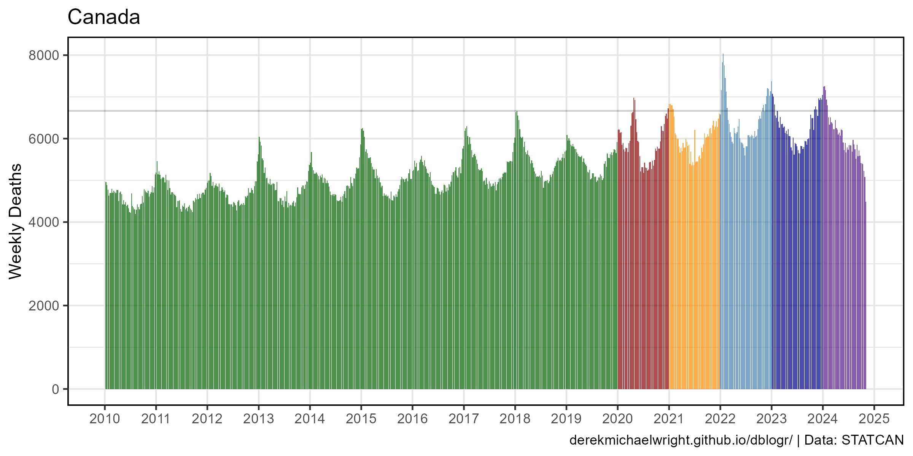

```{r}
mp <- ggWeeklyDeaths("Canada")
ggsave("canada_deaths_02_01.png", mp, width = 8, height = 4)
```

---

### Ontario

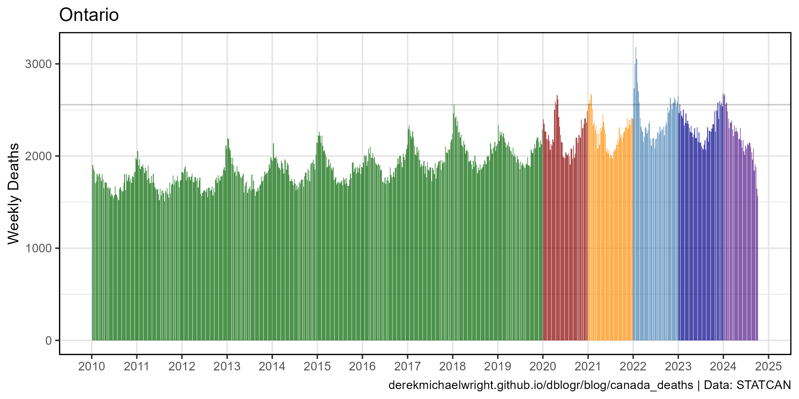

```{r}
mp <- ggWeeklyDeaths("Ontario")
ggsave("canada_deaths_02_02.png", mp, width = 8, height = 4)
```

---

### Quebec

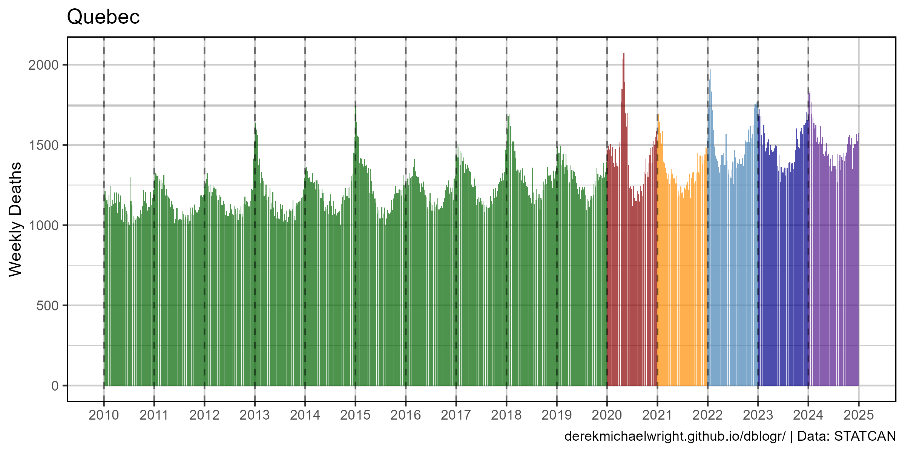

```{r}
mp <- ggWeeklyDeaths("Quebec")
ggsave("canada_deaths_02_03.png", mp, width = 8, height = 4)
```

---

### British Columbia

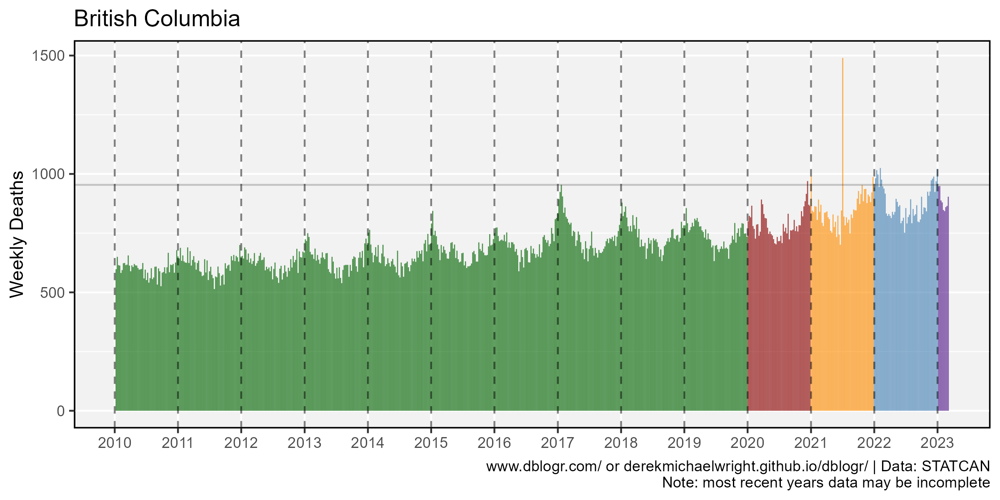

```{r}
mp <- ggWeeklyDeaths("British Columbia")
ggsave("canada_deaths_02_04.png", mp, width = 8, height = 4)
```

---

### Alberta

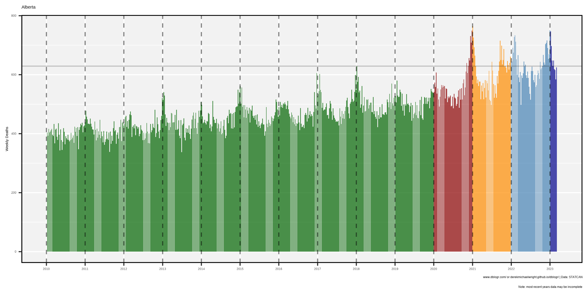

```{r}
mp <- ggWeeklyDeaths("Alberta")
ggsave("canada_deaths_02_05.png", mp, width = 8, height = 4)
```

---

### Saskatchewan

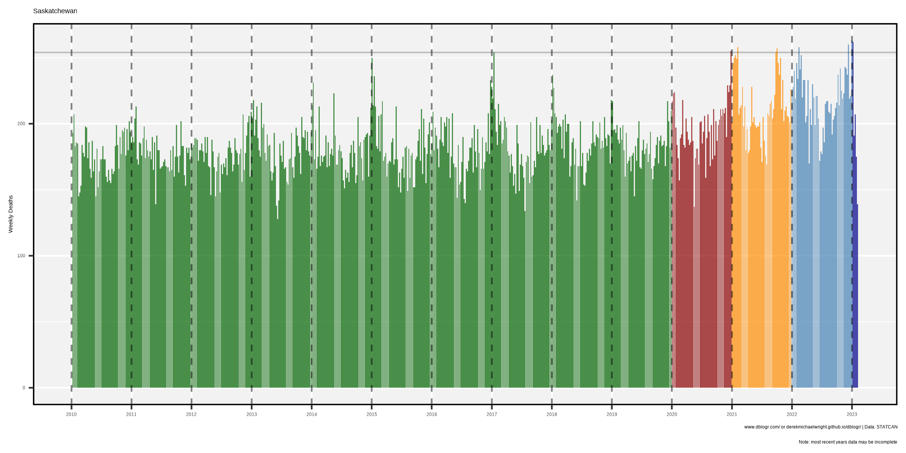

```{r}
mp <- ggWeeklyDeaths("Saskatchewan")
ggsave("canada_deaths_02_06.png", mp, width = 8, height = 4)
```

---

### Manitoba

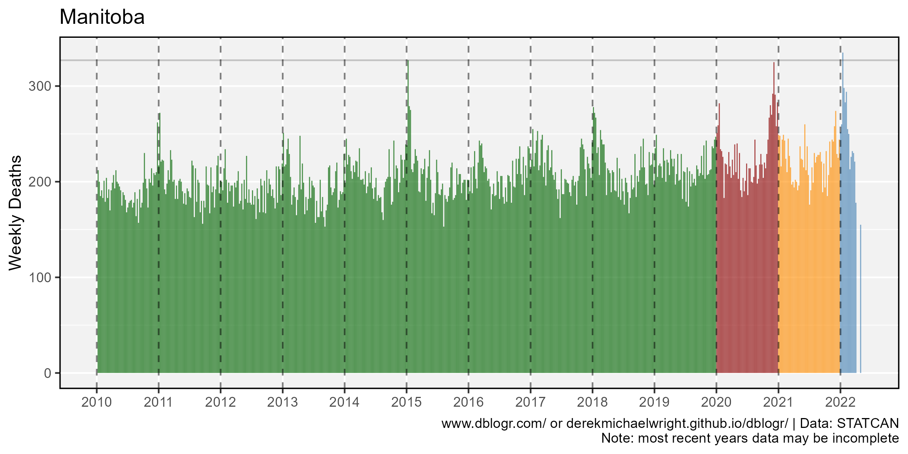

```{r}
mp <- ggWeeklyDeaths("Manitoba")
ggsave("canada_deaths_02_07.png", mp, width = 8, height = 4)
```

---

# Total Deaths 2016-2023

### Canada

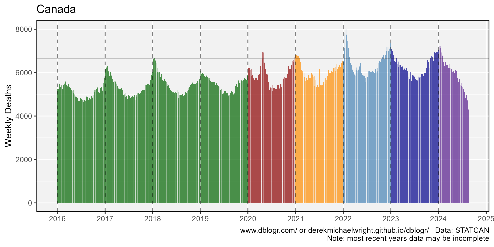

```{r}
mp <- ggWeeklyDeaths("Canada", xmin = 2016)
ggsave("canada_deaths_03_01.png", mp, width = 8, height = 4)
```

---

### Ontario

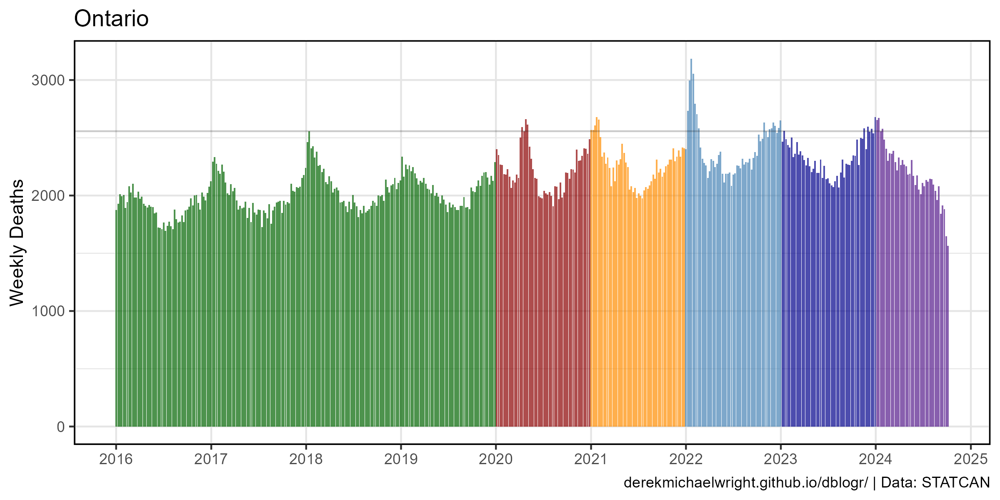

```{r}
mp <- ggWeeklyDeaths("Ontario", xmin = 2016)
ggsave("canada_deaths_03_02.png", mp, width = 8, height = 4)
```

---

### Quebec

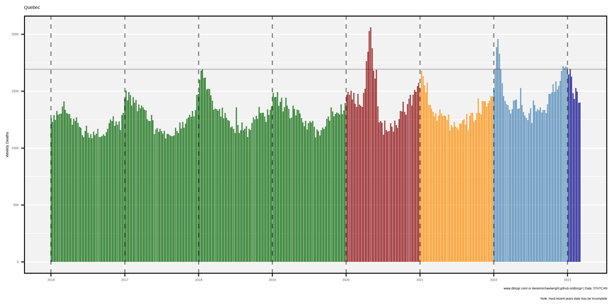

```{r}
mp <- ggWeeklyDeaths("Quebec", xmin = 2016)
ggsave("canada_deaths_03_03.png", mp, width = 8, height = 4)
```

---

### British Columbia

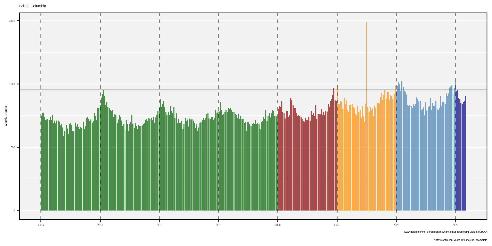

```{r}
mp <- ggWeeklyDeaths("British Columbia", xmin = 2016)
ggsave("canada_deaths_03_04.png", mp, width = 8, height = 4)
```

---

### Alberta

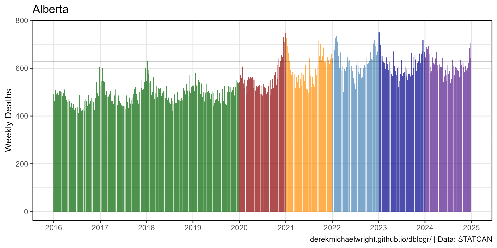

```{r}
mp <- ggWeeklyDeaths("Alberta", xmin = 2016)
ggsave("canada_deaths_03_05.png", mp, width = 8, height = 4)
```

---

### Saskatchewan

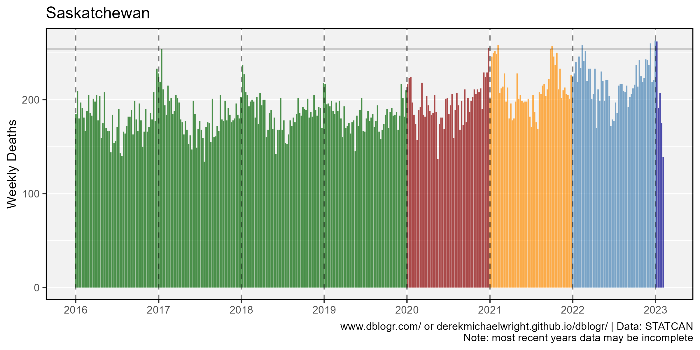

```{r}
mp <- ggWeeklyDeaths("Saskatchewan", xmin = 2016)
ggsave("canada_deaths_03_06.png", mp, width = 8, height = 4)
```

---

### Manitoba

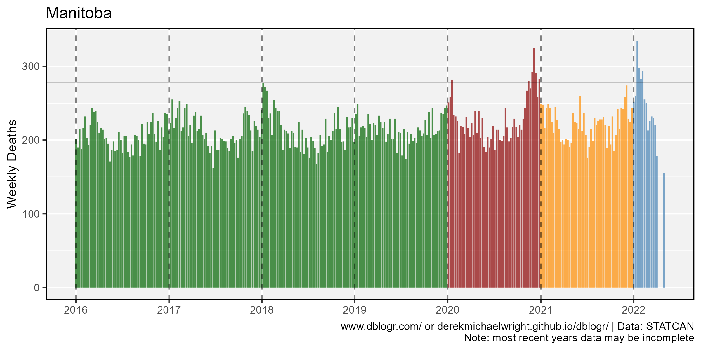

```{r}
mp <- ggWeeklyDeaths("Manitoba", xmin = 2016)
ggsave("canada_deaths_03_07.png", mp, width = 8, height = 4)
```

---

# Cummulative Deaths

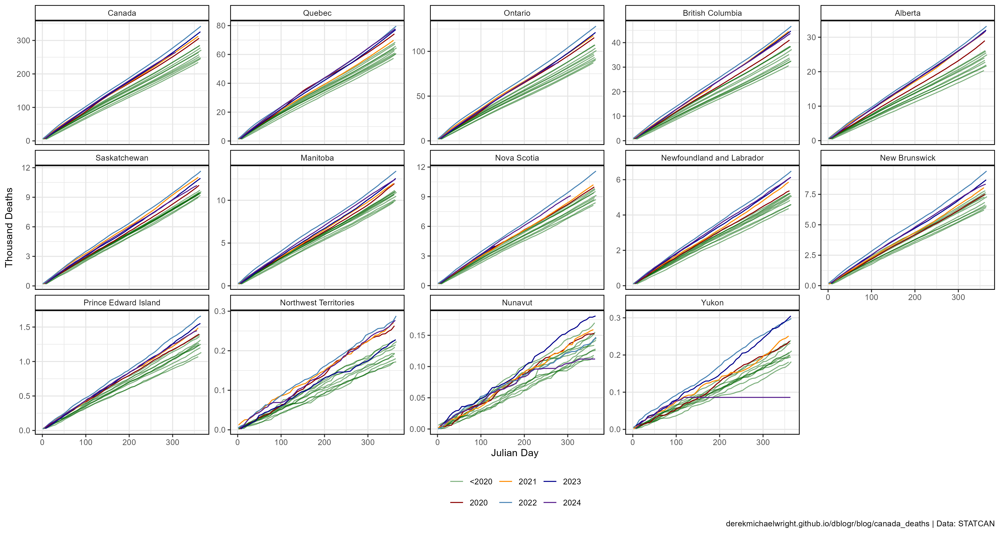

```{r}
# Prep data
xx <- d1 %>% mutate(Year = as.numeric(as.character(Year))) %>%
  select(Date, Year, JulianDay, Group, Area, Value) %>%
  arrange(Area, Date) %>%
  spread(Area, Value)
for(i in 5:ncol(xx)) {
  for(k in min(xx$Year):max(xx$Year)) {
    xx[xx$Year == k, i] <- cumsum(xx[xx$Year == k,i])
  }
}
xx <- xx %>% gather(Area, Value, 5:ncol(.)) %>%
  mutate(Area = factor(Area, levels = myAreas)) %>%
  filter(Area %in% myAreas)
# Plot
mp <- ggplot(xx, aes(x = JulianDay, y = Value / 1000, 
                     group = Year, color = Group, alpha = Group)) +
  geom_line() +
  facet_wrap(Area ~ ., scales = "free_y", ncol = 5) +
  scale_color_manual(name = NULL, values = myColors) +
  scale_alpha_manual(name = NULL, values = c(0.5,1,1,1,1)) +
  theme_agData(legend.position = "bottom") +
  labs(y = "Thousand Deaths", x = "Julian Day", caption = myCaption1)
#mp <- ggarrange(mp1, mp2, common.legend = T, legend = "bottom", align = "h")
ggsave("canada_deaths_04_01.png", mp, width = 15, height = 8)
```

```{r eval = F, echo = F}
# No legend

## Ontario vs Saskatchewan


# Prep data
xx <- d1 %>% 
  filter(Area %in% c("Saskatchewan", "Ontario"),
         Year < 2021) %>% 
  mutate(Year = factor(Year))
myColors1 <- c(rep("darkgreen",4), rep("darkorange",4), rep("darkred",4))
ltys1 <- c(1:4, 1:4, 1:4)
myColors2 <- c(rep("darkred",4), rep("darkorange",4), rep("darkgreen",4))
ltys2 <- c(4:1, 4:1, 4:1)
# Plot
mp1 <- ggplot(xx %>% filter(Area == "Ontario"), 
              aes(x = JulianDay, y = Value, lty = Year, color = Year)) +
  geom_line() +
  facet_wrap(Area ~ ., scales = "free_y", ncol = 5) +
  scale_color_manual(name = NULL, values = myColors1) +
  scale_linetype_manual(name = NULL, values = ltys1) +
  theme_agData(legend.position = "none") +
  labs(title = "A)", y = "Deaths Per Week", caption = "")
mp2 <- ggplot(xx %>% filter(Area == "Saskatchewan"), 
              aes(x = JulianDay, y = Value, lty = Year, color = Year)) +
  geom_line() +
  facet_wrap(Area ~ ., scales = "free_y", ncol = 5) +
  scale_color_manual(name = NULL, values = myColors2) +
  scale_linetype_manual(name = NULL, values = ltys2) +
  theme_agData(legend.position = "none") +
  labs(title = "B)", y = "Deaths Per Week", caption = myCaption1)
mp <- ggarrange(mp1, mp2, ncol = 2)
ggsave("canada_deaths_2_09.png", mp, width = 8, height = 4)

## Saskatchewan


mp <- mp2 + 
  labs(subtitle = NULL, y = "Deaths Per Week", caption = myCaption1)
ggsave("canada_deaths_2_10.png", mp, width = 6, height = 4)
```

```{r echo = F, eval = F}
# Prep data
library(ggradar)
xx <- d1 %>% filter(Area == "Canada", !Year %in% c(2010,2023)) %>% 
  select(Year, JulianDay, Value) %>%
  mutate(Week = paste("W",ceiling(JulianDay / 7))) %>%
  select(-JulianDay) %>%
  spread(Week, Value)
ggradar(xx, grid.min = 0, grid.max = 10000)#, plot.title = "Canada")#, legend.position = "bottom")
```

---

# Respiratory Season Graphs

```{r}
# Create plotting function
ggRespSeasons <- function(myAreas) {
  # Prep data
  xx <- d1 %>% filter(Area %in% myAreas)
  zz <- xx %>% filter(Date == "2020-03-14")
  #
  myBreaks <- c(213, 244, 274, 305, 335, 
                366, 397, 425, 456, 486, 517, 547, 577)
  myLabels <- c("Aug","Sept","Oct","Nov","Dec",
                "Jan","Feb","Mar","Apr", "May","June","July","Aug")
  # Plot
  ggplot(xx, aes(x = AdjJulianDay, y = Value, group = Season, 
                 color = SeasonGroup, alpha = SeasonGroup, size = SeasonGroup)) +
    geom_line() +
    geom_point(data = zz, size = 2, pch = 13, color = "black", alpha = 0.7) +
    facet_wrap(Area ~ ., scales = "free_y", ncol = 5) +
    scale_color_manual(name = NULL, values = myColors) +
    scale_alpha_manual(name = NULL, values = c(0.2,0.8,0.8,0.8,0.8,0.8)) +
    scale_size_manual(name = NULL, values = c(0.5,1,1,1,1,1)) +
    scale_x_continuous(breaks = myBreaks, labels = myLabels) +
    theme_agData(legend.position = "bottom",
                 axis.text.x = element_text(angle = 45, hjust = 1)) +
    labs(y = "Deaths Per Week", x = NULL, caption = myCaption2)
}
```

---

## Canada

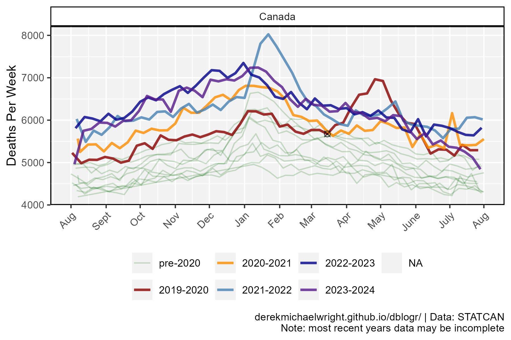

```{r}
mp <- ggRespSeasons(myAreas = myAreas)
ggsave("canada_deaths_05_01.png", mp, width = 15, height = 8)
```

---

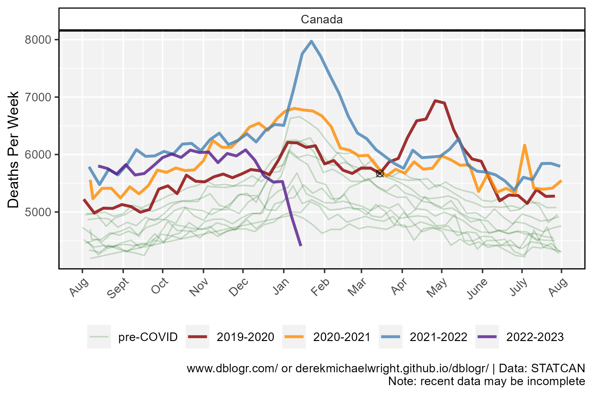

```{r}
mp <- ggRespSeasons(myAreas = "Canada")
ggsave("canada_deaths_05_02.png", mp, width = 6, height = 4)
```

---

## Ontario

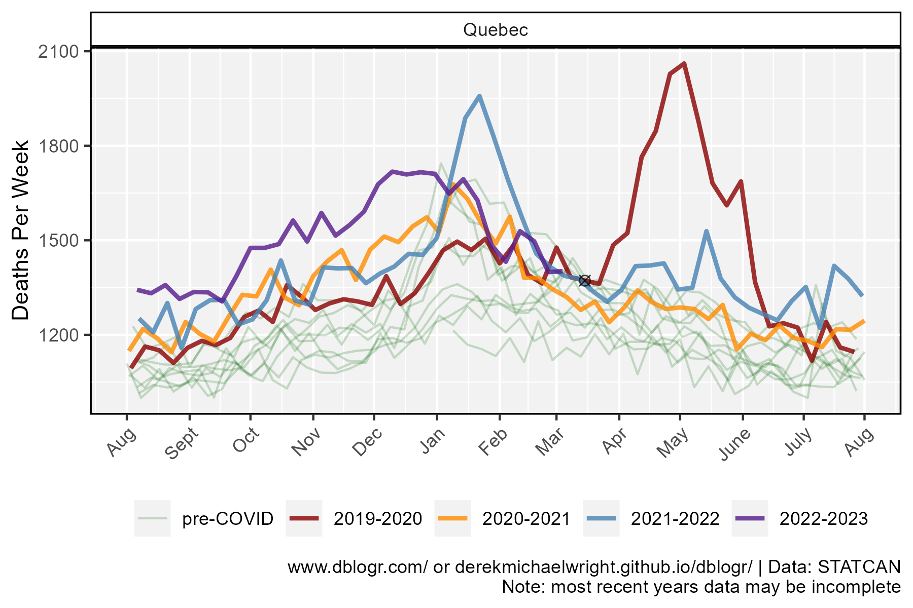

```{r}
mp <- ggRespSeasons(myAreas = "Ontario")
ggsave("canada_deaths_05_03.png", mp, width = 6, height = 4)
```

---

## Quebec

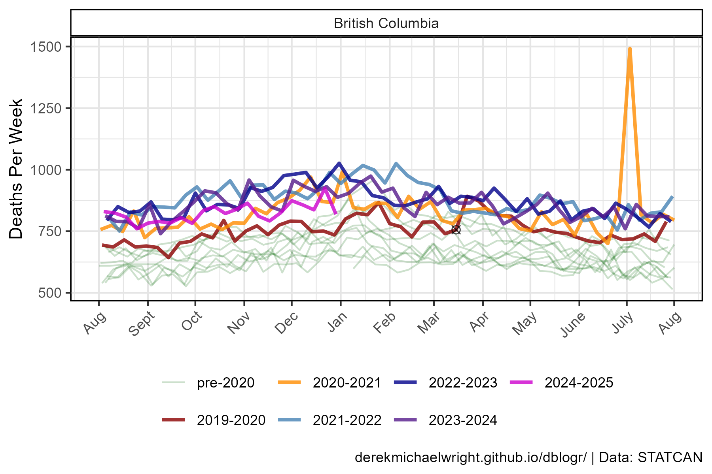

```{r}
mp <- ggRespSeasons(myAreas = "Quebec")
ggsave("canada_deaths_05_04.png", mp, width = 6, height = 4)
```

---

## British Columbia

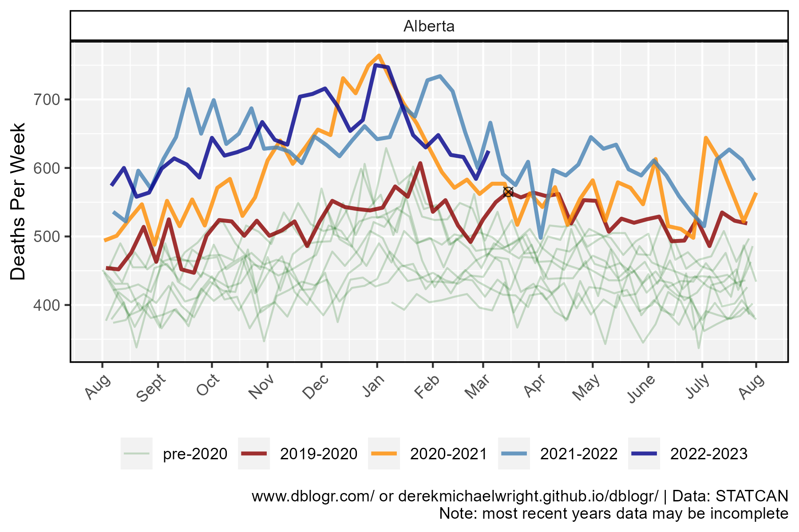

```{r}
mp <- ggRespSeasons(myAreas = "British Columbia")
ggsave("canada_deaths_05_05.png", mp, width = 6, height = 4)
```

---

## Alberta

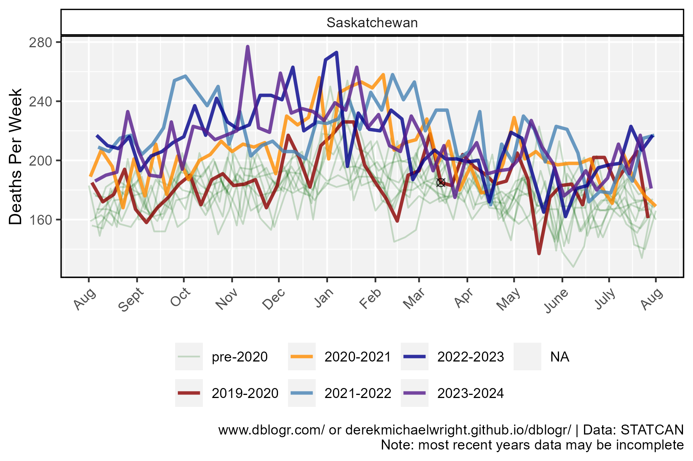

```{r}
mp <- ggRespSeasons(myAreas = "Alberta")
ggsave("canada_deaths_05_06.png", mp, width = 6, height = 4)
```

---

## Saskatchewan

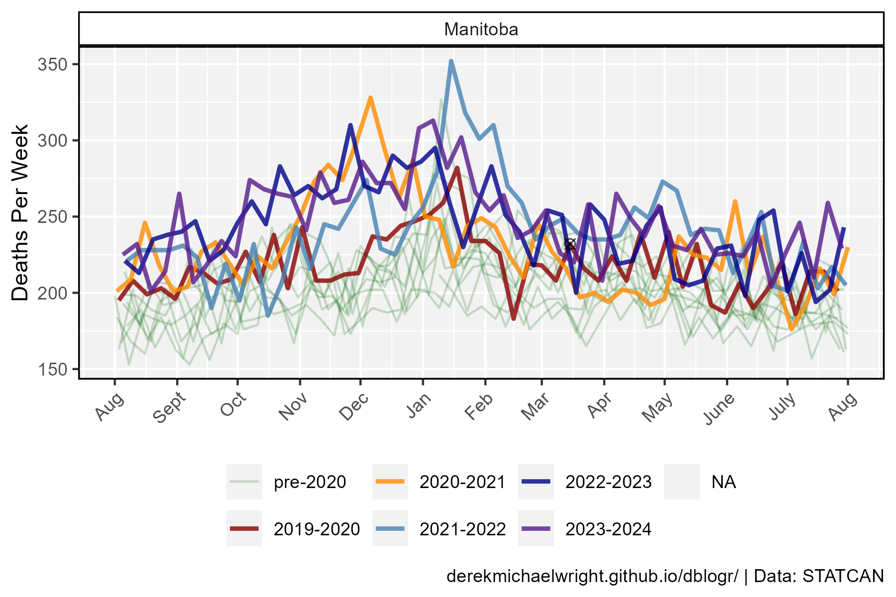

```{r}
mp <- ggRespSeasons(myAreas = "Saskatchewan")
ggsave("canada_deaths_05_07.png", mp, width = 6, height = 4)
```

---

## Manitoba

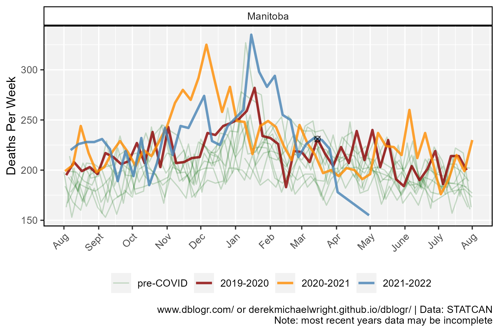

```{r}
mp <- ggRespSeasons(myAreas = "Manitoba")
ggsave("canada_deaths_05_08.png", mp, width = 6, height = 4)
```

---

# Respiratory Season Graphs by Age Group

```{r}
# Create plotting function
deathPlot3 <- function(myAreas = "Canada") {
  # Prep data
  xx <- d2 %>% filter(Area %in% myAreas, Sex == "Both sexes", Age != "all ages")
  zz <- xx %>% filter(Date == "2020-03-14")
  #
  myBreaks <- c(213, 244, 274, 305, 335, 
                366, 397, 425, 456, 486, 517, 547, 577)
  myLabels <- c("Aug","Sept","Oct","Nov","Dec",
                "Jan","Feb","Mar","Apr", "May","June","July", "Aug")
  # Plot
  ggplot(xx, aes(x = AdjJulianDay, y = Value, group = Season, 
                 color = SeasonGroup, alpha = SeasonGroup, size = SeasonGroup)) +
    geom_line() +
    geom_point(data = zz, size = 1.5, pch = 13, color = "black", alpha = 0.7) +
    facet_grid(Area ~ Age, scales = "free_y") +#labeller = label_wrap_gen(width = 10)
    scale_color_manual(name = NULL, values = myColors) +
    scale_alpha_manual(name = NULL, values = c(0.4,0.8,0.8,0.8,0.8)) +
    scale_size_manual(name = NULL, values = c(0.3,0.75,0.75,0.75,0.75,0.75)) +
    scale_x_continuous(breaks = myBreaks, labels = myLabels) +
    theme_agData(legend.position = "bottom",
                 axis.text.x = element_text(angle = 45, hjust = 1)) +
    labs(y = "Deaths Per Week", x = NULL, caption = myCaption2)
}
```

---

## Canada

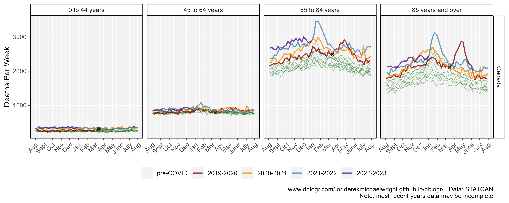

```{r}
mp <- deathPlot3(myAreas = "Canada")
ggsave("canada_deaths_06_01.png", mp, width = 10, height = 4)
```

```{r echo = F}
ggsave("featured.png", mp, width = 10, height = 4)
```

---

## Ontario

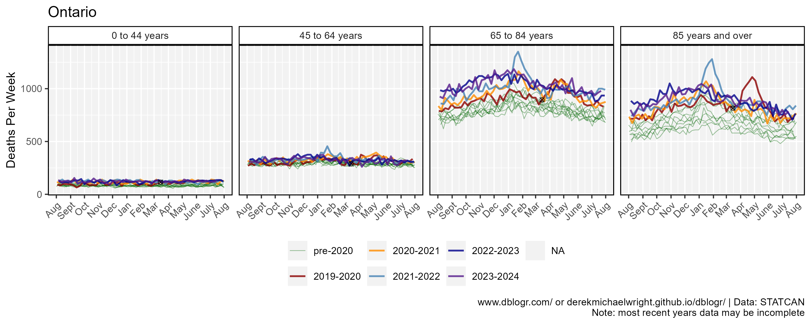

```{r}
mp <- deathPlot3(myAreas = "Ontario")
ggsave("canada_deaths_06_02.png", mp, width = 10, height = 4)
```

---

## Quebec

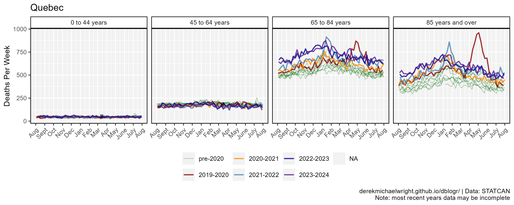

```{r}
mp <- deathPlot3(myAreas = "Quebec")
ggsave("canada_deaths_06_03.png", mp, width = 10, height = 4)
```

---

## British Columbia

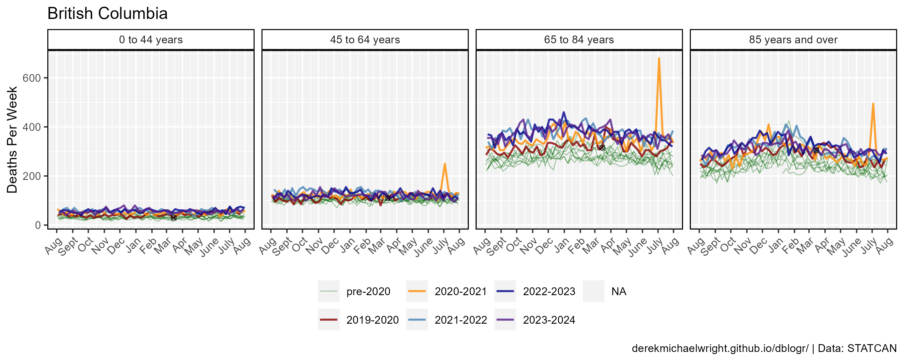

```{r}
mp <- deathPlot3(myAreas = "British Columbia")
ggsave("canada_deaths_06_04.png", mp, width = 10, height = 4)
```

---

## Alberta

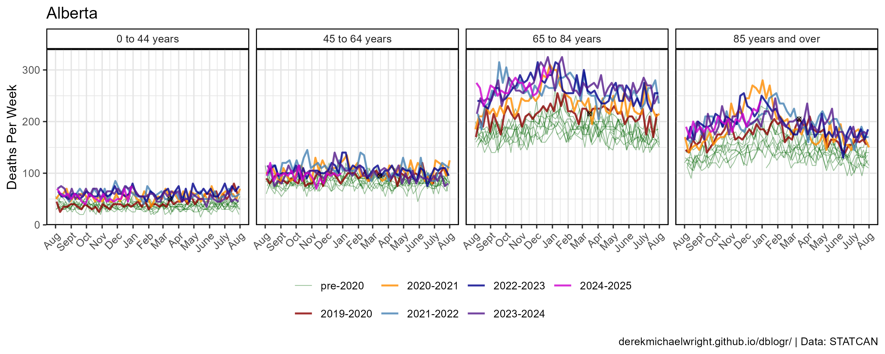

```{r}
mp <- deathPlot3(myAreas = "Alberta")
ggsave("canada_deaths_06_05.png", mp, width = 10, height = 4)
```

---

## Saskatchewan

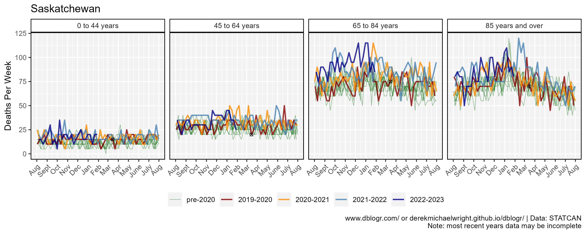

```{r}
mp <- deathPlot3(myAreas = "Saskatchewan")
ggsave("canada_deaths_06_06.png", mp, width = 10, height = 4)
```

---

## Eastern Canada

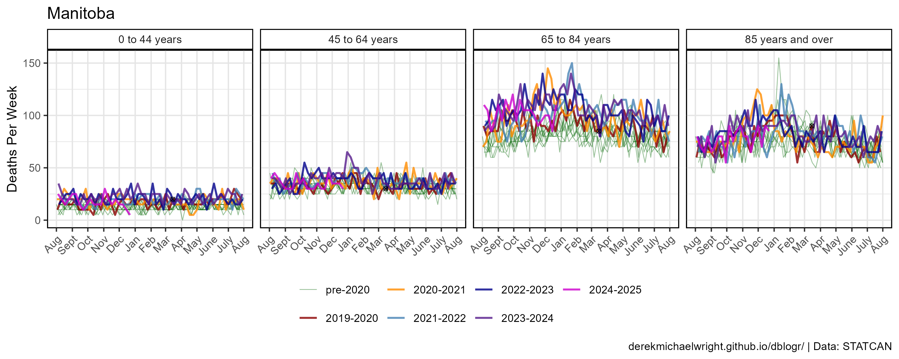

```{r}
myAreas <- c("Ontario", "Quebec", "Nova Scotia", 
           "Newfoundland and Labrador", "New Brunswick")
mp <- deathPlot3(myAreas = myAreas)
ggsave("canada_deaths_06_07.png", mp, width = 10, height = 8)
```

---

## Western Canada

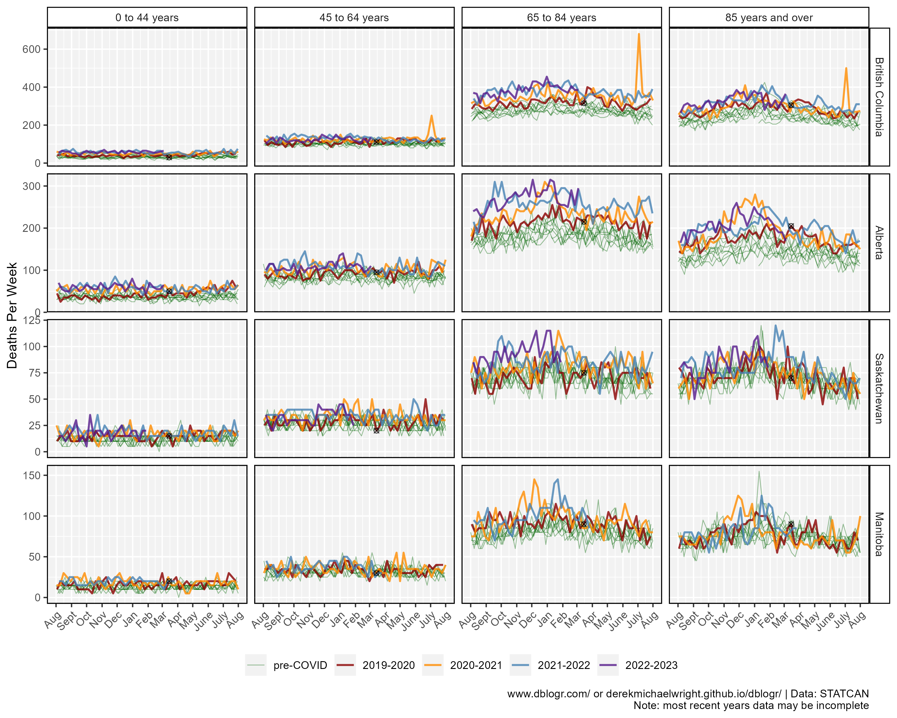

```{r}
myAreas <- c("British Columbia", "Alberta", "Saskatchewan", "Manitoba")
mp <- deathPlot3(myAreas = myAreas)
ggsave("canada_deaths_06_08.png", mp, width = 10, height = 8)
```

---

## Select Provinces

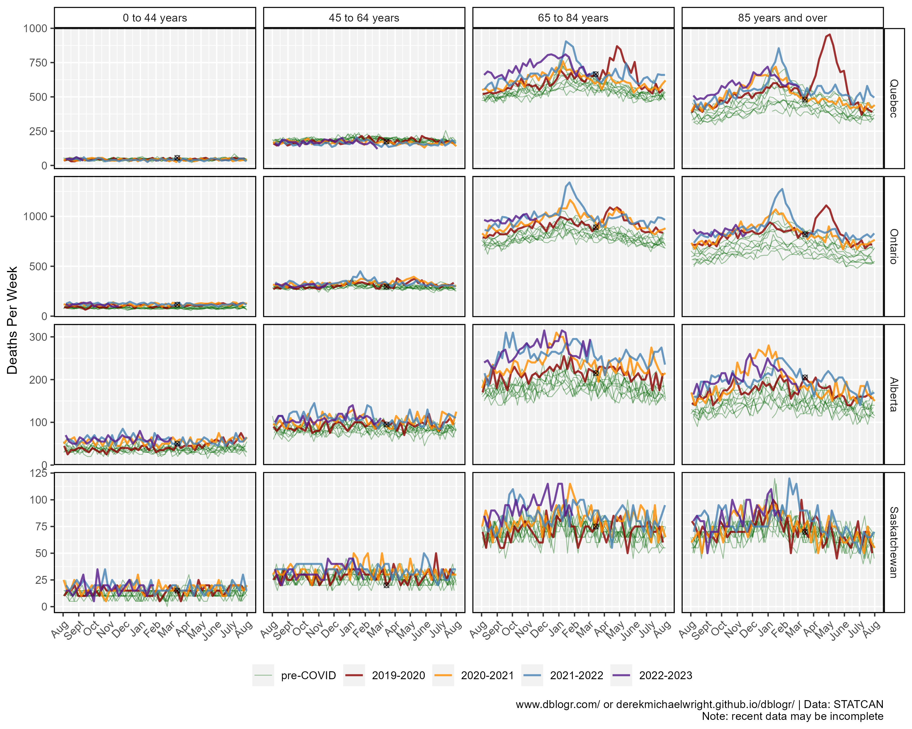

```{r}
myAreas <- c("Ontario", "Quebec", "Saskatchewan", "Alberta")
mp <- deathPlot3(myAreas = myAreas)
ggsave("canada_deaths_06_09.png", mp, width = 10, height = 8)
```

---

## Saskatchewan vs. Quebec

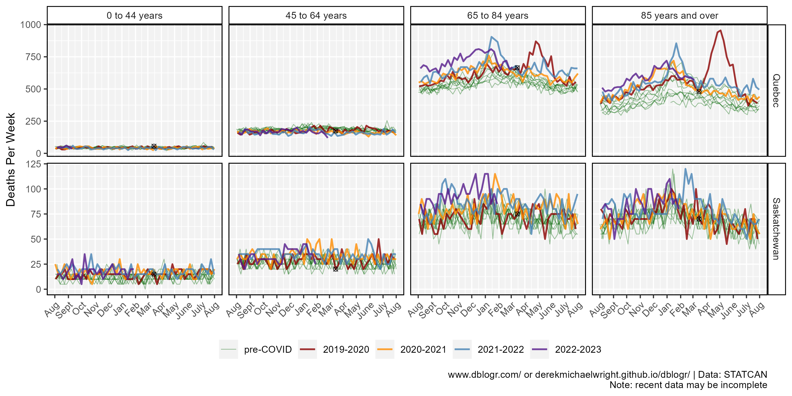

```{r}
myAreas <- c("Quebec", "Saskatchewan")
mp <- deathPlot3(myAreas = myAreas)
ggsave("canada_deaths_06_10.png", mp, width = 10, height = 5)
```

---

## Alberta vs. Ontario

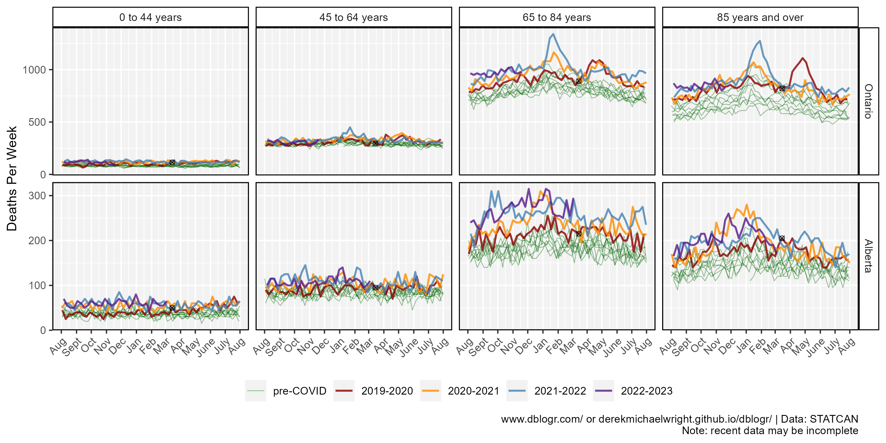

```{r}
myAreas <- c("Ontario", "Alberta")
mp <- deathPlot3(myAreas = myAreas)
ggsave("canada_deaths_06_11.png", mp, width = 10, height = 5)
```

---

# Yearly Deaths by Age Group

```{r}
# Create plotting function
deathPlot5 <- function(myArea = "Canada") {
  # Prep data
  xx <- d2 %>% 
    filter(Area == myArea,
           Sex == "Both sexes", Age != "all ages") %>%
    group_by(Age, Year, Group) %>%
    summarise(Value = sum(Value, na.rm = T))
  # Plot
  ggplot(xx, aes(x = Year, y = Value / 1000, fill = Group, alpha = Group)) +
    geom_bar(stat = "identity", color = "black") +
    facet_grid(. ~ Age) +
    scale_fill_manual(name = NULL, values = myColors) +
    scale_alpha_manual(name = NULL, values = c(0.4,0.8,0.8,0.8,0.8)) +
    scale_x_continuous(breaks = seq(2010, 2022, 2)) +
    theme_agData(legend.position = "none",
                 axis.text.x = element_text(angle = 45, hjust = 1)) +
    labs(title = myArea, caption = myCaption2,
         y = "Thousand Deaths", x = NULL)
}
```

---

## Canada

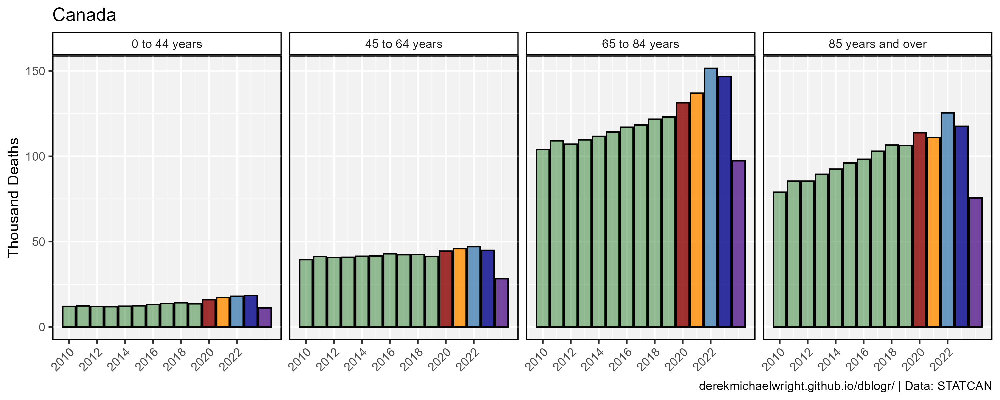

```{r}
mp <- deathPlot5(myArea = "Canada")
ggsave("canada_deaths_07_01.png", mp, width = 8, height = 4)
```

---

## Ontario

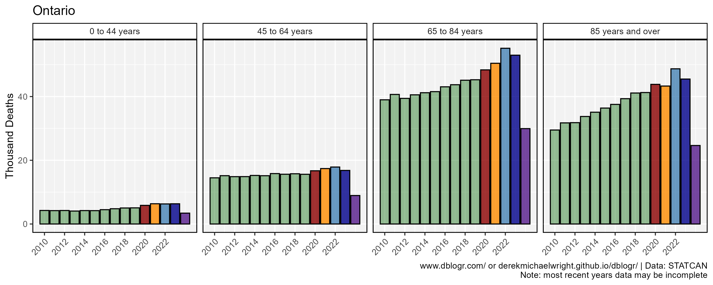

```{r}
mp <- deathPlot5(myArea = "Ontario")
ggsave("canada_deaths_07_02.png", mp, width = 8, height = 4)
```

---

## Quebec

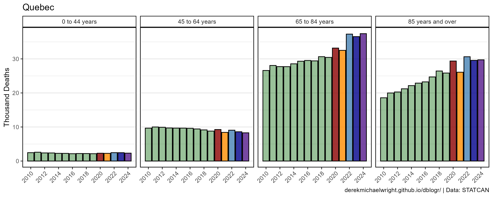

```{r}
mp <- deathPlot5(myArea = "Quebec")
ggsave("canada_deaths_07_03.png", mp, width = 8, height = 4)
```

---

## British Columbia

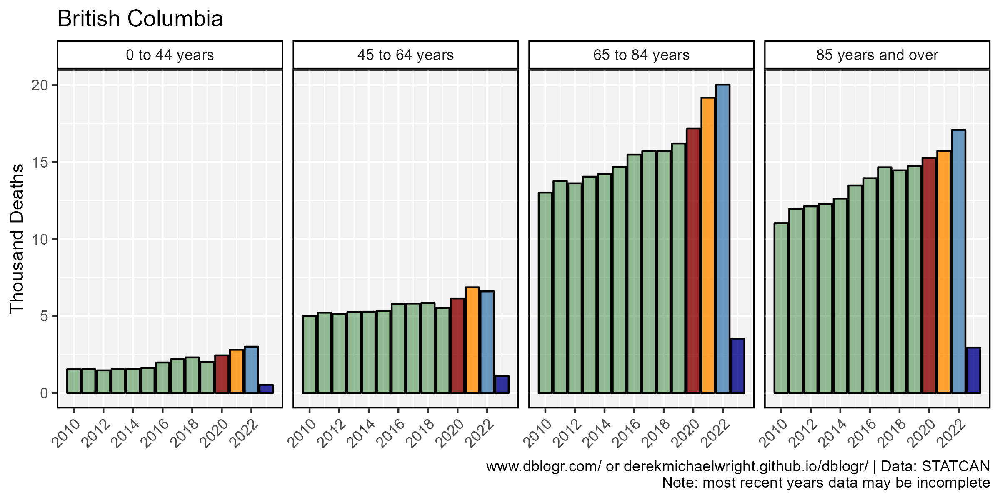

```{r}
mp <- deathPlot5(myArea = "British Columbia")
ggsave("canada_deaths_07_04.png", mp, width = 8, height = 4)
```

---

## Alberta

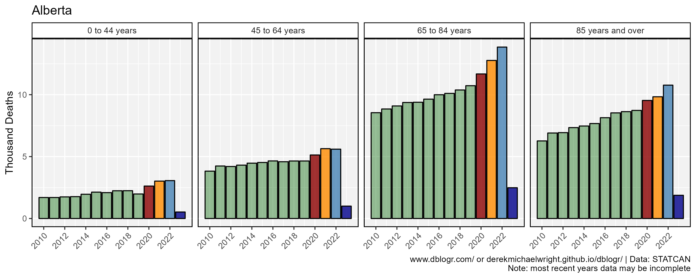

```{r}
mp <- deathPlot5(myArea = "Alberta")
ggsave("canada_deaths_07_05.png", mp, width = 8, height = 4)
```

---

## Saskatchewan

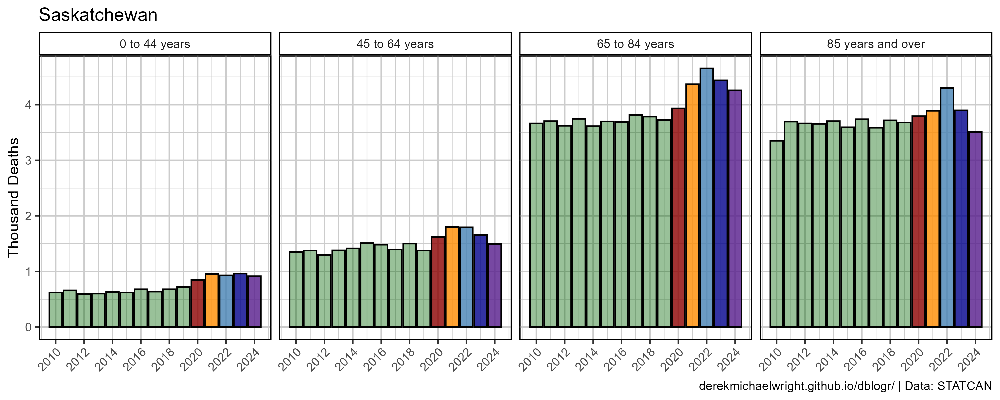

```{r}
mp <- deathPlot5(myArea = "Saskatchewan")
ggsave("canada_deaths_07_06.png", mp, width = 8, height = 4)
```

---

## Manitoba

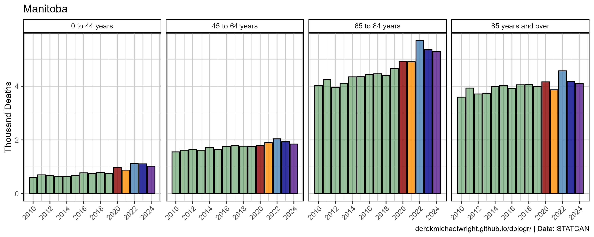

```{r}
mp <- deathPlot5(myArea = "Manitoba")
ggsave("canada_deaths_07_07.png", mp, width = 8, height = 4)
```

---

# Weekly Deaths Ages 0-44

```{r}
ggDeaths044 <- function(myArea = "Canada") {
  # Prep data
  xx <- d2 %>% filter(Area == myArea, Date > "2010-01-01",
                      Age == "0 to 44 years", Sex == "Both sexes")
  vv <- as.Date(paste0(as.character(2010:2023),"-01-01"))
  # Plot
  ggplot(xx, aes(x = Date, y = Value, fill = Group)) +
    geom_bar(stat = "identity", alpha = 0.7) + #geom_line(alpha = 0.7) +
    geom_vline(xintercept = vv, lty = 2, alpha = 0.5) +
    geom_vline(xintercept = as.Date("2020-03-01"), alpha = 0.25) +
    scale_fill_manual(values = myColors) +
    scale_x_date(date_breaks = "1 year", date_labels = "%Y", 
                 minor_breaks = "1 year") +
    theme_agData(legend.position = "none") +
    labs(title = paste(myArea, "- Ages 0 - 44"),
         x = NULL, y = "Weekly Deaths", caption = myCaption1)
}
```

---

## Canada

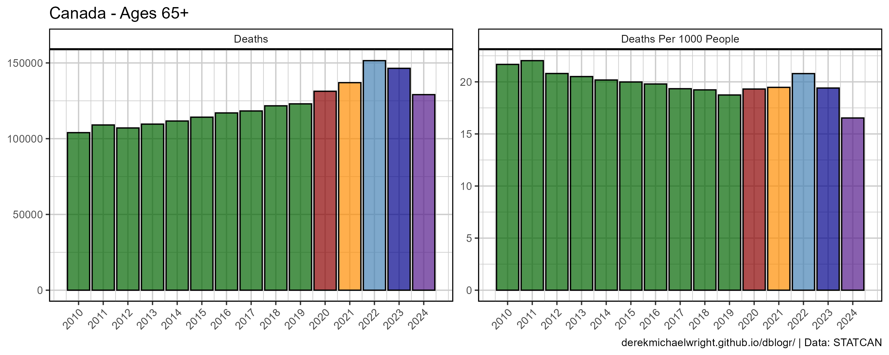

```{r}
mp <- ggDeaths044(myArea = "Canada")
ggsave("canada_deaths_08_01.png", mp, width = 8, height = 4)
```

---

## Ontario

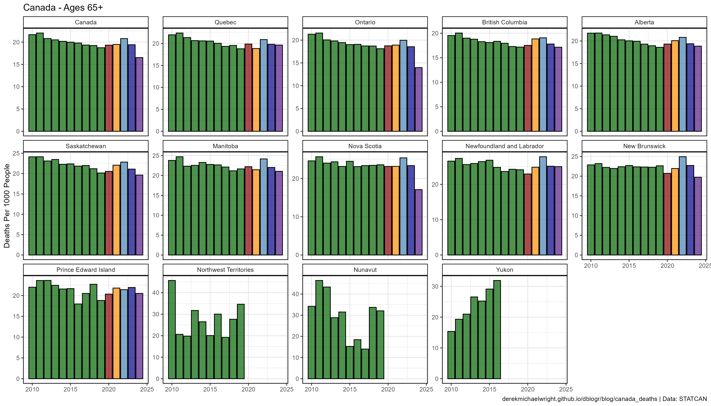

```{r}
mp <- ggDeaths044(myArea = "Ontario")
ggsave("canada_deaths_08_02.png", mp, width = 8, height = 4)
```

---

## Quebec

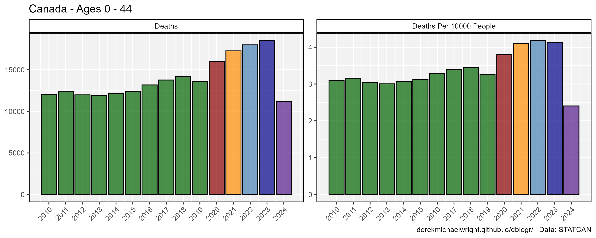

```{r}
mp <- ggDeaths044(myArea = "Quebec")
ggsave("canada_deaths_08_03.png", mp, width = 8, height = 4)
```

---

## British Columbia

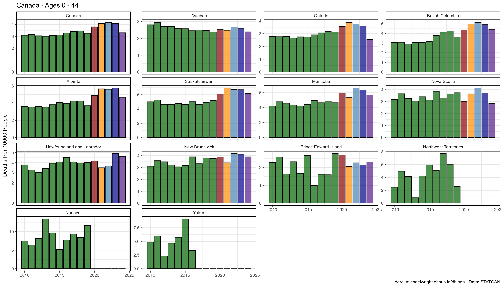

```{r}
mp <- ggDeaths044(myArea = "British Columbia")
ggsave("canada_deaths_08_04.png", mp, width = 8, height = 4)
```

---

## Alberta

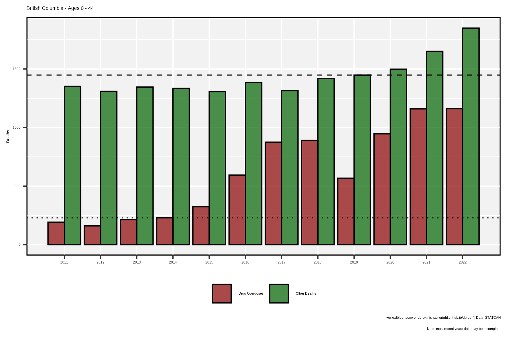

```{r}
mp <- ggDeaths044(myArea = "Alberta")
ggsave("canada_deaths_08_05.png", mp, width = 8, height = 4)
```

---

## Saskatcehwan

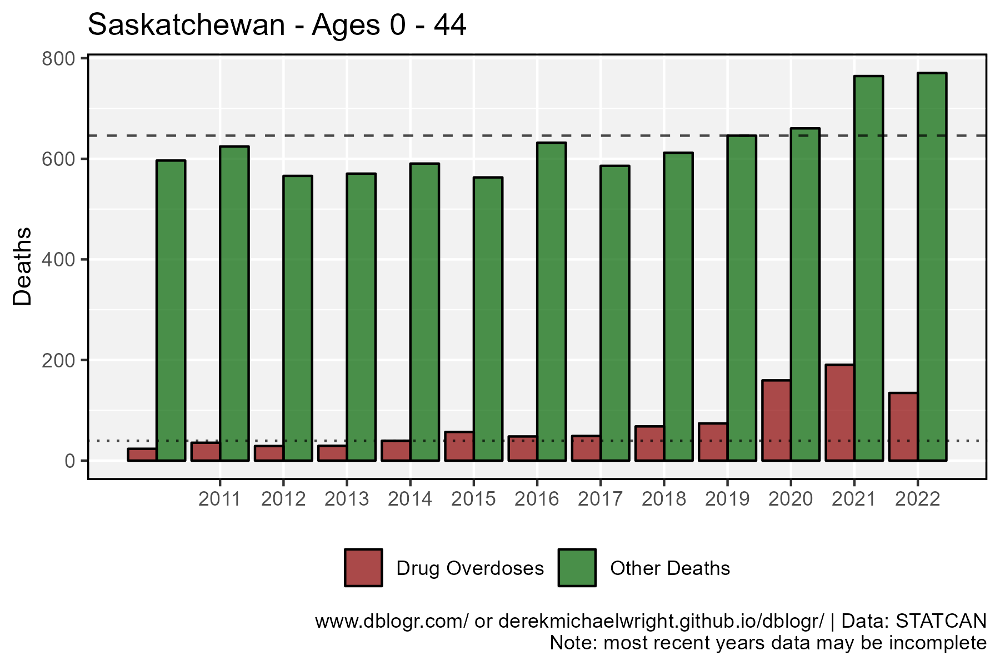

```{r}
mp <- ggDeaths044(myArea = "Saskatchewan")
ggsave("canada_deaths_08_06.png", mp, width = 8, height = 4)
```

---

## Manitoba

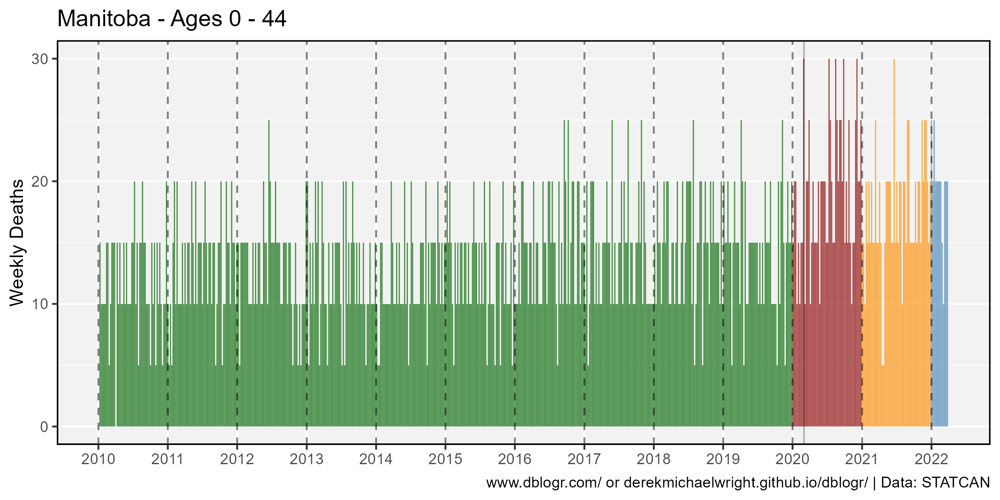

```{r}
mp <- ggDeaths044(myArea = "Manitoba")
ggsave("canada_deaths_08_07.png", mp, width = 8, height = 4)
```

---

# Weekly Deaths By Sex

## Canada

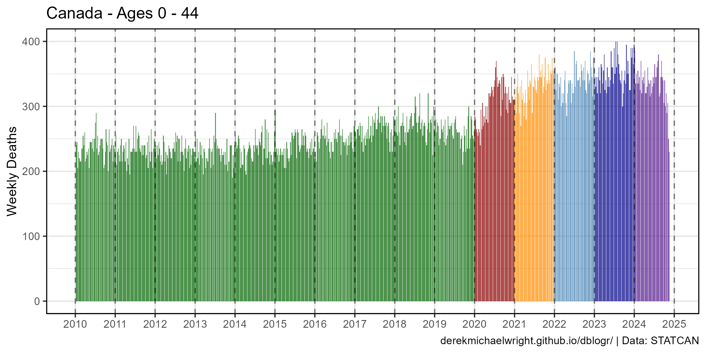

```{r}
# Prep data
xx <- d2 %>% filter(Area %in% "Canada", Sex != "Both sexes", Year > 2016)
# Plot
mp <- ggplot(xx, aes(x = Date, y = Value, group = Sex, color = Sex)) +
  geom_line() +
  facet_grid(Area ~ Age) +
  scale_color_manual(name = NULL, values = c("palevioletred3", "steelblue")) +
  theme_agData(legend.position = "bottom",
               axis.text.x = element_text(angle = 45, hjust = 1)) +
  labs(y = "Deaths Per Week", x = NULL, caption = myCaption1)
ggsave("canada_deaths_09_01.png", mp, width = 8, height = 4)
```

---

## 2020

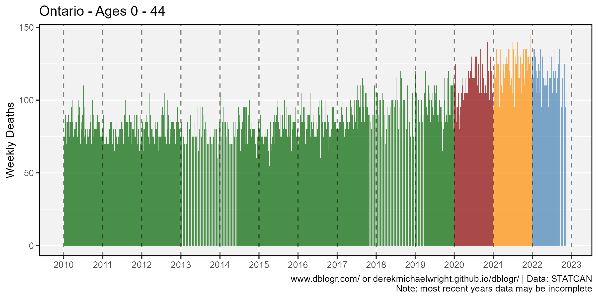

```{r}
# Prep data
xx <- d2 %>% filter(Area %in% "Canada", Sex != "Both sexes", Year >= 2020)
# Plot
mp <- ggplot(xx, aes(x = Date, y = Value, group = Sex, color = Sex)) +
  geom_line(size = 1) +
  facet_grid(Area ~ Age) +
  scale_color_manual(name = NULL, values = c("palevioletred3", "steelblue")) +
  scale_x_date(date_breaks = "1 year", date_labels = "%Y", 
                 minor_breaks = "1 year") +
  theme_agData(legend.position = "bottom",
               axis.text.x = element_text(angle = 45, hjust = 1)) +
  labs(y = "Deaths Per Week", x = NULL, caption = myCaption1)
ggsave("canada_deaths_09_02.png", mp, width = 8, height = 4)
```

---

# Yearly Death Rate

## Canada

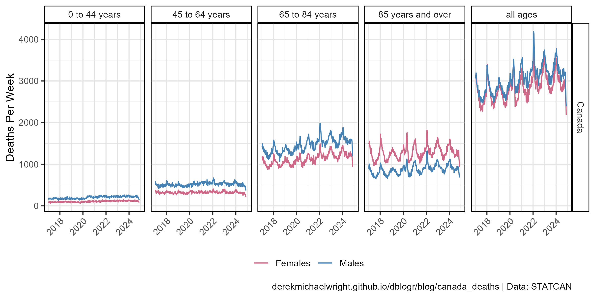

```{r}
# Plot
mp <- ggplot(d3 %>% filter(Area == "Canada", Year < 2023), 
             aes(x = Year, y = Death.Rate, fill = Group, alpha = Group)) +
  geom_bar(stat = "identity", color = "black") +
  scale_fill_manual(values = myColors) +
  scale_alpha_manual(name = NULL, values = c(0.4,0.8,0.8,0.8,0.8)) +
  scale_x_continuous(breaks = seq(1990, 2020, 5)) +
  theme_agData(legend.position = "none") +
  labs(title = "Death Rate - Canada", 
       y = "Deaths Per Thousand People", x = NULL, caption = myCaption1)
ggsave("canada_deaths_10_01.png", mp, width = 6, height = 4)
```

---

## Provinces

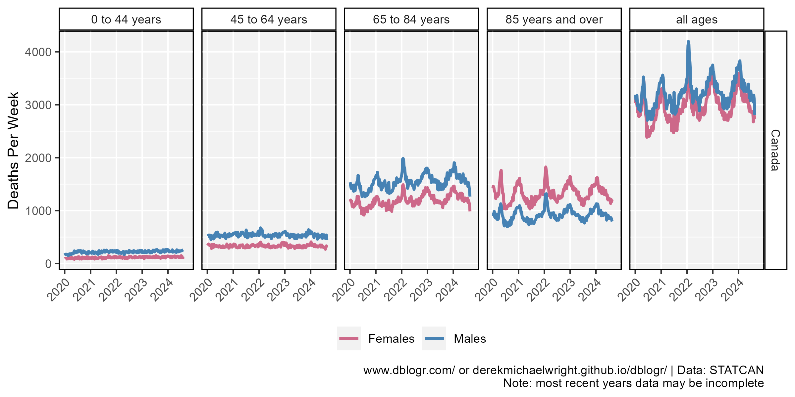

```{r}
# Plot
mp <- ggplot(d3 %>% filter(Year < 2023), 
             aes(x = Year, y = Death.Rate, fill = Group, alpha = Group)) +
  geom_bar(stat = "identity", color = "black") +
  scale_fill_manual(name = NULL, values = myColors) +
  scale_alpha_manual(name = NULL, values = c(0.4,0.8,0.8,0.8,0.8)) +
  scale_x_continuous(breaks = seq(1995, 2015, 10)) +
  facet_wrap(Area ~ ., ncol = 5) +
  theme_agData(legend.position = "none") +
  labs(title = "Death Rate - Canada", 
       y = "Deaths Per Thousand People", x = NULL, caption = myCaption1)
ggsave("canada_deaths_10_02.png", mp, width = 10, height = 6)
```

---

## 2019 vs 2020

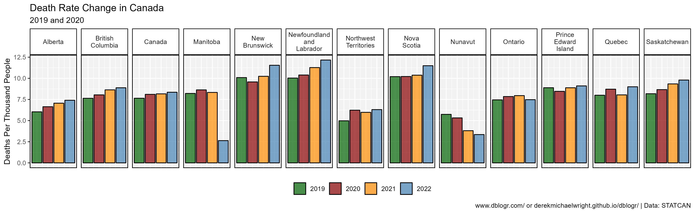

```{r}
# Prep data
xx <- d3 %>% filter(Year %in% c(2019, 2020, 2021, 2022)) %>% 
  filter(!is.na(Total.Deaths), Total.Deaths > 0)
# Plot
mp <- ggplot(xx, aes(x = Year, y = Death.Rate, fill = factor(Year))) +
  geom_bar(stat = "identity", position = "dodge", 
           color = "black", alpha = 0.7) +
  facet_grid(. ~ Area, labeller = label_wrap_gen(width = 10)) +
  scale_fill_manual(name = NULL, values = myColors) +
  theme_agData(legend.position = "bottom",
               axis.text.x = element_blank(),
               axis.ticks.x = element_blank()) +
  labs(title = "Death Rate Change in Canada",  subtitle = "2019 and 2020",
       y = "Deaths Per Thousand People", x = NULL, caption = myCaption1)
ggsave("canada_deaths_10_03.png", mp, width = 13, height = 4)
```

---

## Change

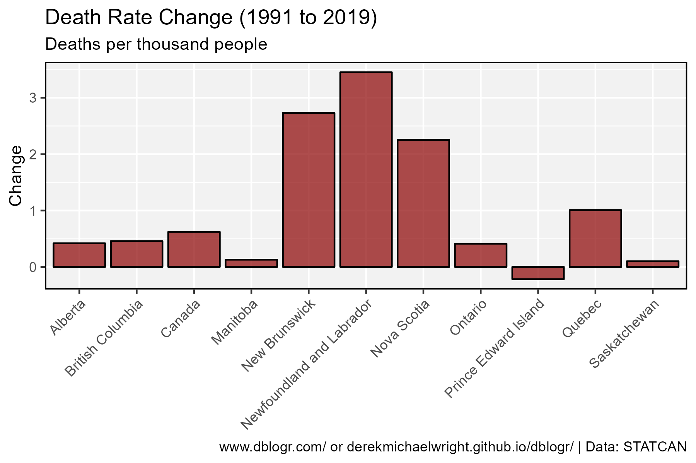

```{r}
# Prep data
xx <- d3 %>% filter(Year %in% c(1991, 2019)) %>%
  select(Area, Year, Death.Rate) %>%
  spread(Year, Death.Rate) %>%
  mutate(Change = `2019` - `1991`) %>%
  filter(!is.na(Change))
# Plot
mp <- ggplot(xx, aes(x = Area, y = Change)) +
  geom_bar(stat = "identity", color = "black", fill = "darkred", alpha = 0.7) +
  theme_agData(axis.text.x = element_text(angle = 45, hjust = 1)) +
  labs(title = "Death Rate Change (1991 to 2019)", 
       subtitle = "Deaths per thousand people",
       y = "Change", x = NULL, caption = myCaption1)
ggsave("canada_deaths_10_04.png", mp, width = 6, height = 4)
```

---

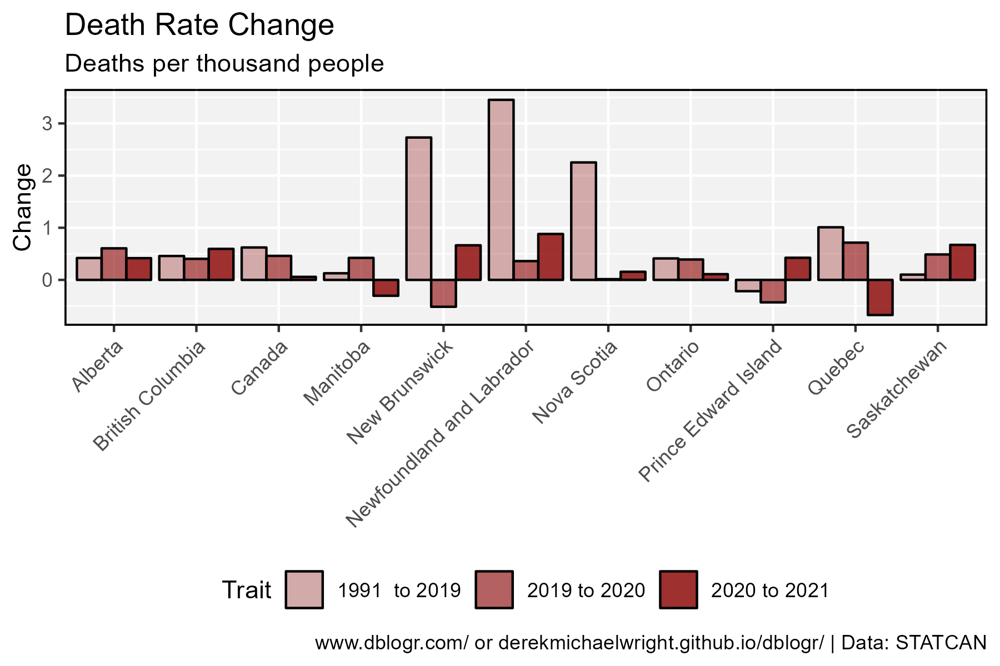

```{r}
# Prep data
xx <- d3 %>% filter(Year %in% c(1991, 2019, 2020, 2021)) %>%
  select(Area, Year, Death.Rate) %>%
  spread(Year, Death.Rate) %>%
  mutate(Change1 = `2019` - `1991`,
         Change2 = `2020` - `2019`,
         Change3 = `2021` - `2020`) %>%
  filter(!is.na(Change1)) %>% 
  select(Area, Change1, Change2, Change3) %>%
  gather(Trait, Value, 2:4)
myColors <- c(alpha("darkred",0.3), alpha("darkred",0.6), alpha("darkred",0.8))
myLabels <- c(c("1991  to 2019", "2019 to 2020", "2020 to 2021"))
# Plot
mp <- ggplot(xx, aes(x = Area, y = Value, fill = Trait)) +
  geom_bar(stat = "identity", position = "dodge", color = "black") +
  scale_fill_manual(values = myColors, labels = myLabels) +
  theme_agData(legend.position = "bottom",
               axis.text.x = element_text(angle = 45, hjust = 1)) +
  labs(title = "Death Rate Change", 
       subtitle = "Deaths per thousand people",
       y = "Change", x = NULL, caption = myCaption1)
ggsave("canada_deaths_10_05.png", mp, width = 6, height = 4)
```

---

## Select Provinces 

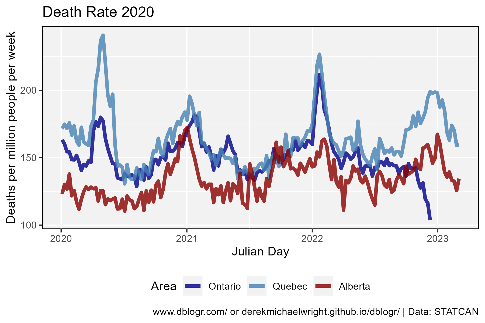

```{r}
# Prep data
myAreas <- c("Ontario", "Quebec", "Alberta")
myColors <- c("darkblue", "steelblue", "darkred")
p1 <- pp %>% filter(Year > 2019)
xx <- d1 %>% 
  filter(Year > 2019, Area %in% myAreas) %>%
  left_join(p1, by = c("Area", "Year")) %>%
  mutate(Death.Rate = 1000000 * Value / Population,
         #Death.Rate = movingAverage(Death.Rate, n = 3),
         Area = factor(Area, levels = myAreas)) %>%
  filter(!is.na(Death.Rate))
# Plot
mp <- ggplot(xx, aes(x = Date, y = Death.Rate, color = Area)) +
  geom_line(size = 1.5, alpha = 0.8) +
  scale_color_manual(values = myColors) +
  theme_agData(legend.position = "bottom") +
  labs(title = "Death Rate 2020", x = "Julian Day", 
       y = "Deaths per million people per week", caption = myCaption1)
ggsave("canada_deaths_10_06.png", mp, width = 6, height = 4)
```

---

## Heatmap

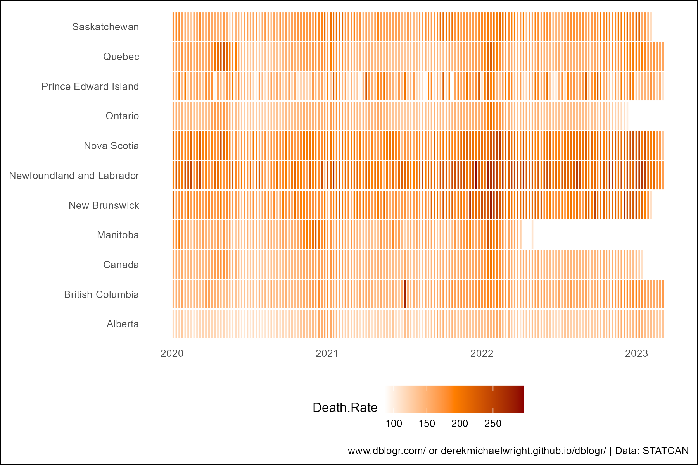

```{r}
# Prep data
myAreas <- c("Yukon", "Northwest Territories", "Nunavut")
myColors <- c("white", "darkorange1", "darkred")
p1 <- pp %>% filter(Year > 2019)
xx <- d1 %>% 
  filter(Year > 2019, !Area %in% myAreas) %>%
  left_join(p1 %>% select(-Year), by = "Area") %>%
  mutate(Death.Rate = 1000000 * Value / Population)
# Plot
mp <- ggplot(xx, aes(x = Date, y = Area, fill = Death.Rate)) +
  geom_tile(color = "white", size = 0.35) +
  scale_fill_gradientn(colors = myColors, na.value = 'white') +
  theme_minimal() + 
  theme(plot.background = element_rect(fill = "white"),
        panel.grid = element_blank()) +
        coord_cartesian(clip = 'off') +
        theme(legend.position = "bottom", 
              text = element_text(size = 8)) +
  labs(x = NULL, y = NULL, caption = myCaption1)
ggsave("canada_deaths_10_07.png", mp, width = 6, height = 4)
```

---

# 1900 - Present

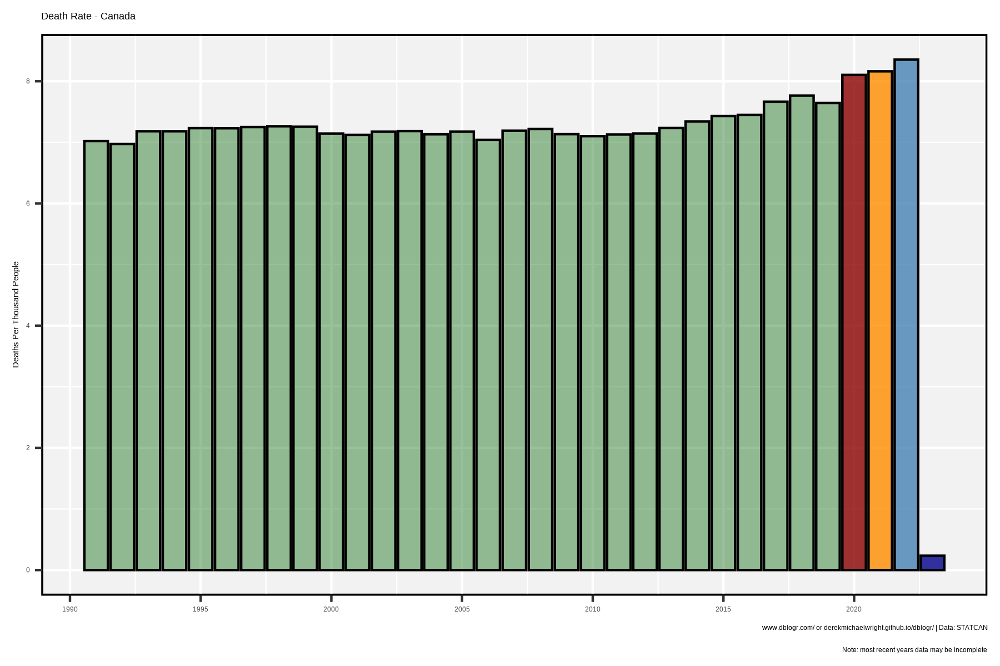

```{r}
# Prep data
d4 <- read.csv("data_canada_deaths.csv") %>%
  gather(Trait, Value, 2:ncol(.)) %>%
  mutate(Value = gsub(",", "", Value),
         Value = as.numeric(Value))
xx <- d4 %>% 
  filter(Year %in% 2020:2021, Trait == "Death.rate..per.1.000.") %>% 
  pull(Value) %>% max(na.rm = T)
xx <- d4 %>% filter(Trait == "Death.rate..per.1.000.") %>%
  mutate(Group = ifelse(Value >= xx, "higher", "Lower"),
         Group = ifelse(Year %in% c(1918, 2020, 2021), "Pandemic", Group))
# Plot
mp <- ggplot(xx, aes(x = Year, y = Value, alpha = Group)) +
  geom_bar(stat = "identity", color = "black", fill = "darkred", size = 0.3) +
  scale_x_continuous(breaks = seq(1900, 2020, 20)) +
  scale_fill_manual(values = c("darkred", "darkgreen", "darkred")) +
  scale_alpha_manual(values = c(0.6, 0.3, 0.8)) +
  theme_agData(legend.position = "none") +
  labs(title = "Death Rate in Canada", y = "Deaths per 1000 people", x = NULL,
       caption = "www.dblogr.com/ or derekmichaelwright.github.io/dblogr/ | Data: Wikipedia")
ggsave("canada_deaths_11_01.png", mp, width = 6, height = 4)
```

---

```{reval = F, echo = F}
# Extra

## Excess Deaths

https://www150.statcan.gc.ca/n1/daily-quotidien/210712/dq210712b-eng.htm


# Prep data
myColors <- c("darkred", "grey50")
# 5535 - 1380
xx <- data.frame(Measurement = c("COVID","Drugs, Alcohol, etc."),
                 Value = c(1380, 4155))
# Plot
mp <- ggplot(xx, aes(x = "", y = Value, fill = Measurement)) +
  geom_col(color = "black") +
  geom_text(aes(label = Value), color = "white",
            position = position_stack(vjust = 0.5)) +
  coord_polar(theta = "y") +
  scale_fill_manual(name = NULL, values = myColors) +
  guides(label = F) +
  theme_void() +
  theme(legend.position = "bottom") +
  labs(title = "Excess deaths for excess for ages 0 - 64",
       y = "Excess Deaths", x = NULL, caption = myCaption1)
ggsave("canada_deaths_9_01.png", mp, width = 6, height = 4, bg = "white")
```

```{r eval = F, echo = F}
## Covid Releif Money

https://www.bloomberg.com/news/articles/2021-06-01/trudeau-s-covid-19-spending-was-tilted-to-high-earning-canadians?sref=7iNjhqyV


# Prep data
quantiles <- c("Lowest", "Second", "Third", "Forth", "Highest")
traits1 <- c("Percent", "Value", "PercentIncome")
traits2 <- c("Percent of Releif", "Average Value Per Household", "Percent of Income")
xx <- read.csv("data_covid_releif.csv") %>%
  gather(Trait, Value, 2:4) %>%
  mutate(Quantile = factor(Quantile, levels = quantiles),
         Trait = plyr::mapvalues(Trait, traits1, traits2),
         Trait = factor(Trait, levels = traits2))
# Plot
mp <- ggplot(xx, aes(x = Quantile, y = Value, fill = Quantile)) +
  geom_bar(stat = "identity", color = "black", alpha = 0.8) +
  facet_wrap(Trait ~ ., ncol = 3, scale = "free_y") +
  scale_fill_manual(values = agData_Colors) +
  theme_agData(legend.position = "none",
               axis.text.x = element_text(angle = 45, hjust = 1)) +
  labs(title = "Distribution of COVID Releif in Canada", 
       y = NULL, x = NULL, caption = "\u00A9 www.dblogr.com/")
ggsave("canada_deaths_9_02.png", mp, width = 8, height = 4)

# Prep data
xx <- xx %>% filter(Trait == "Percent of Releif")
# Plot
mp <- ggplot(xx, aes(x = Quantile, y = Value, fill = Quantile)) +
  geom_bar(stat = "identity", color = "black", alpha = 0.8) +
  facet_wrap(Trait ~ ., ncol = 3, scale = "free_y") +
  scale_fill_manual(values = agData_Colors) +
  theme_agData(legend.position = "none",
               axis.text.x = element_text(angle = 45, hjust = 1)) +
  labs(title = "Distribution of COVID Releif in Canada", 
       y = "Percent", x = NULL, caption = "\u00A9 www.dblogr.com/")
ggsave("canada_deaths_9_03.png", mp, width = 6, height = 4)
```
