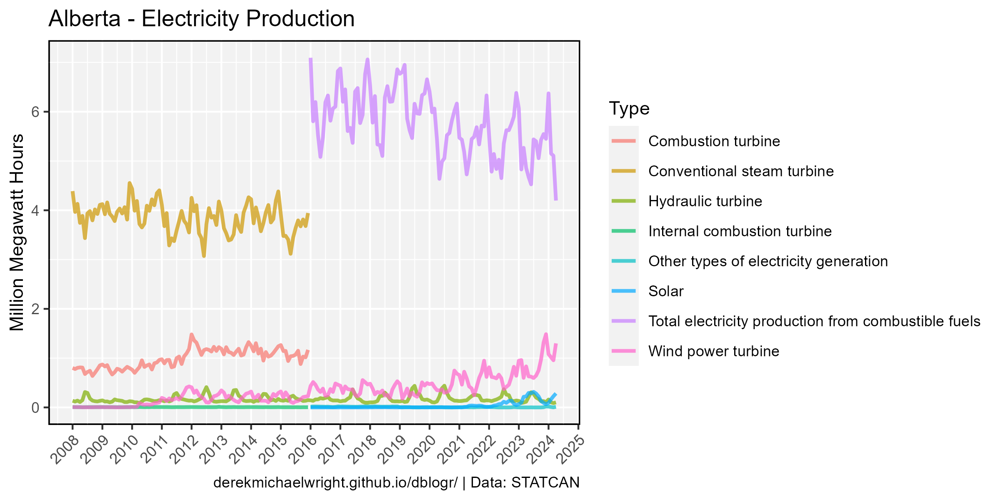
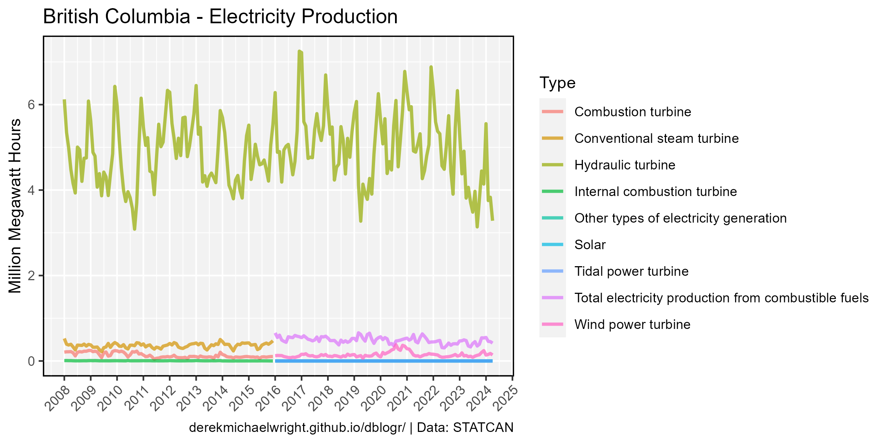
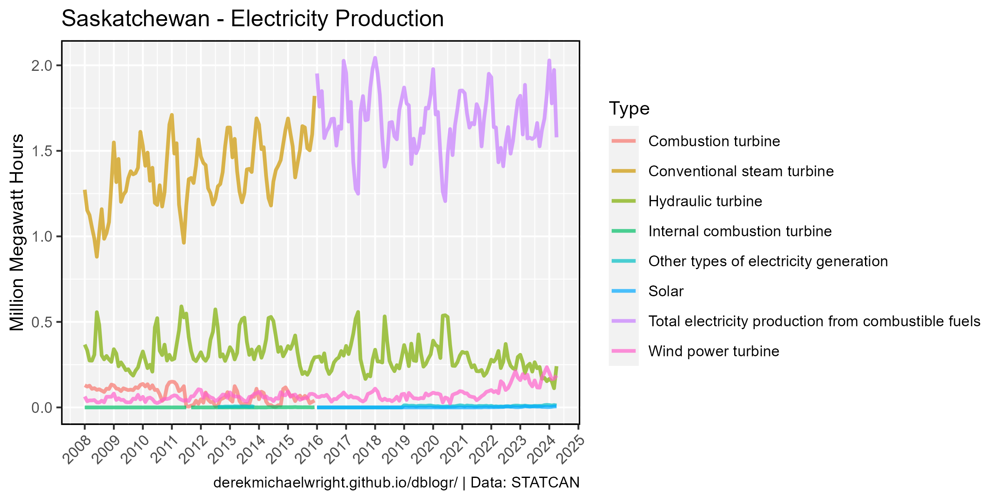
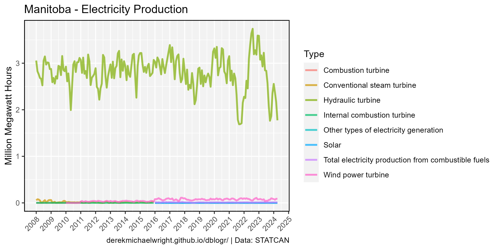
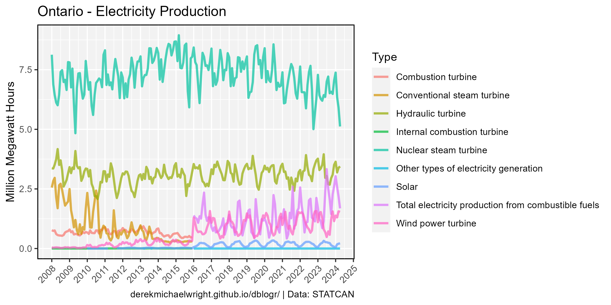
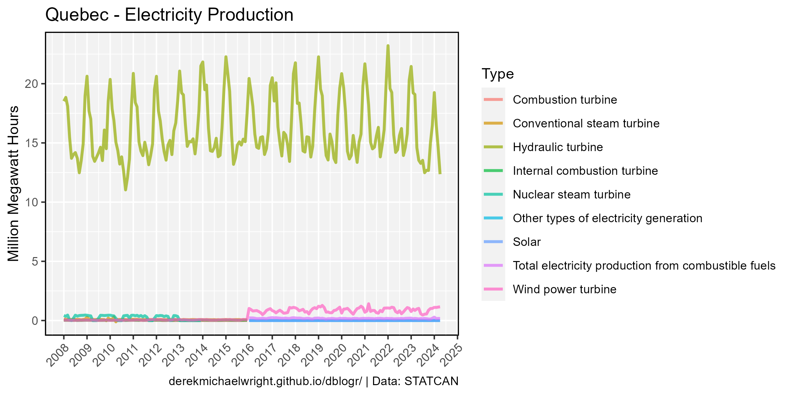

```{r setup, include=FALSE}
knitr::opts_chunk$set(echo = T, message = F, warning = F)
```

---

# Data

STATCAN Table: 25-10-0015-01

> - `r shiny::icon("globe")` [https://www150.statcan.gc.ca/t1/tbl1/en/cv.action?pid=2510001501](https://www150.statcan.gc.ca/t1/tbl1/en/cv.action?pid=2510001501){target="_blank"}
> - `r shiny::icon("save")` [2510001501_databaseLoadingData.csv](2510001501_databaseLoadingData.csv)

---

# Prepare Data

```{r class.source = "fold-show"}
# devtools::install_github("derekmichaelwright/agData")
library(agData)
```

```{r}
# Prep data
myCaption <- "www.dblogr.com/ or derekmichaelwright.github.io/dblogr/ | Data: STATCAN"
myColors1 <- c("black", "grey50", "slategray3")
myColors2 <- c("darkgreen", "steelblue", "darkred")
# 
dd <- read.csv("2510001501_databaseLoadingData.csv") %>%
  select(Date=REF_DATE, Area=GEO, Class=Class.of.electricity.producer,
         Type=Type.of.electricity.generation, Unit=UOM, Value=VALUE) %>%
  mutate(#Area = factor(Area, levels = agData_STATCAN_Region_Table$Area),
         Date = as.Date(paste0(Date,"-01"), format = "%Y-%m-%d"),
         Year = as.numeric(substr(Date, 1, 4)))
```

---

# Energy Production {.tabset .tabset-pills}

## Plotting Function

```{r  class.source = "fold-show"}
# Create plotting function
gg_Electricity <- function(myArea = "Canada") {
  # Prep data
  xx <- dd %>% filter(Area == myArea, Type != "Total all types of electricity generation",
                      Class == "Total all classes of electricity producer")
  # Plot
  ggplot(xx, aes(x = Date, y = Value / 1000000, color = Type)) +
    geom_line(size = 1, alpha = 0.7) +
    #scale_color_manual(name = NULL, values = myColors1, breaks = myItems) +
    scale_x_date(date_breaks = "year", date_labels = "%Y") +
    theme_agData(legend.position = "bottom",
                 axis.text.x = element_text(angle = 45, hjust = 1)) +
    labs(title = paste(myArea, "- Electricity Production"),
         y = "Million Megawatt Hours", x = NULL, caption = myCaption)
}
```

## Canada {.active}


```{r}
# Plot
mp <- gg_Electricity(myArea = "Canada")
ggsave("canada_electricity_1_01.png", mp, width = 8, height = 4)
```

```{r echo = F}
ggsave("featured.png", mp, width = 8, height = 4)
```

---

## Alberta



```{r}
# Plot
mp <- gg_Electricity(myArea = "Alberta")
ggsave("canada_electricity_1_02.png", mp, width = 8, height = 4)
```

---

## British Columbia



```{r}
mp <- gg_Electricity(myArea = "British Columbia")
ggsave("canada_electricity_1_03.png", mp, width = 8, height = 4)
```

---

## Saskatchewan



```{r}
mp <- gg_Electricity(myArea = "Saskatchewan")
ggsave("canada_electricity_1_04.png", mp, width = 8, height = 4)
```

---

## Manitoba



```{r}
mp <- gg_Electricity(myArea = "Manitoba")
ggsave("canada_electricity_1_05.png", mp, width = 8, height = 4)
```

---

## Ontario



```{r}
mp <- gg_Electricity(myArea = "Ontario")
ggsave("canada_electricity_1_06.png", mp, width = 8, height = 4)
```

---

## Quebec



```{r}
mp <- gg_Electricity(myArea = "Quebec")
ggsave("canada_electricity_1_07.png", mp, width = 8, height = 4)
```

---
