```{r setup, include=FALSE}
knitr::opts_chunk$set(echo = T, message = F, warning = F)
```

---

# Data

STATCAN Table 14-10-0017-01 (Labour force characteristics)

> - `r shiny::icon("globe")` https://www150.statcan.gc.ca/t1/tbl1/en/cv.action?pid=1410001701
> - `r shiny::icon("save")` [1410001701_databaseLoadingData.csv](1410001701_databaseLoadingData.csv)

STATCAN Table 14-10-0085-01 (Labour force characteristics of immigrants by sex and age group)

> - `r shiny::icon("globe")` https://www150.statcan.gc.ca/t1/tbl1/en/cv.action?pid=1410001701
> - `r shiny::icon("save")` [1410008501_databaseLoadingData.csv](1410001701_databaseLoadingData.csv)

STATCAN Table 11-10-0012-01 (Distribution of total income)

> - `r shiny::icon("globe")` https://www150.statcan.gc.ca/t1/tbl1/en/cv.action?pid=1110001201
> - `r shiny::icon("save")` [1110001201_databaseLoadingData.csv](1110001201_databaseLoadingData.csv)

STATCAN Table 18-10-0005-01 (Consumer Price Index)

> - `r shiny::icon("globe")` https://www150.statcan.gc.ca/t1/tbl1/en/cv.action?pid=1810000501
> - `r shiny::icon("save")` [1810000501_databaseLoadingData.csv](1810000501_databaseLoadingData.csv)

STATCAN Table 14-10-0011-01 (Employment insurance beneficiaries)

> - `r shiny::icon("globe")` https://www150.statcan.gc.ca/t1/tbl1/en/cv.action?pid=1410001101
> - `r shiny::icon("save")` [1410001101_databaseLoadingData.csv](1410001101_databaseLoadingData.csv)

---

# Prepare Data

```{r class.source = 'fold-show'}
# devtools::install_github("derekmichaelwright/agData")
library(agData)
```

```{r}
# Prep data
myCaption <- "www.dblogr.com/ or derekmichaelwright.github.io/dblogr/ | Data: STATCAN"
myAreas <- c("Canada", "British Columbia", "Alberta", "Saskatchewan", 
             "Manitoba", "Nova Scotia","Ontario", "Quebec", 
             "Newfoundland and Labrador", "New Brunswick", 
             "Prince Edward Island", "Yukon", "Nunavut",
             "Northwest Territories")
myColors_Age <- c("darkgreen", "darkorange", "darkred")
myColors_Sex <- c("palevioletred3","steelblue")
#
d1 <- read.csv("1410001701_databaseLoadingData.csv") %>%
  select(Area=GEO, Date=REF_DATE, Measurement=Labour.force.characteristics, 
         Sex, Age=Age.group, Unit=UOM, Scale=SCALAR_FACTOR, Value=VALUE) %>%
  mutate(Area = factor(Area, levels = myAreas),
         Date = as.Date(paste0(Date, "-15"), format = "%Y-%m-%d"))
d2 <- d1 %>% 
  filter(Measurement %in% c("Full-time employment", "Part-time employment")) %>%
  mutate(Year = as.numeric(substr(Date, 1, 4))) %>%
  group_by(Area, Year, Measurement, Sex, Age) %>%
  summarise(Value = sum(Value)) %>% ungroup() %>%
  group_by(Area, Year, Sex, Age) %>% mutate(Total = sum(Value)) %>% ungroup() %>%
  mutate(Percent = 100 * Value / Total)
myColors_Fam <- c("darkgreen", "steelblue", "darkred")
#
d3 <- read.csv("1410008501_databaseLoadingData.csv") %>%
  select(Area=GEO, Date=REF_DATE, Measurement=Labour.force.characteristics, 
         Sex, Age=Age.group, Unit=UOM, Scale=SCALAR_FACTOR, Value=VALUE) %>%
  mutate(Area = factor(Area, levels = myAreas),
         Date = as.Date(paste0(Date, "-15"), format = "%Y-%m-%d"))
#
d4 <- read.csv("1110001201_databaseLoadingData.csv") %>%
  select(Area=GEO, Year=REF_DATE, FamilyType=Family.type, Age=Age.of.older.adult,
         Measurement=Family.income, Unit=UOM, Value=VALUE) %>%
  mutate(Area = factor(Area, levels = myAreas))
#
d5 <- read.csv("1810000501_databaseLoadingData.csv") %>%
  select(Area=GEO, Year=REF_DATE, Item=Products.and.product.groups,
         Unit=UOM, CPI=VALUE)
#
myAges <- c("15 years and over", "15 to 24 years", 
            "25 to 54 years", "55 years and over")
d6 <- read.csv("1410001101_databaseLoadingData.csv") %>%
  select(Date=REF_DATE, Area=GEO, Measurement=Beneficiary.detail,
         Sex, Age=Age.group, Unit=UOM, Value=VALUE) %>%
  mutate(Age = factor(Age, levels = myAges),
         Date = as.Date(paste0(Date, "-15"), format = "%Y-%m-%d"))
```

```{r echo = F, eval = F}
ages <- c(# Groups 1
          "15 to 19 years", "20 to 24 years", "25 to 29 years", 
          "30 to 34 years", "35 to 39 years", "40 to 44 years", 
          "45 to 49 years", "50 to 54 years", "55 to 59 years", 
          "60 to 64 years", "65 years and over", "65 to 69 years", 
          "70 years and over",
          # Groups 2
          "15 to 24 years", "25 to 44 years", "45 to 64 years",
          # Groups 3
          "25 to 54 years", "15 to 64 years", 
          #Groups4
          "15 years and over", "25 years and over", 
          "45 years and over", "55 years and over")
```

---

# Employment Rate

## Canada

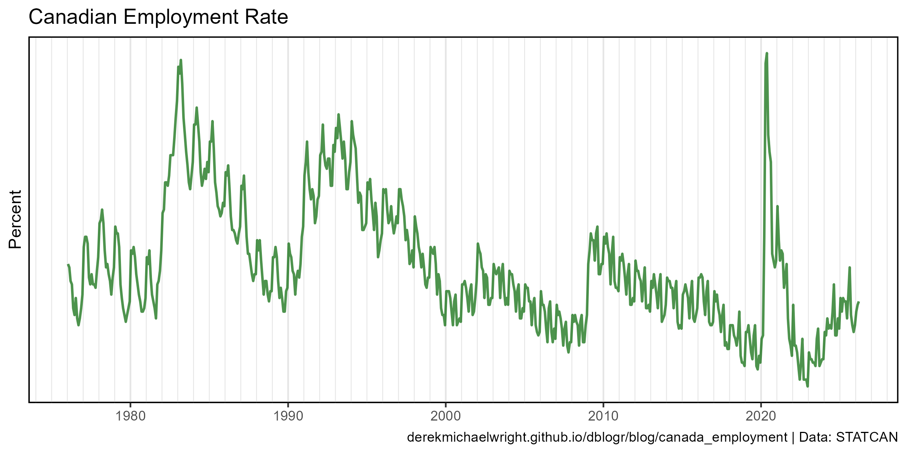

```{r}
# Prep data
xx <- d1 %>% 
  filter(Area == "Canada", Sex == "Both sexes", Age == "15 years and over",
         Measurement == "Employment rate")
# Plot
mp <- ggplot(xx, aes(x = Date, y = Value)) +
  geom_line(size = 0.75, alpha = 0.7, color = "darkgreen") +
  scale_y_continuous(breaks = seq(52, 64, by = 2), minor_breaks = 50:65) +
  scale_x_date(date_minor_breaks = "year") +
  theme_agData(legend.position = "bottom") +
  labs(title = "Canadian Employment Rate", x = NULL,
       y = "Percent", caption = myCaption)
ggsave("canada_employment_1_01.png", mp, width = 8, height = 4)
```

---

### By Sex

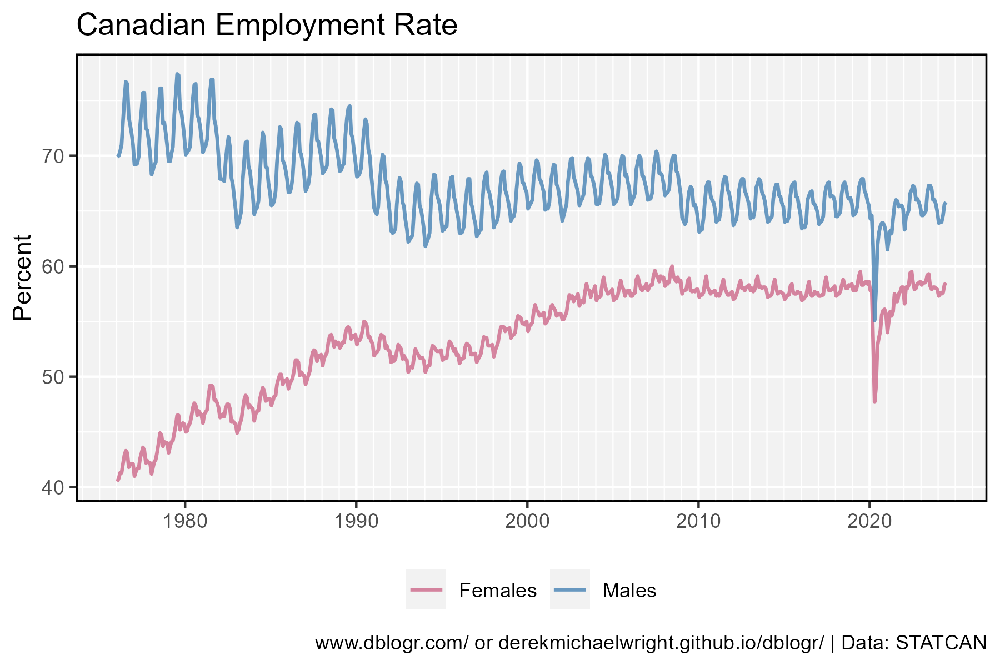

```{r}
# Prep data
xx <- d1 %>%
  filter(Area == "Canada", Sex != "Both sexes", Age == "15 years and over",
         Measurement == "Employment rate")
# Plot
mp <- ggplot(xx, aes(x = Date, y = Value, color = Sex)) +
  geom_line(size = 0.75, alpha = 0.8) +
  scale_color_manual(name = NULL, values = myColors_Sex) +
  scale_x_date(date_minor_breaks = "year") +
  theme_agData(legend.position = "bottom") +
  labs(title = "Canadian Employment Rate", x = NULL,
       y = "Percent", caption = myCaption)
ggsave("canada_employment_1_02.png", mp, width = 6, height = 4)
```

```{r echo = F}
ggsave("featured.png", mp, width = 6, height = 4)
```

---

### Yearly Average

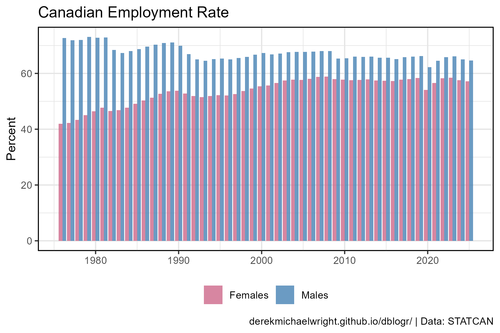

```{r}
# Prep data
xx <- d1 %>%
  filter(Area == "Canada", Sex != "Both sexes", Age == "15 years and over",
         Measurement == "Employment rate") %>% 
  mutate(Year = as.numeric(substr(Date, 1, 4))) %>%
  group_by(Year, Sex, Unit) %>%
  summarise(Value = mean(Value))
# Plot
mp <- ggplot(xx, aes(x = Year, y = Value, fill = Sex)) +
  geom_col(position = "dodge", alpha = 0.8) +
  scale_fill_manual(name = NULL, values = myColors_Sex) +
  theme_agData(legend.position = "bottom") +
  labs(title = "Canadian Employment Rate", x = NULL,
       y = "Percent", caption = myCaption)
ggsave("canada_employment_1_03.png", mp, width = 6, height = 4)
```

---

### > 2010

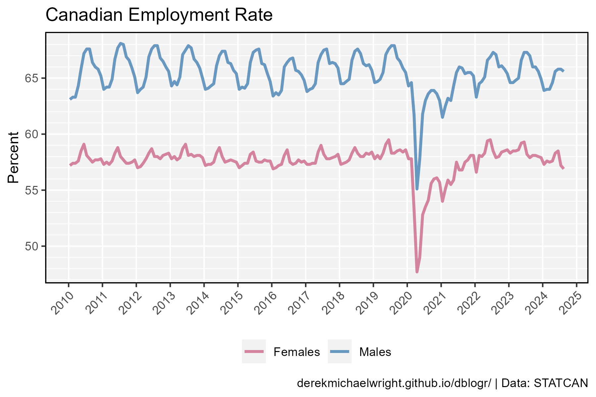

```{r}
# Prep data
xx <- d1 %>% 
  filter(Area == "Canada", Measurement == "Employment rate", 
         Age == "15 years and over", Sex != "Both sexes", Date > "2010-01-01")
# Plot
mp <- ggplot(xx, aes(x = Date, y = Value, color = Sex)) +
  geom_line(size = 1, alpha = 0.8) +
  scale_color_manual(name = NULL, values = myColors_Sex) +
  scale_y_continuous(breaks = seq(40, 70, by = 5), minor_breaks = 40:70) +
  scale_x_date(date_breaks = "year", date_minor_breaks = "year", 
               date_labels = "%Y") +
  theme_agData(legend.position = "bottom",
               axis.text.x = element_text(angle = 45, hjust = 1)) +
  labs(title = "Canadian Employment Rate", x = NULL,
       y = "Percent", caption = myCaption)
ggsave("canada_employment_1_04.png", mp, width = 6, height = 4)
```

---

### By Age

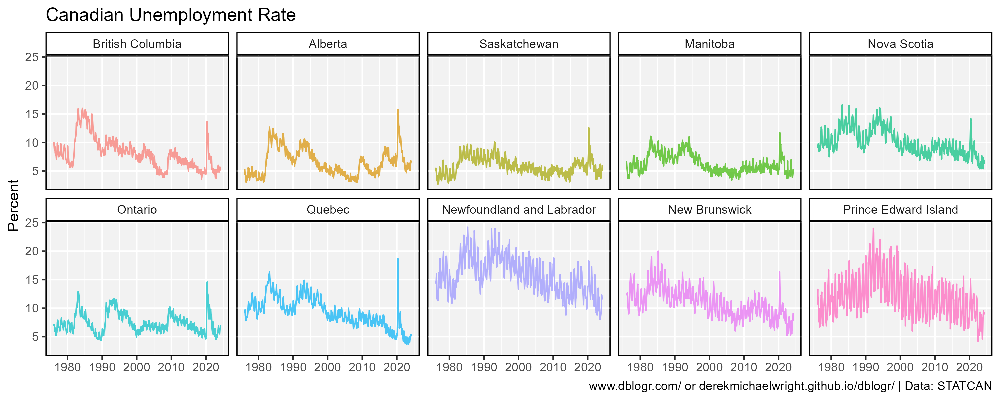

```{r}
# Prep data
xx <- d1 %>% 
  filter(Area == "Canada", Sex == "Both sexes", Age != "15 years and over",
         Measurement == "Employment rate")
# Plot
mp <- ggplot(xx, aes(x = Date, y = Value, color = Age)) +
  geom_line(size = 0.75, alpha = 0.7) +
  scale_color_manual(name = NULL, values = myColors_Age) +
  scale_x_date(date_minor_breaks = "year") +
  theme_agData(legend.position = "bottom") +
  labs(title = "Canadian Employment Rate", x = NULL,
       y = "Percent", caption = myCaption)
ggsave("canada_employment_1_05.png", mp, width = 6, height = 4)
```

---

## Provinces

### By Age

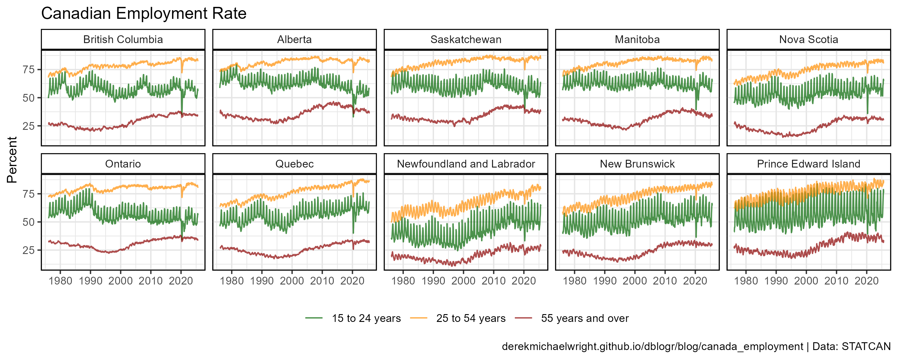

```{r}
# Prep data
xx <- d1 %>% 
  filter(Area != "Canada", Sex == "Both sexes", Age != "15 years and over",
         Measurement == "Employment rate")
# Plot
mp <- ggplot(xx, aes(x = Date, y = Value, color = Age)) +
  geom_line(size = 0.5, alpha = 0.7) +
  facet_wrap(Area ~ ., ncol = 5) +
  scale_color_manual(name = NULL, values = myColors_Age) +
  theme_agData(legend.position = "bottom") +
  labs(title = "Canadian Employment Rate", x = NULL,
       y = "Percent", caption = myCaption)
ggsave("canada_employment_1_06.png", mp, width = 10, height = 4)
```

---

#### > 2010

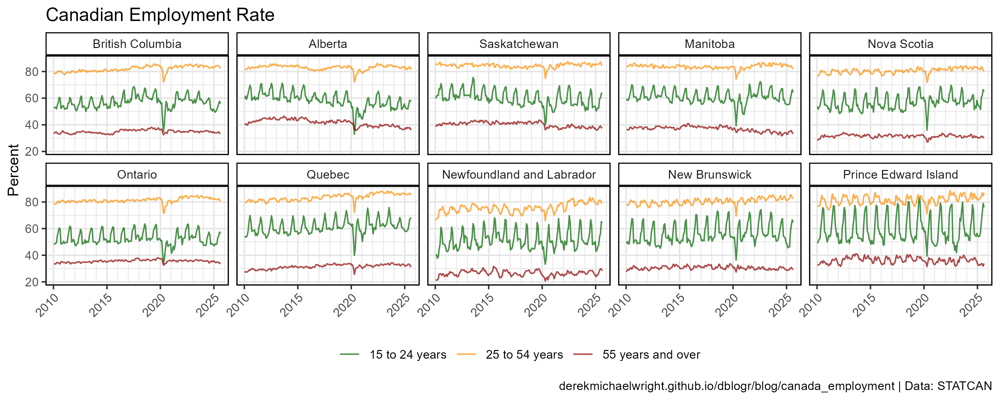

```{r}
# Prep data
xx <- d1 %>% 
  filter(Area != "Canada", Sex == "Both sexes", Age != "15 years and over",
         Measurement == "Employment rate", Date > "2010-01-01")
# Plot
mp <- ggplot(xx, aes(x = Date, y = Value, color = Age)) +
  geom_line(size = 0.5, alpha = 0.7) +
  facet_wrap(Area ~ ., ncol = 5) +
  scale_color_manual(name = NULL, values = myColors_Age) +
  scale_x_date(minor_breaks = "year") +
  theme_agData(legend.position = "none",
               axis.text.x = element_text(angle = 45, hjust = 1)) +
  labs(title = "Canadian Employment Rate", x = NULL,
       y = "Percent", caption = myCaption)
ggsave("canada_employment_1_07.png", mp, width = 10, height = 4)
```

---

### By Sex

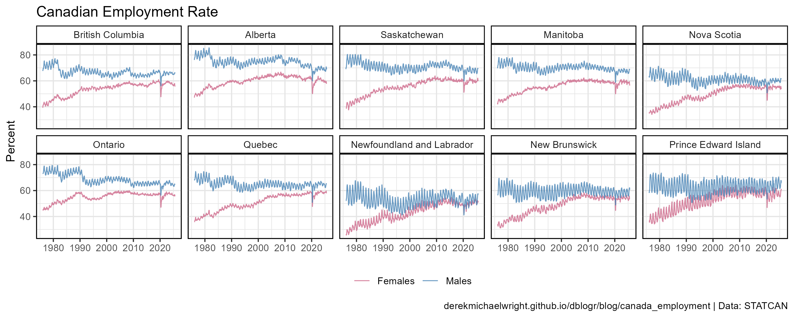

```{r}
# Prep data
xx <- d1 %>% 
  filter(Area != "Canada", Sex != "Both sexes", Age == "15 years and over",
         Measurement == "Employment rate")
# Plot
mp <- ggplot(xx, aes(x = Date, y = Value, color = Sex)) +
  geom_line(size = 0.4, alpha = 0.8) +
  facet_wrap(Area ~ ., ncol = 5) +
  scale_color_manual(name = NULL, values = myColors_Sex) +
  theme_agData(legend.position = "bottom") +
  labs(title = "Canadian Employment Rate", x = NULL,
       y = "Percent", caption = myCaption)
ggsave("canada_employment_1_08.png", mp, width = 10, height = 4)
```

---

#### > 2010

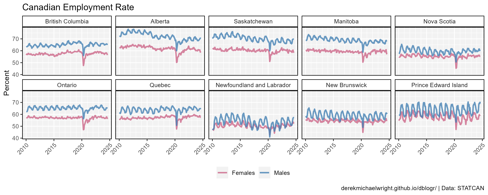

```{r}
# Prep data
xx <- d1 %>% 
  filter(Area != "Canada", Measurement == "Employment rate", 
         Age == "15 years and over", Sex != "Both sexes", Date > "2010-01-01")
# Plot
mp <- ggplot(xx, aes(x = Date, y = Value, color = Sex)) +
  geom_line(size = 1, alpha = 0.8) +
  facet_wrap(Area ~ ., ncol = 5) +
  scale_color_manual(name = NULL, values = myColors_Sex) +
  scale_x_date(date_minor_breaks = "year") +
  theme_agData(legend.position = "bottom",
               axis.text.x = element_text(angle = 45, hjust = 1)) +
  labs(title = "Canadian Employment Rate", x = NULL,
       y = "Percent", caption = myCaption)
ggsave("canada_employment_1_09.png", mp, width = 10, height = 4)
```

---

### Newfoundland & Alberta 

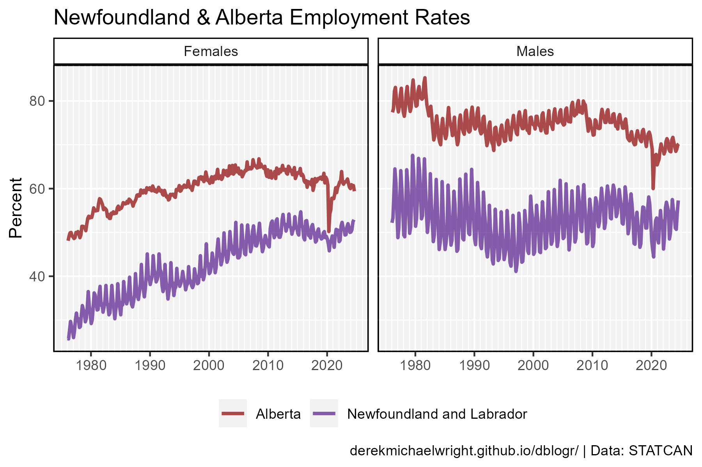

```{r}
# Prep data
xx <- d1 %>% 
  filter(Area == c("Newfoundland and Labrador","Alberta"), 
         Measurement == "Employment rate", 
         Age == "15 years and over", Sex != "Both sexes")
# Plot
mp <- ggplot(xx, aes(x = Date, y = Value, color = Area)) +
  geom_line(size = 1, alpha = 0.7) +
  facet_grid(. ~ Sex) +
  scale_color_manual(name = NULL, values = c("darkred","purple4")) +
  scale_x_date(date_minor_breaks = "year") +
  theme_agData(legend.position = "bottom") +
  labs(title = "Newfoundland & Alberta Employment Rates", x = NULL,
       y = "Percent", caption = myCaption)
ggsave("canada_employment_1_10.png", mp, width = 6, height = 4)
```

---

### Ontario

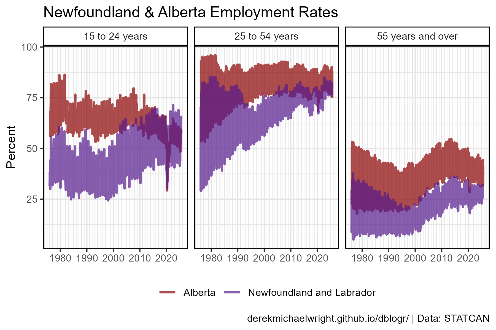

```{r}
# Prep data
xx <- d1 %>% 
  filter(Area == "Ontario", Measurement == "Employment rate", 
         Age != "15 years and over", Sex != "Both sexes")
# Plot
mp <- ggplot(xx, aes(x = Date, y = Value, color = Sex)) +
  geom_line(size = 0.75, alpha = 0.7) +
  facet_grid(. ~ Age) +
  scale_color_manual(name = NULL, values = myColors_Sex) +
  scale_x_date(date_minor_breaks = "year") +
  theme_agData(legend.position = "bottom") +
  labs(title = "Ontario Employment Rate", x = NULL,
       y = "Percent", caption = myCaption)
ggsave("canada_employment_1_11.png", mp, width = 10, height = 4)
```

---

# Full Time vs. Part Time

## Canada

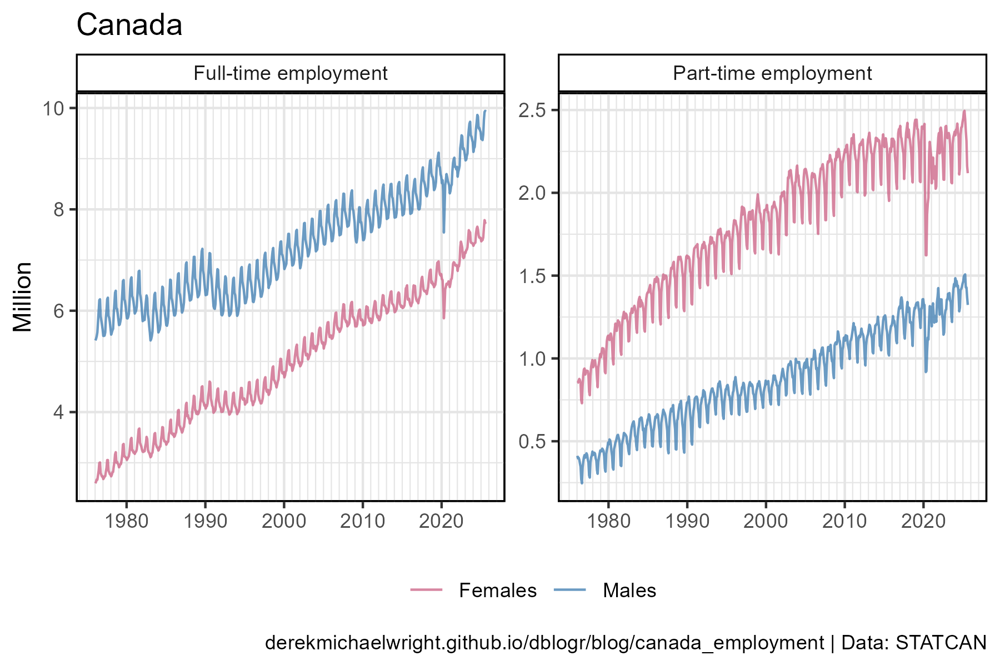

```{r}
# Prep data
xx <- d1 %>% 
  filter(Area == "Canada", Sex != "Both sexes", Age == "15 years and over",
         Measurement %in% c("Full-time employment", "Part-time employment"))
# Plot
mp <- ggplot(xx, aes(x = Date, y = Value / 1000, color = Sex)) +
  geom_line(size = 0.5, alpha = 0.8) +
  facet_wrap(Measurement ~ ., ncol = 2, scales = "free_y") +
  scale_color_manual(name = NULL, values = c("palevioletred3","steelblue")) +
  scale_x_date(date_minor_breaks = "year") +
  theme_agData(legend.position = "bottom") +
  labs(title = "Canada", y = "Million", x = NULL, caption = myCaption)
ggsave("canada_employment_2_01.png", mp, width = 6, height = 4)
```

---

### > 2010

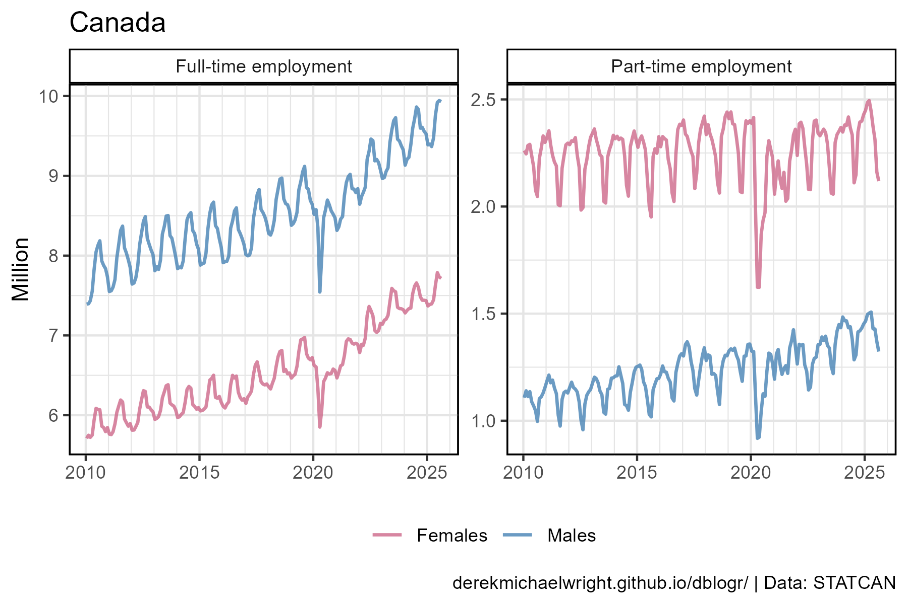

```{r}
# Prep data
xx <- d1 %>% 
  filter(Area == "Canada", Sex != "Both sexes", Age == "15 years and over",
         Measurement %in% c("Full-time employment", "Part-time employment"),
         Date > "2010-01-01")
# Plot
mp <- ggplot(xx, aes(x = Date, y = Value / 1000, color = Sex)) +
  geom_line(size = 0.75, alpha = 0.8) +
  facet_wrap(Measurement ~ ., ncol = 2, scales = "free_y") +
  scale_color_manual(name = NULL, values = c("palevioletred3","steelblue")) +
  scale_x_date(date_minor_breaks = "year") +
  theme_agData(legend.position = "bottom",
               axis.text.x = element_text(angle = 45, hjust = 1)) +
  labs(title = "Canada", y = "Million", x = NULL, caption = myCaption)
ggsave("canada_employment_2_02.png", mp, width = 6, height = 4)
```

---

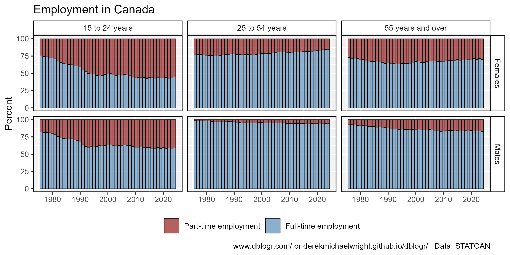

```{r}
# Prep data
myMeasures <- c("Full-time employment", "Part-time employment")
xx <- d2 %>% 
  filter(Area == "Canada", Sex != "Both sexes",
         Age != "15 years and over") %>%
  mutate(Measurement = factor(Measurement, levels = rev(myMeasures)))
# Plot
mp <- ggplot(xx, aes(x = Year, y = Percent, fill = Measurement)) + 
  geom_bar(stat = "identity", color = "black", alpha = 0.6, lwd = 0.2) +
  facet_grid(Sex ~ Age, scales = "free_y") +
  scale_fill_manual(name = NULL, values = c("darkred","steelblue")) +
  theme_agData(legend.position = "bottom") +
  labs(title = "Employment in Canada", x = NULL, caption = myCaption)
ggsave("canada_employment_2_03.png", mp, width = 8, height = 4)
```

---

## Provinces

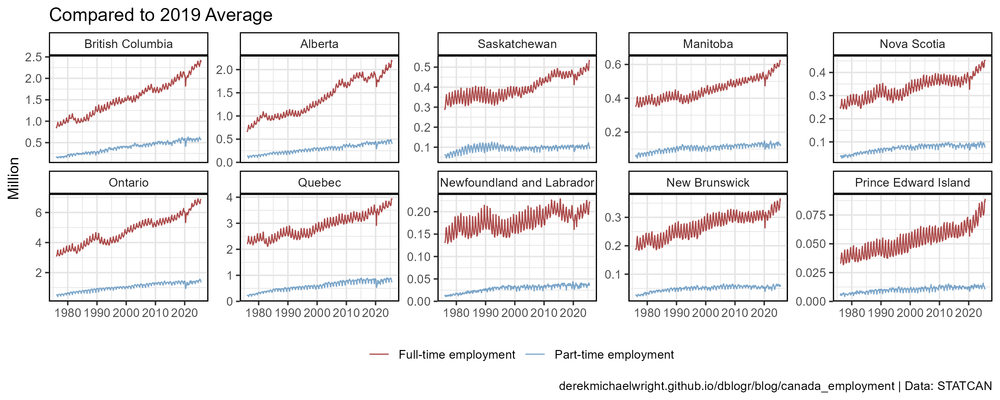

```{r}
# Prep data
xx <- d1 %>% 
  filter(Area != "Canada", Sex == "Both sexes", 
         Age == "15 years and over",
         Measurement %in% myMeasures)
# Plot
mp <- ggplot(xx, aes(x = Date, y = Value / 1000, color = Measurement)) + 
  geom_line(size = 0.4, alpha = 0.7) +
  scale_color_manual(name = NULL, values = c("darkred","steelblue")) +
  facet_wrap(Area ~ ., scales = "free_y", ncol = 5) +
  theme_agData(legend.position = "bottom") +
  labs(title = "Compared to 2019 Average", 
       y = "Million", x = NULL, caption = myCaption)
ggsave("canada_employment_2_04.png", mp, width = 10, height = 4)
```

---

## 2019 vs > 2019

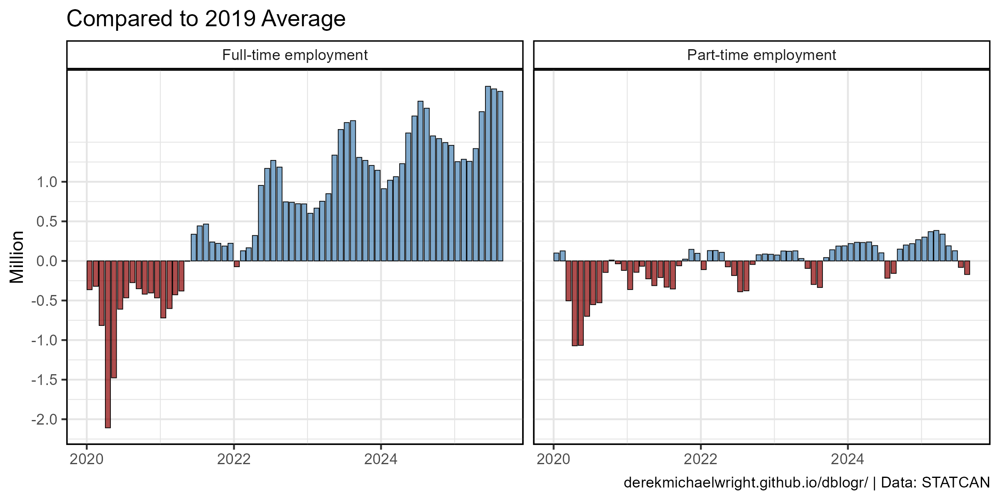

```{r}
# Prep data
myMeasures <- c("Full-time employment", "Part-time employment")
yy <- d1 %>% 
  filter(Area == "Canada", Sex == "Both sexes", Age == "15 years and over", 
         Date > "2019-01-15", Date < "2020-01-15", 
         Measurement %in% myMeasures) %>%
  group_by(Measurement) %>%
  summarise(Value = mean(Value))
xx <- d1 %>% 
  filter(Area == "Canada", Sex == "Both sexes", 
         Age == "15 years and over", Date >= "2020-01-15", 
         Measurement %in% myMeasures) %>%
  mutate(MonthDiff = ifelse(Measurement == myMeasures[1], 
            Value - yy$Value[yy$Measurement == myMeasures[1]],
            Value - yy$Value[yy$Measurement != myMeasures[1]]),
         PosNeg = ifelse(MonthDiff > 0, "Pos", "Neg"))
# Plot
mp <- ggplot(xx, aes(x = Date, y = MonthDiff / 1000, fill = PosNeg)) + 
  geom_bar(stat = "identity", color = "black", alpha = 0.7) +
  scale_fill_manual(values = c("darkred","steelblue")) +
  scale_y_continuous(breaks = c(-2,-1.5,-1,-0.5,0,0.5,1)) +
  facet_grid(. ~ Measurement) +
  theme_agData(legend.position = "none") +
  labs(title = "Compared to 2019 Average", 
       y = "Million", x = NULL, caption = myCaption)
ggsave("canada_employment_2_05.png", mp, width = 8, height = 4)
```

```{r echo = F, eval = F}
DT::datatable(xx %>% 
  filter(Date > "2020-02-15") %>% 
  select(Date, Measurement, PanDiff, MonthDiff) %>%
  mutate(PanDiff = round(PanDiff * 1000),
         MonthDiff = round(MonthDiff * 1000)) %>%
    arrange(desc(Date)))
```

---

## Monthly Change

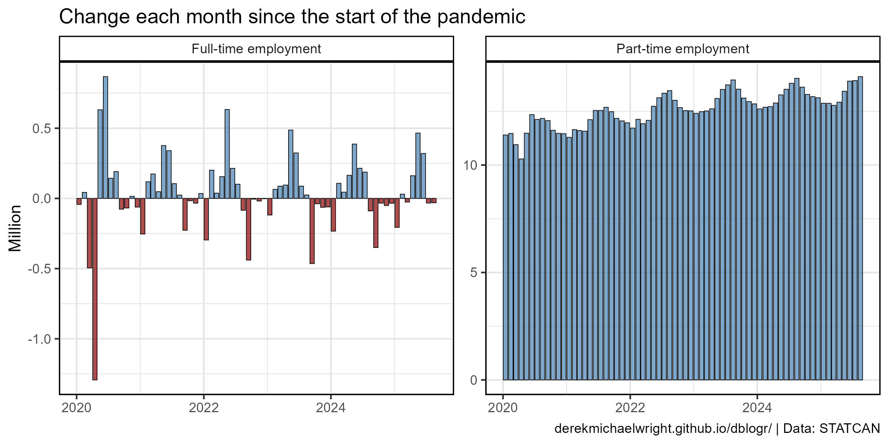

```{r}
# Prep data
yy <- d1 %>% 
  filter(Area == "Canada", Date == "2020-02-15", Age == "15 years and over",
         Sex == "Both sexes", Measurement %in% myMeasures)#, Measurement == "Employment")
         #         !grepl("rate", Measurement), Measurement != "Employment")
#i<-"2020-03-15"
for(i in unique(xx$Date)) {
  # Full-time
  xi <- xx$Value[xx$Date == i & xx$Measurement == "Full-time employment"] - 
    yy$Value[yy$Measurement == "Full-time employment"]
  xx$PanDiff[xx$Date == i & xx$Measurement == "Full-time employment"] <- xi
  # Part-time
  xi <- xx$Value[xx$Date == i & xx$Measurement == "Full-time employment"] - 
    yy$Value[yy$Measurement != "Full-time employment"]
  xx$PanDiff[xx$Date == i & xx$Measurement != "Full-time employment"] <- xi
  #
  yy <- d1 %>% 
  filter(Area == "Canada", Date == i, 
         Age == "15 years and over", Sex == "Both sexes", 
         Measurement %in% myMeasures)
}
xx <- xx %>% mutate(PosNeg = ifelse(PanDiff > 0, "Pos", "Neg"))
# Plot
mp <- ggplot(xx, aes(x = Date, y = PanDiff / 1000, fill = PosNeg)) + 
  geom_bar(stat = "identity", color = "black", alpha = 0.7) +
  facet_wrap(Measurement ~ ., scales = "free_y") +
  scale_fill_manual(values = c("darkred","steelblue")) +
  theme_agData(legend.position = "none") +
  labs(title = "Change each month since the start of the pandemic", 
       y = "Million", x = NULL, caption = myCaption)
ggsave("canada_employment_2_06.png", mp, width = 8, height = 4)
```

---

# Participation Rate

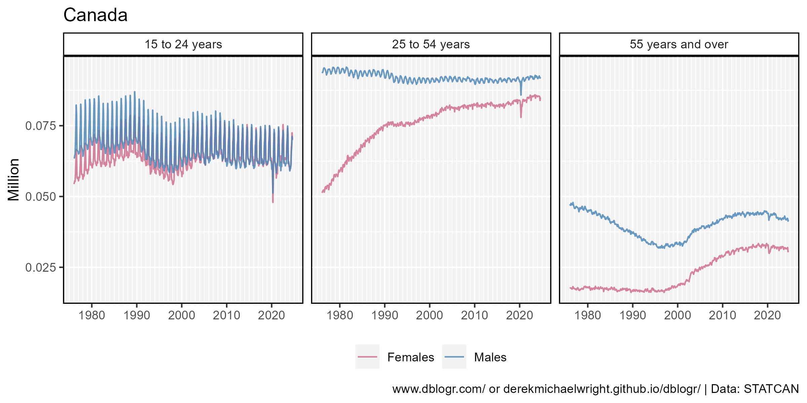

```{r}
# Prep data
xx <- d1 %>% 
  filter(Area == "Canada", Sex != "Both sexes", Age != "15 years and over",
         Measurement == "Participation rate")
# Plot
mp <- ggplot(xx, aes(x = Date, y = Value / 1000, color = Sex)) +
  geom_line(size = 0.5, alpha = 0.8) +
  facet_grid(. ~ Age) +
  scale_color_manual(name = NULL, values = c("palevioletred3","steelblue")) +
  scale_x_date(date_minor_breaks = "year") +
  theme_agData(legend.position = "bottom") +
  labs(title = "Canada - Participation rate", x = NULL,
       y = "Million", caption = myCaption)
ggsave("canada_employment_3_01.png", mp, width = 8, height = 4)
```


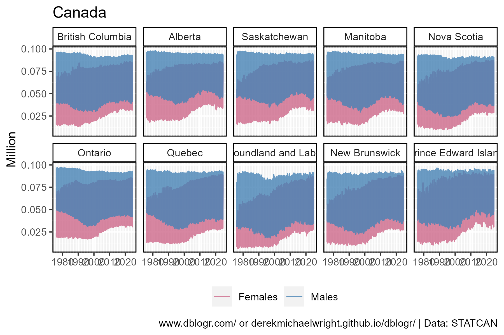
```{r}
# Prep data
xx <- d1 %>% 
  filter(Area != "Canada", Sex != "Both sexes", Age == "25 to 54 years",
         Measurement == "Participation rate")
# Plot
mp <- ggplot(xx, aes(x = Date, y = Value / 1000, color = Sex)) +
  geom_line(size = 0.5, alpha = 0.8) +
  facet_wrap(Area ~ ., ncol = 5) +
  scale_color_manual(name = NULL, values = c("palevioletred3","steelblue")) +
  scale_x_date(date_minor_breaks = "year") +
  theme_agData(legend.position = "bottom") +
  labs(title = "Canada - Participation rate - 25 to 54 years", 
       y = "Million", x = NULL, caption = myCaption)
ggsave("canada_employment_3_02.png", mp, width = 10, height = 5)
```

---

# Income

## Canada

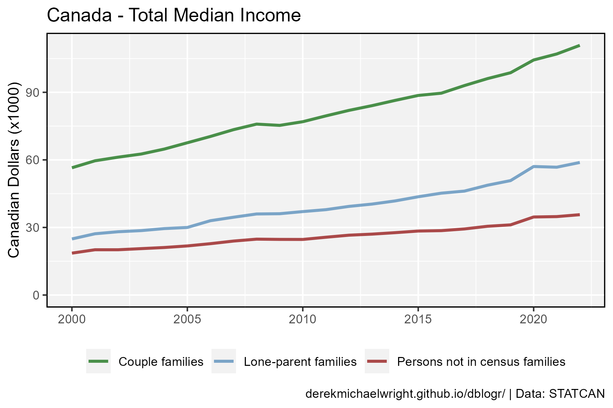

```{r}
# Prep data
xx <- d4 %>% filter(Area == "Canada", Age == "Total all ages")
# Plot
mp <- ggplot(xx, aes(x = Year, y = Value / 1000, color = FamilyType)) +
  geom_line(size = 1, alpha = 0.7) +
  scale_color_manual(name = NULL, values = myColors_Fam) +
  expand_limits(y = 0) +
  theme_agData(legend.position = "bottom") +
  labs(title = "Canada - Total Median Income", x = NULL,
       y = "Canadian Dollars (x1000)", caption = myCaption)
ggsave("canada_employment_5_01.png", mp, width = 6, height = 4)
```

---

## Provinces

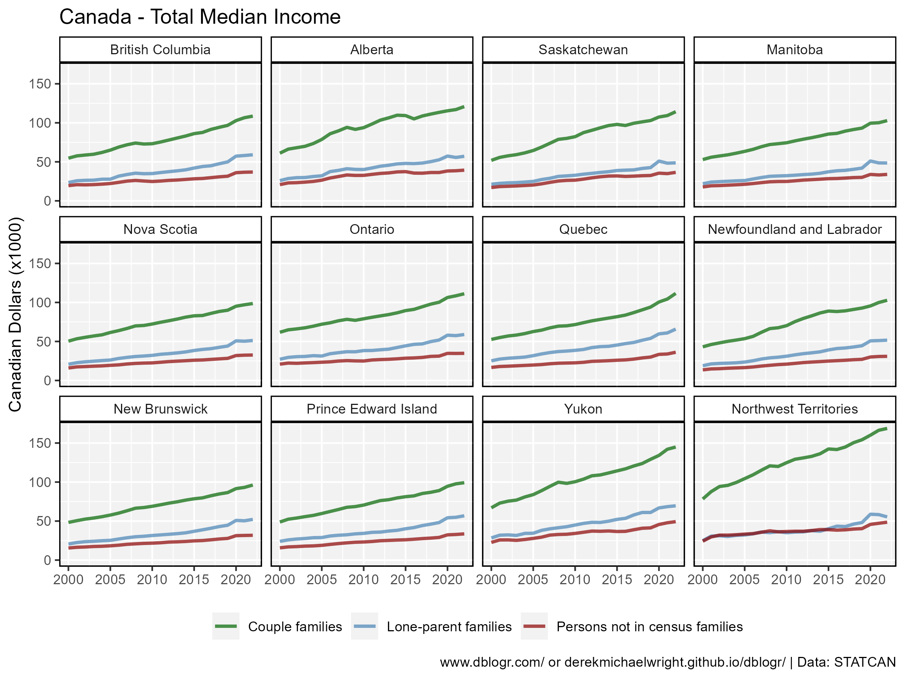

```{r}
# Prep data
xx <- d4 %>% filter(Area != "Canada", Age == "Total all ages")
# Plot
mp <- ggplot(xx, aes(x = Year, y = Value / 1000, color = FamilyType)) +
  geom_line(size = 1, alpha = 0.7) +
  facet_wrap(Area ~ .) +
  scale_color_manual(name = NULL, values = myColors_Fam) +
  expand_limits(y = 0) +
  theme_agData(legend.position = "bottom") +
  labs(title = "Canada - Total Median Income", x = NULL,
       y = "Canadian Dollars (x1000)", caption = myCaption)
ggsave("canada_employment_5_02.png", mp, width = 8, height = 6)
```

---

## Age

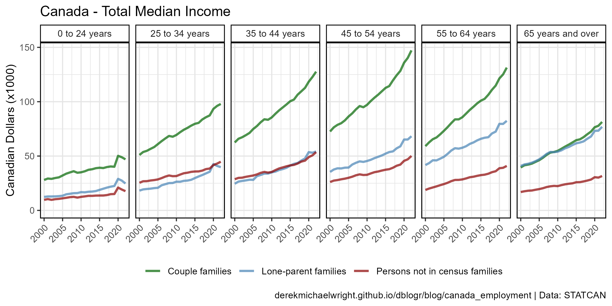

```{r}
# Prep data
xx <- d4 %>% filter(Area == "Canada", Age != "Total all ages")
# Plot
mp <- ggplot(xx, aes(x = Year, y = Value / 1000, color = FamilyType)) +
  geom_line(size = 1, alpha = 0.7) +
  facet_grid(. ~ Age) +
  scale_color_manual(name = NULL, values = myColors_Fam) +
  expand_limits(y = 0) +
  theme_agData(legend.position = "bottom",
               axis.text.x = element_text(angle = 45, hjust = 1)) +
  labs(title = "Canada - Total Median Income", x = NULL,
       y = "Canadian Dollars (x1000)", caption = myCaption)
ggsave("canada_employment_5_03.png", mp, width = 8, height = 4)
```

---

### Income Growth Rate

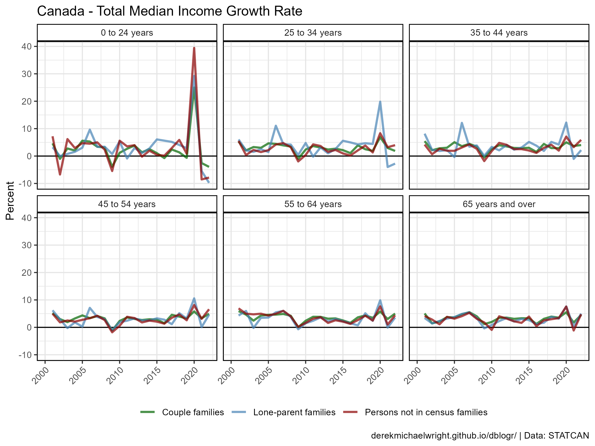

```{r}
# Prep data
xx <- d4 %>% filter(Area == "Canada", Age != "Total all ages") %>%
  group_by(Area, FamilyType, Age) %>%
  mutate(PreviousYear = lag(Value),
         Rate = 100 * (Value - PreviousYear) / PreviousYear)
# Plot
mp <- ggplot(xx, aes(x = Year, y = Rate)) +
  geom_hline(yintercept = 0, color = "black") +
  geom_line(aes(color = FamilyType), size = 1, alpha = 0.7) +
  facet_wrap(Age ~ ., ncol = 3) +
  scale_color_manual(name = NULL, values = myColors_Fam) +
  expand_limits(y = 0) +
  theme_agData(legend.position = "bottom",
               axis.text.x = element_text(angle = 45, hjust = 1)) +
  labs(title = "Canada - Total Median Income Growth Rate", x = NULL,
       y = "Percent", caption = myCaption)
ggsave("canada_employment_5_04.png", mp, width = 8, height = 6)
```

---

### Inflation Adjusted Income Growth Rate

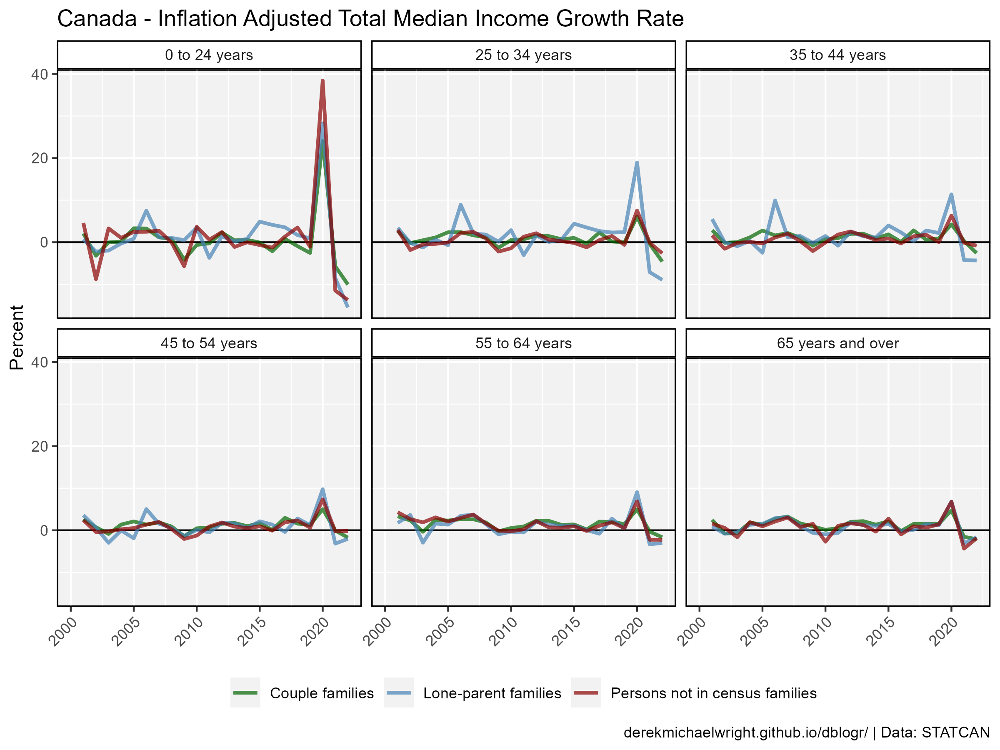

```{r}
# Prep data
xx <- d4 %>% filter(Area == "Canada", Age != "Total all ages") %>%
  left_join(d5, by = c("Area", "Year")) %>%
  mutate(InflationValue = Value / CPI) %>%
  group_by(Area, FamilyType, Age) %>%
  mutate(PreviousYear = lag(InflationValue),
         Rate = 100 * (InflationValue - PreviousYear) / PreviousYear)
# Plot
mp <- ggplot(xx, aes(x = Year, y = Rate)) +
  geom_hline(yintercept = 0, color = "black") +
  geom_line(aes(color = FamilyType), size = 1, alpha = 0.7) +
  facet_wrap(Age ~ ., ncol = 3) +
  scale_color_manual(name = NULL, values = myColors_Fam) +
  expand_limits(y = 0) +
  theme_agData(legend.position = "bottom",
               axis.text.x = element_text(angle = 45, hjust = 1)) +
  labs(title = "Canada - Inflation Adjusted Total Median Income Growth Rate",
       x = NULL, y = "Percent", caption = myCaption)
ggsave("canada_employment_5_05.png", mp, width = 8, height = 6)
```

---

# EI

## Canada

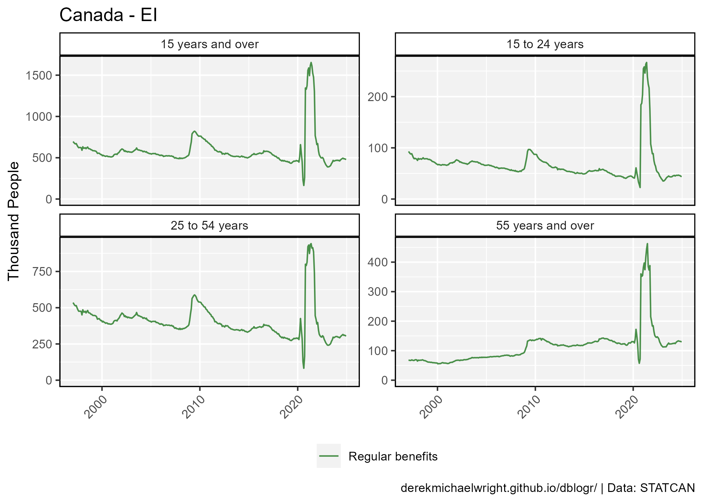

```{r}
# Prep data
xx <- d6 %>% filter(Area == "Canada", Sex == "Both sexes")
# Plot
mp <- ggplot(xx, aes(x = Date, y = Value / 1000)) +
  geom_line(aes(color = Measurement), alpha = 0.7) +
  facet_wrap(Age ~ ., scales = "free_y") +
  scale_color_manual(name = NULL, values = myColors_Fam) +
  expand_limits(y = 0) +
  theme_agData(legend.position = "bottom",
               axis.text.x = element_text(angle = 45, hjust = 1)) +
  labs(title = "Canada - EI", x = NULL, 
       y = "Thousand People", caption = myCaption)
ggsave("canada_employment_6_01.png", mp, width = 7, height = 5)
```


---

## By Sex

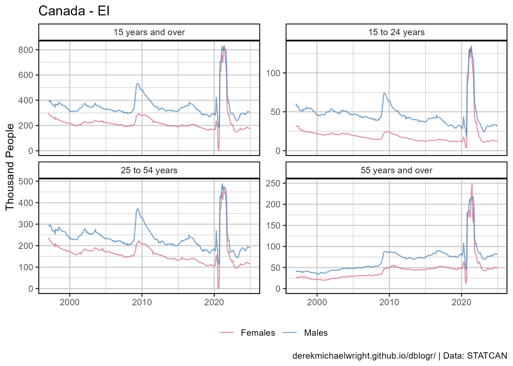

```{r}
# Prep data
xx <- d6 %>% filter(Area == "Canada", Sex != "Both sexes")
# Plot
mp <- ggplot(xx, aes(x = Date, y = Value / 1000)) +
  geom_line(aes(color = Sex), alpha = 0.7) +
  facet_wrap(Age ~ ., scales = "free_y") +
  scale_color_manual(name = NULL, values = myColors_Sex) +
  expand_limits(y = 0) +
  theme_agData(legend.position = "bottom",
               axis.text.x = element_text(angle = 45, hjust = 1)) +
  labs(title = "Canada - EI", x = NULL, 
       y = "Thousand People", caption = myCaption)
ggsave("canada_employment_6_02.png", mp, width = 7, height = 5)
```

---

## Post 2020

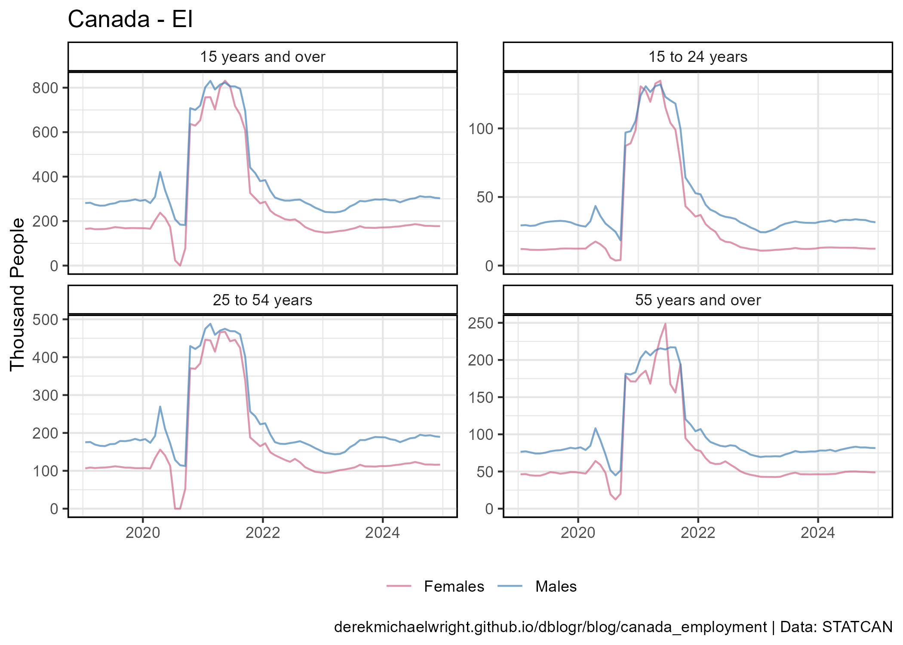

```{r}
# Prep data
xx <- d6 %>% filter(Area == "Canada", Sex != "Both sexes",
                    Date > "2019-01-01")
# Plot
mp <- ggplot(xx, aes(x = Date, y = Value / 1000)) +
  geom_line(aes(color = Sex), alpha = 0.7) +
  facet_wrap(Age ~ ., scales = "free_y") +
  scale_color_manual(name = NULL, values = myColors_Sex) +
  expand_limits(y = 0) +
  theme_agData(legend.position = "bottom",
               axis.text.x = element_text(angle = 45, hjust = 1)) +
  labs(title = "Canada - EI", x = NULL, 
       y = "Thousand People", caption = myCaption)
ggsave("canada_employment_6_03.png", mp, width = 7, height = 5)
```

---

## Provinces

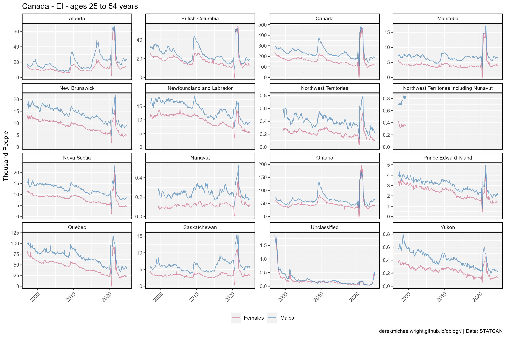

```{r}
# Prep data
xx <- d6 %>% filter(Sex != "Both sexes", Age == "25 to 54 years")
# Plot
mp <- ggplot(xx, aes(x = Date, y = Value / 1000)) +
  geom_line(aes(color = Sex), alpha = 0.7) +
  facet_wrap(Area ~ ., scales = "free_y") +
  scale_color_manual(name = NULL, values = myColors_Sex) +
  expand_limits(y = 0) +
  theme_agData(legend.position = "bottom",
               axis.text.x = element_text(angle = 45, hjust = 1)) +
  labs(title = "Canada - EI - ages 25 to 54 years", x = NULL, 
       y = "Thousand People", caption = myCaption)
ggsave("canada_employment_6_04.png", mp, width = 12, height = 8)
```
