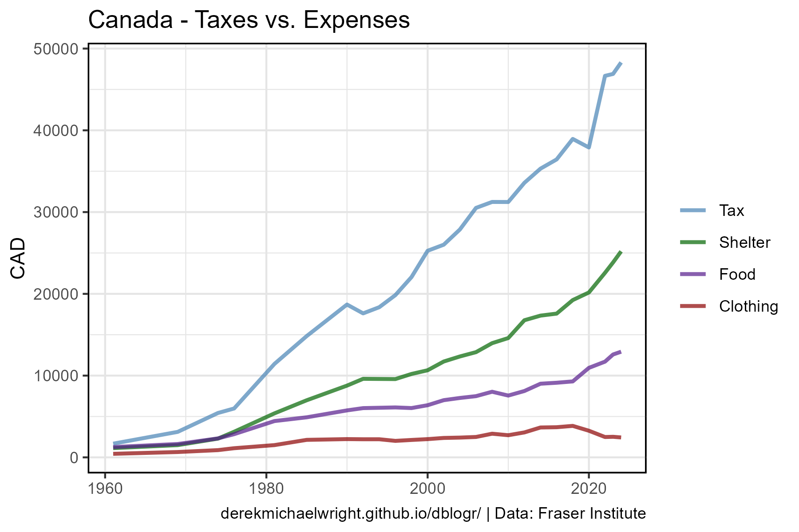

```{r setup, include=FALSE}
knitr::opts_chunk$set(echo = T, message = F, warning = F)
```

---

# Introduction

# Data

STATCAN Table: 36-10-0662-01 (Distributions of household economic accounts, income, consumption and saving

> - `r shiny::icon("globe")` [https://www150.statcan.gc.ca/t1/tbl1/en/cv.action?pid=3610066201](https://www150.statcan.gc.ca/t1/tbl1/en/cv.action?pid=3610066201){target="_blank"}
> - `r shiny::icon("save")` [3610066201_databaseLoadingData.csv](3610066201_databaseLoadingData.csv)

---

# Prepare Data

```{r class.source = "fold-show"}
# devtools::install_github("derekmichaelwright/agData")
library(agData)
```

```{r}
# Prep data
myCaption <- "www.dblogr.com/ or derekmichaelwright.github.io/dblogr/ | Data: STATCAN"
#
dd <- read.csv("3610066201_databaseLoadingData.csv") %>%
  select(Date=REF_DATE, Area=GEO, 
         Measurement=Statistics, 
         Item=Income..consumption.and.savings,
         Group=Characteristics, Value=VALUE) %>% 
  mutate(Date = as.Date(paste0(Date, "-01")))
```

---

#  All Households

## Disposable Income



```{r}
# Prep data
xx <- dd %>% filter(Group == "All households", Item == "Household disposable income")
# Plot
mp <- ggplot(xx, aes(x = Date, y = Value / 1000)) +
  geom_line(lwd = 2) +
  scale_color_manual(values = agData_Colors) +
  theme_agData() +
  labs(title = "Canada - Household disposable income", x = NULL, 
       y = "Thousand Dollars", caption = myCaption)
ggsave("canada_expenses_01.png", mp, width = 6, height = 4)
```

```{r echo = F}
ggsave("featured.png", mp, width = 6, height = 4)
```

---


```{r}
# Prep data
xx <- dd %>% filter(Group == "All households")
# Plot
mp <- ggplot(xx, aes(x = Date, y = Value, color = Item)) +
  geom_line() +
  facet_wrap(Item ~ ., ncol = 4, scales = "free_y",
             labeller = label_wrap_gen(width = 40)) +
  scale_color_manual(values = agData_Colors) +
  theme_agData(legend.position = "none") +
  labs(title = "Canada - Household Expenses", x = NULL, 
       y = "Thousand Dollars", caption = myCaption)
ggsave("canada_expenses_02.png", mp, width = 10, height = 8)
unique(dd$Item)
```

---


```{r}
# Prep data
myItems <- c("Household disposable income","Adjusted household disposable income")
xx <- dd %>% 
  filter(Group == "All households", Item %in% myItems)
# Plot
mp <- ggplot(xx, aes(x = Date, y = Value, color = Item)) +
  geom_line() +
  scale_color_manual(values = agData_Colors) +
  theme_agData() +
  labs(title = "", x = "", y = "", caption = myCaption)
ggsave("canada_expenses_01.png", mp, width = 6, height = 4)
```
