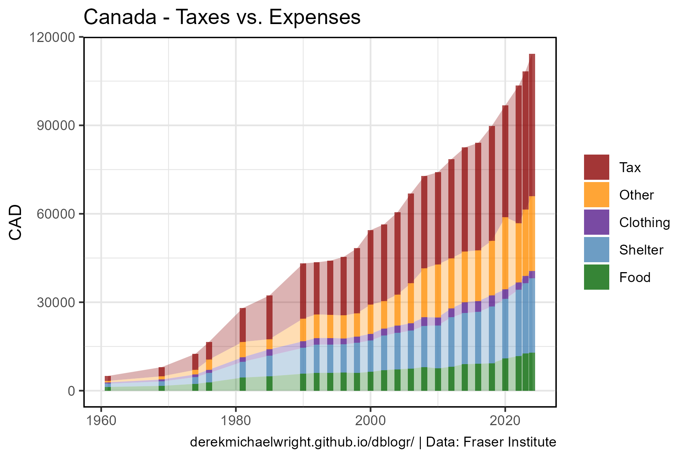
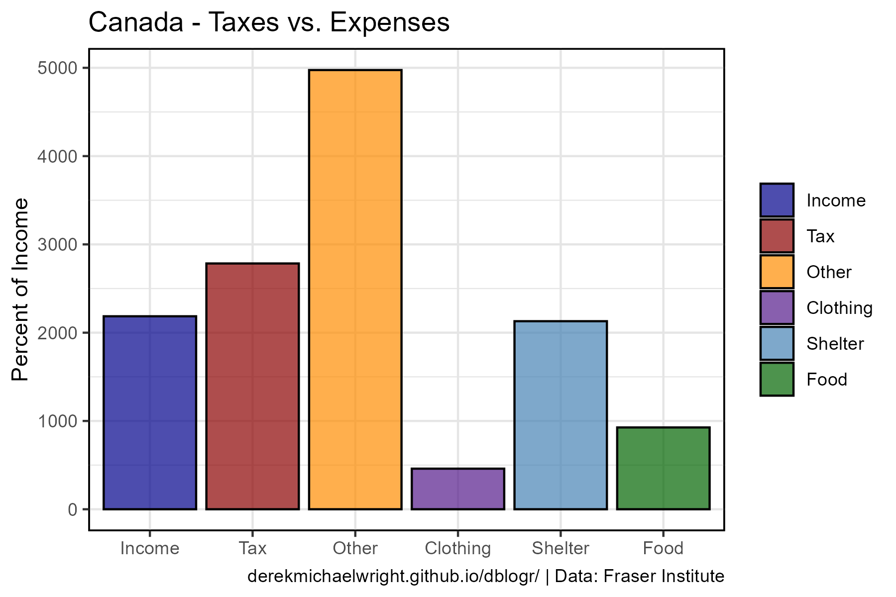

```{r setup, include=FALSE}
knitr::opts_chunk$set(echo = TRUE, message = F, warning = F)
```

---

# Data

> - `r shiny::icon("globe")` [https://www.fraserinstitute.org/studies/taxes-versus-necessities-life-canadian-consumer-tax-index-2025-edition](https://www.fraserinstitute.org/studies/taxes-versus-necessities-life-canadian-consumer-tax-index-2025-edition){target="_blank"}
> - `r shiny::icon("save")` [data_canada_expenses.xlsx](data_canada_expenses.xlsx)

---

# Prepare Data

```{r class.source = 'fold-show'}
# devtools::install_github("derekmichaelwright/agData")
library(agData)
library(readxl)
```

```{r}
# Prep data
myCaption <- "derekmichaelwright.github.io/dblogr/ | Data: Fraser Institute"

d1 <- read_xlsx("data_canada_expenses.xlsx", "Expenses") %>%
  mutate(Other = Income - Tax - Shelter - Food - Clothing)
d2 <- read_xlsx("data_canada_expenses.xlsx", "Inflation Adjusted")
# Percent increase function
percentIncrease <- function(xx, myTrait = "Food", baseYear = 1961) {
  baseValue <- xx %>% filter(Year == baseYear) %>% pull(get(myTrait))
  xx %>% 
    mutate(Value = 100 * (get(myTrait) - baseValue) / baseValue) %>%
    pull(Value) %>% 
    round(1)
}
```

---

# Expenses vs Taxes {.tabset .tabset-pills}

## Line


```{r}
# Prep data
myColors <- c("darkred", "purple4", "darkgreen", "steelblue")
myItems <- c("Tax", "Shelter", "Food", "Clothing")
xx <- d1 %>% select(-Income) %>%
  gather(Item, Value, 2:5) %>%
  mutate(Item = factor(Item, levels = myItems))
# Plot
mp <- ggplot(xx, aes(x = Year, y = Value, color = Item)) +
  geom_line(size = 1, alpha = 0.7) +
  scale_color_manual(name = NULL, values = rev(myColors)) +
  theme_agData() +
  labs(title = "Canada - Taxes vs. Expenses", 
       y = "CAD", x = NULL, caption = myCaption)
ggsave("canada_expenses_01.png", mp, width = 6, height = 4)
```

---

## Bar



```{r}
# Prep data
myColors <- c("darkred", "darkorange", "purple4", "steelblue", "darkgreen")
myItems <- c("Tax", "Other", "Clothing", "Shelter", "Food")
xx <- d1 %>% gather(Item, Value, 3:7) %>%
  mutate(Item = factor(Item, levels = myItems))
# Plot
mp <- ggplot(xx, aes(x = Year, y = Value, fill = Item)) +
  geom_area(alpha = 0.3) +
  geom_col(alpha = 0.7) +
  scale_fill_manual(name = NULL, values = myColors) +
  theme_agData() +
  labs(title = "Canada - Taxes vs. Expenses",
       y = "CAD", x = NULL, caption = myCaption)
ggsave("canada_expenses_02.png", mp, width = 6, height = 4)
```

```{r echo = F}
ggsave("featured.png", mp, width = 6, height = 4)
```

---

# Percent of Income {.tabset .tabset-pills}

## Line


```{r}
# Prep data
myColors <- c("darkgreen", "darkred", "darkorange")
myItems <- c("Essentials", "Tax", "Other")
xx <- d1 %>% 
  mutate(Essentials = Shelter + Food + Clothing) %>%
  select(-Shelter, -Food, -Clothing) %>%
  gather(Item, Value, 3:5) %>%
  mutate(Value = 100 * Value / Income,
         Item = factor(Item, levels = myItems))
# Plot
mp <- ggplot(xx, aes(x = Year, y = Value, color = Item)) +
  geom_line(size = 1, alpha = 0.7) +
  scale_color_manual(name = NULL, values = myColors) +
  theme_agData() +
  labs(title = "Canada - Taxes vs. Expenses",
       y = "Percent of Income", x = NULL, caption = myCaption)
ggsave("canada_expenses_03.png", mp, width = 6, height = 4)
mp <- mp + facet_wrap(Item ~ ., ncol = 3, scales = "free_y") +
  theme(legend.position = "none")
ggsave("canada_expenses_04.png", mp, width = 10, height = 4)
```

---

## Bar


```{r}
# Prep data
myColors <- c("darkred", "darkorange", "purple4", "steelblue", "darkgreen")
myItems <- c("Tax", "Other", "Clothing", "Shelter", "Food")
xx <- d1 %>% 
  gather(Item, Value, 3:7) %>%
  mutate(Value = 100 * Value / Income) %>%
  mutate(Item = factor(Item, levels = myItems))
# Plot
mp <- ggplot(xx, aes(x = Year, y = Value, fill = Item)) +
  geom_area(alpha = 0.3) +
  geom_col(alpha = 0.7) +
  scale_fill_manual(name = NULL, values = myColors) +
  theme_agData() +
  labs(title = "Canada - Taxes vs. Expenses",
       y = "Percent of Income", x = NULL, caption = myCaption)
ggsave("canada_expenses_05.png", mp, width = 6, height = 4)
```

---

## 2024



```{r}
# Prep data
myColors <- c("darkblue", "darkred", "darkorange", "purple4", "steelblue", "darkgreen")
myItems <- c("Income", "Tax", "Other", "Clothing", "Shelter", "Food")
xx <- d1 %>% 
  mutate(Income   = percentIncrease(d1, "Income"),
         Tax      = percentIncrease(d1, "Tax"),
         Food     = percentIncrease(d1, "Food"),
         Clothing = percentIncrease(d1, "Clothing"),
         Shelter  = percentIncrease(d1, "Shelter"),
         Other      = percentIncrease(d1, "Other") ) %>%
  filter(Year == 2024) %>%
  gather(Item, Value, 2:7) %>%
  mutate(Item = factor(Item, levels = myItems))
# Plot
mp <- ggplot(xx, aes(x = Item, y = Value, fill = Item)) +
  geom_col(alpha = 0.7, color = "black") +
  scale_fill_manual(name = NULL, values = myColors) +
  theme_agData() +
  labs(title = "Canada - Taxes vs. Expenses",
       y = "Percent of Income", x = NULL,caption = myCaption)
ggsave("canada_expenses_06.png", mp, width = 6, height = 4)
```

---

# Inflation Adjusted Tax Bill


```{r}
# Prep data
xx <- d2 %>% mutate(Percent = percentIncrease(d2, "Tax"))
# Prep sec_axis
y1_min <- min(c(xx$Percent))
y1_max <- max(c(xx$Percent))
y2_min <- min(xx$Tax)
y2_max <- max(xx$Tax)
mySA <- sec_axis(~(. - y1_min) * (y2_max - y2_min) / (y1_max - y1_min) + y2_min, 
                 name = "CAD")
# Plot
mp <- ggplot(xx, aes(x = Year, y = Percent)) +
  geom_line(color = "darkgreen", size = 1.25, alpha = 0.7) +
  geom_point(alpha = 0.7) +
  scale_y_continuous(sec.axis = mySA) +
  theme_agData() +
  labs(title = "Canada - Inflation Adjusted Tax Bill", 
       y = "Percent Increase", x = NULL, caption = myCaption)
ggsave("canada_expenses_07.png", mp, width = 6, height = 4)
```

---
