```{r setup, include=FALSE}
knitr::opts_chunk$set(echo = T, message = F, warning = F, out.width = "100%")
```

---

# Data

https://www150.statcan.gc.ca/t1/tbl1/en/cv.action?pid=2510006301

`r shiny::icon("save")` [2510006301_databaseLoadingData.csv](2510006301_databaseLoadingData.csv)

https://www150.statcan.gc.ca/t1/tbl1/en/cv.action?pid=2510005501

`r shiny::icon("save")` [2510005501_databaseLoadingData.csv](2510005501_databaseLoadingData.csv)

https://www150.statcan.gc.ca/t1/tbl1/en/cv.action?pid=2510004601

`r shiny::icon("save")` [2510004601_databaseLoadingData.csv](2510004601_databaseLoadingData.csv)

```{r class.source = 'fold-show'}
# devtools::install_github("derekmichaelwright/agData")
library(agData)
```

---

# Prepare Data

```{r}
# Prep data
myCaption <- "derekmichaelwright.github.io/dblogr/ | Data: STATCAN"
myColors1 <- c("black", "grey50", "slategray3")
myColors2 <- c("darkgreen", "steelblue", "darkred")
myMeasures <- c("Production", "Exports", "Imports",
                "Gross withdrawals", "Industrial consumption",
                "Residential consumption", "Commercial consumption")
# Oil
dd_oil <- read.csv("2510006301_databaseLoadingData.csv") %>%
  mutate(Item = "Crude oil") %>%
  select(Date=1, Area=GEO, Item, Measurement=4, Unit=UOM, Value=VALUE) %>%
  mutate(Date = as.Date(paste0(Date,"-01"), format = "%Y-%m-%d"),
         Measurement = plyr::mapvalues(Measurement, 
            "Crude oil production", "Production"),
         Measurement = factor(Measurement, levels = myMeasures)) %>%
  filter(!is.na(Value))
# Natural gas
dd_gas <- read.csv("2510005501_databaseLoadingData.csv") %>%
  mutate(Item = "Natural gas") %>%
  select(Date=1, Area=GEO, Item, Measurement=4, Unit=UOM, Value=VALUE) %>%
  mutate(Date = as.Date(paste0(Date,"-01"), format = "%Y-%m-%d"),
         #Value = Value * 1000
         Measurement = plyr::mapvalues(Measurement, 
            "Marketable production", "Production"),
         Measurement = factor(Measurement, levels = myMeasures),
         Unit = "Thousand cubic meters") %>%
  filter(!is.na(Value))
# Coal
dd_coal <- read.csv("2510004601_databaseLoadingData.csv") %>%
  mutate(Item = "Coal") %>%
  select(Date=1, Area=GEO, Item, Measurement=5, Unit=UOM, Value=VALUE) %>%
  mutate(Date = as.Date(paste0(Date,"-01"), format = "%Y-%m-%d"),
         Measurement = factor(Measurement, levels = myMeasures),
         Value = 1000 * Value, UOM = "Kilograms") %>%
  filter(!is.na(Value))
#
dd <- bind_rows(dd_oil, dd_gas, dd_coal)
```

---

# Fossil Fuels

## Production, Export & Import

```{r}
# Create plotting function
gg_PEI <- function(myArea) {
  # Prep data
  myMeasures <- c("Production", "Exports", "Imports")
  xx <- dd %>% 
    filter(Area == myArea, Measurement %in% myMeasures, 
           Date > as.Date("2015-12-30"))
  myItems <- c("Coal (Tonnes)", "Crude oil (Cubic metres)",
               "Natural gas (Thousand cubic meters)")
  # Plot
  ggplot(xx, aes(x = Date, y = Value / 1000000, 
                 color = paste0(Item," (", Unit, ")"))) +
    geom_line(size = 1, alpha = 0.7) +
    scale_color_manual(name = NULL, values = myColors1, breaks = myItems) +
    scale_x_date(date_breaks = "year", date_labels = "%Y") +
    facet_grid(. ~ Measurement, scales = "free_y") +
    theme_agData(legend.position = "bottom",
                 axis.text.x = element_text(angle = 45, hjust = 1)) +
    labs(title = paste(myArea, "- Fossil Fuel Production, Export & Import"),
         y = "Value / 1,000,000", x = NULL, caption = myCaption)
}
```

### Canada

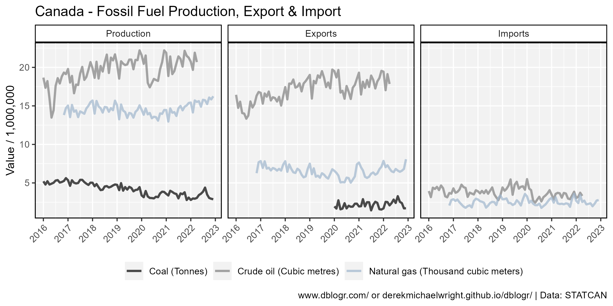

```{r}
# Plot
mp <- gg_PEI(myArea = "Canada")
ggsave("canada_fossil_fuels_1_01.png", mp, width = 8, height = 4)
```

```{r echo = F}
ggsave("featured.png", mp, width = 8, height = 4)
```

---

### Alberta

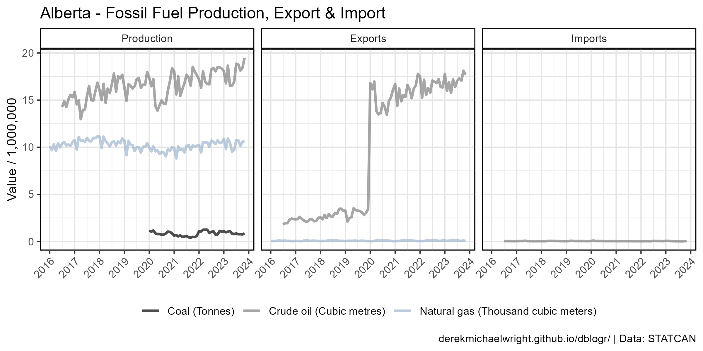

```{r}
# Plot
mp <- gg_PEI(myArea = "Alberta")
ggsave("canada_fossil_fuels_1_02.png", mp, width = 8, height = 4)
```

---

### British Columbia

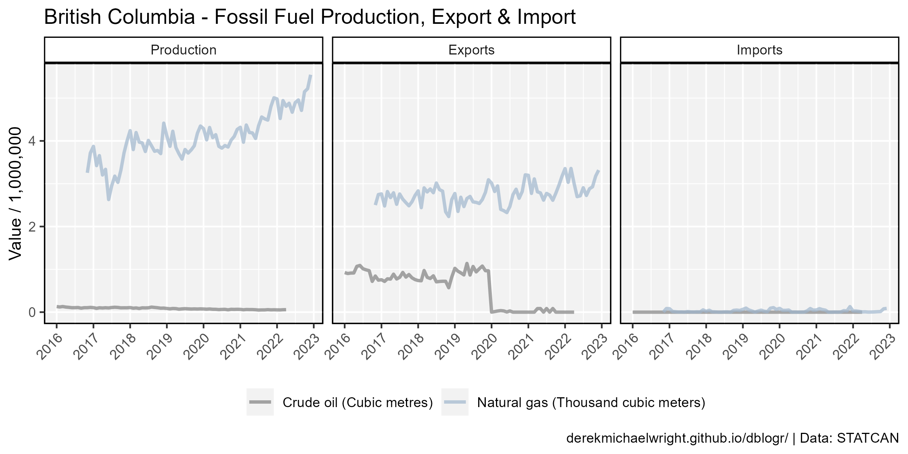

```{r}
mp <- gg_PEI(myArea = "British Columbia")
ggsave("canada_fossil_fuels_1_03.png", mp, width = 8, height = 4)
```

---

### Saskatchewan

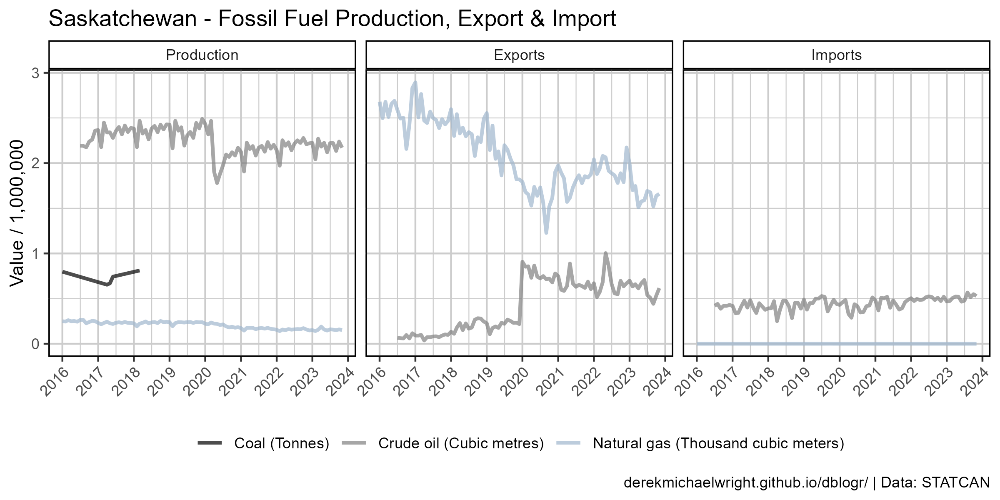

```{r}
mp <- gg_PEI(myArea = "Saskatchewan")
ggsave("canada_fossil_fuels_1_04.png", mp, width = 8, height = 4)
```

---

### Manitoba

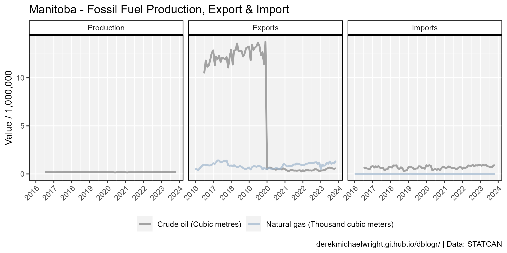

```{r}
mp <- gg_PEI(myArea = "Manitoba")
ggsave("canada_fossil_fuels_1_05.png", mp, width = 8, height = 4)
```

---

### Ontario

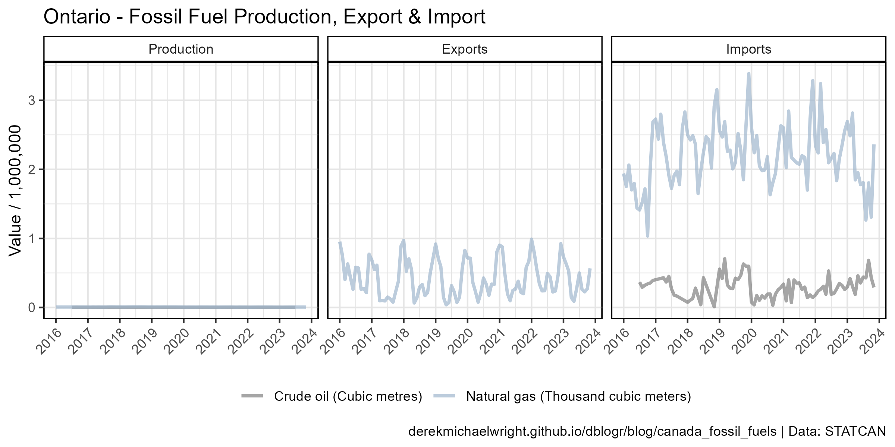

```{r}
mp <- gg_PEI(myArea = "Ontario")
ggsave("canada_fossil_fuels_1_06.png", mp, width = 8, height = 4)
```

---

### Quebec

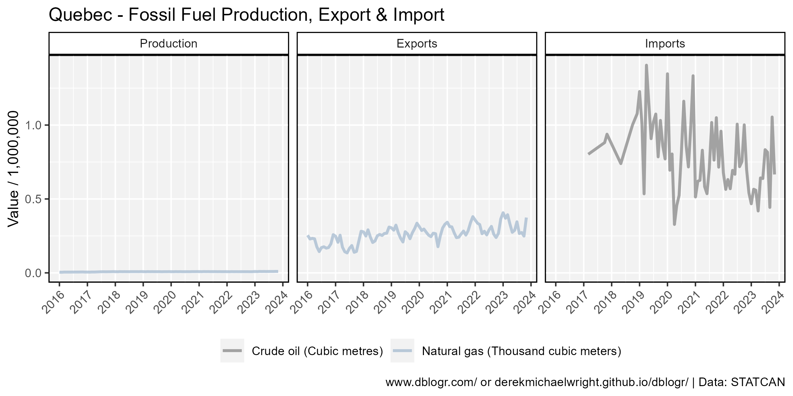

```{r}
mp <- gg_PEI(myArea = "Quebec")
ggsave("canada_fossil_fuels_1_07.png", mp, width = 8, height = 4)
```

---

## Production

### Canada

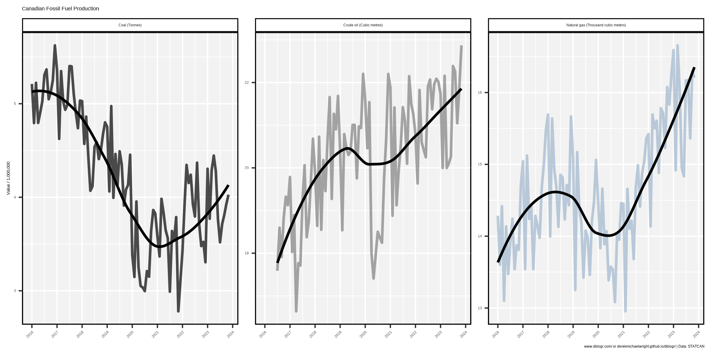

```{r}
# Prep data
xx <- dd %>% 
  filter(Area == "Canada", Measurement == "Production", 
         Date > as.Date("2015-12-30"))
# Plot
mp <- ggplot(xx, aes(x = Date, y = Value / 1000000, color = Item)) +
  geom_line(size = 1, alpha = 0.7) +
  stat_smooth(geom = "line", se = F, color = "black", size = 1) +
  scale_color_manual(name = NULL, values = myColors1) +
  scale_x_date(date_breaks = "year", date_labels = "%Y") +
  facet_wrap(paste0(Item," (", Unit, ")") ~ ., scales = "free_y") +
  theme_agData(axis.text.x = element_text(angle = 45, hjust = 1),
               legend.position = "none") +
  labs(title = "Canadian Fossil Fuel Production",
       y = "Value / 1,000,000", x = NULL, caption = myCaption)
ggsave("canada_fossil_fuels_1_08.png", mp, width = 8, height = 4)
```

---

### Provinces

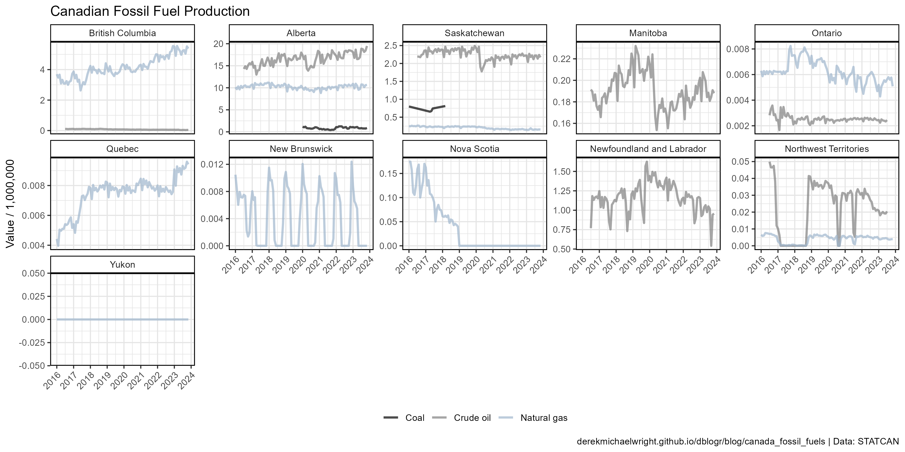

```{r}
# Prep data
myAreas <- c("Alberta", "British Columbia", "Saskatchewan", "Manitoba",
             "Northwest Territories", "Atlantic provinces", 
             "Nova Scotia", "New Brunswick", "Quebec", "Ontario")
xx <- dd %>% 
  filter(Area %in% myAreas, Measurement == "Production", 
         Date > as.Date("2015-12-30")) %>%
  mutate(Area = factor(Area, levels  = myAreas))
# Plot
mp <- ggplot(xx, aes(x = Date, y = Value / 1000000, color = Item)) +
  geom_line(size = 1, alpha = 0.7) +
  scale_color_manual(name = NULL, values = myColors1) +
  scale_x_date(date_breaks = "year", date_labels = "%Y") +
  facet_wrap(Area ~ ., scales = "free_y", ncol = 5) +
  theme_agData(axis.text.x = element_text(angle = 45, hjust = 1),
               legend.position = "bottom") +
  labs(title = "Canadian Fossil Fuel Production",
       y = "Value / 1,000,000", x = NULL, caption = myCaption)
ggsave("canada_fossil_fuels_1_09.png", mp, width = 10, height = 4.5)
```

---

# Crude Oil

## Canada

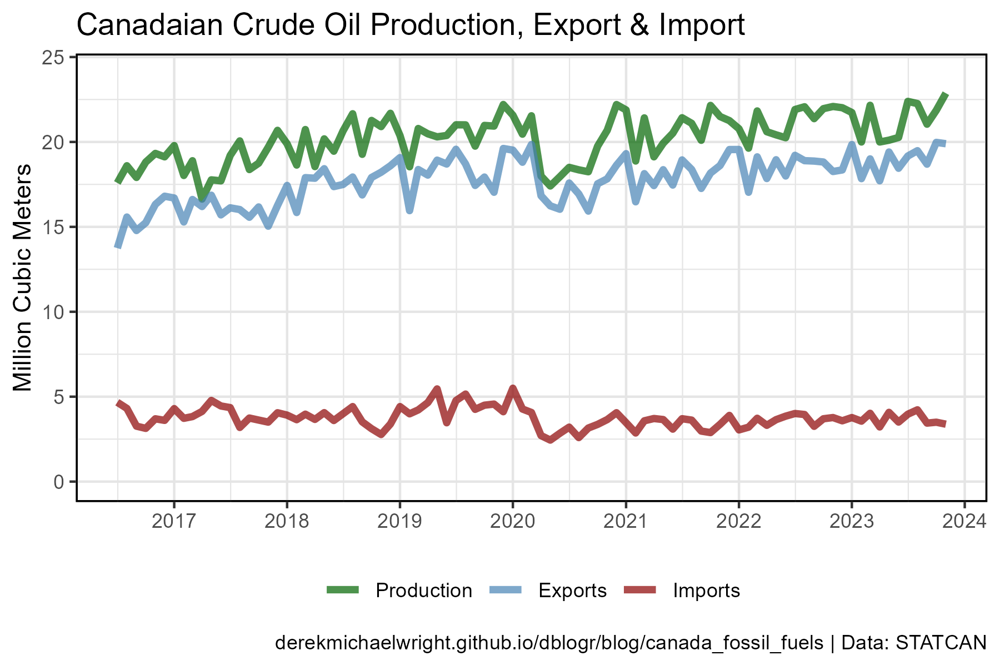

```{r}
# Prep data
xx <- dd_oil %>% filter(Area == "Canada")
# Plot
mp <- ggplot(xx, aes(x = Date, y = Value / 1000000, color = Measurement)) +
  geom_line(size = 1.5, alpha = 0.7) +
  scale_color_manual(name = NULL, values = myColors2) +
  scale_x_date(date_breaks = "year", date_labels = "%Y") +
  ylim(c(0, 24)) +
  theme_agData(legend.position = "bottom") +
  labs(title = "Canadaian Crude Oil Production, Export & Import",
       y = "Million Cubic Meters", x = NULL, caption = myCaption)
ggsave("canada_fossil_fuels_2_01.png", mp, width = 6, height = 4)
```

---

## Provinces

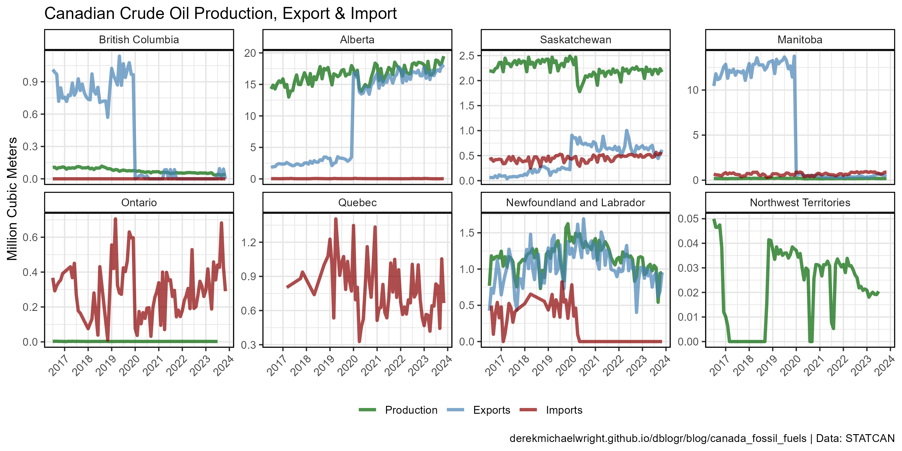

```{r}
# Prep data
myAreas <- c("Alberta", "Saskatchewan", "Manitoba", "British Columbia",
             "Quebec", "Ontario", "Atlantic provinces",
             "Northwest Territories")
xx <- dd_oil %>% filter(Area != "Canada") %>% 
  mutate(Area = factor(Area, levels = myAreas))
# Plot
mp <- ggplot(xx, aes(x = Date, y = Value / 1000000, color = Measurement)) +
  geom_line(alpha = 0.7, size = 1.25) +
  facet_wrap(Area ~ ., scales = "free_y", ncol = 4) +
  scale_color_manual(name = NULL, values = myColors2) +
  scale_x_date(date_breaks = "year", date_labels = "%Y") +
  theme_agData(legend.position = "bottom",
               axis.text.x = element_text(angle = 45, hjust = 1)) +
  labs(title = "Canadian Crude Oil Production, Export & Import", 
       y = "Million Cubic Meters", x = NULL, caption = myCaption)
ggsave("canada_fossil_fuels_2_02.png", mp, width = 10, height = 5)
```

---

## AB & SK

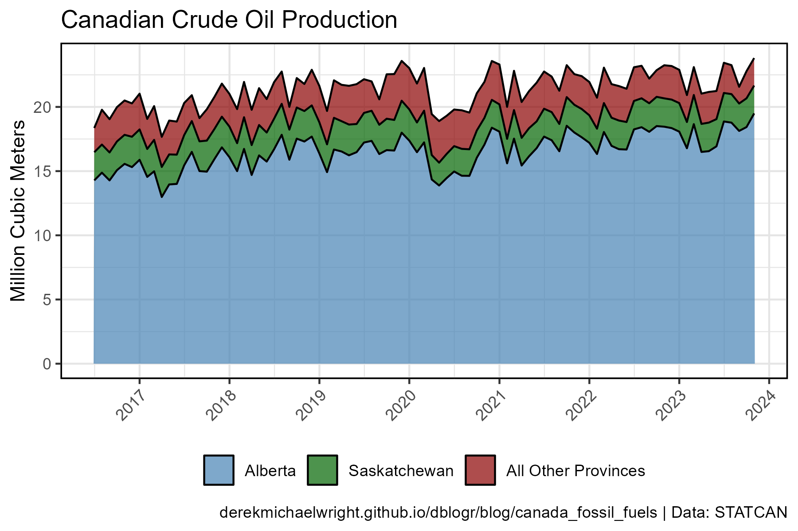

```{r}
# Prep data
myAreas <- c("All Other Provinces", "Saskatchewan", "Alberta")
xx <- dd_oil %>%
  filter(Measurement == "Production",
         !Area %in% c("Canada", "Atlantic provinces")) %>%
  mutate(Area = ifelse(Area %in% myAreas, Area, "All Other Provinces"),
         Area = factor(Area, levels = myAreas)) %>%
  group_by(Date, Area) %>%
  summarise(Value = sum(Value, na.rm = T))
# Plot
mp <- ggplot(xx, aes(x = Date, y = Value / 1000000, fill = Area)) +
  geom_bar(stat = "identity", color = "black", lwd = 0.3, 
           alpha = 0.7) +
  scale_fill_manual(name = NULL, values = myColors2[c(2,1,3)], breaks = rev(myAreas)) +
  scale_x_date(date_breaks = "year", date_labels = "%Y") +
  theme_agData(legend.position = "bottom",
               axis.text.x = element_text(angle = 45, hjust = 1)) +
  labs(title = "Canadian Crude Oil Production",
       y = "Million Cubic Meters", x = NULL, caption = myCaption)
ggsave("canada_fossil_fuels_2_03.png", mp, width = 6, height = 4)
```

---

## Predictions

Using a simple linear model.

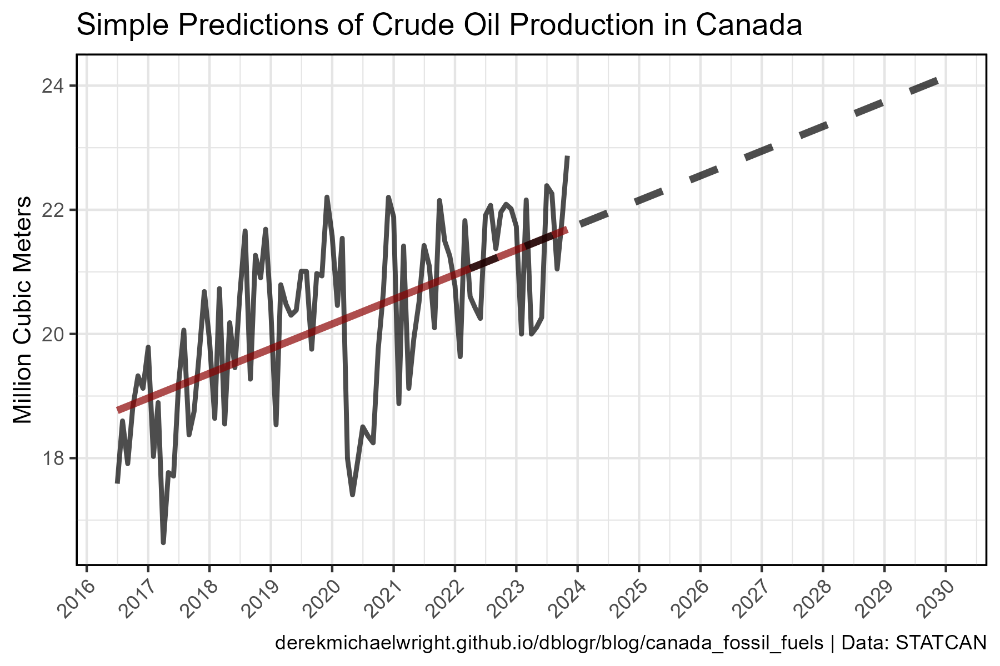

```{r}
# Prep data
xx <- dd_oil %>% filter(Area == "Canada", Measurement == "Production")
fit <- lm(Value ~ Date, data = xx)
x2 <- data.frame(Date = as.Date(c("2022-04-01", "2030-01-01"), format = "%Y-%m-%d"))
x2$Value <- predict(fit, newdata = x2)
# Plot
mp <- ggplot(xx, aes(x = Date, y = Value / 1000000)) +
  geom_line(lwd = 1, alpha = 0.7) +
  stat_smooth(geom = "line", method = "lm", lwd = 2,
              color = "darkred", alpha = 0.7) +
  geom_line(data = x2, lwd = 1.5, lty = 2, alpha = 0.7) +
  scale_x_date(date_breaks = "1 year", date_labels = "%Y") +
  theme_agData(axis.text.x = element_text(angle = 45, hjust = 1)) +
  labs(title = "Simple Predictions of Crude Oil Production in Canada", 
       y = "Million Cubic Meters", x = NULL, caption = myCaption)
ggsave("canada_fossil_fuels_2_04.png", mp, width = 6, height = 4)
```

---

# Natural Gas

## Canada

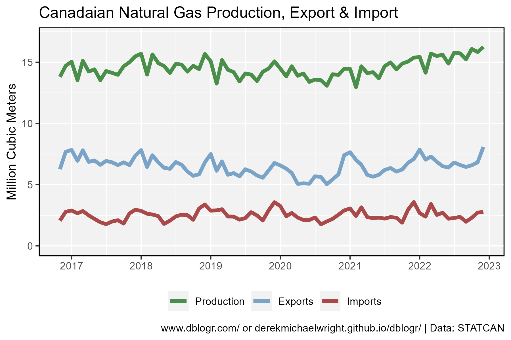

```{r}
# Prep data
myMeasures <- c("Production", "Exports", "Imports")
xx <- dd_gas %>% filter(Area == "Canada", Measurement %in% myMeasures)
# Plot
mp <- ggplot(xx, aes(x = Date, y = Value / 1000000, color = Measurement)) +
  geom_line(size = 1.5, alpha = 0.7) +
  scale_color_manual(name = NULL, values = myColors2) +
  scale_x_date(date_breaks = "year", date_labels = "%Y") +
  ylim(c(0, 17)) +
  theme_agData(legend.position = "bottom") +
  labs(title = "Canadaian Natural Gas Production, Export & Import",
       y = "Million Cubic Meters", x = NULL, caption = myCaption)
ggsave("canada_fossil_fuels_3_01.png", mp, width = 6, height = 4)
```

---

## Provinces

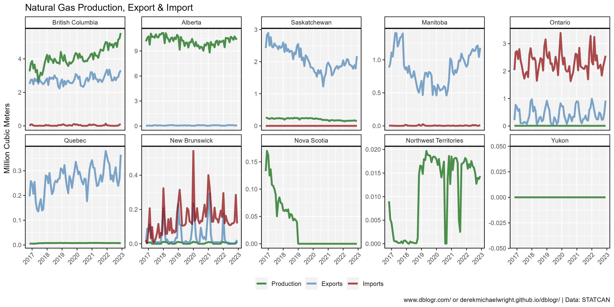

```{r}
# Prep data
myMeasures <- c("Production", "Exports", "Imports")
myAreas <- c("Alberta","British Columbia", "Saskatchewan", "Manitoba",
             "Ontario", "Quebec", "Nova Scotia", "New Brunswick", 
             "Northwest Territories")
xx <- dd_gas %>% 
  filter(Area != "Canada", Measurement %in% myMeasures) %>%
  mutate(Area = factor(Area, levels = myAreas))
# Plot
mp <- ggplot(xx, aes(x = Date, y = Value / 1000000, color = Measurement)) +
  geom_line(alpha = 0.7, size = 1.25) +
  facet_wrap(Area ~ ., scales = "free_y", ncol = 5) +
  scale_color_manual(name = NULL, values = myColors2) +
  scale_x_date(date_breaks = "year", date_labels = "%Y") +
  theme_agData(legend.position = "bottom",
               axis.text.x = element_text(angle = 45, hjust = 1)) +
  labs(title = "Natural Gas Production, Export & Import", 
       y = "Million Cubic Meters", x = NULL, caption = myCaption)
ggsave("canada_fossil_fuels_3_02.png", mp, width = 12, height = 6)
```

---

## AB & BC

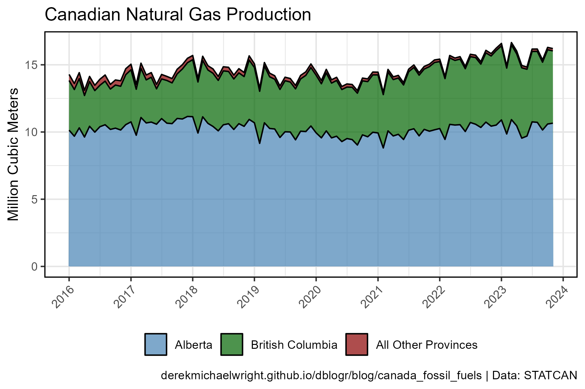

```{r}
# Prep data
myAreas <- c("All Other Provinces", "British Columbia", "Alberta")
xx <- dd_gas %>%
  filter(Measurement == "Production",
         !Area %in% c("Canada", "Atlantic provinces")) %>%
  mutate(Area = ifelse(Area %in% myAreas, Area, "All Other Provinces"),
         Area = factor(Area, levels = myAreas)) %>%
  group_by(Date, Area) %>%
  summarise(Value = sum(Value, na.rm = T))
# Plot
mp <- ggplot(xx, aes(x = Date, y = Value / 1000000, fill = Area)) +
  geom_bar(stat = "identity", color = "black", lwd = 0.3, alpha = 0.7) +
  scale_fill_manual(name = NULL, values = myColors2[c(2,1,3)], breaks = rev(myAreas)) +
  scale_x_date(date_breaks = "year", date_labels = "%Y") +
  theme_agData(legend.position = "bottom",
               axis.text.x = element_text(angle = 45, hjust = 1)) +
  labs(title = "Canadian Natural Gas Production",
       y = "Million Cubic Meters", x = NULL, caption = myCaption)
ggsave("canada_fossil_fuels_3_03.png", mp, width = 6, height = 4)
```

---

## Predictions

Using a simple linear model.

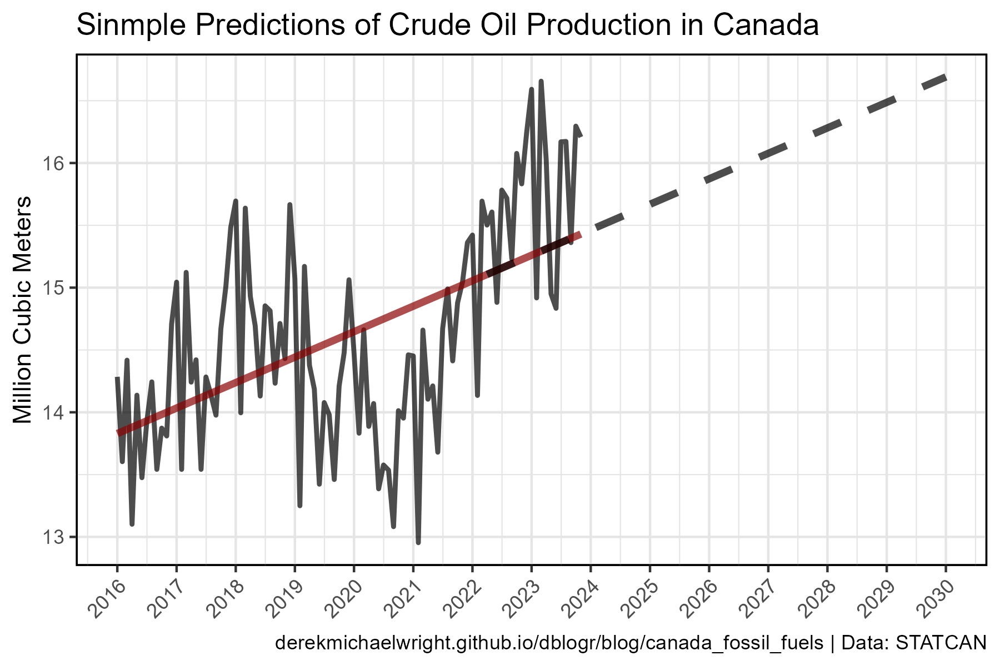

```{r}
# Prep data
xx <- dd_gas %>% filter(Area == "Canada", Measurement == "Production")
fit <- lm(Value ~ Date, data = xx)
x2 <- data.frame(Date = as.Date(c("2022-04-01", "2030-01-01"), format = "%Y-%m-%d"))
x2$Value <- predict(fit, newdata = x2)
# Plot
mp <- ggplot(xx, aes(x = Date, y = Value / 1000000)) +
  geom_line(lwd = 1, alpha = 0.7) +
  stat_smooth(geom = "line", method = "lm", lwd = 2,
              color = "darkred", alpha = 0.7) +
  geom_line(data = x2, lwd = 1.5, lty = 2, alpha = 0.7) +
  scale_x_date(date_breaks = "1 year", date_labels = "%Y") +
  theme_agData(axis.text.x = element_text(angle = 45, hjust = 1)) +
  labs(title = "Predictions of Crude Oil Production in Canada", 
       y = "Million Cubic Meters", x = NULL, caption = myCaption)
ggsave("canada_fossil_fuels_3_04.png", mp, width = 6, height = 4)
```

---

## Consumption

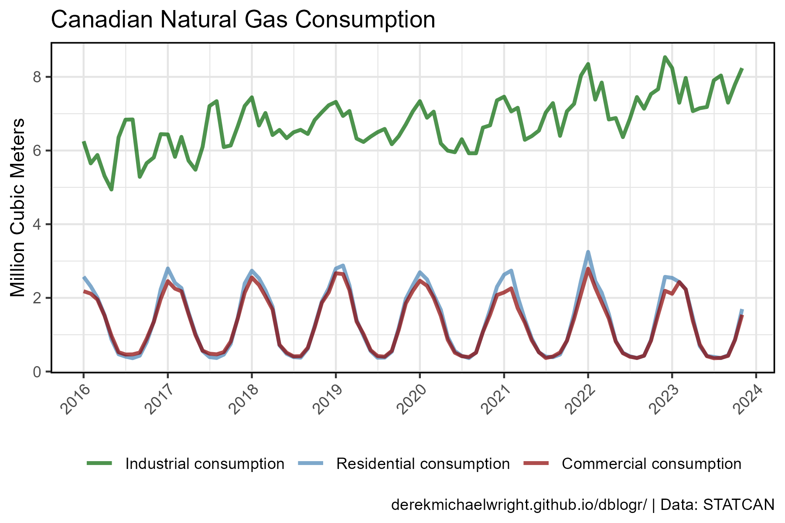

```{r}
# Prep data
myMeasures <- c("Industrial consumption", "Residential consumption", 
                "Commercial consumption")
xx <- dd_gas %>% filter(Area == "Canada", Measurement %in% myMeasures) %>%
  mutate(Measurement = factor(Measurement, levels = myMeasures))
# Plot
mp <- ggplot(xx, aes(x = Date, y = Value / 1000000, color = Measurement)) +
  geom_line(size = 1, alpha = 0.7) +
  scale_color_manual(name = NULL, values = myColors2) +
  scale_x_date(date_breaks = "1 year", date_labels = "%Y") +
  theme_agData(legend.position = "bottom",
               axis.text.x = element_text(angle = 45, hjust = 1)) +
  labs(title = "Canadian Natural Gas Consumption", 
       y = "Million Cubic Meters", x = NULL, caption = myCaption)
ggsave("canada_fossil_fuels_3_05.png", mp, width = 6, height = 4)
```

---

# Coal

## Canada

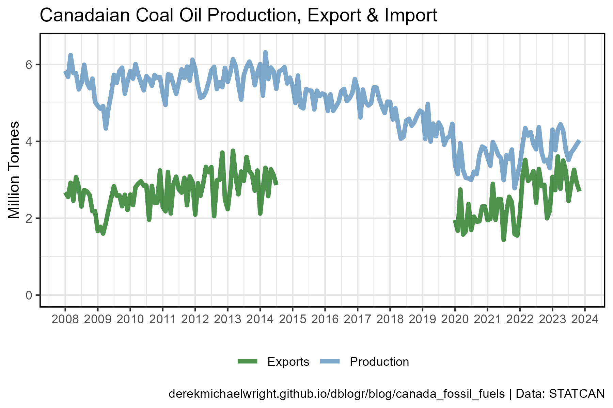

```{r}
# Prep data
xx <- dd_coal %>% filter(Area == "Canada") %>% 
  spread(Measurement, Value) %>% gather(Measurement, Value, 6:7)
# Plot
mp <- ggplot(xx, aes(x = Date, y = Value / 1000000, color = Measurement)) +
  geom_line(size = 1.5, alpha = 0.7) +
  scale_color_manual(name = NULL, values = myColors2) +
  scale_x_date(date_breaks = "year", date_labels = "%Y") +
  ylim(c(0, 6.5)) +
  theme_agData(legend.position = "bottom") +
  labs(title = "Canadaian Coal Oil Production, Export & Import",
       y = "Million Tonnes", x = NULL, caption = myCaption)
ggsave("canada_fossil_fuels_4_01.png", mp, width = 6, height = 4)
```

---

## Provinces

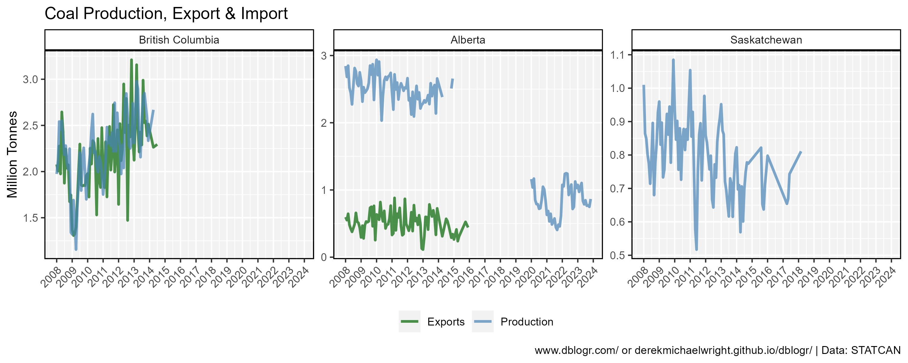

```{r}
# Prep data
myAreas <- c("Alberta", "Saskatchewan", "Manitoba", "British Columbia",
             "Quebec", "Ontario",  "Atlantic provinces",
             "Northwest Territories")
xx <- dd_coal %>% mutate(Area = factor(Area, levels = myAreas)) %>% 
  spread(Measurement, Value) %>% gather(Measurement, Value, 6:7)
# Plot
mp <- ggplot(xx, aes(x = Date, y = Value / 1000000, color = Measurement)) +
  geom_line(alpha = 0.7, size = 1) +
  facet_wrap(Area ~ ., scales = "free_y", ncol = 5) +
  scale_color_manual(name = NULL, values = myColors2) +
  scale_x_date(date_breaks = "year", date_labels = "%Y") +
  theme_agData(legend.position = "bottom",
               axis.text.x = element_text(angle = 45, hjust = 1)) +
  labs(title = "Coal Production, Export & Import", 
       y = "Million Tonnes", x = NULL, caption = myCaption)
ggsave("canada_fossil_fuels_4_02.png", mp, width = 12, height = 6)
```

---

## AB & SK

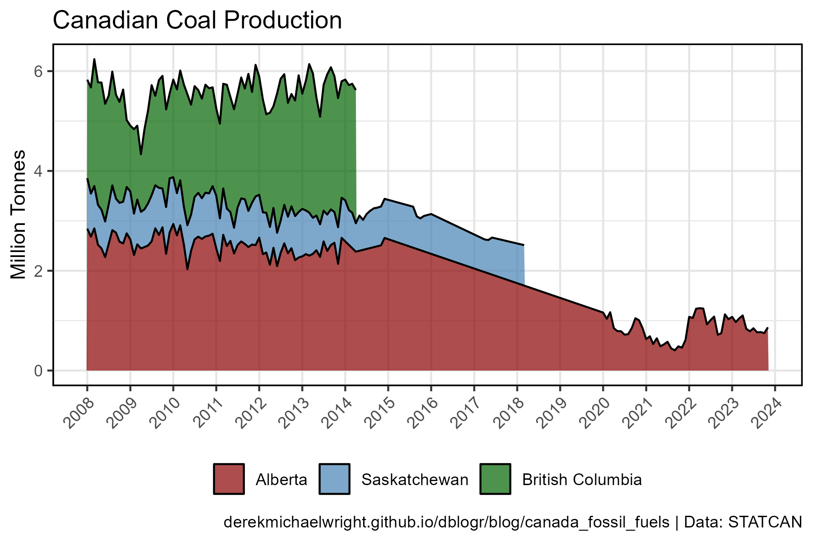

```{r}
# Prep data
myAreas <- c("All Other Provinces", "Saskatchewan", "Alberta")
xx <- dd_coal %>%
  filter(Measurement == "Production",
         !Area %in% c("Canada", "Atlantic provinces")) %>%
  mutate(Area = ifelse(Area %in% myAreas, Area, "All Other Provinces"),
         Area = factor(Area, levels = myAreas)) %>%
  group_by(Date, Area) %>%
  summarise(Value = sum(Value, na.rm = T))
# Plot
mp <- ggplot(xx, aes(x = Date, y = Value / 1000000, fill = Area)) +
  geom_bar(stat = "identity", color = "black", lwd = 0.3, 
           alpha = 0.7) +
  scale_fill_manual(name = NULL, values = myColors2[3:1], breaks = rev(myAreas)) +
  scale_x_date(date_breaks = "year", date_labels = "%Y") +
  theme_agData(legend.position = "bottom",
               axis.text.x = element_text(angle = 45, hjust = 1)) +
  labs(title = "Canadian Coal Production",
       y = "Million Tonnes", x = NULL, caption = myCaption)
ggsave("canada_fossil_fuels_4_03.png", mp, width = 6, height = 4)
```

---

## Predictions

Using a simple linear model.

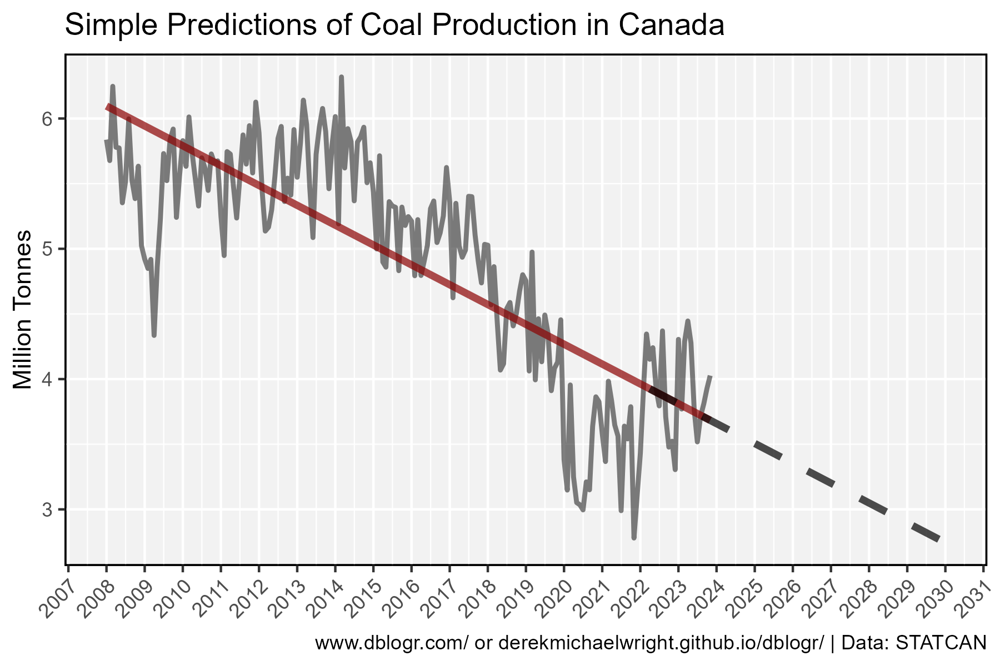

```{r}
# Prep data
xx <- dd_coal %>% filter(Area == "Canada", Measurement == "Production")
fit <- lm(Value ~ Date, data = xx)
x2 <- data.frame(Date = as.Date(c("2022-04-01", "2030-01-01"), format = "%Y-%m-%d"))
x2$Value <- predict(fit, newdata = x2)
# Plot
mp <- ggplot(xx, aes(x = Date, y = Value / 1000000)) +
  geom_line(lwd = 1, alpha = 0.5) +
  stat_smooth(geom = "line", method = "lm", lwd = 2,
              color = "darkred", alpha = 0.7) +
  geom_line(data = x2, lwd = 1.5, lty = 2, alpha = 0.7) +
  scale_x_date(date_breaks = "1 year", date_labels = "%Y") +
  theme_agData(axis.text.x = element_text(angle = 45, hjust = 1)) +
  labs(title = "Simple Predictions of Coal Production in Canada", 
       y = "Million Tonnes", x = NULL, caption = myCaption)
ggsave("canada_fossil_fuels_4_04.png", mp, width = 6, height = 4)
```

---
