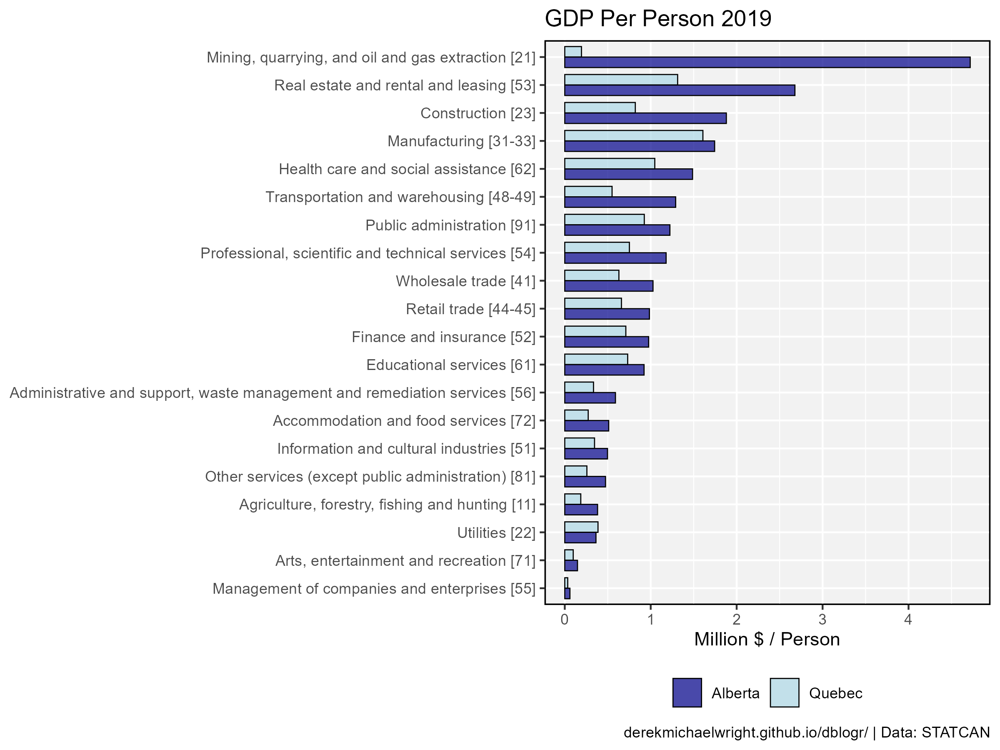
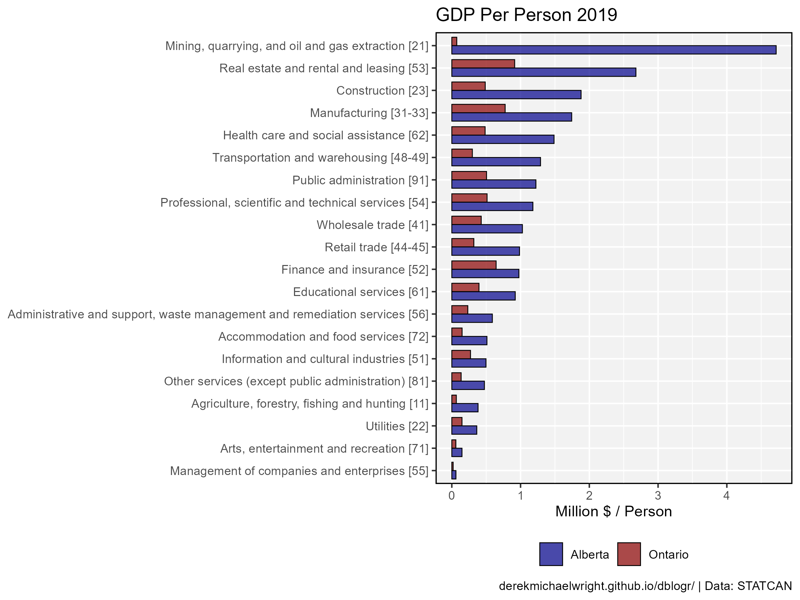
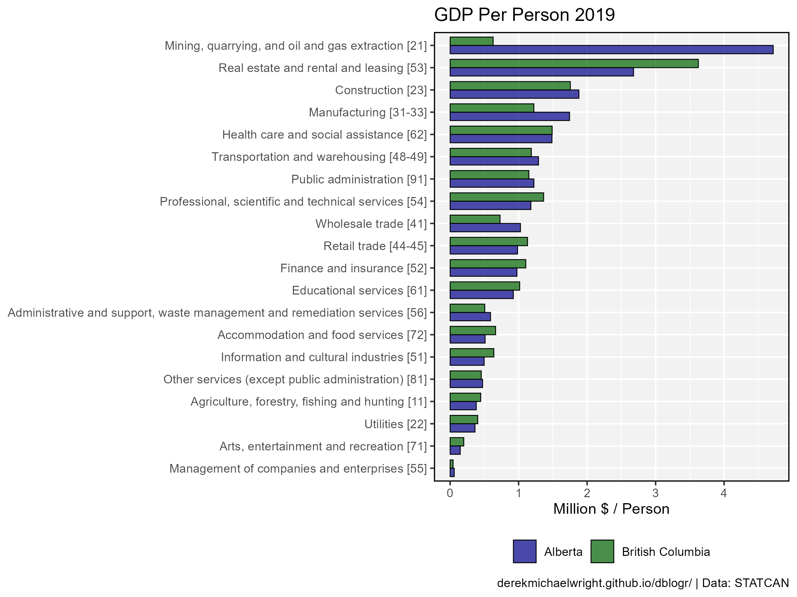
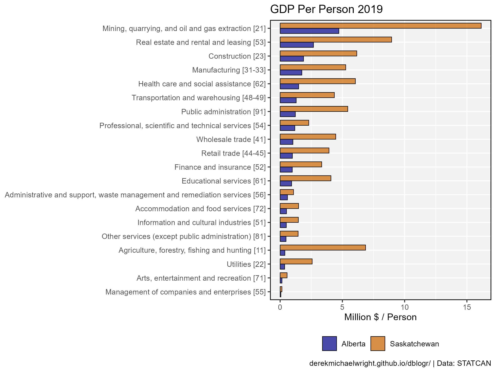
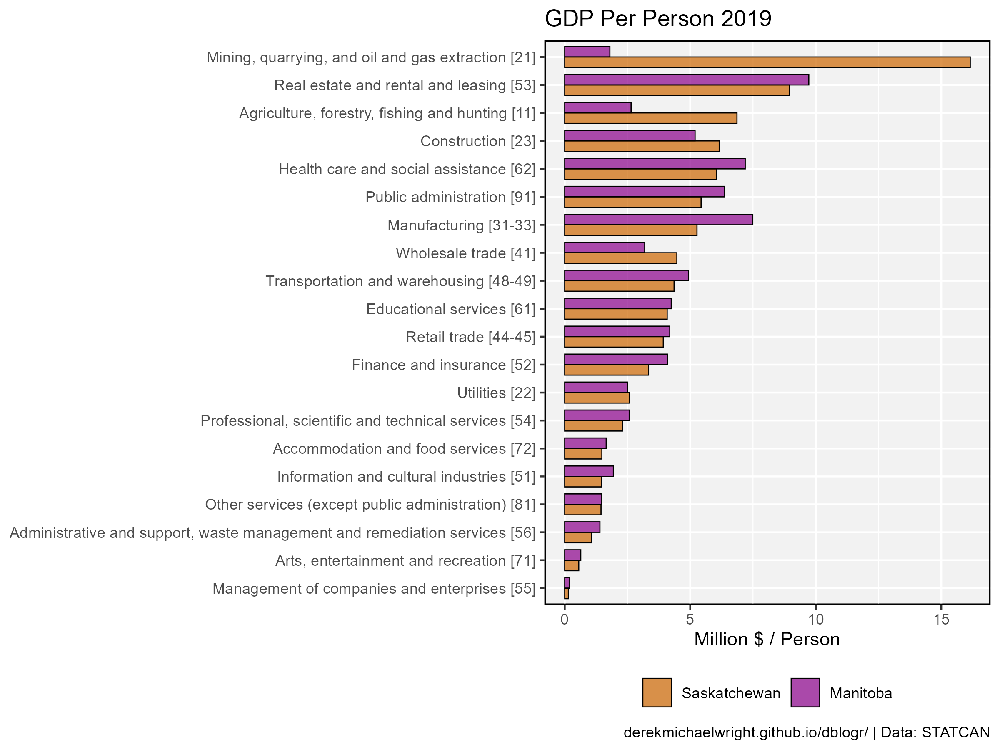
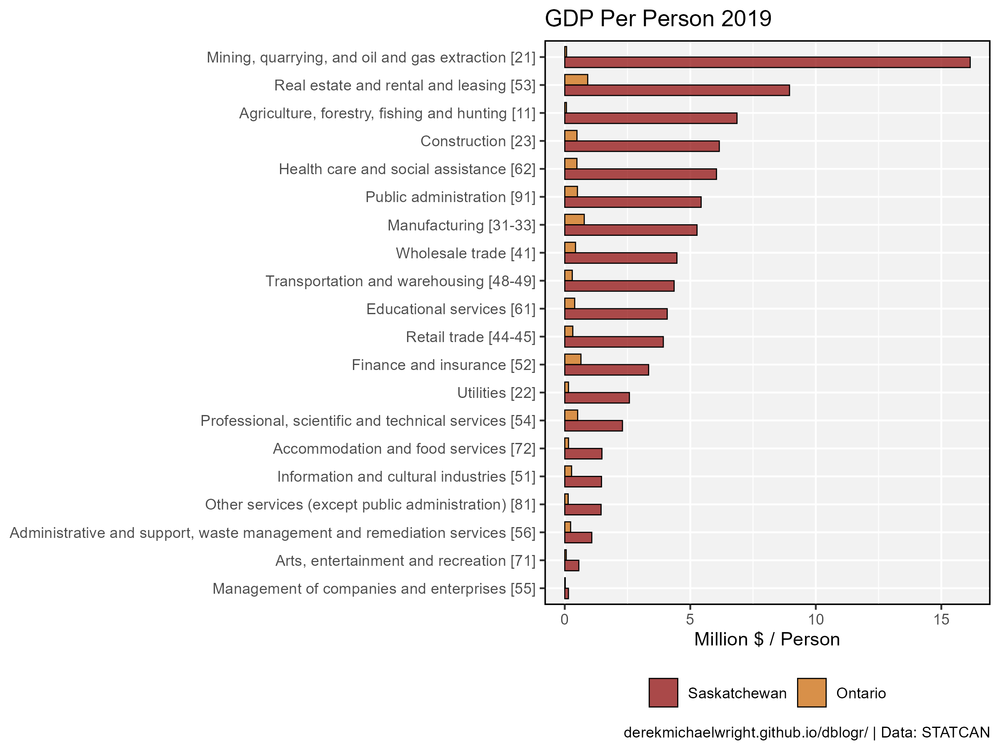

```{r setup, include=FALSE}
knitr::opts_chunk$set(echo = T, message = F, warning = F, out.width = "100%")
```

---

# Data

STATCAN Table: 36-10-0400-01

> - `r shiny::icon("globe")` https://www150.statcan.gc.ca/t1/tbl1/en/cv.action?pid=3610040001
> - `r shiny::icon("save")` [3610040001_databaseLoadingData.csv](3610040001_databaseLoadingData.csv)

STATCAN Table: 36-10-0402-01

> - `r shiny::icon("globe")` https://www150.statcan.gc.ca/t1/tbl1/en/cv.action?pid=3610040201
> - `r shiny::icon("save")` [3610040201_databaseLoadingData.csv](3610040201_databaseLoadingData.csv)

STATCAN Table: 17-10-0009-01

> - `r shiny::icon("globe")` https://www150.statcan.gc.ca/t1/tbl1/en/cv.action?pid=1710000901
> - `r shiny::icon("save")` [1710000901_databaseLoadingData.csv](1710000901_databaseLoadingData.csv)

---

# Prepare Data

```{r}
# devtools::install_github("derekmichaelwright/agData")
library(agData) # Loads: tidyverse, ggpubr, ggbeeswarm, ggrepel
# 
myCaption <- "www.dblogr.com/ or derekmichaelwright.github.io/dblogr/ | Data: STATCAN"
myAreas <- c("Canada", "British Columbia", "Alberta", "Saskatchewan", "Manitoba", 
             "Ontario", "Quebec", "New Brunswick", "Prince Edward Island", 
             "Nova Scotia", "Newfoundland and Labrador",  
             "Yukon", "Northwest Territories", "Nunavut")
myAs <- c("CA", "BC", "AB", "SK", "MB", "ON", "QC", "NB",
          "PE", "NS", "NL", "YT", "NT", "NU")
myCs <- c("black", "darkgoldenrod3", "darkred", "darkgreen", "darkslategray", 
          "darkblue", "steelblue", "maroon4", "purple4", 
          "cyan4", "burlywood4", "green4", "darkgoldenrod2", "red3")
#
myPal <- leaflet::colorFactor(palette = myCs, domain = myAreas)
# GDP by province
d1 <- read.csv("3610040201_databaseLoadingData.csv") %>%
  select(-Value) %>%
  rename(Area=GEO, Year=REF_DATE, Value=VALUE, 
         Industry=North.American.Industry.Classification.System..NAICS.) %>%
  mutate(Value = Value * 1000000,
         Area = factor(Area, levels = myAreas),
         Area_Short = plyr::mapvalues(Area, myAreas, myAs) ) %>%
  select(Area, Area_Short, Year, Industry, Value) %>%
  filter(!is.na(Value))
# GDP percent by industry
d2 <- read.csv("3610040001_databaseLoadingData.csv") %>%
  rename(Area=GEO, Year=REF_DATE, Value=VALUE,
         Industry=North.American.Industry.Classification.System..NAICS.) %>%
  mutate(Area = factor(Area, levels = myAreas),
         Area_Short = plyr::mapvalues(Area, myAreas, myAs)) %>%
  select(Area, Area_Short, Year, Industry, Value)
d2.1 <- d2 %>% group_by(Year, Industry) %>%
  summarise(Value = sum(Value, na.rm = T)) %>%
  ungroup() %>%
  mutate(Area = "Canada", AreaShort = "CA")
d2 <- bind_rows(d2, d2.1)
# Population by province
d3 <- read.csv("1710000901_databaseLoadingData.csv") %>% 
  rename(Year=REF_DATE, Area=GEO) %>%
  mutate(Month = as.numeric(substr(Year, 6, 7)),
         Year = as.numeric(substr(Year, 1, 4))) %>%
  filter(Month == 1) %>%
  rename(Number = VALUE)
```

---

# GDP by Province

## 2017


```{r}
# Prep data
xx <- d1 %>% 
  filter(!is.na(Value)) %>%
  filter(Year == max(Year), Industry == "All industries [T001]") %>%
  arrange(desc(Value)) %>% 
  mutate(Area = factor(Area, levels = unique(Area)))
# Plot
mp <- ggplot(xx, aes(x = Area, y = Value/1000000000, fill = Area)) + 
  geom_col(color = "black", alpha = 0.7) +
  scale_fill_manual(values = myCs[match(levels(xx$Area), myAreas)]) +
  theme_agData(legend.position = "none",
        axis.text.x = element_text(angle = 45, hjust = 1)) +
  labs(title = paste("GDP by Province", max(xx$Year)), 
       y = "Chained (2017) Dollars (Billion)", x = NULL, caption = myCaption)
ggsave("canada_gdp_1_01.png", mp, width = 6, height = 4)
```

---

## All Data


```{r}
# Prep data
xx <- d1 %>% 
  filter(!is.na(Value), Industry == "All industries [T001]") %>%
  mutate(Value = Value / 1000000000)
x2 <- xx %>% filter(Year == max(Year), Value > 200)
# Plot
mp <- ggplot(xx, aes(x = Year, y = Value, color = Area)) + 
  geom_line(linewidth = 1, alpha = 0.7) +
  scale_color_manual(values = myCs[match(levels(xx$Area), myAreas)]) +
  coord_cartesian(xlim = c(min(xx$Year)+1, max(xx$Year)-1)) +
  scale_y_continuous(sec.axis = sec_axis(~ ., breaks = x2$Value, 
                                              labels = x2$Area)) +
  theme_agData(legend.position = "none") +
  labs(title = "GDP by Province", x = NULL,
       y = "Chained (2017) Dollars (Billion)", caption = myCaption)
ggsave("canada_gdp_1_02.png", mp, width = 6, height = 4)
```

---

## By Province


```{r}
# Plot
mp <- mp + facet_wrap(Area ~ ., scale = "free_y", ncol = 5) + 
  scale_y_continuous()
ggsave("canada_gdp_1_03.png", mp, width = 12, height = 6)
```

---

## West vs. East


```{r}
# Prep data
myWs <- c("British Columbia", "Alberta", "Saskatchewan", "Manitoba",
          "Yukon", "Northwest Territories", "Nunavut")
myRs <- c("Western Canada", "Eastern Canada")
xx <- xx %>% filter(!is.na(Value)) %>%
  mutate(Region = ifelse(Area %in% myWs, myRs[1], myRs[2]),
         Region = factor(Region, levels = myRs)) %>%
  group_by(Region, Year) %>% 
  summarise(Value = sum(Value))
# Plot
mp <- ggplot(xx, aes(x = Year, y = Value, color = Region)) + 
  geom_line(linewidth = 1.5, alpha = 0.7) + 
  geom_point(size = 1.75) +
  coord_cartesian(xlim = c(1997.75, 2015.25)) +
  scale_color_manual(values = c("darkblue", "darkred")) +
  theme_agData(legend.position = "bottom") +
  labs(title = "GDP in Canada", x = NULL,
       y = "Chained (2017) Dollars (Billion)",  caption = myCaption)
ggsave("canada_gdp_1_04.png", mp, width = 6, height = 4)
```

---

# GDP Per Person

## Canada


```{r}
# Prep data
x1 <- d3 %>% filter(Area == "Canada") %>% 
  select(Year, Number)
xx <- d1 %>% 
  filter(Industry == "All industries [T001]") %>% 
  group_by(Year) %>%
  summarise(GDP = sum(Value, na.rm = T)) %>%
  left_join(x1, by = "Year") %>%
  mutate(GDP_PP = GDP / Number / 1000)
x1 <- xx %>% filter(Year < 2020)
# Plot
mp <- ggplot(xx, aes(x = Year, y = GDP_PP)) + 
  stat_smooth(data = x1, geom = "line", method = "lm", fullrange = T) +
  geom_line(alpha = 0.7, color = "darkgreen", size = 2) + 
  scale_x_continuous(minor_breaks = min(xx$Year):max(xx$Year)) +
  theme_agData(legend.position = "none",
        axis.text.x = element_text(angle = 45, hjust = 1)) +
  labs(title = paste("Canada - GDP Per Person", max(xx$Year)), 
       y = "Chained (2017) Dollars ($1000)", x = NULL, caption = myCaption)
ggsave("canada_gdp_2_01.png", mp, width = 6, height = 4)
```

---

## 2017


```{r}
# Prep data
xx <- d1 %>% 
  left_join(d3, by = c("Area", "Year")) %>%
  mutate(GDP_PP = Value / Number / 1000) %>%
  filter(!is.na(GDP_PP), Industry == "All industries [T001]")
x2 <- xx %>% filter(Year == max(Year)) %>%
  arrange(desc(GDP_PP)) %>% 
  mutate(Area = factor(Area, levels = unique(Area)))
# Plot
mp <- ggplot(x2, aes(x = Area, y = GDP_PP, fill = Area)) + 
  geom_col(color = "black", alpha = 0.7) +
  scale_fill_manual(values = myCs[match(levels(x2$Area), myAreas)]) +
  theme_agData(legend.position = "none",
        axis.text.x = element_text(angle = 45, hjust = 1)) +
  labs(title = paste("GDP Per Person by Province -", max(xx$Year)), 
       y = "Chained (2017) Dollars ($1000)", x = NULL, caption = myCaption)
ggsave("canada_gdp_2_02.png", mp, width = 6, height = 4)
```

---

## By Province


```{r}
mp <- ggplot(xx, aes(x = Year, y = GDP_PP, color = Area)) + 
  geom_line(linewidth = 1, alpha = 0.7) +
  coord_cartesian(xlim = c(min(xx$Year)+1, max(xx$Year)-1)) +
  scale_color_manual(values = myCs[match(levels(x2$Area), myAreas)]) +
  scale_y_continuous(sec.axis = sec_axis(~ ., breaks = x2$GDP_PP, 
                                              labels = x2$Area)) +
  theme_agData(legend.position = "none") +
  labs(title = "GDP Per Person", x = NULL,
       y = "Chained (2017) Dollars ($1000)", caption = myCaption)
ggsave("canada_gdp_2_03.png", mp, width = 6, height = 4)
```

---

## By Province Facetted


```{r}
mp <- mp + facet_wrap(Area ~ ., ncol = 5) + 
  scale_y_continuous()
ggsave("canada_gdp_2_04.png", mp, width = 10, height = 6)
```

```{r echo = F}
ggsave("featured.png", mp, width = 10, height = 6)
```

---

## West vs. East


```{r}
# Prep data
wc <- c("British Columbia", "Alberta", "Saskatchewan", "Manitoba",
        "Yukon", "Northwest Territories", "Nunavut")
xx <- xx %>% filter(!is.na(Value)) %>%
  mutate(Region = ifelse(Area %in% wc, "Western Canada", "Eastern Canada")) %>%
  group_by(Region, Year) %>% 
  summarise(GDP_PP = mean(GDP_PP))
# Plot
mp <- ggplot(xx, aes(x = Year, y = GDP_PP, color = Region)) + 
  geom_line(linewidth = 1.5, alpha = 0.7) + 
  geom_point(size = 2) +
  scale_color_manual(name = NULL, values = c("darkblue", "darkred")) +
  theme_agData(legend.position = "bottom") +
  labs(title = "GDP Per Person in Canada", x = NULL,
       y = "Chained (2017) Dollars ($1000)", caption = myCaption)
ggsave("canada_gdp_2_05.png", mp, width = 6, height = 4)
```

---

# By Industry


```{r}
# Prep data
industries <- c("Information and communication technology sector [T013]",
                "Energy sector [T016]", "Industrial production [T010]",
                "Goods-producing industries [T002]",
                "Service-producing industries [T003]",
                "All industries [T001]",
                "Finance and insurance, real estate and renting and leasing and management of companies and enterprises")
xx <- d2 %>% 
  group_by(Year, Industry) %>% 
  summarise(Value = sum(Value, na.rm = T)) %>%
  filter(!Industry %in% industries)
levs <- xx %>% arrange(rev(Value)) %>% pull(Industry) %>% unique() 
xx <- xx %>% mutate(Industry = factor(Industry, levels = levs))
# Plot
mp <- ggplot(xx, aes(x = Year, y = Value, color = Industry)) +
  geom_line(alpha = 0.7, size = 1.5) +
  facet_wrap(Industry ~ ., scales = "free_y", ncol = 4,
             labeller = label_wrap_gen(width = 50)) +
  theme_agData(legend.position = "none") +
  labs(x = NULL,y = "Million $", caption = myCaption)
ggsave("canada_gdp_3_01.png", mp, width = 14, height = 10)
```

---

## Goods vs. Services


```{r}
# Prep data
industries <- c("Goods-producing industries [T002]",
                "Service-producing industries [T003]")
xx <- d2 %>% filter(Industry %in% industries) %>%
  mutate(Industry = factor(Industry, levels = rev(industries)))
# Plot
mp <- ggplot(xx, aes(x = Year, y = Value, fill = Industry)) +
  geom_col(alpha = 0.7) +
  facet_wrap(Area ~ ., ncol = 7, scales = "free_y") +
  scale_fill_manual(name = NULL, values = c("darkred", "darkgreen")) +
  theme_agData(legend.position = "bottom",
               axis.text.x = element_text(angle = 45, hjust = 1)) +
  labs(title = "GDP by Industry", x = NULL,
       y = "Percent", caption = myCaption)
ggsave("canada_gdp_3_02.png", mp, width = 12, height = 5)
```

---

# Compare Privinces

```{r}
ggGDP_Areas <- function(year, areas, colors) {
  industries <- c("Information and communication technology sector [T013]",
                  "Energy sector [T016]", "Industrial production [T010]",
                  "Goods-producing industries [T002]",
                  "Service-producing industries [T003]",
                  "All industries [T001]")
  # Prep data
  xx <- d2 %>%
    filter(Year == year, Area %in% areas, !Industry %in% industries) %>%
    left_join(d3, by = c("Area", "Year")) %>%
    mutate(GDP_PP = 1000000 * Value / Number) %>%
    filter(!is.na(GDP_PP))
  levs <- xx %>% filter(Year == year, Area == areas[1]) %>% 
    arrange(Value) %>% pull(Industry)
  xx <- xx %>% 
    mutate(Industry = factor(Industry, levels = levs),
           Area = factor(Area, levels = areas))
  # Plot
  ggplot(xx, aes(x = Industry, y = GDP_PP, fill = Area)) +
    geom_col(position = "dodge", width = 0.75,
             alpha = 0.7, color = "black", lwd = 0.3) +
    scale_fill_manual(name = NULL, values = colors) +
    theme_agData(legend.position = "bottom") +
    coord_flip() +
    labs(title = paste("GDP Per Person", year), x = NULL,
         y = "Million $ / Person", caption = myCaption)
}
```

---

## Alberta vs. Quebec



```{r}
mp <- ggGDP_Areas(year = 2019,
                  areas = c("Alberta", "Quebec"),
                  colors = c("darkblue", "lightblue"))
ggsave("canada_gdp_4_01.png", mp, width = 8, height = 6)
```

---

## Alberta vs. Ontario



```{r}
mp <- ggGDP_Areas(year = 2019,
                  areas = c("Alberta", "Ontario"),
                  colors = c("darkblue", "darkred"))
ggsave("canada_gdp_4_02.png", mp, width = 8, height = 6)
```

---

## Alberta vs. British Columbia



```{r}
mp <- ggGDP_Areas(year = 2019,
                  areas = c("Alberta", "British Columbia"), 
                  colors = c("darkblue", "darkgreen"))
ggsave("canada_gdp_4_03.png", mp, width = 8, height = 6)
```

---

## Alberta vs. Saskatchewan



```{r}
mp <- ggGDP_Areas(year = 2019, 
                  areas = c("Alberta", "Saskatchewan"), 
                  colors = c("darkblue", "darkorange3"))
ggsave("canada_gdp_4_04.png", mp, width = 8, height = 6)
```

---

## Saskatchewan vs. Manitoba



```{r}
mp <- ggGDP_Areas(year = 2019,
                  areas = c("Saskatchewan", "Manitoba"), 
                  colors = c("darkorange3", "darkmagenta"))
ggsave("canada_gdp_4_05.png", mp, width = 8, height = 6)
```

---

## Saskatchewan vs. Ontario



```{r}
mp <- ggGDP_Areas(year = 2019, 
                  areas = c("Saskatchewan", "Ontario"), 
                  colors = c("darkred", "darkorange3"))
ggsave("canada_gdp_4_06.png", mp, width = 8, height = 6)
```

---

# Compare Years

```{r}
ggGDP_Years <- function(area, years, colors) {
  industries <- c("Information and communication technology sector [T013]",
                  "Energy sector [T016]", "Industrial production [T010]",
                  "Goods-producing industries [T002]",
                  "Service-producing industries [T003]",
                  "All industries [T001]",
                  "Finance and insurance, real estate and renting and leasing and management of companies and enterprises")
  # Prep data
  xx <- d2 %>% 
    filter(Year %in% years, Area == area, !Industry %in% industries) %>%
    left_join(d3, by = c("Area", "Year")) %>%
    mutate(GDP_PP = 1000000 * Value / Number) %>%
    filter(!is.na(GDP_PP))
  levs <- xx %>% filter(Year %in% years[1], Area == area) %>% 
    arrange(Value) %>% pull(Industry)
  xx <- xx %>% 
    mutate(Industry = factor(Industry, levels = levs),
           Year = factor(Year)
           #Area = factor(Area, levels = areas)
           )
  # Plot
  ggplot(xx, aes(x = Industry, y = GDP_PP, fill = Year)) +
    geom_col(position = "dodge", width = 0.75,
             alpha = 0.7, color = "black", lwd = 0.3) +
    scale_fill_manual(name = NULL, values = colors) +
    theme_agData(legend.position = "bottom") +
    coord_flip() +
    labs(title = paste("GDP Per Person", area), x = NULL,
         y = "Million $ / Person", caption = myCaption)
}
```

---

# Canadian GDP by Industry


```{r}
mp <- ggGDP_Years(area = "Canada",
                  years = c(2019, 2022), 
                  colors = c("steelblue","darkred"))
ggsave("canada_gdp_5_01.png", mp, width = 8, height = 6)
```

---


```{r}
mp <- ggGDP_Years(area = "Canada",
                  years = c(2008, 2015, 2019, 2022), 
                  colors = c("steelblue","darkblue","red3","darkred"))
ggsave("canada_gdp_5_02.png", mp, width = 8, height = 6)
```

---
