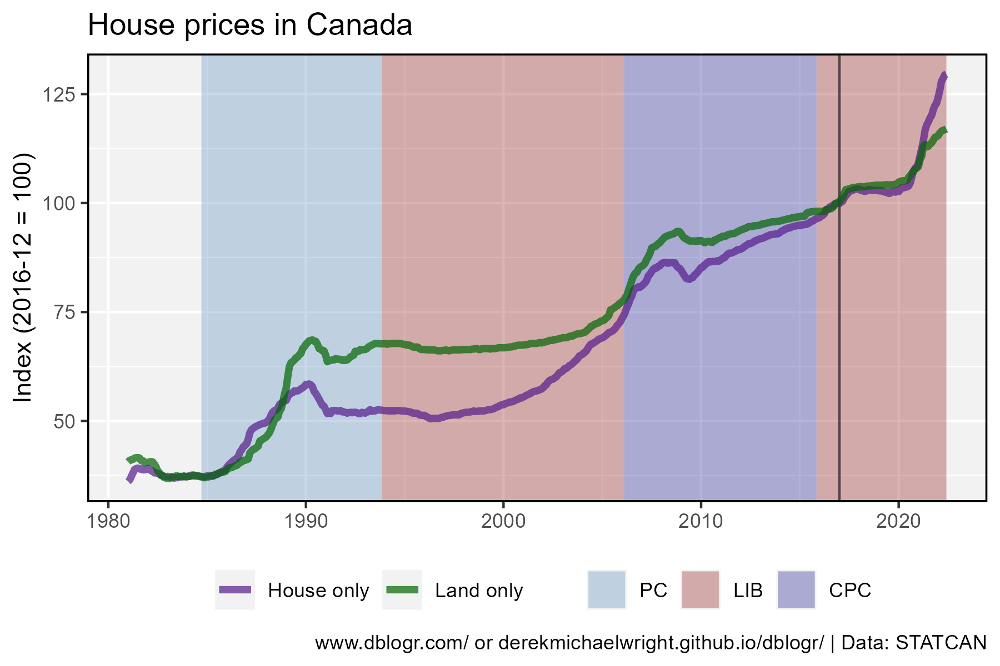
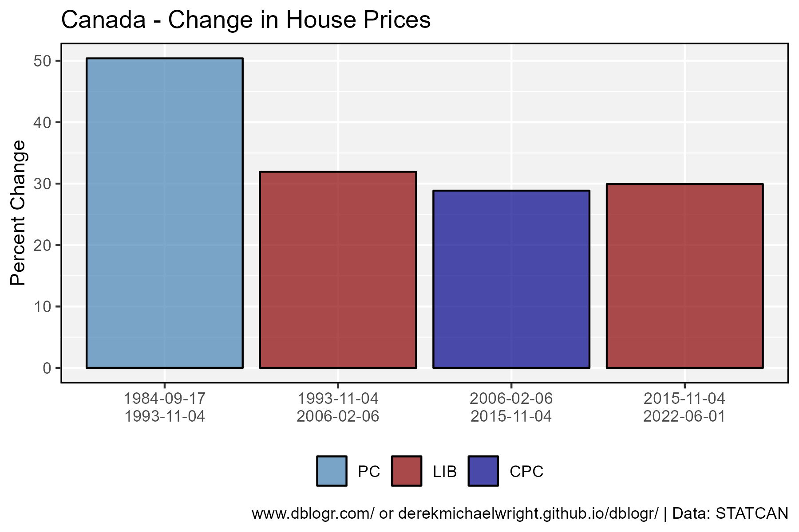
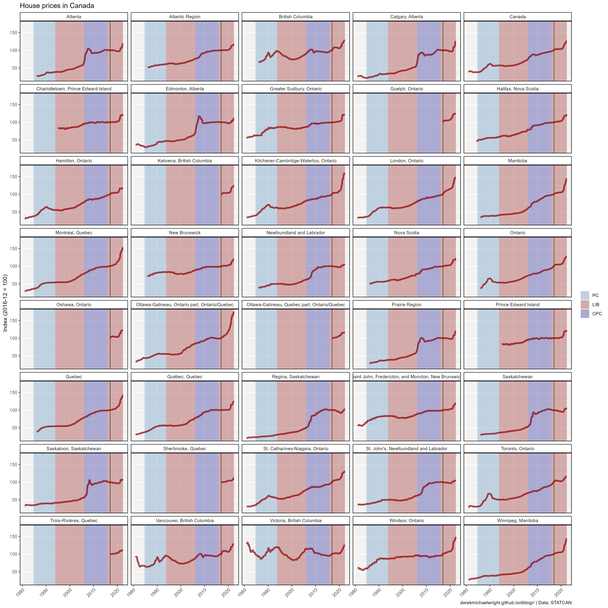
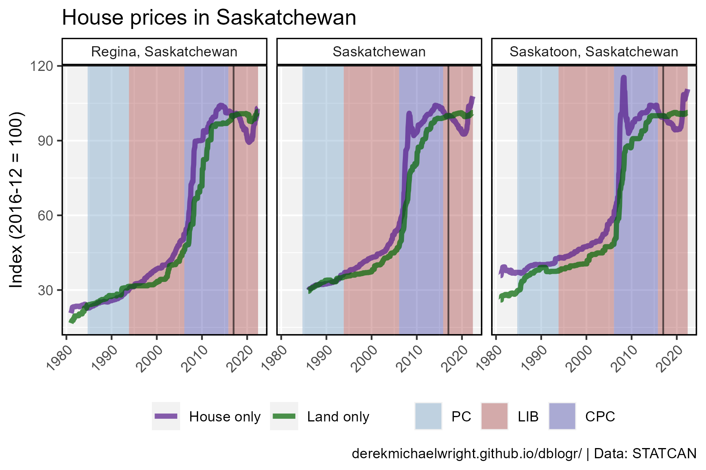
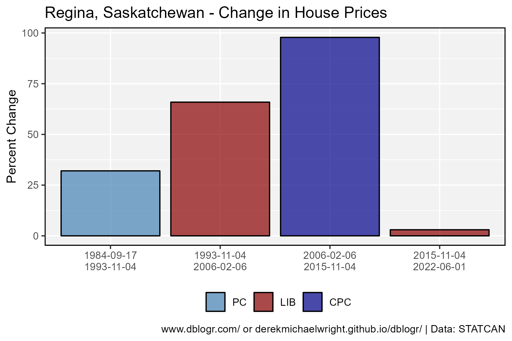
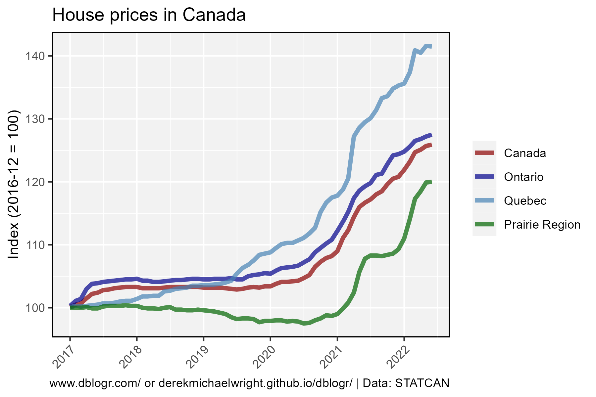

```{r setup, include=FALSE}
knitr::opts_chunk$set(echo = T, message = F, warning = F)
```

---

# Data

`r shiny::icon("globe")` https://www150.statcan.gc.ca/t1/tbl1/en/cv.action?pid=1810020501

`r shiny::icon("save")` [1810020501_databaseLoadingData.csv](1810020501_databaseLoadingData.csv)

```{r class.source = 'fold-show'}
# devtools::install_github("derekmichaelwright/agData")
library(agData)
```

---

# Prepare Data

```{r}
# Prep data
myCaption <- "derekmichaelwright.github.io/dblogr/ | Data: STATCAN"
myColors_M <- c("purple4", "darkgreen", "darkorange")
myColors_P <- c("steelblue","darkred","darkblue")
#
dd <- read.csv("1810020501_databaseLoadingData.csv") %>%
  select(Date=1, Area=GEO, Measurement=4, Unit=UOM, Value=VALUE) %>%
  separate(Date, c("Year", "Month"), sep = "-", remove = F) %>%
  mutate(Date = as.Date(paste0(Date,"-01"), format = "%Y-%m-%d"))
pp <- data.frame(Admin = factor(1:4),
        Party = factor(c("PC", "LIB", "CPC", "LIB"), levels = c("PC", "LIB", "CPC")),
        xmin = as.Date(c("1984-09-17", "1993-11-04", "2006-02-06", "2015-11-04")),
        xmax = as.Date(c("1993-11-04", "2006-02-06", "2015-11-04", "2022-06-01")))
```

---

# Canada



```{r}
# Prep data
xx <- dd %>% 
  filter(Area == "Canada", Measurement %in% c("House only", "Land only"))
myxmin <- min(xx$Value)
myxmax <- max(xx$Value)
# Plot
mp <- ggplot(xx) +
  geom_rect(data = pp, alpha = 0.5, ymin = -Inf, ymax = Inf,
            aes(xmin = xmin, xmax = xmax, fill = Party)) +
  geom_vline(xintercept = as.Date("2016-12-31"), alpha = 0.6) +
  geom_line(aes(x = Date, y = Value, color = Measurement), alpha = 0.7, size = 1.5) +
  scale_color_manual(name = NULL, values = myColors_M) +
  scale_fill_manual(name = NULL, values = myColors_P) +
  scale_y_continuous(limits = c(myxmin,myxmax)) +
  theme_agData(legend.position = "bottom") +
  labs(title = "House prices in Canada", x = NULL,
       y = "Index (2016-12 = 100)", caption = myCaption)
ggsave("canada_house_prices_01.png", mp, width = 6, height = 4)
```

## Percent Change



```{r}
# Prep data
xx <- dd %>% filter(Area == "Canada", Measurement == "Total (house and land)")
for(i in 1:nrow(pp)) {
  pp$price1[i] <- xx$Value[xx$Date == paste0(substr(pp$xmin[i],1,7),"-01")]
  pp$price2[i] <- xx$Value[xx$Date == paste0(substr(pp$xmax[i],1,7),"-01")]
  pp$PercentChange[i] <- (100 * pp$price2[i] / pp$price1[i]) - 100
}
# Plot
mp <- ggplot(pp, aes(x = Admin, y = PercentChange, fill = Party)) +
  geom_bar(stat = "identity", color = "black", alpha = 0.7) +
  scale_x_discrete(labels = paste(pp$xmin, pp$xmax, sep = "\n")) +
  scale_fill_manual(name = NULL, values = myColors_P) +
  theme_agData(legend.position = "bottom") +
  labs(title = "Canada - Change in House Prices", x = NULL,
       y = "Percent Change", caption = myCaption)
ggsave("canada_house_prices_02.png", mp, width = 6, height = 4)
```

---

# All Data



```{r}
# Prep data
xx <- dd %>% filter(Measurement == "Total (house and land)")
# Plot
mp <- ggplot(xx) +
  geom_rect(data = pp, alpha = 0.5, ymin = -Inf, ymax = Inf,
            aes(xmin = xmin, xmax = xmax, fill = Party)) +
  geom_vline(xintercept = as.Date("2016-12-31"), alpha = 0.6) +
  geom_line(aes(x = Date, y = Value), size = 1.5, alpha = 0.7) +
  facet_wrap(Area ~ ., ncol = 5) +
  scale_color_manual(name = NULL, values = myColors_M) +
  scale_fill_manual(name = NULL, values = myColors_P) +
  theme_agData(axis.text.x = element_text(angle = 45, hjust = 1)) +
  labs(title = "House prices in Canada", x = NULL,
       y = "Index (2016-12 = 100)", caption = myCaption)
ggsave("canada_house_prices_03.png", mp, width = 16, height = 16)
```

---

# Saskatchewan



```{r}
# Prep data
xx <- dd %>% 
  filter(grepl("Saskatchewan", Area), 
         Measurement %in% c("House only", "Land only"))
# Plot
mp <- ggplot(xx) +
  geom_rect(data = pp, alpha = 0.5, ymin = -Inf, ymax = Inf,
            aes(xmin = xmin, xmax = xmax, fill = Party)) +
  geom_vline(xintercept = as.Date("2016-12-31"), alpha = 0.6) +
  geom_line(aes(x = Date, y = Value, color = Measurement), 
            alpha = 0.7, size = 1.5) +
  facet_grid(. ~ Area) +
  scale_color_manual(name = NULL, values = myColors_M) +
  scale_fill_manual(name = NULL, values = myColors_P) +
  theme_agData(legend.position = "bottom",
               axis.text.x = element_text(angle = 45, hjust = 1)) +
  labs(title = "House prices in Saskatchewan", x = NULL,
       y = "Index (2016-12 = 100)", caption = myCaption)
ggsave("canada_house_prices_04.png", mp, width = 6, height = 4)
```

---

## Percent Change



```{r}
# Prep data
xx <- dd %>% filter(Area == "Regina, Saskatchewan", 
                    Measurement == "Total (house and land)")
for(i in 1:nrow(pp)) {
  pp$price1[i] <- xx$Value[xx$Date == paste0(substr(pp$xmin[i],1,7),"-01")]
  pp$price2[i] <- xx$Value[xx$Date == paste0(substr(pp$xmax[i],1,7),"-01")]
  pp$PercentChange[i] <- (100 * pp$price2[i] / pp$price1[i]) - 100
}
# Plot
mp <- ggplot(pp, aes(x = Admin, y = PercentChange, fill = Party)) +
  geom_bar(stat = "identity", color = "black", alpha = 0.7) +
  scale_x_discrete(labels = paste(pp$xmin, pp$xmax, sep = "\n")) +
  scale_fill_manual(name = NULL, values = myColors_P) +
  theme_agData(legend.position = "bottom") +
  labs(title = "Regina, Saskatchewan - Change in House Prices",
       y = "Percent Change", x = NULL, caption = myCaption)
ggsave("canada_house_prices_05.png", mp, width = 6, height = 4)
```

---

# Regions



```{r}
# Prep data
myAreas <- c("Canada", "Ontario", "Quebec", "Prairie Region")
myColors_A <- c("darkred", "darkblue", "steelblue", "darkgreen")
xx <- dd %>% 
  filter(Measurement == "Total (house and land)",
         Area %in% myAreas, Year > 2016) %>%
  mutate(Area = factor(Area, levels = myAreas))
# Plot
mp <- ggplot(xx, aes(x = Date, y = Value, color = Area)) +
  geom_line(alpha = 0.7, size = 1.5) +
  scale_color_manual(name = NULL, values = myColors_A) +
  scale_x_date(date_breaks = "year", date_labels = "%Y") +
  theme_agData(axis.text.x = element_text(angle = 45, hjust = 1)) +
  labs(title = "House prices in Canada", x = NULL, 
       y = "Index (2016-12 = 100)", caption = myCaption)
ggsave("canada_house_prices_06.png", mp, width = 6, height = 4)
```

```{r echo = F}
ggsave("featured.png", mp, width = 6, height = 4)
```

---
