```{r setup, include=FALSE}
knitr::opts_chunk$set(echo = T, message = F, warning = F)
```

---

# Data

STATCAN Table: 18-10-0205-01

> - `r shiny::icon("globe")` https://www150.statcan.gc.ca/t1/tbl1/en/cv.action?pid=1810020501
> - `r shiny::icon("save")` [1810020501_databaseLoadingData.csv](1810020501_databaseLoadingData.csv)

STATCAN Table: 34-10-0162-01

> - `r shiny::icon("globe")` https://www150.statcan.gc.ca/t1/tbl1/en/cv.action?pid=3410016201
> - `r shiny::icon("save")` [3410016201_databaseLoadingData.csv](3410016201_databaseLoadingData.csv)

STATCAN Table: 36-10-0688-01

> - `r shiny::icon("globe")` https://www150.statcan.gc.ca/t1/tbl1/en/cv.action?pid=3610068801
> - `r shiny::icon("save")` [3610068801_databaseLoadingData.csv](3610068801_databaseLoadingData.csv)

STATCAN Table: 11-10-0688-01

> - `r shiny::icon("globe")` https://www150.statcan.gc.ca/t1/tbl1/en/cv.action?pid=1110019001
> - `r shiny::icon("save")` [3610068801_databaseLoadingData.csv](3610068801_databaseLoadingData.csv)

```{r eval = F, echo = F}
#https://www150.statcan.gc.ca/t1/tbl1/en/cv.action?pid=1110024001
#https://www150.statcan.gc.ca/t1/tbl1/en/cv.action?pid=1110001201
```

---

# Prepare Data

```{r class.source = 'fold-show'}
# devtools::install_github("derekmichaelwright/agData")
library(agData)
library(gganimate)
```

```{r}
# Prep data
myCaption <- "www.dblogr.com/ or derekmichaelwright.github.io/dblogr/ | Data: STATCAN"
myColors_M <- c("purple4", "darkgreen", "darkorange")
myColors_P <- c("steelblue","darkred","darkblue")
#
d1 <- read.csv("1810020501_databaseLoadingData.csv") %>%
  select(Date=1, Area=GEO, Measurement=4, Unit=UOM, Value=VALUE) %>%
  separate(Date, c("Year", "Month"), sep = "-", remove = F) %>%
  mutate(Date = as.Date(paste0(Date,"-01"), format = "%Y-%m-%d"))
pp <- data.frame(Admin = factor(1:4),
        Party = factor(c("PC", "LIB", "CPC", "LIB"), levels = c("PC", "LIB", "CPC")),
        xmin = as.Date(c("1984-09-17", "1993-11-04", "2006-02-06", "2015-11-04")),
        xmax = as.Date(c("1993-11-04", "2006-02-06", "2015-11-04", "2022-06-01")))
# 
myAreas <- c("Census metropolitan areas and census agglomerations of 50,000 and over",
             "Census metropolitan areas", "Census agglomerations 50,000 and over")
d2 <- read.csv("3410016201_databaseLoadingData.csv") %>% 
  select(Date=REF_DATE, Area=GEO, Measurement=4, Unit=UOM, Value=VALUE) %>%
  arrange(Area) %>%
  mutate(Date = as.Date(paste0(Date,"-01"), format = "%Y-%m-%d"),
         Year = as.numeric(substr(Date, 1, 4)),
         Area = factor(Area, levels = unique(c(myAreas, .$Area))))
#
myProvs <- c("Canada", "British Columbia", "Alberta", "Saskatchewan", 
             "Manitoba", "Ontario", "Quebec",
             "Prince Edward Island", "New Brunswick", 
             "Nova Scotia", "Newfoundland and Labrador",
             "Yukon", "Northwest Territories", "Nunavut")
myTypes <- c("Total dwelling type", "Single house", "Double house", 
             "Row house", "Apartment building", "Mobile house")
d3 <- read.csv("3610068801_databaseLoadingData.csv") %>% 
  select(Date=REF_DATE, Area=GEO, Sector=4, Private=5, Occupancy=6, Type=7, Tenure=8,
         Unit=UOM, Value=VALUE) %>%
  mutate(Date = as.Date(paste0(Date,"-01"), format = "%Y-%m-%d"),
         Year = substr(Date, 1, 4),
         Type = factor(Type, levels = myTypes),
         Area = factor(Area, levels = myProvs))
#
d4 <- read.csv("1110019001_databaseLoadingData.csv") %>%
  select(Year=1, Area=GEO, Measurement=Income.concept,
         Group=Economic.family.type, Unit=UOM, Value=VALUE) %>%
  filter(Group == "Economic families and persons not in an economic family",
         Measurement == "Median market income", Year >= 1986) %>%
  mutate(Area = factor(Area, levels = unique(.$Area)),
         Year = as.character(Year))
d4 <- d4 %>% 
  left_join(d4 %>% filter(Year == 1986) %>% select(Area, V1986=Value), by = "Area") %>%
  mutate(Rate = 100 * (Value - V1986) / V1986) %>%
  select(Year, Area, `Median market income`=Rate)
d5 <- d1 %>% 
  filter(Date >= "1986-01-01", Measurement == "Total (house and land)") %>%
  select(Date, Year, Month, Area, Value)
d5 <- d5 %>% 
  left_join(d5 %>% filter(Date == "1986-01-01") %>% select(Area, V1986=Value), by = "Area") %>%
  mutate(Rate = 100 * (Value - V1986) / V1986) %>%
  select(Date, Year, Month, Area, `Housing price index`=Rate)
d6 <- left_join(d5, d4, by = c("Year", "Area")) %>% 
  filter(!is.na(`Median market income`), !is.na(`Housing price index`)) %>%
  mutate(`Median market income` = ifelse(Month != "01", NA, `Median market income`)) %>%
  gather(Measurement, Value, 5:6) %>% filter(!is.na(Value))
```

---

# House Prices

## Canada

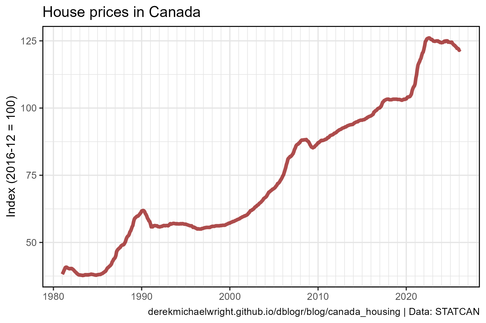

```{r}
# Prep data
xx <- d1 %>% filter(Area == "Canada", Measurement == "Total (house and land)")
# Plot
mp <- ggplot(xx, aes(x = Date, y = Value)) +
  geom_line(color = "darkred", alpha = 0.7, size = 1.5) +
  scale_x_date(date_minor_breaks = "year") +
  theme_agData(legend.position = "bottom") +
  labs(title = "House prices in Canada", x = NULL,
       y = "Index (2016-12 = 100)", caption = myCaption)
ggsave("canada_housing_1_01.png", mp, width = 6, height = 4)
```

---

## Regions

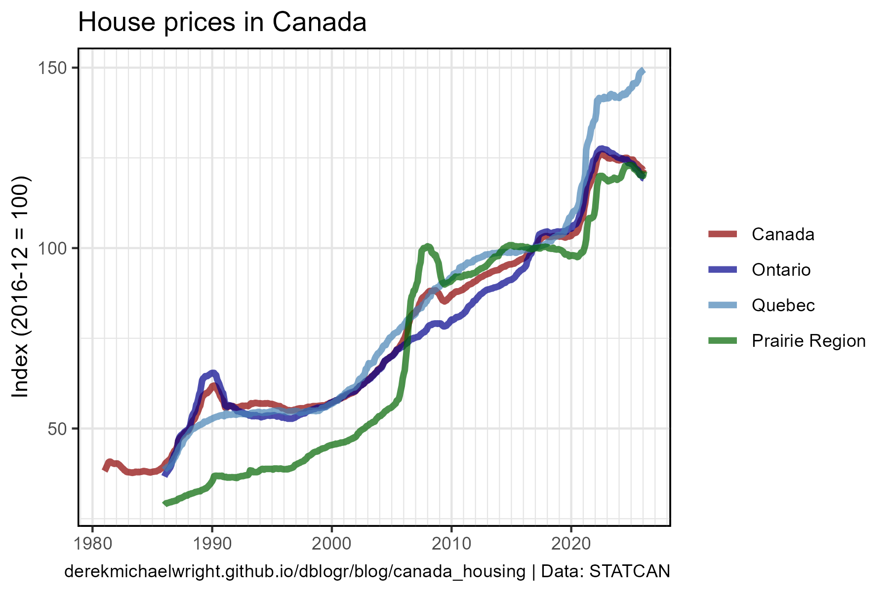

```{r}
# Prep data
myAs <- c("Canada", "Ontario", "Quebec", "Prairie Region")
myCs <- c("darkred", "darkblue", "steelblue", "darkgreen")
xx <- d1 %>% 
  filter(Measurement == "Total (house and land)",
         Area %in% myAs) %>%
  mutate(Area = factor(Area, levels = myAs))
# Plot
mp <- ggplot(xx, aes(x = Date, y = Value, color = Area)) +
  geom_line(alpha = 0.7, size = 1.5) +
  scale_color_manual(name = NULL, values = myCs) +
  scale_x_date(date_minor_breaks = "year") +
  #scale_x_date(breaks = as.Date(c("1985-01-01","1995-01-01","2005-01-01","2015-01-01")), 
  #             date_labels = "%Y", date_minor_breaks = "year") +
  theme_agData() +#axis.text.x = element_text(angle = 45, hjust = 1)
  labs(title = "House prices in Canada", x = NULL, 
       y = "Index (2016-12 = 100)", caption = myCaption)
ggsave("canada_housing_1_02.png", mp, width = 6, height = 4)
```

---

### > 2017

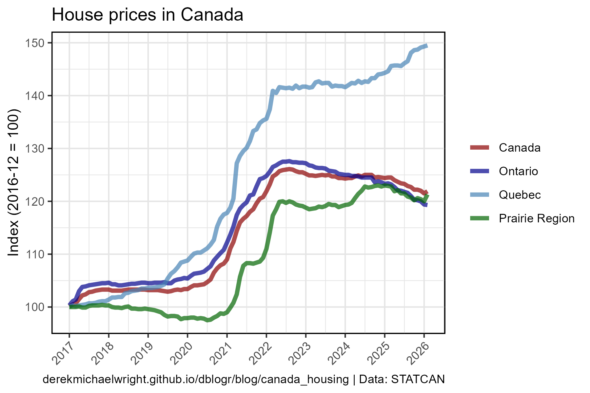

```{r}
# Prep data
myAs <- c("Canada", "Ontario", "Quebec", "Prairie Region")
myCs <- c("darkred", "darkblue", "steelblue", "darkgreen")
xx <- d1 %>% 
  filter(Measurement == "Total (house and land)",
         Area %in% myAs, Year > 2016) %>%
  mutate(Area = factor(Area, levels = myAs))
# Plot
mp <- ggplot(xx, aes(x = Date, y = Value, color = Area)) +
  geom_line(alpha = 0.7, size = 1.5) +
  scale_color_manual(name = NULL, values = myCs) +
  scale_x_date(date_breaks = "year", date_labels = "%Y") +
  theme_agData(axis.text.x = element_text(angle = 45, hjust = 1)) +
  labs(title = "House prices in Canada", x = NULL, 
       y = "Index (2016-12 = 100)", caption = myCaption)
ggsave("canada_housing_1_03.png", mp, width = 6, height = 4)
```

```{r echo = F}
ggsave("featured.png", mp, width = 6, height = 4)
```

---

## Houses vs land

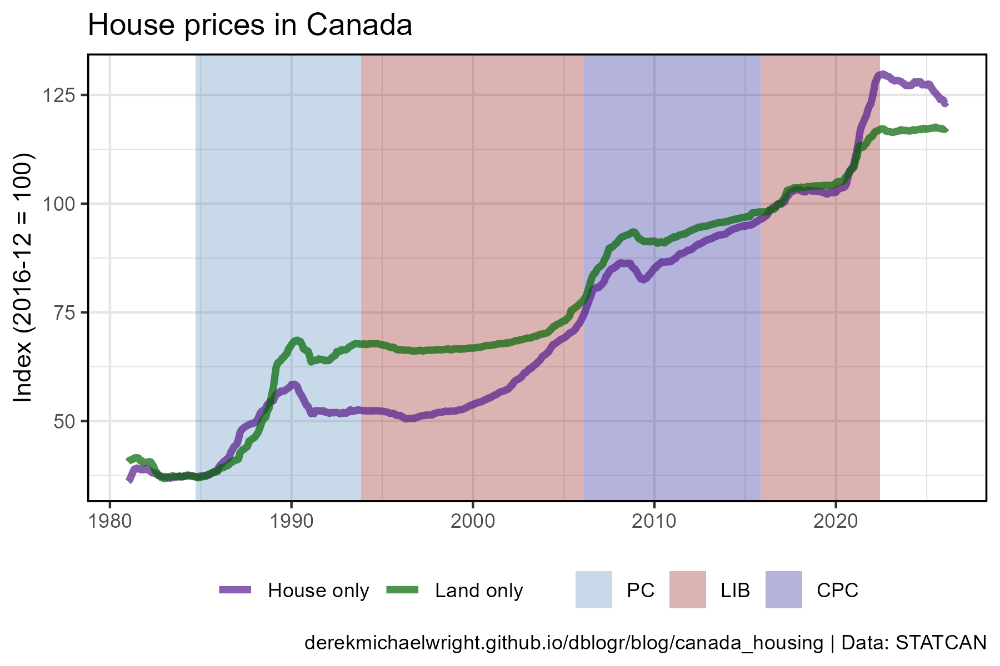

```{r}
# Prep data
xx <- d1 %>% 
  filter(Area == "Canada", Measurement %in% c("House only", "Land only"))
myxmin <- min(xx$Value)
myxmax <- max(xx$Value)
# Plot
mp <- ggplot(xx) +
  geom_rect(data = pp, alpha = 0.3, ymin = -Inf, ymax = Inf,
            aes(xmin = xmin, xmax = xmax, fill = Party)) +
  geom_line(aes(x = Date, y = Value, color = Measurement), alpha = 0.7, size = 1.5) +
  scale_color_manual(name = NULL, values = myColors_M) +
  scale_fill_manual(name = NULL, values = myColors_P) +
  scale_y_continuous(limits = c(myxmin,myxmax)) +
  theme_agData(legend.position = "bottom") +
  labs(title = "House prices in Canada", x = NULL,
       y = "Index (2016-12 = 100)", caption = myCaption)
ggsave("canada_housing_1_04.png", mp, width = 6, height = 4)
```

---

## All Data

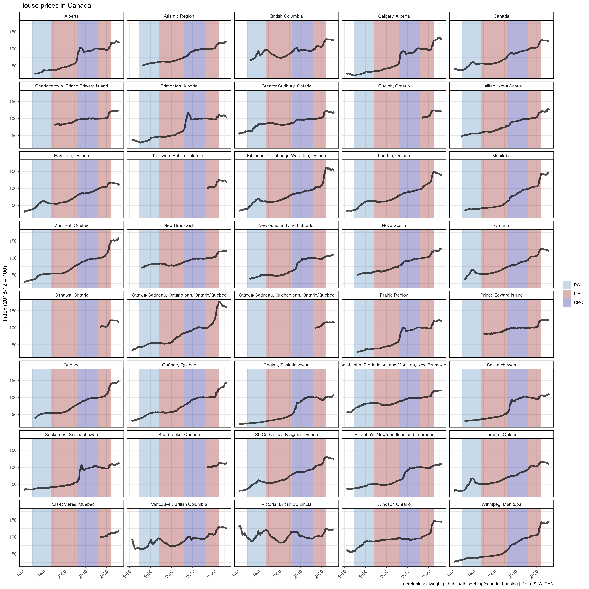

```{r}
# Prep data
xx <- d1 %>% filter(Measurement == "Total (house and land)")
# Plot
mp <- ggplot(xx) +
  geom_rect(data = pp, alpha = 0.3, ymin = -Inf, ymax = Inf,
            aes(xmin = xmin, xmax = xmax, fill = Party)) +
  geom_line(aes(x = Date, y = Value), size = 1.5, alpha = 0.7) +
  facet_wrap(Area ~ ., ncol = 5) +
  scale_color_manual(name = NULL, values = myColors_M) +
  scale_fill_manual(name = NULL, values = myColors_P) +
  theme_agData(axis.text.x = element_text(angle = 45, hjust = 1)) +
  labs(title = "House prices in Canada", x = NULL,
       y = "Index (2016-12 = 100)", caption = myCaption)
ggsave("canada_housing_1_05.png", mp, width = 16, height = 16)
```

---

## Saskatchewan


```{r}
# Prep data
xx <- d1 %>% 
  filter(grepl("Saskatchewan", Area), 
         Measurement %in% c("House only", "Land only"))
# Plot
mp <- ggplot(xx) +
  geom_rect(data = pp, alpha = 0.3, ymin = -Inf, ymax = Inf,
            aes(xmin = xmin, xmax = xmax, fill = Party)) +
  geom_line(aes(x = Date, y = Value, color = Measurement), 
            alpha = 0.7, size = 1.5) +
  facet_grid(. ~ Area) +
  scale_color_manual(name = NULL, values = myColors_M) +
  scale_fill_manual(name = NULL, values = myColors_P) +
  theme_agData(legend.position = "bottom",
               axis.text.x = element_text(angle = 45, hjust = 1)) +
  labs(title = "House prices in Saskatchewan", x = NULL,
       y = "Index (2016-12 = 100)", caption = myCaption)
ggsave("canada_housing_1_06.png", mp, width = 8, height = 4)
```

---

## Percent Change

### Canada

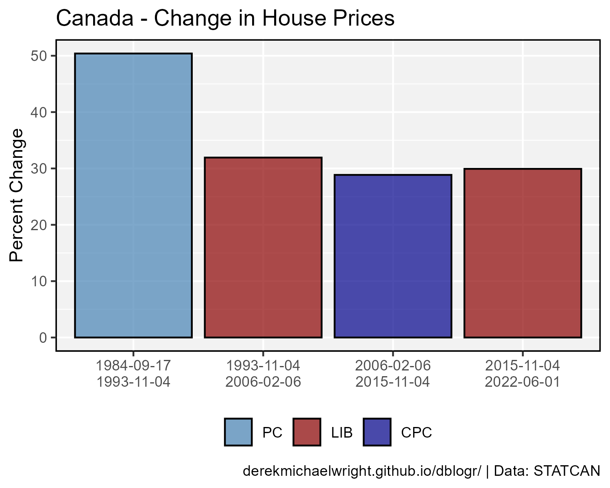

```{r}
# Prep data
xx <- d1 %>% filter(Area == "Canada", Measurement == "Total (house and land)")
for(i in 1:nrow(pp)) {
  pp$price1[i] <- xx$Value[xx$Date == paste0(substr(pp$xmin[i],1,7),"-01")]
  pp$price2[i] <- xx$Value[xx$Date == paste0(substr(pp$xmax[i],1,7),"-01")]
  pp$PercentChange[i] <- (100 * pp$price2[i] / pp$price1[i]) - 100
}
# Plot
mp <- ggplot(pp, aes(x = Admin, y = PercentChange, fill = Party)) +
  geom_col(color = "black", alpha = 0.7) +
  scale_x_discrete(labels = paste(pp$xmin, pp$xmax, sep = "\n")) +
  scale_fill_manual(name = NULL, values = myColors_P) +
  theme_agData(legend.position = "bottom") +
  labs(title = "Canada - Change in House Prices", x = NULL,
       y = "Percent Change", caption = myCaption)
ggsave("canada_housing_1_07.png", mp, width = 5, height = 4)
```

---

### Regina, Saskatchewan

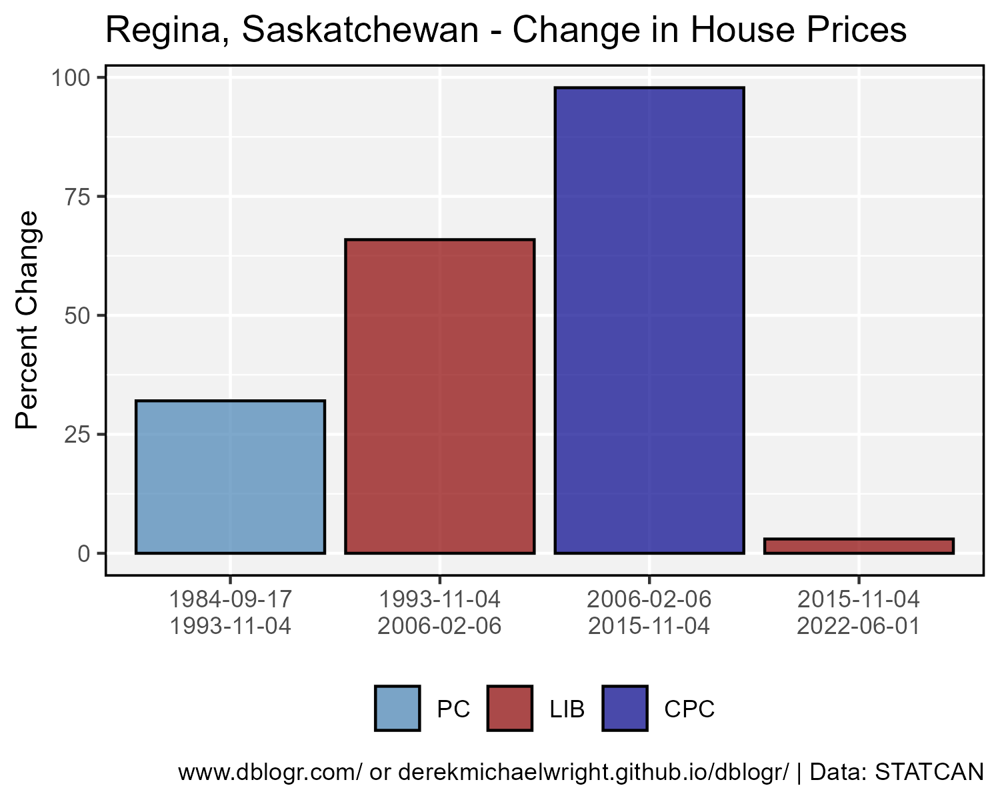

```{r}
# Prep data
xx <- d1 %>% filter(Area == "Regina, Saskatchewan", 
                    Measurement == "Total (house and land)")
for(i in 1:nrow(pp)) {
  pp$price1[i] <- xx$Value[xx$Date == paste0(substr(pp$xmin[i],1,7),"-01")]
  pp$price2[i] <- xx$Value[xx$Date == paste0(substr(pp$xmax[i],1,7),"-01")]
  pp$PercentChange[i] <- (100 * pp$price2[i] / pp$price1[i]) - 100
}
# Plot
mp <- ggplot(pp, aes(x = Admin, y = PercentChange, fill = Party)) +
  geom_col(color = "black", alpha = 0.7) +
  scale_x_discrete(labels = paste(pp$xmin, pp$xmax, sep = "\n")) +
  scale_fill_manual(name = NULL, values = myColors_P) +
  theme_agData(legend.position = "bottom") +
  labs(title = "Regina, Saskatchewan - Change in House Prices",
       y = "Percent Change", x = NULL, caption = myCaption)
ggsave("canada_housing_1_08.png", mp, width = 5, height = 4)
```

---

# Home Builds

## Canada

### Monthly

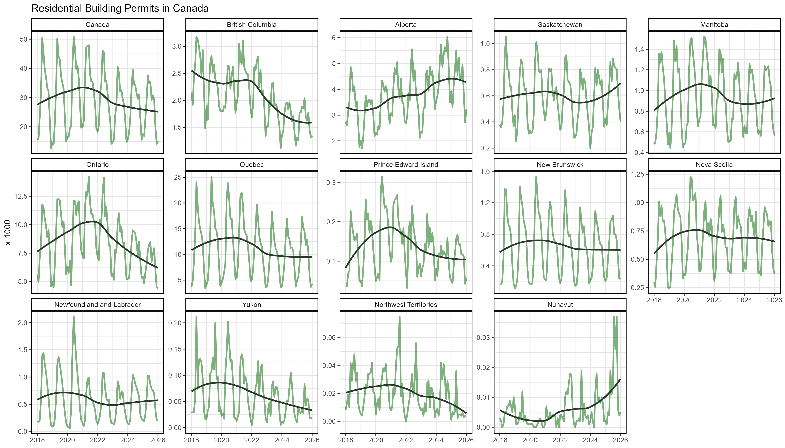

```{r}
# Prep data
xx <- d2 %>% 
  filter(Area %in% myAreas[1], Measurement == "Total units")
# Plot
mp <- ggplot(xx, aes(x = Date, y = Value)) +
  geom_col(position = "dodge", alpha = 0.7, fill = "darkgreen") +
  scale_x_date(date_breaks = "1 year", date_labels = "%Y",
               date_minor_breaks = "1 year",) +
  theme_agData(legend.position = "bottom",
               axis.text.x = element_text(angle = 45, hjust = 1)) +
  labs(title = "Housing Units Built in Canada", subtitle = myAreas[1], 
       y = "Units Built", x = NULL, caption = myCaption)
ggsave("canada_housing_2_01.png", mp, width = 7, height = 5)
```

---

### Yearly

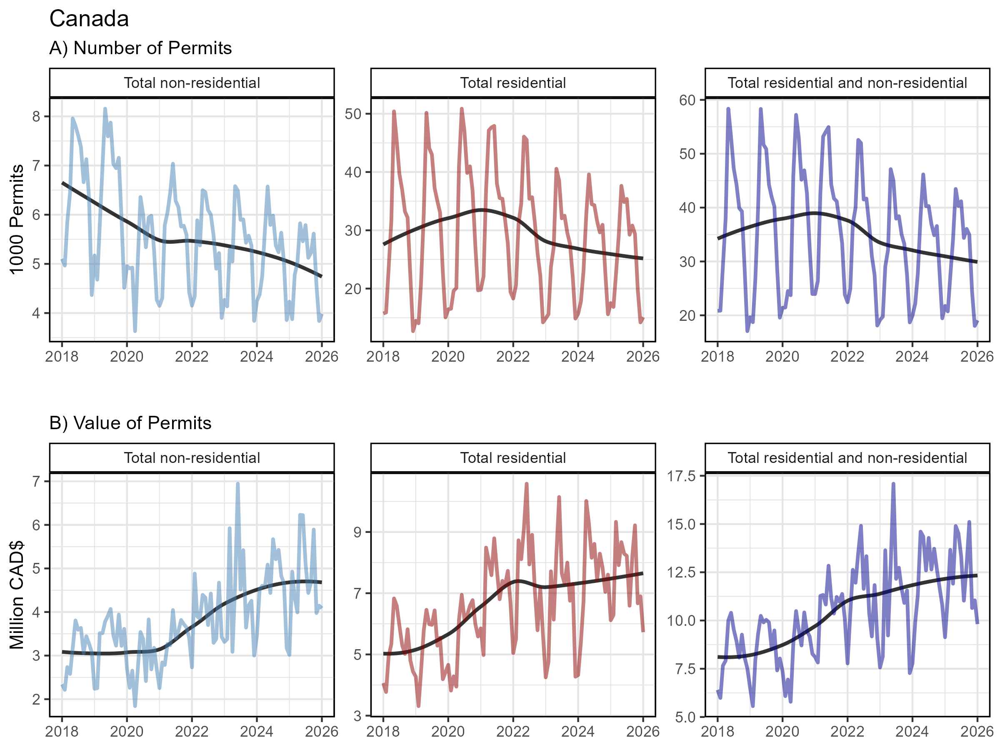

```{r}
# Prep data
xx <- d2 %>% 
  filter(Area %in% myAreas[1], Measurement == "Total units") %>%
  group_by(Year, Area) %>%
  summarise(Value = sum(Value))
# Plot
mp <- ggplot(xx, aes(x = Year, y = Value)) +
  geom_col(position = "dodge", color = "black",
           alpha = 0.7, fill = "darkgreen") +
  scale_x_continuous(breaks = 1992:2022) +
  theme_agData(legend.position = "bottom",
               axis.text.x = element_text(angle = 45, hjust = 1)) +
  labs(title = "Housing Units Built in Canada", subtitle = myAreas[1], 
       y = "Units Built", x = NULL, caption = myCaption)
ggsave("canada_housing_2_02.png", mp, width = 7, height = 5)
```

---

### Houses vs Appartments

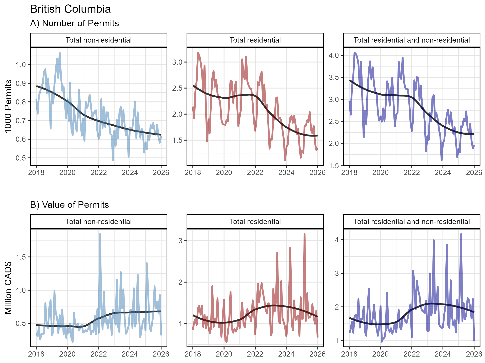

```{r}
# Prep data
xx <- d2 %>% 
  filter(Area %in% myAreas[1], Measurement != "Total units") %>%
  group_by(Year, Area, Measurement) %>%
  summarise(Value = sum(Value))
# Plot
mp <- ggplot(xx, aes(x = Year, y = Value, color = Measurement)) +
  geom_line(alpha = 0.7, size = 1.5) +
  scale_color_manual(name = NULL, values = myColors_P) +
  scale_x_continuous(breaks = 1992:2022, minor_breaks = 1992:2022) +
  theme_agData(legend.position = "bottom",
               axis.text.x = element_text(angle = 45, hjust = 1)) +
  labs(title = "Housing Units Built in Canada", subtitle = myAreas[1], 
       y = "Units Built", x = NULL, caption = myCaption)
ggsave("canada_housing_2_03.png", mp, width = 6, height = 4)
```

---

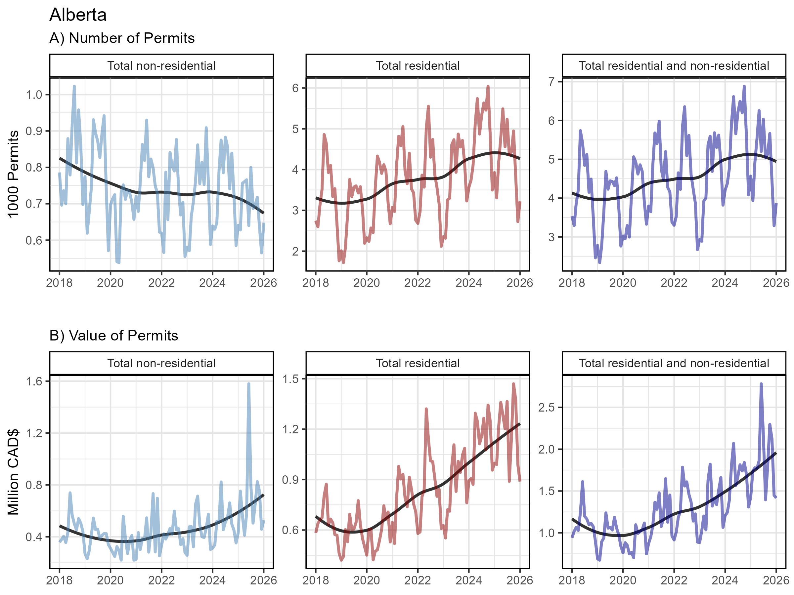

```{r}
# Prep data
xx <- xx %>% filter(Year >= 2005)
# Plot
mp <- ggplot(xx, aes(x = Year, y = Value, color = Measurement)) +
  geom_line(alpha = 0.7, size = 1.5) +
  scale_color_manual(name = NULL, values = myColors_P) +
  scale_x_continuous(breaks = 2005:2022, minor_breaks = 2005:2022) +
  theme_agData(legend.position = "bottom",
               axis.text.x = element_text(angle = 45, hjust = 1)) +
  labs(title = "Housing Units Built in Canada", subtitle = myAreas[1], 
       y = "Units Built", x = NULL, caption = myCaption)
ggsave("canada_housing_2_04.png", mp, width = 6, height = 4)
```

---

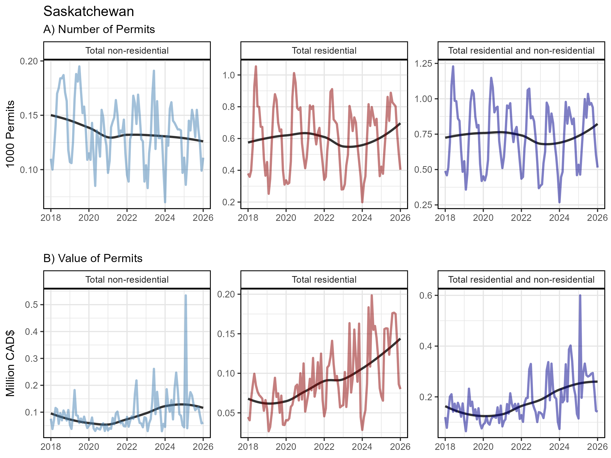

```{r}
# Prep data
xx <- xx %>% filter(Year >= 2018)
# Plot
mp <- ggplot(xx, aes(x = Year, y = Value, fill = Measurement)) +
  geom_col(position = "dodge", color = "black", alpha = 0.7) +
  scale_fill_manual(name = NULL, values = myColors_P) +
  scale_x_continuous(breaks = 2005:2022) +
  theme_agData(legend.position = "bottom") +
  labs(title = "Housing Units Built in Canada", subtitle = myAreas[1], 
       y = "Units Built", x = NULL, caption = myCaption)
ggsave("canada_housing_2_05.png", mp, width = 6, height = 5)
```

---

## Cities

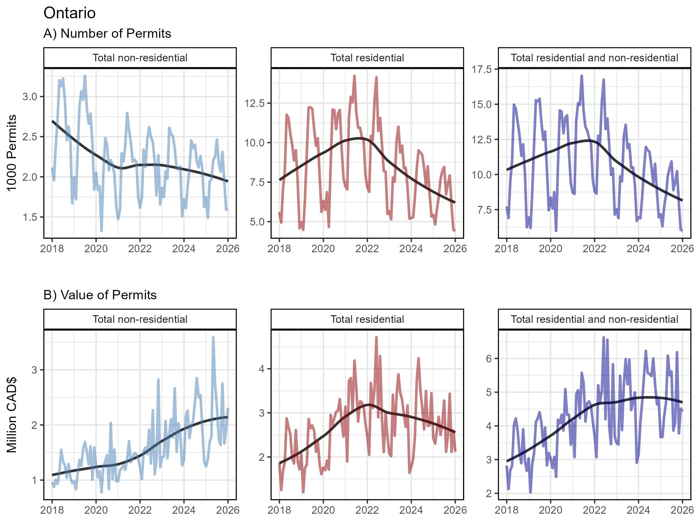

```{r}
# Prep data
xx <- d2 %>% 
  filter(Area != myAreas[1], Measurement != "Total units")
# Plot
mp <- ggplot(xx, aes(x = Date, y = Value, color = Measurement)) +
  geom_line(alpha = 0.7) +
  facet_wrap(Area ~ ., scales = "free_y", ncol = 6) +
  scale_color_manual(name = NULL, values = myColors_P) +
  theme_agData(legend.position = "bottom") +
  labs(title = "Housing Units Built Per Month in Canada", 
       y = "Units Built", x = NULL, caption = myCaption)
ggsave("canada_housing_2_06.png", mp, width = 20, height = 15)
```

---

### Van + Tor + Cal + Reg

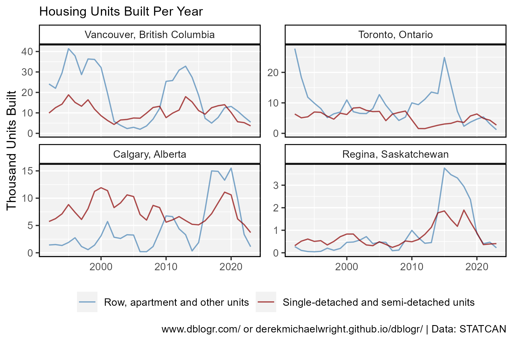

```{r}
# Prep data
myCities <- c("Vancouver, British Columbia", "Toronto, Ontario", 
              "Calgary, Alberta", "Regina, Saskatchewan")
xx <- d2 %>% 
  filter(Area %in% myCities, Measurement != "Total units") %>%
  mutate(Area = factor(Area, levels = myCities)) %>%
  group_by(Year, Area, Measurement) %>%
  summarise(Value = sum(Value))
# Plot
mp <- ggplot(xx, aes(x = Year, y = Value / 1000, color = Measurement)) +
  geom_line(alpha = 0.7) +
  expand_limits(y = 0) +
  facet_wrap(Area ~ ., scales = "free_y", ncol = 2) +
  scale_color_manual(name = NULL, values = myColors_P) +
  theme_agData(legend.position = "bottom") +
  labs(subtitle = "Housing Units Built Per Year", 
       y = "Thousand Units Built", x = NULL, caption = myCaption)
ggsave("canada_housing_2_07.png", mp, width = 6, height = 4)
```

---

### British Columbia

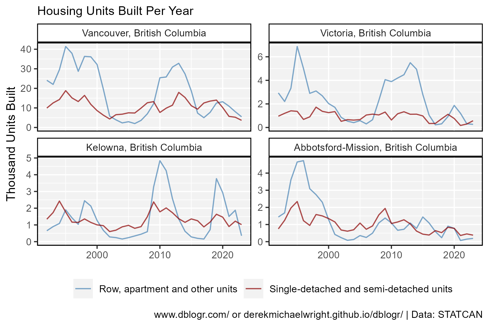

```{r}
# Prep data
myCities <- c("Vancouver, British Columbia", "Victoria, British Columbia", 
              "Kelowna, British Columbia", "Abbotsford-Mission, British Columbia")
xx <- d2 %>% 
  filter(Area %in% myCities, Measurement != "Total units") %>%
  mutate(Area = factor(Area, levels = myCities)) %>%
  group_by(Year, Area, Measurement) %>%
  summarise(Value = sum(Value))
# Plot
mp <- ggplot(xx, aes(x = Year, y = Value / 1000, color = Measurement)) +
  geom_line(alpha = 0.7) +
  expand_limits(y = 0) +
  facet_wrap(Area ~ ., scales = "free_y", ncol = 2) +
  scale_color_manual(name = NULL, values = myColors_P) +
  theme_agData(legend.position = "bottom") +
  labs(subtitle = "Housing Units Built Per Year", 
       y = "Thousand Units Built", x = NULL, caption = myCaption)
ggsave("canada_housing_2_08.png", mp, width = 6, height = 4)
```

---

### Prairie

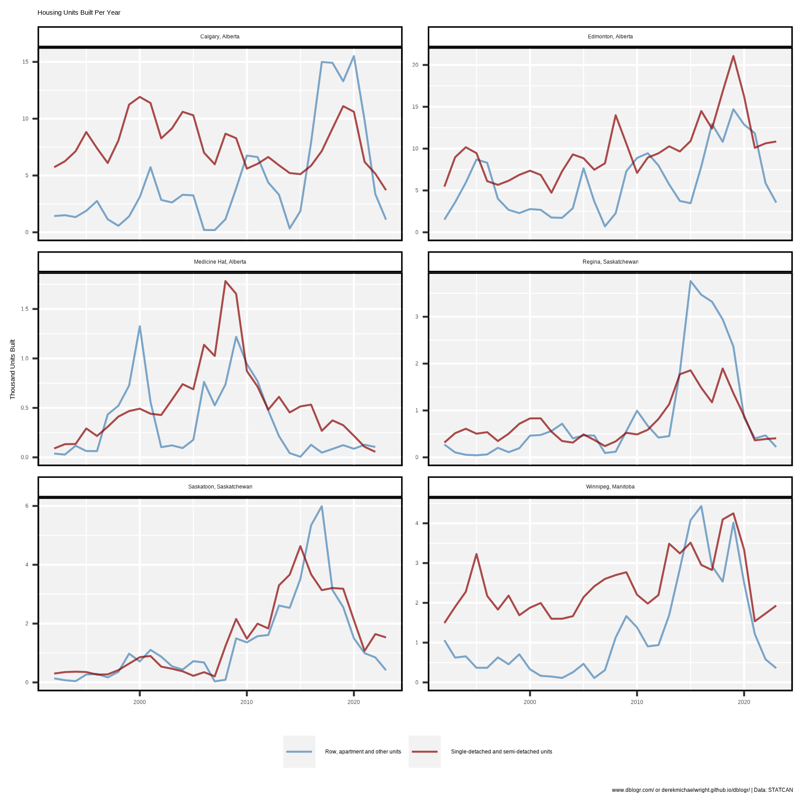

```{r}
# Prep data
myCities <- c("Calgary, Alberta", "Edmonton, Alberta", "Medicine Hat, Alberta",
              "Regina, Saskatchewan", "Saskatoon, Saskatchewan",
              "Winnipeg, Manitoba")
xx <- d2 %>% 
  filter(Area %in% myCities, Measurement != "Total units") %>%
  mutate(Area = factor(Area, levels = myCities)) %>%
  group_by(Year, Area, Measurement) %>%
  summarise(Value = sum(Value))
# Plot
mp <- ggplot(xx, aes(x = Year, y = Value / 1000, color = Measurement)) +
  geom_line(alpha = 0.7) +
  expand_limits(y = 0) +
  facet_wrap(Area ~ ., scales = "free_y", ncol = 2) +
  scale_color_manual(name = NULL, values = myColors_P) +
  theme_agData(legend.position = "bottom") +
  labs(subtitle = "Housing Units Built Per Year", 
       y = "Thousand Units Built", x = NULL, caption = myCaption)
ggsave("canada_housing_2_09.png", mp, width = 6, height = 6)
```

---

### Eastern Canada

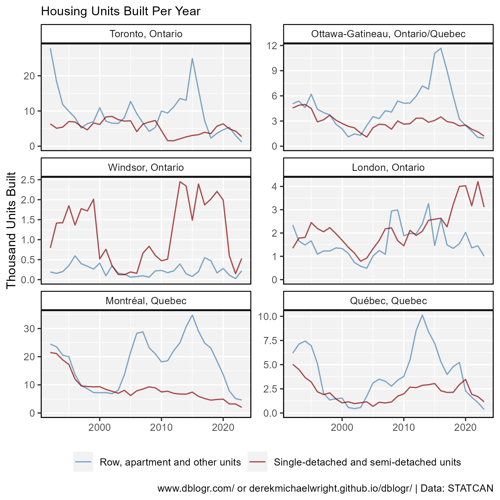

```{r}
# Prep data
myCities <- c("Toronto, Ontario", "Ottawa-Gatineau, Ontario/Quebec",
              "Windsor, Ontario", "London, Ontario",
              "Montréal, Quebec", "Québec, Quebec")
xx <- d2 %>% 
  filter(Area %in% myCities, Measurement != "Total units") %>%
  mutate(Area = factor(Area, levels = myCities)) %>%
  group_by(Year, Area, Measurement) %>%
  summarise(Value = sum(Value))
# Plot
mp <- ggplot(xx, aes(x = Year, y = Value / 1000, color = Measurement)) +
  geom_line(alpha = 0.7) +
  expand_limits(y = 0) +
  facet_wrap(Area ~ ., scales = "free_y", ncol = 2) +
  scale_color_manual(name = NULL, values = myColors_P) +
  theme_agData(legend.position = "bottom") +
  labs(subtitle = "Housing Units Built Per Year", 
       y = "Thousand Units Built", x = NULL, caption = myCaption)
ggsave("canada_housing_2_10.png", mp, width = 6, height = 6)
```

---

# Occupancy

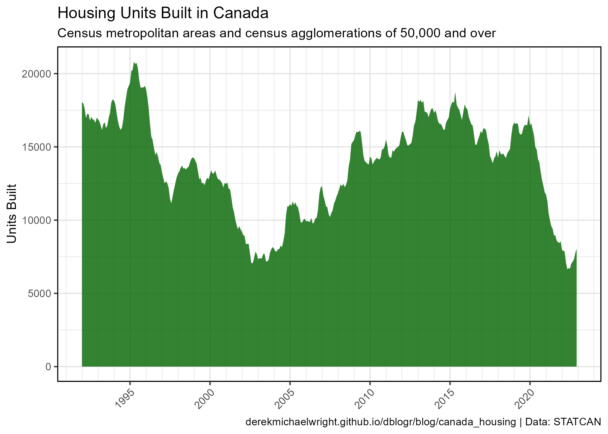

```{r}
# Prep data
xx <- d3 %>% 
  filter(Area == "Canada", Sector == "Total economy",
         Private == "Total housing type", Tenure == "Total tenure type",
         Occupancy == "Private dwellings unoccupied")
# Plot
mp <- ggplot(xx, aes(x = Date, y = Value / 1000)) +
  geom_line(alpha = 0.7, size = 1.5, color = "darkred") +
  facet_wrap(Type ~ ., scales = "free_y") +
  expand_limits(y = 0) +
  theme_agData() +
  labs(title = "Unoccupied Housing Units in Canada", 
       y = "Thousand Units", x = NULL, caption = myCaption)
ggsave("canada_housing_3_01.png", mp, width = 8, height = 6)
```

---


```{r}
# Prep data
xx <- d3 %>% 
  filter(Sector == "Total economy", Type == "Total dwelling type",
         Private == "Total housing type", Tenure == "Total tenure type",
         Occupancy == "Private dwellings unoccupied")
# Plot
mp <- ggplot(xx, aes(x = Date, y = Value / 1000)) +
  geom_line(alpha = 0.7, size = 1.5, color = "darkred") +
  facet_wrap(Area ~ ., scales = "free_y") +
  expand_limits(y = 0) +
  theme_agData() +
  labs(title = "Unoccupied Housing Units in Canada", 
       y = "Thousand Units", x = NULL, caption = myCaption)
ggsave("canada_housing_3_02.png", mp, width = 12, height = 8)
```

---

## Tenure

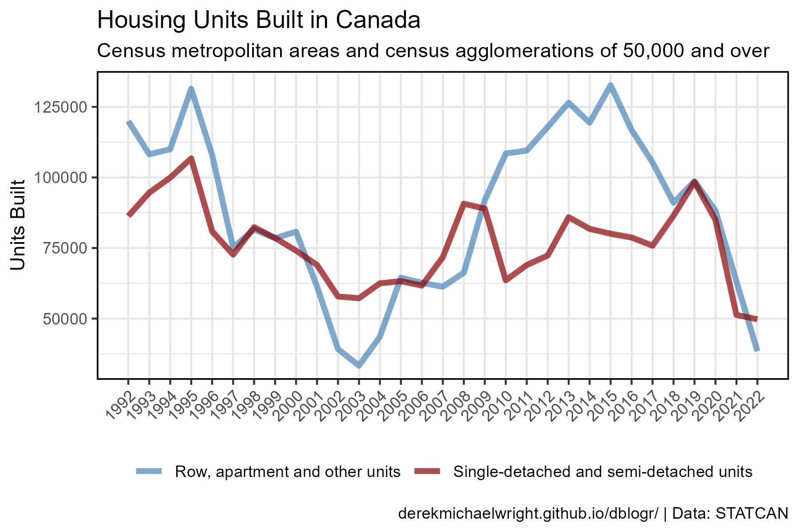

```{r}
# Prep data
xx <- d3 %>% 
  filter(Area == "Canada", Sector == "Total economy", Type == "Total dwelling type",
         Private == "Total housing type", Tenure %in% c("Owner", "Renter"),
         Occupancy == "Total private dwellings") %>%
  mutate(Tenure = factor(Tenure, levels = c("Renter", "Owner")))
# Plot
mp <- ggplot(xx, aes(x = Date, y = Value / 1000000, fill = Tenure)) +
  geom_col(alpha = 0.7, color = "black") +
  scale_fill_manual(name = NULL, values = c("steelblue", "darkgreen")) +
  theme_agData(legend.position = "bottom") +
  labs(title = "Housing Units in Canada", 
       y = "Million Units", x = NULL, caption = myCaption)
ggsave("canada_housing_3_03.png", mp, width = 6, height = 4)
```

```{r echo = F, eval = F}
unique(d3$Sector)
unique(d3$Private)
unique(d3$Occupancy)
unique(d3$Tenure)
unique(d3$Occupancy)
unique(d3$Type)
```

---

# Housing vs Income

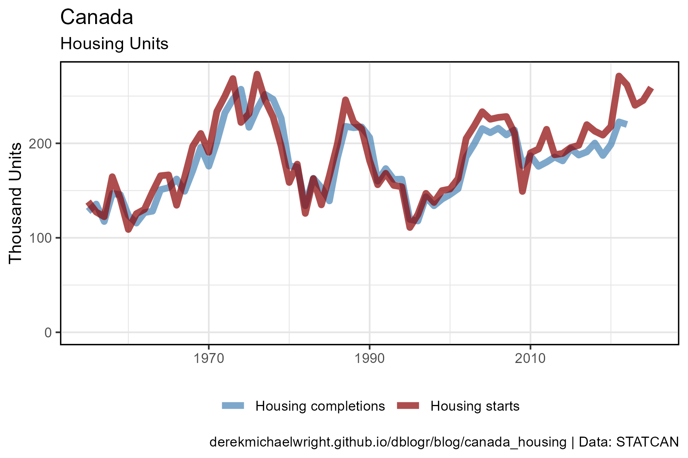

```{r}
# Prep data
xx <- d6 %>% filter(Area == "Canada") 
# Plot
mp <- ggplot(xx, aes(x = Date, y = Value, color = Measurement)) +
  geom_line(size = 1.5, alpha = 0.7) +
  scale_color_manual(name = NULL, values = c("darkred", "darkgreen")) +
  scale_x_date(date_breaks = "1 year", date_minor_breaks = "1 year", date_labels = "%Y") +
  theme_agData(legend.position = "bottom",
               axis.text.x = element_text(angle = 45, hjust = 1)) +
  labs(title = "Canada", subtitle = "Housing Price vs. Income",
       y = "Percent Change", x = NULL, caption = myCaption)
ggsave("canada_housing_4_01.png", mp, width = 6, height = 4)
```

---


```{r}
# Animate
mp <- mp + 
  transition_reveal(Date) + 
  view_follow(fixed_y = T)
  #view_follow(fixed_x = c(as.Date("1866-01-01"), NA))
anim_save("canada_housing_4_01.gif", mp, 
          nframes = 600, fps = 30, end_pause = 60, 
          width = 900, height = 600, res = 150)
```

---
