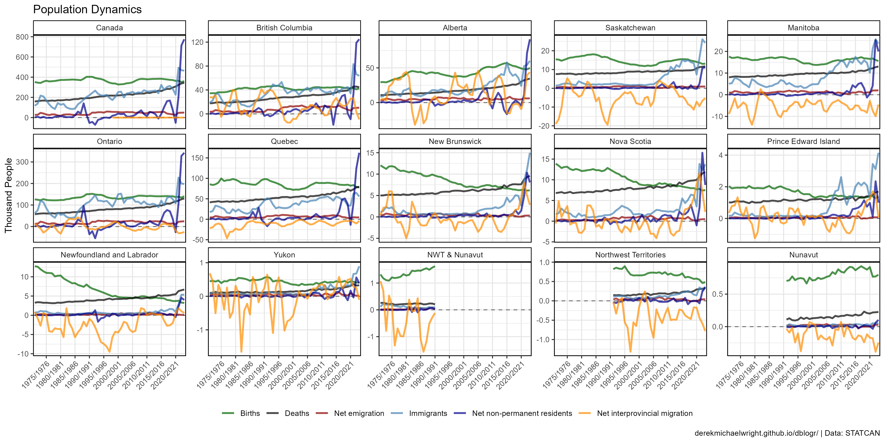
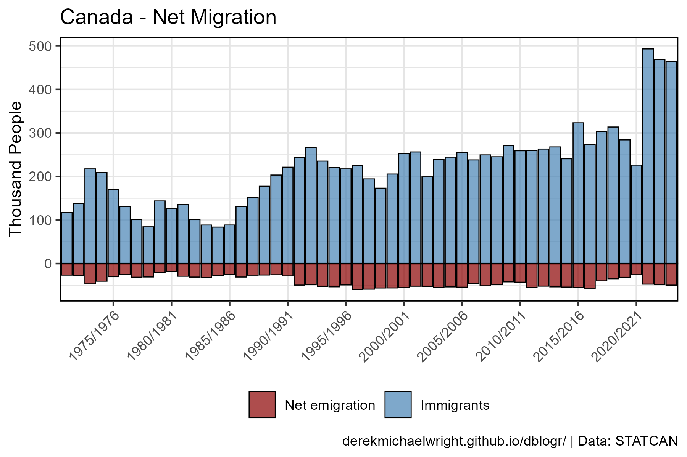
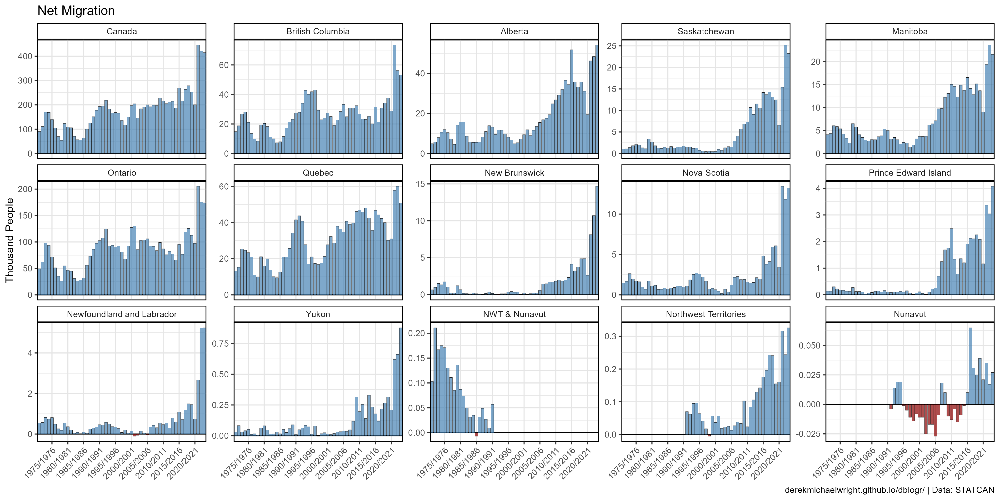
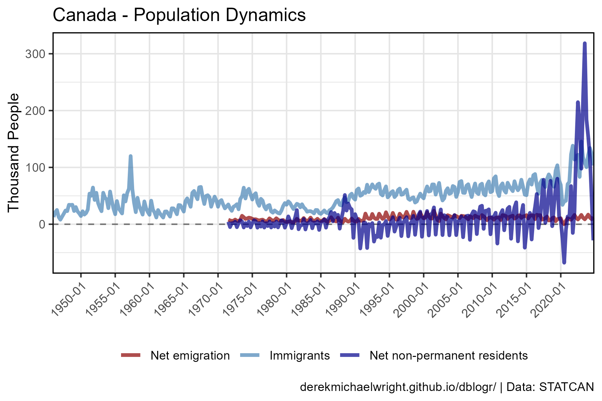
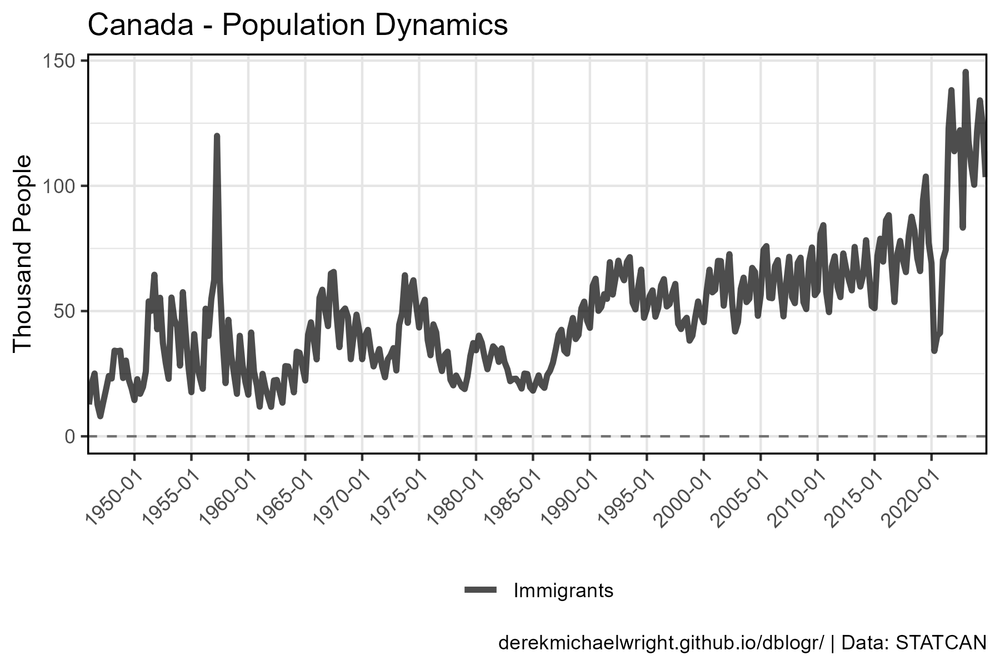
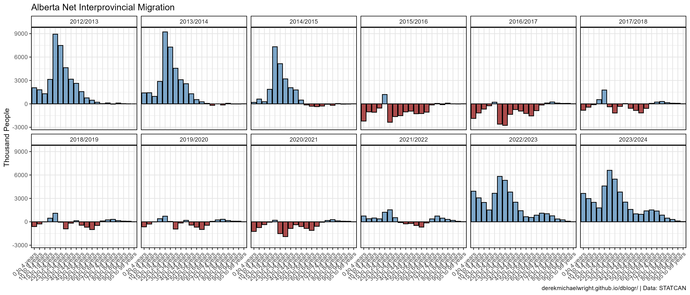
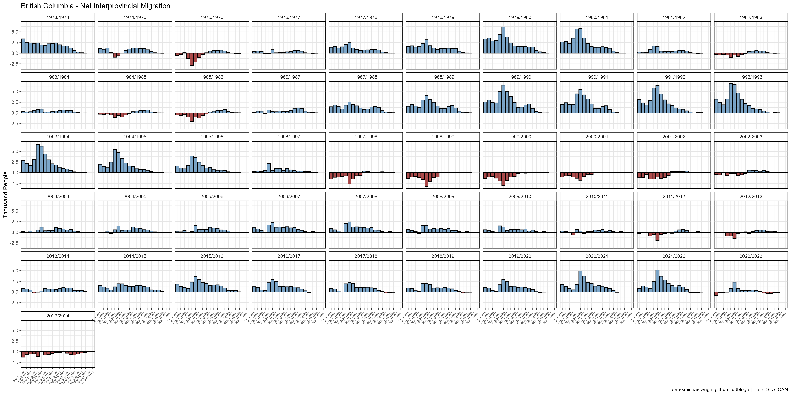
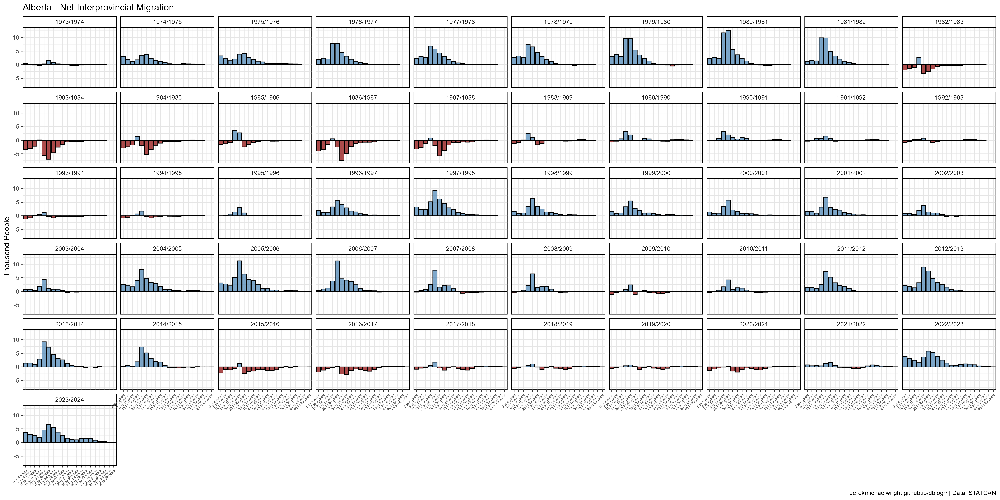

```{r setup, include=FALSE}
knitr::opts_chunk$set(echo = T, message = F, warning = F)
```

---

# Data

STATCAN Table: 17-10-0009-01

- `r shiny::icon("globe")` https://www150.statcan.gc.ca/t1/tbl1/en/cv.action?pid=1710000901
- `r shiny::icon("save")` [1710000901_databaseLoadingData.csv](1710000901_databaseLoadingData.csv)

STATCAN Table: 17-10-0008-01

- `r shiny::icon("globe")` https://www150.statcan.gc.ca/t1/tbl1/en/cv.action?pid=1710000801
- `r shiny::icon("save")` [1710000801_databaseLoadingData.csv](1710000801_databaseLoadingData.csv)

STATCAN Table: 17-10-0015-01

- `r shiny::icon("globe")` https://www150.statcan.gc.ca/t1/tbl1/en/cv.action?pid=1710001501
- `r shiny::icon("save")` [1710001501_databaseLoadingData.csv](1710001501_databaseLoadingData.csv)

---

# Prepare Data

```{r class.source = 'fold-show'}
# devtools::install_github("derekmichaelwright/agData")
library(agData)
```

```{r}
# Prep data
myCaption <- "www.dblogr.com/ or derekmichaelwright.github.io/dblogr/ | Data: STATCAN"
myColors <- c("darkgreen", "black", "darkred", "steelblue")
myAreas <- c("Canada", "Ontario", "Quebec", "New Brunswick", "Nova Scotia",
           "Prince Edward Island", "Newfoundland and Labrador",
           "British Columbia", "Alberta","Saskatchewan", "Manitoba",
           "Yukon", "Northwest Territories including Nunavut", 
           "Northwest Territories", "Nunavut")
myAges <- c("0 to 4 years", "5 to 9 years", 
            "10 to 14 years", "15 to 19 years",
            "20 to 24 years", "25 to 29 years", 
            "30 to 34 years", "35 to 39 years",
            "40 to 44 years", "45 to 49 years", 
            "50 to 54 years", "55 to 59 years",
            "60 to 64 years", "65 to 69 years", 
            "70 to 74 years", "75 to 79 years",
            "80 to 84 years", "85 to 89 years", 
            "90 to 94 years", "95 to 99 years",
            "100 years and over")
#
d1 <- read.csv("1710000901_databaseLoadingData.csv") %>%
  select(Year=1, Area=GEO, Unit=UOM, Value=VALUE) %>%
  mutate(Area = factor(Area, levels = myAreas),
         Month = substr(Year, 6, 8),
         Year = substr(Year, 1,4),
         Year = as.numeric(Year),
         Month = as.numeric(Month),
         Date = as.Date(paste(Year, Month, "01", sep = "-")))
pp <- d1 %>% group_by(Area, Year) %>%
  summarise(Population = mean(Value, na.rm = T))
#
d2 <- read.csv("1710000801_databaseLoadingData.csv") %>%
  select(Year=1, Area=GEO, Measurement=Components.of.population.growth, 
         Unit=UOM, Value=VALUE) %>%
  mutate(Area = factor(Area, levels = myAreas),
         Year = substr(Year, 1,4),
         Year = as.numeric(Year))
#
d3 <- read.csv("1710001501_databaseLoadingData.csv") %>%
  select(Year=1, Area=GEO, Sex, Age=Age.group, 
         Measurement=Migrants, UOM, Value=VALUE) %>%
  mutate(Age = factor(Age, levels = myAges),
         Net = ifelse(Value > 0, "Positive", "Negative"))
```

---

# Births, Deaths & Immigration

## Canada

```{r}
# Prep data
myMeasures <- c("Births", "Deaths", "Immigrants", "Emigrants")
xx <- d2 %>% filter(Area == "Canada", Measurement %in% myMeasures)
# Plot
mp <- ggplot(xx, aes(x = Year, y = Value / 1000, color = Measurement)) +
  geom_line(size = 1, alpha = 0.7) +
  scale_color_manual(name = NULL, values = myColors) +
  theme_agData(legend.position = "bottom", 
               axis.text.x = element_text(angle = 45, hjust = 1)) +
  labs(title = "Canada - Population Dynamics", x = NULL,
       y = "Thousand People", caption = myCaption)
ggsave("canada_migration_1_01.png", mp, width = 6, height = 4)
```

```{r echo = F}
ggsave("featured.png", mp, width = 6, height = 4)
```

---

## Provinces



```{r}
# Prep data
myMeasures <- c("Births", "Deaths", "Immigrants", "Emigrants")
xx <- d2 %>% filter(Measurement %in% myMeasures)
# Plot
mp <- ggplot(xx, aes(x = Year, y = Value / 1000, color = Measurement)) +
  geom_line(size = 1, alpha = 0.7) +
  facet_wrap(Area ~ ., ncol = 5, scales = "free_y") +
  scale_color_manual(name = NULL, values = myColors) +
  theme_agData(legend.position = "bottom", 
               axis.text.x = element_text(angle = 45, hjust = 1)) +
  labs(title = "Population Dynamics", x = NULL,
       y = "Thousand People", caption = myCaption)
ggsave("canada_migration_1_02.png", mp, width = 12, height = 6)
```

---

## Migration



```{r}
# Prep data
xx <- d2 %>% 
  filter(Measurement %in% c("Immigrants", "Emigrants")) %>%
  mutate(Value = ifelse(Measurement == "Emigrants", -Value, Value))
# Plot
mp <- ggplot(xx, aes(x = Year, y = Value / 1000, fill = Measurement)) +
  geom_hline(yintercept = 0) +
  geom_col(alpha = 0.7, color = "black", lwd = 0.1) +
  facet_wrap(Area ~ ., ncol = 5, scales = "free_y") +
  scale_fill_manual(name = NULL, values = myColors[3:4]) +
  theme_agData(legend.position = "bottom",
               axis.text.x = element_text(angle = 45, hjust = 1)) +
  labs(title = "Net Migration", x = NULL, 
       y = "Thousand People", caption = myCaption)
ggsave("canada_migration_1_03.png", mp, width = 14, height = 6)
```

---

## Net Migration


```{r}
# Prep data
xx <- d2 %>% 
  filter(Measurement %in% c("Immigrants", "Emigrants")) %>%
  spread(Measurement, Value) %>%
  mutate(Net = Immigrants - Emigrants,
         Group = ifelse(Net > 0, "Pos", "Neg"))
# Plot
mp <- ggplot(xx, aes(x = Year, y = Net / 1000, fill = Group)) +
  geom_hline(yintercept = 0) +
  geom_col(alpha = 0.7, color = "black", lwd = 0.1) +
  facet_wrap(Area ~ ., ncol = 5, scales = "free_y") +
  scale_fill_manual(name = NULL, values = myColors[3:4]) +
  theme_agData(axis.text.x = element_text(angle = 45, hjust = 1)) +
  labs(title = "Net Migration", x = NULL, 
       y = "Thousand People", caption = myCaption)
ggsave("canada_migration_1_04.png", mp, width = 14, height = 6)
```

---

### Prairies vs. NonPrairies



```{r}
# Prep data
myColorsArea <- c("steelblue", "red", "darkorange", 
            "darkblue", "darkgreen", "darkred")
areas <- c("Quebec", "Ontario", "British Columbia", 
           "Alberta", "Saskatchewan", "Manitoba")
wings <- c("NonPrairies", "NonPrairies", "NonPrairies", 
           "Prairies", "Prairies", "Prairies")
x1 <- d1 %>% 
  filter(Month == 1) %>%
  select(Area, Year, Population=Value)
x2 <- d2 %>% 
  filter(Measurement == "Immigrants") %>%
  select(Area, Year, Immigrants=Value)
xx <- left_join(x1, x2, by = c("Area", "Year")) %>%
  filter(Area %in% areas, !is.na(Immigrants)) %>%
  mutate(Value = 1000000 * Immigrants / Population,
         Area = factor(Area, levels = areas),
         Wing = plyr::mapvalues(Area, areas, wings))
# Plot
mp <- ggplot(xx, aes(x = Year, y = Value, color = Area)) +
  geom_line(alpha = 0.2) + 
  geom_smooth(se = F) +
  facet_grid(. ~ Wing) +
  scale_x_continuous(breaks = seq(1975, 2015, 10)) +
  scale_color_manual(name = NULL, values = myColorsArea) +
  theme_agData() +
  labs(title = "Immigration Rates", x = NULL,
       y = "Immigrants per Million People", caption = myCaption)
ggsave("canada_migration_1_05.png", mp, width = 8, height = 4)
```

---

# Net Interprovincial Migration


```{r}
# Prep data
xx <- d2 %>% 
  filter(Area != "Canada",
         Measurement == "Net interprovincial migration") %>%
  mutate(Group = ifelse(Value > 0, "Pos", "Neg"))
# Plot
mp <- ggplot(xx, aes(x = Year, y = Value / 1000, fill = Group)) +
  geom_hline(yintercept = 0) +
  geom_col(alpha = 0.7, color = "black", lwd = 0.1) +
  facet_wrap(Area ~ ., ncol = 5, scales = "free_y") +
  scale_fill_manual(name = NULL, values = myColors[3:4]) +
  theme_agData(axis.text.x = element_text(angle = 45, hjust = 1)) +
  labs(title = "Net Interprovincial Migration", x = NULL,
       y = "Thousand People", caption = myCaption)
ggsave("canada_migration_1_06.png", mp, width = 12, height = 6)
```

---

### Alberta vs BC


```{r}
# Prep data
xx <- d2 %>% 
  filter(Area %in% c("Alberta", "British Columbia"),
         Measurement == "Net interprovincial migration")
# Plot
mp <- ggplot(xx, aes(x = Year, y = Value / 1000, color = Area)) +
  geom_hline(yintercept = 0) +
  geom_line(size = 1.5, alpha = 0.7) +
  scale_color_manual(name = NULL, values = myColorsArea[3:4]) +
  theme_agData(legend.position = "bottom") +
  labs(title = "Net Interprovincial Migration", x = NULL,
       y = "Thousand People", caption = myCaption)
ggsave("canada_migration_1_07.png", mp, width = 6, height = 4)
```

---

# Interprovincial Migration By Age

```{r}
# Create plotting function
ggInterProv <- function(myArea) {
  #Prep data
  xx <- d3 %>% 
    filter(Area == myArea, Year != "1971/1972",
           Sex == "Both sexes", Age != "All ages",
           Measurement == "Net-migration")
  # Plot
  ggplot(xx, aes(x = Age, y = Value / 1000, fill = Net)) +
    geom_col(color = "black", alpha = 0.7) +
    facet_wrap(. ~ Year, ncol = 10) +
    scale_fill_manual(values = myColors[3:4]) +
    theme_agData(legend.position = "none",
                 axis.text.x = element_text(angle = 45, hjust = 1, size = 5)) +
    labs(title = paste(myArea, "- Net Interprovincial Migration"), x = NULL,
         y = "Thousand People", caption = myCaption)
}
```

---

## British Columbia



```{r}
# Plot
mp <- ggInterProv(myArea = "British Columbia")
ggsave("canada_migration_2_01.png", mp, width = 20, height = 10)
```

---

## Alberta



```{r}
# Plot
mp <- ggInterProv(myArea = "Alberta")
ggsave("canada_migration_2_02.png", mp, width = 20, height = 10)
```

---

## Saskatchewan


```{r}
# Plot
mp <- ggInterProv(myArea = "Saskatchewan")
ggsave("canada_migration_2_03.png", mp, width = 20, height = 10)
```

---

## Manitoba


```{r}
# Plot
mp <- ggInterProv(myArea = "Manitoba")
ggsave("canada_migration_2_04.png", mp, width = 20, height = 10)
```

---

## Ontario


```{r}
# Plot
mp <- ggInterProv(myArea = "Ontario")
ggsave("canada_migration_2_04.png", mp, width = 20, height = 10)
```

---

## Quebec


```{r}
# Plot
mp <- ggInterProv(myArea = "Quebec")
ggsave("canada_migration_2_05.png", mp, width = 20, height = 10)
```

---

### Alberta 2012 - 2020



```{r}
# Prep data
myYears <- c(c("2012/2013", "2013/2014", "2014/2015", "2015/2016", "2017/2018",
               "2018/2019", "2019/2020", "2020/2021", "2021/2022"))
xx <- d3 %>% 
  filter(Area == "Alberta", Year %in% myYears,
         Sex == "Both sexes", Age != "All ages",
         Measurement == "Net-migration")
# Plot
mp <- ggplot(xx, aes(x = Age, y = Value, fill = Net)) +
  geom_col(color = "black", alpha = 0.7) +
  facet_wrap(. ~ Year, ncol = 3) +
  scale_fill_manual(values = myColors[3:4]) +
  theme_agData(legend.position = "none",
               axis.text.x = element_text(angle = 45, hjust = 1)) +
  labs(title = "Alberta Net Interprovincial Migration", 
       y = "Thousand People", x = NULL, caption = myCaption)
ggsave("canada_migration_2_06.png", mp, width = 10, height = 8)
```

---

# 2021 - 2022

## Alberta


```{r}
# Prep data
xx <- d3 %>% 
  filter(Area == "Alberta", Year %in% c("2020/2021", "2021/2022"),
         Sex == "Both sexes", Age != "All ages",
         Measurement == "Net-migration")
# Plot
mp <- ggplot(xx, aes(x = Age, y = Value, fill = Net)) +
  geom_col(color = "black", alpha = 0.7) +
  facet_grid(. ~ Year) +
  scale_fill_manual(values = myColors[3:4]) +
  theme_agData(legend.position = "none",
               axis.text.x = element_text(angle = 45, hjust = 1)) +
  labs(title = "Alberta Net Interprovincial Migration", 
       y = "Thousand People", x = NULL, caption = myCaption)
ggsave("canada_migration_2_07.png", mp, width = 8, height = 4)
```

---

## Ontario


```{r}
# Prep data
xx <- d3 %>% 
  filter(Area == "Ontario", Year %in% c("2020/2021", "2021/2022"),
         Sex == "Both sexes", Age != "All ages",
         Measurement == "Net-migration")
# Plot
mp <- ggplot(xx, aes(x = Age, y = Value, fill = Net)) +
  geom_col(color = "black", alpha = 0.7) +
  facet_grid(. ~ Year) +
  scale_fill_manual(values = myColors[3:4]) +
  theme_agData(legend.position = "none",
               axis.text.x = element_text(angle = 45, hjust = 1)) +
  labs(title = "Ontario Net Interprovincial Migration", x = NULL,
       y = "Thousand People", caption = myCaption)
ggsave("canada_migration_2_08.png", mp, width = 8, height = 4)
```

---

# Birth Rates

## Canada



```{r}
# Prep data
xx <- d2 %>% filter(Measurement == "Births") %>%
  left_join(pp, by = c("Area","Year")) %>%
  mutate(BirthRate = 1000 * Value / Population)
# Plot
mp <- ggplot(xx %>% filter(Area == "Canada"), aes( Year, y = BirthRate)) +
  geom_col(color = "black", fill = "darkgreen", alpha = 0.7, lwd = 0.2) +
  theme_agData() +
  labs(title = "Birth Rate in Canada", x = NULL,
       y = "Births Per Thousand People", caption = myCaption)
ggsave("canada_migration_3_01.png", mp, width = 6, height = 4)
```

---

## Birth Rates



```{r}
# Prep data
x1 <- d2 %>% filter(Measurement == "Births") %>%
  select(Year, Area, Births=Value)
x2 <- d1 %>% filter(Month == 1) %>%
  select(Year, Area, Population=Value)
xx <- left_join(x1, x2, by = c("Year", "Area")) %>%
  mutate(BirthRate = Births / Population)
# Plot
mp <- ggplot(xx, aes(x = Year, y = BirthRate * 1000)) + 
  geom_col(alpha = 0.7, fill = "darkgreen") + 
  facet_wrap(Area ~ ., scales = "free_y", ncol = 5) +
  theme_agData(legend.position = "none",
               axis.text.x = element_text(angle = 45, hjust = 1)) +
  labs(title = "Birth Rates", x = NULL,
       y = "Births Per Thousand People", caption = myCaption)
ggsave("canada_migration_3_02.png", mp, width = 14, height = 6)
```

---

### Saskatchewan


```{r}
# Prep data
xx <- d2 %>% 
  filter(Area == "Saskatchewan", Measurement %in% c("Births","Deaths"))
# Plot
mp <- ggplot(xx, aes(x = Year, y = Value / 1000, color = Measurement)) + 
  geom_line(size = 1.5, alpha = 0.7) + 
  scale_color_manual(name = NULL, values = myColors) +
  scale_y_continuous(minor_breaks = 0:20, limits = c(0.5,18.5)) +
  theme_agData(legend.position = "bottom") +
  labs(title = "Population Dynamics in Saskatchewan", 
       y = "Thousand People", x = NULL, caption = myCaption)
ggsave("canada_migration_3_03.png", mp, width = 6, height = 4)
```

---

### Maritimes


```{r}
# Prep data
xx <- d2 %>% 
  filter(Measurement %in% c("Births","Deaths"),
         Area %in% c("Prince Edward Island", "Nova Scotia", "New Brunswick",
                     "Newfoundland and Labrador")) %>% 
  group_by(Year, Measurement) %>%
  summarise(Value = sum(Value))
# Plot
mp <- ggplot(xx, aes(x = Year, y = Value / 1000, color = Measurement)) + 
  geom_line(size = 1.5, alpha = 0.7) + 
  scale_color_manual(name = NULL, values = myColors) +
  scale_y_continuous(minor_breaks = 0:45, limits = c(1,41)) +
  theme_agData(legend.position = "bottom") +
  labs(title = "Population Dynamics in The Maritimes", 
       y = "Thousand People", x = NULL, caption = myCaption)
ggsave("canada_migration_3_04.png", mp, width = 6, height = 4)
```

--- 
