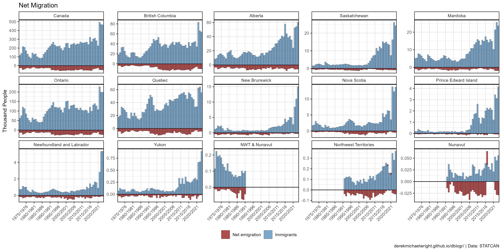
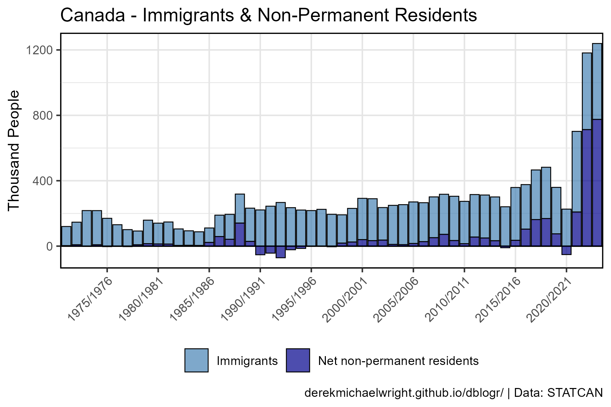
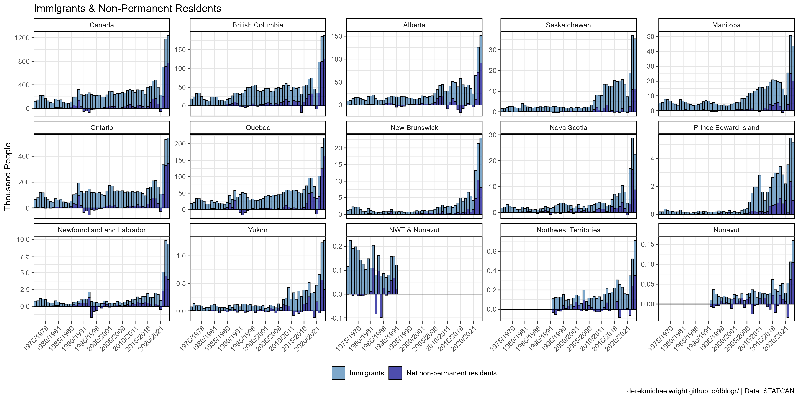
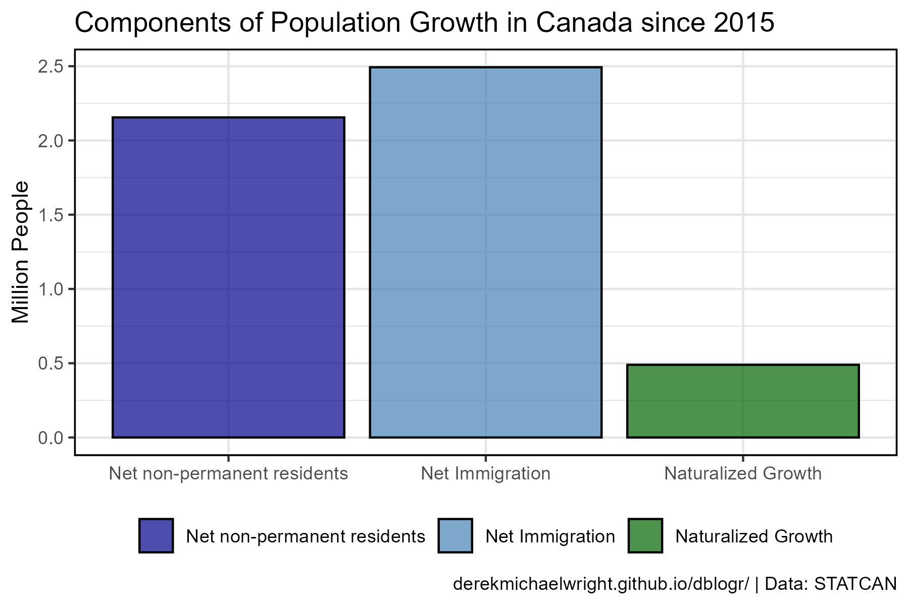
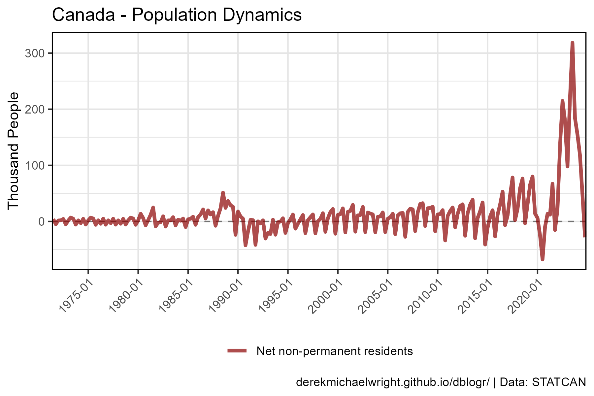
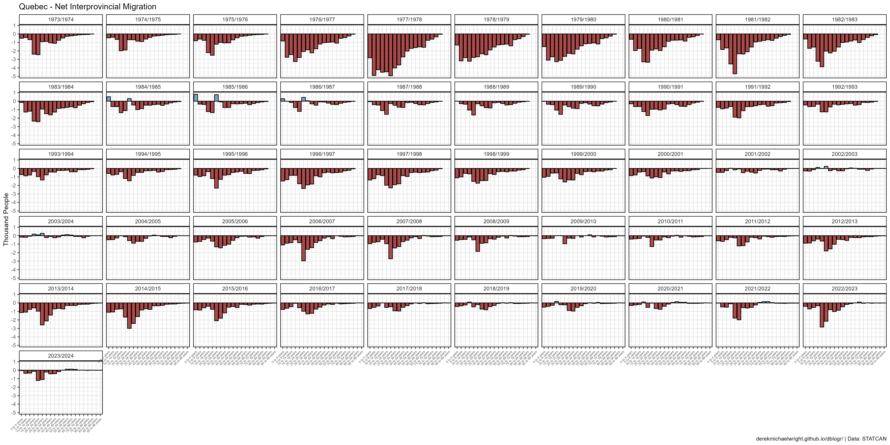
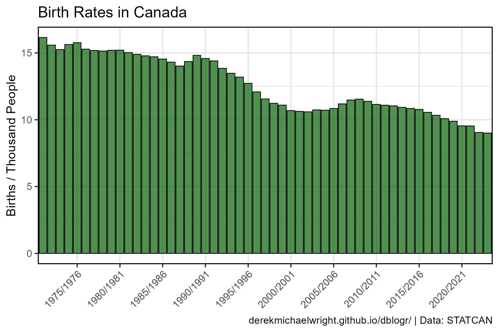
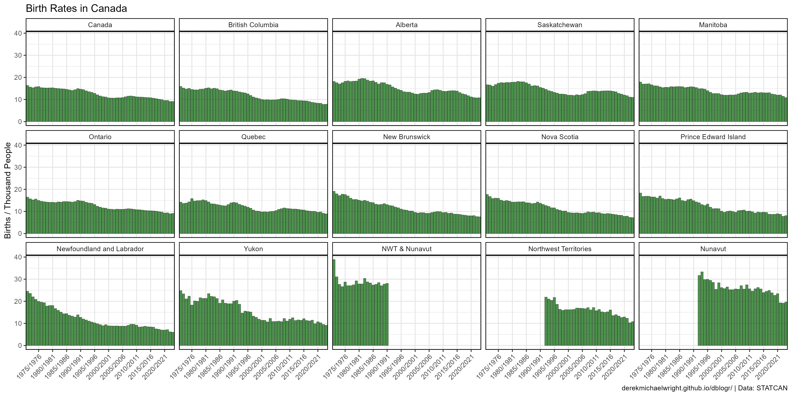
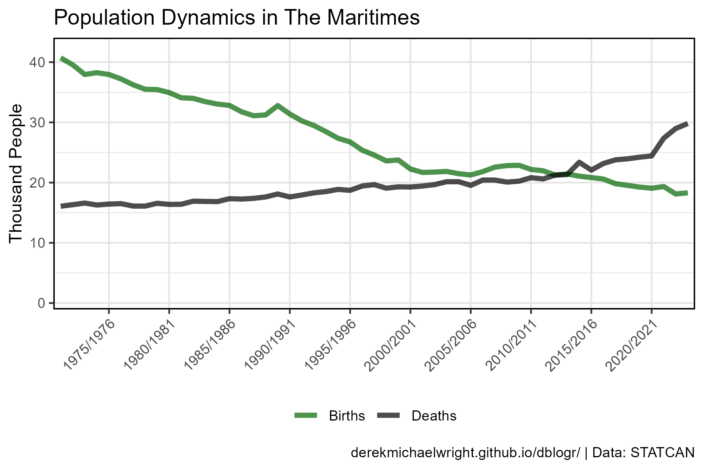
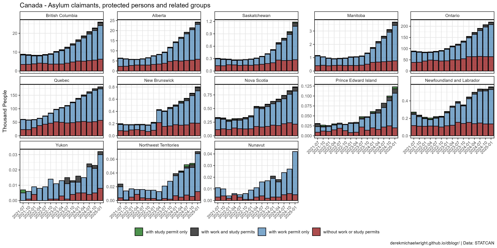

```{r setup, include=FALSE}
knitr::opts_chunk$set(echo = T, message = F, warning = F)
```

---

# Data

STATCAN Table: 17-10-0009-01 (Population)

> - `r shiny::icon("globe")` [https://www150.statcan.gc.ca/t1/tbl1/en/cv.action?pid=1710000901](https://www150.statcan.gc.ca/t1/tbl1/en/cv.action?pid=1710000901){target="_blank"}
> - `r shiny::icon("save")` [1710000901_databaseLoadingData.csv](1710000901_databaseLoadingData.csv)

STATCAN Table: 17-10-0008-01 (Demographic growth)

> - `r shiny::icon("globe")` [https://www150.statcan.gc.ca/t1/tbl1/en/cv.action?pid=1710000801](https://www150.statcan.gc.ca/t1/tbl1/en/cv.action?pid=1710000801){target="_blank"}
> - `r shiny::icon("save")` [1710000801_databaseLoadingData.csv](1710000801_databaseLoadingData.csv)

STATCAN Table: 17-10-0015-01 (Interprovincial migration)

> - `r shiny::icon("globe")` [https://www150.statcan.gc.ca/t1/tbl1/en/cv.action?pid=1710001501](https://www150.statcan.gc.ca/t1/tbl1/en/cv.action?pid=1710001501){target="_blank"}
> - `r shiny::icon("save")` [1710001501_databaseLoadingData.csv](1710001501_databaseLoadingData.csv)

STATCAN Table: 17-10-0121-01 (Non-permanent residents)

> - `r shiny::icon("globe")` [https://www150.statcan.gc.ca/t1/tbl1/en/cv.action?pid=1710012101](https://www150.statcan.gc.ca/t1/tbl1/en/cv.action?pid=1710012101){target="_blank"}
> - `r shiny::icon("save")` [1710012101_databaseLoadingData.csv](1710012101_databaseLoadingData.csv)

STATCAN Table: 98-10-0361-01 (Non-permanent resident type by place of birth)

> - `r shiny::icon("globe")` [https://www150.statcan.gc.ca/t1/tbl1/en/cv.action?pid=9810036101](https://www150.statcan.gc.ca/t1/tbl1/en/cv.action?pid=9810036101){target="_blank"}
> - `r shiny::icon("save")` [9810036101_databaseLoadingData.csv](9810036101_databaseLoadingData.csv)

STATCAN Table: 17-10-0154-01 (Interprovincial and intraprovincial migrants)

> - `r shiny::icon("globe")` [https://www150.statcan.gc.ca/t1/tbl1/en/cv.action?pid=1710015401](https://www150.statcan.gc.ca/t1/tbl1/en/cv.action?pid=1710015401){target="_blank"}
> - `r shiny::icon("save")` [1710015401_databaseLoadingData.csv](1710015401_databaseLoadingData.csv)

---

# Prepare Data

```{r class.source = "fold-show"}
# devtools::install_github("derekmichaelwright/agData")
library(agData)
library(gganimate)
```

```{r}
# Prep data
myCaption <- "www.dblogr.com/ or derekmichaelwright.github.io/dblogr/ | Data: STATCAN"
myMeasures <- c("Births", "Deaths", "Emigrants", "Immigrants", "Net non-permanent residents")
myColors <- c("darkgreen", "black", "darkred", "steelblue", "darkblue")
myAreas <- c("Canada", "British Columbia", "Alberta", "Saskatchewan", "Manitoba",
             "Ontario", "Quebec", "New Brunswick", "Nova Scotia",
             "Prince Edward Island", "Newfoundland and Labrador",
             "Yukon", "NWT & Nunavut", "Northwest Territories", "Nunavut")
myAges1 <- c("0 to 4 years", "5 to 9 years", 
             "10 to 14 years", "15 to 19 years",
             "20 to 24 years", "25 to 29 years", 
             "30 to 34 years", "35 to 39 years",
             "40 to 44 years", "45 to 49 years", 
             "50 to 54 years", "55 to 59 years",
             "60 to 64 years", "65 to 69 years", 
             "70 to 74 years", "75 to 79 years",
             "80 to 84 years", "85 to 89 years", 
             "90 to 94 years", "95 to 99 years",
             "100 years and over", "All ages")
myAges2 <- c("Total - Age", "0 to 14 years", "15 to 24 years",
             "25 to 64 years", "65 years and over")
myDates <- c("1975/1976","1980/1981","1985/1986","1990/1991","1995/1996",
             "2000/2001","2005/2006","2010/2011","2015/2016", "2020/2021")
#
mySexes1 <- c("Total - gender", "Men+", "Women+")
mySexes2 <- c("Both sexes", "Males", "Females")
#
d1 <- read.csv("1710000901_databaseLoadingData.csv") %>%
  select(Year=REF_DATE, Area=GEO, Unit=UOM, Value=VALUE) %>%
  mutate(Area = gsub("Northwest Territories including", "NWT &", Area),
         Area = factor(Area, levels = myAreas),
         Month = substr(Year, 6, 8),
         Year = substr(Year, 1,4),
         Year = as.numeric(Year),
         Month = as.numeric(Month),
         Date = as.Date(paste(Year, Month, "01", sep = "-")))
pp <- d1 %>% group_by(Area, Year) %>%
  summarise(Population = mean(Value, na.rm = T))
#
d2 <- read.csv("1710000801_databaseLoadingData.csv") %>%
  select(Date=REF_DATE, Area=GEO, Measurement=Components.of.population.growth, 
         Unit=UOM, Value=VALUE) %>%
  mutate(Area = gsub("Northwest Territories including", "NWT &", Area),
         Area = factor(Area, levels = myAreas),
         Year = as.numeric(substr(Date, 1,4)),
         Date = factor(Date))
#
d3 <- read.csv("1710001501_databaseLoadingData.csv") %>%
  select(Year=REF_DATE, Area=GEO, Sex=Gender, Age=Age.group, 
         Measurement=Migrants, UOM, Value=VALUE) %>%
  mutate(Area = gsub("Northwest Territories including", "NWT &", Area),
         Area = factor(Area, levels = myAreas),
         Age = factor(Age, levels = myAges1),
         Net = ifelse(Value > 0, "Positive", "Negative"),
         Sex = plyr::mapvalues(Sex, mySexes1, mySexes2))
#
d4 <- read.csv("1710012101_databaseLoadingData.csv") %>%
  select(Date=REF_DATE, Area=GEO, Type=Non.permanent.resident.types,
         UOM, Value=VALUE) %>%
  mutate(Area = gsub("Northwest Territories including", "NWT &", Area),
         Area = factor(Area, levels = myAreas),
         Date = factor(Date))
#
d5 <- read.csv("9810036101_databaseLoadingData.csv") %>%
  select(Year=REF_DATE, Area=GEO, Sex=Gender..3., Age=Age..15C., 
         Type=Non.permanent.resident.type..10.,
         POB=Place.of.birth..290., UOM, Value=VALUE) %>%
  mutate(Area = gsub("Northwest Territories including", "NWT &", Area),
         Age = factor(Age, levels = myAges2),
         Sex = plyr::mapvalues(Sex, mySexes1, mySexes2))
# 
d6 <- read.csv("1710015401_databaseLoadingData.csv")
```

---

# Births, Deaths & Migration {.tabset .tabset-pills}

## Canada


```{r}
# Prep data
xx <- d2 %>% 
  filter(Area == "Canada", Measurement %in% myMeasures) %>%
  mutate(Measurement = factor(Measurement, levels = myMeasures))
# Plot
mp <- ggplot(xx, aes(x = Date, y = Value / 1000)) +
  geom_line(aes(color = Measurement, group = Measurement), line.width = 1, alpha = 0.7) +
  geom_line(y = 0, lty = 2, alpha = 0.7, color = "black") +
  scale_color_manual(name = NULL, values = myColors) +
  scale_x_discrete(breaks = myDates) +
  theme_agData(legend.position = "bottom",
               axis.text.x = element_text(angle = 45, hjust = 1)) +
  labs(title = "Canada - Population Dynamics", x = NULL,
       y = "Thousand People", caption = myCaption)
ggsave("canada_migration_1_01.png", mp, width = 6, height = 4)
```

```{r echo = F}
ggsave("featured.png", mp, width = 6, height = 4)
```

---

## Provinces


```{r}
# Prep data
xx <- d2 %>% filter(Measurement %in% myMeasures)
# Plot
mp <- ggplot(xx, aes(x = Date, y = Value / 1000)) +
  geom_line(aes(color = Measurement, group = Measurement), line.width = 1, alpha = 0.7) +
  geom_line(y = 0, lty = 2, alpha = 0.7, color = "black") +
  facet_wrap(Area ~ ., ncol = 5, scales = "free_y") +
  scale_color_manual(name = NULL, values = myColors) +
  scale_x_discrete(breaks = myDates) +
  theme_agData(legend.position = "bottom",
               axis.text.x = element_text(angle = 45, hjust = 1)) +
  labs(title = "Population Dynamics", x = NULL,
       y = "Thousand People", caption = myCaption)
ggsave("canada_migration_1_02.png", mp, width = 14, height = 7)
```

---

# Immigrants vs Emigrants {.tabset .tabset-pills}

## Canada


```{r}
# Prep data
xx <- d2 %>% 
  filter(Area == "Canada", Measurement %in% c("Immigrants", "Emigrants")) %>%
  mutate(Value = ifelse(Measurement == "Emigrants", -Value, Value))
# Plot
mp <- ggplot(xx, aes(x = Date, y = Value / 1000, fill = Measurement)) +
  geom_hline(yintercept = 0) +
  geom_col(alpha = 0.7, color = "black", lwd = 0.3) +
  scale_fill_manual(name = NULL, values = myColors[3:4]) +
  scale_x_discrete(breaks = myDates) +
  theme_agData(legend.position = "bottom",
               axis.text.x = element_text(angle = 45, hjust = 1)) +
  labs(title = "Canada - Net Migration", x = NULL, 
       y = "Thousand People", caption = myCaption)
ggsave("canada_migration_1_03.png", mp, width = 6, height = 4)
```

---

## Provinces {.tabset .tabset-pills}

### All Data



```{r}
# Prep data
xx <- d2 %>% 
  filter(Measurement %in% c("Immigrants", "Emigrants")) %>%
  mutate(Value = ifelse(Measurement == "Emigrants", -Value, Value))
# Plot
mp <- ggplot(xx, aes(x = Date, y = Value / 1000, fill = Measurement)) +
  geom_hline(yintercept = 0) +
  geom_col(alpha = 0.7, color = "black", lwd = 0.1) +
  facet_wrap(Area ~ ., ncol = 5, scales = "free_y") +
  scale_fill_manual(name = NULL, values = myColors[3:4]) +
  scale_x_discrete(breaks = myDates) +
  theme_agData(legend.position = "bottom",
               axis.text.x = element_text(angle = 45, hjust = 1)) +
  labs(title = "Net Migration", x = NULL, 
       y = "Thousand People", caption = myCaption)
ggsave("canada_migration_1_04.png", mp, width = 14, height = 7)
```

---

### Net Migration


```{r}
# Prep data
xx <- d2 %>% 
  filter(Measurement %in% c("Immigrants", "Emigrants")) %>%
  spread(Measurement, Value) %>%
  mutate(Net = Immigrants - Emigrants,
         Group = ifelse(Net > 0, "Positive", "Negative"))
# Plot
mp <- ggplot(xx, aes(x = Date, y = Net / 1000, fill = Group)) +
  geom_hline(yintercept = 0) +
  geom_col(alpha = 0.7, color = "black", lwd = 0.1) +
  facet_wrap(Area ~ ., ncol = 5, scales = "free_y") +
  scale_fill_manual(name = NULL, values = myColors[3:4]) +
  scale_x_discrete(breaks = myDates) +
  theme_agData(legend.position = "none",
               axis.text.x = element_text(angle = 45, hjust = 1)) +
  labs(title = "Net Migration", x = NULL, 
       y = "Thousand People", caption = myCaption)
ggsave("canada_migration_1_05.png", mp, width = 14, height = 7)
```

---

## Prairies vs. Non-Prairies


```{r}
# Prep data
myC <- c("steelblue", "red", "darkorange", 
          "darkblue", "darkgreen", "darkred")
myA <- c("Quebec", "Ontario", "British Columbia", 
          "Alberta", "Saskatchewan", "Manitoba")
myW <- c("Non-Prairies", "Non-Prairies", "Non-Prairies", 
          "Prairies", "Prairies", "Prairies")
x1 <- d1 %>% 
  filter(Month == 1) %>%
  select(Area, Year, Population=Value)
x2 <- d2 %>% 
  filter(Measurement == "Immigrants") %>%
  select(Area, Year, Immigrants=Value)
xx <- left_join(x1, x2, by = c("Area", "Year")) %>%
  filter(Area %in% myA, !is.na(Immigrants)) %>%
  mutate(Value = 1000000 * Immigrants / Population,
         Area = factor(Area, levels = myA),
         Wing = plyr::mapvalues(Area, myA, myW))
# Plot
mp <- ggplot(xx, aes(x = Year, y = Value, color = Area)) +
  geom_line(alpha = 0.2) + 
  geom_smooth(se = F) +
  facet_grid(. ~ Wing) +
  scale_x_continuous(breaks = seq(1975, 2015, 10)) +
  scale_color_manual(name = NULL, values = myC) +
  theme_agData() +
  labs(title = "Immigration Rates", x = NULL,
       y = "Immigrants / Million People", caption = myCaption)
ggsave("canada_migration_1_06.png", mp, width = 8, height = 4)
```

---

# Immigrants & Non-Permanent Residents {.tabset .tabset-pills}

## Canada



```{r}
# Prep data
xx <- d2 %>% 
  filter(Area == "Canada", 
         Measurement %in% c("Immigrants", "Net non-permanent residents"))
# Plot
mp <- ggplot(xx, aes(x = Date, y = Value / 1000, fill = Measurement)) +
  geom_hline(yintercept = 0, line.width = 0.5) +
  geom_col(color = "black", alpha = 0.7, lwd = 0.3) +
  scale_fill_manual(name = NULL, values = c("darkred", "steelblue")) +
  scale_x_discrete(breaks = myDates) +
  theme_agData(legend.position = "bottom",
               axis.text.x = element_text(angle = 45, hjust = 1)) +
  labs(title = "Canada - Immigrants & Non-Permanent Residents", 
       y = "Thousand People", x = NULL, caption = myCaption)
ggsave("canada_migration_1_07.png", mp, width = 6, height = 4)
```

---

## Provinces



```{r}
# Prep data
xx <- d2 %>% 
  filter(Measurement %in% c("Immigrants", "Net non-permanent residents"))
# Plot
mp <- ggplot(xx, aes(x = Date, y = Value / 1000, fill = Measurement)) +
  geom_hline(yintercept = 0, line.width = 0.5) +
  geom_col(color = "black", alpha = 0.7, lwd = 0.3) +
  facet_wrap(Area ~ ., scales = "free_y", ncol = 5) +
  scale_fill_manual(name = NULL, values = c("darkred", "steelblue")) +
  scale_x_discrete(breaks = myDates) +
  theme_agData(legend.position = "bottom",
               axis.text.x = element_text(angle = 45, hjust = 1)) +
  labs(title = "Immigrants & Non-Permanent Residents",
       y = "Thousand People", x = NULL, caption = myCaption)
ggsave("canada_migration_1_08.png", mp, width = 14, height = 7)
```

```{r eval = F, echo = F}
## Inflow vs outflows

#
# Prep data
myM <- c("Non-permanent residents, outflows", 
         "Non-permanent residents, inflows")
xx <- d2 %>% 
  filter(Measurement %in% myM, !is.na(Value)) %>%
  mutate(Year = factor(Year))
# Plot
mp <- ggplot(xx, aes(x = Date, y = Value / 1000, fill = Measurement)) +
  geom_col(position = "dodge", color = "black", alpha = 0.7) +
  facet_wrap(Area ~ ., scales = "free_y", ncol = 5) +
  scale_fill_manual(name = NULL, values = c("steelblue", "darkred")) +
  scale_x_discrete(breaks = myDates) +
  theme_agData(legend.position = "bottom",
               axis.text.x = element_text(angle = 45, hjust = 1)) +
  labs(y = "Thousand People", x = NULL, caption = myCaption)
ggsave("canada_migration_1_08.png", mp, width = 12, height = 6)
```

---

# Net Interprovincial Migration {.tabset .tabset-pills}

## Canada


```{r}
# Prep data
xx <- d2 %>% 
  filter(Measurement == "Net interprovincial migration") %>%
  mutate(Group = ifelse(Value > 0, "Positive", "Negative"))
# Plot
mp <- ggplot(xx, aes(x = Date, y = Value / 1000, fill = Group)) +
  geom_hline(yintercept = 0) +
  geom_col(alpha = 0.7, color = "black", lwd = 0.2) +
  facet_wrap(Area ~ ., ncol = 5, scales = "free_y") +
  scale_fill_manual(name = NULL, values = c("darkred", "steelblue")) +
  scale_x_discrete(breaks = myDates) +
  theme_agData(legend.position = "none",
               axis.text.x = element_text(angle = 45, hjust = 1)) +
  labs(title = "Net Interprovincial Migration", x = NULL,
       y = "Thousand People", caption = myCaption)
ggsave("canada_migration_1_09.png", mp, width = 14, height = 7)
```

---

## Alberta vs BC



```{r}
# Prep data
xx <- d2 %>% 
  filter(Area %in% c("Alberta", "British Columbia"),
         Measurement == "Net interprovincial migration")
# Plot
mp <- ggplot(xx, aes(x = Date, y = Value / 1000, color = Area, group = Area)) +
  geom_hline(yintercept = 0) +
  geom_line(alpha = 0.7, size = 1.5) +
  scale_color_manual(name = NULL, values = c("darkorange", "darkblue")) +
  scale_x_discrete(breaks = myDates) +
  theme_agData(legend.position = "bottom",
               axis.text.x = element_text(angle = 45, hjust = 1)) +
  labs(title = "Net Interprovincial Migration", x = NULL,
       y = "Thousand People", caption = myCaption)
ggsave("canada_migration_1_10.png", mp, width = 6, height = 4)
```

---

# Interprovincial Migration By Age {.tabset .tabset-pills}

## Gifs {.tabset .tabset-pills}

### Plotting Function

```{r}
# Create plotting function
ggInterProv_ani <- function(myArea) {
  #Prep data
  xx <- d3 %>% 
    filter(Area == myArea, Measurement == "Net-migration",
           Sex == "Both sexes", Age != "All ages", !is.na(Value)) %>%
    mutate(YearNum = as.numeric(substr(Year,1,4)))
  # Plot
  ggplot(xx, aes(x = Age, y = Value / 1000, fill = Net)) +
    geom_col(color = "black", alpha = 0.7) +
    scale_fill_manual(values = c("darkred", "steelblue")) +
    theme_agData(legend.position = "none",
                 axis.text.x = element_text(angle = 45, hjust = 1, size = 5)) +
    labs(title = paste(myArea, "- {round(frame_time)}"), 
         subtitle = "Net Interprovincial Migration", 
         y = "Thousand People", x = NULL, caption = myCaption) +
    transition_time(YearNum)
}
```

---

### British Columbia


```{r}
mp <- ggInterProv_ani("British Columbia")
anim_save("canada_migration_gif_01.gif", mp, 
          nframes = 300, fps = 10, end_pause = 10, 
          width = 600, height = 400, res = 80, units = "px")
```

---

### Alberta


```{r}
mp <- ggInterProv_ani("Alberta")
anim_save("canada_migration_gif_02.gif", mp, 
          nframes = 300, fps = 10, end_pause = 10, 
          width = 600, height = 400, res = 80, units = "px")
```

---

### Saskatchewan


```{r}
mp <- ggInterProv_ani(myArea = "Saskatchewan")
anim_save("canada_migration_gif_03.gif", mp, 
          nframes = 300, fps = 10, end_pause = 10, 
          width = 600, height = 400, res = 80, units = "px")
```

---

### Manitoba


```{r}
mp <- ggInterProv_ani("Manitoba")
anim_save("canada_migration_gif_04.gif", mp, 
          nframes = 300, fps = 10, end_pause = 10, 
          width = 600, height = 400, res = 80, units = "px")
```

---

### Ontario


```{r}
mp <- ggInterProv_ani("Ontario")
anim_save("canada_migration_gif_05.gif", mp, 
          nframes = 300, fps = 10, end_pause = 10, 
          width = 600, height = 400, res = 80, units = "px")
```

---

### Quebec


```{r}
mp <- ggInterProv_ani("Quebec")
anim_save("canada_migration_gif_06.gif", mp, 
          nframes = 300, fps = 10, end_pause = 10, 
          width = 600, height = 400, res = 80, units = "px")
```

---

## Facetted {.tabset .tabset-pills}

### Plotting Function

```{r}
# Create plotting function
ggInterProv <- function(myArea) {
  #Prep data
  xx <- d3 %>% 
    filter(Area == myArea, !Year %in% c("1971/1972","1972/1973"),
           Sex == "Both sexes", Age != "All ages",
           Measurement == "Net-migration")
  # Plot
  ggplot(xx, aes(x = Age, y = Value / 1000, fill = Net)) +
    geom_col(color = "black", alpha = 0.7) +
    facet_wrap(. ~ Year, ncol = 10) +
    scale_fill_manual(values = c("darkred", "steelblue")) +
    theme_agData(legend.position = "none",
                 axis.text.x = element_text(angle = 45, hjust = 1, size = 5)) +
    labs(title = paste(myArea, "- Net Interprovincial Migration"), x = NULL,
         y = "Thousand People", caption = myCaption)
}
```

---

### British Columbia


```{r}
# Plot
mp <- ggInterProv(myArea = "British Columbia")
ggsave("canada_migration_2_01.png", mp, width = 20, height = 10)
```

---

### Alberta


```{r}
# Plot
mp <- ggInterProv(myArea = "Alberta")
ggsave("canada_migration_2_02.png", mp, width = 20, height = 10)
```

---

### Saskatchewan



```{r}
# Plot
mp <- ggInterProv(myArea = "Saskatchewan")
ggsave("canada_migration_2_03.png", mp, width = 20, height = 10)
```

---

### Manitoba


```{r}
# Plot
mp <- ggInterProv(myArea = "Manitoba")
ggsave("canada_migration_2_04.png", mp, width = 20, height = 10)
```

---

### Ontario


```{r}
# Plot
mp <- ggInterProv(myArea = "Ontario")
ggsave("canada_migration_2_04.png", mp, width = 20, height = 10)
```

---

### Quebec


```{r}
# Plot
mp <- ggInterProv(myArea = "Quebec")
ggsave("canada_migration_2_05.png", mp, width = 20, height = 10)
```

---

### Alberta 2011 - 2023


```{r}
# Prep data
myYears <- paste0(2011:2022,"/",2012:2023)
xx <- d3 %>% 
  filter(Area == "Alberta", Year %in% myYears,
         Sex == "Both sexes", Age != "All ages",
         Measurement == "Net-migration")
# Plot
mp <- ggplot(xx, aes(x = Age, y = Value, fill = Net)) +
  geom_col(color = "black", alpha = 0.7) +
  facet_wrap(. ~ Year, ncol = 6) +
  scale_fill_manual(values = c("darkred", "steelblue")) +
  theme_agData(legend.position = "none",
               axis.text.x = element_text(angle = 45, hjust = 1)) +
  labs(title = "Alberta Net Interprovincial Migration", 
       y = "Thousand People", x = NULL, caption = myCaption)
ggsave("canada_migration_2_06.png", mp, width = 14, height = 6)
```

---

### Alberta 2020 - 2023


```{r}
# Prep data
xx <- d3 %>% 
  filter(Area == "Alberta", Sex == "Both sexes", Age != "All ages",
         Year %in% c("2020/2021", "2021/2022", "2022/2023"),
         Measurement == "Net-migration")
# Plot
mp <- ggplot(xx, aes(x = Age, y = Value, fill = Net)) +
  geom_col(color = "black", alpha = 0.7) +
  facet_grid(. ~ Year) +
  scale_fill_manual(values = myColors[3:4]) +
  theme_agData(legend.position = "none",
               axis.text.x = element_text(angle = 45, hjust = 1)) +
  labs(title = "Alberta Net Interprovincial Migration", 
       y = "Thousand People", x = NULL, caption = myCaption)
ggsave("canada_migration_2_07.png", mp, width = 10, height = 4)
```

---

### British Columbia 2021 - 2023


```{r}
# Prep data
xx <- d3 %>% 
  filter(Area == "Ontario", Sex == "Both sexes", Age != "All ages",
         Year %in% c("2021/2022", "2022/2023"),
         Measurement == "Net-migration")
# Plot
mp <- ggplot(xx, aes(x = Age, y = Value, fill = Net)) +
  geom_col(color = "black", alpha = 0.7) +
  facet_grid(. ~ Year) +
  scale_fill_manual(values = myColors[3:4]) +
  theme_agData(legend.position = "none",
               axis.text.x = element_text(angle = 45, hjust = 1)) +
  labs(title = "British Columbia Net Interprovincial Migration", x = NULL,
       y = "Thousand People", caption = myCaption)
ggsave("canada_migration_2_08.png", mp, width = 8, height = 4)
```

---

# Birth Rates {.tabset .tabset-pills}

## Canada


```{r}
# Prep data
xx <- d2 %>% filter(Measurement == "Births") %>%
  left_join(pp, by = c("Area","Year")) %>%
  mutate(BirthRate = 1000 * Value / Population)
# Plot
mp <- ggplot(xx %>% filter(Area == "Canada"), aes(Date, y = BirthRate)) +
  geom_col(color = "black", fill = "darkgreen", alpha = 0.7, lwd = 0.3) +
  scale_x_discrete(breaks = myDates) +
  theme_agData(legend.position = "bottom",
               axis.text.x = element_text(angle = 45, hjust = 1)) +
  theme_agData() +
  labs(title = "Birth Rates in Canada", x = NULL,
       y = "Births / Thousand People", caption = myCaption)
ggsave("canada_migration_3_01.png", mp, width = 6, height = 4)
```

---

## Birth Rates {.tabset .tabset-pills}

### Canada


```{r}
# Prep data
x1 <- d2 %>% filter(Measurement == "Births") %>%
  select(Year, Date, Area, Births=Value)
x2 <- d1 %>% filter(Month == 1) %>%
  select(Year, Area, Population=Value)
xx <- left_join(x1, x2, by = c("Year", "Area")) %>%
  mutate(BirthRate = Births / Population)
# Plot
mp <- ggplot(xx, aes(x = Date, y = BirthRate * 1000)) + 
  geom_col(color = "black", fill = "darkgreen", alpha = 0.7, lwd = 0.1) + 
  facet_wrap(Area ~ ., ncol = 5) +
  scale_x_discrete(breaks = myDates) +
  theme_agData(legend.position = "bottom",
               axis.text.x = element_text(angle = 45, hjust = 1)) +
  labs(title = "Birth Rates in Canada", x = NULL,
       y = "Births / Thousand People", caption = myCaption)
ggsave("canada_migration_3_02.png", mp, width = 14, height = 7)
```

---

### Saskatchewan


```{r}
# Prep data
xx <- d2 %>% 
  filter(Area == "Saskatchewan", Measurement %in% c("Births","Deaths"))
# Plot
mp <- ggplot(xx, aes(x = Date, y = Value / 1000, 
                     color = Measurement, group = Measurement)) + 
  geom_line(line.width = 1.5, alpha = 0.7, size = 1.5) + 
  scale_color_manual(name = NULL, values = myColors) +
  scale_y_continuous(minor_breaks = 0:20, limits = c(0.5,18.5)) +
  scale_x_discrete(breaks = myDates) +
  theme_agData(legend.position = "bottom",
               axis.text.x = element_text(angle = 45, hjust = 1)) +
  labs(title = "Population Dynamics in Saskatchewan", 
       y = "Thousand People", x = NULL, caption = myCaption)
ggsave("canada_migration_3_03.png", mp, width = 6, height = 4)
```

---

### British Columbia


```{r}
# Prep data
xx <- d2 %>% 
  filter(Area == "British Columbia", Measurement %in% c("Births","Deaths"))
# Plot
mp <- ggplot(xx, aes(x = Date, y = Value / 1000, 
                     color = Measurement, group = Measurement)) + 
  geom_line(line.width = 1.5, alpha = 0.7, size = 1.5) + 
  scale_color_manual(name = NULL, values = myColors) +
  scale_y_continuous(limits = c(1,48)) +
  scale_x_discrete(breaks = myDates) +
  theme_agData(legend.position = "bottom",
               axis.text.x = element_text(angle = 45, hjust = 1)) +
  labs(title = "Population Dynamics in The Maritimes", 
       y = "Thousand People", x = NULL, caption = myCaption)
ggsave("canada_migration_3_04.png", mp, width = 6, height = 4)
```

---

### Maritimes



```{r}
# Prep data
xx <- d2 %>% 
  filter(Measurement %in% c("Births","Deaths"),
         Area %in% c("Prince Edward Island", "Nova Scotia", "New Brunswick",
                     "Newfoundland and Labrador")) %>% 
  group_by(Date, Measurement) %>%
  summarise(Value = sum(Value))
# Plot
mp <- ggplot(xx, aes(x = Date, y = Value / 1000, 
                     color = Measurement, group = Measurement)) + 
  geom_line(line.width = 1.5, alpha = 0.7, size = 1.5) + 
  scale_color_manual(name = NULL, values = myColors) +
  scale_y_continuous(limits = c(1,42)) +
  scale_x_discrete(breaks = myDates) +
  theme_agData(legend.position = "bottom",
               axis.text.x = element_text(angle = 45, hjust = 1)) +
  labs(title = "Population Dynamics in The Maritimes", 
       y = "Thousand People", x = NULL, caption = myCaption)
ggsave("canada_migration_3_05.png", mp, width = 6, height = 4)
```

---

# Non-permentant Residents {.tabset .tabset-pills}

## Canada



```{r}
# Prep Data
myTypes <- c("Total, asylum claimants, protected persons and related groups",
             "Total, permit holders and their family members")
xx <- d4 %>% 
  filter(Area == "Canada", Type %in% myTypes)
# Plot
mp <- ggplot(xx, aes(x = Date, y = Value / 1000000, fill = Type)) +
  geom_col(color = "black", alpha = 0.7) +
  scale_fill_manual(name = NULL, values = c("darkred", "steelblue")) +
  theme_agData(legend.position = "bottom",
               axis.text.x = element_text(angle = 45, hjust = 1)) +
  guides(fill = guide_legend(ncol = 1)) +
  labs(title = "Canada", subtitle = "Total, non-permanent residents", 
       y = "Million People", x = NULL, caption = myCaption)
ggsave("canada_migration_4_01.png", mp, width = 6, height = 4)
```

---

## Provinces



```{r}
# Prep Data
myTypes <- c("Total, asylum claimants, protected persons and related groups",
             "Total, permit holders and their family members")
xx <- d4 %>% filter(Type %in% myTypes)
# Plot
mp <- ggplot(xx, aes(x = Date, y = Value / 1000, fill = Type)) +
  geom_col(color = "black", alpha = 0.7) +
  facet_wrap(Area ~ ., ncol = 5, scales = "free_y") +
  scale_fill_manual(name = NULL, values = c("darkred", "steelblue")) +
  theme_agData(legend.position = "bottom",
               axis.text.x = element_text(angle = 45, hjust = 1)) +
  labs(title = "Canada", subtitle = "Total, non-permanent residents", 
       x = NULL, y = "Thousand People", caption = myCaption)
ggsave("canada_migration_4_02.png", mp, width = 14, height = 7)
```

---

## Permit Holders {.tabset .tabset-pills}

### Canada


```{r}
# Prep Data
myTypes <- c("Work permit holders only", "Study permit holders only",
             "Work and study permit holders", "Other")
xx <- d4 %>% 
  filter(Area == "Canada", Type %in% myTypes)
# Plot
mp <- ggplot(xx, aes(x = Date, y = Value / 1000, fill = Type)) +
  geom_col(color = "black", alpha = 0.7) +
  scale_fill_manual(name = NULL, values = myColors[c(3,1,2,4)]) +
  theme_agData(legend.position = "bottom",
               axis.text.x = element_text(angle = 45, hjust = 1)) +
  guides(fill = guide_legend(ncol = 2)) +
  labs(title = "Total, permit holders and their family members", 
       y = "Thousand People", x = NULL, caption = myCaption)
ggsave("canada_migration_4_03.png", mp, width = 6, height = 5)
```

---

### Provinces


```{r}
# Prep Data
myTypes <- c("Work permit holders only", "Study permit holders only",
             "Work and study permit holders", "Other")
xx <- d4 %>% 
  filter(Area != "Canada", Type %in% myTypes)
# Plot
mp <- ggplot(xx, aes(x = Date, y = Value / 1000, fill = Type)) +
  geom_col(color = "black", alpha = 0.7) +
  facet_wrap(Area ~ ., ncol = 5, scales = "free_y") +
  scale_fill_manual(name = NULL, values = myColors[c(3,1,2,4)]) +
  theme_agData(legend.position = "bottom",
               axis.text.x = element_text(angle = 45, hjust = 1)) +
  labs(title = "Total, asylum claimants", x = NULL,
       y = "Thousand People", caption = myCaption)
ggsave("canada_migration_4_04.png", mp, width = 14, height = 7)
```

---

## Assylum Seekers {.tabset .tabset-pills}

### Canada



```{r}
# Prep Data
myTypes <- c("Asylum claimants, protected persons and related groups with work permit only",
             "Asylum claimants, protected persons and related groups with study permit only",
             "Asylum claimants, protected persons and related groups with work and study permits",
             "Asylum claimants, protected persons and related groups without work or study permits")
xx <- d4 %>% 
  filter(Area == "Canada", Type %in% myTypes) %>%
  mutate(Type = gsub("Asylum claimants, protected persons and related groups ", "", Type))
# Plot
mp <- ggplot(xx, aes(x = Date, y = Value / 1000, fill = Type)) +
  geom_col(color = "black", alpha = 0.7) +
  scale_fill_manual(name = NULL, values = myColors[c(1,2,4,3)]) +
  theme_agData(legend.position = "bottom",
               axis.text.x = element_text(angle = 45, hjust = 1)) +
  guides(fill = guide_legend(ncol = 2)) +
  labs(title = "Asylum claimants, protected persons and related groups", x = NULL,
       y = "Thousand People", caption = myCaption)
ggsave("canada_migration_4_05.png", mp, width = 6, height = 5)
```

---

### Provinces



```{r}
# Prep Data
myTypes <- c("Asylum claimants, protected persons and related groups with work permit only",
             "Asylum claimants, protected persons and related groups with study permit only",
             "Asylum claimants, protected persons and related groups with work and study permits",
             "Asylum claimants, protected persons and related groups without work or study permits")
xx <- d4 %>% 
  filter(Area != "Canada", Type %in% myTypes) %>%
  mutate(Type = gsub("Asylum claimants, protected persons and related groups ", "", Type))
# Plot
mp <- ggplot(xx, aes(x = Date, y = Value / 1000, fill = Type)) +
  geom_col(color = "black", alpha = 0.7) +
  facet_wrap(Area ~ ., ncol = 5, scales = "free_y") +
  scale_fill_manual(name = NULL, values = myColors[c(1,2,4,3)]) +
  theme_agData(legend.position = "bottom",
               axis.text.x = element_text(angle = 45, hjust = 1)) +
  labs(title = "Total, asylum claimants", x = NULL,
       y = "Thousand People", caption = myCaption)
ggsave("canada_migration_4_06.png", mp, width = 14, height = 7)
```

---

```{r eval = F, echo = F}
# Prep data
xx <- d5 %>% 
  filter(Area == "Canada", Type == "Total - Non-permanent resident type",
         POB == "Total – Place of birth", Sex != "Total - Gender")
# Plot
mp <- ggplot(xx, aes(x = Sex, y = Value / 1000, fill = Sex)) +
  geom_col(alpha = 0.7) +
  facet_wrap(Age ~ .) +
  scale_fill_manual(name = NULL, values = myColors[]) +
  theme_agData(legend.position = "bottom",
               axis.text.x = element_text(angle = 45, hjust = 1)) +
  labs(y = "Thousand People", caption = myCaption)
mp
ggsave("canada_migration_5_01.png", mp, width = 6, height = 4)
#
xx <- d5 %>% 
  filter(Area == "Canada", Type == "Total - Non-permanent resident type",
         POB != "Total – Place of birth", Sex != "Total - Gender", Age != "Total - Age")
# Plot
mp <- ggplot(xx, aes(x = Age, y = Value / 1000, fill = Sex)) +
  geom_col(alpha = 0.7, position = "dodge") +
  facet_wrap(POB ~ ., nrow = 1) +
  scale_fill_manual(name = NULL, values = myColors[]) +
  theme_agData(legend.position = "bottom",
               axis.text.x = element_text(angle = 45, hjust = 1)) +
  labs(y = "Thousand People", caption = myCaption)
mp
ggsave("canada_migration_5_01.png", mp, width = 12, height = 4)
unique(d5$POB)
```
