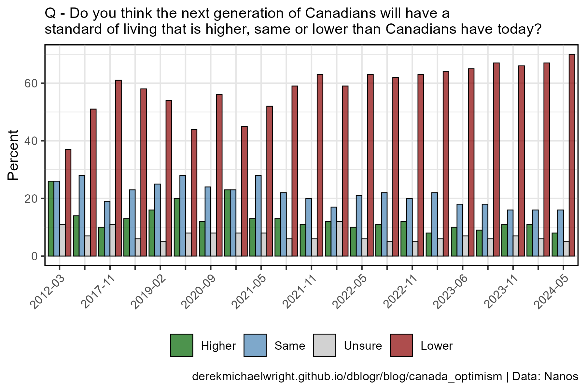
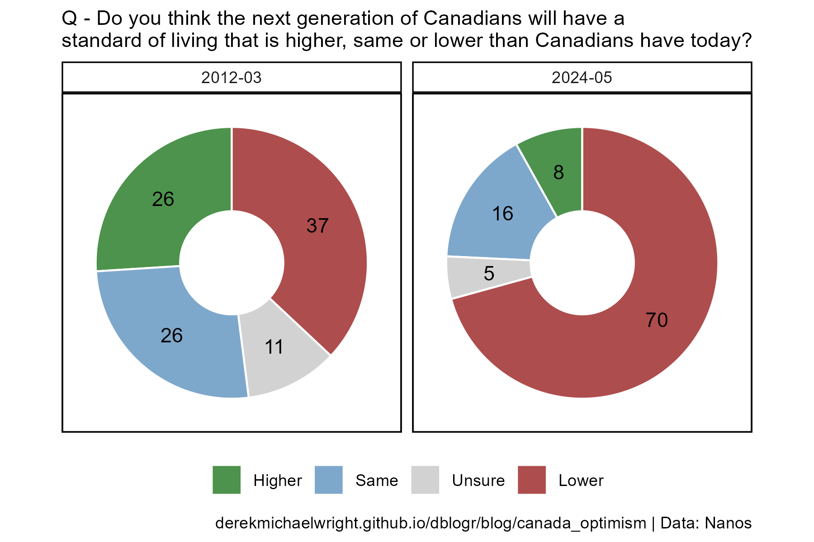

```{r setup, include=FALSE}
knitr::opts_chunk$set(echo = TRUE, message = F, warning = F)
```

---

# Data

> - `r shiny::icon("globe")` [https://nanos.co/feelings-of-optimism-toward-the-federal-government-are-declining-though-they-remain-higher-than-they-were-prior-to-july-2025-nanos/](https://nanos.co/feelings-of-optimism-toward-the-federal-government-are-declining-though-they-remain-higher-than-they-were-prior-to-july-2025-nanos/){target="_blank"}
> - `r shiny::icon("save")` [data_.csv](data_.csv)

---

# Prepare Data

```{r class.source = 'fold-show'}
# devtools::install_github("derekmichaelwright/agData")
library(agData)
```

```{r}
# Prep data
myCaption <- "derekmichaelwright.github.io/dblogr/blog/canada_optimism | Data: Nanos"
myTitle <- "Q - Do you think the next generation of Canadians will have a\nstandard of living that is higher, same or lower than Canadians have today?"
myChoices <- c("Higher", "Same", "Unsure", "Lower")
myColors <- c("darkgreen", "steelblue", "grey", "darkred")
#
dd <- read.csv("data_canada_optimism.csv") %>%
  mutate(Date = as.factor(substr(Date, 1, 7)),
         Label = as.factor(substr(Label, 1, 7)))
```

---

# Nanos Poll {.tabset .tabset-pills}

## Stacked


```{r}
# Prep data
xx <- dd %>%
  gather(Choice, Percent, 3:6) %>%
  mutate(Choice = factor(Choice, levels = myChoices))
# Plot
mp <- ggplot(xx, aes(x = Date, y = Percent, fill = Choice)) + 
  geom_col(color = "black", alpha = 0.7) +
  scale_fill_manual(name = NULL, values = myColors) +
  scale_x_discrete(breaks = dd$Date, labels = dd$Label) +
  theme_agData_col(axis.text.x = element_text(angle = 45, hjust = 1)) +
  labs(subtitle = myTitle, x = NULL, caption = myCaption)
ggsave("canada_optimism_01.png", mp, width = 6, height = 4)
```

```{r echo = F}
ggsave("featured.png", mp, width = 6, height = 4)
```

---

## Dodged



```{r}
# Prep data
xx <- dd %>%
  gather(Choice, Percent, 3:6) %>%
  mutate(Date = factor(Date),
         Choice = factor(Choice, levels = myChoices))
# Plot
mp <- ggplot(xx, aes(x = Date, y = Percent, fill = Choice)) + 
  geom_col(position = "dodge", color = "black", alpha = 0.7, lwd = 0.3) +
  scale_fill_manual(name = NULL, values = myColors) +
  scale_x_discrete(breaks = dd$Date, labels = dd$Label) +
  theme_agData(legend.position = "bottom",
               axis.text.x = element_text(angle = 45, hjust = 1)) +
  labs(subtitle = myTitle, x = NULL, caption = myCaption)
ggsave("canada_optimism_02.png", mp, width = 6, height = 4)
```

---

## Pie



```{r}
# Prep data
xx <- dd %>%
  filter(Date %in% c("2012-03","2024-05")) %>%
  gather(Choice, Percent, 3:6) %>%
  mutate(Choice = factor(Choice, levels = myChoices))
# Plot
mp <- ggplot(xx, aes(x = "x", y = Percent, fill = Choice)) + 
  geom_col(color = "white", alpha = 0.7) +
  geom_text(aes(label = Percent), position = position_stack(vjust = 0.5)) +
  coord_polar("y", start = 0) +
  facet_wrap(. ~ Date, scales = "free_y") +
  scale_fill_manual(name = NULL, values = myColors) +
  scale_x_discrete(limits = c("x_empty", "x")) +
  theme_agData_pie(legend.position = "bottom") +
  labs(subtitle = myTitle, x = NULL, caption = myCaption)
ggsave("canada_optimism_03.png", mp, width = 6, height = 4)
```

---

## Net


```{r}
# Prep data
xx <- dd %>% mutate(Net = Higher - Lower)
# Plot
mp <- ggplot(xx, aes(x = Date, y = Net)) + 
  geom_col(color = "black", fill = "darkred", alpha = 0.7) +
  geom_text(aes(label = Net), color = "white", vjust = -0.7, size = 3) +
  scale_x_discrete(breaks = dd$Date, labels = dd$Label) +
  theme_agData_col(axis.text.x = element_text(angle = 45, hjust = 1)) +
  labs(subtitle = myTitle, x = NULL, caption = myCaption)
ggsave("canada_optimism_04.png", mp, width = 6, height = 4)
```

---
