```{r setup, include=FALSE}
knitr::opts_chunk$set(echo = T, message = F, warning = F)
```

---

# Data

Health Canada Data

> - `r shiny::icon("globe")` [https://health-infobase.canada.ca/](https://health-infobase.canada.ca/substance-related-harms/opioids-stimulants/){target="_blank"}

BC Coroners Service

> - `r shiny::icon("globe")` [https://www2.gov.bc.ca/gov/](https://www2.gov.bc.ca/gov/content/life-events/death/coroners-service/statistical-reports){target="_blank"}

Alberta Health Services

> - `r shiny::icon("globe")` [https://healthanalytics.alberta.ca/](https://healthanalytics.alberta.ca/SASVisualAnalytics/?reportUri=%2Freports%2Freports%2F1bbb695d-14b1-4346-b66e-d401a40f53e6&sectionIndex=0&sso_guest=true&reportViewOnly=true&reportContextBar=false&sas-welcome=false){target="_blank"}

SK Coroners Service

> - `r shiny::icon("globe")` [https://publications.saskatchewan.ca/](https://publications.saskatchewan.ca/#/categories/2179){target="_blank"}

All Data

> - `r shiny::icon("save")` [data_canada_overdoses.xlsx](data_canada_overdoses.xlsx){target="_blank"}
> - `r shiny::icon("save")` [SubstanceHarmsData.csv](SubstanceHarmsData.csv){target="_blank"}

```{r echo = F, eval = F}
# https://health-infobase.canada.ca/src/doc/SRHD/Update_Deaths_2023-06.pdf
# https://www2.gov.bc.ca/assets/gov/birth-adoption-death-marriage-and-divorce/deaths/coroners-service/statistical/illicit-drug.pdf
#
ca1 <- read_xlsx("data_canada_overdoses.xlsx", "Canada") %>%
  mutate(Area = factor(Area, levels = agData_STATCAN_Region_Table$Area))
#
xx <- read.csv("SubstanceHarmsData.csv") %>%
  filter(Time_Period == "By quarter", Specific_Measure == "Overall numbers",
         Source == "Deaths") %>% #Region == "Canada", 
  mutate(Value = as.numeric(Value))
mp <- ggplot(xx, aes(x = Year_Quarter, y = Value, fill = Substance)) +
  geom_col() +
  facet_wrap(. ~ Region, scales = "free_y") +
  theme_agData(axis.text.x = element_text(angle = 45, hjust = 1))
ggsave("canada_overdoses_02b.png", mp, width = 10, height = 6)
```

---

# Prepare Data

```{r class.source = "fold-show"}
# devtools::install_github("derekmichaelwright/agData")
library(agData)
library(readxl)
library(gganimate)
```

```{r}
#
# Prep CA data
#
myCaptionCA <- "derekmichaelwright.github.io/dblogr/ | Data: CA GOV"
myColorsMF <- c("palevioletred3", "steelblue")
ca1 <- read.csv("SubstanceHarmsData.csv") %>%
  filter(Source == "Deaths") %>% 
  mutate(Value = as.numeric(Value)) %>%
  filter(!is.na(Value))
#
# Prep BC data
#
myCaptionBC <- "derekmichaelwright.github.io/dblogr/ | Data: BC GOV"
#
bc1 <- read_xlsx("data_canada_overdoses.xlsx", "BC Annual")
#
bc2 <- read_xlsx("data_canada_overdoses.xlsx", "BC Monthly") %>%
  gather(Year, Deaths, 2:12) %>%
  mutate(Date = as.Date(paste(Year, Month, "15", sep = "-"), 
                        format = "%Y-%b-%d"))
#
bc3 <- read_xlsx("data_canada_overdoses.xlsx", "BC Sex") %>%
  gather(Sex, Deaths, Female, Male)
#
bc4 <- read_xlsx("data_canada_overdoses.xlsx", "BC Age") %>%
  gather(Year, Deaths, 2:12) %>%
  mutate(Year = as.numeric(Year),
         `Age Group` = factor(`Age Group`, levels = unique(.$`Age Group`)))
#
# Prep AB data
#
myCaptionAB <- "derekmichaelwright.github.io/dblogr/ | Data: AB GOV"
#
ab1 <- read_xlsx("data_canada_overdoses.xlsx", "AB Monthly") %>%
  mutate(Date = as.Date(paste(Year, Month, "15", sep = "-"), 
                        format = "%Y-%b-%d") )
#
# Prep SK data
#
myCaptionSK <- "derekmichaelwright.github.io/dblogr/ | Data: SK GOV"
myRaces <- c("Unknown", "Other", "Hispanic","Black", "Asian",
             "Metis","First Nations", "Caucasian")
#
sk1 <- read_xlsx("data_canada_overdoses.xlsx", "SK Annual")
#
sk2 <- read_xlsx("data_canada_overdoses.xlsx", "SK Meth")
#
sk3 <- read_xlsx("data_canada_overdoses.xlsx", "SK Age") %>%
  gather(Year, Deaths, 3:ncol(.)) %>% 
  mutate(Year = as.numeric(Year))
#
sk4 <- read_xlsx("data_canada_overdoses.xlsx", "SK Race") %>%
  gather(Year, Deaths, 3:ncol(.)) %>%
  mutate(Year = as.numeric(Year),
         Race = factor(Race, levels = myRaces))
```

---

# Canada {.tabset .tabset-pills}

## Deaths

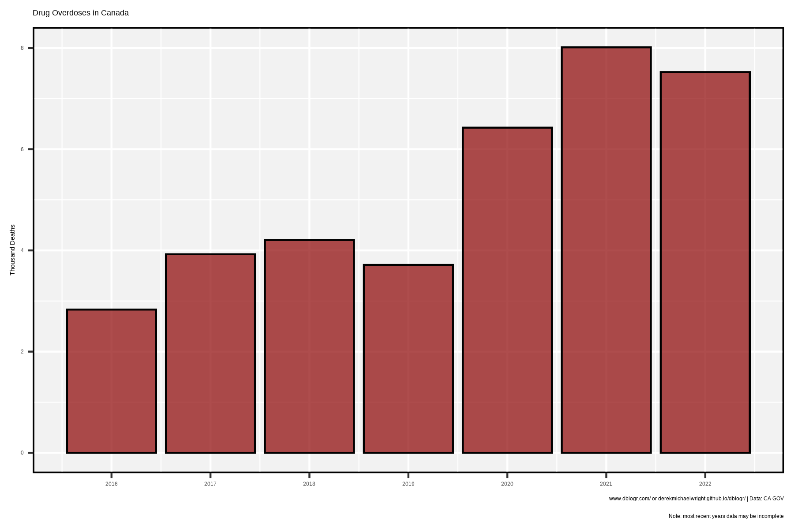

```{r}
# Prep data
myEvents <- c("Total apparent opioid toxicity deaths", "Total apparent stimulant toxicity deaths")
xx <- ca1 %>% 
  filter(Region == "Canada", 
         Year_Quarter %in% as.character(2016:2023),
         Specific_Measure == "Overall numbers",
         Type_Event %in% myEvents, Unit == "Number")
# Plot
mp <- ggplot(xx, aes(x = Year_Quarter, y = Value / 1000)) +
  geom_col(aes(fill = Substance), color = "black", alpha = 0.7) +
  scale_fill_manual(values = c("darkred", "steelblue")) +
  scale_y_continuous(minor_breaks = 0:15) +
  theme_agData(legend.position = "bottom") +
  labs(title = "Drug Overdoses Deaths in Canada", 
       x = NULL, y = "Thousand Deaths", caption = myCaptionCA)
ggsave("canada_overdoses_01.png", mp, width = 6, height = 4.5)
```

---

## By Quarter

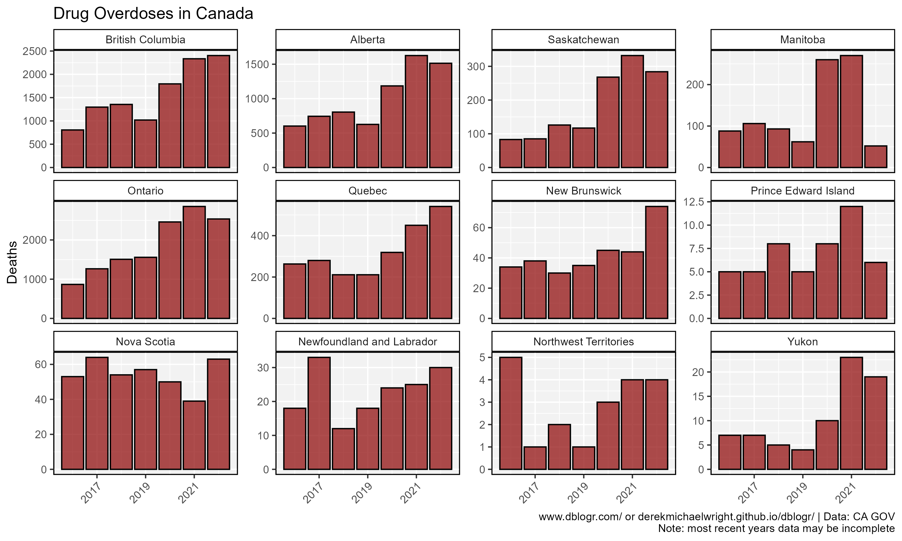

```{r}
# Prep data
myEvents <- c("Total apparent opioid toxicity deaths", "Total apparent stimulant toxicity deaths")
xx <- ca1 %>% 
  filter(Region == "Canada", 
         Time_Period == "By quarter",
         Specific_Measure == "Overall numbers",
         Type_Event %in% myEvents)
# Plot
mp <- ggplot(xx, aes(x = Year_Quarter, y = Value)) +
  geom_col(aes(fill = Substance), color = "black", alpha = 0.7) +
  scale_fill_manual(values = c("darkred", "steelblue")) +
  theme_agData(legend.position = "bottom",
               axis.text.x = element_text(angle = 45, hjust = 1)) +
  labs(title = "Drug Overdoses Deaths in Canada", 
       x = NULL, y = "Thousand Deaths", caption = myCaptionCA)
ggsave("canada_overdoses_02.png", mp, width = 6, height = 4.5)
```

---

## Rate

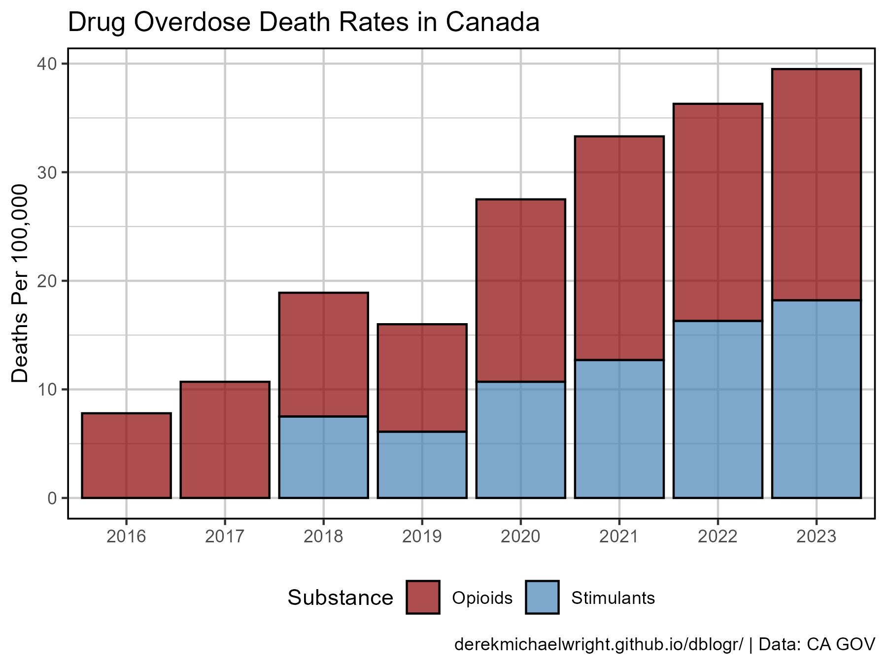

```{r}
# Prep data
myEvents <- c("Total apparent opioid toxicity deaths", "Total apparent stimulant toxicity deaths")
xx <- ca1 %>% 
  filter(Region == "Canada", 
         Year_Quarter %in% as.character(2016:2023),
         Specific_Measure == "Overall numbers",
         Type_Event %in% myEvents, Unit == "Crude rate")
# Plot
mp <- ggplot(xx, aes(x = Year_Quarter, y = Value)) +
  geom_col(aes(fill = Substance), color = "black", alpha = 0.7) +
  scale_fill_manual(values = c("darkred", "steelblue")) +
  theme_agData(legend.position = "bottom") +
  labs(title = "Drug Overdose Death Rates in Canada", 
       x = NULL, y = "Deaths Per 100,000", caption = myCaptionCA)
ggsave("canada_overdoses_03.png", mp, width = 6, height = 4.5)
```

---

## Provinces {.tabset .tabset-pills}

### Deaths

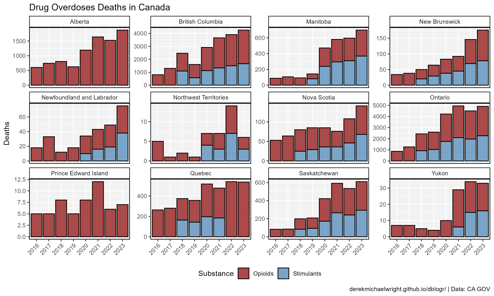

```{r}
# Prep data
myEvents <- c("Total apparent opioid toxicity deaths", "Total apparent stimulant toxicity deaths")
xx <- ca1 %>% 
  filter(!Region %in% c("Canada", "Nunavut"),
         Year_Quarter %in% as.character(2016:2023),
         Specific_Measure == "Overall numbers",
         Type_Event %in% myEvents, Unit == "Number")
# Plot
mp <- ggplot(xx, aes(x = Year_Quarter, y = Value)) +
  geom_col(aes(fill = Substance), color = "black", alpha = 0.7) +
  facet_wrap(Region ~ ., scales = "free_y", ncol = 4) +
  scale_fill_manual(values = c("darkred", "steelblue")) +
  theme_agData(legend.position = "bottom",
               axis.text.x = element_text(angle = 45, hjust = 1)) +
  labs(title = "Drug Overdoses Deaths in Canada", 
       x = NULL, y = "Deaths", caption = myCaptionCA)
ggsave("canada_overdoses_04.png", mp, width = 10, height = 6)
```

---

### By Quarter

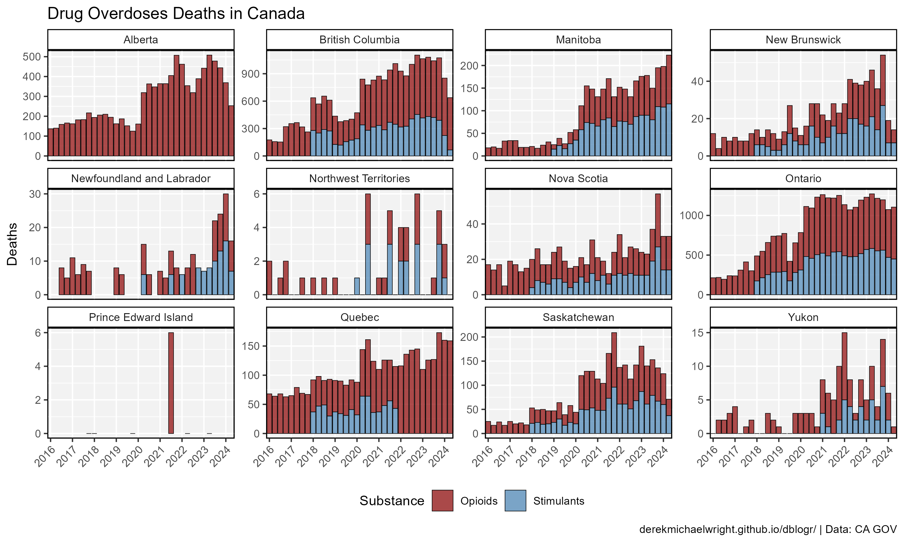

```{r}
# Prep data
myEvents <- c("Total apparent opioid toxicity deaths", "Total apparent stimulant toxicity deaths")
xx <- ca1 %>% 
  filter(!Region %in% c("Canada", "Nunavut"),
         Time_Period == "By quarter",
         Specific_Measure == "Overall numbers",
         Type_Event %in% myEvents)
# Plot
mp <- ggplot(xx, aes(x = Year_Quarter, y = Value)) +
  geom_col(aes(fill = Substance), color = "black", alpha = 0.7, lwd = 0.2) +
  facet_wrap(Region ~ ., scales = "free_y", ncol = 4) +
  scale_fill_manual(values = c("darkred", "steelblue")) +
  scale_x_discrete(breaks = paste(2016:2024, "Q1"), labels = 2016:2024) +
  theme_agData(legend.position = "bottom",
               axis.text.x = element_text(angle = 45, hjust = 1)) +
  labs(title = "Drug Overdoses Deaths in Canada", 
       x = NULL, y = "Deaths", caption = myCaptionCA)
ggsave("canada_overdoses_05.png", mp, width = 10, height = 6)
```

---

### Rate

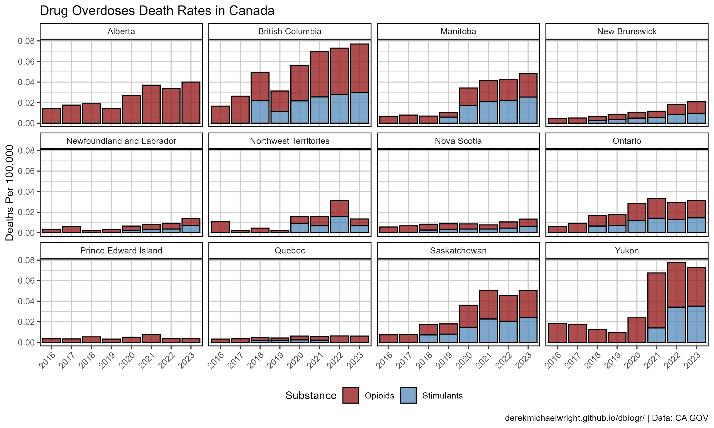

```{r}
# Prep data
myEvents <- c("Total apparent opioid toxicity deaths", "Total apparent stimulant toxicity deaths")
xx <- ca1 %>% 
  filter(!Region %in% c("Canada", "Nunavut"),
         Year_Quarter %in% as.character(2016:2023),
         Specific_Measure == "Overall numbers",
         Type_Event %in% myEvents, Unit == "Crude rate")
# Plot
mp <- ggplot(xx, aes(x = Year_Quarter, y = Value / 1000)) +
  geom_col(aes(fill = Substance), color = "black", alpha = 0.7) +
  facet_wrap(Region ~ ., ncol = 4) +
  scale_fill_manual(values = c("darkred", "steelblue")) +
  theme_agData(legend.position = "bottom") +
  labs(title = "Drug Overdoses Death Rates in Canada", 
       x = NULL, y = "Deaths Per 100,000", caption = myCaptionCA)
ggsave("canada_overdoses_06.png", mp, width = 10, height = 6)
```

---

# British Columbia {.tabset .tabset-pills}

## Annual Drug Overdoses {.tabset .tabset-pills}

### Deaths

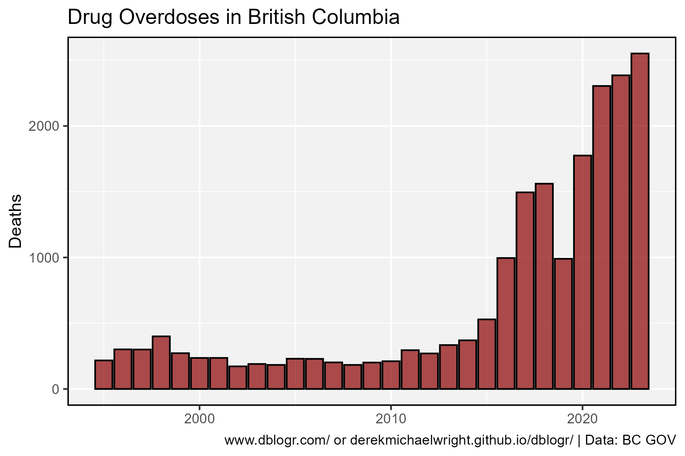

```{r}
mp <- ggplot(bc1, aes(x = Year, y = Deaths)) +
  geom_col(fill = "darkred", color = "black", alpha = 0.7) +
  #scale_x_continuous(breaks = seq(1995, 2020, by = 5),
  #                   minor_breaks = 1990:max(bc1$Year)) +
  theme_agData() +
  labs(title = "Drug Overdoses in British Columbia", x = NULL,
       caption = myCaptionBC)
ggsave("british_columbia_overdoses_01.png", mp, width = 6, height = 4)
```

```{r echo = F}
ggsave("featured.png", mp, width = 6, height = 4)
```

---

### Rate

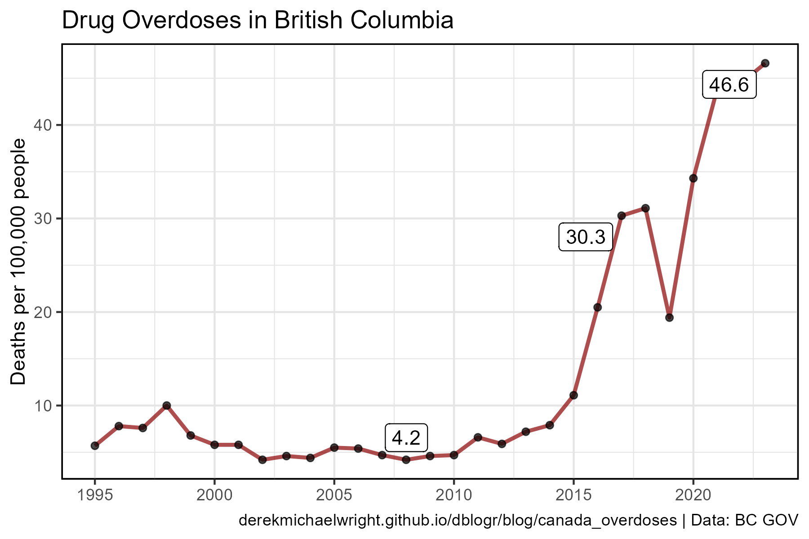

```{r}
mp <- ggplot(bc1, aes(x = Year, y = Rate)) +
  geom_line(color = "darkred", alpha = 0.7, size = 1) +
  geom_point(alpha = 0.7) +
  geom_label_repel(data = bc1 %>% filter(Year %in% c(2008,2017,2023)), 
                   aes(label = Rate)) +
  #scale_x_continuous(minor_breaks = 1990:max(bc1$Year)) +
  theme_agData() +
  labs(title = "Drug Overdoses in British Columbia", 
       y = "Deaths per 100,000 people", x = NULL,
       caption = myCaptionBC)
ggsave("british_columbia_overdoses_02.png", mp, width = 6, height = 4)
```

---

## Monthly Drug Overdoses {.tabset .tabset-pills}

### All Data

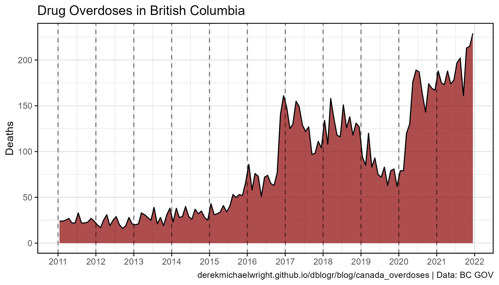

```{r}
mp <- ggplot(bc2, aes(x = Date, y = Deaths)) + 
  geom_col(fill = "darkred", color = "black", lwd = 0.2, alpha = 0.7) +
  geom_vline(xintercept = as.Date(paste0(2011:max(bc2$Year),"-01-01")),
             alpha = 0.5, lty = 2) +
  scale_x_date(date_breaks = "year", date_labels = "%Y") +
  theme_agData() +
  labs(title = "Drug Overdoses in British Columbia", x = NULL,
       caption = myCaptionBC)
ggsave("british_columbia_overdoses_03.png", mp, width = 7, height = 4)
```

---

### > 2019

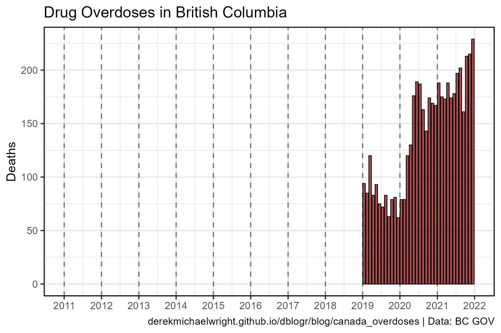

```{r}
mp <- ggplot(bc2 %>% filter(Year >= 2019), aes(x = Date, y = Deaths)) + 
  geom_col(fill = "darkred", color = "black", lwd = 0.3, alpha = 0.7) +
  geom_vline(xintercept = as.Date(paste0(2011:max(bc2$Year),"-01-01")),
             alpha = 0.5, lty = 2) +
  scale_x_date(date_breaks = "year", date_labels = "%Y") +
  theme_agData() +
  labs(title = "Drug Overdoses in British Columbia", x = NULL,
       caption = myCaptionBC)
ggsave("british_columbia_overdoses_04.png", mp, width = 6, height = 4)
```

---

## By Sex

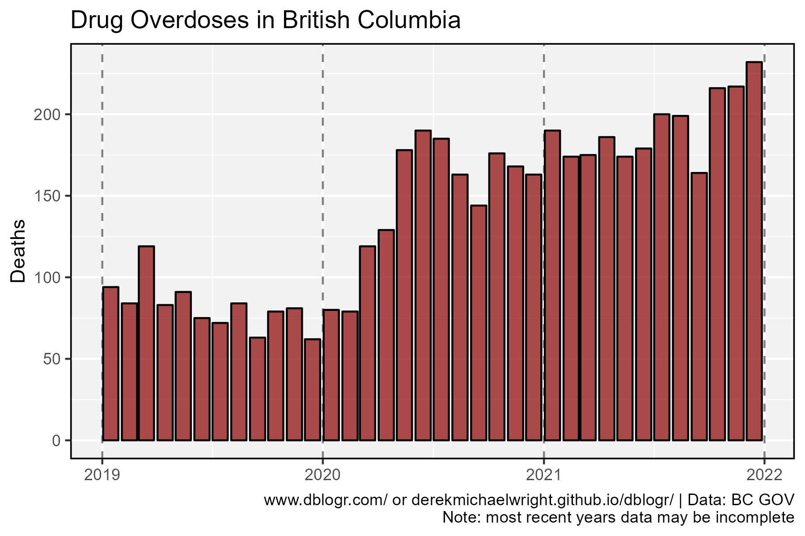

```{r}
mp <- ggplot(bc3, aes(x = Year, y = Deaths, fill = Sex)) +
  geom_col(position = "dodge", color = "black", alpha = 0.7) +
  scale_fill_manual(name = NULL, values = myColorsMF) +
  scale_x_continuous(breaks = 2011:max(bc3$Year)) +
  #scale_y_continuous(breaks = seq(0, 1500, by = 500), limits = c(0,1800)) +
  theme_agData(legend.position = "bottom") +
  labs(title = "Drug Overdoses in British Columbia", x = NULL,
       caption = myCaptionBC)
ggsave("british_columbia_overdoses_05.png", mp, width = 6, height = 4)
```

---

## By Age Group {.tabset .tabset-pills}

### Animation

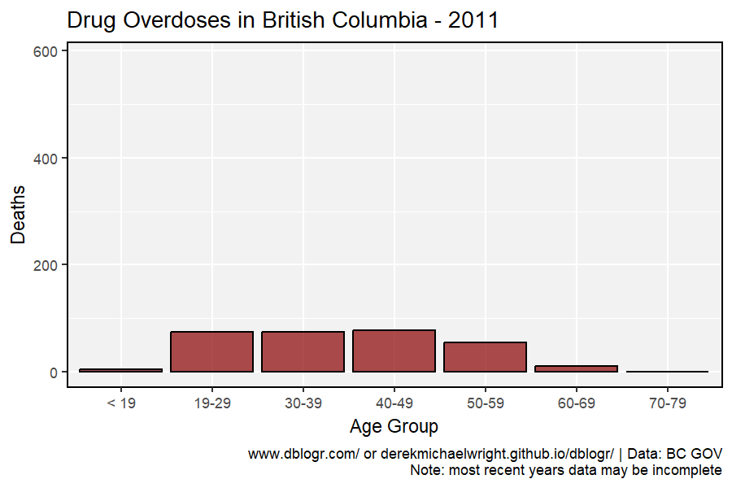

```{r}
mp <- ggplot(bc4, aes(x = `Age Group`, y = Deaths, fill = `Age Group`)) +
  geom_col(position = "dodge", color = "black", fill = "darkred", alpha = 0.7) +
  theme_agData(legend.position = "none") +
  labs(title = "Drug Overdoses in British Columbia - {round(frame_time)}",
       caption = myCaptionBC) +
  transition_time(Year)
anim_save("british_columbia_overdoses_gif_01.gif", mp, 
          nframes = 300, fps = 25, end_pause = 30, 
          width = 900, height = 600, res = 150, units = "px")
```

---

### 2011 - 2016 - 2017 - 2021

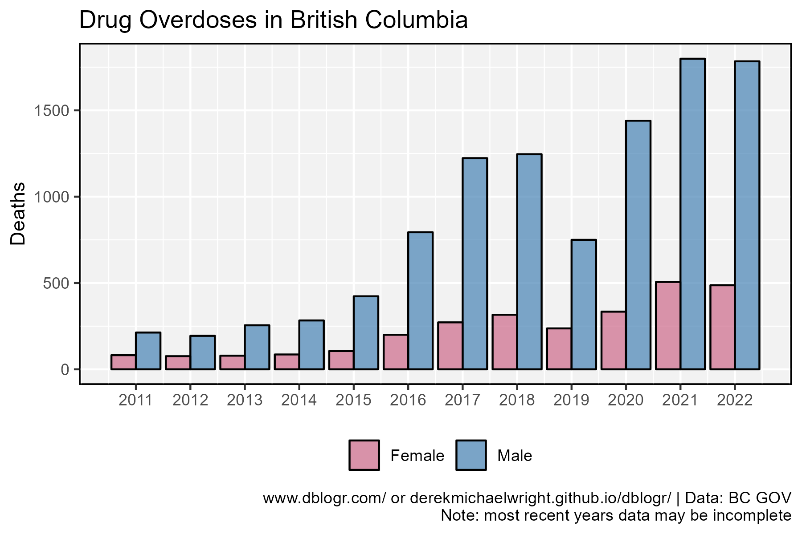

```{r}
# Prep data
xx <- bc4 %>% filter(Year %in% c(2011, 2016, 2017, 2021))
# Plot
mp <- ggplot(xx, aes(x = `Age Group`, y = Deaths)) +
  geom_col(position = "dodge", color = "black", fill = "darkred", alpha = 0.7) +
  facet_grid(. ~ Year) +
  theme_agData(legend.position = "none",
               axis.text.x = element_text(angle = 45, hjust = 1)) +
  labs(title = "Drug Overdoses in British Columbia", x = NULL,
       caption = myCaptionBC)
ggsave("british_columbia_overdoses_06.png", mp, width = 9, height = 4)
```

---

### Unscaled

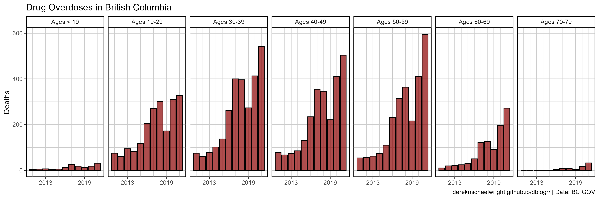

```{r}
mp <- ggplot(bc4, aes(x = Year, y = Deaths)) +
  geom_col(position = "dodge", color = "black", fill = "darkred", alpha = 0.7) +
  facet_grid(. ~ paste("Ages",`Age Group`)) +
  scale_x_continuous(breaks = c(2013, 2019), minor_breaks = 2011:max(bc4$Year)) +
  theme_agData(legend.position = "none") +
  labs(title = "Drug Overdoses in British Columbia", x = NULL,
       caption = myCaptionBC)
ggsave("british_columbia_overdoses_07.png", mp, width = 12, height = 4)
```

---

### Scaled

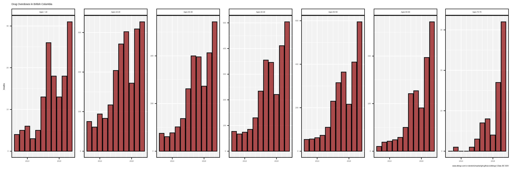

```{r}
mp <- ggplot(bc4, aes(x = Year, y = Deaths)) +
  geom_col(position = "dodge", color = "black", fill = "darkred", alpha = 0.7) +
  facet_wrap(. ~ paste("Ages",`Age Group`), scales = "free_y", ncol = 7) +
  scale_x_continuous(breaks = c(2013, 2019), minor_breaks = 2011:max(bc4$Year)) +
  theme_agData(legend.position = "none") +
  labs(title = "Drug Overdoses in British Columbia", 
       x = NULL, caption = myCaptionBC)
ggsave("british_columbia_overdoses_08.png", mp, width = 12, height = 4)
```

---

# Alberta {.tabset .tabset-pills}

## Monthly Drug Overdoses {.tabset .tabset-pills}

### Number

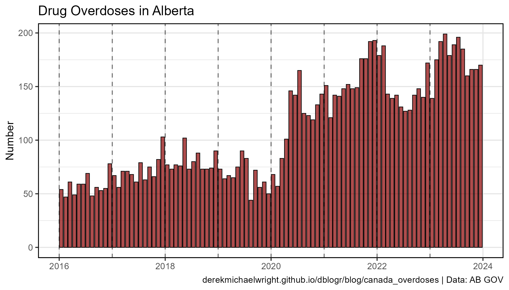

```{r}
mp <- ggplot(ab1, aes(x = Date, y = Number)) +
  geom_col(color = "black", lwd = 0.3, fill = "darkred", alpha = 0.7) +
  geom_vline(xintercept = as.Date(paste0(2016:max(ab1$Year),"-01-01")),
             alpha = 0.5, lty = 2) +
  theme_agData() +
  labs(title = "Drug Overdoses in Alberta", 
       x = NULL, caption = myCaptionAB)
ggsave("alberta_overdoses_01.png", mp, width = 7, height = 4)
```

---

### Rate

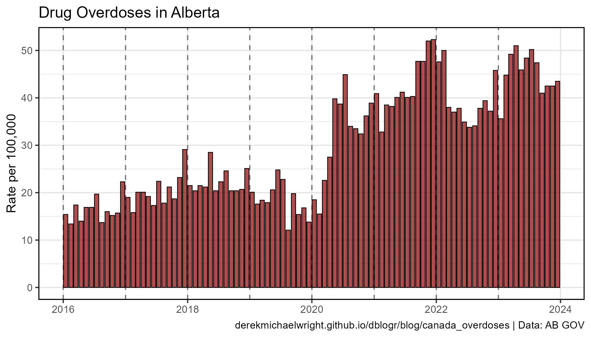

```{r}
mp <- ggplot(ab1, aes(x = Date, y = Rate)) +
  geom_col(color = "black", lwd = 0.3, fill = "darkred", alpha = 0.7) +
  geom_vline(xintercept = as.Date(paste0(2016:max(ab1$Year),"-01-01")),
             alpha = 0.5, lty = 2) +
  theme_agData() +
  labs(title = "Drug Overdoses in Alberta", x = NULL,
       y = "Rate per 100,000", caption = myCaptionAB)
ggsave("alberta_overdoses_02.png", mp, width = 7, height = 4)
```

---

# Saskatchewan {.tabset .tabset-pills}

## Annual Drug Overdoses

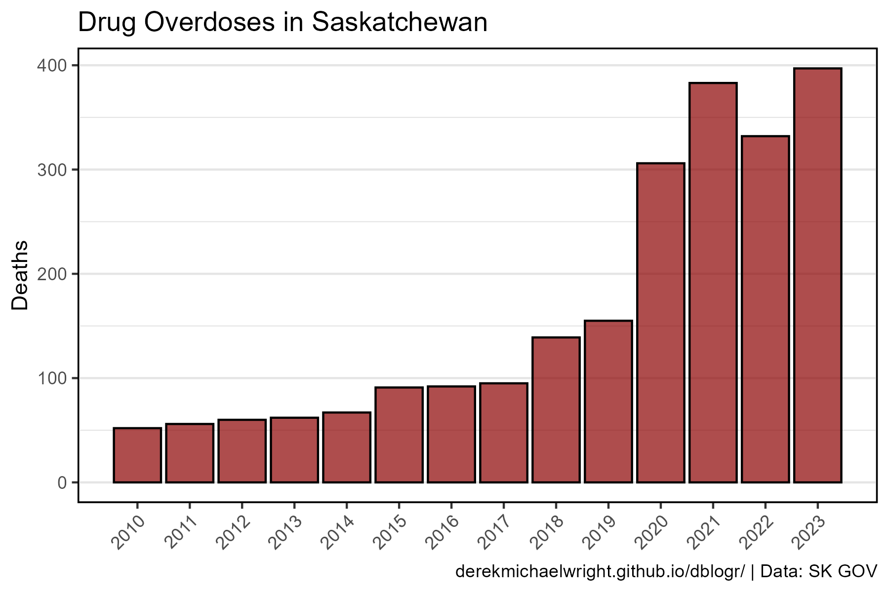

```{r}
mp <- ggplot(sk1, aes(x = Year, y = Accident)) +
  geom_col(color = "black", fill = "darkred", alpha = 0.7) +
  scale_x_continuous(breaks = 2010:max(sk1$Year), 
                     minor_breaks = 2010:max(sk1$Year)) +
  theme_agData() +
  labs(title = "Drug Overdoses in Saskatchewan", 
       y = "Deaths", x = NULL, caption = myCaptionSK)
ggsave("saskatchewan_overdoses_01.png", mp, width = 6, height = 4)
```

---

## Meth Related Drug Overdoses

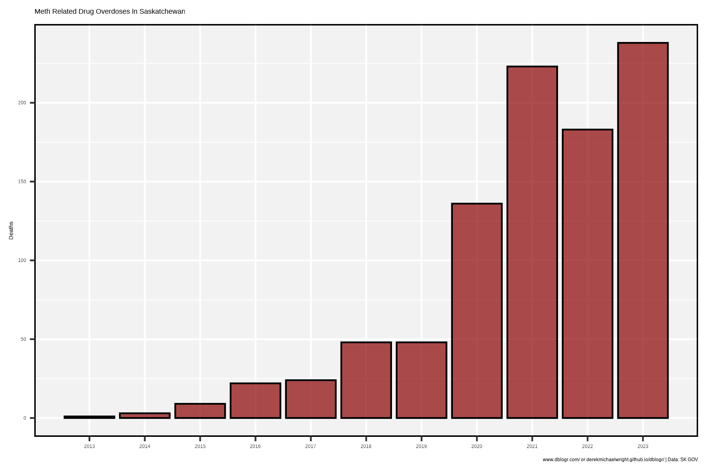

```{r}
mp <- ggplot(sk2, aes(x = Year, y = Deaths)) +
  geom_col(color = "black", fill = "darkred", alpha = 0.7) +
  scale_x_continuous(breaks = 2013:max(sk2$Year),
                     minor_breaks = 2013:max(sk2$Year)) +
  theme_agData() +
  labs(title = "Meth Related Drug Overdoses in Saskatchewan", 
       y = "Deaths", x = NULL, caption = myCaptionSK)
ggsave("saskatchewan_overdoses_02.png", mp, width = 6, height = 4)
```

---

## By Sex

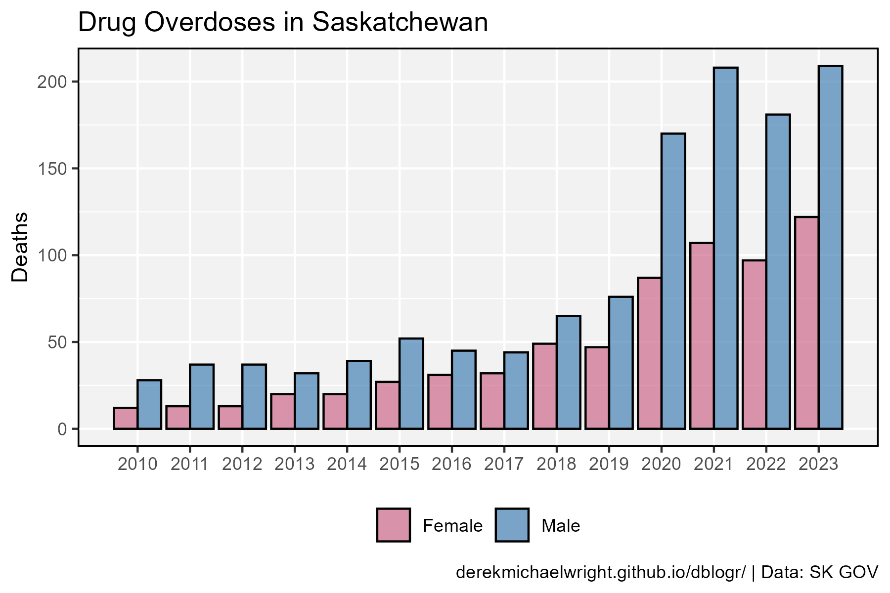

```{r}
# Prep data
xx <- sk3 %>%
  group_by(Year, Sex) %>%
  summarise(Deaths = sum(Deaths))
# Plot
mp <- ggplot(xx, aes(x = Year, y = Deaths, fill = Sex)) +
  geom_col(position = "dodge", color = "black", alpha = 0.7) +
  scale_fill_manual(name = NULL, values = myColorsMF) +
  scale_x_continuous(breaks = 2010:max(xx$Year),
                     minor_breaks = 2010:max(xx$Year)) +
  theme_agData(legend.position = "bottom") +
  labs(title = "Drug Overdoses in Saskatchewan", 
       x = NULL, caption = myCaptionSK)
ggsave("saskatchewan_overdoses_03.png", mp, width = 6, height = 4)
```

```{r echo = F}
ggsave("featured.png", mp, width = 6, height = 4)
```

---

## Age Group {.tabset .tabset-pills}

### Unfacetted

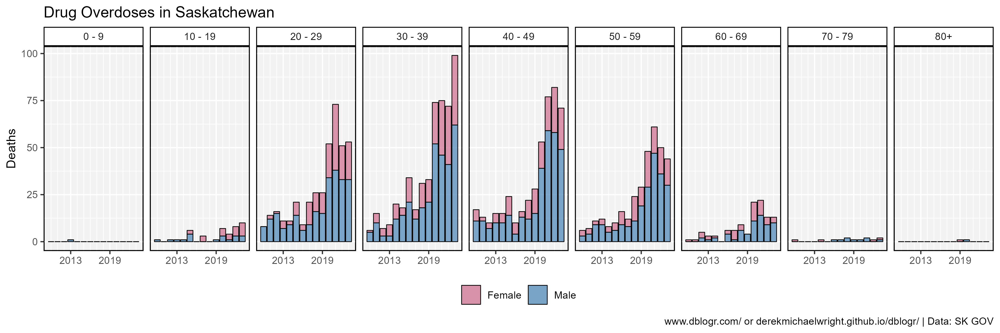

```{r}
mp <- ggplot(sk3, aes(x = Year, y = Deaths, fill = Sex)) +
  geom_col(color = "black", lwd = 0.3, alpha = 0.7) +
  facet_grid(. ~ `Age Group`) +
  scale_x_continuous(breaks = c(2013, 2019), 
                     minor_breaks = 2010:max(sk3$Year)) +
  scale_fill_manual(name = NULL, values = myColorsMF) +
  theme_agData(legend.position = "bottom") +
  labs(title = "Drug Overdoses in Saskatchewan", 
       x = NULL, caption = myCaptionSK)
ggsave("saskatchewan_overdoses_04.png", mp, width = 12, height = 4)
```

---

### Facetted

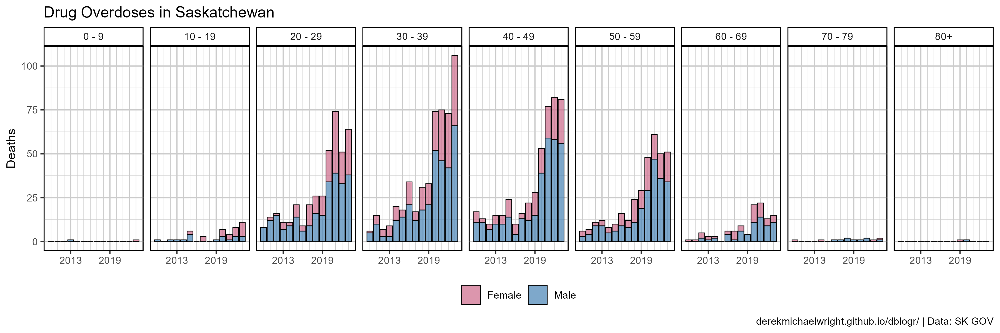

```{r}
mp <- ggplot(sk3, aes(x = Year, y = Deaths, fill = Sex)) +
  geom_col(position = "dodge", color = "black", lwd = 0.3, alpha = 0.8) +
  facet_grid(Sex ~ `Age Group`) +
  scale_x_continuous(breaks = c(2013, 2019), 
                     minor_breaks = 2010:max(sk3$Year)) +
  scale_fill_manual(name = NULL, values = myColorsMF) +
  theme_agData(legend.position = "none") +
  labs(title = "Drug Overdoses in Saskatchewan", 
       x = NULL, caption = myCaptionSK)
ggsave("saskatchewan_overdoses_05.png", mp, width = 12, height = 6)
```

---

### Animation

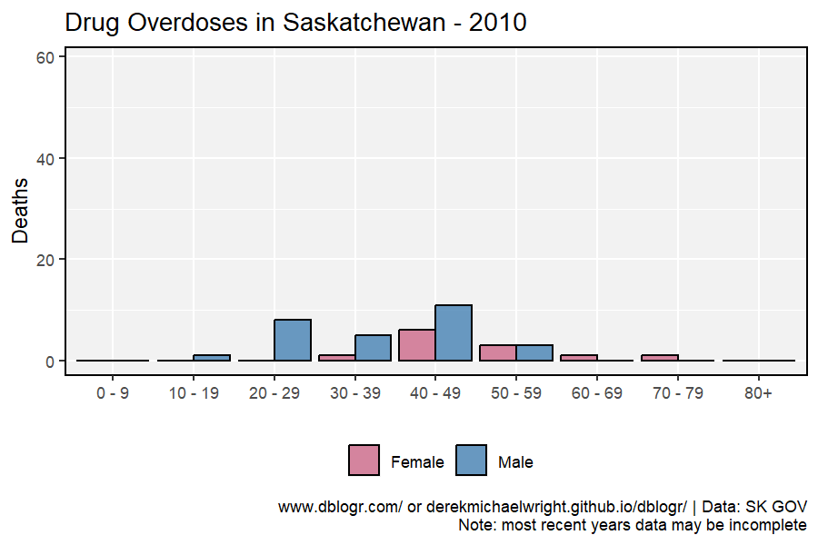

```{r}
mp <- ggplot(sk3, aes(x = `Age Group`, y = Deaths, fill = Sex)) +
  geom_col(position = "dodge", color = "black", alpha = 0.8) +
  scale_fill_manual(name = NULL, values = myColorsMF) +
  theme_agData(legend.position = "bottom") +
  labs(title = "Drug Overdoses in Saskatchewan - {round(frame_time)}",
       x = NULL, caption = myCaptionSK) +
  transition_time(Year)
anim_save("saskatchewan_overdoses_gif_01.gif", mp, 
          nframes = 300, fps = 20, end_pause = 30, 
          width = 900, height = 600, res = 150, units = "px")
```

---

### 2021

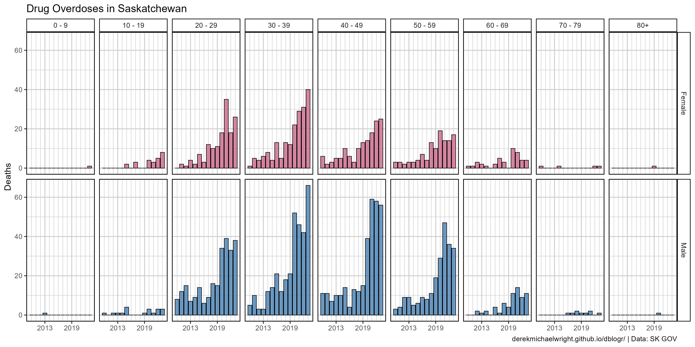

```{r}
mp <- ggplot(sk3 %>% filter(Year == 2021), 
             aes(x = `Age Group`, y = Deaths, fill = Sex)) +
  geom_col(position = "dodge", color = "black", alpha = 0.8) +
  scale_fill_manual(name = NULL, values = myColorsMF) +
  theme_agData(legend.position = "bottom") +
  labs(title = "Drug Overdoses in Saskatchewan - 2021", 
       x = NULL, caption = myCaptionSK)
ggsave("saskatchewan_overdoses_06.png", mp, width = 6, height = 4)
```

---

### 2010 - 2015 - 2019 - 2020 {.tabset .tabset-pills}

#### By Year

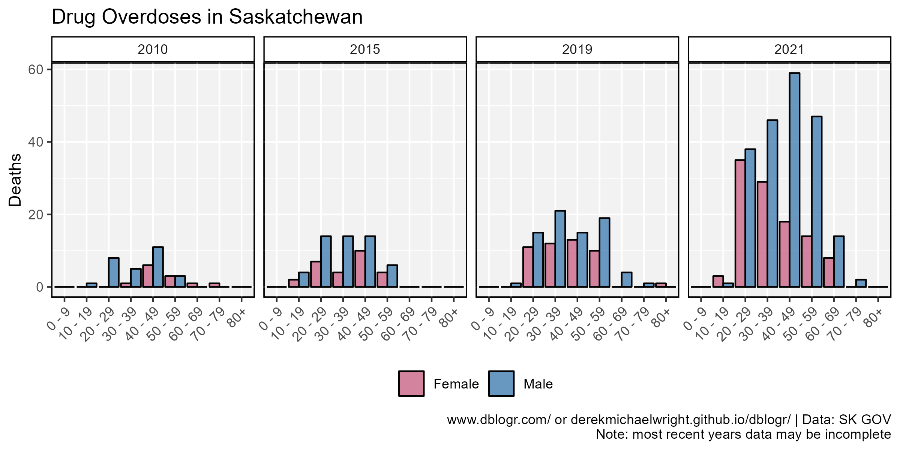

```{r}
mp <- ggplot(sk3 %>% filter(Year %in% c(2010,2015,2019,2021)), 
             aes(x = `Age Group`, y = Deaths, fill = Sex)) +
  geom_col(position = "dodge", color = "black", alpha = 0.8) +
  facet_grid(. ~ Year) +
  scale_fill_manual(name = NULL, values = myColorsMF) +
  theme_agData(legend.position = "bottom",
               axis.text.x = element_text(angle = 45, hjust = 1)) +
  labs(title = "Drug Overdoses in Saskatchewan", 
       x = NULL, caption = myCaptionSK)
ggsave("saskatchewan_overdoses_07.png", mp, width = 8, height = 4)
```

---

#### By Sex

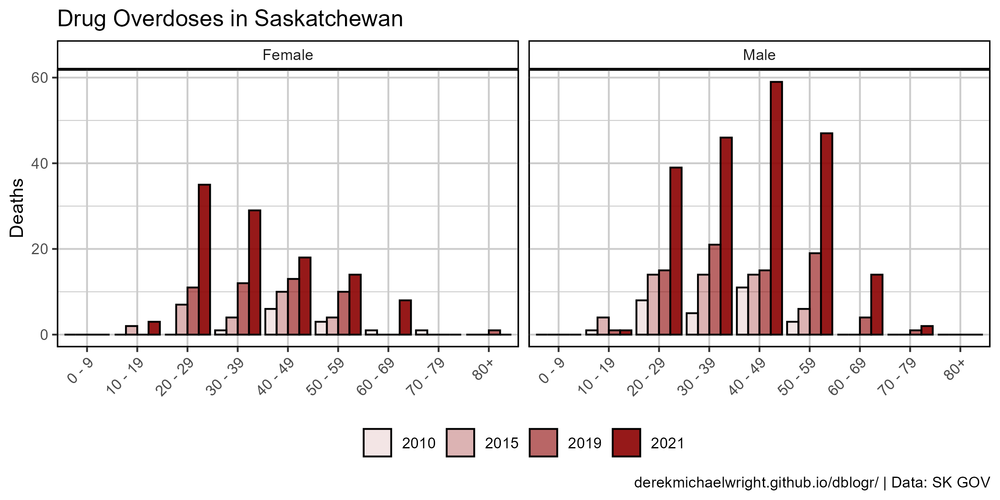

```{r}
# Prep data
xx <- sk3 %>% filter(Year %in% c(2010, 2015, 2019, 2021))
myColors <- c(alpha("darkred",0.1), alpha("darkred",0.3), 
              alpha("darkred",0.6), alpha("darkred",0.9))
# Plot
mp <- ggplot(xx, aes(x = `Age Group`, y = Deaths, fill = factor(Year))) +
  geom_col(position = "dodge", color = "black") +
  facet_grid(. ~ Sex) +
  scale_fill_manual(name = NULL, values = myColors) +
  theme_agData(legend.position = "bottom",
               axis.text.x = element_text(angle = 45, hjust = 1)) +
  labs(title = "Drug Overdoses in Saskatchewan", 
       x = NULL, caption = myCaptionSK)
ggsave("saskatchewan_overdoses_08.png", mp, width = 8, height = 4)
```

---

## By Race {.tabset .tabset-pills}

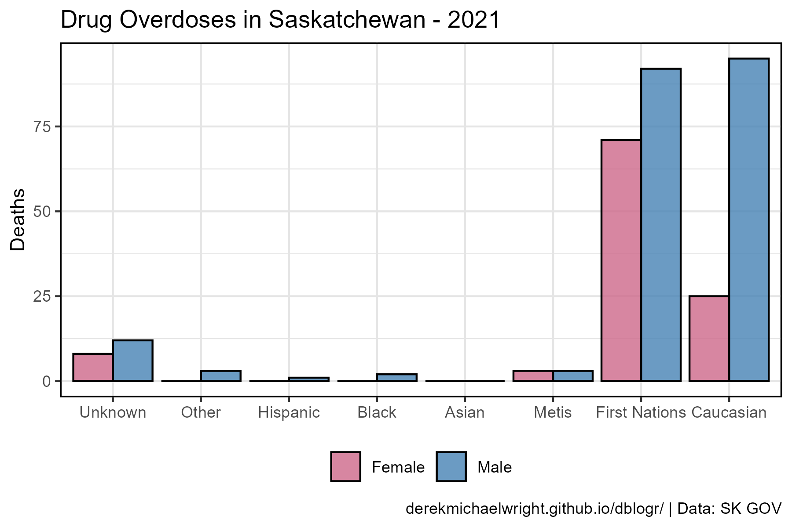

```{r}
mp <- ggplot(sk4, aes(x = Year, y = Deaths, fill = Sex)) +
  geom_col(color = "black", lwd = 0.3, alpha = 0.8) +
  facet_grid(. ~ Race) +
  scale_x_continuous(breaks = c(2013, 2019), minor_breaks = 2010:max(sk4$Year)) +
  scale_fill_manual(name = NULL, values = myColorsMF) +
  theme_agData(legend.position = "bottom") +
  labs(title = "Drug Overdoses in Saskatchewan", 
       x = NULL, caption = myCaptionSK)
ggsave("saskatchewan_overdoses_09.png", mp, width = 12, height = 4)
```

---

### By Sex

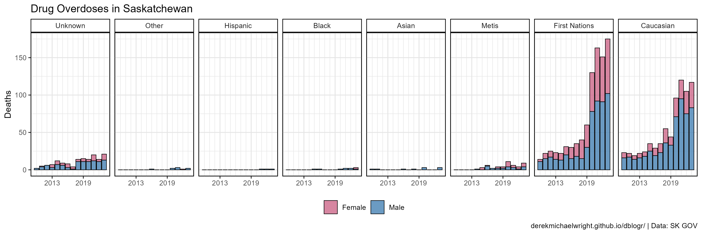

```{r}
mp <- ggplot(sk4, aes(x = Year, y = Deaths, fill = Sex)) +
  geom_col(position = "dodge", color = "black", lwd = 0.3, alpha = 0.8) +
  facet_grid(Sex ~ Race) +
  scale_x_continuous(breaks = c(2013, 2019), minor_breaks = 2010:2021) +
  scale_fill_manual(name = NULL, values = myColorsMF) +
  theme_agData(legend.position = "none") +
  labs(title = "Drug Overdoses in Saskatchewan", 
       x = NULL, caption = myCaptionSK)
ggsave("saskatchewan_overdoses_10.png", mp, width = 12, height = 6)
```

---

### 2020

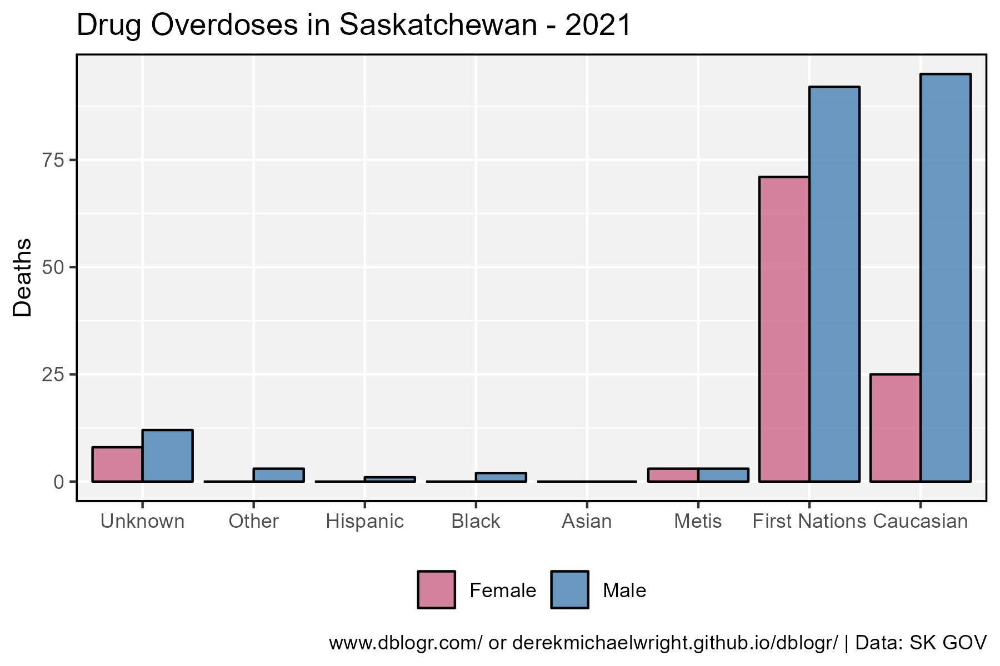

```{r}
mp <- ggplot(sk4 %>% filter(Year == 2021), 
             aes(x = Race, y = Deaths, fill = Sex)) +
  geom_col(position = "dodge", color = "black", alpha = 0.8) +
  scale_fill_manual(name = NULL, values = myColorsMF) +
  theme_agData(legend.position = "bottom") +
  labs(title = "Drug Overdoses in Saskatchewan - 2021", 
       x = NULL, caption = myCaptionSK)
ggsave("saskatchewan_overdoses_11.png", mp, width = 6, height = 4)
```

---

### Animation

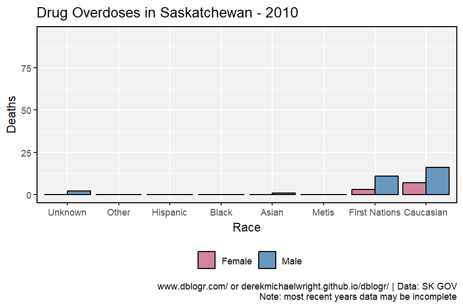

```{r}
mp <- ggplot(sk4, aes(x = Race, y = Deaths, fill = Sex)) +
  geom_col(position = "dodge", color = "black", alpha = 0.8) +
  scale_fill_manual(name = NULL, values = myColorsMF) +
  theme_agData(legend.position = "bottom") +
  labs(title = "Drug Overdoses in Saskatchewan - {round(frame_time)}",
       caption = myCaptionSK) +
  transition_time(Year)
anim_save("saskatchewan_overdoses_gif_02.gif", mp, 
          nframes = 300, fps = 25, end_pause = 30, 
          width = 900, height = 600, res = 150, units = "px")
```

---

### 2010 - 2015 - 2019 - 2021

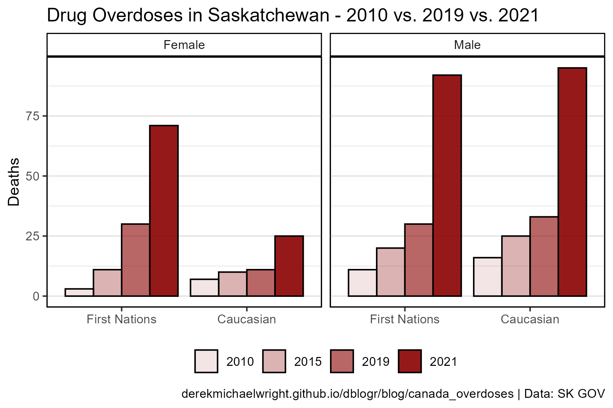

```{r}
# Prep data
xx <- sk4 %>% filter(Year %in% c(2010, 2015, 2019, 2021),
                    Race %in% c("First Nations", "Caucasian"))
myColors <- c(alpha("darkred",0.1), alpha("darkred",0.3),
              alpha("darkred",0.6), alpha("darkred",0.9))
# Plot
mp <- ggplot(xx, aes(x = Race, y = Deaths, fill = factor(Year))) +
  geom_col(position = "dodge", color = "black") +
  facet_grid(. ~ Sex) +
  scale_fill_manual(name = NULL, values = myColors) +
  theme_agData(legend.position = "bottom") +
  labs(title = "Drug Overdoses in Saskatchewan - 2010 vs. 2019 vs. 2021", 
       x = NULL, caption = myCaptionSK)
ggsave("saskatchewan_overdoses_12.png", mp, width = 6, height = 4)
```

---

## Rate

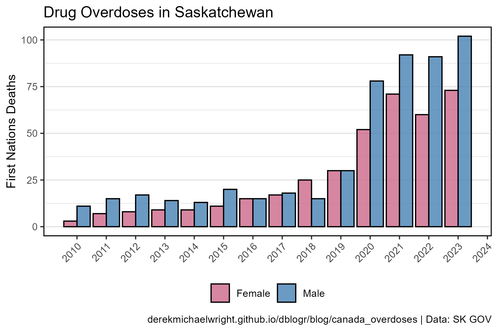

```{r}
# Prep data
pop_FN <- agData_STATCAN_Population %>% 
  filter(Area == "Saskatchewan", Month == 1, Year == 2021) %>% 
  pull(Value) * 0.107
pop_CN <- agData_STATCAN_Population %>% 
  filter(Area == "Saskatchewan", Month == 1, Year == 2021) %>% 
  pull(Value) * 0.728
xx <- sk4 %>% 
  filter(Year %in% c(2019, 2021),
         Race %in% c("First Nations", "Caucasian")) %>%
  mutate(Rate = ifelse(Race == "Caucasian", 
                       Deaths / pop_CN * 100000, 
                       Deaths / pop_FN * 100000))
myColors <- c(alpha("darkred",0.3), alpha("darkred",0.7))
# Plot
mp <- ggplot(xx, aes(x = Race, y = Rate, fill = factor(Year))) +
  geom_col(position = "dodge",
           color = "black") +
  facet_grid(. ~ Sex) +
  scale_fill_manual(name = NULL, values = myColors) +
  theme_agData(legend.position = "bottom") +
  labs(title = "Drug Overdose Rates in Saskatchewan - 2019 vs. 2020", 
       y = "Deaths per 100,000 people", x = NULL, caption = myCaptionSK)
ggsave("saskatchewan_overdoses_13.png", mp, width = 6, height = 4)
```

---

## Fold Increase

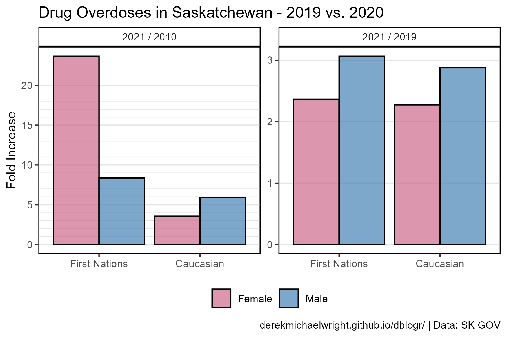

```{r}
# Prep data
xx <- sk4 %>% 
  filter(Year %in% c(2010, 2019, 2021),
         Race %in% c("First Nations", "Caucasian")) %>%
  spread(Year, Deaths) %>%
  mutate(`2021 / 2010` = `2021` / `2010`,
         `2021 / 2019` = `2021` / `2019`) %>%
  gather(Trait, Value, `2021 / 2010`, `2021 / 2019`)
# Plot
mp <- ggplot(xx, aes(x = Race, y = Value, fill = Sex)) +
  geom_col(position = "dodge", color = "black", alpha = 0.7) +
  facet_wrap(. ~ Trait, scales = "free_y") +
  scale_fill_manual(name = NULL, values = myColorsMF) +
  scale_y_continuous(minor_breaks = 0:18) +
  theme_agData(legend.position = "bottom") +
  labs(title = "Drug Overdoses in Saskatchewan - 2019 vs. 2020", 
       y = "Fold Increase", x = NULL, caption = myCaptionSK)
ggsave("saskatchewan_overdoses_14.png", mp, width = 6, height = 4)
```

---

```{r echo = F, eval = F}
# https://healthanalytics.alberta.ca/SASVisualAnalytics/?reportUri=%2Freports%2Freports%2F1bbb695d-14b1-4346-b66e-sk401a40f53e6&sectionIndex=0&sso_guest=true&reportViewOnly=true&reportContextBar=false&sas-welcome=false
```
