```{r setup, include=FALSE}
knitr::opts_chunk$set(echo = T, message = F, warning = F)
```

---

# Data {.tabset .tabset-pills}

## STATCAN Table: 17-10-0009-01

Population estimates, quarterly

> - `r shiny::icon("globe")` [https://www150.statcan.gc.ca/t1/tbl1/en/cv.action?pid=1710000901](https://www150.statcan.gc.ca/t1/tbl1/en/cv.action?pid=1710000901){target="_blank"}
> - `r shiny::icon("save")` [1710000901_databaseLoadingData.csv](1710000901_databaseLoadingData.csv)

## STATCAN Table: 17-10-0005-01

Population estimates on July 1, by age and gender

> - `r shiny::icon("globe")` [https://www150.statcan.gc.ca/t1/tbl1/en/cv.action?pid=1710000501](https://www150.statcan.gc.ca/t1/tbl1/en/cv.action?pid=1710000501){target="_blank"}
> - `r shiny::icon("save")` [1710000501_databaseLoadingData.csv](1710000501_databaseLoadingData.csv)

---

# Prepare Data

```{r class.source = "fold-show"}
# devtools::install_github("derekmichaelwright/agData")
library(agData)
library(gganimate)
library(transformr)
```

```{r}
# Prep data
myCaption <- "derekmichaelwright.github.io/dblogr/blog/canada_population | Data: STATCAN"
myColorsMF <- c("steelblue", "palevioletred3")
myColorsP <- c("darkgoldenrod3", "darkred", "darkgreen", "darkslategray",
               "darkblue", "steelblue", "maroon4", "purple4", "cyan4", "burlywood4")
myAges <- c("0 to 4 years", "5 to 9 years", 
            "10 to 14 years", "15 to 19 years",
            "20 to 24 years", "25 to 29 years", 
            "30 to 34 years", "35 to 39 years",
            "40 to 44 years", "45 to 49 years", 
            "50 to 54 years", "55 to 59 years",
            "60 to 64 years", "65 to 69 years", 
            "70 to 74 years", "75 to 79 years",
            "80 to 84 years", "85 to 89 years", 
            "90 to 94 years", "95 to 99 years",
            "100 years and over", "Median age", "All ages")
myAreas <- c("Canada", "British Columbia", "Alberta", "Saskatchewan", "Manitoba",
             "Ontario", "Quebec", "New Brunswick", "Prince Edward Island",
             "Nova Scotia", "Newfoundland and Labrador", 
             "Yukon", "NWT & Nunavut", "Northwest Territories", "Nunavut")
myAreasShort <- c("CA", "BC", "AB", "SK", "MB", 
                  "ON", "QC", "NB", "PE", "NS", "NL", 
                  "YT", "NTNU", "NT", "NU")
#
d1 <- read.csv("1710000901_databaseLoadingData.csv") %>%
  select(Year=REF_DATE, Area=GEO, Unit=UOM, Value=VALUE) %>%
  mutate(Area = gsub("Northwest Territories including", "NWT &", Area),
         Area = factor(Area, levels = myAreas),
         AreaShort = plyr::mapvalues(Area, myAreas, myAreasShort),
         Month = substr(Year, 6, 8),
         Year = substr(Year, 1,4),
         Year = as.numeric(Year),
         Month = as.numeric(Month),
         Date = as.Date(paste(Year, Month, "01", sep = "-")))
#
d2 <- read.csv("1710000501_databaseLoadingData.csv") %>%
  select(Year=REF_DATE, Area=GEO, Gender, Age=Age.group, Unit=UOM, Value=VALUE) %>%
  mutate(Area = gsub("Northwest Territories including", "NWT &", Area),
         Area = factor(Area, levels = myAreas),
         Gender = factor(Gender, levels = c("Total - gender", "Men+", "Women+")),
         Age = factor(Age, levels = myAges),
         Year = substr(Year, 1,4),
         Year = as.numeric(Year),
         Value = ifelse(is.na(Value), 0, Value))# %>%
  #filter(!is.na(Age))
```

---

# Population {.tabset .tabset-pills}

## Canada

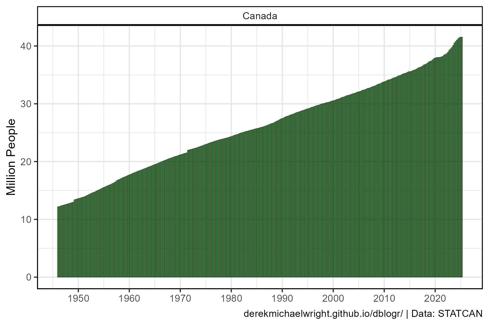

```{r}
# Prep data
xx <- d1 %>% filter(Area == "Canada")
myBreaks <- as.Date(paste0(seq(1950, 2020, by = 10), "-01-01"))
# Plot
mp <- ggplot(xx, aes(x = Date, y = Value / 1000000)) +
  geom_col(fill = "darkgreen", alpha = 0.7, color = "black", lwd = 0.1) +
  facet_wrap(Area ~ ., ncol = 4, scales = "free_y") +
  scale_x_date(breaks = myBreaks, date_labels = "%Y") +
  theme_agData(legend.position = "none") +
  labs(y = "Million People", x = NULL, caption = myCaption)
ggsave("canada_population_1_01.png", mp, width = 6, height = 4)
```

---

## Saskatchewan

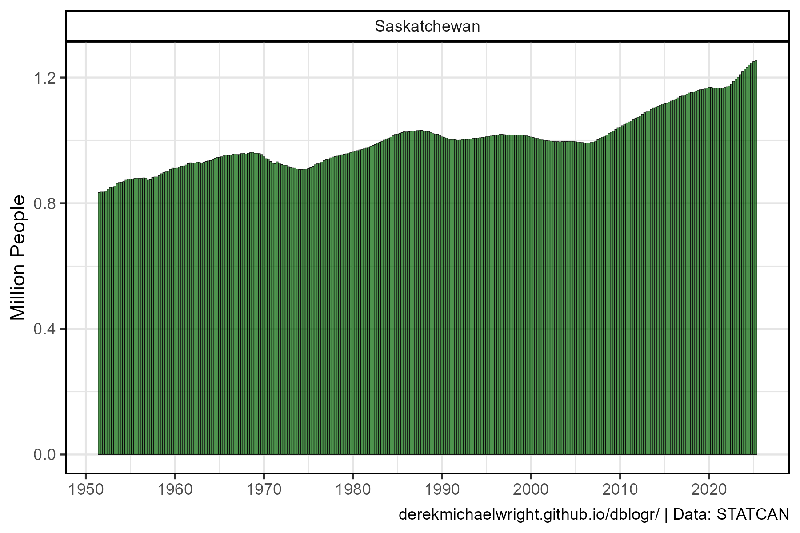

```{r}
# Prep data
xx <- d1 %>% filter(Area == "Saskatchewan")
myBreaks <- as.Date(paste0(seq(1950, 2020, by = 10), "-01-01"))
# Plot
mp <- ggplot(xx, aes(x = Date, y = Value / 1000000)) +
  geom_col(fill = "darkgreen", alpha = 0.7, color = "black", lwd = 0.1) +
  facet_wrap(Area ~ ., ncol = 4, scales = "free_y") +
  scale_x_date(breaks = myBreaks, date_labels = "%Y") +
  theme_agData(legend.position = "none") +
  labs(y = "Million People", x = NULL, caption = myCaption)
ggsave("canada_population_1_02.png", mp, width = 6, height = 4)
```

---

## All Provinces {.tabset .tabset-pills}

### All Data

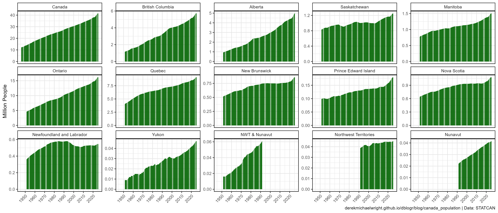

```{r}
# Prep data
myBreaks <- as.Date(paste0(seq(1950, 2020, by = 10), "-01-01"))
# Plot
mp <- ggplot(d1, aes(x = Date, y = Value / 1000000)) +
  geom_col(fill = "darkgreen", alpha = 0.9) +
  facet_wrap(Area ~ ., ncol = 5, scales = "free_y") +
  scale_x_date(breaks = myBreaks, date_labels = "%Y") +
  theme_agData(legend.position = "none", 
               axis.text.x = element_text(angle = 45, hjust = 1)) +
  labs(y = "Million People", x = NULL, caption = myCaption)
ggsave("canada_population_1_03.png", mp, width = 14, height = 6)
```

---

### 2021

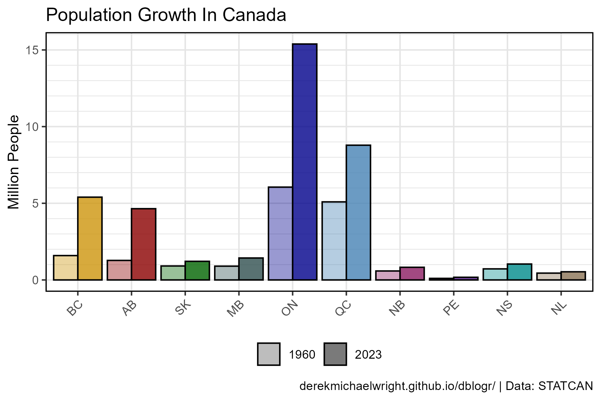

```{r}
# Prep data
xx <- d1 %>% filter(!AreaShort %in% c("CA", "NU", "NT", "YT", "NTNU"), 
                    Year %in% c(1960, 2023), Month == 1) %>%
  mutate(Year = factor(Year))
# Plot
mp <- ggplot(xx, aes(x = AreaShort, y = Value / 1000000, fill = Area, alpha = Year)) +
  geom_col(position = "dodge", color = "black") +
  scale_fill_manual(name = NULL, values = myColorsP, guide = F) +
  scale_alpha_manual(name = NULL, values = c(0.4, 0.8)) +
  scale_y_continuous(minor_breaks = 1:16) +
  theme_agData_col(legend.position = "bottom",
                   axis.text.x = element_text(angle = 45, hjust = 1)) +
  labs(title = "Population Growth In Canada", x = NULL,
       y = "Million People", caption = myCaption)
ggsave("canada_population_1_04.png", mp, width = 6, height = 4)
```

---

## Western Canada

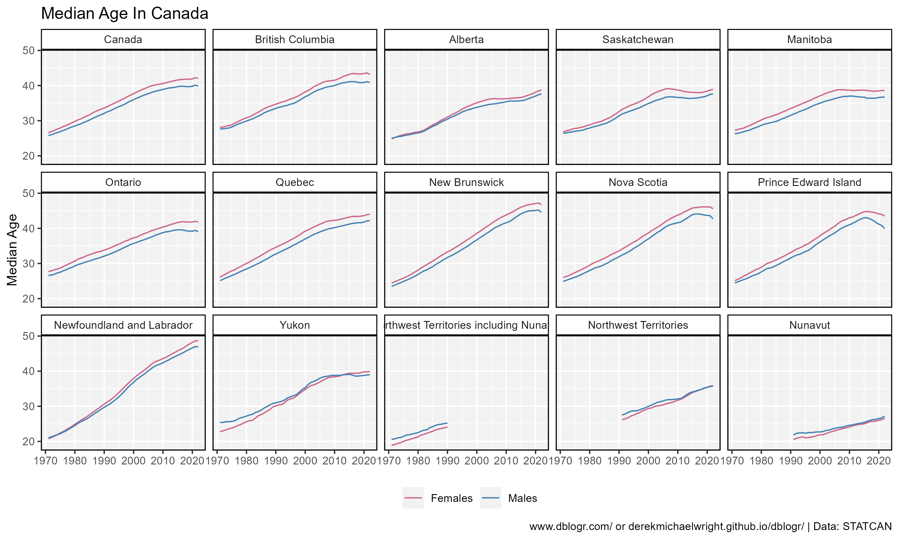

```{r}
# Prep data
xx <- d1 %>% filter(Area %in% myAreas[2:5])
# Plot
mp <- ggplot(xx, aes(x = Date, y = Value / 1000000, color = Area)) +
  geom_line(size = 1.25, alpha = 0.7) +
  scale_color_manual(name = NULL, values = myColorsP) +
  theme_agData() +
  labs(title = "Western Canada Population Growth",
       y = "Million People", x = NULL, caption = myCaption)
ggsave("canada_population_1_05.png", mp, width = 6, height = 4)
```

---

# Growth Rate {.tabset .tabset-pills}

## Canada

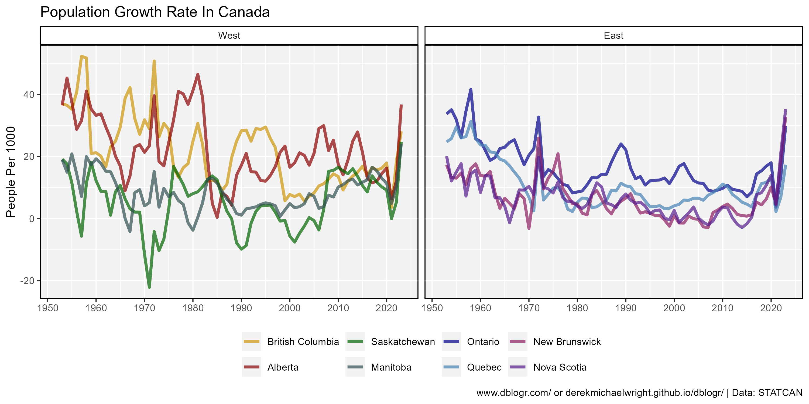

```{r}
# Prep data
xx <- d1 %>% 
  filter(Month == 1, Area == "Canada")
for(i in 1:nrow(xx)) {
  priorV <- xx$Value[xx$Year == xx$Year[i]-1 & xx$Area == xx$Area[i]]
  if(length(priorV)>0) { xx$Rate[i] <- 1000 * (xx$Value[i] - priorV) / priorV }
}
# Plot
mp <- ggplot(xx, aes(x = Year, y = Rate)) +
  geom_col(fill = "darkgreen", alpha = 0.8, color = "black", lwd = 0.3) +
  scale_x_continuous(breaks = seq(1950, 2020, by = 10)) +
  theme_agData() +
  labs(title = "Population Growth Rate In Canada", x = NULL,
       y = "People Per 1000", caption = myCaption)
ggsave("canada_population_1_06.png", mp, width = 6, height = 4)
```

---

## Provinces

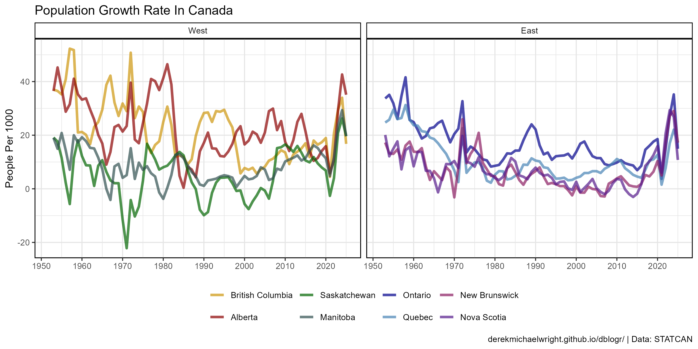

```{r}
# Prep data
xx <- d1 %>% 
  filter(Month == 1, 
         Area %in% c("British Columbia", "Alberta", "Saskatchewan", "Manitoba",
                     "Ontario", "Quebec", "New Brunswick", "Nova Scotia")) %>% 
  mutate(Group = ifelse(Area %in% c("British Columbia", "Alberta", 
                                    "Saskatchewan", "Manitoba"),
                        "West", "East"),
         Group = factor(Group, levels = c("West", "East")))
for(i in 1:nrow(xx)) {
  priorV <- xx$Value[xx$Year == xx$Year[i]-1 & xx$Area == xx$Area[i]]
  if(length(priorV)>0) { xx$Rate[i] <- 1000 * (xx$Value[i] - priorV) / priorV }
}
# Plot
mp <- ggplot(xx, aes(x = Year, y = Rate, color = Area)) +
  geom_line(size = 1.25, alpha = 0.7) +
  facet_grid(. ~ Group) +
  scale_color_manual(name = NULL, values = myColorsP) +
  scale_x_continuous(breaks = seq(1950, 2020, by = 10)) +
  theme_agData(legend.position = "bottom") +
  labs(title = "Population Growth Rate In Canada", x = NULL,
       y = "People Per 1000", caption = myCaption)
ggsave("canada_population_1_07.png", mp, width = 10, height = 5)
```

---

# Median Age {.tabset .tabset-pills}

## Canada

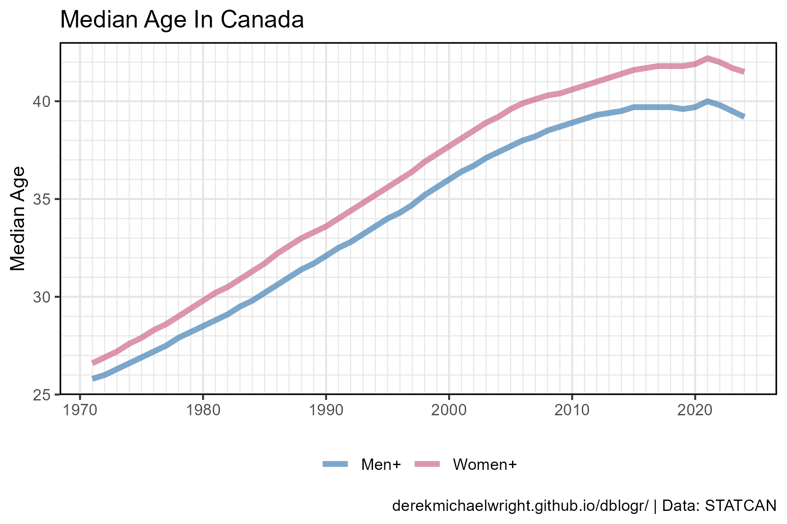

```{r}
# Prep data
xx <- d2 %>% 
  filter(Area == "Canada", Gender != "Total - gender", Age == "Median age")
# Plot
mp <- ggplot(xx, aes(x = Year, y = Value, color = Gender)) +
  geom_line(size = 1.5, alpha = 0.7) +
  scale_color_manual(name = NULL, values = myColorsMF) +
  scale_x_continuous(minor_breaks = 1970:2025) +
  scale_y_continuous(minor_breaks = 25:45) +
  theme_agData(legend.position = "bottom") +
  labs(title = "Median Age In Canada", x = NULL,
       y = "Median Age", caption = myCaption)
ggsave("canada_population_1_08.png", mp, width = 6, height = 4)
```

---

## Provinces

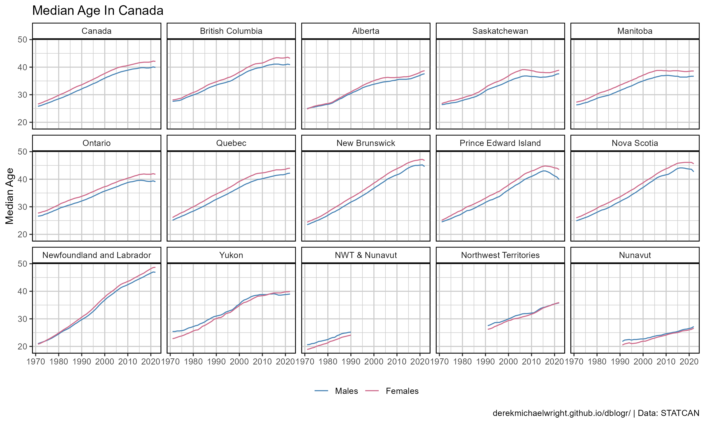

```{r}
# Prep data
xx <- d2 %>% 
  filter(Gender != "Total - gender", Age == "Median age")
# Plot
mp <- ggplot(xx, aes(x = Year, y = Value, color = Gender)) +
  geom_line() +
  facet_wrap(Area ~ ., ncol = 5) +
  scale_color_manual(name = NULL, values = myColorsMF) +
  theme_agData(legend.position = "bottom") +
  labs(title = "Median Age In Canada", x = NULL,
       y = "Median Age", caption = myCaption)
ggsave("canada_population_1_09.png", mp, width = 10, height = 6)
```

---

# Population Pyramids {.tabset .tabset-pills}

## Plotting Function

```{r class.source = "fold-show"}
gg_PopDem_plot <- function(myArea = "Saskatchewan", myYears = 1971 ) {
  # Prep data
  xx <- d2 %>% 
    filter(Area == myArea, Year %in% myYears, Gender != "Total - gender",
           !Age %in% c("All ages", "Median age")) 
  yy <- xx %>% spread(Gender, Value) %>% 
    mutate(Value = `Women+` - `Men+`,
           Gender = ifelse(Value < 0, "Men+", "Women+"))
  xx <- xx %>% 
    mutate(Value = ifelse(Gender == "Men+", -Value, Value))
  # Plot
  ggplot(xx, aes(y = Value / 1000, x = Age, fill = Gender)) + 
    geom_col(color = "black", alpha = 0.7) +
    geom_col(data = yy, color = "black", alpha = 0.7) +
    scale_fill_manual(name = NULL, values = myColorsMF) +
    #scale_x_discrete(sec.axis = sec_axis(~ .)) +
    facet_grid(. ~ Year) + 
    theme_agData(legend.position = "bottom") + 
    labs(title = paste("Population in", myArea), x = NULL, 
         y = "Thousand People", caption = myCaption) +
    coord_cartesian(ylim = c(-max(xx$Value), max(xx$Value))) +
    coord_flip()
}
```

## Canada {.active}


```{r}
mp <- gg_PopDem_plot(myArea = "Canada", myYears = c(1971, 1995, 2021))
ggsave("canada_population_2_01.png", mp, width = 10, height = 4)
```

```{r echo = F}
ggsave("featured.png", mp, width = 10, height = 4)
```

---

## British Columbia


```{r}
mp <- gg_PopDem_plot(myArea = "British Columbia", myYears = c(1971, 1995, 2021))
ggsave("canada_population_2_02.png", mp, width = 10, height = 4)
```

---

## Alberta

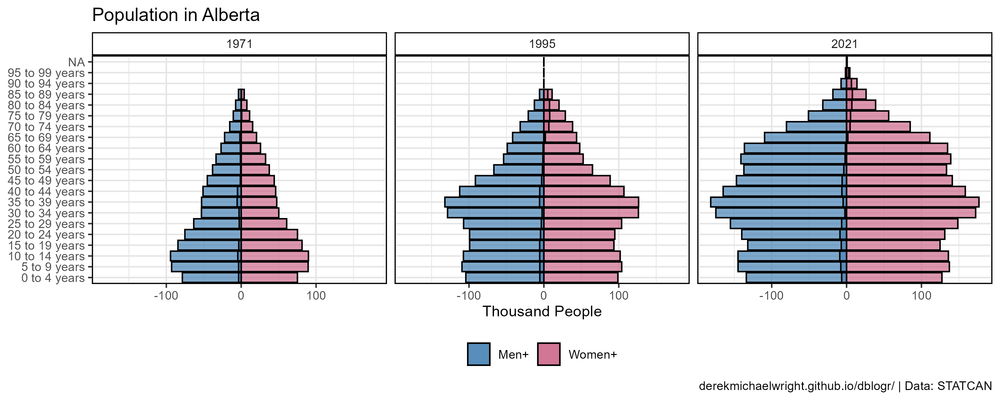

```{r}
mp <- gg_PopDem_plot(myArea = "Alberta", myYears = c(1971, 1995, 2021))
ggsave("canada_population_2_03.png", mp, width = 10, height = 4)
```

---

## Saskatchewan


```{r}
mp <- gg_PopDem_plot(myArea = "Saskatchewan", myYears = c(1971, 1995, 2021))
ggsave("canada_population_2_04.png", mp, width = 10, height = 4)
```

---

## Manitoba

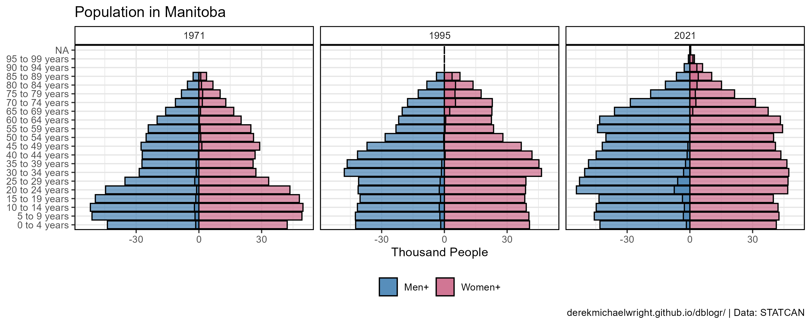

```{r}
mp <- gg_PopDem_plot(myArea = "Manitoba", myYears = c(1971, 1995, 2021))
ggsave("canada_population_2_05.png", mp, width = 10, height = 4)
```

---

## Ontario

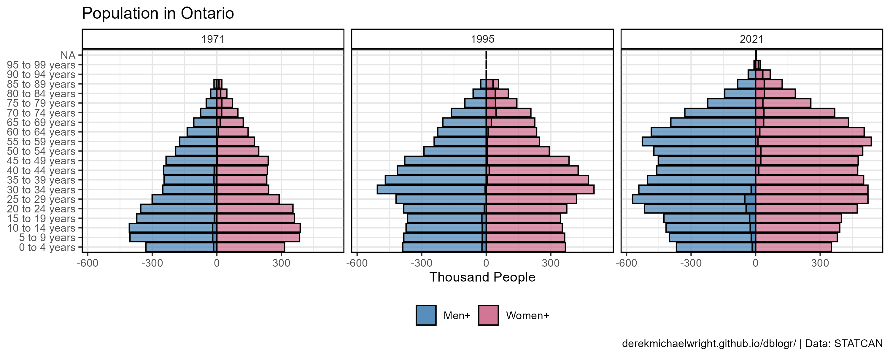

```{r}
mp <- gg_PopDem_plot(myArea = "Ontario", myYears = c(1971, 1995, 2021))
ggsave("canada_population_2_06.png", mp, width = 10, height = 4)
```

---

## Quebec


```{r}
mp <- gg_PopDem_plot(myArea = "Quebec", myYears = c(1971, 1995, 2021))
ggsave("canada_population_2_07.png", mp, width = 10, height = 4)
```

---

## Newfoundland and Labrador

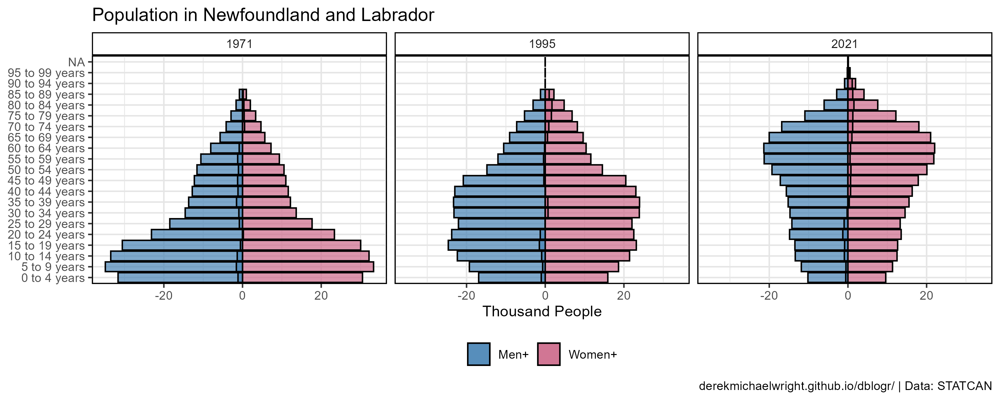

```{r}
mp <- gg_PopDem_plot(myArea = "Newfoundland and Labrador", 
                     myYears = c(1971, 1995, 2021))
ggsave("canada_population_2_08.png", mp, width = 10, height = 4)
```

---

## Yukon


```{r}
mp <- gg_PopDem_plot(myArea = "Yukon", myYears = c(1971, 1995, 2021))
ggsave("canada_population_2_09.png", mp, width = 10, height = 4)
```

---

# Animated Population Pyramids {.tabset .tabset-pills}

## Plotting Function

```{r class.source = "fold-show"}
gg_PopDem_anim <- function(myArea = "Saskatchewan") {
  # Prep data
  xx <- d2 %>% 
    filter(Area %in% myArea, Gender != "Total - gender", 
           !Age %in% c("All ages", "Median age"))
  yy <- xx %>% spread(Gender, Value) %>% 
    mutate(Value = `Women+` - `Men+`,
           Gender = ifelse(Value < 0, "Men+", "Women+"))
  xx <- xx %>% 
    mutate(Value = ifelse(Gender == "Men+", -Value, Value))
  # Plot
  ggplot(xx, aes(y = Value / 1000, x = Age, fill = Gender)) + 
    geom_col(color = "black", alpha = 0.7) +
    geom_col(data = yy, color = "black", alpha = 0.7) +
    scale_fill_manual(name = NULL, values = myColorsMF) +
    facet_grid(. ~ Area) + 
    theme_agData(legend.position = "bottom") +
    labs(title = title, y = "Thousand People", x = NULL, caption = myCaption) +
    coord_cartesian(ylim = c(-max(xx$Value), max(xx$Value))) +
    coord_flip() +
    # gganimate specific bits
    labs(title = paste(myArea, '{round(frame_time)}')) +
    transition_time(Year) +
    ease_aes('linear')
}
```

## Canada {.active}


```{r}
mp <- gg_PopDem_anim(myArea = "Canada")
anim_save("canada_population_gif_2_01.gif", mp, 
          nframes = 300, fps = 20, end_pause = 80, 
          width = 600, height = 400, res = 80, units = "px")
```

---

## British Columbia


```{r}
mp <- gg_PopDem_anim(myArea = "British Columbia")
anim_save("canada_population_gif_2_02.gif", mp, 
          nframes = 300, fps = 20, end_pause = 80, 
          width = 600, height = 400, res = 80, units = "px")
```

---

## Alberta


```{r}
mp <- gg_PopDem_anim(myArea = "Alberta")
anim_save("canada_population_gif_2_03.gif", mp, 
          nframes = 300, fps = 20, end_pause = 80, 
          width = 600, height = 400, res = 80, units = "px")
```

---

## Saskatchewan

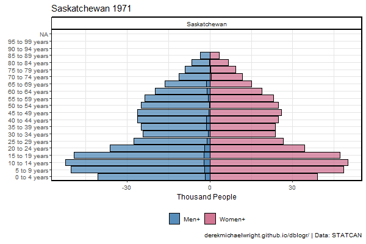

```{r}
mp <- gg_PopDem_anim(myArea = "Saskatchewan")
anim_save("canada_population_gif_2_04.gif", mp, 
          nframes = 300, fps = 20, end_pause = 80, 
          width = 600, height = 400, res = 80, units = "px")
```

---

## Manitoba


```{r}
mp <- gg_PopDem_anim(myArea = "Manitoba")
anim_save("canada_population_gif_2_05.gif", mp, 
          nframes = 300, fps = 20, end_pause = 80, 
          width = 600, height = 400, res = 80, units = "px")
```

---

## Ontario


```{r}
mp <- gg_PopDem_anim(myArea = "Ontario")
anim_save("canada_population_gif_2_06.gif", mp, 
          nframes = 300, fps = 20, end_pause = 80, 
          width = 600, height = 400, res = 80, units = "px")
```

---

## Quebec


```{r}
mp <- gg_PopDem_anim(myArea = "Quebec")
anim_save("canada_population_gif_2_07.gif", mp, 
          nframes = 300, fps = 20, end_pause = 80, 
          width = 600, height = 400, res = 80, units = "px")
```

---

## Newfoundland and Labrador


```{r}
mp <- gg_PopDem_anim(myArea = "Newfoundland and Labrador")
anim_save("canada_population_gif_2_08.gif", mp, 
          nframes = 300, fps = 20, end_pause = 80, 
          width = 600, height = 400, res = 80, units = "px")
```

---

## Yukon


```{r}
mp <- gg_PopDem_anim(myArea = "Yukon")
anim_save("canada_population_gif_2_09.gif", mp,
          nframes = 300, fps = 20, end_pause = 80, 
          width = 600, height = 400, res = 80, units = "px")
```

---

# Dual Year Population Pyramids {.tabset .tabset-pills}

## Plotting Function

```{r class.source = "fold-show"}
gg_PopDem_plot2 <- function(myArea = "Saskatchewan", myYears = c(1971,2022) ) {
  # Prep data
  xx <- d2 %>% 
    filter(Area == myArea, Year %in% myYears, Gender == "Total - gender", 
           !Age %in% c("All ages", "Median age")) 
  yy <- xx %>% spread(Year, Value)
  yy[is.na(yy[,5]),5] <- 0
  yy[is.na(yy[,6]),6] <- 0
  yy$Value <- yy[,6] - yy[,5] 
  yy <- yy %>%
    mutate(Year = ifelse(Value < 0, myYears[1], myYears[2]),
           Year = factor(Year))
  xx <- xx %>% 
    mutate(Value = ifelse(Year == myYears[1], -Value, Value),
           Year = factor(Year))
  # Plot
  ggplot(xx, aes(y = Value / 1000, x = Age, fill = Year)) + 
    geom_col(color = "black", alpha = 0.7) +
    geom_col(data = yy, color = "black", alpha = 0.7) +
    scale_fill_manual(name = NULL, values = c("darkgreen","purple4")) +
    theme_agData(legend.position = "bottom") + 
    labs(title = paste("Population in", myArea), x = NULL, 
         y = "Thousand People", caption = myCaption) +
    coord_cartesian(ylim = c(-max(xx$Value), max(xx$Value))) +
    coord_flip()
}
```

## Canada {.active}


```{r}
mp <- gg_PopDem_plot2(myArea = "Canada")
ggsave("canada_population_3_01.png", mp, width = 6, height = 4)
```

---

## British Columbia


```{r}
mp <- gg_PopDem_plot2(myArea = "British Columbia")
ggsave("canada_population_3_02.png", mp, width = 6, height = 4)
```

---

## Alberta


```{r}
mp <- gg_PopDem_plot2(myArea = "Alberta")
ggsave("canada_population_3_03.png", mp, width = 6, height = 4)
```

---

## Saskatchewan

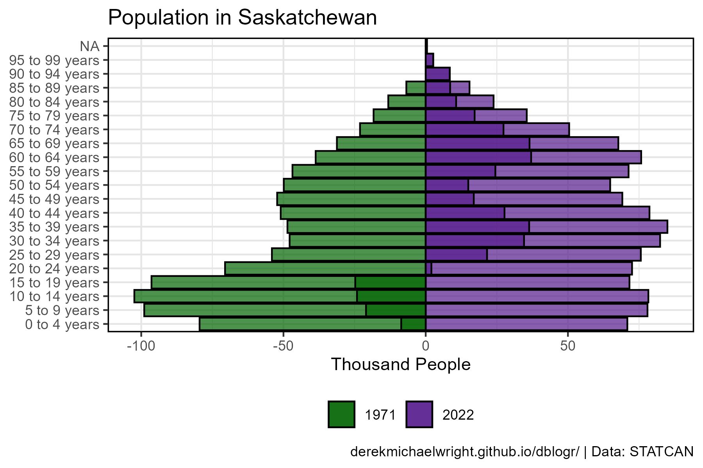

```{r}
mp <- gg_PopDem_plot2(myArea = "Saskatchewan")
ggsave("canada_population_3_04.png", mp, width = 6, height = 4)
```

---

## Manitoba


```{r}
mp <- gg_PopDem_plot2(myArea = "Manitoba")
ggsave("canada_population_3_05.png", mp, width = 6, height = 4)
```

---

## Ontario

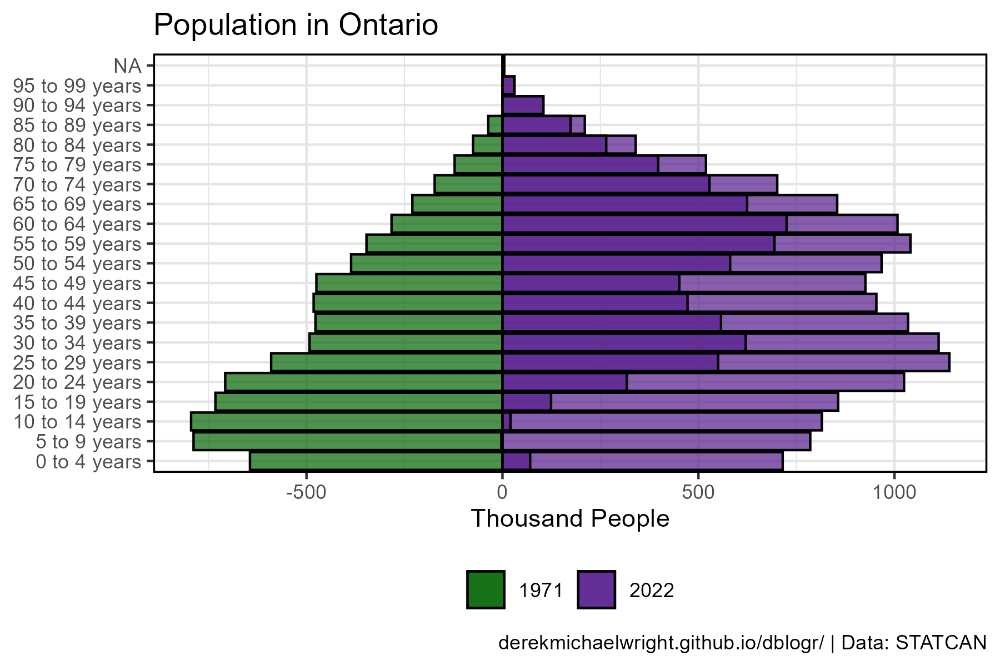

```{r}
mp <- gg_PopDem_plot2(myArea = "Ontario")
ggsave("canada_population_3_06.png", mp, width = 6, height = 4)
```

---

## Quebec

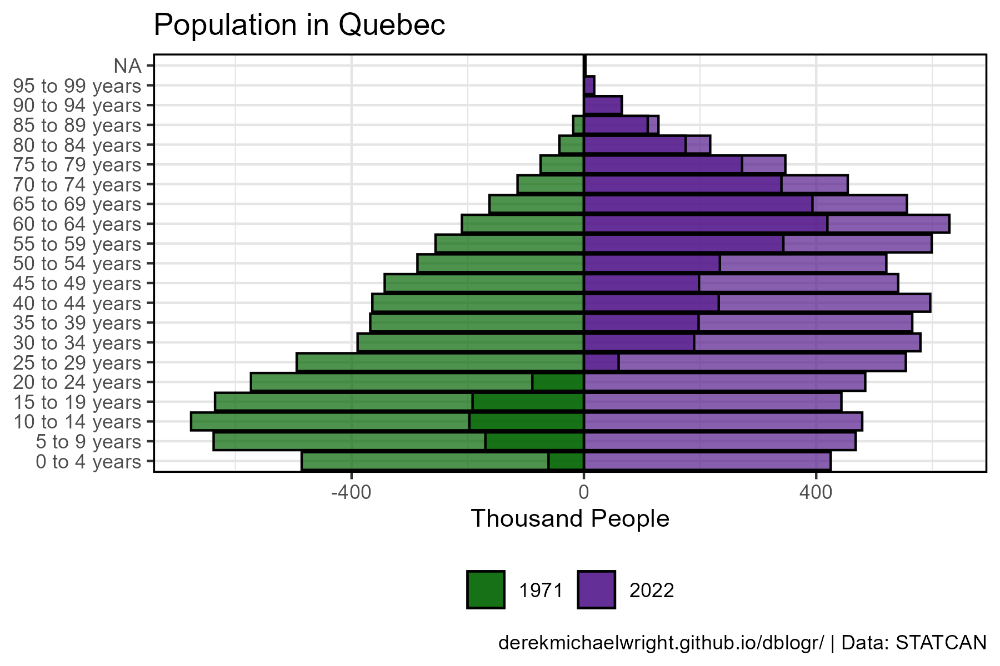

```{r}
mp <- gg_PopDem_plot2(myArea = "Quebec")
ggsave("canada_population_3_07.png", mp, width = 6, height = 4)
```

---

## Newfoundland and Labrador


```{r}
mp <- gg_PopDem_plot2(myArea = "Newfoundland and Labrador")
ggsave("canada_population_3_08.png", mp, width = 6, height = 4)
```

---

## Yukon

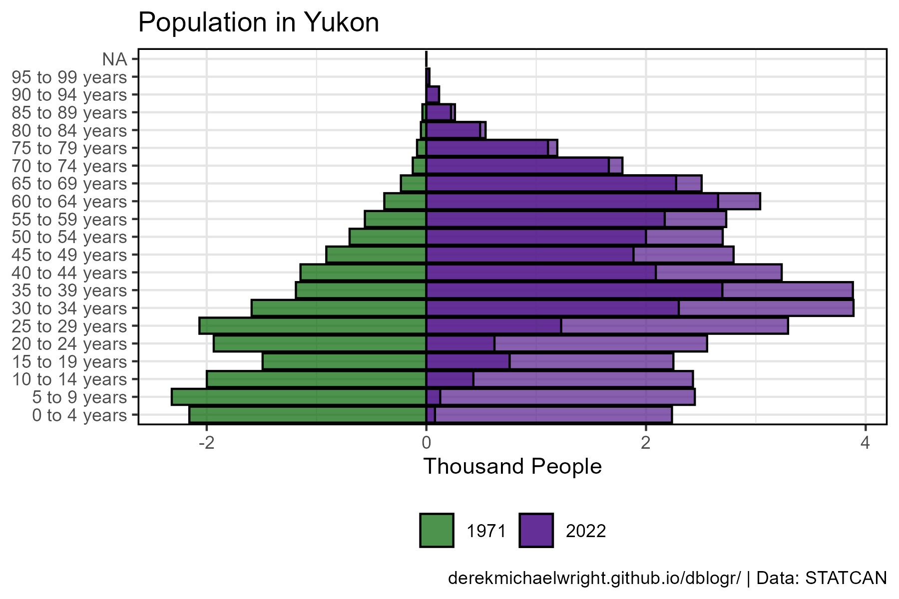

```{r}
mp <- gg_PopDem_plot2(myArea = "Yukon")
ggsave("canada_population_3_09.png", mp, width = 6, height = 4)
```

---

# Gender Ratios {.tabset .tabset-pills}

## Plotting Function

```{r class.source = "fold-show"}
gg_GenderRatio_plot <- function(myArea = "Saskatchewan", myYears = 2019) {
  # Prep data
  xx <- d2 %>% 
    filter(Area %in% myArea, Year %in% myYears, 
           !Age %in% c("All ages", "Median age"), 
           Gender %in% c("Men+", "Women+")) %>%
    spread(Gender, Value) %>%
    mutate(Value = `Women+` - `Men+`, 
           Group = ifelse(Value < 0, "More Men+", "More Women+"),
           Group = factor(Group, levels = c("More Men+", "More Women+")))
  # Plot
  ggplot(xx, aes(y = Value / 1000, x = Age, fill = Group)) + 
    geom_col(color = "black", alpha = 0.7) +
    scale_fill_manual(name = NULL, values = myColorsMF) +
    facet_grid(. ~ Year) +
    theme_agData(legend.position = "bottom") +
    labs(title = paste("Gender Ratio in", myArea), subtitle = "Women+ - Men+", 
         y = "Thousand People", x = NULL, caption = myCaption) +
    coord_cartesian(ylim = c(-max(xx$Value), max(xx$Value))) +
    coord_flip()
}
```

## Canada {.active}


```{r}
mp <- gg_GenderRatio_plot(myArea = "Canada", myYears = c(1971, 1995, 2024))
ggsave("canada_population_4_01.png", mp, width = 10, height = 4)
```

---

## British Columbia

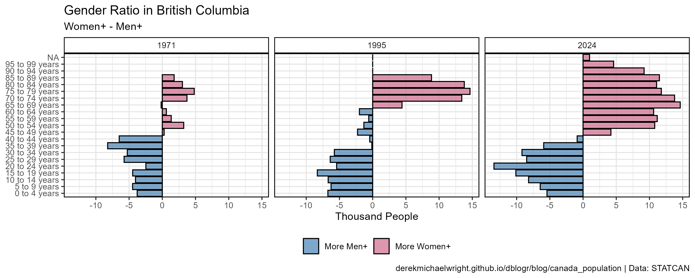

```{r}
mp <- gg_GenderRatio_plot(myArea = "British Columbia", myYears = c(1971, 1995, 2024))
ggsave("canada_population_4_02.png", mp, width = 10, height = 4)
```

---

## Alberta

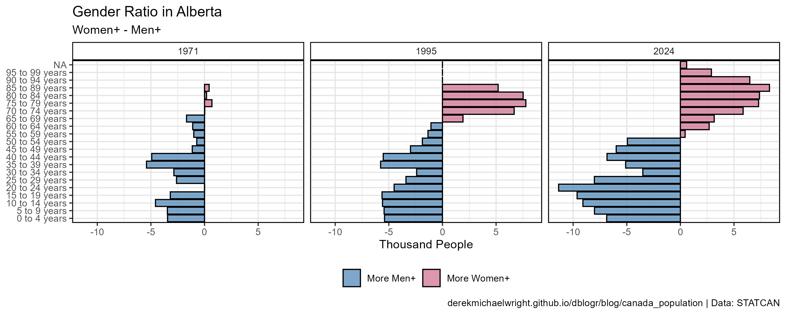

```{r}
mp <- gg_GenderRatio_plot(myArea = "Alberta", myYears = c(1971, 1995, 2024))
ggsave("canada_population_4_03.png", mp, width = 10, height = 4)
```

---

## Saskatchewan

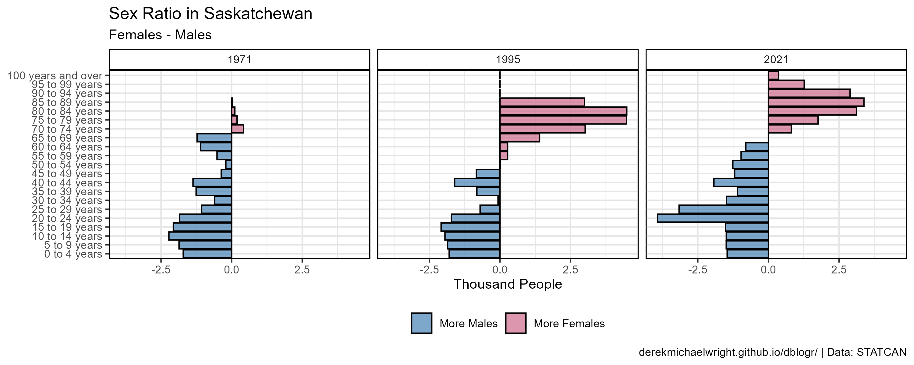

```{r}
mp <- gg_GenderRatio_plot(myArea = "Saskatchewan", myYears = c(1971, 1995, 2024))
ggsave("canada_population_4_04.png", mp, width = 10, height = 4)
```

---

## Manitoba

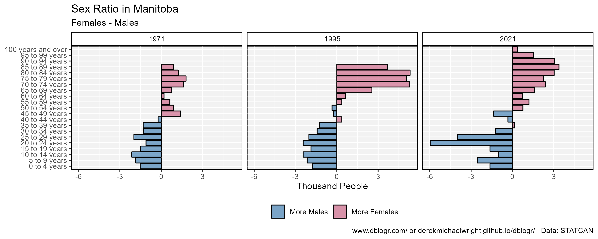

```{r}
mp <- gg_GenderRatio_plot(myArea = "Manitoba", myYears = c(1971, 1995, 2024))
ggsave("canada_population_4_05.png", mp, width = 10, height = 4)
```

---

## Ontario

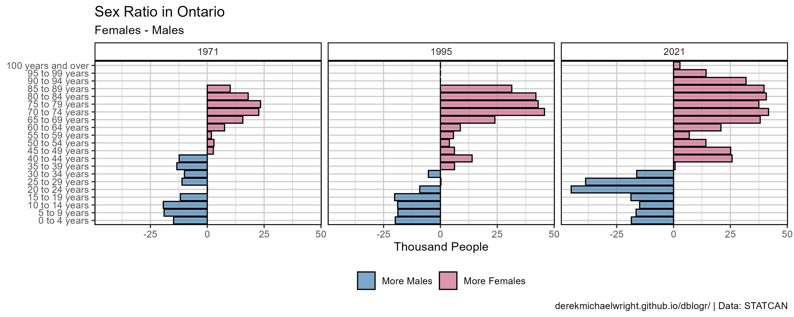

```{r}
mp <- gg_GenderRatio_plot(myArea = "Ontario", myYears = c(1971, 1995, 2024))
ggsave("canada_population_4_06.png", mp, width = 10, height = 4)
```

---

## Quebec

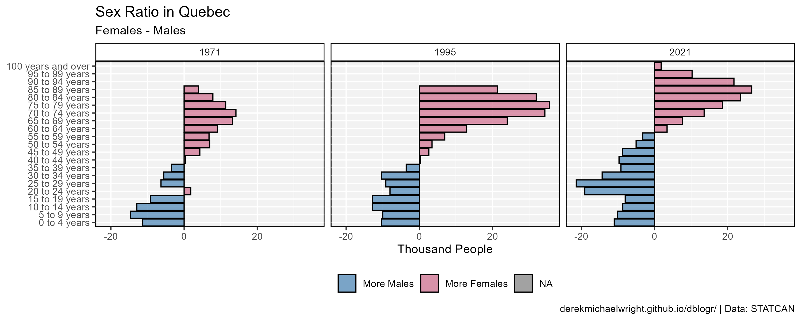

```{r}
mp <- gg_GenderRatio_plot(myArea = "Quebec", myYears = c(1971, 1995, 2024))
ggsave("canada_population_4_07.png", mp, width = 10, height = 4)
```

---

## Newfoundland and Labrador

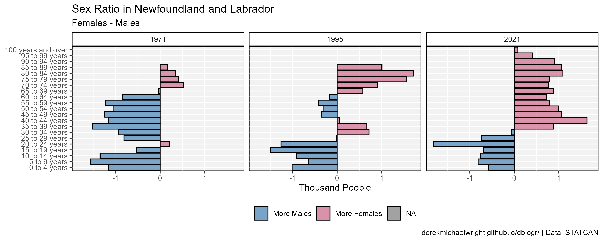

```{r}
mp <- gg_GenderRatio_plot(myArea = "Newfoundland and Labrador", 
                     myYears = c(1971, 1995, 2024))
ggsave("canada_population_4_08.png", mp, width = 10, height = 4)
```

---

## Yukon

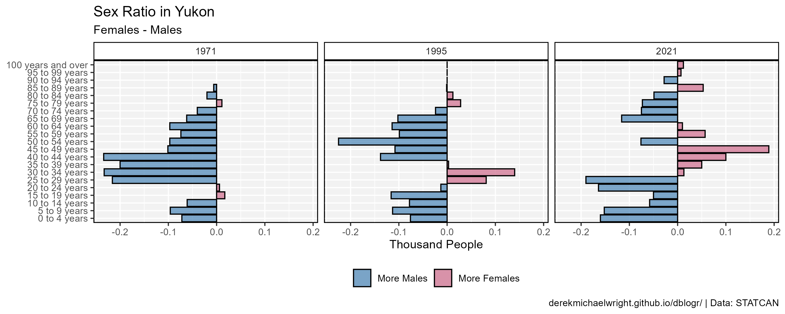

```{r}
mp <- gg_GenderRatio_plot(myArea = "Yukon", myYears = c(1971, 1995, 2024))
ggsave("canada_population_4_09.png", mp, width = 10, height = 4)
```

---

# Excess Young Males {.tabset .tabset-pills}

## Plotting Function

```{r class.source = "fold-show"}
gg_ExcessMales_plot <- function(myArea = "Saskatchewan") {
  # Prep data
  xx <- d2 %>% 
    filter(Area %in% myArea, 
           Age %in% myAges[1:8], 
           Gender %in% c("Men+", "Women+")) %>%
    group_by(Year, Gender) %>%
    summarise(Value = sum(Value)) %>%
    ungroup() %>%
    spread(Gender, Value) %>%
    mutate(Value = `Men+` - `Women+`)
  # Plot
  ggplot(xx, aes(y = Value / 1000, x = Year)) + 
    geom_col(color = "black", fill = "steelblue", alpha = 0.7) +
    theme_agData(legend.position = "bottom") +
    labs(title = paste("Excess Males Under Age 40 in", myArea), 
         y = "Thousand People", x = NULL, caption = myCaption) 
}
```

## Canada {.active}

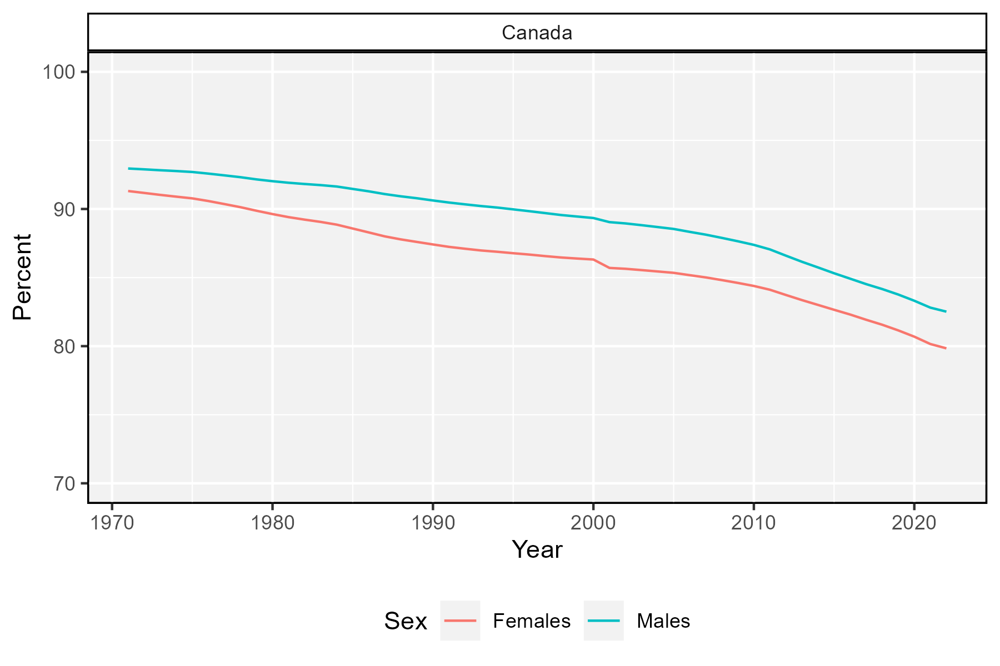

```{r}
mp <- gg_ExcessMales_plot(myArea = "Canada")
ggsave("canada_population_5_01.png", mp, width = 10, height = 4)
```

---

## British Columbia

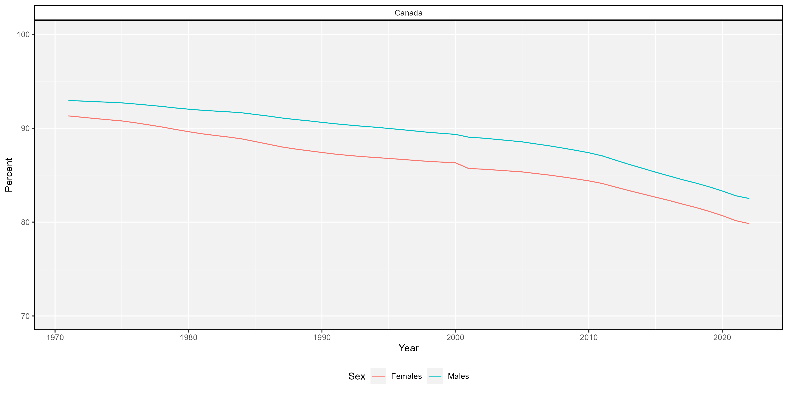

```{r}
mp <- gg_ExcessMales_plot(myArea = "British Columbia")
ggsave("canada_population_5_02.png", mp, width = 10, height = 4)
```

---

## Alberta

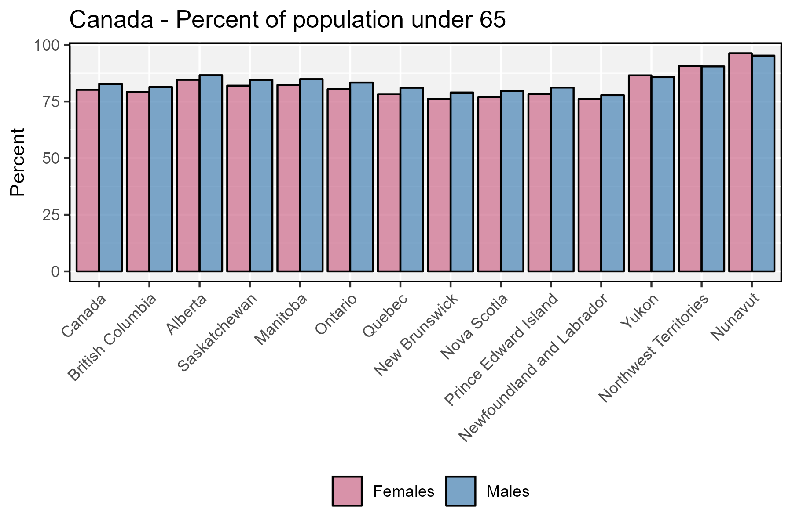

```{r}
mp <- gg_ExcessMales_plot(myArea = "Alberta")
ggsave("canada_population_5_03.png", mp, width = 10, height = 4)
```

---

## Saskatchewan

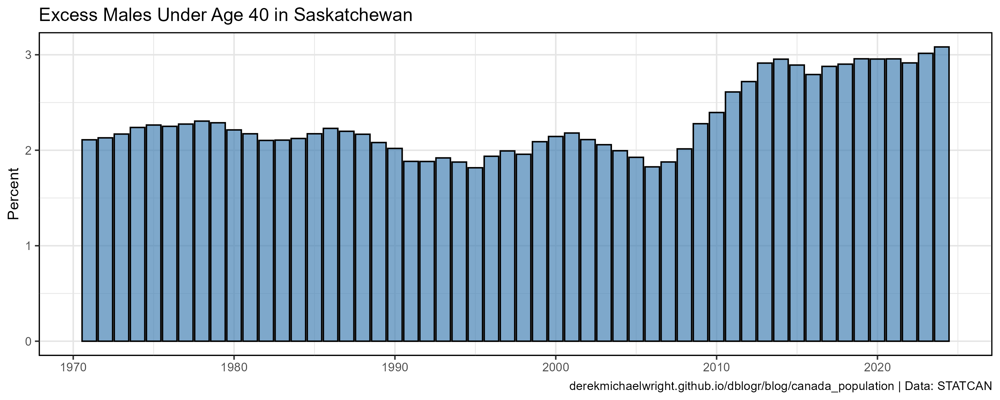

```{r}
mp <- gg_ExcessMales_plot(myArea = "Saskatchewan")
ggsave("canada_population_5_04.png", mp, width = 10, height = 4)
```

---

## Manitoba

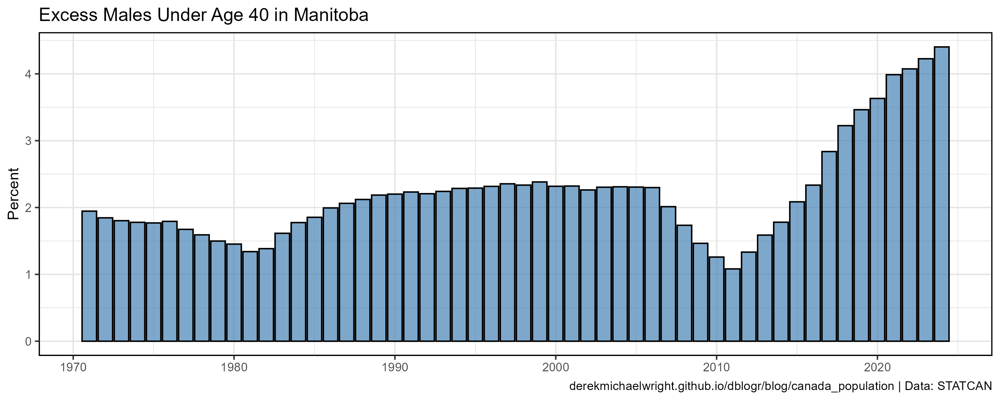

```{r}
mp <- gg_ExcessMales_plot(myArea = "Manitoba")
ggsave("canada_population_5_05.png", mp, width = 10, height = 4)
```

---

## Ontario

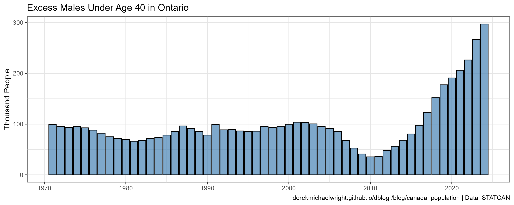

```{r}
mp <- gg_ExcessMales_plot(myArea = "Ontario")
ggsave("canada_population_5_06.png", mp, width = 10, height = 4)
```

---

## Quebec

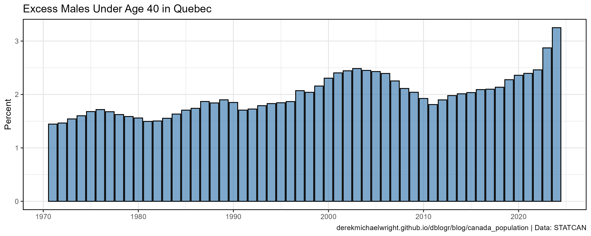

```{r}
mp <- gg_ExcessMales_plot(myArea = "Quebec")
ggsave("canada_population_5_07.png", mp, width = 10, height = 4)
```

---

## Newfoundland and Labrador

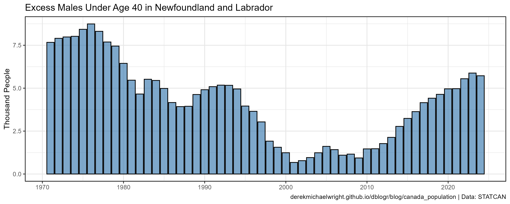

```{r}
mp <- gg_ExcessMales_plot(myArea = "Newfoundland and Labrador")
ggsave("canada_population_5_08.png", mp, width = 10, height = 4)
```

---

## Yukon

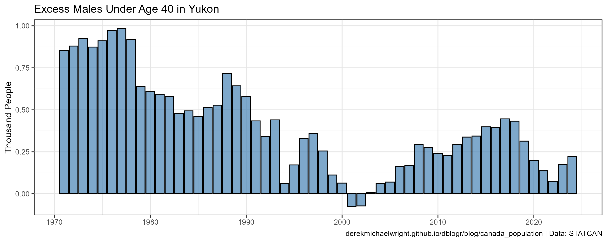

```{r}
mp <- gg_ExcessMales_plot(myArea = "Yukon")
ggsave("canada_population_5_09.png", mp, width = 10, height = 4)
```

---

# Age Line Graphs {.tabset .tabset-pills}

## Men+ vs. Women+

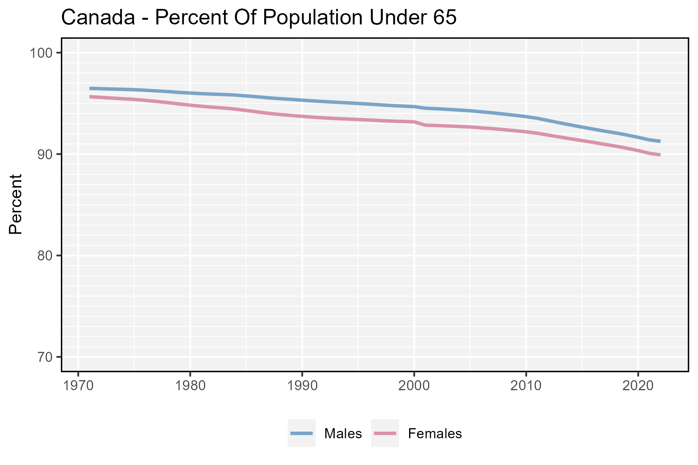

```{r}
# Prep data
xx <- d2 %>%
  filter(Area == "Canada", Gender %in% c("Men+","Women+"), Age != "Median age")
# Plot
mp <- ggplot(xx, aes(x = Year, y = Value / 1000000, color = Gender)) +
  geom_line(size = 1, alpha = 0.7) +
  facet_wrap(Age ~ ., scales = "free_y", ncol = 7) +
  scale_color_manual(name = NULL, values = myColorsMF) +
  theme_agData(legend.position = "bottom",
               axis.text.x = element_text(angle = 45, hjust = 1)) +
  labs(title = "Canadian Population Dynamics", 
       y = "Million People", x = NULL, caption = myCaption)
ggsave("canada_population_6_01.png", mp, width = 12, height = 6)
```

---

## Animation

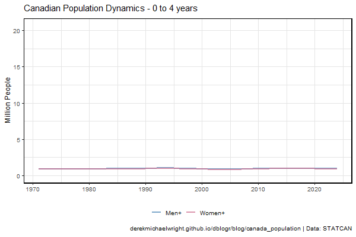

```{r}
xx <- d2 %>%
  filter(Area == "Canada", Gender %in% c("Men+","Women+"), 
         Age != "Median age", !is.na(Value))
# Plot
mp <- ggplot(xx, aes(x = Year, y = Value / 1000000, color = Gender, group = Gender)) +
  geom_line(size = 1, alpha = 0.7) +
  scale_color_manual(name = NULL, values = myColorsMF) +
  theme_agData(legend.position = "bottom") +
  labs(y = "Million People", x = NULL, caption = myCaption) +
  labs(title = paste("Canadian Population Dynamics -", '{closest_state}')) +
  transition_states(Age, transition_length = 1, state_length = 1) +
  ease_aes('linear')
anim_save("canada_population_gif_6_01.gif", mp, 
          nframes = 300, fps = 20, end_pause = 80, 
          width = 600, height = 400, res = 80, units = "px")
```

---

# Old vs Young {.tabset .tabset-pills}

## Canada


```{r}
# Prep data
xx <- d2 %>% 
  filter(Gender %in% c("Men+", "Women+")) %>%
  mutate(Group = ifelse(Age %in% myAges[14:21], "old", "Young")) %>%
  group_by(Year, Area, Gender, Group) %>%
  summarise(Value = sum(Value, na.rm = T)) %>% 
  ungroup() %>%
  group_by(Year, Area, Gender) %>%
  mutate(Total = sum(Value, na.rm = T)) %>% 
  ungroup() %>%
  mutate(Percent = 100 * Value / Total)
# Plot
mp <- ggplot(xx %>% filter(Area == "Canada", Group == "Young"), 
       aes(x = Year, y = Percent, color = Gender)) +
  geom_line(alpha = 0.7, size = 1) +
  scale_color_manual(name = NULL, values = myColorsMF) +
  scale_y_continuous(minor_breaks = 70:100, limits = c(70,100)) +
  theme_agData(legend.position = "bottom") +
  labs(title = "Canada - Percent Of Population Under 65", x = NULL)
ggsave("canada_population_7_01.png", mp, width = 6, height = 4)
```

---

## Provinces 


```{r}
# Plot
mp <-ggplot(xx %>% filter(Area != "Canada", Group == "Young"), 
       aes(x = Year, y = Percent, color = Gender)) +
  geom_line(alpha = 0.7, size = 1) +
  scale_color_manual(name = NULL, values = myColorsMF) +
  facet_wrap(Area ~ ., ncol = 5) +
  scale_y_continuous(minor_breaks = 70:100, limits = c(70,100)) +
  theme_agData(legend.position = "bottom") +
  labs(title = "Canada - Percent Of Population Under 65", x = NULL)
ggsave("canada_population_7_02.png", mp, width = 12, height = 6)
```

---

## 2021

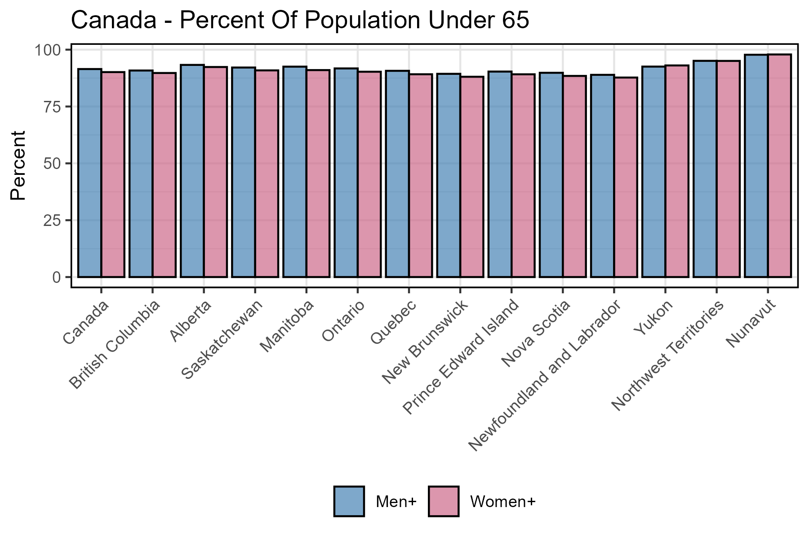

```{r}
# Prep data
xx <- xx %>% filter(Year == 2021, Group == "Young")
# Plot
mp <- ggplot(xx, aes(x = Area, y = Percent, fill = Gender)) +
  geom_col(position = "dodge", color = "black", alpha = 0.7) +
  scale_fill_manual(name = NULL, values = myColorsMF) +
  theme_agData(legend.position = "bottom",
               axis.text.x = element_text(angle = 45, hjust = 1)) +
  labs(title = "Canada - Percent Of Population Under 65", x = NULL)
ggsave("canada_population_7_03.png", mp, width = 6, height = 4)
```

---
