```{r setup, include=FALSE}
knitr::opts_chunk$set(echo = T, message = F, warning = F)
```

---

# Data

https://www150.statcan.gc.ca/t1/tbl1/en/cv.action?pid=1710000901

`r shiny::icon("save")` [1710000901_databaseLoadingData.csv](1710000901_databaseLoadingData.csv)

https://www150.statcan.gc.ca/t1/tbl1/en/cv.action?pid=1710000501

`r shiny::icon("save")` [1710000501_databaseLoadingData.csv](1710000501_databaseLoadingData.csv)

```{r class.source = 'fold-show'}
# devtools::install_github("derekmichaelwright/agData")
library(agData)
library(gganimate)
library(transformr)
```

---

# Prepare Data

```{r}
# Prep data
myAreas <- c("Canada", "Ontario", "Quebec", "New Brunswick", "Nova Scotia",
           "Prince Edward Island", "Newfoundland and Labrador",
           "British Columbia", "Alberta","Saskatchewan", "Manitoba",
           "Yukon", "Northwest Territories including Nunavut", 
           "Northwest Territories", "Nunavut")
myAges <- c("0 to 4 years", "5 to 9 years", 
          "10 to 14 years", "15 to 19 years",
          "20 to 24 years", "25 to 29 years", 
          "30 to 34 years", "35 to 39 years",
          "40 to 44 years", "45 to 49 years", 
          "50 to 54 years", "55 to 59 years",
          "60 to 64 years", "65 to 69 years", 
          "70 to 74 years", "75 to 79 years",
          "80 to 84 years", "85 to 89 years", 
          "90 to 94 years", "95 to 99 years",
          "100 years and over")
#
d1 <- read.csv("1710000901_databaseLoadingData.csv") %>%
  select(Year=1, Area=GEO, Unit=UOM, Value=VALUE) %>%
  mutate(Area = factor(Area, levels = myAreas),
         Month = substr(Year, 6, 8),
         Year = substr(Year, 1,4),
         Year = as.numeric(Year),
         Month = as.numeric(Month),
         Date = as.Date(paste(Year, Month, "01", sep = "-")))
#
d2 <- read.csv("1710000501_databaseLoadingData.csv")  %>%
  select(Year=1, Area=GEO, Sex, Age=Age.group, Unit=UOM, Value=VALUE) %>%
  mutate(Area = factor(Area, levels = myAreas),
         Age = factor(Age, levels = myAges),
         Year = substr(Year, 1,4),
         Year = as.numeric(Year)) %>%
  filter(!is.na(Age))
myCaption <- "\u00A9 derekmichaelwright.github.io/dblogr/ | Data: STATCAN"
```

---

# Population


```{r}
# Prep data
myBreaks <- as.Date(paste0(seq(1950, 2020, by = 10), "-01-01"))
# Plot
mp <- ggplot(d1, aes(x = Date, y = Value / 1000000)) +
  geom_line(size = 1, color = "darkgreen", alpha = 0.7) +
  facet_wrap(Area ~ ., ncol = 4, scales = "free_y") +
  scale_x_date(breaks = myBreaks, date_labels = "%Y") +
  theme_agData(legend.position = "none", 
               axis.text.x = element_text(angle = 45, hjust = 1)) +
  labs(title = "Canadian Population", 
       y = "Million People", x = NULL, caption = myCaption)
ggsave("canada_population_1_01.png", mp, width = 10, height = 6)
```

---

## Saskatchewan


```{r}
# Prep data
xx <- d1 %>% filter(Area == "Saskatchewan")
myBreaks <- as.Date(paste0(seq(1950, 2020, by = 10), "-01-01"))
# Plot
mp <- ggplot(xx, aes(x = Date, y = Value / 1000000)) +
  geom_line(size = 1, color = "darkgreen", alpha = 0.7) +
  facet_wrap(Area ~ ., ncol = 4, scales = "free_y") +
  scale_x_date(breaks = myBreaks, date_labels = "%Y") +
  theme_agData(legend.position = "none") +
  labs(title = "Population", 
       y = "Million People", x = NULL, caption = myCaption)
ggsave("canada_population_1_02.png", mp, width = 6, height = 4)
```

---

# Population Pyramids

```{r}
gg_PopDem_plot <- function(area = "Saskatchewan", years = 2019 ) {
  # Prep data
  xx <- d2 %>% 
    filter(Area == area, Year %in% years, Age %in% myAges) 
  # Plot
  mp <- ggplot(xx, aes(y = Value / 1000, x = Age, fill = Sex)) + 
    geom_bar(data = xx %>% filter(Sex == "Males"), stat = "identity",
             color = "black", alpha = 0.7) +
    geom_bar(data = xx %>% filter(Sex == "Females"), stat = "identity",
             color = "black", alpha = 0.7, aes(y = -Value / 1000)) +
    scale_fill_manual(name = NULL, values = c("palevioletred3", "steelblue")) +
    facet_grid(. ~ Year) + 
    theme_agData(legend.position = "bottom", 
                 axis.text.x = element_blank(),
                 axis.ticks.x = element_blank()) +
    labs(title = area, y = NULL, x = NULL, caption = myCaption) +
    coord_cartesian(ylim = c(-max(xx$Value), max(xx$Value))) +
    coord_flip()
}
```

## Canada

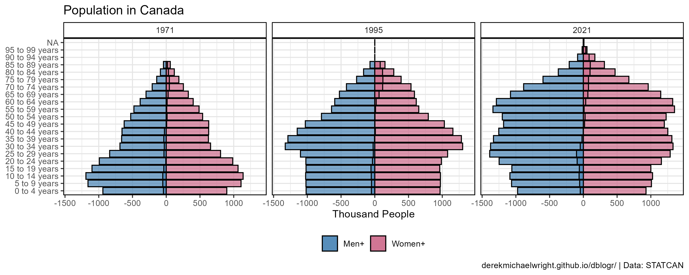

```{r}
mp <- gg_PopDem_plot(area = "Canada", years = c(1971, 1995, 2020))
ggsave("canada_population_2_01.png", mp, width = 10, height = 4)
```

```{r echo = F}
ggsave("featured.png", mp, width = 10, height = 4)
```

---

## British Columbia

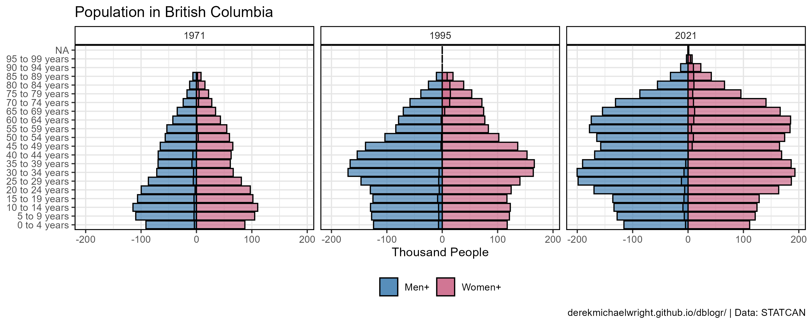

```{r}
mp <- gg_PopDem_plot(area = "British Columbia", years = c(1971, 1995, 2020))
ggsave("canada_population_2_02.png", mp, width = 10, height = 4)
```

---

## Alberta


```{r}
mp <- gg_PopDem_plot(area = "Alberta", years = c(1971, 1995, 2020))
ggsave("canada_population_2_03.png", mp, width = 10, height = 4)
```

---

## Saskatchewan

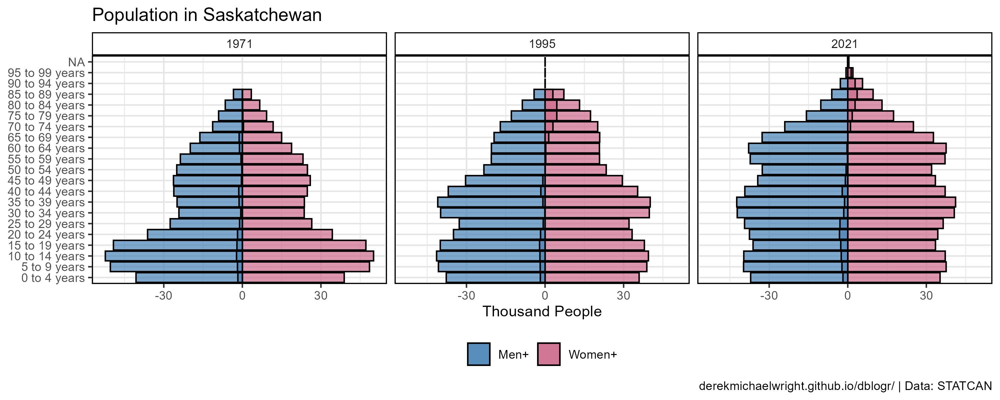

```{r}
mp <- gg_PopDem_plot(area = "Saskatchewan", years = c(1971, 1995, 2020))
ggsave("canada_population_2_04.png", mp, width = 10, height = 4)
```

---

## Manitoba


```{r}
mp <- gg_PopDem_plot(area = "Manitoba", years = c(1971, 1995, 2020))
ggsave("canada_population_2_05.png", mp, width = 10, height = 4)
```

---

## Ontario


```{r}
mp <- gg_PopDem_plot(area = "Ontario", years = c(1971, 1995, 2020))
ggsave("canada_population_2_06.png", mp, width = 10, height = 4)
```

---

## Quebec


```{r}
mp <- gg_PopDem_plot(area = "Quebec", years = c(1971, 1995, 2020))
ggsave("canada_population_2_07.png", mp, width = 10, height = 4)
```

---

## Newfoundland and Labrador


```{r}
mp <- gg_PopDem_plot(area = "Newfoundland and Labrador", 
                     years = c(1971, 1995, 2020))
ggsave("canada_population_2_08.png", mp, width = 10, height = 4)
```

---

## Yukon

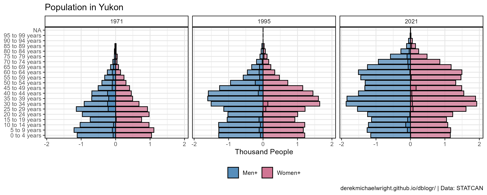

```{r}
mp <- gg_PopDem_plot(area = "Yukon", years = c(1971, 1995, 2020))
ggsave("canada_population_2_09.png", mp, width = 10, height = 4)
```

---

# Animated Population Pyramids

```{r}
gg_PopDem_anim <- function(area = "Saskatchewan") {
  # Prep data
  xx <- d2 %>% 
    filter(Area %in% area, Age %in% myAges) %>%
    mutate(Value = Value / 1000)
  # Plot
  mp <- ggplot(xx, aes(y = Value / 1000, x = Age, fill = Sex)) + 
    geom_bar(data = xx %>% filter(Sex == "Males"), stat = "identity",
             color = "black", alpha = 0.7) +
    geom_bar(data = xx %>% filter(Sex == "Females"), stat = "identity",
             color = "black", alpha = 0.7, aes(y = -Value / 1000)) +
    scale_fill_manual(name = NULL, values = c("palevioletred3", "steelblue")) +
    facet_grid(. ~ Area) + 
    theme_agData(legend.position = "bottom", 
                 axis.text.x = element_blank(),
                 axis.ticks.x = element_blank()) +
    labs(title = title, y = NULL, x = NULL, caption = myCaption) +
    coord_cartesian(ylim = c(-max(xx$Value), max(xx$Value))) +
    coord_flip() +
    # gganimate specific bits
    labs(title = paste(area, '{round(frame_time)}')) +
    transition_time(Year) +
    ease_aes('linear')
}
```

## Canada


```{r}
mp <- gg_PopDem_anim(area = "Canada")
anim_save("canada_population_gif_2_01.gif", mp, 
          nframes = 300, fps = 60, end_pause = 90, 
          width = 900, height = 600, res = 150)
```

---

## British Columbia

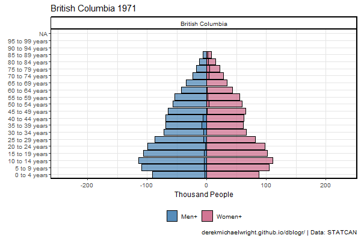

```{r}
mp <- gg_PopDem_anim(area = "British Columbia")
anim_save("canada_population_gif_2_02.gif", mp, 
          nframes = 300, fps = 60, end_pause = 90, 
          width = 900, height = 600, res = 150)
```

---

## Alberta

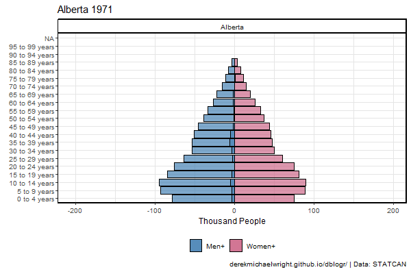

```{r}
mp <- gg_PopDem_anim(area = "Alberta")
anim_save("canada_population_gif_2_03.gif", mp, 
          nframes = 300, fps = 60, end_pause = 90, 
          width = 900, height = 600, res = 150)
```

---

## Saskatchewan


```{r}
mp <- gg_PopDem_anim(area = "Saskatchewan")
anim_save("canada_population_gif_2_04.gif", mp, 
          nframes = 300, fps = 60, end_pause = 90, 
          width = 900, height = 600, res = 150)
```

---

## Manitoba

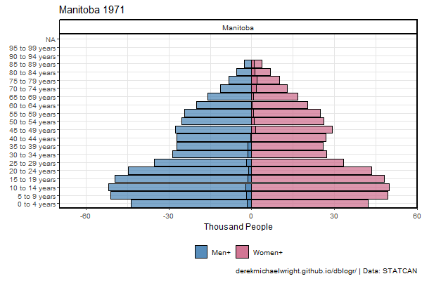

```{r}
mp <- gg_PopDem_anim(area = "Manitoba")
anim_save("canada_population_gif_2_05.gif", mp, 
          nframes = 300, fps = 60, end_pause = 90, 
          width = 900, height = 600, res = 150)
```

---

## Ontario


```{r}
mp <- gg_PopDem_anim(area = "Ontario")
anim_save("canada_population_gif_2_06.gif", mp, 
          nframes = 300, fps = 60, end_pause = 90, 
          width = 900, height = 600, res = 150)
```

---

## Quebec

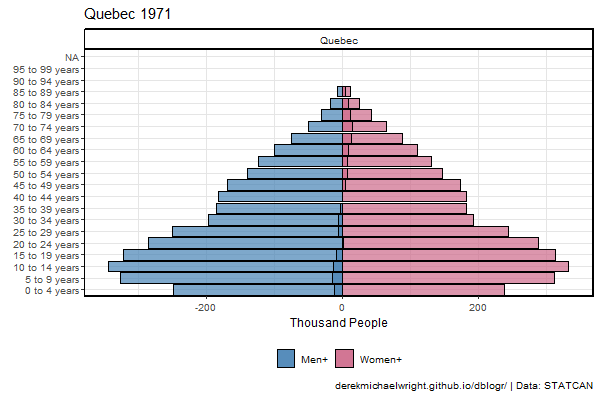

```{r}
mp <- gg_PopDem_anim(area = "Quebec")
anim_save("canada_population_gif_2_07.gif", mp, 
          nframes = 300, fps = 60, end_pause = 90, 
          width = 900, height = 600, res = 150)
```

---

## Newfoundland and Labrador

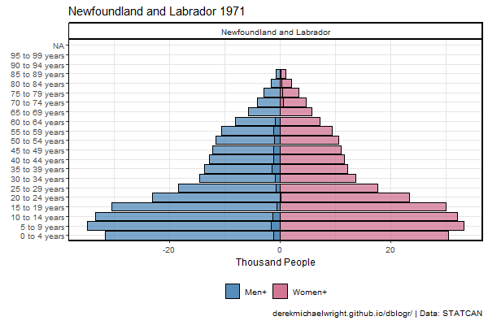

```{r}
mp <- gg_PopDem_anim(area = "Newfoundland and Labrador")
anim_save("canada_population_gif_2_08.gif", mp, 
          nframes = 300, fps = 60, end_pause = 90, 
          width = 900, height = 600, res = 150)
```

---

## Yukon


```{r}
mp <- gg_PopDem_anim(area = "Yukon")
anim_save("canada_population_gif_2_09.gif", mp,
          nframes = 300, fps = 60, end_pause = 90, 
          width = 900, height = 600, res = 150)
```

---

# Sex Ratios

```{r}
gg_SexRatio_plot <- function(area = "Saskatchewan", years = 2019) {
  # Prep data
  xx <- d2 %>% 
    filter(Area %in% area, Year %in% years, 
           Age %in% myAges, Sex %in% c("Males","Females")) %>%
    spread(Sex, Value) %>%
    mutate(Value = Males - Females, 
           Group = ifelse(Value < 0, "More Females", "More Males"))
  # Plot
  ggplot(xx, aes(y = Value, x = Age, fill = Group)) + 
    geom_bar(stat = "identity", color = "black", alpha = 0.7) +
    scale_fill_manual(name = NULL, values = c("darkred","steelblue")) +
    facet_grid(Area ~ Year) +
    theme_agData(legend.position = "bottom", 
                 axis.text.x = element_blank(),
                 axis.ticks.x = element_blank()) +
    labs(title = area, subtitle = "Females - Males", 
         y = NULL, x = NULL, caption = myCaption) +
    coord_cartesian(ylim = c(-max(xx$Value), max(xx$Value))) +
    coord_flip()
}
```

## Canada

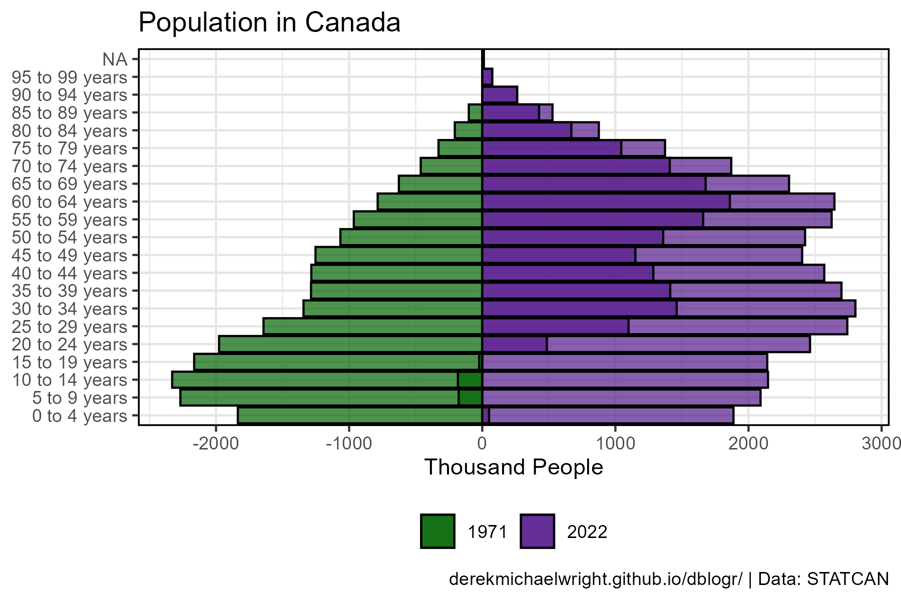

```{r}
mp <- gg_SexRatio_plot(area = "Canada", years = c(1971, 1995, 2020))
ggsave("canada_population_3_01.png", mp, width = 10, height = 4)
```

---

## British Columbia

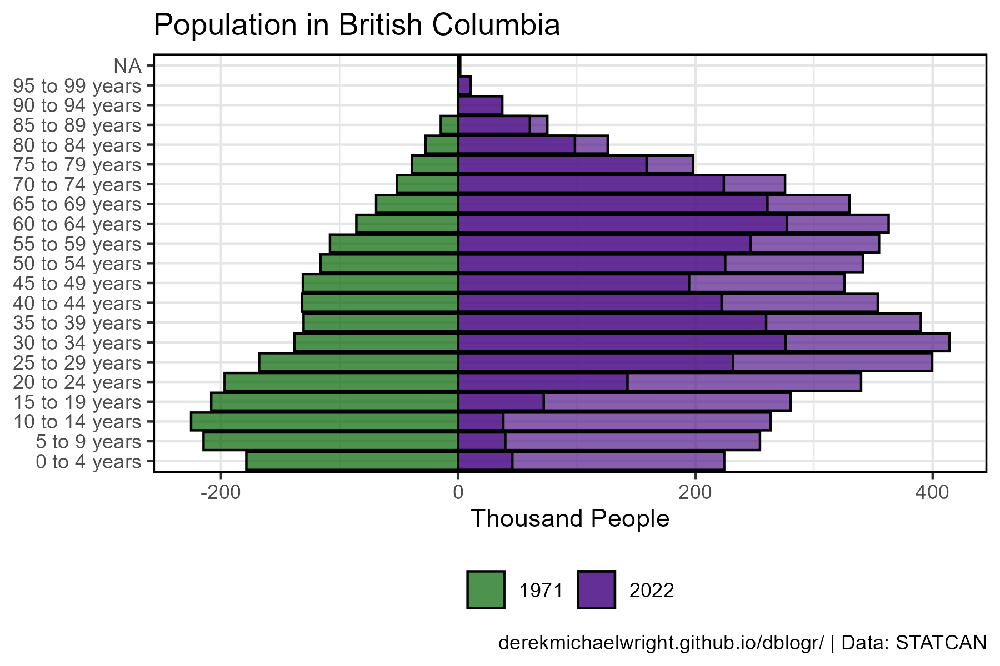

```{r}
mp <- gg_SexRatio_plot(area = "British Columbia", years = c(1971, 1995, 2020))
ggsave("canada_population_3_02.png", mp, width = 10, height = 4)
```

---

## Alberta


```{r}
mp <- gg_SexRatio_plot(area = "Alberta", years = c(1971, 1995, 2020))
ggsave("canada_population_3_03.png", mp, width = 10, height = 4)
```

---

## Saskatchewan


```{r}
mp <- gg_SexRatio_plot(area = "Saskatchewan", years = c(1971, 1995, 2020))
ggsave("canada_population_3_04.png", mp, width = 10, height = 4)
```

---

## Manitoba

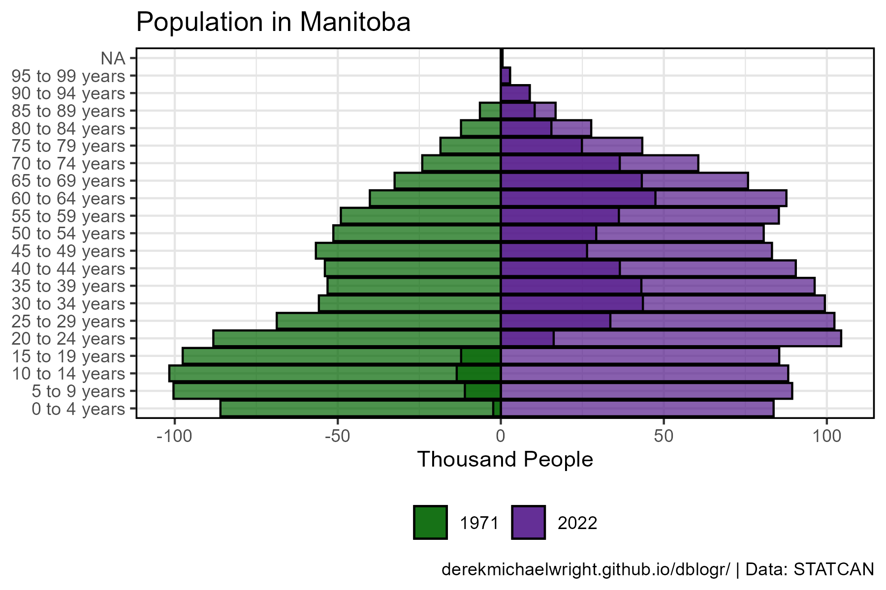

```{r}
mp <- gg_SexRatio_plot(area = "Manitoba", years = c(1971, 1995, 2020))
ggsave("canada_population_3_05.png", mp, width = 10, height = 4)
```

---

## Ontario


```{r}
mp <- gg_SexRatio_plot(area = "Ontario", years = c(1971, 1995, 2020))
ggsave("canada_population_3_06.png", mp, width = 10, height = 4)
```

---

## Quebec


```{r}
mp <- gg_SexRatio_plot(area = "Quebec", years = c(1971, 1995, 2020))
ggsave("canada_population_3_07.png", mp, width = 10, height = 4)
```

---

## Newfoundland and Labrador

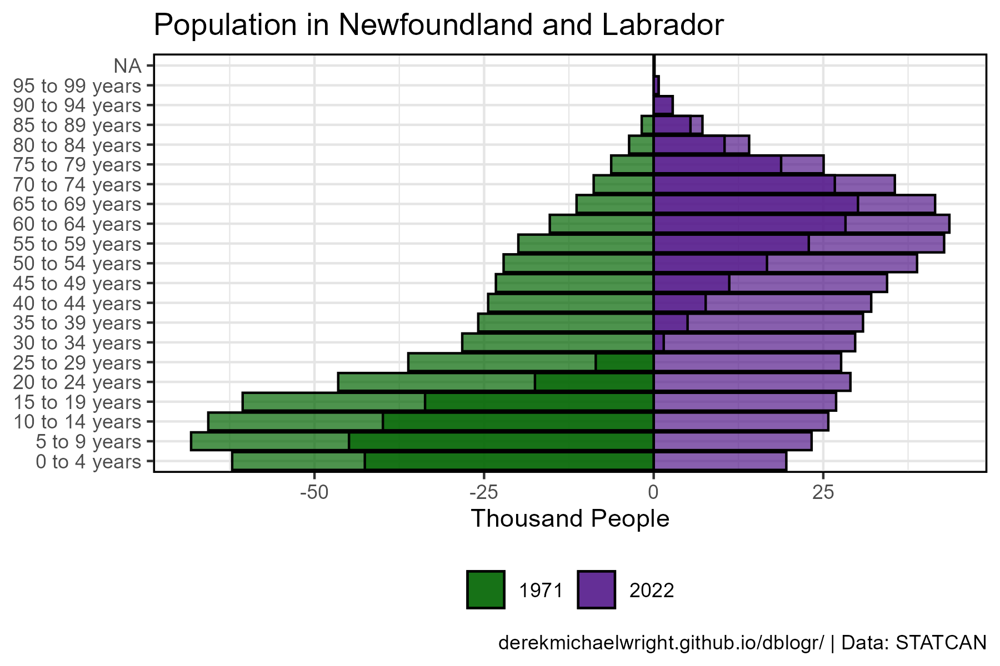

```{r}
mp <- gg_SexRatio_plot(area = "Newfoundland and Labrador", 
                     years = c(1971, 1995, 2020))
ggsave("canada_population_3_08.png", mp, width = 10, height = 4)
```

---

## Yukon


```{r}
mp <- gg_SexRatio_plot(area = "Yukon", years = c(1971, 1995, 2020))
ggsave("canada_population_3_09.png", mp, width = 10, height = 4)
```

---

# Age Line Graphs

## Males vs. Females


```{r}
# Prep data
xx <- d2 %>%
  filter(Area == "Canada", Sex %in% c("Males","Females"), Age %in% myAges)
# Plot
mp <- ggplot(xx, aes(x = Year, y = Value / 1000000, color = Sex)) +
  geom_line(size = 1, alpha = 0.7) +
  facet_wrap(Age ~ ., scales = "free_y", ncol = 6) +
  scale_color_manual(name = NULL, values = c("palevioletred3","steelblue")) +
  theme_agData(legend.position = "bottom",
               axis.text.x = element_text(angle = 45, hjust = 1)) +
  labs(title = "Canadian Population Dynamics", 
       y = "Million People", x = NULL, caption = myCaption)
ggsave("canada_population_4_01.png", mp, width = 12, height = 6)
```

---

## Animation

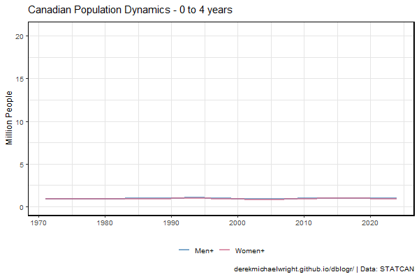

```{r}
xx <- d2 %>%
  filter(Area == "Canada", Sex %in% c("Males","Females"), !is.na(Value))
# Plot
mp <- ggplot(xx, aes(x = Year, y = Value / 1000000, color = Sex, group = Sex)) +
  geom_line(size = 1, alpha = 0.7) +
  scale_color_manual(name = NULL, values = c("palevioletred3","steelblue")) +
  theme_agData(legend.position = "bottom") +
  labs(y = "Million People", x = NULL, caption = myCaption) +
  labs(title = paste("Canadian Population Dynamics -", '{closest_state}')) +
  transition_states(Age, transition_length = 1, state_length = 1) +
  ease_aes('linear')
anim_save("canada_population_gif_4_01.gif", mp, 
          nframes = 300, fps = 60, 
          width = 900, height = 600, res = 150)
```

---

# Old vs Young

## Canada

```{r}
# Prep data
xx <- d2 %>% 
  filter(Sex %in% c("Males", "Females")) %>%
  mutate(Group = ifelse(Age %in% myAges[14:21], "old", "Young")) %>%
  group_by(Year, Area, Sex, Group) %>%
  summarise(Value = sum(Value, na.rm = T)) %>% 
  ungroup() %>%
  group_by(Year, Area, Sex) %>%
  mutate(Total = sum(Value, na.rm = T)) %>% 
  ungroup() %>%
  mutate(Percent = 100 * Value / Total)
# Plot
mp <- ggplot(xx %>% filter(Area == "Canada", Group == "Young"), 
       aes(x = Year, y = Percent, color = Sex)) +
  geom_line() +
  ylim(c(70,100)) +
  facet_wrap(Area ~ .) +
  theme_agData(legend.position = "bottom")
ggsave("canada_population_5_01.png", mp, width = 6, height = 4)
```

---

## Provinces 

```{r}
# Plot
ggplot(xx %>% filter(Area != "Canada", Group == "Young"), 
       aes(x = Year, y = Percent, color = Sex)) +
  geom_line() +
  ylim(c(70,100)) +
  facet_wrap(Area ~ .) +
  theme_agData(legend.position = "bottom")
ggsave("canada_population_5_02.png", mp, width = 12, height = 6)
```

---
