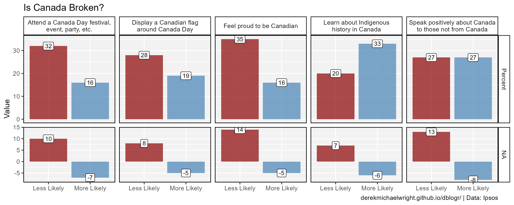
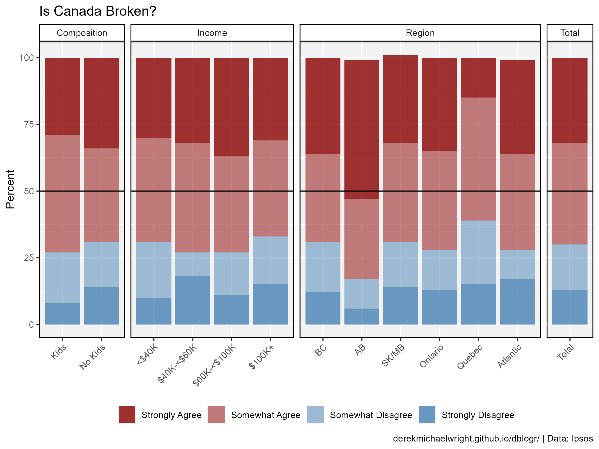

```{r setup, include=FALSE}
knitr::opts_chunk$set(echo = T, message = F, warning = F)
```

---

# Data

> - `r shiny::icon("globe")` https://www.ipsos.com/en-ca/70-percent-of-canadians-think-canada-broken-as-canadian-pride-takes-tumble
> - `r shiny::icon("save")` [data_canada_pride.xlsx](data_canada_pride.xlsx)

---

# About The Study

These are some of the findings of an Ipsos poll conducted between June 12 and 14, 2024, on behalf of Global News. For this survey, a sample of 1,001 Canadians aged 18+ was interviewed online. Quotas and weighting were employed to ensure that the sample’s composition reflects that of the Canadian population according to census parameters. The precision of Ipsos online polls is measured using a credibility interval. In this case, the poll is accurate to within ± 3.8 percentage points, 19 times out of 20, had all Canadians aged 18+ been polled. The credibility interval will be wider among subsets of the population. All sample surveys and polls may be subject to other sources of error, including, but not limited to coverage error, and measurement error.

---

# Prepare Data

```{r class.source = 'fold-show'}
# devtools::install_github("derekmichaelwright/agData")
library(agData)
library(readxl)
```

```{r}
# Prep data
myCaption = "www.dblogr.com/ or derekmichaelwright.github.io/dblogr/ | Data: Ipsos"
#myCs_Ind <- c("darkgreen", "darkslategray", "darkred")

myCs_Sex <- c("palevioletred3","steelblue", "white")
myCs_Ans <- c("darkred", "darkred", "steelblue", "steelblue")
myAs_Ans <- c(0.8, 0.5, 0.5, 0.8)
#
d1 <- read_xlsx("data_canada_pride.xlsx", "Table 1", skip = 1)
#
myAs <- c("Strongly Agree", "Somewhat Agree", "Somewhat Disagree", "Strongly Disagree")
d2 <- read_xlsx("data_canada_pride.xlsx", "Table 2", skip = 1) %>%
  gather(Answer, Percent, 3:6) %>%
  mutate(Answer = factor(Answer, levels = myAs),
         Subgroup = factor(Subgroup, levels = unique(.$Subgroup)))
d3 <- read_xlsx("data_canada_pride.xlsx", "Table 3", skip = 1) %>%
  gather(Answer, Percent, 3:6) %>%
  mutate(Answer = factor(Answer, levels = myAs),
         Subgroup = factor(Subgroup, levels = unique(.$Subgroup)))
d4 <- read_xlsx("data_canada_pride.xlsx", "Table 4", skip = 1) %>%
  gather(Answer, Percent, 3:6) %>%
  mutate(Answer = factor(Answer, levels = myAs),
         Subgroup = factor(Subgroup, levels = unique(.$Subgroup)))
```

---

# Canada Pride



```{r}
# Prep data
xx <- d1 %>% gather(Measurement, Value, 3:4) %>%
  mutate(Measurement = factor(Measurement, levels = c("Percent", "Change")))
# Plot
mp <- ggplot(xx, aes(x = Answer, y = Value)) +
  geom_col(aes(fill = Answer), alpha = 0.7) +
  geom_label(aes(label = Value), size = 3) +
  facet_grid(Measurement ~ Question, scales  = "free_y", space = "free_y",
             labeller = label_wrap_gen(width = 30)) +
  scale_fill_manual(name = NULL, values = c("darkred", "steelblue")) +
  theme_agData(legend.position = "none") +
  labs(title = "Is Canada Broken?", x = NULL, caption = myCaption)
ggsave("canada_pride_1_01.png", mp, width = 10, height = 4)
```

---

# Demographics


```{r}
# Prep data
xx <- d2
# Plot
mp <- ggplot(xx, aes(x = Subgroup, y = Percent, fill = Answer, alpha = Answer)) +
  geom_col() +
  geom_hline(yintercept = 50) +
  facet_grid(. ~ Group, scales = "free_x", space = "free_x") +
  scale_fill_manual(name = NULL, values = myCs_Ans) +
  scale_alpha_manual(name = NULL, values = myAs_Ans) +
  theme_agData(legend.position = "bottom",
               axis.text.x = element_text(angle = 45, hjust = 1)) +
  labs(title = "Is Canada Broken?", x = NULL, caption = myCaption)
ggsave("canada_pride_2_01.png", mp, width = 8, height = 6)
```

---

# Region & Income



```{r}
# Prep data
xx <- d3
# Plot
mp <- ggplot(xx, aes(x = Subgroup, y = Percent, fill = Answer, alpha = Answer)) +
  geom_col() +
  geom_hline(yintercept = 50) +
  facet_grid(. ~ Group, scales = "free_x", space = "free_x") +
  scale_fill_manual(name = NULL, values = myCs_Ans) +
  scale_alpha_manual(name = NULL, values = myAs_Ans) +
  theme_agData(legend.position = "bottom",
               axis.text.x = element_text(angle = 45, hjust = 1)) +
  labs(title = "Is Canada Broken?", x = NULL, caption = myCaption)
ggsave("canada_pride_3_01.png", mp, width = 8, height = 6)
```

---

# Political Parties


```{r}
# Prep data
xx <- d4
# Plot
mp <- ggplot(xx, aes(x = Subgroup, y = Percent, fill = Answer, alpha = Answer)) +
  geom_col() +
  geom_hline(yintercept = 50) +
  facet_grid(. ~ Group, scales = "free_x", space = "free_x") +
  scale_fill_manual(name = NULL, values = myCs_Ans) +
  scale_alpha_manual(name = NULL, values = myAs_Ans) +
  theme_agData(legend.position = "bottom") +
  labs(title = "Is Canada Broken?", x = NULL, caption = myCaption)
ggsave("canada_pride_4_01.png", mp, width = 8, height = 6)
```

---
