```{r setup, include=FALSE}
knitr::opts_chunk$set(echo = T, message = F, warning = F)
```

---

# Data

STATCAN Table: 14-10-0288-01 (Employment by class of worker)

> - `r shiny::icon("globe")` [https://www150.statcan.gc.ca/t1/tbl1/en/cv.action?pid=1410028801](https://www150.statcan.gc.ca/t1/tbl1/en/cv.action?pid=1410028801){target="_blank"}
> - `r shiny::icon("save")` [1410028801_databaseLoadingData.csv](1410028801_databaseLoadingData.csv)

---

# Prepare Data

```{r class.source = "fold-show"}
# devtools::install_github("derekmichaelwright/agData")
library(agData)
```

```{r}
# Prep data
myCaption <- "derekmichaelwright.github.io/dblogr/ | Data: STATCAN"
myCs_Sector <- c("darkgreen", "darkslategray", "darkred", "steelblue")
myCs_Sex <- c("palevioletred3","steelblue")
myMeasures <- c("Self-employed", "Private sector", "Public sector")
myDates <- as.Date(c("2010-01-01","2015-01-01","2020-01-01","2025-01-01"))
mySexes1 <- c("Total - Gender", "Men+", "Women+")
mySexes2 <- c("Both sexes", "Males", "Females")
#
d1 <- read.csv("1410028801_databaseLoadingData.csv") %>%
  select(Area=GEO, Date=REF_DATE, Measurement=Class.of.worker, 
         Sex=Gender, Unit=UOM, Scale=SCALAR_FACTOR, Value=VALUE) %>%
  mutate(Value = Value * 1000,
         Area = factor(Area, levels = agData_STATCAN_Region_Table$Area),
         Date = as.Date(paste0(Date, "-15"), format = "%Y-%m-%d"),
         Measurement = gsub(" employees", "", Measurement),
         Measurement = factor(Measurement, levels = myMeasures),
         Sex = plyr::mapvalues(Sex, mySexes1, mySexes2))
d2 <- d1 %>% 
  mutate(Year = as.numeric(substr(Date, 1, 4))) %>%
  group_by(Area, Year, Measurement, Sex) %>%
  summarise(Value = sum(Value)) %>% 
  ungroup() %>%
  group_by(Area, Year, Sex) %>% 
  mutate(Total = sum(Value)) %>% 
  ungroup() %>%
  mutate(Percent = 100 * Value / Total)
```

---

# Private vs Government {.tabset .tabset-pills}

## Canada

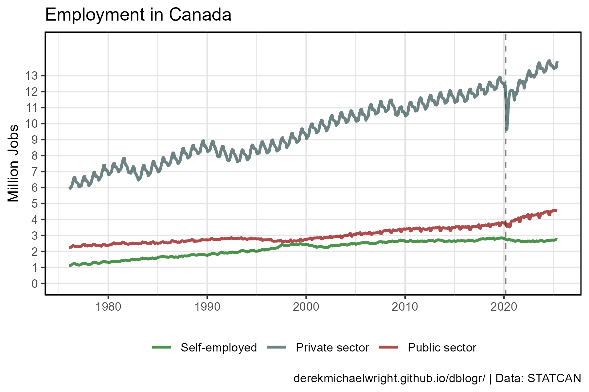

```{r}
# Prep data
xx <- d1 %>% filter(Area == "Canada", Sex == "Both sexes")
# Plot
mp <- ggplot(xx, aes(x = Date, y = Value / 1000000, color = Measurement)) +
  geom_vline(xintercept = as.Date("2020-03-01"), lty = 2, alpha = 0.5) +
  geom_line(size = 1, alpha = 0.7) +
  scale_color_manual(name = NULL, values = myCs_Sector) +
  scale_y_continuous(breaks = 0:13, minor_breaks = 0:13, limits = c(0,15)) +
  theme_agData(legend.position = "bottom") +
  labs(title = "Employment in Canada", x = NULL,
       y = "Million Jobs", caption = myCaption)
ggsave("canada_public_private_1_01.png", mp, width = 6, height = 4)
```

---

## Provinces

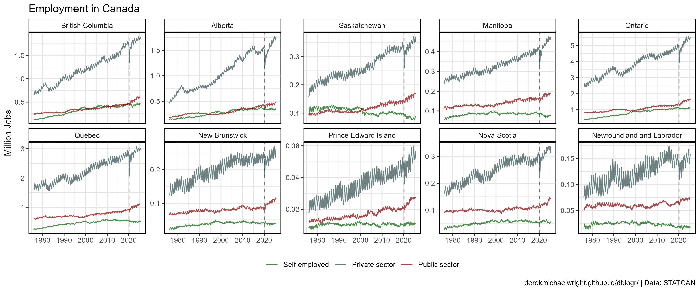

```{r}
# Prep data
xx <- d1 %>% filter(Area != "Canada", Sex == "Both sexes")
# Plot
mp <- ggplot(xx, aes(x = Date, y = Value / 1000000, color = Measurement)) +
  geom_vline(xintercept = as.Date("2020-03-01"), lty = 2, alpha = 0.5) +
  geom_line(alpha = 0.7) +
  scale_color_manual(name = NULL, values = myCs_Sector) +
  facet_wrap(Area ~ ., scales = "free_y", ncol = 5) +
  theme_agData(legend.position = "bottom") +
  labs(title = "Employment in Canada", x = NULL,
       y = "Million Jobs", caption = myCaption)
ggsave("canada_public_private_1_02.png", mp, width = 12, height = 5)
```

---

## Provinces > 2010

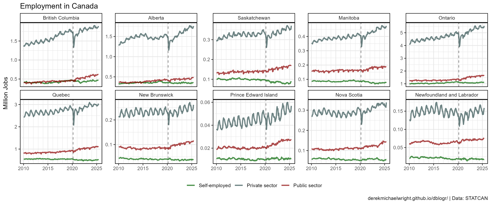

```{r}
# Prep data
xx <- d1 %>% filter(Area != "Canada", Sex == "Both sexes", Date > "2010-01-01")
# Plot
mp <- ggplot(xx, aes(x = Date, y = Value / 1000000, color = Measurement)) +
  geom_vline(xintercept = as.Date("2020-03-01"), lty = 2, alpha = 0.5) +
  geom_line(alpha = 0.7, size = 1) +
  scale_color_manual(name = NULL, values = myCs_Sector) +
  scale_x_date(breaks = myDates, minor_breaks = "1 year", date_labels = "%Y") +
  facet_wrap(Area ~ ., scales = "free_y", ncol = 5) +
  theme_agData(legend.position = "bottom") +
  labs(title = "Employment in Canada", x = NULL,
       y = "Million Jobs", caption = myCaption)
ggsave("canada_public_private_1_03.png", mp, width = 12, height = 5)
```

```{r echo = F}
ggsave("featured.png", mp, width = 12, height = 5)
```

---

# Scaled {.tabset .tabset-pills}

## Create plotting function

```{r class.source = "fold-show"}
# Create plotting function
gg_Priv_Gov <- function(myArea = "Canada") {
  # Prep data
  xx <- d1 %>% filter(Sex == "Both sexes", Date > "2010-01-01", Area == myArea)
  # Plot
  ggplot(xx, aes(x = Date, y = Value / 1000000, color = Measurement)) +
    geom_vline(xintercept = as.Date("2020-03-01"), lty = 2, alpha = 0.5) +
    geom_line(size = 1, alpha = 0.7) +
    scale_color_manual(name = NULL, values = myCs_Sector) +
    scale_x_date(breaks = "5 year", minor_breaks = "1 year", date_labels = "%Y") +
    facet_wrap(. ~ Measurement, ncol = 3, scale = "free_y") +
    theme_agData(legend.position = "bottom",
                 axis.text.x = element_text(angle = 45, hjust = 1)) +
    labs(title = paste("Employment in", myArea), 
         y = "Million Jobs", x = NULL, caption = myCaption)
}
```

---

## Canada {.active}

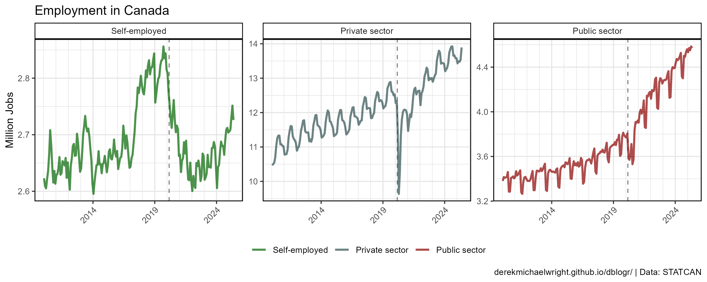

```{r}
mp <- gg_Priv_Gov(myArea = "Canada")
ggsave("canada_public_private_2_01.png", mp, width = 10, height = 4)
```

---

## Ontario

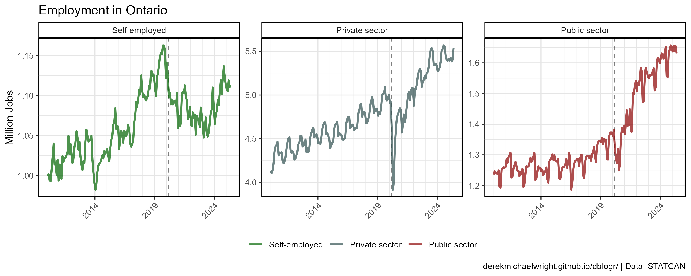

```{r}
mp <- gg_Priv_Gov(myArea = "Ontario")
ggsave("canada_public_private_2_02.png", mp, width = 10, height = 4)
```

---

## Alberta

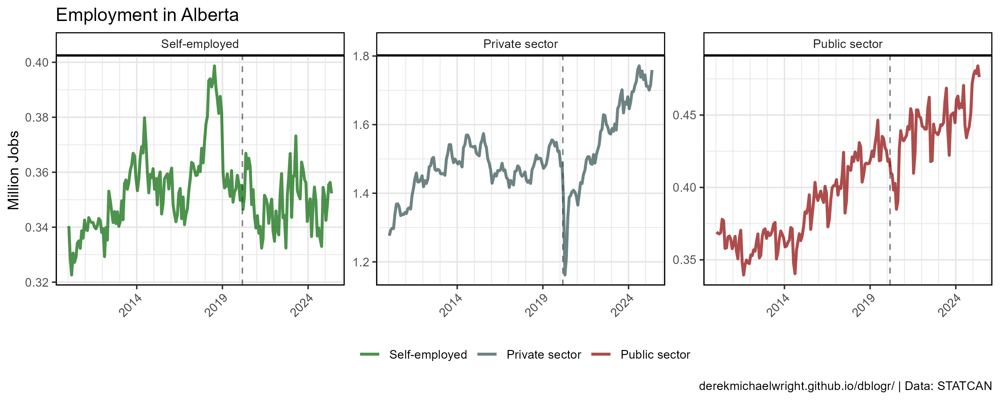

```{r}
mp <- gg_Priv_Gov(myArea = "Alberta")
ggsave("canada_public_private_2_03.png", mp, width = 10, height = 4)
```

---

## Saskatchewan

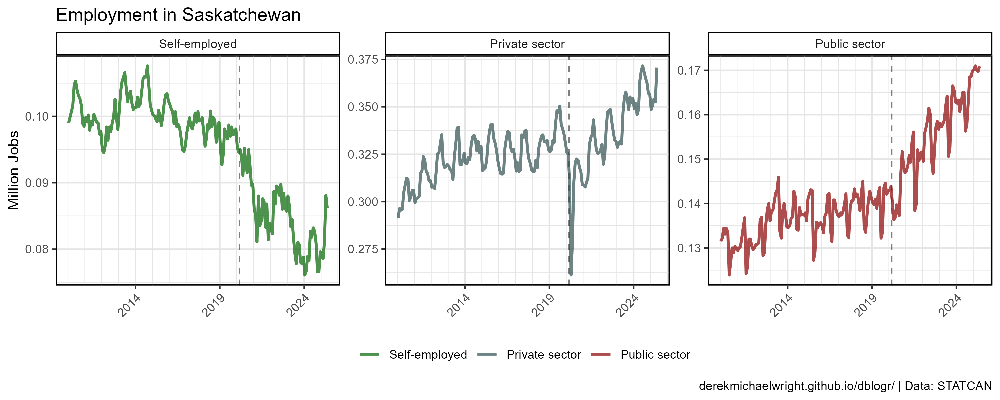

```{r}
mp <- gg_Priv_Gov(myArea = "Saskatchewan")
ggsave("canada_public_private_2_04.png", mp, width = 10, height = 4)
```

---

# Change {.tabset .tabset-pills}

## Since 1976-01-15

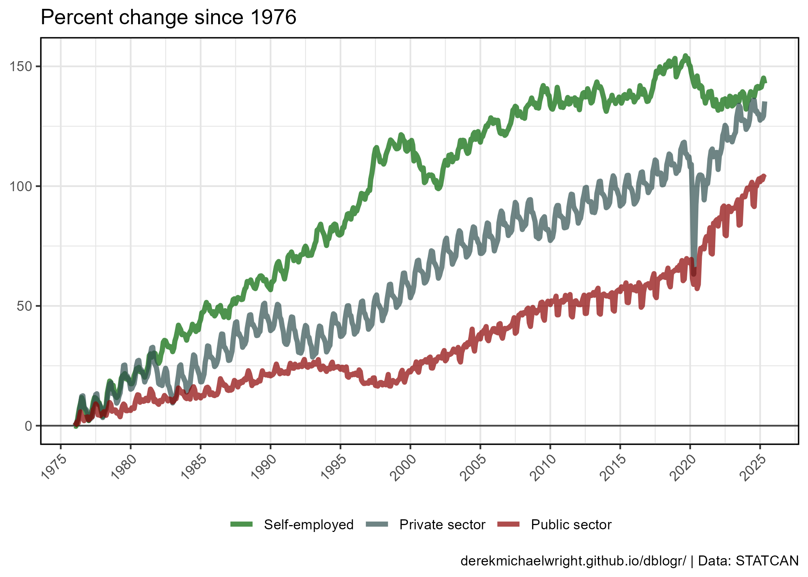

```{r}
# Prep data
myDates <- as.Date(paste0(seq(1975, 2025, by = 5), "-01-15"))
xx <- d1 %>% 
  filter(Area == "Canada", Sex == "Both sexes", Date >= "1976-01-15") %>%
  select(Date, Measurement, Value) %>%
  spread(Date, Value) %>%
  mutate(Start = `1976-01-15`) %>%
  select(Measurement, Start, everything()) %>%
  gather(Date, Value, 3:ncol(.)) %>%
  mutate(Date = as.Date(Date),
         PercentChange = 100 * (Value - Start) / Start)
# Plot
mp <- ggplot(xx, aes(x = Date, y = PercentChange, 
                     color = Measurement, group = Measurement)) +
  geom_hline(yintercept = 0, alpha = 0.7) + 
  geom_line(size = 1.5, alpha = 0.7) +
  scale_color_manual(name = NULL, values = myCs_Sector) +
  scale_x_date(breaks = myDates, date_labels = "%Y") +
  theme_agData(legend.position = "bottom",
               axis.text.x = element_text(angle = 45, hjust = 1)) +
  labs(title = "Percent change since 1976",
       x = NULL, y = NULL, caption = myCaption)
ggsave("canada_public_private_3_01.png", mp, width = 7, height = 5)
```

---

## Since 2020-02-15

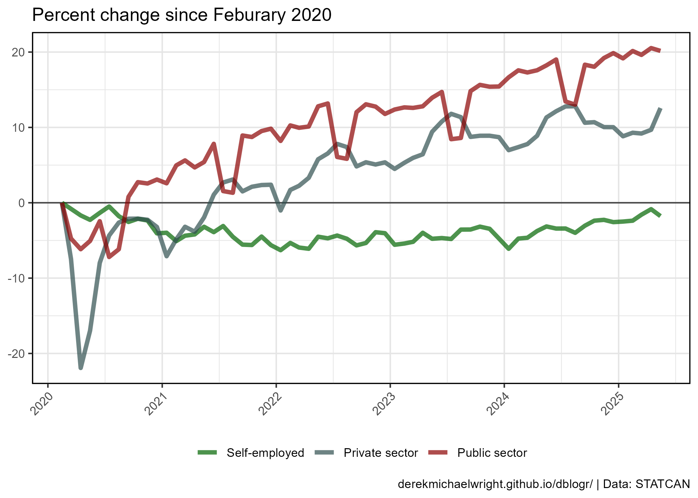

```{r}
# Prep data
xx <- d1 %>% 
  filter(Area == "Canada", Sex == "Both sexes", Date >= "2020-02-15") %>%
  select(Date, Measurement, Value) %>%
  spread(Date, Value) %>%
  mutate(Start = `2020-02-15`) %>%
  select(Measurement, Start, everything()) %>%
  gather(Date, Value, 3:ncol(.)) %>%
  mutate(Date = as.Date(Date),
         PercentChange = 100 * (Value - Start) / Start)
# Plot
mp <- ggplot(xx, aes(x = Date, y = PercentChange, 
                     color = Measurement, group = Measurement)) +
  geom_hline(yintercept = 0, alpha = 0.7) + 
  geom_line(size = 1.5, alpha = 0.7) +
  scale_color_manual(name = NULL, values = myCs_Sector) +
  scale_x_date(breaks = "1 year", date_labels = "%Y") +
  theme_agData(legend.position = "bottom",
               axis.text.x = element_text(angle = 45, hjust = 1)) +
  labs(title = "Percent change since Feburary 2020",
       x = NULL, y = NULL, caption = myCaption)
ggsave("canada_public_private_3_02.png", mp, width = 7, height = 5)
```

---

## Since 2019-09-15

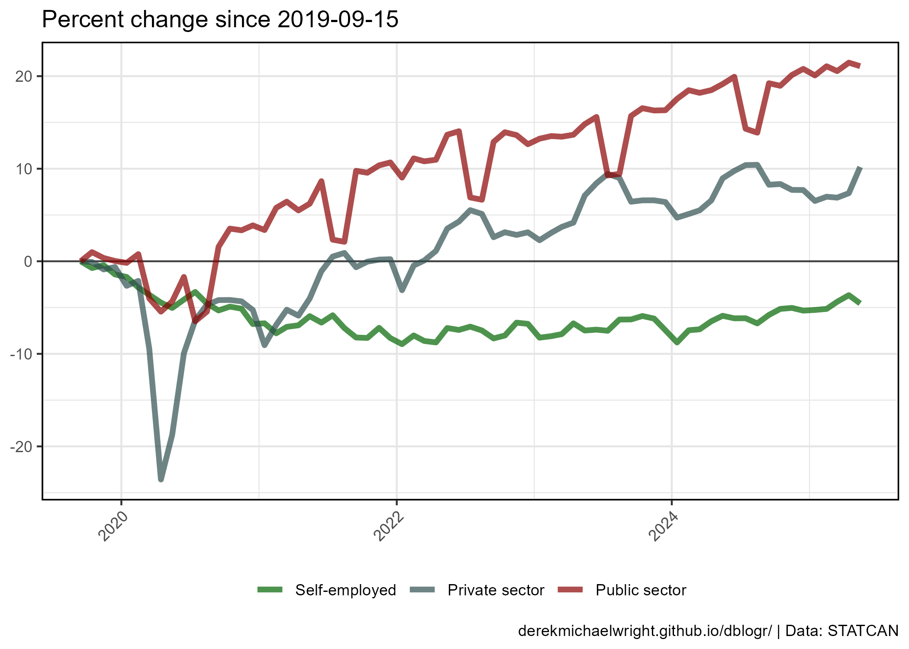

```{r}
# Prep data
xx <- d1 %>% 
  filter(Area == "Canada", Sex == "Both sexes", Date >= "2019-09-15") %>%
  select(Date, Measurement, Value) %>%
  spread(Date, Value) %>%
  mutate(Start = `2019-09-15`) %>%
  select(Measurement, Start, everything()) %>%
  gather(Date, Value, 3:ncol(.)) %>%
  mutate(Date = as.Date(Date),
         PercentChange = 100 * (Value - Start) / Start)
# Plot
mp <- ggplot(xx, aes(x = Date, y = PercentChange, 
                     color = Measurement, group = Measurement)) +
  geom_hline(yintercept = 0, alpha = 0.7) + 
  geom_line(size = 1.5, alpha = 0.7) +
  scale_color_manual(name = NULL, values = myCs_Sector) +
  theme_agData(legend.position = "bottom",
               axis.text.x = element_text(angle = 45, hjust = 1)) +
  labs(title = "Percent change since 2019-09-15",
       x = NULL, y = NULL, caption = myCaption)
ggsave("canada_public_private_3_03.png", mp, width = 7, height = 5)
```

---

# Percentages {.tabset .tabset-pills}

## Canada


```{r}
# Prep data
xx <- d2 %>% filter(Area == "Canada", Sex == "Both sexes")
# Plot
mp <- ggplot(xx, aes(x = Year, y = Percent, fill = Measurement)) +
  geom_col(color = "black", alpha = 0.7) +
  scale_fill_manual(name = NULL, values = myCs_Sector) +
  theme_agData(legend.position = "bottom") +
  labs(title = "Employment in Canada", x = NULL, caption = myCaption)
ggsave("canada_public_private_4_01.png", mp, width = 6, height = 4)
```

---

## Sex


```{r}
# Prep data
xx <- d2 %>% filter(Area == "Canada", Sex != "Both sexes")
# Plot
mp <- ggplot(xx, aes(x = Year, y = Percent, fill = Measurement)) +
  geom_col(color = "black", alpha = 0.7) +
  facet_grid(. ~ Sex) +
  scale_fill_manual(name = NULL, values = myCs_Sector) +
  theme_agData(legend.position = "bottom") +
  labs(title = "Employment in Canada", x = NULL, caption = myCaption)
ggsave("canada_public_private_4_02.png", mp, width = 8, height = 4)
```

---

## Provinces

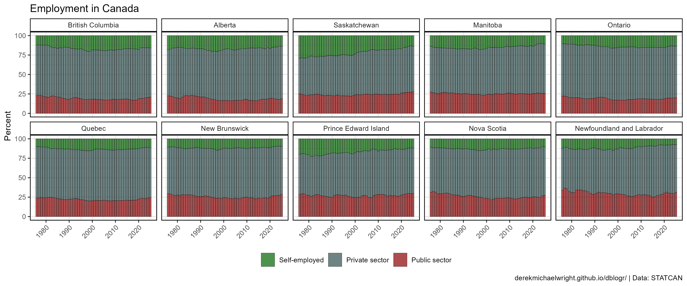

```{r}
# Prep data
xx <- d2 %>% filter(Area != "Canada", Sex == "Both sexes")
# Plot
mp <- ggplot(xx, aes(x = Year, y = Percent, fill = Measurement)) +
  geom_col(color = "black", alpha = 0.7, lwd = 0.1) +
  facet_wrap(Area ~ ., ncol = 5) +
  scale_fill_manual(name = NULL, values = myCs_Sector) +
  theme_agData(legend.position = "bottom",
               axis.text.x = element_text(angle = 45, hjust = 1)) +
  labs(title = "Employment in Canada", x = NULL, caption = myCaption)
ggsave("canada_public_private_4_03.png", mp, width = 12, height = 5)
```

---

# Males vs. Females {.tabset .tabset-pills}

## Canada {.tabset .tabset-pills}

### All Data

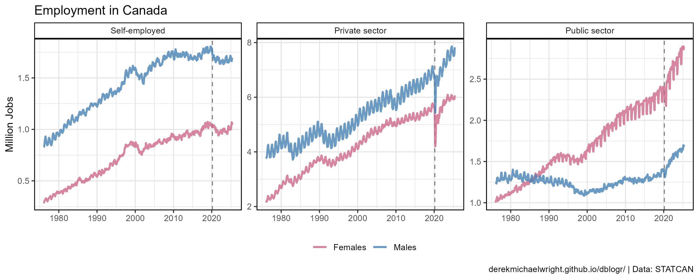

```{r}
# Prep data
xx <- d1 %>% filter(Area == "Canada", Sex != "Both sexes")
# Plot
mp <- ggplot(xx, aes(x = Date, y = Value / 1000000, color = Sex)) +
  geom_vline(xintercept = as.Date("2020-03-01"), lty = 2, alpha = 0.5) +
  geom_line(size = 1, alpha = 0.8) +
  scale_color_manual(name = NULL, values = myCs_Sex) +
  facet_wrap(. ~ Measurement, ncol = 3, scales = "free_y") +
  theme_agData(legend.position = "bottom") +
  labs(title = "Employment in Canada", x = NULL,
       y = "Million Jobs", caption = myCaption)
ggsave("canada_public_private_5_01.png", mp, width = 10, height = 4)
```

---

### > 2010

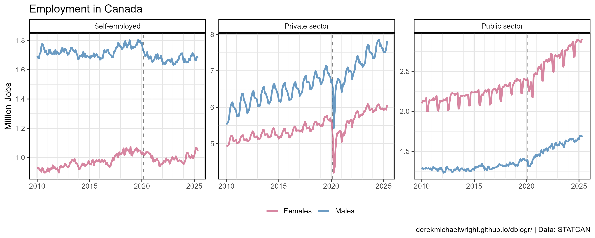

```{r}
# Prep data
xx <- d1 %>% filter(Area == "Canada", Sex != "Both sexes", Date > "2010-01-01")
# Plot
mp <- ggplot(xx, aes(x = Date, y = Value / 1000000, color = Sex)) +
  geom_vline(xintercept = as.Date("2020-03-01"), lty = 2, alpha = 0.5) +
  geom_line(size = 1, alpha = 0.8) +
  scale_color_manual(name = NULL, values = myCs_Sex) +
  scale_x_date(breaks = myDates, minor_breaks = "1 year", date_labels = "%Y") +
  facet_wrap(. ~ Measurement, ncol = 3, scales = "free_y") +
  theme_agData(legend.position = "bottom") +
  labs(title = "Employment in Canada", x = NULL,
       y = "Million Jobs", caption = myCaption)
ggsave("canada_public_private_5_02.png", mp, width = 10, height = 4)
```

---

## Change {.tabset .tabset-pills}

### Since Februrary


```{r}
# Prep data
xx <- d1 %>% 
  filter(Area == "Canada", Sex != "Both sexes", 
         Date %in% as.Date(c("2020-02-15","2022-05-15"))) %>%
  select(Date, Measurement, Sex, Value) %>%
  spread(Date, Value) %>%
  mutate(Change = `2022-05-15` - `2020-02-15`)
# Plot
mp <- ggplot(xx, aes(x = Sex, y = Change, fill = Sex)) +
  geom_col(position = "dodge", color = "black", alpha = 0.7) +
  facet_grid(. ~ Measurement) +
  scale_fill_manual(values = myCs_Sex) +
  theme_agData_col(legend.position = "none") +
  labs(title = "Change since Feburary 2020", x = NULL,
       y = "Thousand", caption = myCaption)
ggsave("canada_public_private_5_03.png", mp, width = 6, height = 4)
```

---

### Since Februrary


```{r}
# Prep data
xx <- d1 %>% 
  filter(Area == "Canada", Sex != "Both sexes", 
         Date %in% as.Date(c("2019-09-15","2022-05-15"))) %>%
  select(Date, Measurement, Sex, Value) %>%
  spread(Date, Value) %>%
  mutate(Change = `2022-05-15` - `2019-09-15`)
# Plot
mp <- ggplot(xx, aes(x = Sex, y = Change, fill = Sex)) +
  geom_col(position = "dodge", color = "black", alpha = 0.7) +
  facet_grid(. ~ Measurement) +
  scale_fill_manual(values = myCs_Sex) +
  theme_agData_col(legend.position = "none") +
  labs(title = "Change since 2019-09-15", x = NULL,
       y = "Thousand", caption = myCaption)
ggsave("canada_public_private_5_04.png", mp, width = 6, height = 4)
```

---

# Public Sector {.tabset .tabset-pills}

## Provinces

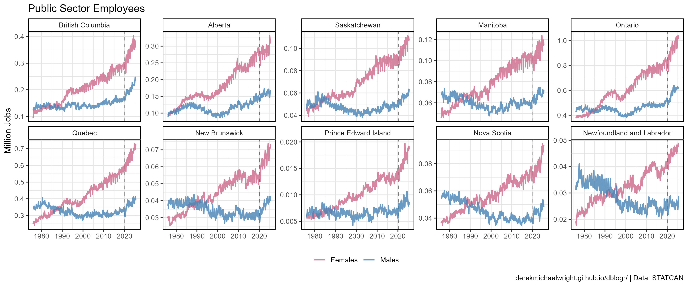

```{r}
# Prep data
xx <- d1 %>% 
  filter(Area != "Canada", Sex != "Both sexes", Measurement == "Public sector")
# Plot
mp <- ggplot(xx, aes(x = Date, y = Value / 1000000, color = Sex)) +
  geom_vline(xintercept = as.Date("2020-03-01"), lty = 2, alpha = 0.5) +
  geom_line(size = 0.8, alpha = 0.8) +
  scale_color_manual(name = NULL, values = myCs_Sex) +
  facet_wrap(Area ~ ., scales = "free_y", ncol = 5) +
  theme_agData(legend.position = "bottom") +
  labs(title = "Public Sector Employees", x = NULL,
       y = "Million Jobs", caption = myCaption)
ggsave("canada_public_private_6_01.png", mp, width = 12, height = 5)
```

---

## >2010


```{r}
# Prep data
xx <- d1 %>% 
  filter(Area != "Canada", Sex != "Both sexes", Measurement == "Public sector", 
         Date > "2010-01-01")
# Plot
mp <- ggplot(xx, aes(x = Date, y = Value / 1000000, color = Sex)) +
  geom_vline(xintercept = as.Date("2020-03-01"), lty = 2, alpha = 0.5) +
  geom_line(size = 1, alpha = 0.8) +
  scale_color_manual(name = NULL, values = myCs_Sex) +
  scale_x_date(breaks = myDates, minor_breaks = "1 year", date_labels = "%Y") +
  facet_wrap(Area ~ ., scales = "free_y", ncol = 5) +
  theme_agData(legend.position = "bottom") +
  labs(title = "Public Sector Employees", x = NULL,
       y = "Million Jobs", caption = myCaption)
ggsave("canada_public_private_6_02.png", mp, width = 12, height = 5)
```

---

# Self Employed {.tabset .tabset-pills}

## Canada {.tabset .tabset-pills}

### All Data

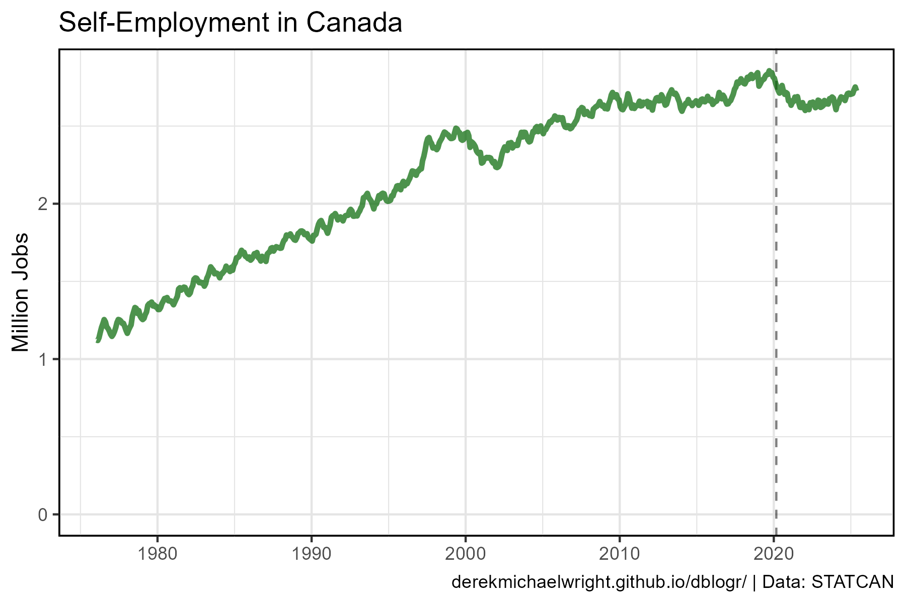

```{r}
# Prep data
xx <- d1 %>% 
  filter(Area == "Canada", Sex == "Both sexes", Measurement == "Self-employed")
# Plot
mp <- ggplot(xx, aes(x = Date, y = Value / 1000000)) +
  geom_vline(xintercept = as.Date("2020-03-01"), lty = 2, alpha = 0.5) +
  geom_line(color = "darkgreen", size = 1.25, alpha = 0.7) +
  expand_limits(y = 0) +
  #scale_y_continuous(breaks = 0:3, minor_breaks = 0:3, limits = c(0,3)) +
  theme_agData() +
  labs(title = "Self-Employment in Canada", x = NULL,
       y = "Million Jobs", caption = myCaption)
ggsave("canada_public_private_7_01.png", mp, width = 6, height = 4)
```

---

### > 2010

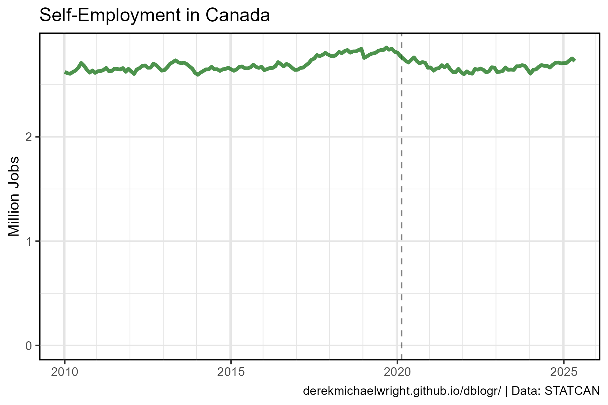

```{r}
# Prep data
xx <- d1 %>% 
  filter(Area == "Canada", Sex == "Both sexes", Measurement == "Self-employed",
         Date > "2010-01-01")
# Plot
mp <- ggplot(xx, aes(x = Date, y = Value / 1000000)) +
  geom_vline(xintercept = as.Date("2020-03-01"), lty = 2, alpha = 0.5) +
  geom_line(color = "darkgreen", size = 1.25, alpha = 0.7) +
  scale_x_date(breaks = myDates, minor_breaks = "1 year", date_labels = "%Y") +
  expand_limits(y = 0) +
  theme_agData() +
  labs(title = "Self-Employment in Canada", x = NULL,
       y = "Million Jobs", caption = myCaption)
ggsave("canada_public_private_7_02.png", mp, width = 6, height = 4)
```

---

## Provinces {.tabset .tabset-pills}

### All Data

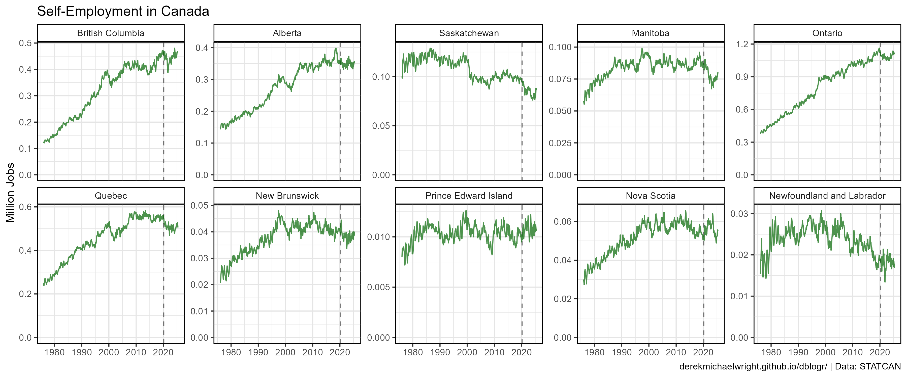

```{r}
# Prep data
xx <- d1 %>% 
  filter(Area != "Canada", Sex == "Both sexes", Measurement == "Self-employed")
# Plot
mp <- ggplot(xx, aes(x = Date, y = Value / 1000000)) +
  geom_vline(xintercept = as.Date("2020-03-01"), lty = 2, alpha = 0.5) +
  geom_line(color = "darkgreen", alpha = 0.7) +
  facet_wrap(Area ~ ., scales = "free_y", ncol = 5) +
  expand_limits(y = 0) +
  theme_agData() +
  labs(title = "Self-Employment in Canada", x = NULL,
       y = "Million Jobs", caption = myCaption)
ggsave("canada_public_private_7_03.png", mp, width = 12, height = 5)
```

---

### > 2010

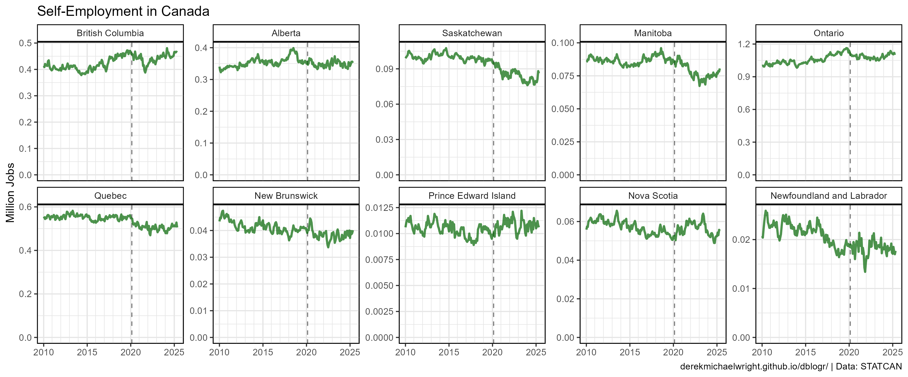

```{r}
# Prep data
xx <- d1 %>% 
  filter(Area != "Canada", Sex == "Both sexes", Measurement == "Self-employed",
         Date > "2010-01-01")
# Plot
mp <- ggplot(xx, aes(x = Date, y = Value / 1000000)) +
  geom_vline(xintercept = as.Date("2020-03-01"), lty = 2, alpha = 0.5) +
  geom_line(color = "darkgreen", size = 1, alpha = 0.7) +
  facet_wrap(Area ~ ., scales = "free_y", ncol = 5) +
  scale_x_date(breaks = myDates, minor_breaks = "1 year", date_labels = "%Y") +
  expand_limits(y = 0) +
  theme_agData() +
  labs(title = "Self-Employment in Canada", x = NULL,
       y = "Million Jobs", caption = myCaption)
ggsave("canada_public_private_7_04.png", mp, width = 12, height = 5)
```

---
