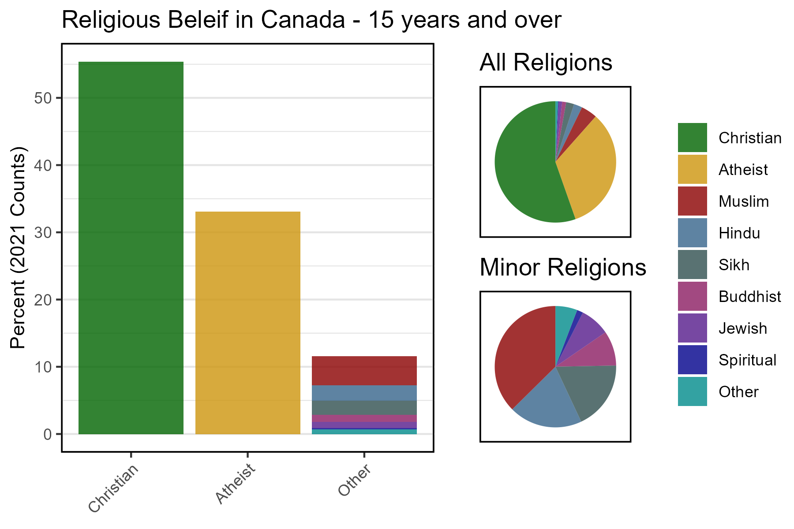
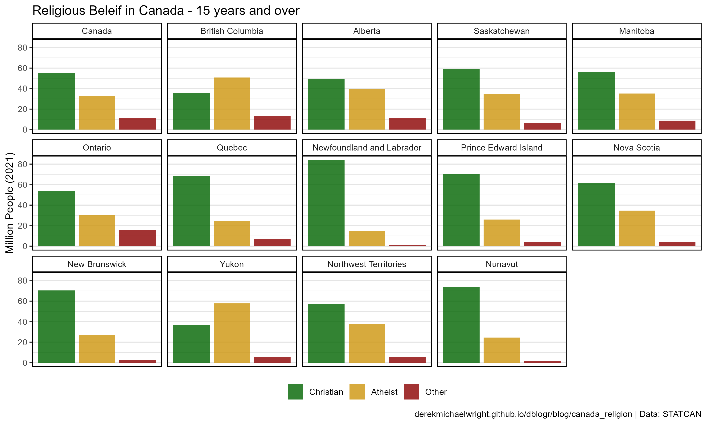
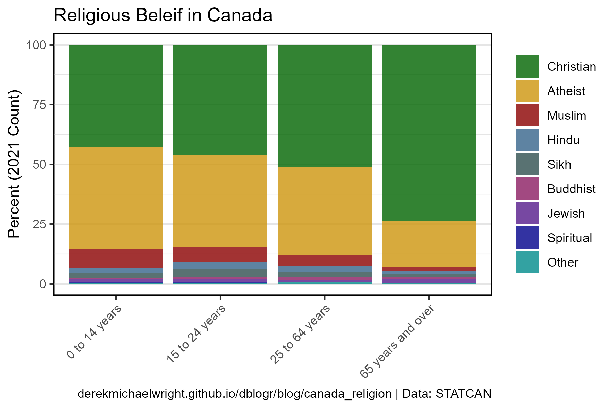
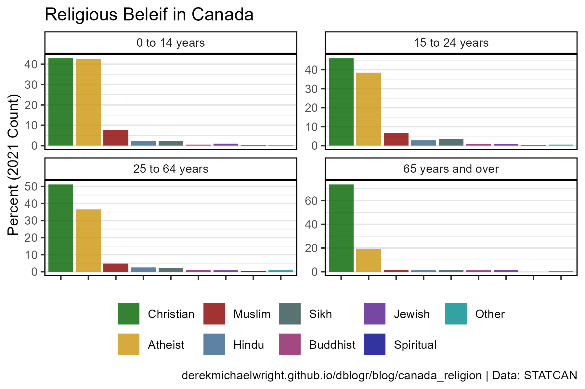
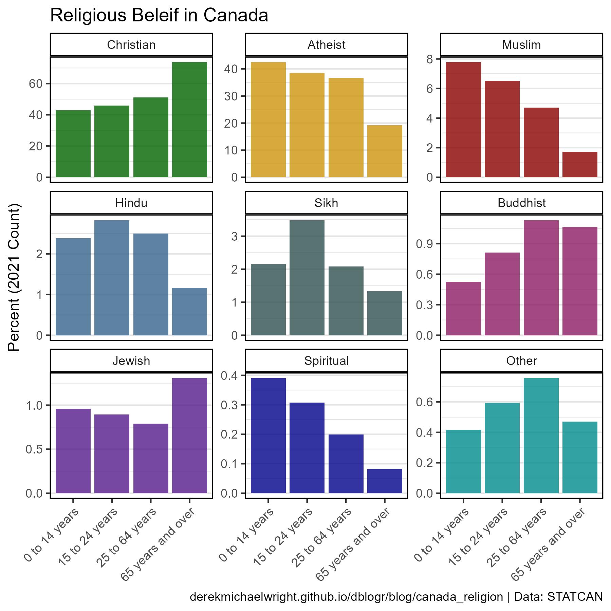
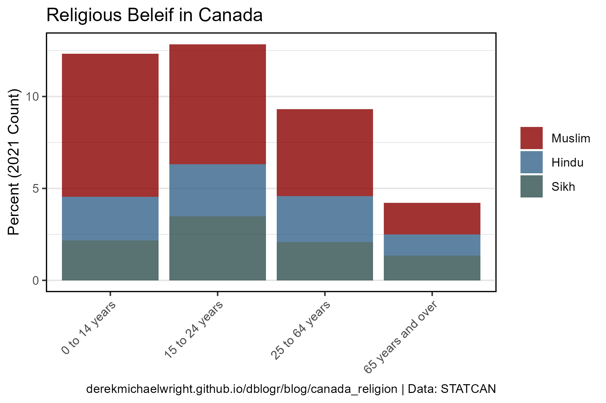
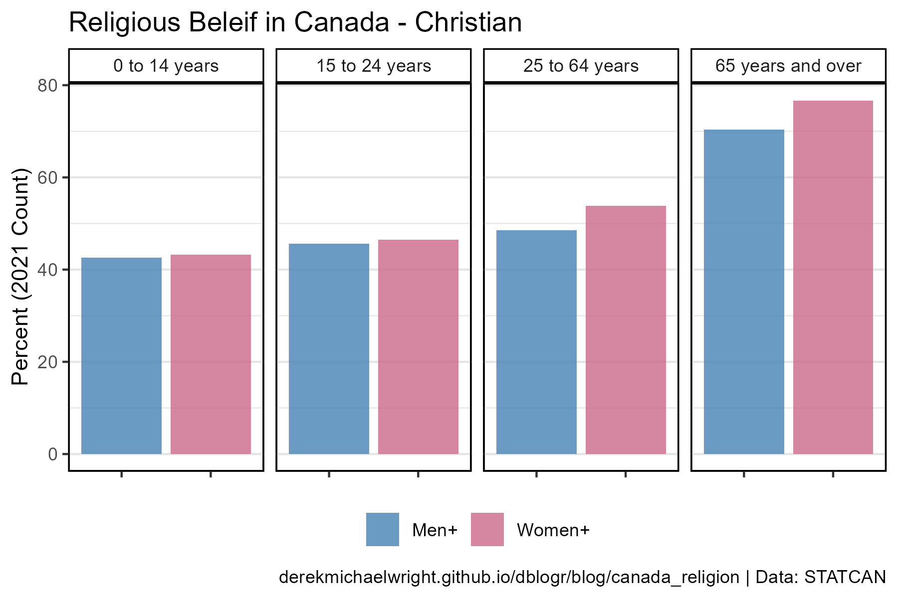
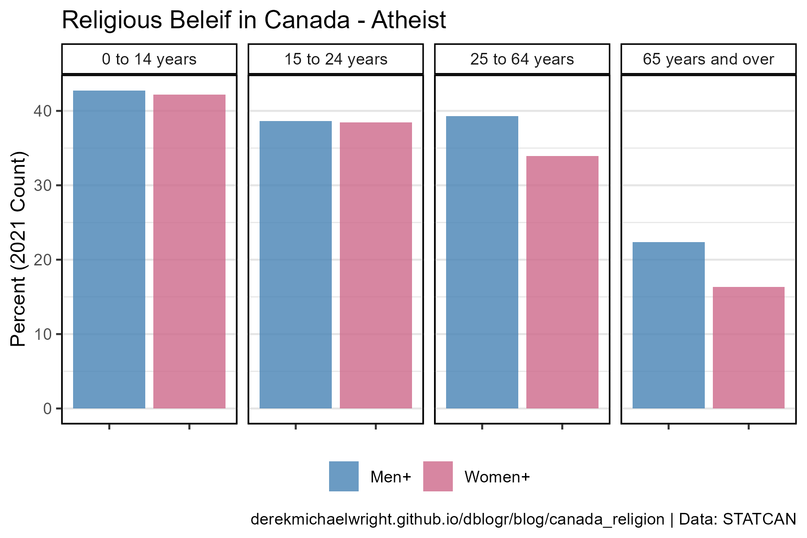
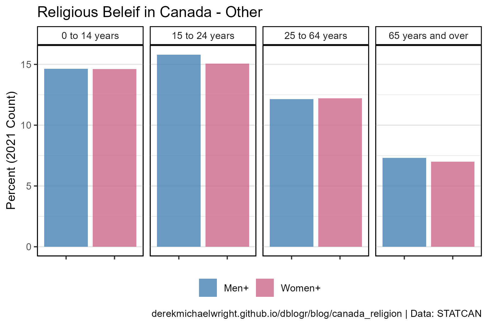

```{r setup, include=FALSE}
knitr::opts_chunk$set(echo = TRUE, message = F, warning = F)
```

---

# Data

STATCAN Table: 35-10-0026-01

Crime severity index and weighted clearance rates, Canada, provinces, territories and Census Metropolitan Areas

> - `r shiny::icon("globe")` [https://www150.statcan.gc.ca/t1/tbl1/en/cv.action?pid=9810035301](https://www150.statcan.gc.ca/t1/tbl1/en/cv.action?pid=9810035301){target="_blank"}
> - `r shiny::icon("save")` [9810035301_databaseLoadingData.csv](9810035301_databaseLoadingData.csv)

---

# Prepare Data

```{r class.source = 'fold-show'}
# devtools::install_github("derekmichaelwright/agData")
library(agData)
```

```{r}
# Prep data
myCaption <- "derekmichaelwright.github.io/dblogr/blog/canada_religion | Data: STATCAN"
myColors <- c("darkorange", "darkgreen", "darkred")
myColorsMF <- c("steelblue", "palevioletred3")
myAges <- c("Total - Age", "15 years and over", "0 to 14 years", 
            "15 to 24 years", "25 to 64 years", "65 years and over")
myAreas <- c("Canada", 
    "British Columbia", "Alberta", "Saskatchewan", "Manitoba",
    "Ontario", "Quebec", "Newfoundland and Labrador", 
    "Prince Edward Island", "Nova Scotia", "New Brunswick",
    "Yukon", "Northwest Territories", "Nunavut" )
myT1 <- c("No religion and secular perspectives",
          "Traditional (North American Indigenous) spirituality",
          "Other religions and spiritual traditions")
myT2 <- c("Atheist", "Spiritual", "Other")
myRs <- c("Total - Religion", "Christian", "Atheist", "Muslim", 
          "Hindu", "Sikh", "Buddhist", "Jewish", 
          "Spiritual", "Other")
#
dd <- read.csv("9810035301_databaseLoadingData.csv") %>%
  select(Year=REF_DATE, Area=GEO, Age=Age..15C., Gender=Gender..3.,
         Religion=Religion..25., Measurement=Statistics..2., Value=VALUE) %>%
  filter(Measurement != "% distribution (2021)") %>%
  mutate(Area = factor(Area, levels = myAreas),
         Age = factor(Age, levels = myAges),
         Religion = mv(Religion, myT1, myT2),
         Religion = factor(Religion, levels = myRs),
         Group = mv(Religion, myRs, c(NA, "Christian", "Atheist", rep("Other",7))))
# Calculate the percent based on population
x1 <- dd %>%
  filter(Religion != "Total - Religion") %>%
  group_by(Area, Age, Gender) %>%
  mutate(Percent = 100 * Value / sum(Value)) %>%
  select(Area, Age, Gender, Religion, Percent) %>%
  ungroup()
#
dd <- dd %>% left_join(x1, by = c("Area","Age","Gender","Religion"))
```

```{r eval = F, echo = F}
# Prep data
x1 <- dd %>% 
  filter(Area == "Canada", Age == "Total - Age", Gender == "Total - Gender" )
x1$Value[x1$Religion=="Total - Religion"]
sum(x1$Value[x1$Religion!="Total - Religion"])
#
unique(dd$Age)
xx <- dd %>% 
  filter(#Area == "Canada", 
         Area == "Saskatchewan",
         Measurement == "% distribution (2021)",
         Age == "Total - Age", Gender == "Total - Gender",
         Religion != "Total - Religion")
sum(xx$Value)
xx <- dd %>% 
  filter(Area == "Canada", Measurement == "% distribution (2021)",
         Age == "Total - Age", Gender == "Total - Gender",
         Religion %in% c("Total - Religion","Atheist"))
sum(xx$Value)
```

---

# Religions in Canada {.tabset .tabset-pills}

## Canada



```{r}
# Prep data
xx <- dd %>% 
  filter(Area == "Canada",
         Age == "15 years and over", Gender == "Total - Gender",
         Religion != "Total - Religion")
yy <- xx %>% filter(!Religion %in% c("Christian", "Atheist"))
# Plot
mp1 <- ggplot(xx, aes(x = Group, y = Percent, fill = Religion)) + 
  geom_col(alpha = 0.8) +
  scale_fill_manual(name = NULL, values = agData_Colors) +
  scale_y_continuous(breaks = seq(0, 60, by = 10) ) +
  theme_agData_col(axis.text.x = element_text(angle = 45, hjust = 1)) +
  labs(title = "Religious Beleif in Canada - 15 years and over", 
       y = "Percent (2021 Counts)", x = NULL)
# Plot
mp2 <- ggplot(xx, aes(x = 1, y = Value, fill = Religion)) + 
  geom_col(alpha = 0.8) +
  coord_polar("y", start = 0) +
  scale_fill_manual(name = NULL, values = agData_Colors) +
  theme_agData_pie() +
  labs(title = "All Religions")
mp3 <- ggplot(yy, aes(x = 1, y = Value, fill = Religion)) + 
  geom_col(alpha = 0.8) +
  coord_polar("y", start = 0) +
  scale_fill_manual(name = NULL, values = agData_Colors[c(-1,-2)]) +
  theme_agData_pie() +
  labs(title = "Minor Religions")
mp <- ggarrange(mp1, ggarrange(mp2, mp3, nrow = 2, legend = "none"), 
                ncol = 2, align = "h", widths = c(1, 0.5), 
                common.legend = T, legend = "right")
ggsave("canada_religion_1_01.png", mp, width = 6, height = 4, bg = "white")
```

```{r echo = F}
ggsave("featured.png", mp, width = 6, height = 4, bg = "white")
```


---

## Provinces {.tabset .tabset-pills}

### Bars



```{r}
# Prep data
xx <- dd %>% 
  filter(Religion != "Total - Religion",
         Age == "15 years and over", Gender == "Total - Gender")
# Plot
mp <- ggplot(xx, aes(x = Group, y = Percent, fill = Group)) + 
  geom_col(alpha = 0.8) +
  facet_wrap(Area ~ ., ncol = 5) +
  scale_fill_manual(name = NULL, values = agData_Colors) +
  theme_agData_col(legend.position = "bottom",
                   axis.text.x = element_blank(),
                   axis.ticks.x = element_blank()) +
  labs(title = "Religious Beleif in Canada - 15 years and over", 
       caption = myCaption,
       y = "Million People (2021)", x = NULL)
ggsave("canada_religion_2_01.png", mp, width = 10, height = 6)
```

---

### Pies

```{r}
# Prep data
xx <- dd %>% 
  filter(Religion != "Total - Religion",
         Age == "15 years and over", Gender == "Total - Gender")
# Plot
mp <- ggplot(xx, aes(x = 1, y = Percent, fill = Group)) + 
  geom_col(alpha = 0.8) +
  coord_polar("y", start = 0) +
  facet_wrap(Area ~ ., ncol = 5) +
  scale_fill_manual(name = NULL, values = agData_Colors) +
  theme_agData_pie(legend.position = "bottom") +
  labs(title = "Religious Beleif in Canada - 15 years and over", 
       caption = myCaption,
       y = "Million People (2021)", x = NULL)
ggsave("canada_religion_2_02.png", mp, width = 6, height = 6)
```

---

# Age {.tabset .tabset-pills}

## Stacked Bars



```{r}
# Prep data
xx <- dd %>% 
  filter(Area == "Canada", Gender == "Total - Gender",
         Age %in% myAges[3:6], Religion != "Total - Religion")
# Plot
mp <- ggplot(xx, aes(x = Age, y = Percent, fill = Religion)) + 
  geom_col(alpha = 0.8) +
  scale_fill_manual(name = NULL, values = agData_Colors) +
  theme_agData_col(axis.text.x = element_text(angle = 45, hjust = 1)) +
  labs(title = "Religious Beleif in Canada", caption = myCaption,
       y = "Percent (2021 Count)", x = NULL)
ggsave("canada_religion_3_01.png", mp, width = 6, height = 4)
```

---

## Split Bars



```{r}
# Prep data
xx <- dd %>% 
  filter(Area == "Canada", Gender == "Total - Gender",
         Age %in% myAges[3:6], Religion != "Total - Religion")
# Plot
mp <- ggplot(xx, aes(x = Religion, y = Percent, fill = Religion)) + 
  geom_col(alpha = 0.8) +
  facet_wrap(Age ~ ., scales = "free_y") +
  scale_fill_manual(name = NULL, values = agData_Colors) +
  theme_agData_col(legend.position = "bottom",
                   axis.text.x = element_blank()) +
  labs(title = "Religious Beleif in Canada", caption = myCaption,
       y = "Percent (2021 Count)", x = NULL)
ggsave("canada_religion_3_02.png", mp, width = 6, height = 4)
```

---

## Religion



```{r}
# Prep data
xx <- dd %>% 
  filter(Area == "Canada", Gender == "Total - Gender",
         Age %in% myAges[3:6], Religion != "Total - Religion")
# Plot
mp <- ggplot(xx, aes(x = Age, y = Percent, fill = Religion)) + 
  geom_col(alpha = 0.8) +
  facet_wrap(Religion ~ ., scales = "free_y") +
  scale_fill_manual(name = NULL, values = agData_Colors) +
  theme_agData_col(legend.position = "none",
                   axis.text.x = element_text(angle = 45, hjust = 1)) +
  labs(title = "Religious Beleif in Canada", caption = myCaption,
       y = "Percent (2021 Count)", x = NULL)
ggsave("canada_religion_3_03.png", mp, width = 6, height = 6)
```

---

## Minor Religions



```{r}
# Prep data
xx <- dd %>% 
  filter(Area == "Canada", Gender == "Total - Gender",
         Age %in% myAges[3:6], Religion %in% c("Muslim","Sikh", "Hindu"))
# Plot
mp <- ggplot(xx, aes(x = Age, y = Percent, fill = Religion)) + 
  geom_col(alpha = 0.8) +
  scale_fill_manual(name = NULL, values = agData_Colors[3:5]) +
  theme_agData_col(axis.text.x = element_text(angle = 45, hjust = 1)) +
  labs(title = "Religious Beleif in Canada", caption = myCaption,
       y = "Percent (2021 Count)", x = NULL)
ggsave("canada_religion_3_04.png", mp, width = 6, height = 4)
```

---

# Age & Gender {.tabset .tabset-pills}

## Christian



```{r}
# Prep data
xx <- dd %>% 
  filter(Area == "Canada", Gender != "Total - Gender",
         Age %in% myAges[3:6], Religion == "Christian")
# Plot
mp <- ggplot(xx, aes(x = Gender, y = Percent, fill = Gender)) + 
  geom_col(alpha = 0.8) +
  facet_grid(. ~ Age) +
  scale_fill_manual(name = NULL, values = myColorsMF) +
  theme_agData_col(legend.position = "bottom",
                   axis.text.x = element_blank()) +
  labs(title = "Religious Beleif in Canada - Christian", caption = myCaption,
       y = "Percent (2021 Count)", x = NULL)
ggsave("canada_religion_4_01.png", mp, width = 6, height = 4)
```

---

## Atheist



```{r}
# Prep data
xx <- dd %>% 
  filter(Area == "Canada", Gender != "Total - Gender",
         Age %in% myAges[3:6], Religion == "Atheist")
# Plot
mp <- ggplot(xx, aes(x = Gender, y = Percent, fill = Gender)) + 
  geom_col(alpha = 0.8) +
  facet_grid(. ~ Age) +
  scale_fill_manual(name = NULL, values = myColorsMF) +
  theme_agData_col(legend.position = "bottom",
                   axis.text.x = element_blank()) +
  labs(title = "Religious Beleif in Canada - Atheist", caption = myCaption,
       y = "Percent (2021 Count)", x = NULL)
ggsave("canada_religion_4_02.png", mp, width = 6, height = 4)
```

---

## Other



```{r}
# Prep data
xx <- dd %>% 
  filter(Area == "Canada", Gender != "Total - Gender",
         Age %in% myAges[3:6], Group == "Other")
# Plot
mp <- ggplot(xx, aes(x = Gender, y = Percent, fill = Gender)) + 
  geom_col(alpha = 0.8) +
  facet_grid(. ~ Age) +
  scale_fill_manual(name = NULL, values = myColorsMF) +
  theme_agData_col(legend.position = "bottom",
                   axis.text.x = element_blank()) +
  labs(title = "Religious Beleif in Canada - Other", caption = myCaption,
       y = "Percent (2021 Count)", x = NULL)
ggsave("canada_religion_4_03.png", mp, width = 6, height = 4)
```

---


