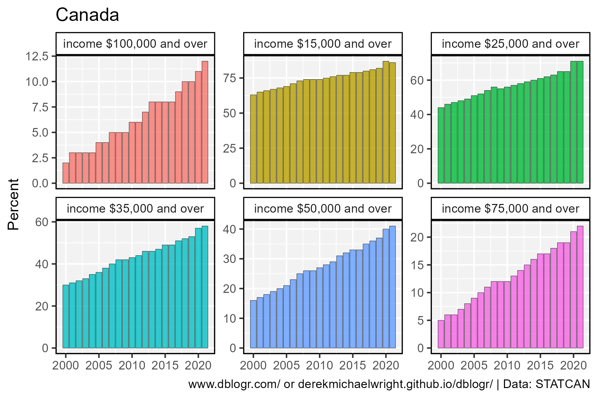

```{r setup, include=FALSE}
knitr::opts_chunk$set(echo = T, message = F, warning = F)
```

---

# Data

STATCAN Table: 11-10-0004-01

> - `r shiny::icon("globe")` https://www150.statcan.gc.ca/t1/tbl1/en/cv.action?pid=1110000401
> - `r shiny::icon("save")` [1110000401_databaseLoadingData.csv](_databaseLoadingData.csv)

STATCAN Table: 11-10-0007-01

> - `r shiny::icon("globe")` https://www150.statcan.gc.ca/t1/tbl1/en/cv.action?pid=1110000701
> - `r shiny::icon("save")` [1110000701_databaseLoadingData.csv](_databaseLoadingData.csv)

---

# Prepare Data

```{r class.source = "fold-show"}
# devtools::install_github("derekmichaelwright/agData")
library(agData)
```

```{r}
# Prep data
myCaption <- "www.dblogr.com/ or derekmichaelwright.github.io/dblogr/ | Data: STATCAN"
#
dd <- read.csv("1110000401_databaseLoadingData.csv") %>%
  select(Year=REF_DATE, Area=GEO, Measurement=Summary.table, Unit=UOM, Value=VALUE)
```

---

# Taxes

## Canada



```{r}
# Prep data
xx <- dd %>% 
  filter(Area == "Canada", 
         Measurement != "Percentage of persons with labour income receiving Employment Insurance benefits") %>%
  mutate(Measurement = gsub("Percentage of persons with total ", "", Measurement))
# Plot
mp <- ggplot(xx, aes(x = Year, y = Value, fill = Measurement)) +
  geom_col(color = "black", lwd = 0.1, alpha = 0.8) +
  facet_wrap(Measurement ~ ., ncol = 3, scales = "free_y") +
  theme_agData(legend.position = "none") +
  labs(title = "Canada", 
       x = NULL, y = "Percent", caption = myCaption)
ggsave("canada_taxes_01.png", mp, width = 6, height = 4)
```

```{r echo = F}
ggsave("featured.png", mp, width = 6, height = 4)
```

---


```{r}
# Prep data
xx <- dd %>% 
  filter(Area == "Canada", 
         Measurement == "Percentage of persons with labour income receiving Employment Insurance benefits")
# Plot
mp <- ggplot(xx, aes(x = Year, y = Value / 1000)) +
  geom_col(color = "black", alpha = 0.8) +
  theme_agData() +
  labs(title = "Canada", x = NULL, y = "Percent", caption = myCaption)
ggsave("canada_taxes_02.png", mp, width = 6, height = 4)
```

---
