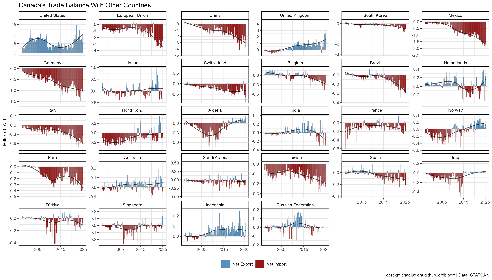
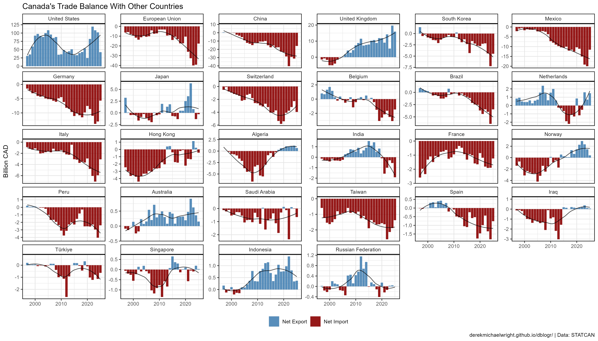
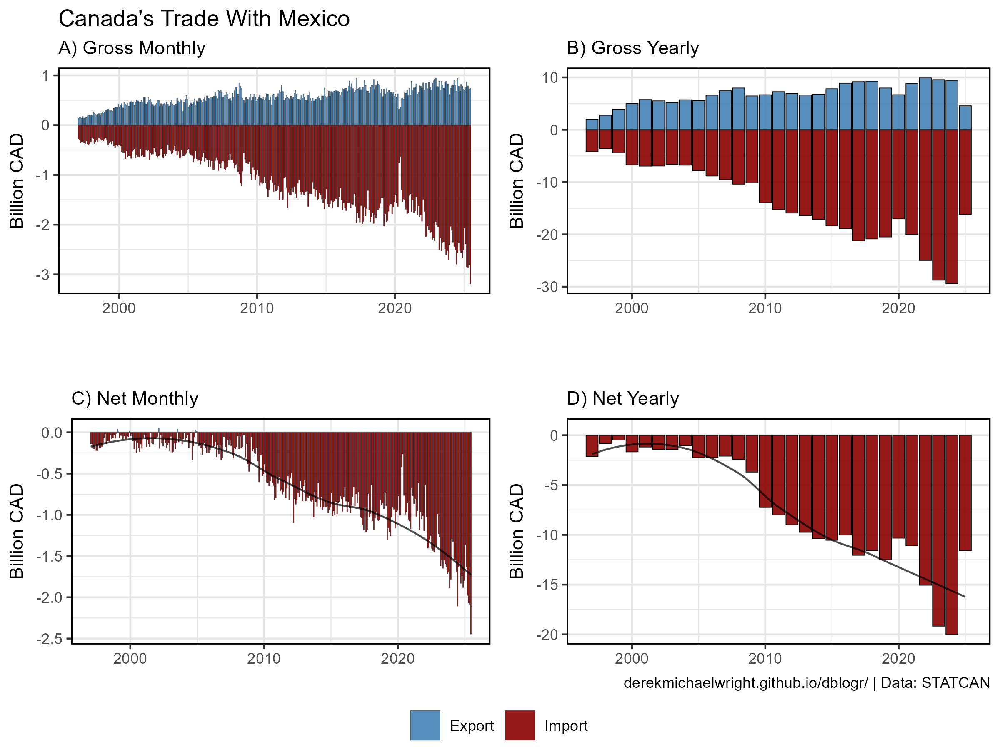

```{r setup, include=FALSE}
knitr::opts_chunk$set(echo = T, message = F, warning = F)
```

---

# Data

STATCAN Table: 12-10-0011-01 (International merchandise trade for all countries)

> - `r shiny::icon("globe")` [https://www150.statcan.gc.ca/t1/tbl1/en/cv.action?pid=1210001101](https://www150.statcan.gc.ca/t1/tbl1/en/cv.action?pid=1210001101){target="_blank"}
> - `r shiny::icon("save")` [1210001101_databaseLoadingData.csv](1210001101_databaseLoadingData.csv)

---

# Prepare Data

```{r class.source = "fold-show"}
# devtools::install_github("derekmichaelwright/agData")
library(agData)
```

```{r}
# Prep data
myCaption <- "derekmichaelwright.github.io/dblogr/ | Data: STATCAN"
dd <- read.csv("1210001101_databaseLoadingData.csv") %>%
  select(Year=REF_DATE, Area=GEO, Trade, Basis, Seasonal.adjustment,
         Trading.Partner=Principal.trading.partners, 
         Unit=UOM, Scale=SCALAR_FACTOR, Value=VALUE) %>%
  separate(Year, c("Year","Month"), "-") %>%
  mutate(Date = as.Date(paste0(Year, "-", Month, "-15"))) %>% 
  spread(Trade, Value) %>%
  mutate(`Trade Balance` = Export - Import) %>%
  gather(Trade, Value, `Trade Balance`, Export, Import)
#
xx <- dd %>% 
  group_by(Trading.Partner) %>% 
  summarise(Value = max(Value, na.rm = T)) %>% 
  arrange(desc(Value))
dd <- dd %>% 
  mutate(Trading.Partner = factor(Trading.Partner, levels = xx$Trading.Partner))
```

---

# Trade Balance {.tabset .tabset-pills}

## Canada


```{r}
# Prep data
xx <- dd %>% 
  filter(Trading.Partner == "All countries", Trade == "Trade Balance") %>%
  mutate(Balance = ifelse(Value > 0, "Net Export", "Net Import"))
# Plot
mp <- ggplot(xx, aes(x = Date, y = Value / 1000)) +
  geom_col(aes(fill = Balance), color = "black", lwd = 0.1, alpha = 0.8) +
  stat_smooth(geom = "line", alpha = 0.7) +
  scale_fill_manual(name = NULL, values = c("steelblue", "darkred")) +
  scale_x_date(date_minor_breaks = "1 year", expand = c(0,0)) +
  scale_y_continuous(minor_breaks = -6:12) +
  theme_agData(legend.position = "bottom") +
  labs(title = "Canada's Trade Balance", 
       x = NULL, y = "Billion CAD", caption = myCaption)
ggsave("canada_trade_01.png", mp, width = 6, height = 4)
```

```{r echo = F}
ggsave("featured.png", mp, width = 6, height = 4)
```

---

## Provinces & Cities


```{r}
# Prep data
xx <- dd %>% 
  filter(Trading.Partner != "All countries", Trade == "Trade Balance") %>%
  mutate(Balance = ifelse(Value > 0, "Net Export", "Net Import"))
# Plot
mp <- ggplot(xx, aes(x = Date, y = Value / 1000)) +
  geom_col(aes(fill = Balance), alpha = 0.9, lwd = 0.01, color = "black") +
  stat_smooth(geom = "line", alpha = 0.7) +
  scale_fill_manual(name = NULL, values = c("steelblue", "darkred")) +
  facet_wrap(Trading.Partner ~ ., scales = "free_y", ncol = 6) +
  scale_x_date(date_breaks = "10 years", date_labels = "%Y") +
  theme_agData(legend.position = "bottom") +
  labs(title = "Canada's Trade Balance With Other Countries", 
       x = NULL, y = "Billion $", caption = myCaption)
ggsave("canada_trade_02.png", mp, width = 14, height = 8)
```

---

# Import & Export {.tabset .tabset-pills}

## Canada



```{r}
# Prep data
xx <- dd %>% 
  filter(Trading.Partner == "All countries", Trade != "Trade Balance") %>%
  mutate(Value = ifelse(Trade == "Import", -Value, Value))
# Plot
mp <- ggplot(xx, aes(x = Date, y = Value / 1000, fill = Trade)) +
  geom_col(alpha = 0.9, lwd = 0.1, color = "black") +
  facet_wrap(Trading.Partner ~ ., scales = "free_y", ncol = 7) +
  scale_fill_manual(name = NULL, values = c("steelblue", "darkred")) +
  scale_x_date(date_breaks = "10 years", date_labels = "%Y") +
  theme_agData(legend.position = "bottom") +
  labs(title = "Canada's Trade Balance With Other Countries", 
       x = NULL, y = "Billion $", caption = myCaption)
ggsave("canada_trade_03.png", mp, width = 6, height = 4)
```

---

## Provinces & Cities



```{r}
# Prep data
xx <- dd %>% 
  filter(Trading.Partner != "All countries", Trade != "Trade Balance") %>%
  mutate(Value = ifelse(Trade == "Import", -Value, Value))
# Plot
mp <- ggplot(xx, aes(x = Date, y = Value / 1000, fill = Trade)) +
  geom_col(alpha = 0.9, lwd = 0.01, color = "black") +
  facet_wrap(Trading.Partner ~ ., scales = "free_y", ncol = 6) +
  scale_fill_manual(name = NULL, values = c("steelblue", "darkred")) +
  scale_x_date(date_breaks = "10 years", date_labels = "%Y") +
  theme_agData(legend.position = "bottom") +
  labs(title = "Canada's Trade Balance With Other Countries", 
       x = NULL, y = "Billion $", caption = myCaption)
ggsave("canada_trade_04.png", mp, width = 14, height = 8)
```

---

# Countries {.tabset .tabset-pills}

Create plotting function

```{r}
# Create plotting function
gg_Trade <- function(myArea = "India") {
  # Prep data
  xx <- dd %>% 
    filter(Trading.Partner == myArea, Trade != "Trade Balance") %>%
    mutate(Value = ifelse(Trade == "Import", -Value, Value))
  # Plot
  mp1 <- ggplot(xx, aes(x = Date, y = Value / 1000, fill = Trade)) +
    geom_col(alpha = 0.9, lwd = 0.05, color = "black") +
    scale_fill_manual(name = NULL, values = c("steelblue", "darkred")) +
    scale_x_date(date_breaks = "10 years", date_labels = "%Y") +
    theme_agData(legend.position = "bottom") +
    labs(subtitle = paste("Canada's Trade Balance With", myArea), 
         x = NULL, y = "Billion $", caption = "")
  #
  xx <- dd %>% 
    filter(Trading.Partner == myArea, Trade == "Trade Balance") %>%
    mutate(Balance = ifelse(Value > 0, "Net Export", "Net Import"))
  # Plot
  mp2 <- ggplot(xx, aes(x = Date, y = Value / 1000)) +
    geom_col(aes(fill = Balance), alpha = 0.9, lwd = 0.05, color = "black") +
    stat_smooth(geom = "line", alpha = 0.7) +
    scale_fill_manual(name = NULL, values = c("steelblue", "darkred")) +
    scale_x_date(date_minor_breaks = "1 year", expand = c(0,0)) +
    scale_y_continuous(minor_breaks = -6:6) +
    theme_agData(legend.position = "bottom") +
    labs(subtitle = "", x = NULL, y = "Billion CAD", caption = myCaption)
  ggarrange(mp1, mp2)
}
```

---

## United States


```{r}
mp <- gg_Trade(myArea = "United States")
ggsave("canada_trade_us.png", mp, width = 8, height = 4)
```

---

## United Kingdom 


```{r}
mp <- gg_Trade(myArea = "United Kingdom")
ggsave("canada_trade_uk.png", mp, width = 8, height = 4)
```

---

## Japan


```{r}
mp <- gg_Trade(myArea = "Japan")
ggsave("canada_trade_japan.png", mp, width = 8, height = 4)
```

---

## Algeria


```{r}
mp <- gg_Trade(myArea = "Algeria")
ggsave("canada_trade_algeria.png", mp, width = 8, height = 4)
```

---

## Norway


```{r}
mp <- gg_Trade(myArea = "Norway")
ggsave("canada_trade_norway.png", mp, width = 8, height = 4)
```

---

## India


```{r}
mp <- gg_Trade(myArea = "India")
ggsave("canada_trade_india.png", mp, width = 8, height = 4)
```

---

## Iraq


```{r}
mp <- gg_Trade(myArea = "Iraq")
ggsave("canada_trade_iraq.png", mp, width = 8, height = 4)
```

---

## Russia


```{r}
mp <- gg_Trade(myArea = "Russian Federation")
ggsave("canada_trade_russia.png", mp, width = 8, height = 4)
```

---

## Saudi Arabia


```{r}
mp <- gg_Trade(myArea = "Saudi Arabia")
ggsave("canada_trade_saudi_arabia.png", mp, width = 8, height = 4)
```

---

## China


```{r}
mp <- gg_Trade(myArea = "China")
ggsave("canada_trade_china.png", mp, width = 8, height = 4)
```

---

## Germany


```{r}
mp <- gg_Trade(myArea = "Germany")
ggsave("canada_trade_germany.png", mp, width = 8, height = 4)
```

---

## Mexico



```{r}
mp <- gg_Trade(myArea = "Mexico")
ggsave("canada_trade_mexico.png", mp, width = 8, height = 4)
```

---
