```{r setup, include=FALSE}
knitr::opts_chunk$set(echo = T, message = F, warning = F)
```

---

# Data {.tabset .tabset-pills}

## STATCAN Table: 12-10-0011-01

International merchandise trade for all countries

> - `r shiny::icon("globe")` [https://www150.statcan.gc.ca/t1/tbl1/en/cv.action?pid=1210001101](https://www150.statcan.gc.ca/t1/tbl1/en/cv.action?pid=1210001101){target="_blank"}
> - `r shiny::icon("save")` [1210001101_databaseLoadingData.csv](1210001101_databaseLoadingData.csv)

---

# Prepare Data

```{r class.source = "fold-show"}
# devtools::install_github("derekmichaelwright/agData")
library(agData)
library(gganimate)
```

```{r}
# Prep data
myCaption <- "derekmichaelwright.github.io/dblogr/blog/canada_trade | Data: STATCAN"
d1 <- read.csv("1210001101_databaseLoadingData.csv") %>%
  select(Year=REF_DATE, Area=GEO, Trade, Basis, Seasonal.adjustment,
         Trading.Partner=Principal.trading.partners, 
         Unit=UOM, Scale=SCALAR_FACTOR, Value=VALUE) %>%
  separate(Year, c("Year","Month"), "-") %>%
  mutate(Year = as.integer(Year),
         Date = as.Date(paste0(Year, "-", Month, "-15"))) %>% 
  spread(Trade, Value) %>%
  mutate(`Trade Balance` = Export - Import) %>%
  gather(Trade, Value, `Trade Balance`, Export, Import)
#
xx <- d1 %>% 
  group_by(Trading.Partner) %>% 
  summarise(Value = max(Value, na.rm = T)) %>% 
  arrange(desc(Value))
d1 <- d1 %>% 
  mutate(Trading.Partner = factor(Trading.Partner, levels = xx$Trading.Partner))
d2 <- d1 %>% group_by(Year, Trading.Partner, Trade) %>%
  summarise(Value = sum(Value)) %>% ungroup()
```

---

# Trade Balance {.tabset .tabset-pills}

## Canada {.tabset .tabset-pills}

### Monthly


```{r}
# Prep data
xx <- d1 %>% 
  filter(Trading.Partner == "All countries", Trade == "Trade Balance") %>%
  mutate(Balance = ifelse(Value > 0, "Net Export", "Net Import"))
# Plot
mp <- ggplot(xx, aes(x = Date, y = Value / 1000)) +
  geom_col(aes(fill = Balance), color = "black", lwd = 0.1, alpha = 0.8) +
  stat_smooth(geom = "line", alpha = 0.7) +
  scale_fill_manual(name = NULL, values = c("steelblue", "darkred")) +
  scale_x_date(date_minor_breaks = "1 year", expand = c(0,0)) +
  theme_agData(legend.position = "bottom") +
  labs(title = "Canada's Trade Balance", 
       x = NULL, y = "Billion CAD", caption = myCaption)
ggsave("canada_trade_01.png", mp, width = 6, height = 4)
```

```{r echo = F}
ggsave("featured.png", mp, width = 6, height = 4)
```

---

### Yearly

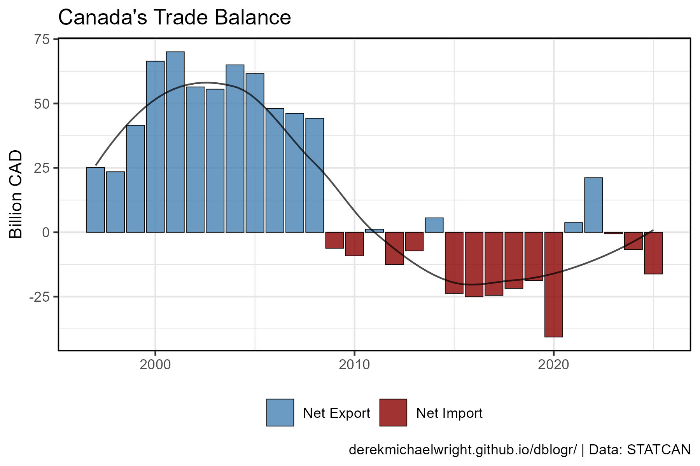

```{r}
# Prep data
xx <- d2 %>% 
  filter(Trading.Partner == "All countries", Trade == "Trade Balance") %>%
  mutate(Balance = ifelse(Value > 0, "Net Export", "Net Import"))
# Plot
mp <- ggplot(xx, aes(x = Year, y = Value / 1000)) +
  geom_col(aes(fill = Balance), color = "black", lwd = 0.2, alpha = 0.8) +
  stat_smooth(geom = "line", alpha = 0.7) +
  scale_fill_manual(name = NULL, values = c("steelblue", "darkred")) +
  theme_agData(legend.position = "bottom") +
  labs(title = "Canada's Trade Balance", 
       x = NULL, y = "Billion CAD", caption = myCaption)
ggsave("canada_trade_02.png", mp, width = 6, height = 4)
```

---

## Provinces & Cities {.tabset .tabset-pills}

### Monthly


```{r}
# Prep data
xx <- d1 %>% 
  filter(Trading.Partner != "All countries", Trade == "Trade Balance") %>%
  mutate(Balance = ifelse(Value > 0, "Net Export", "Net Import"))
# Plot
mp <- ggplot(xx, aes(x = Date, y = Value / 1000)) +
  geom_col(aes(fill = Balance), alpha = 0.9, lwd = 0.01, color = "black") +
  stat_smooth(geom = "line", alpha = 0.7) +
  scale_fill_manual(name = NULL, values = c("steelblue", "darkred")) +
  facet_wrap(Trading.Partner ~ ., scales = "free_y", ncol = 6) +
  scale_x_date(date_breaks = "10 years", date_labels = "%Y") +
  theme_agData(legend.position = "bottom") +
  labs(title = "Canada's Trade Balance With Other Countries", 
       x = NULL, y = "Billion CAD", caption = myCaption)
ggsave("canada_trade_03.png", mp, width = 14, height = 8)
```

---

### Yearly


```{r}
# Prep data
xx <- d2 %>% 
  filter(Trading.Partner != "All countries", Trade == "Trade Balance") %>%
  mutate(Balance = ifelse(Value > 0, "Net Export", "Net Import"))
# Plot
mp <- ggplot(xx, aes(x = Year, y = Value / 1000)) +
  geom_col(aes(fill = Balance), alpha = 0.9, lwd = 0.01, color = "black") +
  stat_smooth(geom = "line", alpha = 0.7) +
  scale_fill_manual(name = NULL, values = c("steelblue", "darkred")) +
  facet_wrap(Trading.Partner ~ ., scales = "free_y", ncol = 6) +
  theme_agData(legend.position = "bottom") +
  labs(title = "Canada's Trade Balance With Other Countries", 
       x = NULL, y = "Billion CAD", caption = myCaption)
ggsave("canada_trade_04.png", mp, width = 14, height = 8)
```

---

# Import & Export {.tabset .tabset-pills}

## Canada

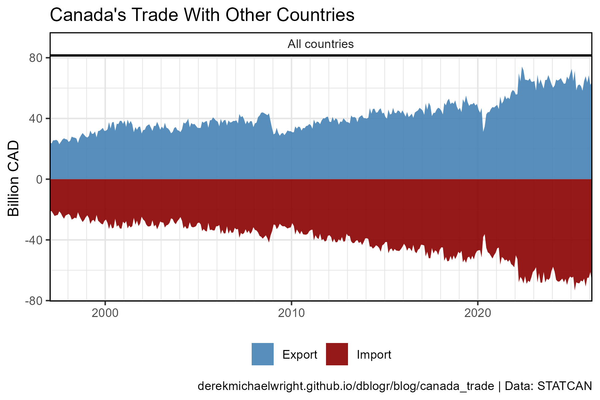

```{r}
# Prep data
xx <- d1 %>% 
  filter(Trading.Partner == "All countries", Trade != "Trade Balance") %>%
  mutate(Value = ifelse(Trade == "Import", -Value, Value))
# Plot
mp <- ggplot(xx, aes(x = Date, y = Value / 1000, fill = Trade)) +
  geom_area(alpha = 0.9) +
  facet_wrap(Trading.Partner ~ ., scales = "free_y", ncol = 7) +
  scale_fill_manual(name = NULL, values = c("steelblue", "darkred")) +
  scale_x_date(date_minor_breaks = "1 year", expand = c(0,0)) +
  theme_agData(legend.position = "bottom") +
  labs(title = "Canada's Trade With Other Countries", 
       x = NULL, y = "Billion CAD", caption = myCaption)
ggsave("canada_trade_05.png", mp, width = 6, height = 4)
```

---

## Provinces & Cities

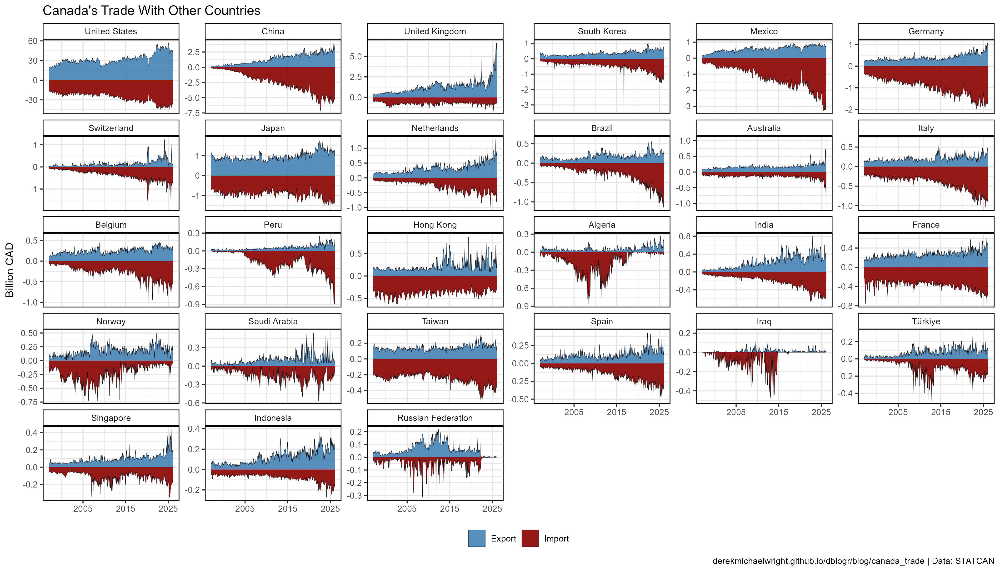

```{r}
# Prep data
xx <- d1 %>% 
  filter(Trading.Partner != "All countries", Trade != "Trade Balance") %>%
  mutate(Value = ifelse(Trade == "Import", -Value, Value))
# Plot
mp <- ggplot(xx, aes(x = Date, y = Value / 1000, fill = Trade)) +
  geom_area(alpha = 0.9, lwd = 0.1, color = "black") +
  facet_wrap(Trading.Partner ~ ., scales = "free_y", ncol = 6) +
  scale_fill_manual(name = NULL, values = c("steelblue", "darkred")) +
  scale_x_date(date_breaks = "10 years", date_labels = "%Y") +
  theme_agData(legend.position = "bottom") +
  labs(title = "Canada's Trade With Other Countries", 
       x = NULL, y = "Billion CAD", caption = myCaption)
ggsave("canada_trade_06.png", mp, width = 14, height = 8)
```

---

# Comparisons {.tabset .tabset-pills}

## Net

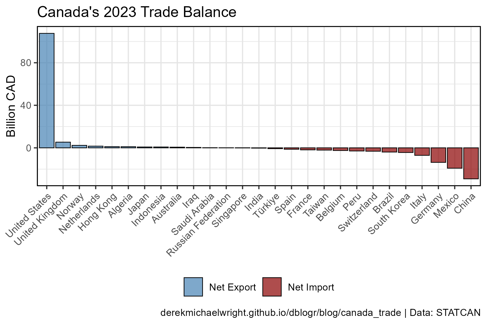

```{r}
# Prep data
xx <- d2 %>% 
  filter(Year == 2023, Trade == "Trade Balance",
         !Trading.Partner %in% c("All countries","European Union")) %>%
  arrange(desc(Value)) %>% 
  mutate(Trading.Partner = factor(Trading.Partner, levels = .$Trading.Partner),
         Balance = ifelse(Value > 0, "Net Export", "Net Import"))
# Plot
mp <- ggplot(xx, aes(x = Trading.Partner, y = Value / 1000, fill = Balance)) +
  geom_col(color = "black", alpha = 0.7) +
  scale_fill_manual(name = NULL, values = c("steelblue", "darkred")) +
  theme_agData(legend.position = "bottom",
               axis.text.x = element_text(angle = 45, hjust = 1)) +
  labs(title = "Canada's 2023 Trade Balance", x = NULL,
       y = "Billion CAD", caption = myCaption)
ggsave("canada_trade_07.png", mp, width = 6, height = 4)
```

---

## Gross

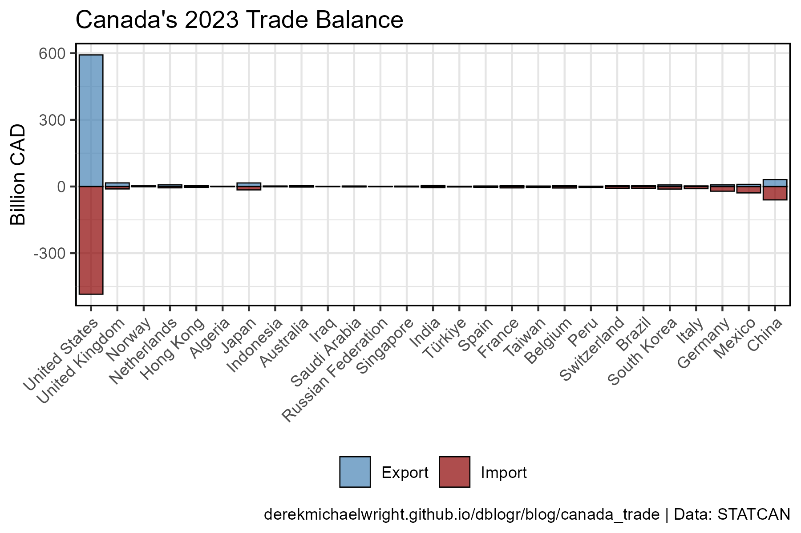

```{r}
# Prep data
yy <- d2 %>% 
  filter(Year == 2023, Trade == "Trade Balance",
         !Trading.Partner %in% c("All countries","European Union")) %>%
  arrange(desc(Value))
xx <- d2 %>% 
  filter(Year == 2023, Trade != "Trade Balance",
         !Trading.Partner %in% c("All countries","European Union")) %>%
  arrange(desc(Value)) %>% 
  mutate(Trading.Partner = factor(Trading.Partner, levels = yy$Trading.Partner),
         Value = ifelse(Trade == "Import", -Value, Value))
# Plot
mp <- ggplot(xx, aes(x = Trading.Partner, y = Value / 1000, fill = Trade)) +
  geom_col(color = "black", alpha = 0.7) +
  scale_fill_manual(name = NULL, values = c("steelblue", "darkred")) +
  theme_agData(legend.position = "bottom",
               axis.text.x = element_text(angle = 45, hjust = 1)) +
  labs(title = "Canada's 2023 Trade Balance", x = NULL,
       y = "Billion CAD", caption = myCaption)
ggsave("canada_trade_08.png", mp, width = 6, height = 4)
```

---

## Animation


```{r}
# Prep data
yy <- d2 %>% 
  filter(Year == 2023, Trade == "Trade Balance",
         !Trading.Partner %in% c("All countries","European Union")) %>%
  arrange(desc(Value))
xx <- d2 %>% 
  filter(Trade != "Trade Balance",
         !Trading.Partner %in% c("All countries","European Union")) %>%
  arrange(desc(Value)) %>% 
  mutate(Trading.Partner = factor(Trading.Partner, levels = yy$Trading.Partner),
         Value = ifelse(Trade == "Import", -Value, Value))
# Plot
mp <- ggplot(xx, aes(x = Trading.Partner, y = Value / 1000, fill = Trade)) +
  geom_col(color = "black", alpha = 0.7) +
  scale_fill_manual(name = NULL, values = c("steelblue", "darkred")) +
  theme_agData(legend.position = "bottom",
               axis.text.x = element_text(angle = 45, hjust = 1)) +
  labs(title = "Canada's Trade Balance - {round(frame_time)}", 
       y = "Billion CAD", x = NULL, caption = myCaption) +
  transition_time(Year)
anim_save("canada_trade_gif_01.gif", mp, 
          nframes = 300, fps = 20, end_pause = 30, 
          width = 900, height = 600, res = 150, units = "px")
```

---

## Cummulative Trade

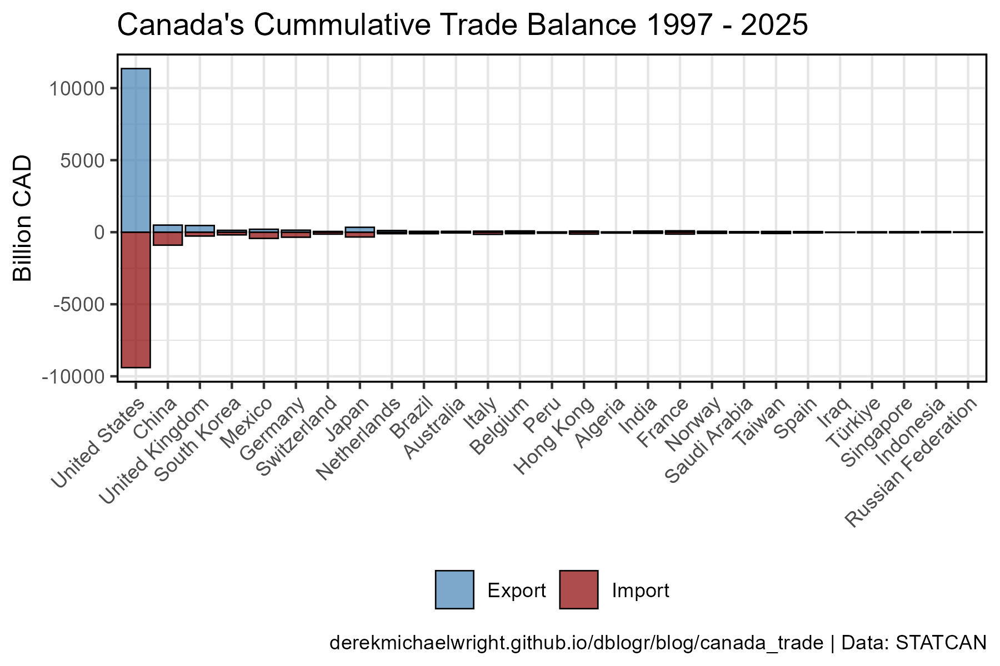

```{r}
# Prep data
xx <- d2 %>% 
  filter(Trade != "Trade Balance",
         !Trading.Partner %in% c("All countries","European Union")) %>%
  arrange(desc(Value)) %>% 
  mutate(Value = ifelse(Trade == "Import", -Value, Value)) %>% 
  group_by(Trading.Partner, Trade) %>%
  summarise(Value = sum(Value, na.rm = T))
# Plot
mp <- ggplot(xx, aes(x = Trading.Partner, y = Value / 1000, fill = Trade)) +
  geom_col(color = "black", alpha = 0.7) +
  scale_fill_manual(name = NULL, values = c("steelblue", "darkred")) +
  theme_agData(legend.position = "bottom",
               axis.text.x = element_text(angle = 45, hjust = 1)) +
  labs(title = "Canada's Cummulative Trade Balance 1997 - 2025", x = NULL,
       y = "Billion CAD", caption = myCaption)
ggsave("canada_trade_09.png", mp, width = 6, height = 4)
```

---

## USA vs All Others

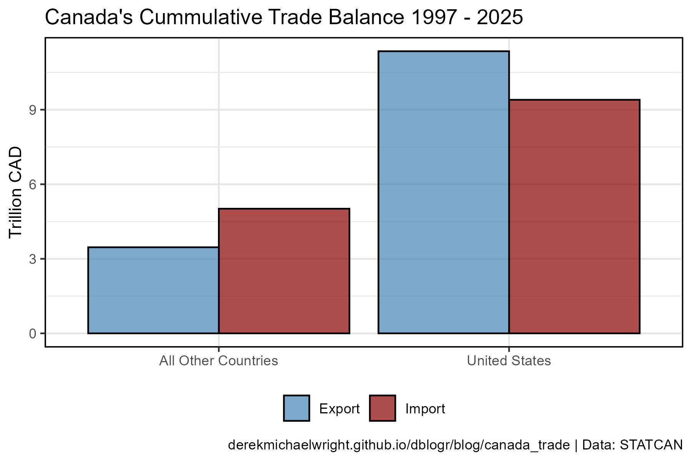

```{r}
# Prep data
xx <- d2 %>% 
  filter(Trade != "Trade Balance",
         Trading.Partner %in% c("All countries","United States")) %>%
  spread(Trading.Partner, Value) %>%
  mutate(`All Other Countries` = `All countries` - `United States`) %>%
  select(-`All countries`) %>%
  gather(Trading.Partner, Value, 3:4) %>%
  group_by(Trading.Partner, Trade) %>%
  summarise(Value = sum(Value, na.rm = T))
# Plot
mp <- ggplot(xx, aes(x = Trading.Partner, y = Value / 1000000, fill = Trade)) +
  geom_col(color = "black", alpha = 0.7, position = "dodge") +
  scale_fill_manual(name = NULL, values = c("steelblue", "darkred")) +
  theme_agData(legend.position = "bottom") +
  labs(title = "Canada's Cummulative Trade Balance 1997 - 2025", x = NULL,
       y = "Trillion CAD", caption = myCaption)
ggsave("canada_trade_10.png", mp, width = 6, height = 4)
```

---

# Map

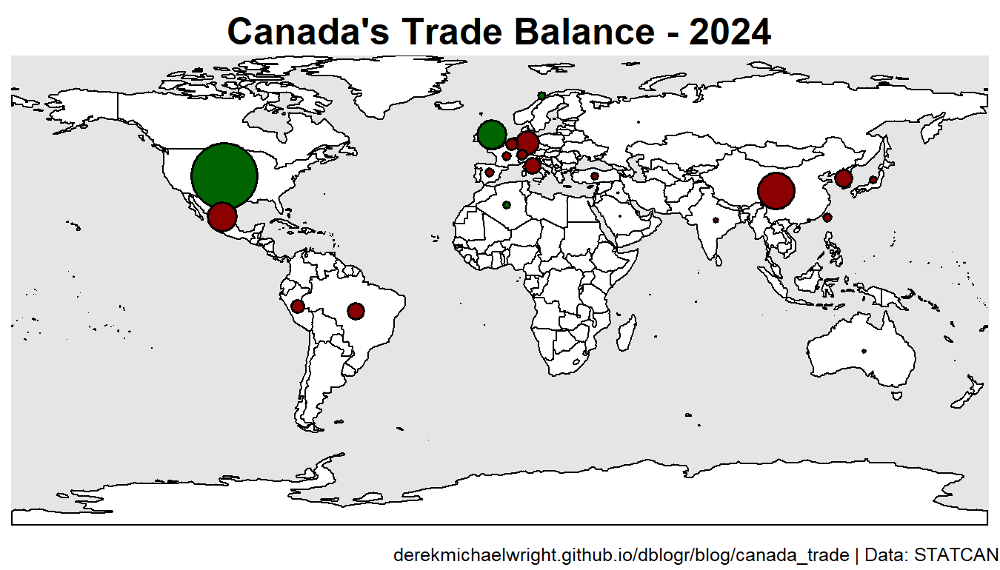

```{r}
# Prep data
yy <- agData_FAO_Country_Table
xx <- d2 %>% 
  filter(Trade == "Trade Balance") %>%
  mutate(Trading.Partner = plyr::mapvalues(Trading.Partner,
           c("Türkiye","Russian Federation", "United States", "South Korea"), 
           c("Turkey", "Russia", "USA", "Republic of Korea"))) %>%
  left_join(agData_FAO_Country_Table, by = c("Trading.Partner"="Country")) %>%
  filter(!is.na(Lat)) %>%
  mutate(Balance = ifelse(Value > 0, "Net Export", "Net Import"),
         Value = ifelse(Value < 0, Value * (-1), Value)) %>% 
  as.data.frame()
# Plot
for(i in 1997:max(xx$Year)) {
  # Prep data
  xi <- xx %>% filter(Year == i)
  #Plot
  png(paste0("maps/canada_trade_map_",i,".png"), width = 1350, height = 770, res = 300)
  par(mai = c(0.2,0,0.25,0), xaxs = "i", yaxs = "i")
  mapBubbles2(dF = xi, nameX = "Lon", nameY = "Lat", nameZSize = "Value",
              nameZColour = "black", nameZFill = "Balance",
              fillPalette = c("darkgreen", "darkred"),
              #symbolSize = 2, 
              lwd = 0.75, addLegend = F,
              oceanCol = "grey90", landCol = "white", borderCol = "black",
              )
  title(main = paste("Canada's Trade Balance -", i), line = 0.25, cex.main = 1)
  title(sub = myCaption, line = 0, cex.sub = 0.5, adj = 1)
  dev.off()
}
```

---

# Countries {.tabset .tabset-pills}

## plotting function

```{r}
# Create plotting function
gg_Trade <- function(myArea = "China") {
  # Prep data
  xx <- d1 %>% 
    filter(Trading.Partner == myArea, Trade != "Trade Balance") %>%
    mutate(Value = ifelse(Trade == "Import", -Value, Value))
  # Plot
  mp1 <- ggplot(xx, aes(x = Date, y = Value / 1000, fill = Trade)) +
    geom_area(alpha = 0.9, lwd = 0.1, color = "black") +
    scale_fill_manual(name = NULL, values = c("steelblue", "darkred")) +
    theme_agData() +
    labs(title = paste("Canada's Trade With", myArea),
         subtitle =  "A) Gross Monthly", x = NULL, y = "Billion CAD")
  #
  xx <- d1 %>% 
    filter(Trading.Partner == myArea, Trade == "Trade Balance") %>%
    mutate(Balance = ifelse(Value > 0, "Export", "Import"),
           Balance = factor(Balance))
  # Plot
  mp2 <- ggplot(xx, aes(x = Date, y = Value / 1000)) +
    geom_col(aes(fill = Balance), alpha = 0.9, lwd = 0.05, color = "black") +
    stat_smooth(geom = "line", alpha = 0.7) +
    scale_fill_manual(name = NULL, values = c("steelblue", "darkred"), 
                      breaks = c("Export", "Import")) +
    theme_agData() +
    labs(subtitle = "C) Net Monthly", x = NULL, y = "Billion CAD")
  #
  # Prep data
  xx <- d2 %>% 
    filter(Trading.Partner == myArea, Trade != "Trade Balance") %>%
    mutate(Value = ifelse(Trade == "Import", -Value, Value))
  # Plot
  mp3 <- ggplot(xx, aes(x = Year, y = Value / 1000, fill = Trade)) +
    geom_col(alpha = 0.9, lwd = 0.2, color = "black") +
    scale_fill_manual(name = NULL, values = c("steelblue", "darkred")) +
    theme_agData() +
    labs(subtitle =  "B) Gross Yearly", x = NULL, y = "Billion CAD")
  #
  xx <- d2 %>% 
    filter(Trading.Partner == myArea, Trade == "Trade Balance") %>%
    mutate(Balance = ifelse(Value > 0, "Export", "Import"),
           Balance = factor(Balance))
  # Plot
  mp4 <- ggplot(xx, aes(x = Year, y = Value / 1000)) +
    geom_col(aes(fill = Balance), alpha = 0.9, lwd = 0.2, color = "black") +
    stat_smooth(geom = "line", alpha = 0.7) +
    scale_fill_manual(name = NULL, values = c("steelblue", "darkred"), 
                      breaks = c("Export", "Import")) +
    theme_agData() +
    labs(subtitle = "D) Net Yearly", x = NULL, y = "Billion CAD", caption = myCaption)
  # Append
  ggarrange(mp1, mp3, mp2, mp4, ncol = 2, nrow = 2, 
            align = "h", common.legend = T, legend = "bottom")
}
```

---

## United States {.active}

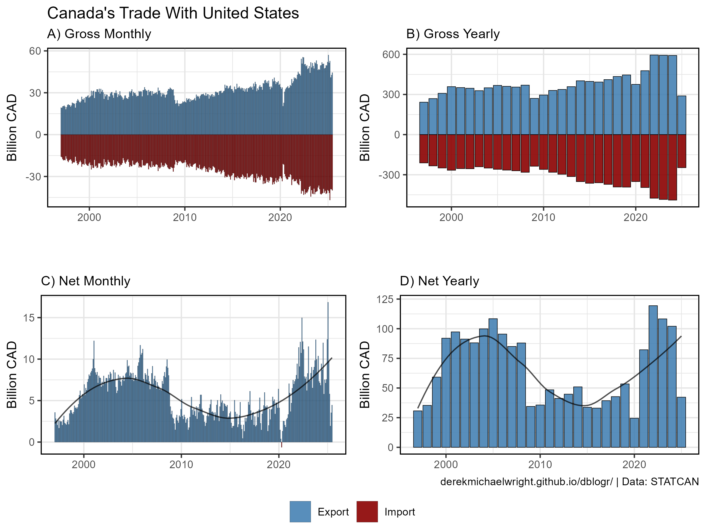

```{r}
mp <- gg_Trade(myArea = "United States")
ggsave("canada_trade_us.png", mp, width = 8, height = 6, bg = "white")
```

---

## United Kingdom 

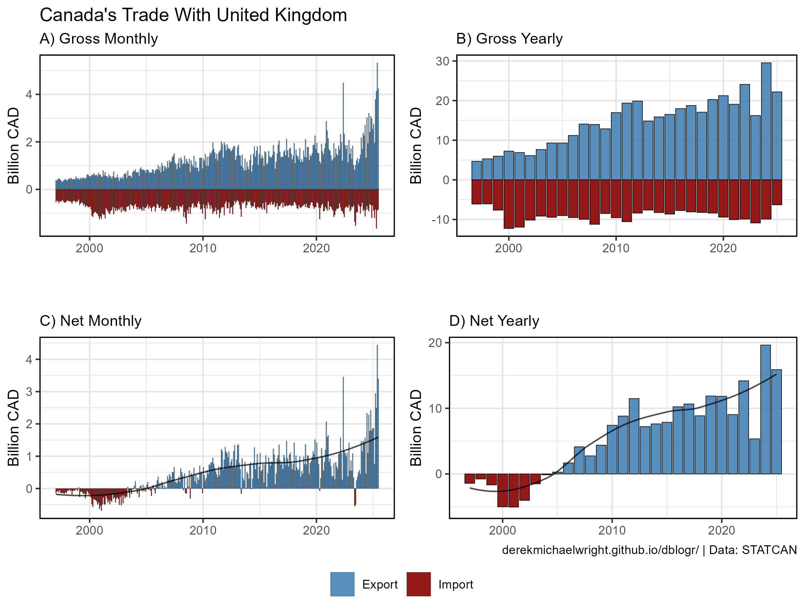

```{r}
mp <- gg_Trade(myArea = "United Kingdom")
ggsave("canada_trade_uk.png", mp, width = 8, height = 6, bg = "white")
```

---

## Japan

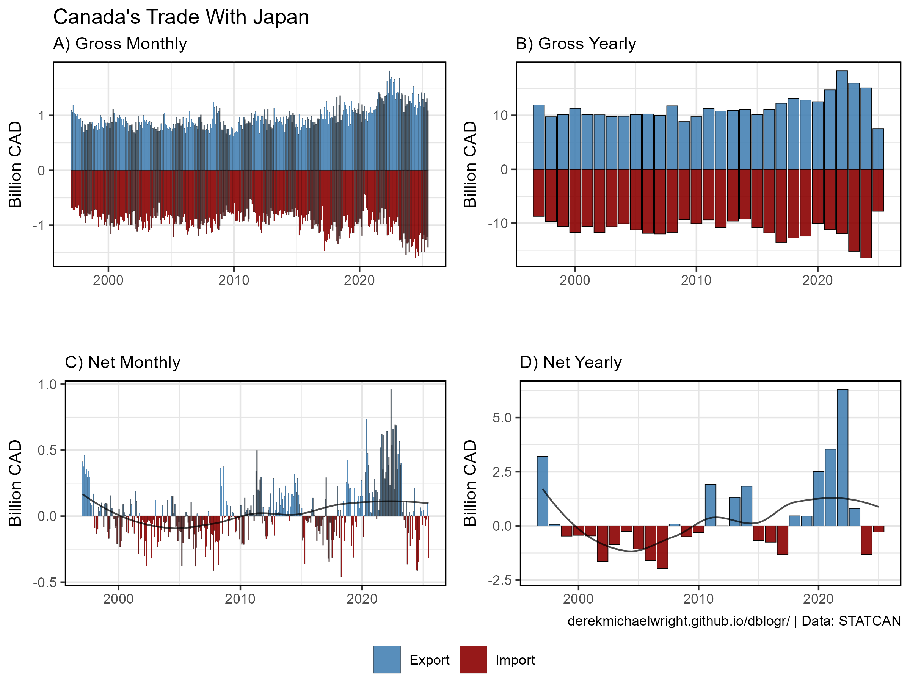

```{r}
mp <- gg_Trade(myArea = "Japan")
ggsave("canada_trade_japan.png", mp, width = 8, height = 6, bg = "white")
```

---

## Algeria

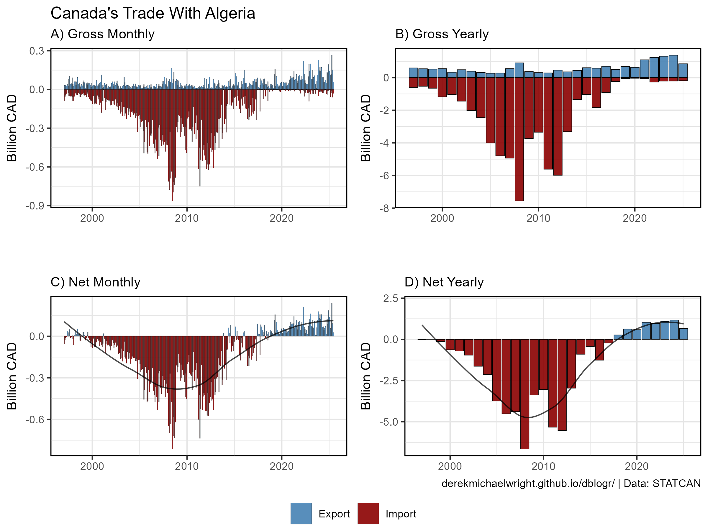

```{r}
mp <- gg_Trade(myArea = "Algeria")
ggsave("canada_trade_algeria.png", mp, width = 8, height = 6, bg = "white")
```

---

## Norway

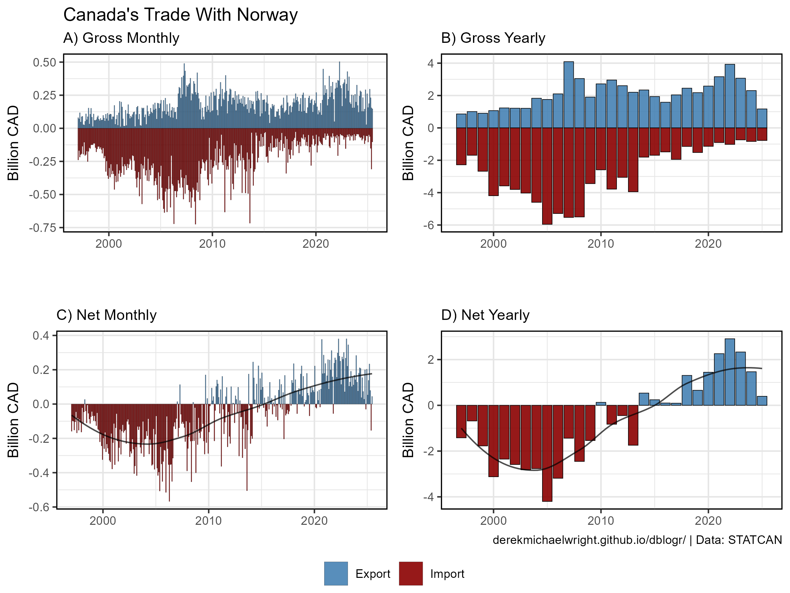

```{r}
mp <- gg_Trade(myArea = "Norway")
ggsave("canada_trade_norway.png", mp, width = 8, height = 6, bg = "white")
```

---

## India

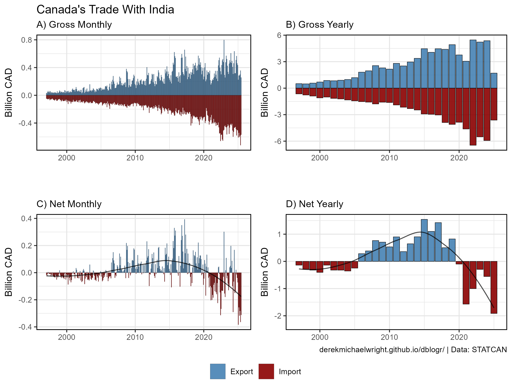

```{r}
mp <- gg_Trade(myArea = "India")
ggsave("canada_trade_india.png", mp, width = 8, height = 6, bg = "white")
```

---

## Iraq

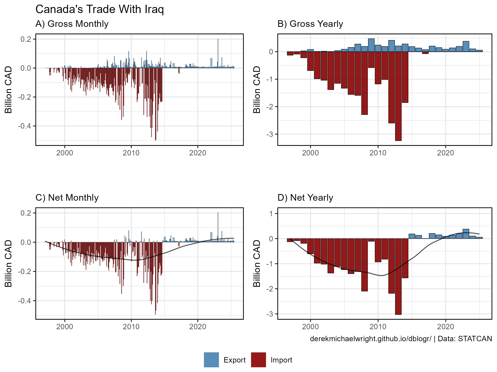

```{r}
mp <- gg_Trade(myArea = "Iraq")
ggsave("canada_trade_iraq.png", mp, width = 8, height = 6, bg = "white")
```

---

## Russia

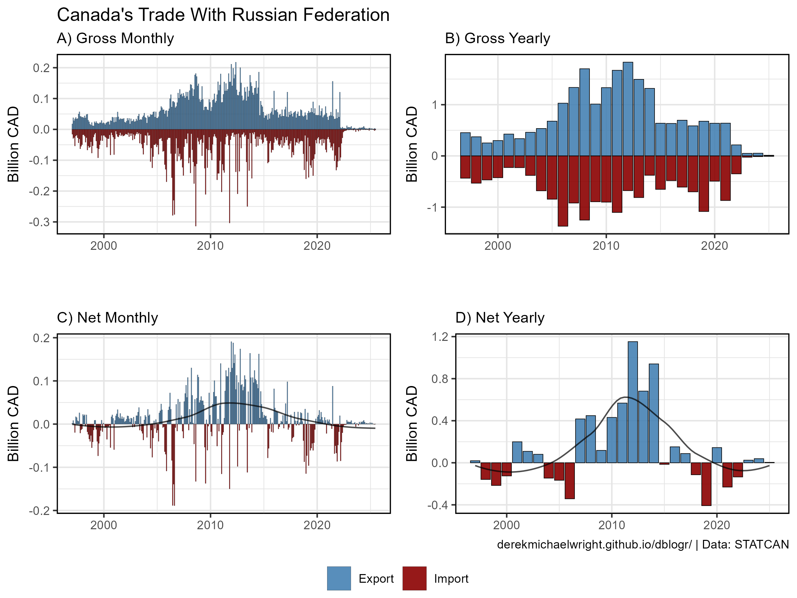

```{r}
mp <- gg_Trade(myArea = "Russian Federation")
ggsave("canada_trade_russia.png", mp, width = 8, height = 6, bg = "white")
```

---

## Saudi Arabia

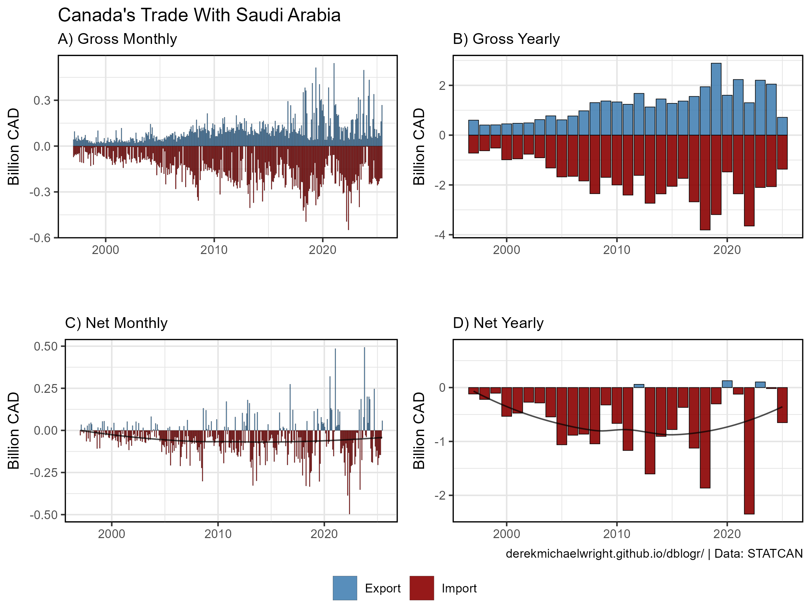

```{r}
mp <- gg_Trade(myArea = "Saudi Arabia")
ggsave("canada_trade_saudi_arabia.png", mp, width = 8, height = 6, bg = "white")
```

---

## China


```{r}
mp <- gg_Trade(myArea = "China")
ggsave("canada_trade_china.png", mp, width = 8, height = 6, bg = "white")
```

---

## Germany

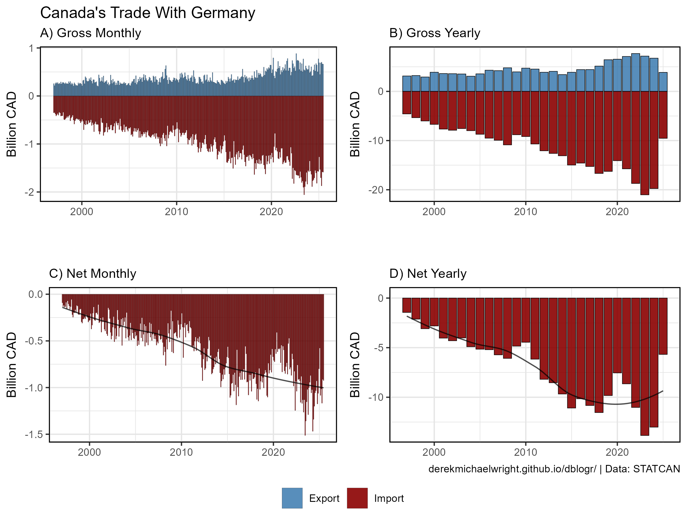

```{r}
mp <- gg_Trade(myArea = "Germany")
ggsave("canada_trade_germany.png", mp, width = 8, height = 6, bg = "white")
```

---

## Mexico


```{r}
mp <- gg_Trade(myArea = "Mexico")
ggsave("canada_trade_mexico.png", mp, width = 8, height = 6, bg = "white")
```

---

## All Countries

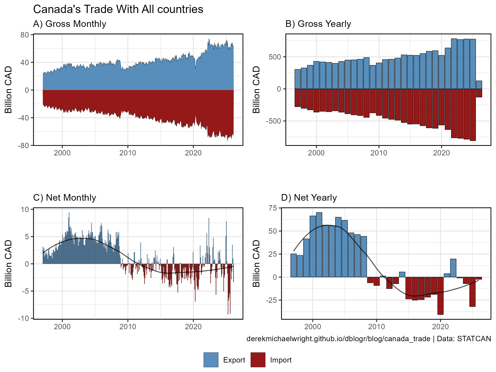

```{r}
mp <- gg_Trade(myArea = "All countries")
ggsave("canada_trade_all.png", mp, width = 8, height = 6, bg = "white")
```

---
