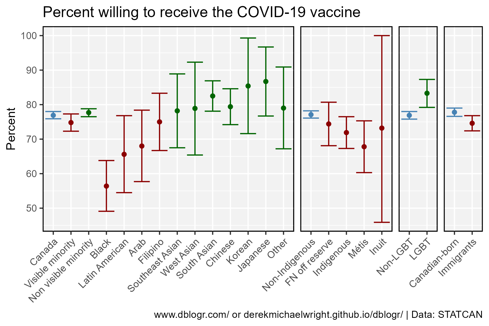
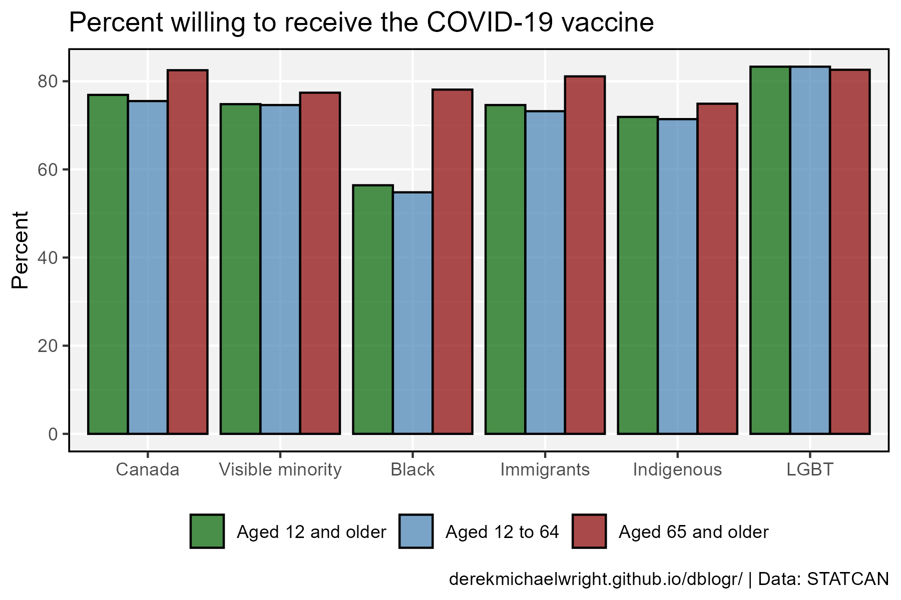

```{r setup, include=FALSE}
knitr::opts_chunk$set(echo = T, message = F, warning = F)
```

---

# Data

> - `r shiny::icon("globe")` [https://www150.statcan.gc.ca/n1/pub/45-28-0001/2021001/article/00011-eng.htm](https://www150.statcan.gc.ca/n1/pub/45-28-0001/2021001/article/00011-eng.htm){target="_blank"}
> - `r shiny::icon("globe")` [https://www.nature.com/articles/s41586-022-05607-y](https://www.nature.com/articles/s41586-022-05607-y){target="_blank"}
> - `r shiny::icon("save")` [data_canada_vaccines.xlsx](data_canada_vaccines.xlsx)

---

# Prepare Data

```{r class.source = "fold-show"}
# devtools::install_github("derekmichaelwright/agData")
library(agData)
library(readxl) # read_xlsx()
```

```{r}
# Prep data
myCaption <- "derekmichaelwright.github.io/dblogr/ | Data: STATCAN"
myColors <- c("darkgreen", "darkred", "steelblue")
#
d1 <- read_xlsx("data_canada_vaccines.xlsx", "Table 1") %>%
  mutate(Measurement = factor(Measurement, levels = unique(.$Measurement)),
         Type = factor(Type, levels = unique(.$Type)))
d2 <- read_xlsx("data_canada_vaccines.xlsx", "Table 2") %>%
  mutate(Measurement = factor(Measurement, levels = unique(.$Measurement))) %>%
  gather(Age, Value, 2:4)
```

---

# By Group



```{r}
# Plot
mp <- ggplot(d1, aes(x = Measurement, color = Color)) +
  geom_point(aes(y = Value)) +
  geom_errorbar(aes(ymin = Min, ymax = Max)) +
  facet_grid(. ~ Type, scales = "free_x", space = "free_x") +
  scale_color_manual(values = myColors) +
  scale_y_continuous(breaks = seq(50, 100, by = 10)) +
  theme(strip.background = element_blank(),
               strip.text.x = element_blank()) +
  theme_agData(legend.position = "none",
               axis.text.x = element_text(angle = 45, hjust = 1)) +
  labs(title = "Percent willing to receive the COVID-19 vaccine", 
       y = "Percent", x = NULL, caption = myCaption)
ggsave("canada_vaccines_01.png", mp, width = 6, height = 4)
```

```{r echo = F}
ggsave("featured.png", mp, width = 6, height = 4)
```

---

# By Age



```{r}
# Plot
mp <- ggplot(d2, aes(x = Measurement, y = Value, fill = Age)) +
  geom_bar(stat = "identity", position = "dodge", 
           color = "black", alpha = 0.7) +
  scale_fill_manual(name = NULL, values = myColors[c(1,3,2)]) +
  theme_agData(legend.position = "bottom") +
  labs(title = "Percent willing to receive the COVID-19 vaccine", 
       y = "Percent", x = NULL, caption = myCaption)
ggsave("canada_vaccines_02.png", mp, width = 6, height = 4)
```

---
