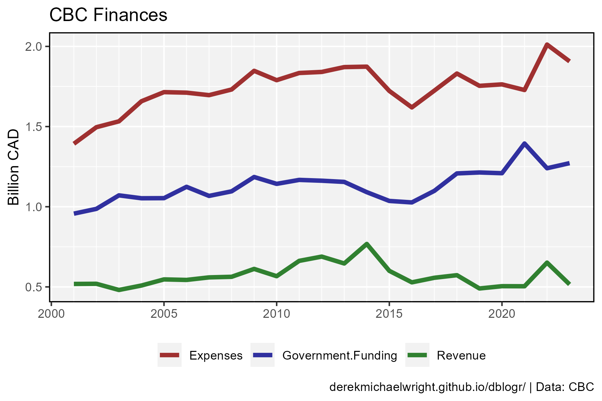
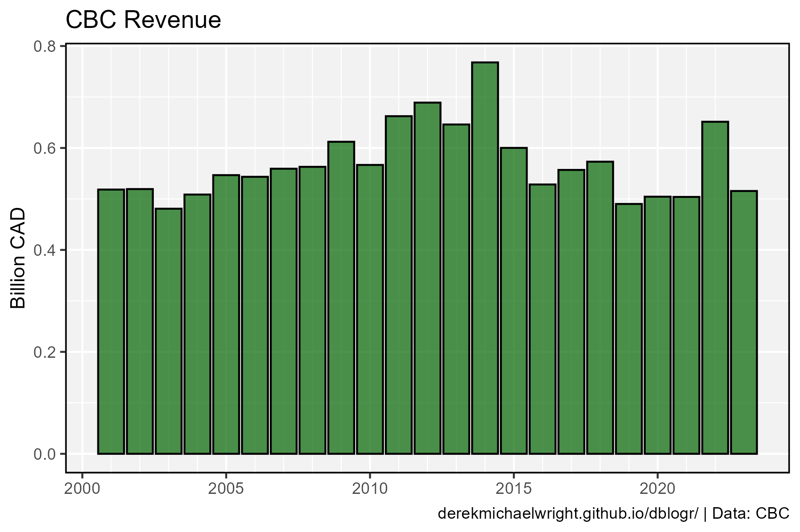
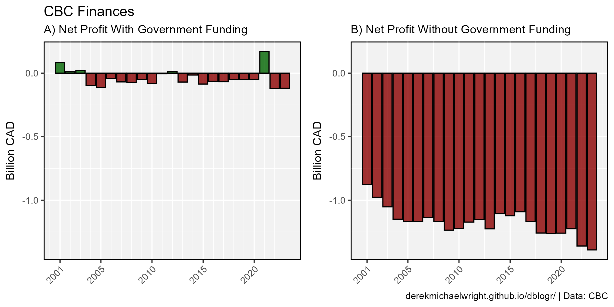
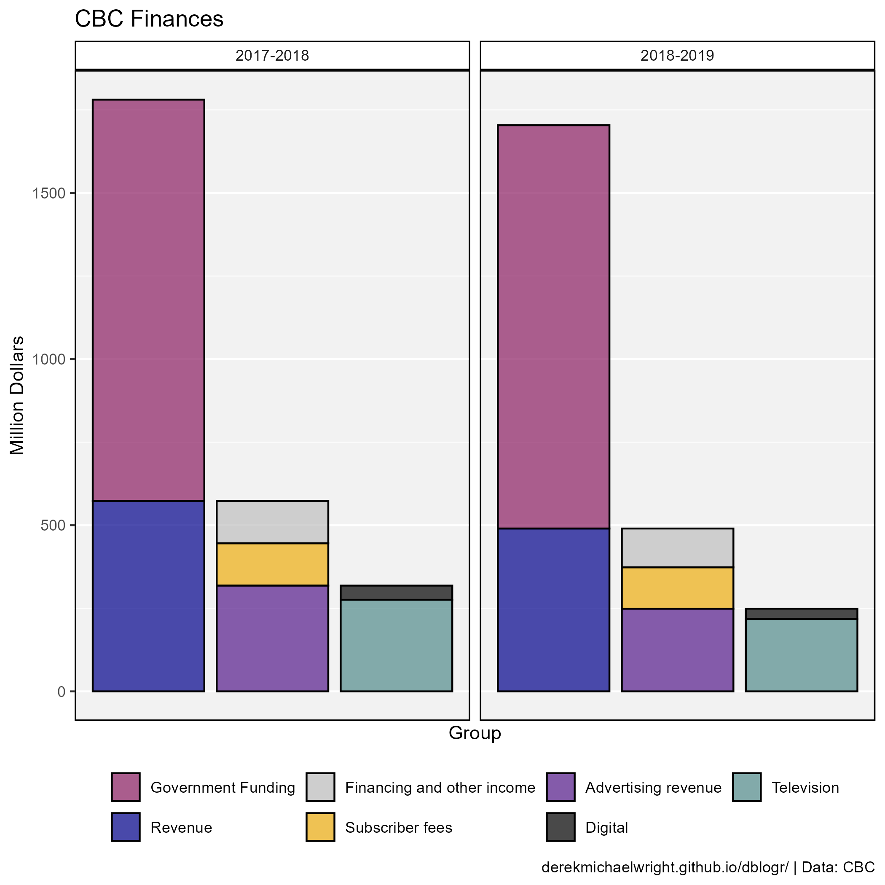
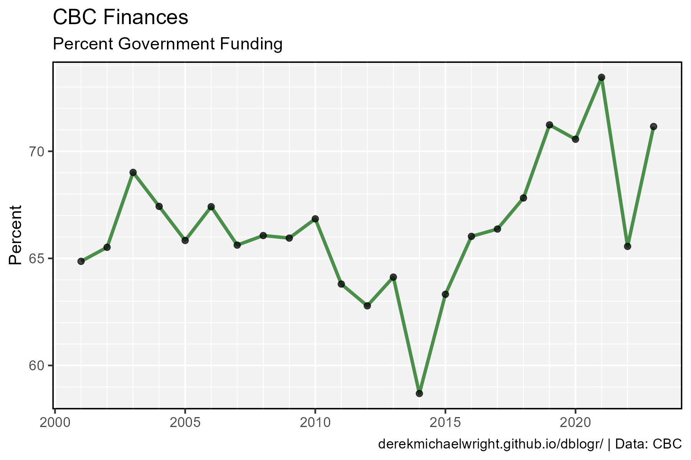

```{r setup, include=FALSE}
knitr::opts_chunk$set(echo = T, message = F, warning = F)
```

---

# Data

CBC finacial reports

> - `r shiny::icon("globe")` https://cbc.radio-canada.ca/en/impact-and-accountability/finances/annual-reports
> - `r shiny::icon("save")` [data_cbc_finances_1.csv](data_cbc_finances_1.csv)
> - `r shiny::icon("save")` [data_cbc_finances_2.csv](data_cbc_finances_2.csv)

---

# Prepare Data

```{r class.source = 'fold-show'}
# devtools::install_github("derekmichaelwright/agData")
library(agData)
```

```{r}
# Prep data
myCaption <- "www.dblogr.com/ or derekmichaelwright.github.io/dblogr/ | Data: CBC"
myColors1 <- c("darkred", "darkblue", "darkgreen")
myColors2 <- c("maroon4", "darkblue", "grey", "darkgoldenrod2", 
              "purple4", "black", "darkslategray4")
#
d1 <- read.csv("data_cbc_finances_1.csv")
d2 <- read.csv("data_cbc_finances_2.csv") %>% 
  mutate(Type = factor(Type, levels = unique(.$Type)))
```

calculate the cost per person per year

```{r}
cost <- d1 %>% 
  filter(Year == 2019) %>% 
  pull(Government.Funding) 
pop <- agData_STATCAN_Population %>% 
  filter(Year == 2019, Area == "Canada") %>% 
  pull(Value) %>% mean()
cost / pop
```

```{r}
d1 %>% filter(Year == 2021) %>% 
  mutate(Percent = 100* `Government.Funding` / (`Government.Funding` + Revenue) ) %>% 
  select(-Discrepancies)
```

---

# Expenses vs Revenue (Bar)


```{r}
# Prep data
xx <- d1 %>% 
  gather(Source, Value, Revenue, Government.Funding, Expenses) %>%
  mutate(PlusMinus = ifelse(Source == "Expenses", "Plus", "Minus"))
# Plot
mp <- ggplot(xx, aes(x = PlusMinus, y = Value / 1000000000, fill = Source)) + 
  geom_col(position = "stack", color = "black", alpha = 0.7) +
  facet_grid(. ~ Year) +
  scale_fill_manual(name = NULL, values = myColors1) +
  theme_agData(legend.position = "bottom",
               axis.text.x = element_blank(), 
               axis.ticks.x = element_blank()) +
  labs(title = "CBC Finances", x = NULL, 
       y = "Billion CAD", caption = myCaption)
ggsave("cbc_finances_01.png", width = 10, height = 4)
```

```{r echo = F}
ggsave("featured.png", mp, width = 10, height = 4)
```

---

# Expenses vs Revenue (Line)



```{r}
# Prep data
xx <- d1 %>% gather(Source, Value, Revenue, Government.Funding, Expenses) 
# Plot
mp <- ggplot(xx, aes(x = Year, y = Value / 1000000000, color = Source)) + 
  geom_line(size = 1.5, alpha = 0.8) + 
  scale_x_continuous(minor_breaks = 2000:2022) +
  scale_color_manual(name = NULL, values = myColors1) +
  theme_agData(legend.position = "bottom") +
  labs(title = "CBC Finances", x = NULL, y = "Billion CAD",
       caption = myCaption)
ggsave("cbc_finances_02.png", width = 6, height = 4)
```

---

# Revenue



```{r}
# Plot
mp <- ggplot(d1, aes(x = Year, y = Revenue / 1000000000)) + 
  geom_col(alpha = 0) +
  geom_line(size = 1.5, color = "darkgreen", alpha = 0.8) + 
  scale_x_continuous(minor_breaks = 2000:2022) +
  scale_color_manual(name = NULL, values = myColors1) +
  theme_agData(legend.position = "bottom") +
  labs(title = "CBC Revenue", x = NULL, y = "Billion CAD",
       caption = myCaption)
ggsave("cbc_finances_03.png", width = 6, height = 4)
```

---

# Net Profit With and Without Government Funding



```{r}
# Prep data
x1 <- d1 %>% 
  mutate(Profit = Revenue + Government.Funding - Expenses,
         Net = ifelse(Profit > 0, "Profit", "Loss") )
x2 <- d1 %>% 
  mutate(Profit = Revenue - Expenses,
         Net = ifelse(Profit > 0, "Profit", "Loss") )
myMin <- min(c(x1$Profit, x2$Profit)) / 1000000000
myMax <- max(c(x1$Profit, x2$Profit)) / 1000000000
# Plot
mp1 <- ggplot(x1, aes(x = Year, y = Profit / 1000000000, fill = Net)) + 
  geom_col(color = "black", alpha = 0.8) +
  scale_fill_manual(values = c("darkred", "darkgreen")) +
  scale_x_continuous(breaks = c(2001,2005,2010,2015,2020),
                     minor_breaks = 2000:2022) + 
  ylim(c(myMin,myMax)) +
  theme_agData(legend.position = "none", 
               axis.text.x = element_text(angle = 45, hjust = 1)) +
  labs(title = "CBC Finances",
       subtitle = "A) Net Profit With Government Funding", 
       y = "Billion CAD", x = NULL)
mp2 <- ggplot(x2, aes(x = Year, y = Profit / 1000000000, fill = Net)) + 
  geom_col(color = "black", alpha = 0.8) +
  scale_fill_manual(values = c("darkred","darkblue")) +
  scale_x_continuous(breaks = c(2001,2005,2010,2015,2020)) +
  ylim(c(myMin,myMax)) +
  theme_agData(legend.position = "none", 
               axis.text.x = element_text(angle = 45, hjust = 1)) +
  labs(subtitle = "B) Net Profit Without Government Funding", 
       y = "Billion CAD", x = NULL, caption = myCaption)
# Append
mp <- ggarrange(mp1, mp2, ncol = 2, align = "h")
ggsave("cbc_finances_04.png", width = 8, height = 4)
```

---

# Funding


Now lets recreate the graph without deception!



```{r}
# Plot
mp <- ggplot(d2, aes(x = Group, y = Value, fill = Type)) +
  geom_col(color = "black", alpha = 0.7) +
  facet_grid(. ~ Year) +
  scale_fill_manual(name = NULL, values = myColors2) +
  scale_x_continuous(minor_breaks = NULL, breaks = NULL) +
  theme_agData(legend.position = "bottom",
               axis.text.x = element_blank(),
               axis.ticks.x = element_blank()) +
  labs(y = "Million Dollars", caption = myCaption)
ggsave("cbc_finances_05.png", width = 7, height = 7)
```

---

# Percent



```{r}
# Prep data
xx <- d1 %>% mutate(Percent = 100 * Government.Funding / (Revenue + Government.Funding))
# Plot
mp <- ggplot(xx, aes(x = Year, y = Percent)) +
  geom_line(color = "darkgreen", size = 1, alpha = 0.7) +
  geom_point(alpha = 0.7) +
  scale_y_continuous(minor_breaks = 59:76) +
  scale_x_continuous(minor_breaks = 2000:2022) +
  theme_agData() +
  labs(title = "CBC", y = "Percent Government Funding",
       x = NULL, caption = myCaption)
ggsave("cbc_finances_06.png", width = 6, height = 4)
```

---
