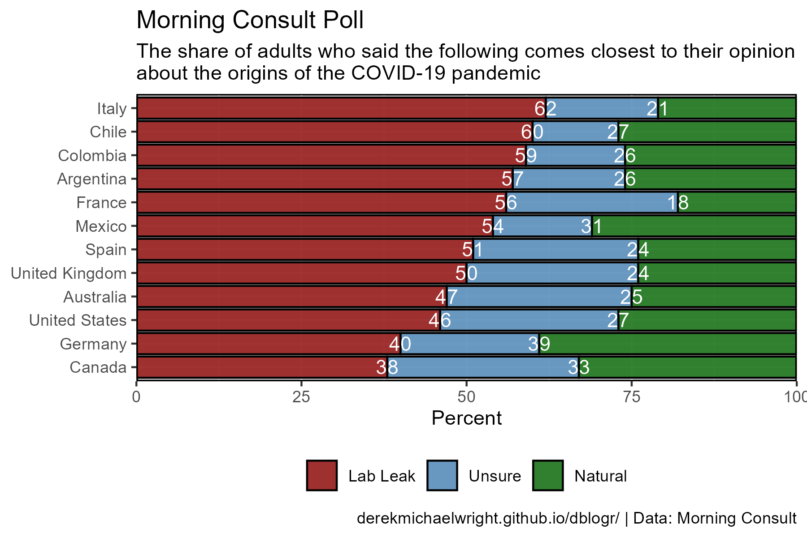
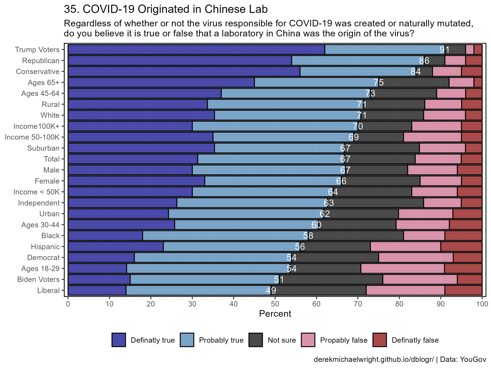
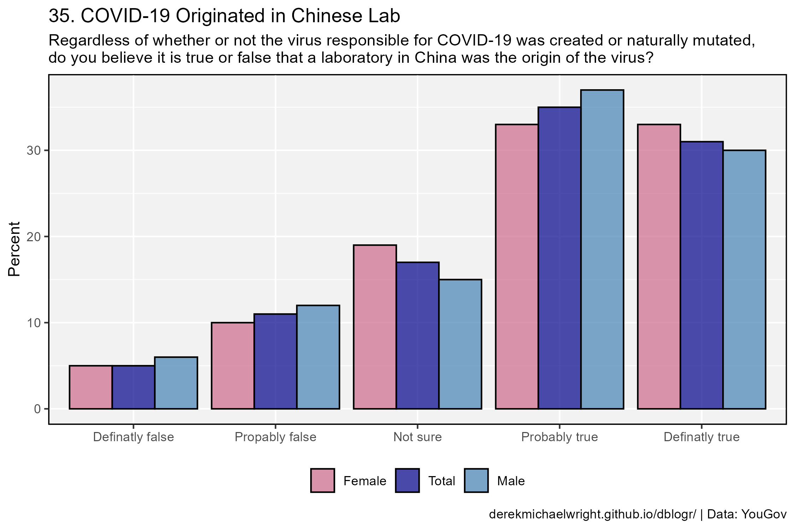
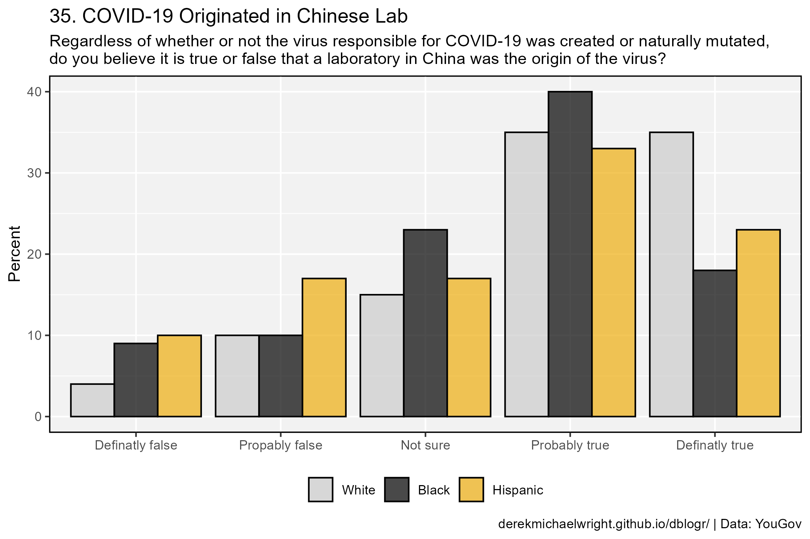
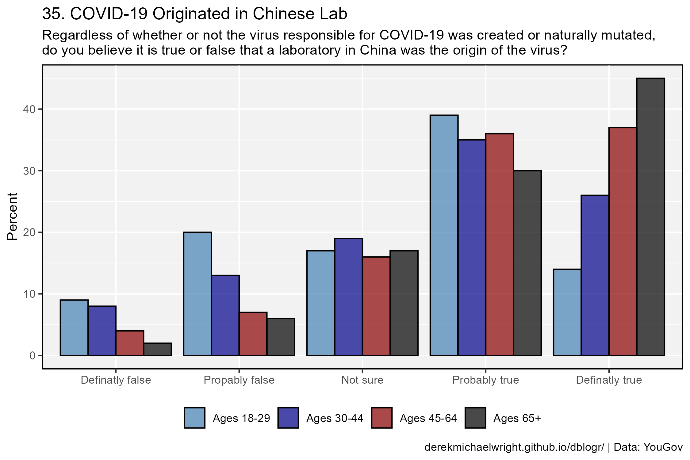
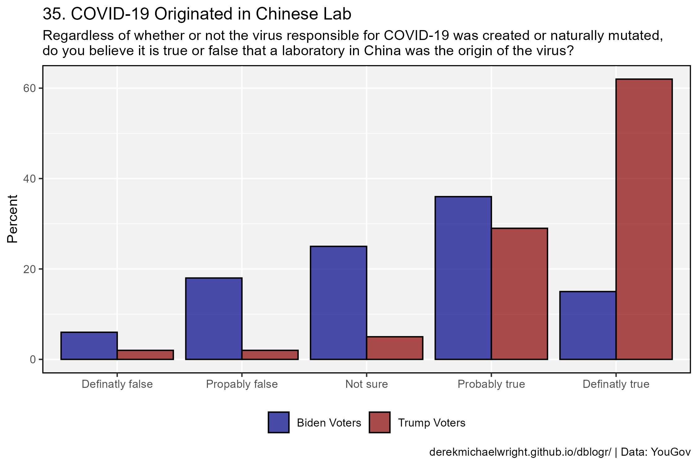
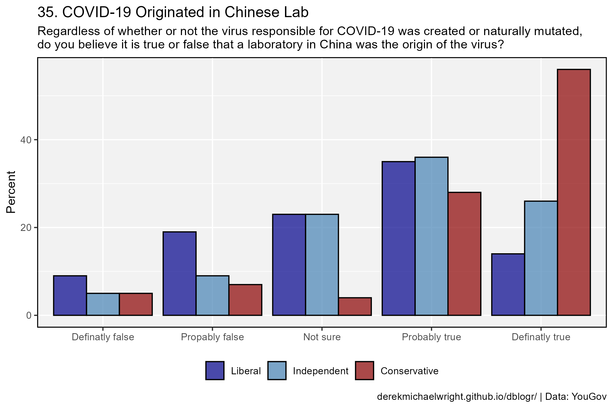
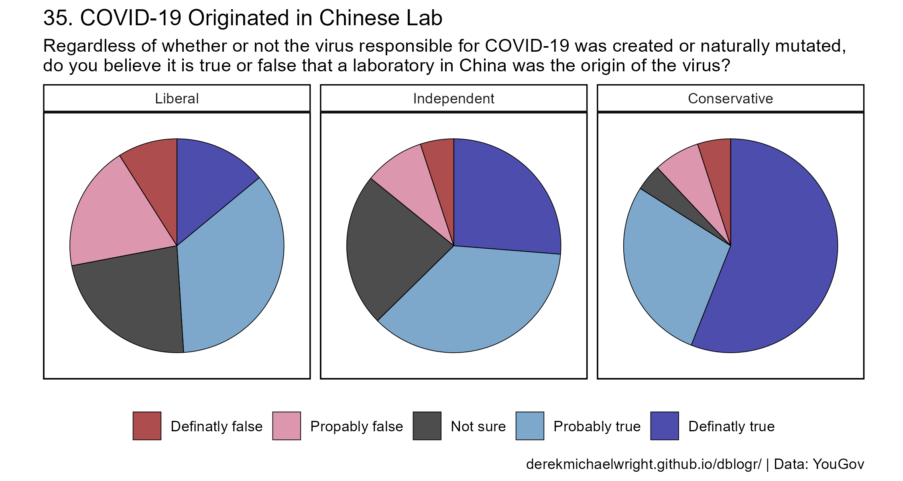

```{r setup, include=FALSE}
knitr::opts_chunk$set(echo = T, message = F, warning = F)
```

---

# Data

`r shiny::icon("globe")` https://morningconsult.com/2023/04/11/covid-19-lab-leak-theory-survey-data/

`r shiny::icon("save")` [data_morning_consult.csv](data_morning_consult.csv)

`r shiny::icon("globe")` https://docs.cdn.yougov.com/d6p3862gac/econTabReport.pdf

`r shiny::icon("save")` [data_yougov.csv](data_yougov.csv)

---

# Prepare Data

```{r class.source = 'fold-show'}
# devtools::install_github("derekmichaelwright/agData")
library(agData)
```

```{r}
# Prep data
myCaption1 <- "www.dblogr.com/ or derekmichaelwright.github.io/dblogr/ | Data: Morning Consult"
d1 <- read.csv("data_morning_consult.csv") %>%
  mutate(Area = factor(Area, levels = rev(.$Area))) 
#
myCaption2 <- "derekmichaelwright.github.io/dblogr/ | Data: YouGov"
myTitle <- "35. COVID-19 Originated in Chinese Lab"
mySubtitle <- "Regardless of whether or not the virus responsible for COVID-19 was created or naturally mutated,\ndo you believe it is true or false that a laboratory in China was the origin of the virus?"
myAnswers <- c("Definatly false", "Propably false", "Not sure",
               "Probably true", "Definatly true")
d2 <- read.csv("data_yougov.csv", skip = 1, check.names = FALSE) %>%
  gather(Group, Percent, 2:ncol(.)) %>%
  mutate(Answer = factor(Answer, levels = myAnswers))
```


# Morning Consult Poll



```{r}
# Prep data
myTraits <- c("Natural", "Unsure", "Lab Leak")
myColors <- c("darkred", "steelblue", "darkgreen")
xx <- d1 %>% gather(Trait, Value, 2:4) %>%
  mutate(Trait = gsub("\\."," ", Trait),
         Trait = factor(Trait, levels = myTraits))
# Plot
mp <- ggplot(xx, aes(x = Area, y = Value, fill = Trait)) +
  geom_bar(stat = "identity", color = "black", alpha = 0.8)  +
  scale_fill_manual(name = NULL, values = myColors, breaks = rev(myTraits)) +
  theme_agData(legend.position = "bottom") +
  coord_flip() +
  labs(y = NULL, caption = myCaption1)
ggsave("covid_origin_1_01.png", mp, width = 6, height = 4)
```

---

# YOUGOV Poll

## 35. COVID-19 Originated in Chinese Lab

Regardless of whether or not the virus responsible for COVID-19 was created or naturally mutated, do you believe it is true or false that a laboratory in China was the origin of the virus?


```{r}
```

---

## All Data


```{r}
# Prep data
myColors <- c("darkred", "palevioletred3","black", "steelblue", "darkblue")
myGroups <- c("Total", "Female",  "Male", "White", "Black", "Hispanic",
              "Ages 18-29", "Ages 30-44", "Ages 45-64", "Ages 65+",
              "Income < 50K", "Income 50-100K", "Income100K+",
              "Urban", "Suburban", "Rural",
              "Democrat", "Liberal", "Biden Voters",  
              "Independent", "Moderate",
              "Republican", "Conservative", "Trump Voters")
xx <- d2 %>% filter(Group %in% myGroups) %>%
  mutate(Group = factor(Group, levels = rev(myGroups))) %>%
  group_by(Group) %>%
  reframe(Answer = Answer, Percent = 100 * Percent / sum(Percent))
yy <- xx %>% filter(Answer %in% c("Definatly true", "Probably true")) %>%
  group_by(Group) %>%
  reframe(Percent = round(sum(Percent)))
# Plot
mp <- ggplot(xx, aes(x= Group, y = Percent)) +
  geom_bar(aes(fill = Answer), stat = "identity", color = "black", alpha = 0.7) +
  geom_text(data = yy, aes(label = Percent), color = "white") +
  scale_fill_manual(name = NULL, values = myColors) +
  scale_y_continuous(breaks = seq(0,100, by = 10), expand = c(0.01,0)) +
  coord_flip() + guides(fill = guide_legend(reverse=TRUE)) +
  theme_agData(legend.position = "bottom") +
  labs(title = myTitle, subtitle = mySubtitle, 
       x = NULL, caption = myCaption2)
ggsave("covid_origin_2_01.png", mp, width = 8, height = 6)
```

---

## Ordered



```{r}
# Prep data
myColors <- c("darkred", "palevioletred3","black", "steelblue", "darkblue")
myGroups <- c("Trump Voters", "Republican", "Conservative", "Ages 65+", 
               "Ages 45-64", "Rural", "White", "Income100K+", "Income 50-100K", 
               "Suburban", "Total", "Male", "Female", "Income < 50K", 
               "Independent", "Urban", "Ages 30-44", "Black", "Hispanic",   
               "Democrat", "Ages 18-29", "Biden Voters", "Liberal")
xx <- d2 %>% filter(Group %in% myGroups) %>%
  mutate(Group = factor(Group, levels = rev(myGroups))) %>%
  group_by(Group) %>%
  reframe(Answer = Answer, Percent = 100 * Percent / sum(Percent))
yy <- xx %>% filter(Answer %in% c("Definatly true", "Probably true")) %>%
  group_by(Group) %>%
  reframe(Percent = round(sum(Percent)))
# Plot
mp <- ggplot(xx, aes(x = Group, y = Percent)) +
  geom_bar(aes(fill = Answer), stat = "identity", color = "black", alpha = 0.7) +
  geom_text(data = yy, aes(label = Percent), color = "white") +
  scale_fill_manual(name = NULL, values = myColors) +
  scale_y_continuous(breaks = seq(0,100, by = 10), expand = c(0.01,0)) +
  coord_flip() + guides(fill = guide_legend(reverse=TRUE)) +
  theme_agData(legend.position = "bottom") +
  labs(title = myTitle, subtitle = mySubtitle, 
       x = NULL, caption = myCaption2)
ggsave("covid_origin_2_02.png", mp, width = 8, height = 6)
```

```{r echo = F}
ggsave("featured.png", mp, width = 8, height = 6)
```

---

## Bar Charts

```{r}
# Create plotting function
plotPoll_1 <- function(xx = d2, myGroups, myColors, 
                       myTitle = "35. COVID-19 Originated in Chinese Lab",
                       mySubtitle = "Regardless of whether or not the virus responsible for COVID-19 was created or naturally mutated,\ndo you believe it is true or false that a laboratory in China was the origin of the virus?") {
  # Prep data
  xx <- xx %>% filter(Group %in% myGroups) %>%
    mutate(Group = factor(Group, levels = myGroups))
  # Plot
  ggplot(xx, aes(x = Answer, y = Percent, fill = Group)) +
    geom_bar(stat = "identity", position = "dodge", 
             color = "black", alpha = 0.7) +
    scale_fill_manual(name = NULL, values = myColors) +
    theme_agData(legend.position = "bottom") +
    labs(title = myTitle, subtitle = mySubtitle, 
         x = NULL, caption = myCaption2)
}
```

---

### Total



```{r}
# Plot
mp <- plotPoll_1(myGroups = c("Female", "Total", "Male"), 
               myColors = c("palevioletred3", "darkblue", "steelblue"))
ggsave("covid_origin_3_01.png", mp, width = 7.5, height = 5)
```

---

### Race



```{r}
# Plot
mp <- plotPoll_1(myGroups = c("White", "Black", "Hispanic"), 
               myColors = c("grey80", "black", "darkgoldenrod2"))
ggsave("covid_origin_3_02.png", mp, width = 7.5, height = 5)
```

---

### Age



```{r}
# Plot
mp <- plotPoll_1(myGroups = c("Ages 18-29", "Ages 30-44", "Ages 45-64", "Ages 65+"), 
               myColors = c("steelblue", "darkblue", "darkred", "black"))
ggsave("covid_origin_3_03.png", mp, width = 7.5, height = 5)
```

---

### Biden vs Trump



```{r}
# Plot
mp <- plotPoll_1(myGroups = c("Biden Voters", "Trump Voters"), 
               myColors = c("darkblue", "darkred"))
ggsave("covid_origin_3_04.png", mp, width = 7.5, height = 5)
```

---

### Ideology



```{r}
# Plot
mp <- plotPoll_1(myGroups = c("Liberal", "Independent", "Conservative"), 
               myColors = c("darkblue", "steelblue", "darkred"))
ggsave("covid_origin_3_05.png", mp, width = 7.5, height = 5)
```

---

## Pie

```{r}
# Create plotting function
plotPoll_2 <- function(xx = d2, myGroups, 
                       myColors = c("darkred", "palevioletred3","black", "steelblue", "darkblue"), 
                       myTitle = "35. COVID-19 Originated in Chinese Lab",
                       mySubtitle = "Regardless of whether or not the virus responsible for COVID-19 was created or naturally mutated,\ndo you believe it is true or false that a laboratory in China was the origin of the virus?") {
  # Prep data
  xx <- xx %>% filter(Group %in% myGroups) %>%
    mutate(Group = factor(Group, levels = myGroups)) %>%
    group_by(Group) %>%
    summarise(Answer = Answer,
              Percent = 100 * Percent / sum(Percent))
  # Plot
  ggplot(xx, aes(x = "", y = Percent, fill = Answer)) +
    geom_bar(stat = "identity", lwd = 0.2,
             color = "black", alpha = 0.7) +
    coord_polar("y", start = 0) +
    facet_grid(. ~ Group) +
    scale_fill_manual(name = NULL, values = myColors) +
    theme_agData_pie(legend.position = "bottom") +
    labs(title = myTitle, subtitle = mySubtitle, 
         x = NULL, caption = myCaption2)
}
```

---

### Total


```{r}
# Plot
mp <- plotPoll_2(myGroups = "Total")
ggsave("covid_origin_4_01.png", mp, width = 8, height = 8)
```

---

### Race


```{r}
# Plot
mp <- plotPoll_2(myGroups = c("White", "Black", "Hispanic"))
ggsave("covid_origin_4_02.png", mp, width = 7.5, height = 4)
```

---

### Age


```{r}
# Plot
mp <- plotPoll_2(myGroups = c("Ages 18-29", "Ages 30-44", "Ages 45-64", "Ages 65+"))
ggsave("covid_origin_4_03.png", mp, width = 7.5, height = 3.5)
```

---

### Biden vs Trump


```{r}
# Plot
mp <- plotPoll_2(myGroups = c("Biden Voters", "Trump Voters"))
ggsave("covid_origin_4_04.png", mp, width = 7.5, height = 5)
```

---

### Ideology



```{r}
# Plot
mp <- plotPoll_2(myGroups = c("Liberal", "Independent", "Conservative"))
ggsave("covid_origin_4_05.png", mp, width = 7.5, height = 4)
```

---
