```{r setup, include=FALSE}
knitr::opts_chunk$set(echo = TRUE, message = F, warning = F)
```

---

# Data

Our World In Data - Share of expenditure spent on food

> - `r shiny::icon("globe")` [https://ourworldindata.org/grapher/food-expenditure-share-gdp](https://ourworldindata.org/grapher/food-expenditure-share-gdp){target="_blank"}
> - `r shiny::icon("save")` [food-expenditure-share-gdp.csv](food-expenditure-share-gdp.csv)

U.S. Bureau of Labor Statistics - Household spending

> - `r shiny::icon("globe")` [https://t.co/Y6VqkxviLO](https://t.co/Y6VqkxviLO){target="_blank"}
> - `r shiny::icon("save")` [data_usa_households.csv](data_usa_households.csv)

U.S. Bureau of Labor Statistics - Food prices

> - `r shiny::icon("globe")` [https://www.bls.gov/](https://www.bls.gov/){target="_blank"}
> - `r shiny::icon("save")` [data_usa_food_prices.csv](data_usa_food_prices.csv)

U.S. Bureau of Labor Statistics - CPI (Food) 

> - `r shiny::icon("globe")` [https://fred.stlouisfed.org/series/CUSR0000SAF11](https://fred.stlouisfed.org/series/CUSR0000SAF11){target="_blank"}
> - `r shiny::icon("save")` [data_usa_cpi_food.csv](data_usa_cpi_food.csv)

USDA - SNAP 

> - `r shiny::icon("globe")` [https://www.fns.usda.gov/pd/supplemental-nutrition-assistance-program-snap](https://www.fns.usda.gov/pd/supplemental-nutrition-assistance-program-snap){target="_blank"}
> - `r shiny::icon("save")` [data_usa_snap.csv](data_usa_snap.csv)

STATCAN Table 18-10-0004-01 - Consumer Price Index

> - `r shiny::icon("globe")` [https://www150.statcan.gc.ca/t1/tbl1/en/cv.action?pid=1810000401](https://www150.statcan.gc.ca/t1/tbl1/en/cv.action?pid=1810000401){target="_blank"}
> - `r shiny::icon("save")` [1810000401_databaseLoadingData.csv](1810000401_databaseLoadingData.csv)

---

# Prepare Data

```{r class.source = "fold-show"}
# devtools::install_github("derekmichaelwright/agData")
library(agData)
library(readxl)
library(gganimate)
```

```{r}
# Prep data
myCaption1 <- "derekmichaelwright.github.io/dblogr/ | Data: OWID"
myCaption2 <- "derekmichaelwright.github.io/dblogr/ | Data: US BLS"
myCaption3 <- "derekmichaelwright.github.io/dblogr/blog/ | Data: USDA"
myCaption4 <- "derekmichaelwright.github.io/dblogr/blog/ | Data: STATCAN"
#
myCs_Regions <- c("darkred", "darkgreen", "darkorange", "darkblue", "steelblue")
myCs_Food <- c("darkred", "darkgoldenrod2", "grey50", "steelblue", 
                   "darkblue", "slategray4", "red")
myCs_Home <-  c("darkgreen", "darkred", "steelblue", "grey50", "darkblue")
myMs_Home <- c("Food", "Clothing", "Housing", "Other",
               "Expenditures", "Household income")
myAs <- c("USA", "Germany", "Switzerland", "Hong Kong",
          "Japan", "China", "Brazil", 
          "Bangladesh", "India", "Nigeria", "Kenya")
#
d1 <- read.csv("food-expenditure-share-gdp.csv") %>%
  rename(ISO3=Code, 
         TotalExp=Total.consumer.expenditure,
         FoodPercent=Food.expenditure) %>% 
  filter(!is.na(TotalExp)) %>%
  left_join(agData_FAO_Country_Table, by = "ISO3") %>%
  mutate(FoodExp = FoodPercent * TotalExp / 100,
         Label = ifelse(Country %in% myAs, Country, NA))
#
d2 <- read.csv("data_usa_households.csv") %>%
  mutate(Measurement = gsub(" allocation", "", Measurement),
         Measurement = factor(Measurement, levels = myMs_Home))
#
d3 <- read.csv("data_usa_food_prices.csv")
#
d4 <- read.csv("data_usa_cpi_food.csv") %>%
  rename(Date = observation_date, Value=2) %>%
  mutate(Year = as.numeric(substr(Date, 1, 4)),
         Month = as.numeric(substr(Date, 5, 6)),
         Date = as.Date(Date))
#
d5 <- read_xlsx("data_usa_snap.xlsx", skip = 2) %>% 
  rename(Year=`Fiscal Year`) %>%
  filter(!is.na(`Total Costs (Millions of Dollars)`)) %>% 
  mutate(Year = as.numeric(Year))
#
d6 <- read.csv("1810000401_databaseLoadingData.csv") %>%
  select(Date=REF_DATE, Area=GEO, Measurement=Products.and.product.groups,
         Unit=UOM, Value=VALUE) %>%
  mutate(Year = as.numeric(substr(Date, 1, 4)),
         Month = as.numeric(substr(Date, 5, 6)),
         Date = as.Date(paste0(Date, "-01")) )
```

---

# Global Food Expenditures {.tabset .tabset-pills}

## Food vs Total Expenditures 2017

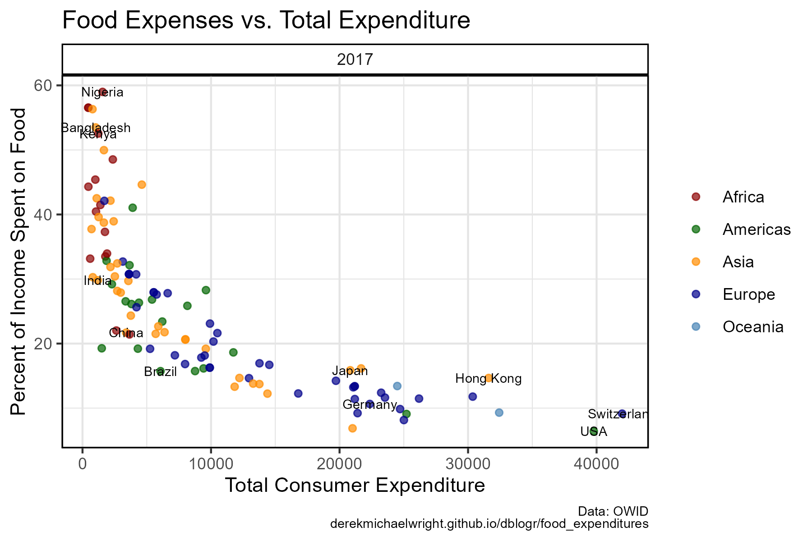

```{r}
# Prep data
xx <- d1 %>% filter(Year == 2017)
# Plot
mp <- ggplot(xx, aes(x = TotalExp, y = FoodPercent)) +
  geom_point(aes(color = Region), alpha = 0.7) +
  geom_text(aes(label = Label), size = 2.5) +
  facet_grid(. ~ Year) +
  scale_color_manual(name = NULL, values = myCs_Regions) +
  theme_agData() +
  labs(title = "Food Expenses vs. Total Expenditure",
       y = "Percent of Income Spent on Food", 
       x = "Total Consumer Expenditure", 
       caption = myCaption1)
ggsave("food_expenditures_1_01.png", mp, width = 6, height = 4)
```

---

## Food vs Total Expenditures 2023

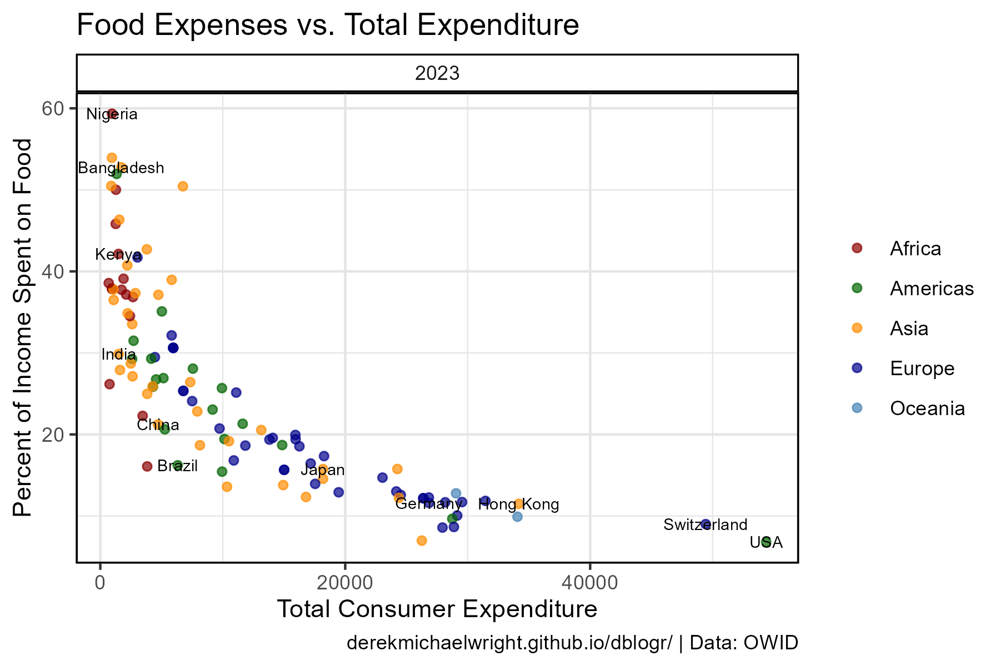

```{r}
# Prep data
xx <- d1 %>% filter(Year == 2023)
# Plot
mp <- ggplot(xx, aes(x = TotalExp, y = FoodPercent)) +
  geom_point(aes(color = Region), alpha = 0.7) +
  geom_text(aes(label = Label), size = 2.5) +
  facet_grid(. ~ Year) +
  scale_color_manual(name = NULL, values = myCs_Regions) +
  theme_agData() +
  labs(title = "Food Expenses vs. Total Expenditure",
       y = "Percent of Income Spent on Food", 
       x = "Total Consumer Expenditure", 
       caption = myCaption1)
ggsave("food_expenditures_1_02.png", mp, width = 6, height = 4)
```

```{r echo = F}
ggsave("featured.png", mp, width = 6, height = 4)
```

---

## 2017 - 2023

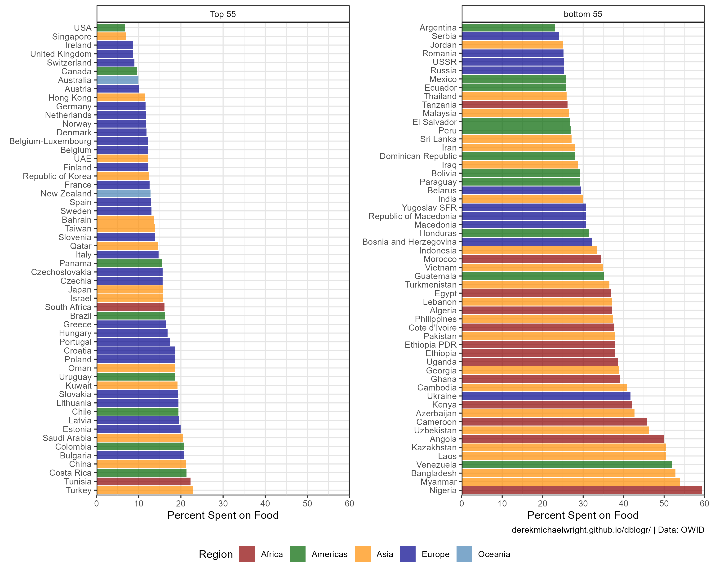

```{r}
# Prep data
x1 <- d1 %>% filter(Year == 2017)
x2 <- d1 %>% filter(Year == 2023)
x3 <- d1 %>% filter(Year %in% c(2017,2023)) %>% 
  select(Country, Region, Year, FoodPercent, TotalExp) %>%
  gather(Measurement, Value, FoodPercent, TotalExp) %>%
  mutate(Measurement = paste(Measurement, Year)) %>%
  select(-Year) %>%
  spread(Measurement, Value)
# Plot
mp <- ggplot(x1, aes(x = TotalExp, y = FoodPercent, color = Region)) +
  geom_segment(data = x3, alpha = 0.5,
               aes(x = `TotalExp 2017`, xend = `TotalExp 2023`, 
                   y = `FoodPercent 2017`, yend = `FoodPercent 2023`)) +
  geom_point(alpha = 0.2) +
  geom_point(data = x2) +
  geom_text(aes(label = Label), size = 2.5) +
  scale_color_manual(name = NULL, values = myCs_Regions) +
  theme_agData() +
  labs(title = "Food Expenses vs. Total Expenditure",
       subtitle = "2017 - 2023",
       y = "Percent of Income Spent on Food", 
       x = "Total Consumer Expenditure", 
       caption = myCaption1)
ggsave("food_expenditures_1_03.png", mp, width = 6, height = 4)
#
```

---

## Country Bars 2023


```{r}
# Prep data
xx <- d1 %>% filter(Year == 2023) %>% 
  arrange(desc(FoodPercent)) 
x1 <- xx %>% slice(56:110) %>%
  mutate(Country = factor(Country, levels = .$Country))
x2 <- xx %>% slice(1:55) %>%
  mutate(Country = factor(Country, levels = .$Country))
# Plot
mp1 <- ggplot(x1, aes(x = Country, y = FoodPercent)) +
  geom_col(aes(fill = Region), alpha = 0.7) +
  facet_grid(. ~ "Top 55") +
  scale_y_continuous(limits = c(0,60), expand = c(0,0)) +
  coord_flip() +
  scale_fill_manual(values = myCs_Regions) +
  theme_agData() +
  labs(y = "Percent Spent on Food", x = NULL, caption = "")
mp2 <- ggplot(x2, aes(x = Country, y = FoodPercent)) +
  geom_col(aes(fill = Region), alpha = 0.7) +
  facet_grid(. ~ "bottom 55") + 
  scale_y_continuous(limits = c(0,60), expand = c(0,0)) +
  coord_flip() +
  scale_fill_manual(values = myCs_Regions) +
  theme_agData() +
  labs(y = "Percent Spent on Food", x = NULL, caption = myCaption1)
mp <- ggarrange(mp1, mp2, ncol = 2, common.legend = T, legend = "bottom") 
ggsave("food_expenditures_1_04.png", mp, width = 10, height = 8, bg = "white")
```

---

## Total Food

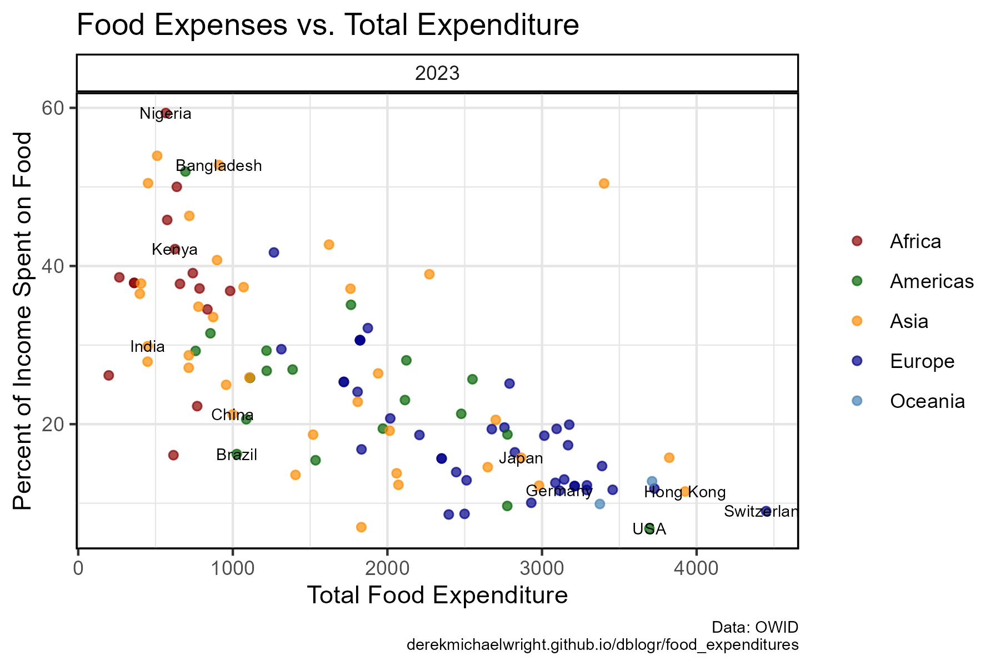

```{r}
# Prep data
xx <- d1 %>% filter(Year == 2023)
# Plot
mp <- ggplot(xx, aes(x = FoodExp, y = FoodPercent)) +
  geom_point(aes(color = Region), alpha = 0.7) +
  geom_text(aes(label = Label), size = 2.5) +
  facet_grid(. ~ Year) +
  scale_color_manual(name = NULL, values = myCs_Regions) +
  theme_agData() +
  labs(title = "Food Expenses vs. Total Expenditure",
       y = "Percent of Income Spent on Food", 
       x = "Total Food Expenditure", 
       caption = myCaption1)
ggsave("food_expenditures_1_05.png", mp, width = 6, height = 4)
```

---

## Regions

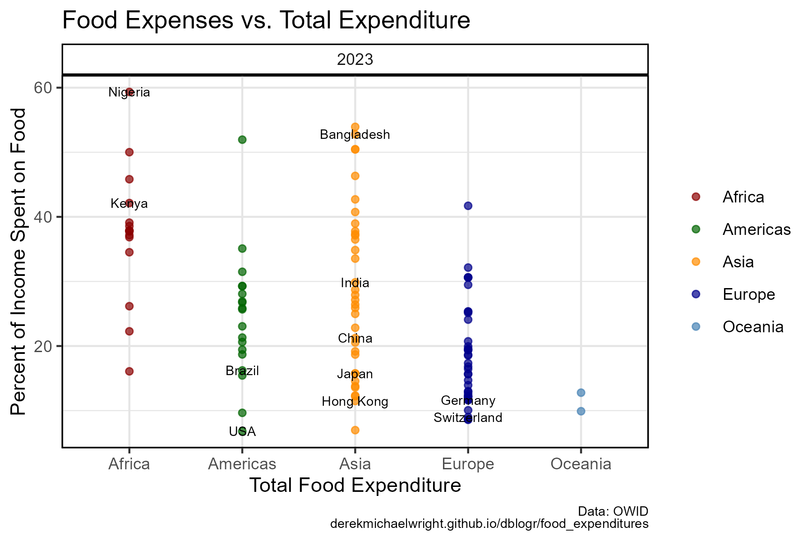

```{r}
# Prep data
xx <- d1 %>% filter(Year == 2023)
# Plot
mp <- ggplot(xx, aes(x = Region, y = FoodPercent)) +
  geom_point(aes(color = Region), alpha = 0.7) +
  geom_text(aes(label = Label), size = 2.5) +
  facet_grid(. ~ Year) +
  scale_color_manual(name = NULL, values = myCs_Regions) +
  theme_agData() +
  labs(title = "Food Expenses vs. Total Expenditure",
       y = "Percent of Income Spent on Food", 
       x = "Total Food Expenditure", 
       caption = myCaption1)
ggsave("food_expenditures_1_06.png", mp, width = 6, height = 4)
```

---

# US Household Expenditures {.tabset .tabset-pills}

## USA

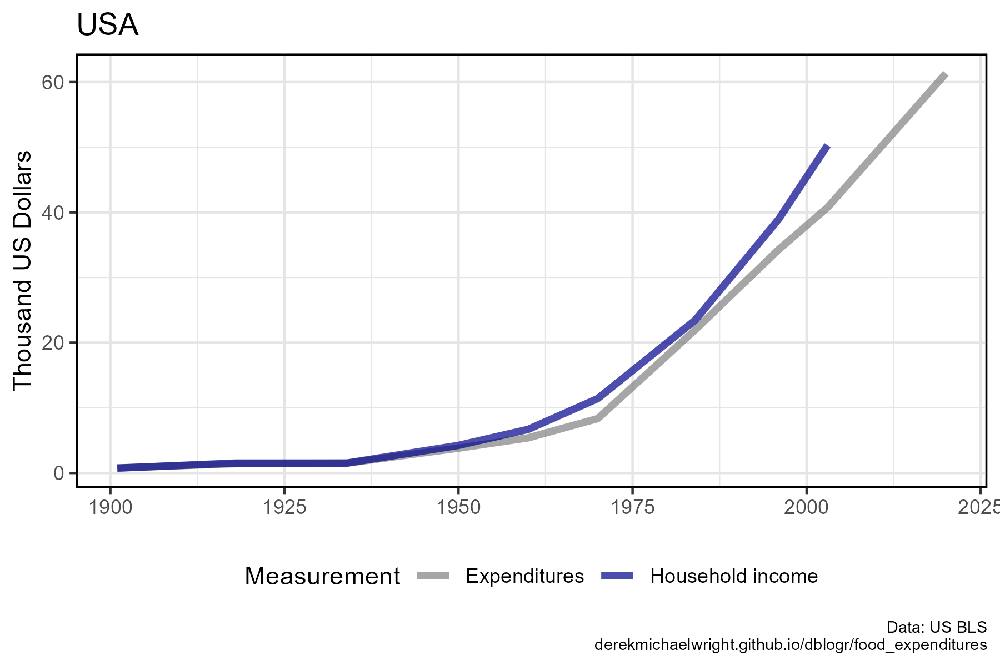

```{r}
# Prep data
xx <- d2 %>% filter(Measurement %in% c("Expenditures", "Household income"))
# Plot
mp <- ggplot(xx, aes(x = Year, y = Value / 1000, color = Measurement)) +
  geom_line(linewidth = 1.5, alpha = 0.7) +
  scale_color_manual(values = myCs_Home[4:5]) +
  theme_agData(legend.position = "bottom") +
  labs(title = "USA", y = "Thousand US Dollars",
       x = NULL, caption = myCaption2)
ggsave("food_expenditures_2_01.png", mp, width = 6, height = 4)
```

---

## Allocations {.tabset .tabset-pills}

### Line Graph

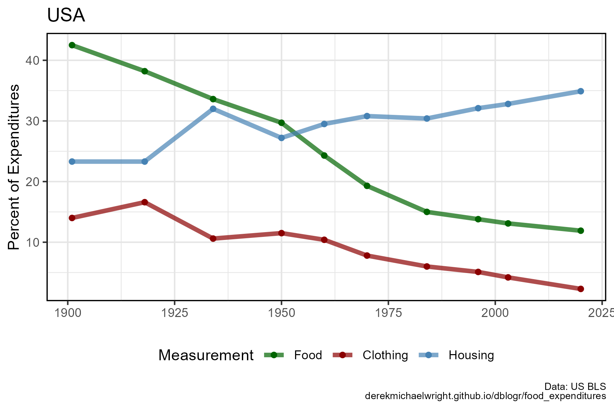

```{r}
# Prep data
xx <- d2 %>% 
  filter(!Measurement %in% c("Expenditures", "Household income"))
# Plot
mp <- ggplot(xx, aes(x = Year, y = Value, color = Measurement)) +
  geom_line(size = 1.5, alpha = 0.7) +
  geom_point() +
  scale_color_manual(values = myCs_Home) +
  theme_agData(legend.position = "bottom") +
  labs(title = "USA", y = "Percent of Expenditures",
       x = NULL, caption = myCaption2)
ggsave("food_expenditures_2_02.png", mp, width = 6, height = 4)
```

---

### Bar Graph

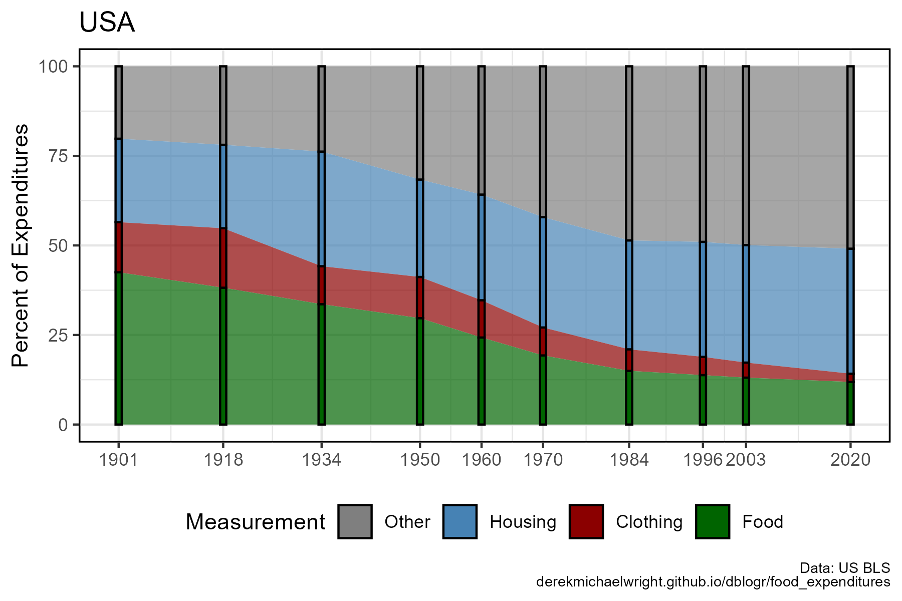

```{r}
# Prep data
xx <- d2 %>% 
  filter(!Measurement %in% c("Expenditures", "Household income")) %>%
  spread(Measurement, Value) %>%
  mutate(Other = 100 - (Clothing + Food + Housing)) %>%
  gather(Measurement, Value, 3:ncol(.)) %>%
  mutate(Measurement = factor(Measurement, levels = rev(myMs_Home)))
 # Plot
mp <- ggplot(xx, aes(x = Year, y = Value, fill = Measurement)) +
  geom_area(alpha = 0.7) +
  geom_col(color = "black", size = 0.2, width = 1) +
  scale_fill_manual(values = myCs_Home[4:1]) +
  scale_x_continuous(breaks = unique(xx$Year)) +
  theme_agData(legend.position = "bottom") +
  labs(title = "USA", y = "Percent of Expenditures",
       x = NULL, caption = myCaption2)
ggsave("food_expenditures_2_03.png", mp, width = 6, height = 4)
```

---

## Food Expenditures

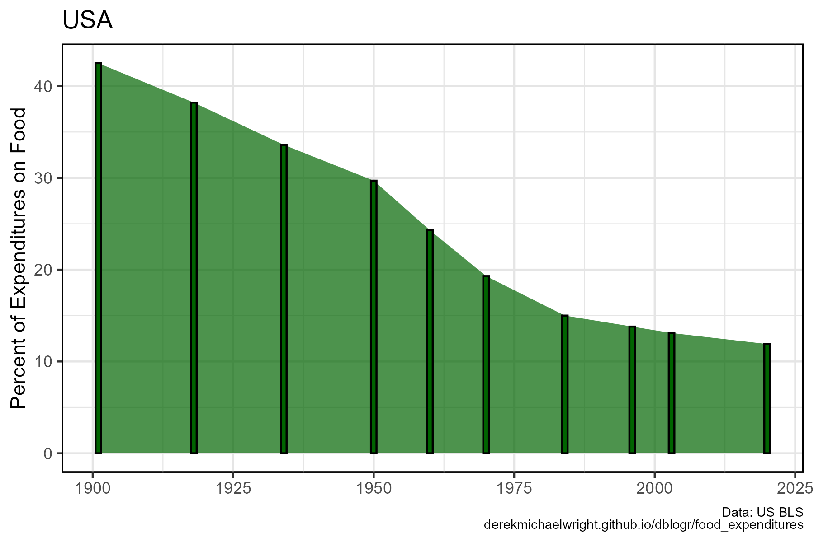

```{r}
# Plot
mp <- ggplot(d2 %>% filter(Measurement == "Food"), aes(x = Year, y = Value)) +
  geom_area(fill = "darkgreen", alpha = 0.7) +
  geom_col(color = "black", fill = "darkgreen", size = 0.2, width = 1) +
  theme_agData(legend.position = "bottom") +
  labs(title = "USA", y = "Percent of Expenditures on Food",
       x = NULL, caption = myCaption2)
ggsave("food_expenditures_2_04.png", mp, width = 6, height = 4)
```

---

## Housing Expenditures

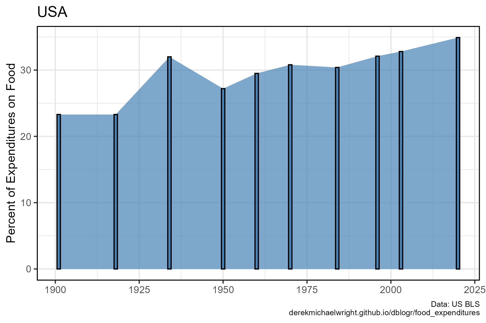

```{r}
# Plot
mp <- ggplot(d2 %>% filter(Measurement == "Housing"), aes(x = Year, y = Value)) +
  geom_area(fill = "steelblue", alpha = 0.7) +
  geom_col(color = "black", fill = "steelblue", size = 0.2, width = 1) +
  theme_agData(legend.position = "bottom") +
  labs(title = "USA", y = "Percent of Expenditures on Food",
       x = NULL, caption = myCaption2)
ggsave("food_expenditures_2_05.png", mp, width = 6, height = 4)
```

---

## Animation

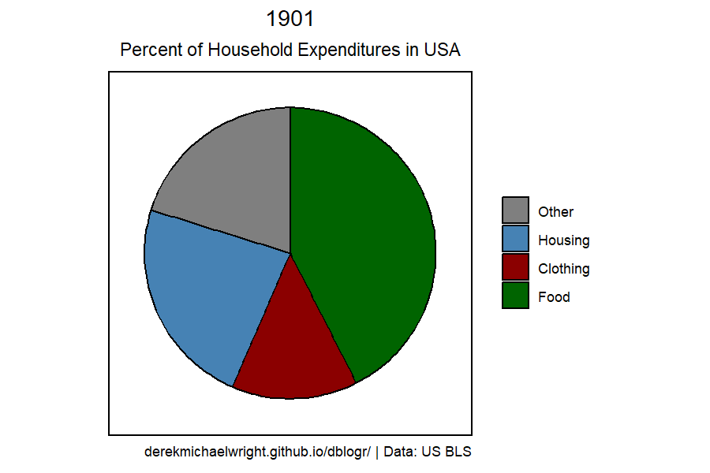

```{r}
# Prep data
xx <- d2 %>% 
  filter(!Measurement %in% c("Expenditures", "Household income")) %>%
  spread(Measurement, Value) %>%
  mutate(Other = 100 - (Clothing + Food + Housing)) %>%
  gather(Measurement, Value, 3:ncol(.)) %>%
  mutate(Measurement = factor(Measurement, levels = rev(myMs_Home)))
# Plot
mp <- ggplot(xx, aes(x = "", y = Value, fill = Measurement)) +
  geom_bar(stat = "identity", color = "black") +
  scale_fill_manual(name = NULL, values = myCs_Home[4:1]) +
  coord_polar("y", start = 0) +
  theme_agData_pie(legene.positon = "bottom",
                   plot.title = element_text(hjust = 0.5),
                   plot.subtitle = element_text(hjust = 0.5)) +
  labs(title = "{round(frame_time)}", caption = myCaption2,
       subtitle = "Percent of Household Expenditures in USA") +
  transition_time(Year)
anim_save("food_expenditures_2_01.gif", mp,
          nframes = 300, fps = 10, end_pause = 30, 
          width = 900, height = 600, res = 150, units = "px")
```

---

## Food Prices {.tabset .tabset-pills}

### unfacetted

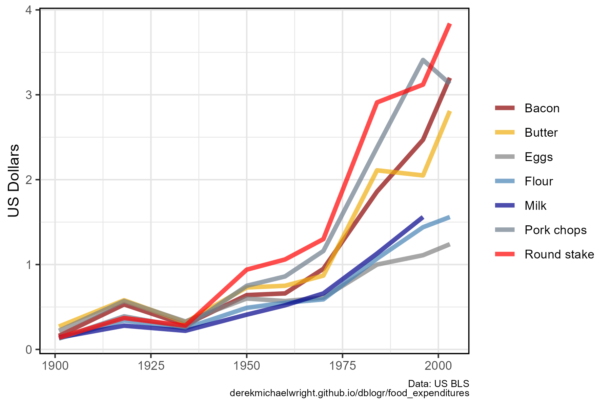

```{r}
# Plot
mp <- ggplot(d3, aes(x = Year, y = Value, color = Item)) +
  geom_line(size = 1.5, alpha = 0.7) + 
  scale_color_manual(name = NULL, values = myCs_Food) +
  theme_agData() +
  labs(tiele = "United States", x = NULL, 
       y = "US Dollars", caption = myCaption2)
ggsave("food_expenditures_3_01.png", mp, width = 6, height = 4)
```

---

### Facetted

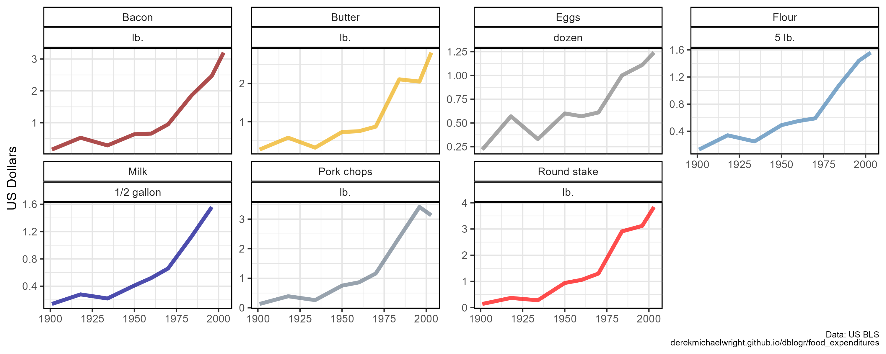

```{r}
# Plot
mp <- ggplot(d3, aes(x = Year, y = Value, color = Item)) +
  geom_line(size = 1.5, alpha = 0.7) + 
  scale_color_manual(name = NULL, values = myCs_Food) +
  facet_wrap(Item + Unit ~ ., ncol = 4, scales = "free_y") +
  theme_agData(legend.position = "none") +
  labs(tiele = "United States", x = NULL, 
       y = "US Dollars", caption = myCaption2)
ggsave("food_expenditures_3_02.png", mp, width = 10, height = 4)
```

---

# CPI - Food at Home {.tabset .tabset-pills}

## All Data

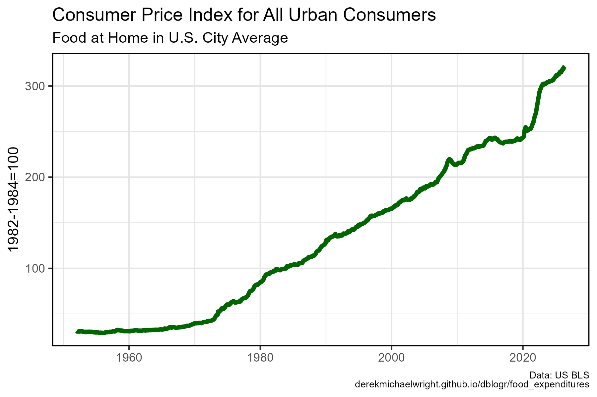

```{r}
# Plot
mp <- ggplot(d4, aes(x = Date, y = Value)) +
  geom_line(color = "darkgreen", linewidth = 1.5) +
  theme_agData() +
  labs(title = "Consumer Price Index for All Urban Consumers",
       subtitle = "Food at Home in U.S. City Average", 
       y = "1982-1984=100", x = NULL, caption = myCaption2)
ggsave("food_expenditures_4_01.png", mp, width = 6, height = 4)
```

---

## >2005

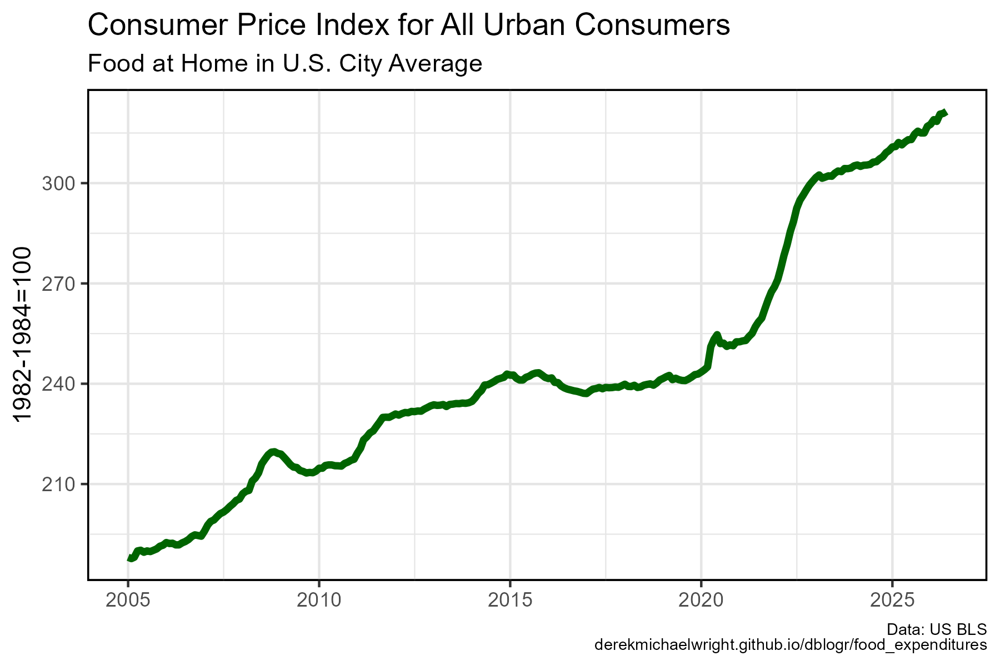

```{r}
# Prep data
xx <- d4 %>% filter(Year > 2004)
# Plot
mp <- ggplot(xx, aes(x = Date, y = Value)) +
  geom_line(color = "darkgreen", linewidth = 1.5) +
  theme_agData() +
  labs(title = "Consumer Price Index for All Urban Consumers",
       subtitle = "Food at Home in U.S. City Average", 
       y = "1982-1984=100", x = NULL, caption = myCaption2)
ggsave("food_expenditures_4_02.png", mp, width = 6, height = 4)
```

---

## >2015

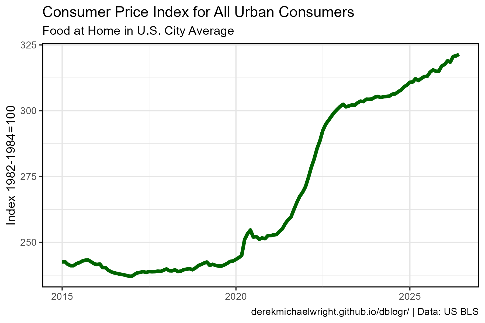

```{r}
# Prep data
xx <- d4 %>% filter(Year > 2014)
# Plot
mp <- ggplot(xx, aes(x = Date, y = Value)) +
  geom_line(color = "darkgreen", linewidth = 1.5) +
  scale_x_date(minor_breaks = "1 year") +
  theme_agData() +
  labs(title = "Consumer Price Index for All Urban Consumers",
       subtitle = "Food at Home in U.S. City Average", 
       y = "1982-1984=100", x = NULL, caption = myCaption2)
ggsave("food_expenditures_4_03.png", mp, width = 6, height = 4)
```

---

## Modeling

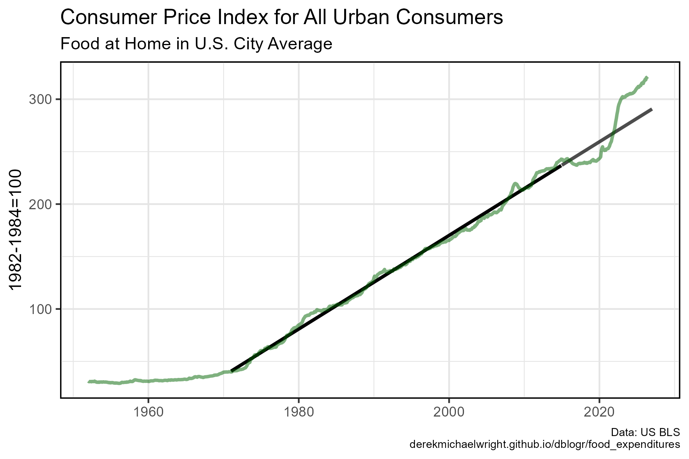

```{r}
# Prep data
x1 <- d4 %>% filter(Year > 1970, Year < 2015)
fit <- lm(Value ~ Date, data = x1)
x2 <- data.frame(Date = as.Date(c("2015-01-01", "2027-01-01"), format = "%Y-%m-%d"))
x2$Value <- predict(fit, newdata = x2)
# Plot
mp <- ggplot(d4, aes(x = Date, y = Value)) +
  geom_smooth(data = x1, geom = "line", method = "lm", lwd = 1, color = "black") +
  geom_line(data = x2, lwd = 1, alpha = 0.7) +
  geom_line(color = "darkgreen", lwd = 1, alpha = 0.5) +
  theme_agData() +
  labs(title = "Consumer Price Index for All Urban Consumers",
       subtitle = "Food at Home in U.S. City Average", 
       y = "1982-1984=100", x = NULL, caption = myCaption2)
ggsave("food_expenditures_4_04.png", mp, width = 6, height = 4)
```

---

## Modeling

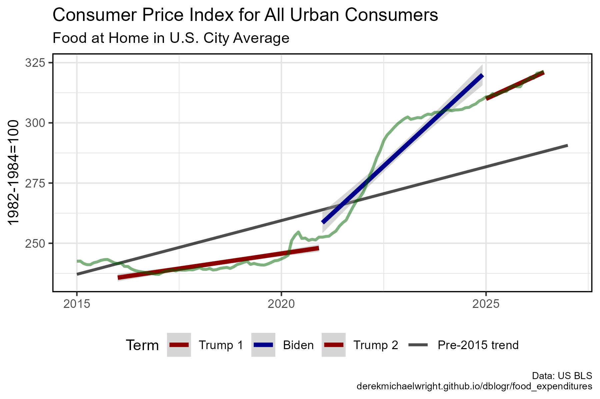

```{r}
# Prep data
xx <- d4 %>% filter(Year > 2014)
#
x1 <- d4 %>% filter(Year > 1970, Year < 2015)
fit <- lm(Value ~ Date, data = x1)
x2 <- data.frame(Date = as.Date(c("2015-01-01", "2027-01-01"), format = "%Y-%m-%d"))
x2$Value <- predict(fit, newdata = x2)
#
y1 <- d4 %>% filter(Year >= 2016, Year <= 2020) %>% mutate(Term = "Trump 1")
y2 <- d4 %>% filter(Year >= 2021, Year <= 2024) %>% mutate(Term = "Biden")
y3 <- d4 %>% filter(Year >= 2025, Year <= 2030) %>% mutate(Term = "Trump 2")
yy <- bind_rows(y1, y2, y3) %>% 
  mutate(Term = factor(Term, levels = c("Trump 1", "Biden", "Trump 2")))
# Plot
mp <- ggplot(xx, aes(x = Date, y = Value)) +
  geom_line(data = x2, lwd = 1, alpha = 0.7, aes(color = "Pre-2015 trend")) +
  geom_smooth(data = yy, geom = "line", method = "lm", aes(color = Term), lwd = 1.5) +
  geom_line(color = "darkgreen", lwd = 1, alpha = 0.5) +
  scale_color_manual(values = c("darkred","darkblue","darkred", "black")) +
  theme_agData(legend.position = "bottom") +
  labs(title = "Consumer Price Index for All Urban Consumers",
       subtitle = "Food at Home in U.S. City Average", 
       y = "1982-1984=100", x = NULL, caption = myCaption2)
ggsave("food_expenditures_4_05.png", mp, width = 6, height = 4)
```

---

# SNAP {.tabset .tabset-pills}

## All Data 

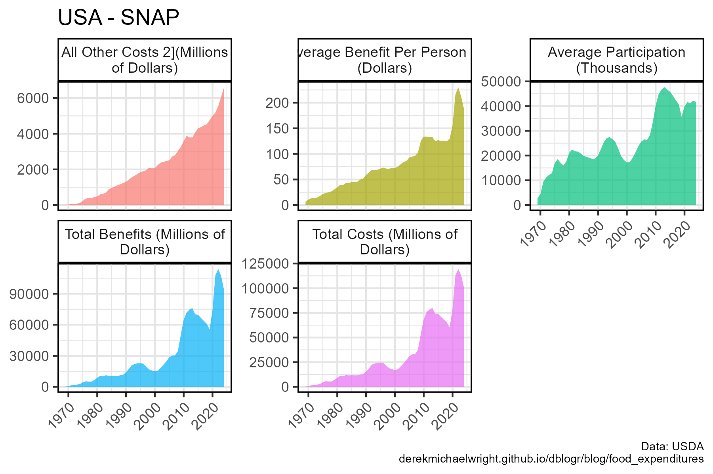

```{r}
# Prep data
xx <- d5 %>% gather(Measurement, Value, 2:6)
# Plot
mp <- ggplot(xx, aes(x = Year, y = Value, fill = Measurement)) + 
  geom_area(alpha = 0.7) +
  facet_wrap(Measurement ~ ., scales = "free_y", 
             labeller = label_wrap_gen(width = 30)) +
  theme_agData(legend.position = "none",
               axis.text.x = element_text(angle = 45, hjust = 1)) +
  labs(title = "USA - SNAP",
       y = NULL, x = NULL, caption = myCaption3)
ggsave("food_expenditures_5_01.png", mp, width = 6, height = 4)
```

---

## Participants

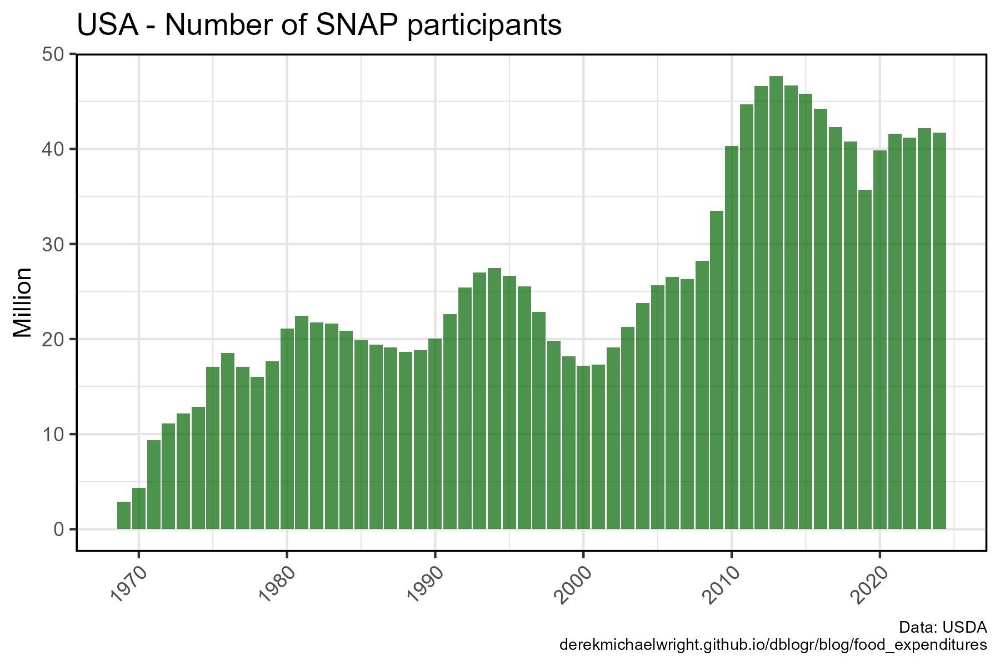

```{r}
# Plot
mp <- ggplot(d5, aes(x = Year, y = `Average Participation (Thousands)` / 1000)) + 
  geom_col(fill = "darkgreen", alpha = 0.7) +
  theme_agData(axis.text.x = element_text(angle = 45, hjust = 1)) +
  labs(title = "USA - Number of SNAP participants",
       y = "Million", x = NULL, caption = myCaption3)
ggsave("food_expenditures_5_02.png", mp, width = 6, height = 4)
```

---

## Total Costs

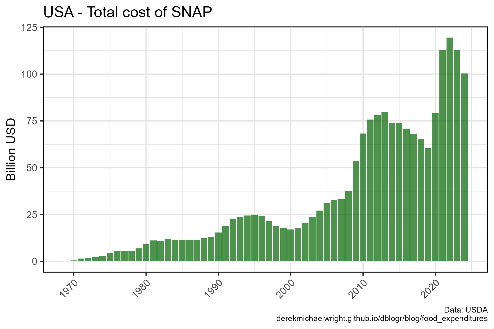

```{r}
# Plot
mp <- ggplot(d5, aes(x = Year, y = `Total Costs (Millions of Dollars)` / 1000)) + 
  geom_col(fill = "darkgreen", alpha = 0.7) +
  theme_agData(axis.text.x = element_text(angle = 45, hjust = 1)) +
  labs(title = "USA - Total cost of SNAP",
       y = "Billion USD", x = NULL, caption = myCaption3)
ggsave("food_expenditures_5_03.png", mp, width = 6, height = 4)
```

---

# STATCAN - CPI {.tabset .tabset-pills}

## All Data

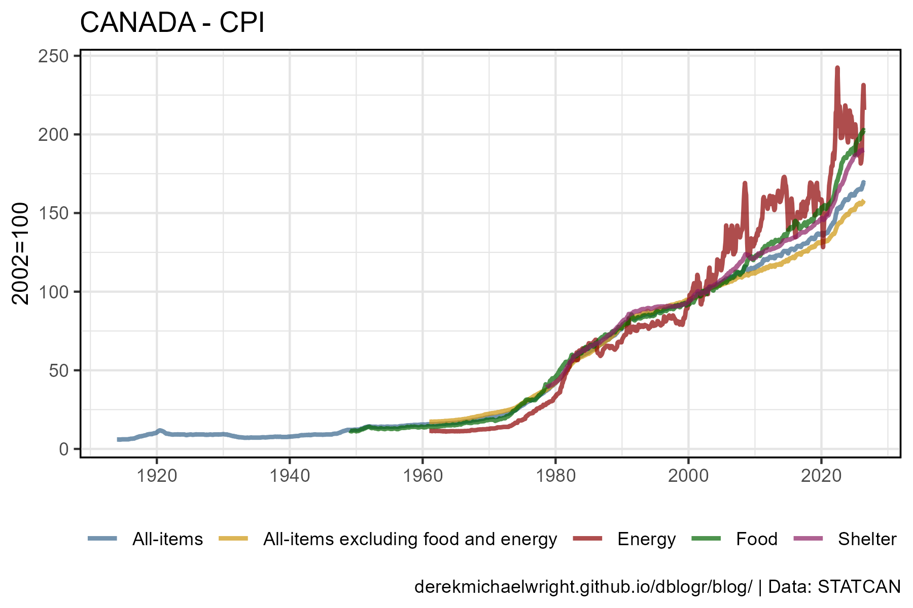

```{r}
# Prep data
myColors <- c("steelblue4", "darkgoldenrod3", "darkred", "darkgreen", "maroon4")
xx <- d6 %>% filter(Area == "Canada")
# Plot
mp <- ggplot(xx, aes(x = Date, y = Value, color = Measurement)) + 
  geom_line(lwd = 1, alpha = 0.7) +
  scale_color_manual(name = NULL, values = myColors) +
  theme_agData(legend.position = "bottom") +
  labs(title = "CANADA - CPI", y = "2002=100", x = NULL, caption = myCaption4)
ggsave("food_expenditures_6_01.png", mp, width = 6, height = 4)
```

---

## Food

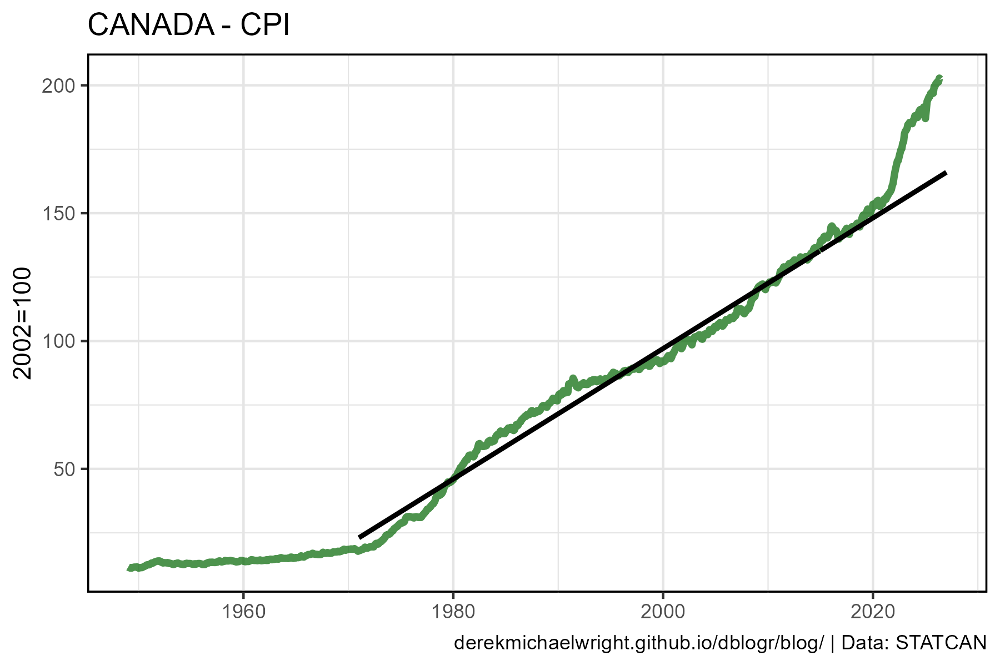

```{r}
# Prep data
xx <- d6 %>% filter(Area == "Canada", Measurement == "Food")
x1 <- xx %>% filter(Year > 1970, Year < 2015)
fit <- lm(Value ~ Date, data = x1)
x2 <- data.frame(Date = as.Date(c("2015-01-01", "2027-01-01"), format = "%Y-%m-%d"))
x2$Value <- predict(fit, newdata = x2)
# Plot
mp <- ggplot(xx, aes(x = Date, y = Value)) + 
  geom_line(color = "darkgreen", lwd = 1.5, alpha = 0.7) +
  geom_smooth(data = x1, geom = "line", method = "lm", color = "black") +
  geom_line(data = x2, color = "black", lwd = 1) +
  scale_color_manual(name = NULL, values = agData_Colors) +
  theme_agData() +
  labs(title = "CANADA - CPI", y = "2002=100", x = NULL, caption = myCaption4)
ggsave("food_expenditures_6_02.png", mp, width = 6, height = 4)
```

---

## >2015

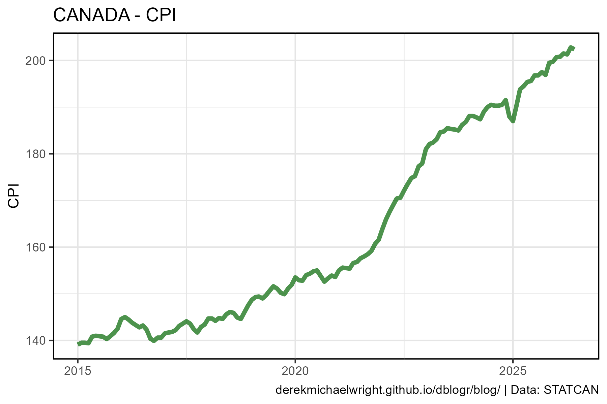

```{r}
# Prep data
xx <- d6 %>% filter(Area == "Canada", Measurement == "Food", Year > 2014)
# Plot
mp <- ggplot(xx, aes(x = Date, y = Value)) + 
  geom_line(color = "darkgreen", lwd = 1.5, alpha = 0.7) +
  scale_color_manual(name = NULL, values = agData_Colors) +
  scale_x_date(minor_breaks = "1 year") +
  theme_agData() +
  labs(title = "CANADA - CPI", y = "2002=100", x = NULL, caption = myCaption4)
ggsave("food_expenditures_6_03.png", mp, width = 6, height = 4)
```

---

## Modeling

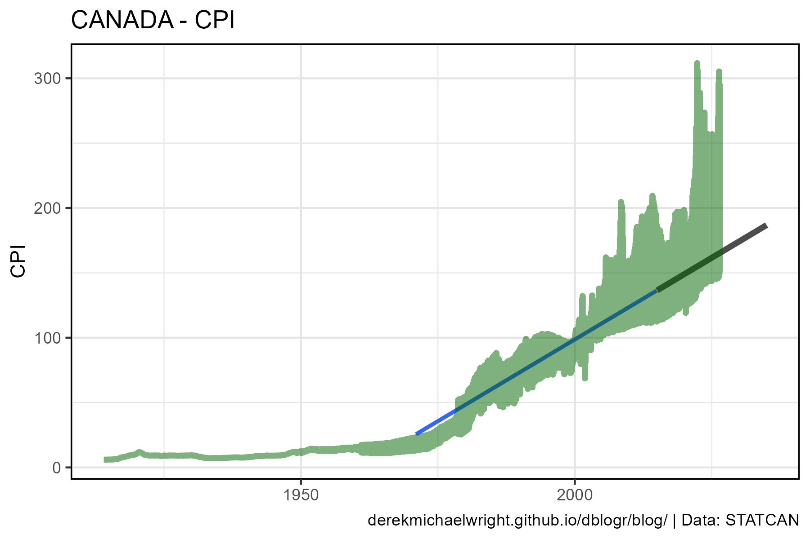

```{r}
# Prep data
xx <- d6 %>% filter(Area == "Canada", Measurement == "Food", Year > 2014)
#
x1 <- d6 %>% filter(Area == "Canada", Measurement == "Food", Year > 1970, Year < 2015)
fit <- lm(Value ~ Date, data = x1)
x2 <- data.frame(Date = as.Date(c("2015-01-01", "2027-01-01"), format = "%Y-%m-%d"))
x2$Value <- predict(fit, newdata = x2)
#
y1 <- xx %>% filter(Year >= 2016, Year <= 2020) %>% mutate(Term = "Trudaue Pre-COVID")
y2 <- xx %>% filter(Year >= 2021, Year <= 2025) %>% mutate(Term = "Trudaue Post-COVID")
y3 <- xx %>% filter(Year >= 2026, Year <= 2030) %>% mutate(Term = "Carney")
yy <- bind_rows(y1, y2, y3) %>% 
  mutate(Term = factor(Term, levels = c("Trudaue Pre-COVID", "Trudaue Post-COVID", "Carney")))
# Plot
mp <- ggplot(xx, aes(x = Date, y = Value)) +
  geom_line(data = x2, lwd = 1, alpha = 0.7, aes(color = "Pre-2015 Trend")) +
  geom_smooth(data = yy, geom = "line", method = "lm", aes(color = Term), lwd = 1) +
  geom_line(color = "darkgreen", lwd = 1, alpha = 0.5) +
  scale_color_manual(values = c("darkorange","darkred","steelblue", "black")) +
  theme_agData() +
  labs(title = "CANADA - CPI", y = "2002=100", x = NULL, caption = myCaption4)
ggsave("food_expenditures_6_04.png", mp, width = 6, height = 4)
```

---
