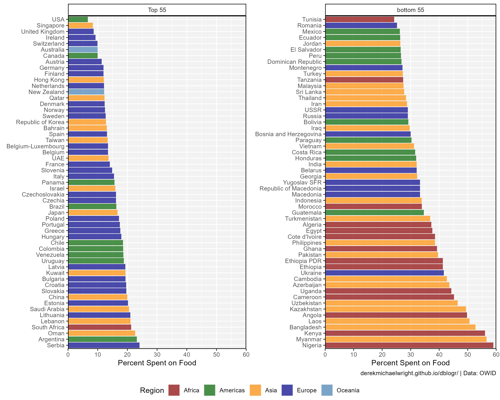
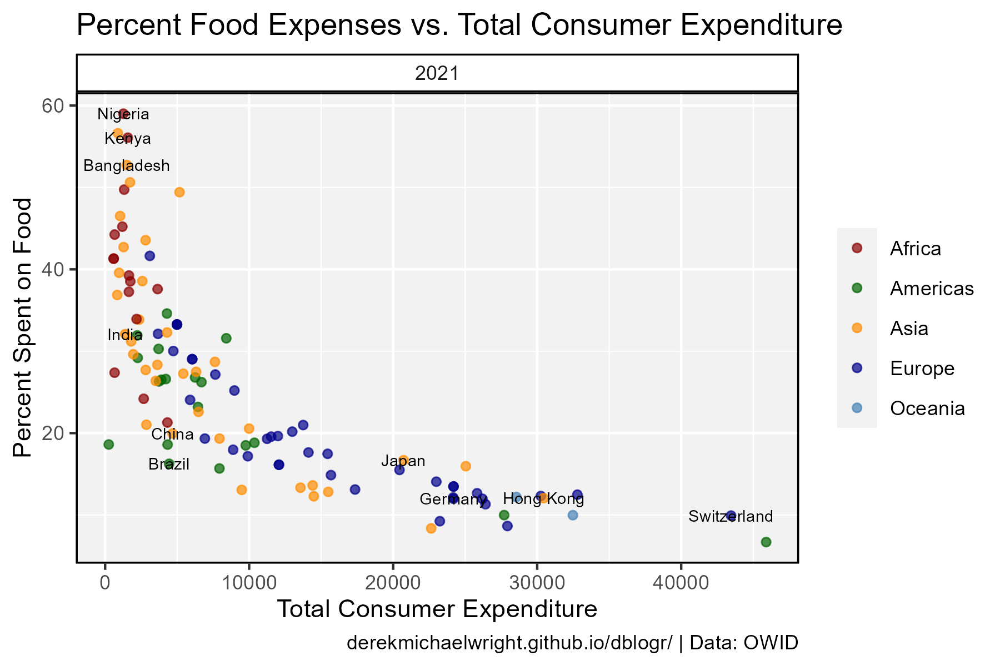
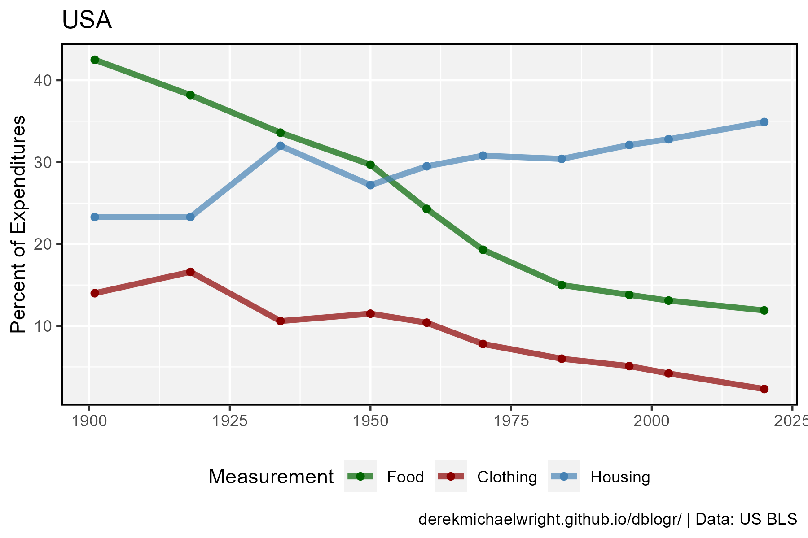
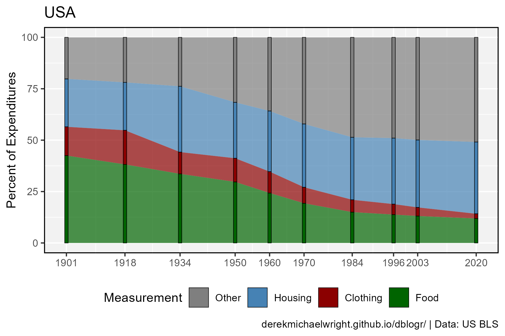
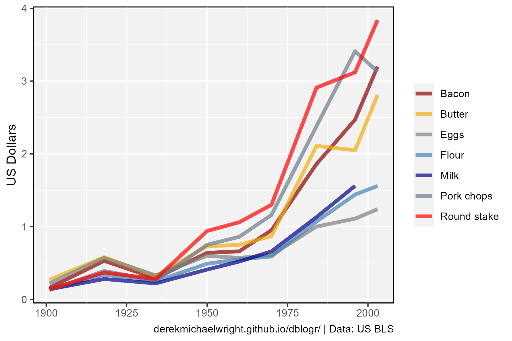
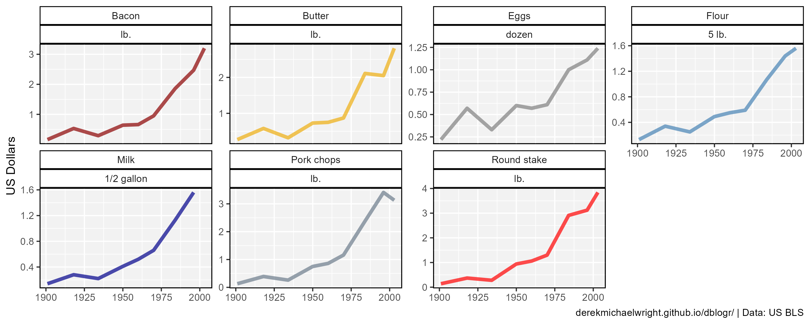

```{r setup, include=FALSE}
knitr::opts_chunk$set(echo = TRUE, message = F, warning = F)
```

---

# Data

> - `r shiny::icon("globe")` https://ourworldindata.org/grapher/food-expenditure-share-gdp
> - `r shiny::icon("save")` [food-expenditure-share-gdp.csv](food-expenditure-share-gdp.csv)

> - `r shiny::icon("globe")` https://t.co/Y6VqkxviLO
> - `r shiny::icon("save")` [data_usa_households.xlsx](data_usa_households.xlsx)

> - `r shiny::icon("globe")` https://beta.bls.gov/dataQuery/search
> - `r shiny::icon("save")` [data_usa_households.xlsx](data_usa_food prices.xlsx)

---

# Prepare Data

```{r class.source = 'fold-show'}
# devtools::install_github("derekmichaelwright/agData")
library(agData)
library(gganimate)
```

```{r}
# Prep data
myCaption1 <- "www.dblogr.com/ or derekmichaelwright.github.io/dblogr/ | Data: OWID"
myCaption2 <- "www.dblogr.com/ or derekmichaelwright.github.io/dblogr/ | Data: US BLS"
#
myCs_Regions <- c("darkred", "darkgreen", "darkorange", "darkblue", "steelblue")
myCs_Food <- c("darkred", "darkgoldenrod2", "grey50", "steelblue", 
                   "darkblue", "slategray4", "red")
myCs_Home <-  c("darkgreen", "darkred", "steelblue", "grey50", "darkblue")
myMs_Home <- c("Food", "Clothing", "Housing", "Other",
               "Expenditures", "Household income")
myAs <- c("United States", "Germany", "Switzerland", "Hong Kong",
          "Japan", "China", "Brazil", 
          "Bangladesh", "India", "Nigeria", "Kenya")
#
d1 <- read.csv("food-expenditure-share-gdp.csv") %>%
  rename(ISO3=Code, TotalExp=Total.consumer.expenditure,
         FoodPercent=Food.as.share.of.total.consumer.expenditure) %>% 
  filter(!is.na(TotalExp)) %>%
  left_join(agData_FAO_Country_Table, by = "ISO3") %>%
  mutate(Label = ifelse(Country %in% myAs, Country, NA))
#
d2 <- read.csv("data_usa_households.csv") %>%
  mutate(Measurement = gsub(" allocation", "", Measurement),
         Measurement = factor(Measurement, levels = myMs_Home))
#
d3 <- read.csv("data_usa_food_prices.csv")
```

---

# Food Share of Expenditures

## Country



```{r}
# Prep data
xx <- d1 %>% filter(Year == 2021) %>% 
  arrange(desc(FoodPercent)) 
x1 <- xx %>% slice(56:110) %>%
  mutate(Country = factor(Country, levels = .$Country))
x2 <- xx %>% slice(1:55) %>%
  mutate(Country = factor(Country, levels = .$Country))
# Plot
mp1 <- ggplot(x1, aes(x = Country, y = FoodPercent)) +
  geom_col(aes(fill = Region), alpha = 0.7) +
  facet_grid(. ~ "Top 55") +
  scale_y_continuous(limits = c(0,60), expand = c(0,0)) +
  coord_flip() +
  scale_fill_manual(values = myCs_Regions) +
  theme_agData(legend.position = "none") +
  labs(y = "Percent Spent on Food", x = NULL, caption = "")
mp2 <- ggplot(x2, aes(x = Country, y = FoodPercent)) +
  geom_col(aes(fill = Region), alpha = 0.7) +
  facet_grid(. ~ "bottom 55") + 
  scale_y_continuous(limits = c(0,60), expand = c(0,0)) +
  coord_flip() +
  scale_fill_manual(values = myCs_Regions) +
  theme_agData(legend.position = "none") +
  labs(y = "Percent Spent on Food", x = NULL, caption = myCaption1)
mp <- ggarrange(mp1, mp2, ncol = 2) 
ggsave("food_expenses_1_01.png", mp, width = 10, height = 8)
```

---

## Food vs Total Expenditures



```{r}
# Prep data
xx <- d1 %>% filter(Year == 2021)
# Plot
mp <- ggplot(xx, aes(x = TotalExp, y = FoodPercent)) +
  geom_point(aes(color = Region), alpha = 0.7) +
  geom_text(aes(label = Label), size = 2.5) +
  facet_grid(. ~ Year) +
  scale_color_manual(name = NULL, values = myCs_Regions) +
  theme_agData() +
  labs(title = "Percent Food Expenses vs. Total Income",
       y = "Percent Spent on Food", x = "Total Consumer Expenditure", 
       caption = myCaption1)
ggsave("food_expenses_1_02.png", mp, width = 6, height = 4)
```

```{r echo = F}
ggsave("featured.png", mp, width = 6, height = 4)
```

---

# Household Expenditures


```{r}
# Prep data
xx <- d2 %>% filter(Measurement %in% c("Expenditures", "Household income"))
# Plot
mp <- ggplot(xx, aes(x = Year, y = Value / 1000, color = Measurement)) +
  geom_line(linewidth = 1.5, alpha = 0.7) +
  scale_color_manual(values = myCs_Home[4:5]) +
  theme_agData(legend.position = "bottom") +
  labs(title = "USA", y = "Thousand US Dollars",
       x = NULL, caption = myCaption2)
ggsave("food_expenses_2_01.png", mp, width = 6, height = 4)
```

---

## Allocations



```{r}
# Prep data
xx <- d2 %>% 
  filter(!Measurement %in% c("Expenditures", "Household income"))
# Plot
mp <- ggplot(xx, aes(x = Year, y = Value, color = Measurement)) +
  geom_line(size = 1.5, alpha = 0.7) +
  geom_point() +
  scale_color_manual(values = myCs_Home) +
  theme_agData(legend.position = "bottom") +
  labs(title = "USA", y = "Percent of Expenditures",
       x = NULL, caption = myCaption2)
ggsave("food_expenses_2_02.png", mp, width = 6, height = 4)
```

---

## Bar Graph



```{r}
# Prep data
xx <- d2 %>% 
  filter(!Measurement %in% c("Expenditures", "Household income")) %>%
  spread(Measurement, Value) %>%
  mutate(Other = 100 - (Clothing + Food + Housing)) %>%
  gather(Measurement, Value, 3:ncol(.)) %>%
  mutate(Measurement = factor(Measurement, levels = rev(myMs_Home)))
# Plot
mp <- ggplot(xx, aes(x = Year, y = Value, fill = Measurement)) +
  geom_area(alpha = 0.7) +
  geom_col(color = "black", size = 0.2, width = 1) +
  scale_fill_manual(values = myCs_Home[4:1]) +
  scale_x_continuous(breaks = unique(xx$Year)) +
  theme_agData(legend.position = "bottom") +
  labs(title = "USA", y = "Percent of Expenditures",
       x = NULL, caption = myCaption2)
ggsave("food_expenses_2_03.png", mp, width = 6, height = 4)
```

---


```{r}
# Prep data
xx <- d2 %>% filter(Measurement == "Food")
# Plot
mp <- ggplot(xx, aes(x = Year, y = Value)) +
  geom_area(fill = "darkgreen", alpha = 0.7) +
  geom_col(color = "black", fill = "darkgreen", size = 0.2, width = 1) +
  theme_agData(legend.position = "bottom") +
  labs(title = "USA", y = "Percent of Expenditures on Food",
       x = NULL, caption = myCaption2)
ggsave("food_expenses_2_04.png", mp, width = 6, height = 4)
```

---

## Animation

```{r}
# Plot
mp <- ggplot(xx, aes(x = "", y = Value, fill = Measurement)) +
  geom_bar(stat = "identity", color = "black") +
  scale_fill_manual(name = NULL, values = myCs_Home[4:1]) +
  coord_polar("y", start = 0) +
  theme_agData(legend.position = "bottom") +
  #blank_theme +
  theme_agData_pie(plot.title = element_text(hjust = 0.5),
                   plot.subtitle = element_text(hjust = 0.5)) +
  labs(title = "{round(frame_time)}", caption = myCaption2,
       subtitle = "Percent of Household Expenditures in USA") +
  transition_time(Year)
anim_save("food_expenses_2_01.gif", mp,
          nframes = 300, fps = 10, end_pause = 30, 
          width = 600, height = 600, res = 150, units = "px")
```

---

# Food Prices



```{r}
# Plot
mp <- ggplot(d3, aes(x = Year, y = Value, color = Item)) +
  geom_line(size = 1.5, alpha = 0.7) + 
  scale_color_manual(name = NULL, values = myCs_Food) +
  theme_agData() +
  labs(tiele = "United States", x = NULL, 
       y = "US Dollars", caption = myCaption2)
ggsave("food_expenses_3_01.png", mp, width = 6, height = 4)
```

---

## Facetted



```{r}
# Plot
mp <- ggplot(d3, aes(x = Year, y = Value, color = Item)) +
  geom_line(size = 1.5, alpha = 0.7) + 
  scale_color_manual(name = NULL, values = myCs_Food) +
  facet_wrap(Item + Unit ~ ., ncol = 4, scales = "free_y") +
  theme_agData(legend.position = "none") +
  labs(tiele = "United States", x = NULL, 
       y = "US Dollars", caption = myCaption2)
ggsave("food_expenses_3_02.png", mp, width = 10, height = 4)
```

---
