```{r setup, include=FALSE}
knitr::opts_chunk$set(echo = T, message = F, warning = F)
```

---

# Data

> - `r shiny::icon("globe")` [https://www.gapminder.org/](https://www.gapminder.org/){target="_blank"}

```{r class.source = "fold-show"}
# devtools::install_github("derekmichaelwright/agData")
library(agData)
library(gapminder)
library(gganimate)
```

```{r}
myCaption <- "www.dblogr.com/ or derekmichaelwright.github.io/dblogr/ | Data: gapminder"
DT::datatable(gapminder %>% arrange(year))
```

---

# Plots {.tabset .tabset-pills}

## By Year


```{r}
mp <- ggplot(gapminder %>% filter(year %in% c(1952, 1982, 2007)), 
       aes(x = gdpPercap / 1000, y = lifeExp, size = pop, colour = country)) +
  geom_point(alpha = 0.7) +
  scale_colour_manual(values = country_colors) +
  scale_size(range = c(2, 12)) +
  scale_x_log10() +
  facet_wrap(. ~ year, ncol = 5) +
  theme_agData(legend.position = "none") +
  labs(x = "GDP Per Capita ($1000)", y = "Life Expectancy", caption = myCaption)
ggsave("gapminder_01.png", mp, width = 6, height = 4)
```

```{r echo = F}
ggsave("featured.png", mp, width = 6, height = 4)
```

---

## Life Expectancy By Region

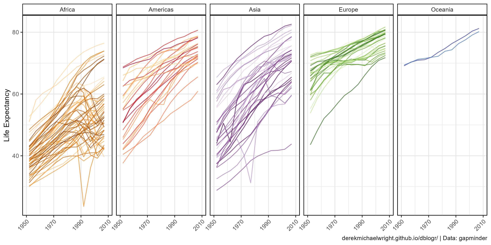

```{r}
mp <- ggplot(gapminder, aes(x = year, y = lifeExp, colour = country)) +
  geom_line(alpha = 0.7) +
  scale_colour_manual(values = country_colors) +
  scale_x_continuous(breaks = seq(1950, 2010, 20)) +
  coord_cartesian(xlim = c(1950, 2010)) +
  facet_wrap(. ~ continent, ncol = 5) +
  theme_agData(legend.position = "none", 
               axis.text.x = element_text(angle = 45, hjust = 1)) +
  labs(x = NULL, y = "Life Expectancy", caption = myCaption)
ggsave("gapminder_02.png", mp, width = 10, height = 5)
```

---

## GDP Per Capita By Region

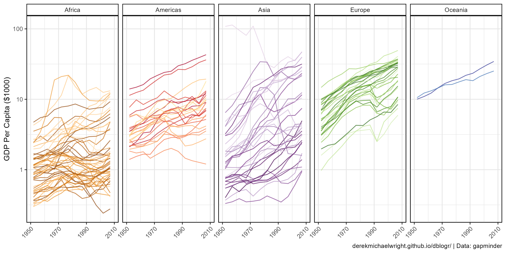

```{r}
mp <- ggplot(gapminder, aes(x = year, y = gdpPercap / 1000, colour = country)) +
  geom_line(alpha = 0.7) +
  scale_colour_manual(values = country_colors) +
  scale_x_continuous(breaks = seq(1950, 2010, 20)) +
  scale_y_log10() +
  coord_cartesian(xlim = c(1950, 2010)) +
  facet_wrap(. ~ continent, ncol = 5) +
  theme_agData(legend.position = "none", 
               axis.text.x = element_text(angle = 45, hjust = 1)) +
  labs(x = NULL, y = "GDP Per Capita ($1000)", caption = myCaption)
ggsave("gapminder_03.png", mp, width = 10, height = 5)
```

---

# Animations {.tabset .tabset-pills}

## GDP Per Capita x Life Expectancy


```{r}
# gganimate example
mp <- ggplot(gapminder, aes(x = gdpPercap / 1000, y = lifeExp, 
                            size = pop, fill = country)) +
  geom_point(alpha = 0.7, show.legend = F, pch = 21, color = "black") +
  scale_fill_manual(values = country_colors) +
  scale_size(range = c(2, 12)) +
  scale_x_log10() +
  facet_wrap(. ~ continent, ncol = 5) +
  theme_agData() +
  labs(title = 'Year: {frame_time}', caption = myCaption,
       y = 'Life Expectancy', x = 'GDP Per Capita ($1000)') +
  transition_time(year)
anim_save("gapminder_gif_01.gif", mp, 
          nframes = 300, fps = 20, end_pause = 60, 
          width = 600, height = 400, res = 80, units = "px")
```

---

## GDP Per Capita By Region

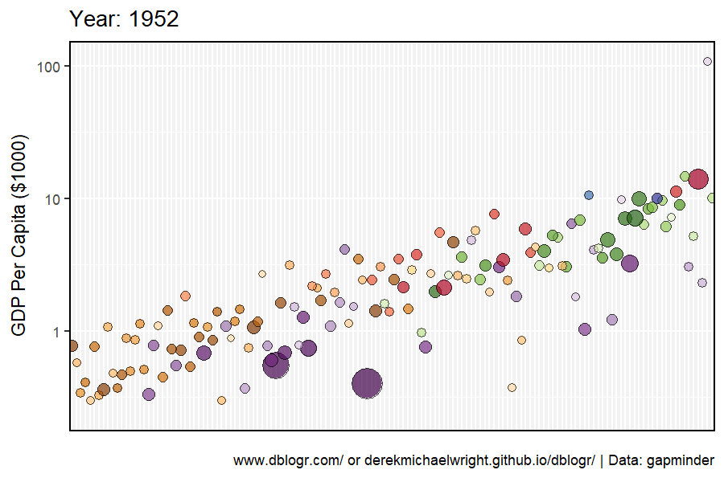

```{r}
# Prep data
xx <- gapminder %>% arrange(rev(year), gdpPercap) %>% 
  mutate(country = factor(country, levels = unique(country)))
# Plot
mp <- ggplot(xx, aes(x = country, y = gdpPercap / 1000, 
                     size = pop, fill = country)) +
  geom_point(alpha = 0.7, show.legend = F, pch = 21, color = "black") +
  scale_fill_manual(values = country_colors) +
  scale_size(range = c(2, 12)) +
  scale_y_log10() +
  theme_agData(axis.text.x = element_blank(),
               axis.ticks.x = element_blank()) +
  labs(title = 'Year: {frame_time}', caption = myCaption,
       x = NULL, y = 'GDP Per Capita ($1000)') +
  transition_time(year)
anim_save("gapminder_gif_02.gif", mp, 
          nframes = 300, fps = 20, end_pause = 60, 
          width = 600, height = 400, res = 80, units = "px")
```

---

## Life Expectancy By Region

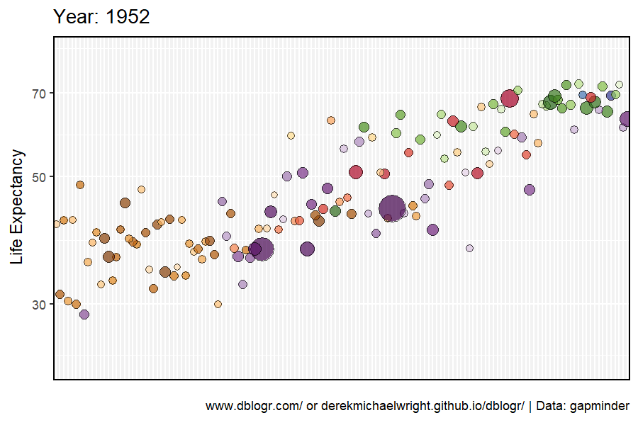

```{r}
# Prep data
xx <- gapminder %>% arrange(rev(year), lifeExp) %>% 
  mutate(country = factor(country, levels = unique(country)))
# Plot
mp <- ggplot(xx, aes(x = country, y = lifeExp, 
                     size = pop, fill = country)) +
  geom_point(alpha = 0.7, show.legend = F, pch = 21, color ="black") +
  scale_fill_manual(values = country_colors) +
  scale_size(range = c(2, 12)) +
  scale_y_log10() +
  theme_agData(axis.text.x = element_blank(),
               axis.ticks.x = element_blank()) +
  labs(title = 'Year: {frame_time}', caption = myCaption,
       x = NULL, y = 'Life Expectancy') +
  transition_time(year)
anim_save("gapminder_gif_03.gif", mp, 
          nframes = 300, fps = 20, end_pause = 60, 
          width = 600, height = 400, res = 80, units = "px")
```

---

```{r}
gg_gapminder1 <- function(x, myTitle = NULL) {
  ggplot(x, aes(x = gdpPercap / 1000, y = lifeExp, 
                size = pop, fill = country)) +
    geom_point(alpha = 0.7, pch = 21, color = "black") +
    geom_text(aes(label = countryLabel), alpha = 0.7, alpha = 0.3) +
    scale_fill_manual(values = country_colors) +
    scale_size(range = c(2, 12)) +
    scale_x_log10() +
    theme_agData(legend.position = "none") +
    labs(title = myTitle, subtitle = "Year: {frame_time}", caption = myCaption,
         y = "Life Expectancy", x = "GDP Per Capita ($1000)") +
    transition_time(year)
}
```

---

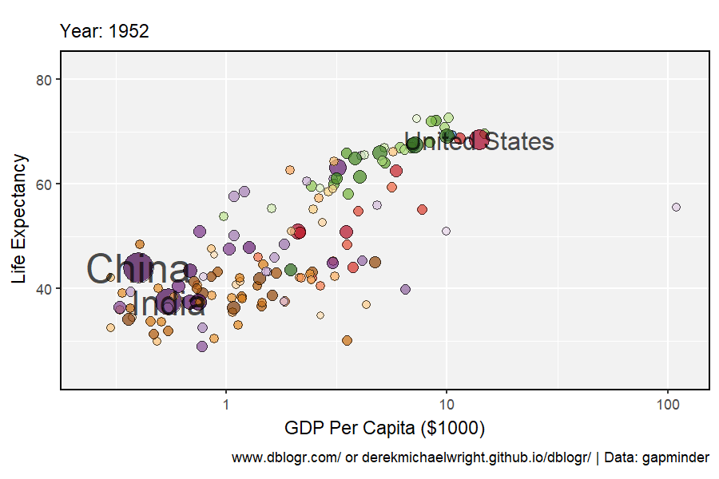

```{r}
# Prep data
areas <- c("China", "United States", "India")
xx <- gapminder %>% 
  mutate(countryLabel = ifelse(country %in% areas, as.character(country), NA))
# Plot
mp <- gg_gapminder1(xx)
anim_save("gapminder_gif_04.gif", mp, 
          nframes = 300, fps = 20, end_pause = 60, 
          width = 600, height = 400, res = 80, units = "px")
```

---

# Regions {.tabset .tabset-pills}

## Africa

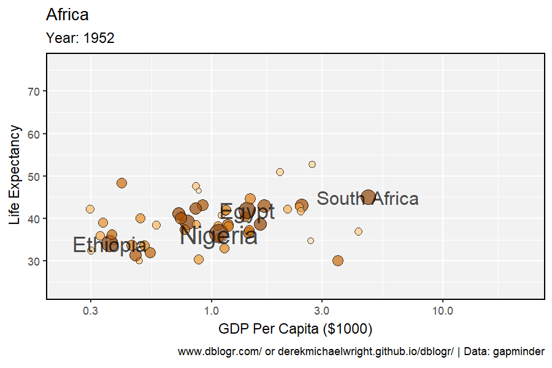

```{r}
# Prep data
areas <- c("South Africa", "Egypt", "Nigeria", "Ethiopia")
xx <- gapminder %>% 
  filter(continent == "Africa") %>%
  mutate(countryLabel = ifelse(country %in% areas, as.character(country), NA))
# Plot
mp <- gg_gapminder1(xx, "Africa")
anim_save("gapminder_gif_05.gif", mp, 
          nframes = 300, fps = 20, end_pause = 60, 
          width = 600, height = 400, res = 80, units = "px")
```

---

## Americas

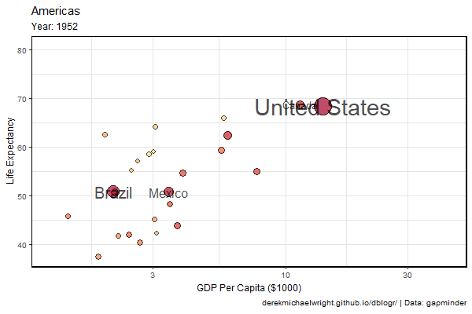

```{r}
# Prep data
areas <- c("United States", "Canada", "Brazil", "Mexico")
xx <- gapminder %>% 
  filter(continent == "Americas") %>%
  mutate(countryLabel = ifelse(country %in% areas, as.character(country), NA))
# Plot
mp <- gg_gapminder1(xx, "Americas")
anim_save("gapminder_gif_06.gif", mp, 
          nframes = 300, fps = 20, end_pause = 60, 
          width = 600, height = 400, res = 80, units = "px")
```

---

## Asia


```{r}
# Prep data
areas <- c("China", "India", "Japan", "Bangladesh")
xx <- gapminder %>% 
  filter(continent == "Asia") %>%
  mutate(countryLabel = ifelse(country %in% areas, as.character(country), NA))
# Plot
mp <- gg_gapminder1(xx, "Asia")
anim_save("gapminder_gif_07.gif", mp, 
          nframes = 300, fps = 20, end_pause = 60, 
          width = 600, height = 400, res = 80, units = "px")
```

---

## Europe

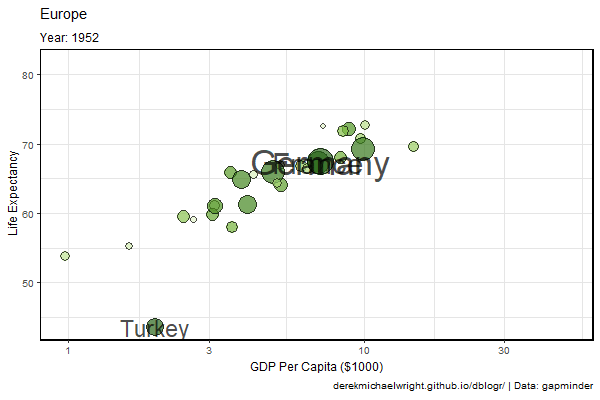

```{r}
# Prep data
areas <- c("Germany", "France", "Russia", "Turkey")
xx <- gapminder %>% 
  filter(continent == "Europe") %>%
  mutate(countryLabel = ifelse(country %in% areas, as.character(country), NA))
# Plot
mp <- gg_gapminder1(xx, "Europe")
anim_save("gapminder_gif_08.gif", mp, 
          nframes = 300, fps = 20, end_pause = 60, 
          width = 600, height = 400, res = 80, units = "px")
```

---

# Countries {.tabset .tabset-pills}

```{r}
gg_gapminder2 <- function(mycountries) {
  x <- gapminder %>% filter(country %in% mycountries)
  ggplot(x, aes(x = gdpPercap / 1000, y = lifeExp, fill = country)) +
    geom_point(size = 3, pch = 21, color = "black") +
    geom_line(alpha = 0.7) +
    scale_colour_manual(values = country_colors) +
    scale_x_log10() +
    theme_agData(legend.position = "bottom") +
    labs(title = "Year: {frame_along}", caption = myCaption,
         y = "Life Expectancy", x = "GDP Per Capita ($1000)") +
    transition_reveal(year)
}
```

---

## Canada

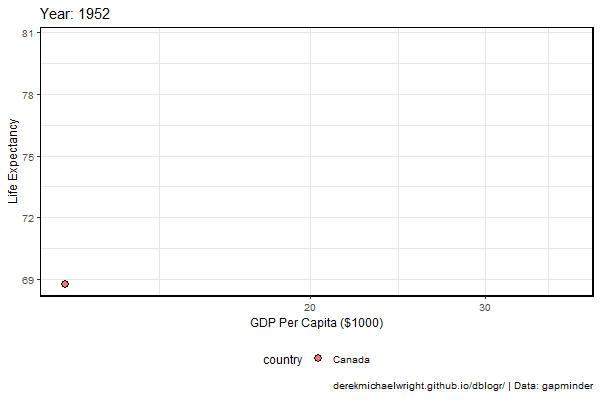

```{r}
mp <- gg_gapminder2("Canada")
anim_save("gapminder_gif_09.gif", mp, 
          nframes = 300, fps = 20, end_pause = 60, 
          width = 600, height = 400, res = 80, units = "px")
```

---

## China

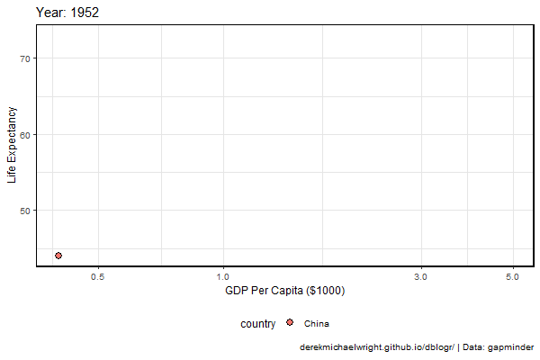

```{r}
mp <- gg_gapminder2("China")
anim_save("gapminder_gif_10.gif", mp, 
          nframes = 300, fps = 20, end_pause = 60, 
          width = 600, height = 400, res = 80, units = "px")
```

---

## Rwanda, South Africa, Nigeria

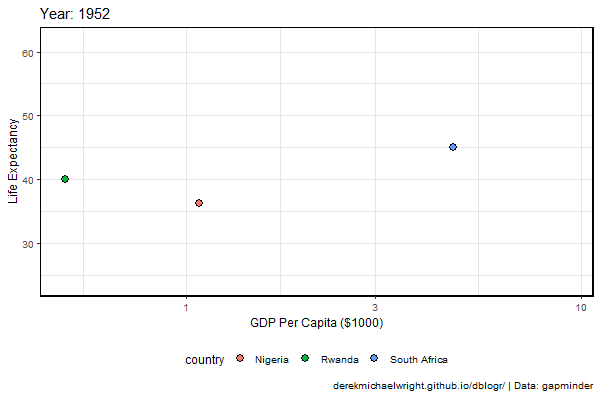

```{r}
mp <- gg_gapminder2(c("Rwanda", "South Africa", "Nigeria"))
anim_save("gapminder_gif_11.gif", mp, 
          nframes = 300, fps = 20, end_pause = 60, 
          width = 600, height = 400, res = 80, units = "px")
```

---

# Heatmaps


```{r}
# Prep data
myColors <- c("darkred", "darkgoldenrod2", "steelblue")
xx <- gapminder %>% filter(continent == "Africa") 
myYears <- unique(xx$year)
myAreas <- xx %>% filter(year == 2007) %>% 
  arrange(lifeExp) %>% pull(country) %>% unique()
xx <- xx %>% mutate(country = factor(country, level = myAreas))
# Plot
mp <- ggplot(xx, aes(x = year, y = country, fill = lifeExp)) +
  geom_tile(color = "white", size = 0.35) +
  scale_x_continuous(expand = c(0,0), breaks = myYears) +
  scale_fill_gradientn(name = "Life Expectancy", na.value = 'white',
                       colors = myColors) +
  theme_agData(legend.position = "bottom", 
               bgFill = "white") +
  labs(x = NULL, y = NULL, caption = myCaption)
ggsave("gapminder_04.png", mp, width = 6, height = 10)
```

---
