```{r setup, include=FALSE}
knitr::opts_chunk$set(echo = T, message = F, warning = F)
```

---

# Introduction

Using statistics to mislead can be a trivial thing. This vignette will go through some examples of how to one can mislead people with improper graphs.

1. [Truncating The y-axis](#truncating-the-y-axis)
2. [Dual y-axes](#dual-y-axis)
3. [Spurious Correlations](#spurious-correlations)
4. [Cherry Picking Data](#cherry-picking-data)
5. [Color Scales](#color-scales)

```{r class.source = 'fold-show'}
# devtools::install_github("derekmichaelwright/agData")
library(agData)
library(readxl) # read_xlsx()
library(ggpmisc) # stat_poly_eq()
library(usmap) # plot_usmap
library(housingData) # geoCounty()
```

---

# 1. Truncating The y-axis

Truncating the y-axis is the most commonly used example for misleading graphs. It is a simple way to create the appearance of a larger difference between groups than what reality would suggest.

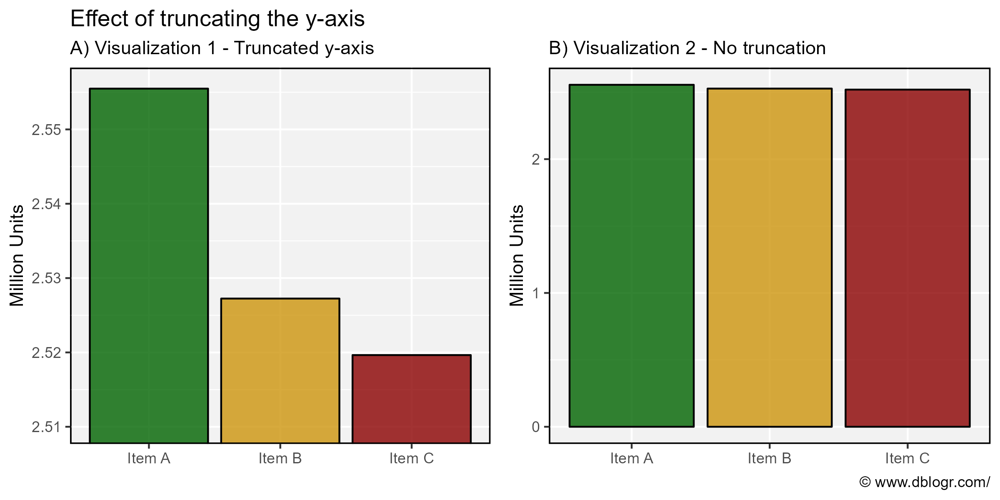

```{r}
# Prep data
xx <- data.frame(Company = c("Item A", "Item B", "Item C"),
                 Views   = c( 2555486,     2527246,     2519643))
# Plot
mp1 <- ggplot(xx, aes(x = Company, y = Views / 1000000, fill = Company)) + 
  geom_col(color = "black", alpha = 0.8) +
  scale_fill_manual(values = agData_Colors) +
  theme_agData(legend.position = "none") +
  labs(subtitle = "B) Visualization 2 - No truncation", y = "Million Units", x = NULL,
       caption = "\u00A9 www.dblogr.com/")
mp2 <- mp1 + 
  coord_cartesian(ylim = c(2510000, 2556000) / 1000000) +
  labs(title = "Effect of truncating the y-axis",
       subtitle = "A) Visualization 1 - Truncated y-axis", caption = NULL)
mp <- ggarrange(mp2, mp1, ncol = 2, align = "h")
ggsave("misleading_graphs_01.png", mp, width = 8, height = 4)
```

```{r echo = F} 
ggsave("featured.png", mp, width = 8, height = 4)
```

---

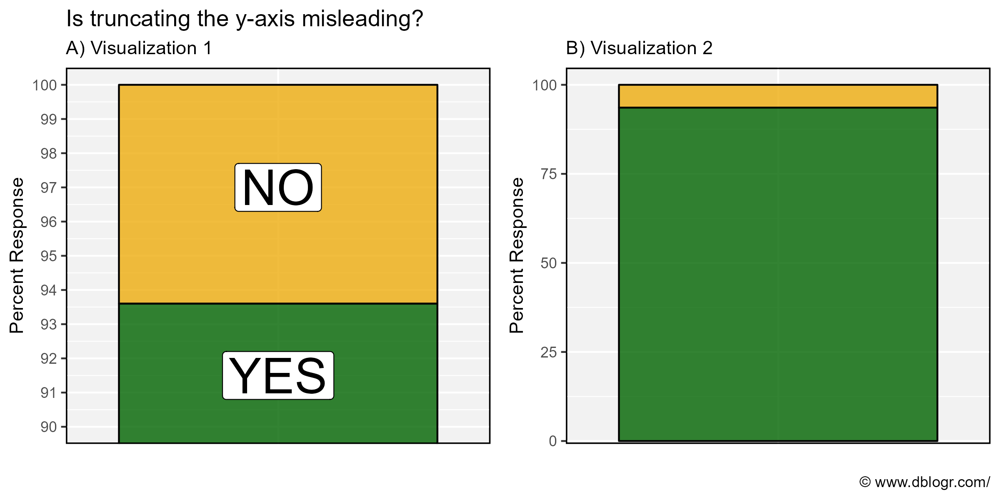

```{r}
# Prep data
xx <- data.frame(Answer   = c("NO", "YES"),
                 Percent  = c(6.4,  93.6),
                 Position = c(97,   91.5))
# Plot
mp1 <- ggplot(xx, aes(x = "", y = Percent, fill = Answer)) + 
  geom_col(color = "black", alpha = 0.8) +
  scale_fill_manual(values = c("darkgoldenrod2", "darkgreen")) +
  coord_cartesian(ylim = c(4, 100)) +
  theme_agData(legend.position = "none",
               axis.ticks.x = element_blank()) +
  labs(subtitle = "B) Visualization 2", y = "Percent Response", x = NULL,
       caption = "\u00A9 www.dblogr.com/")
mp2 <- mp1 + 
  geom_label(aes(y = Position, label = Answer), fill = "white", size = 10) + 
  scale_y_continuous(breaks = 90:100) +
  coord_cartesian(ylim = c(90, 100)) +
  labs(title = "Is truncating the y-axis misleading?", 
       subtitle = "A) Visualization 1", caption = NULL)
mp <- ggarrange(mp2, mp1, ncol = 2, align = "h")
ggsave("misleading_graphs_02.png", mp, width = 8, height = 4)
```

---

# 2. Dual y-axis

In some cases, a graph with two y-axes is desired for visualizing two different sets of data. However, this is sometimes frowned upon since the required scaling of the data can be adjusted to fit the desired narrative. *E.g.*,


The COVID Pandemic has produced many examples of dual-y-axis graphs. Below are two examples of dual-y-axis graphs created by the CBC and the Canadian government using deaths as the secondary y-axis which allows them to be scaled to portray the desire visual effect.

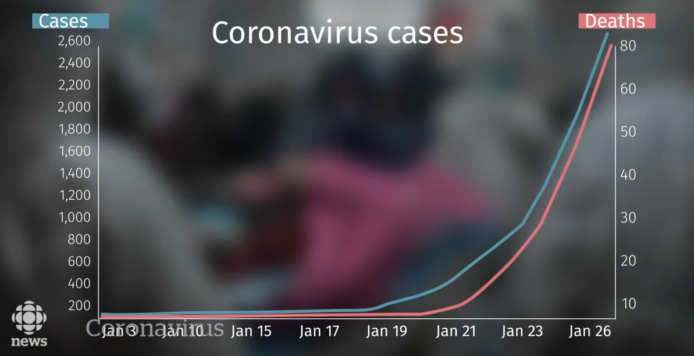

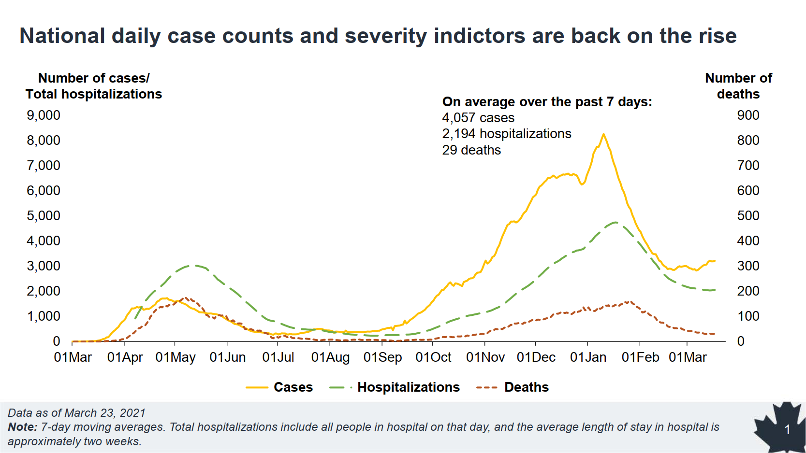

In the above example from the Canadian government, the scaling of the secondary y-axis for deaths allows for the manipulation of the red dashed line. *E.g.*, imagine the graph if scaled from *0-200* instead of *0-900* OR *0-9000* like the primary y-axis. We can reproduce this graph with these different scales to illustrate this. 

Canada's Covid data: https://health-infobase.canada.ca/covid-19/dashboard/about.html

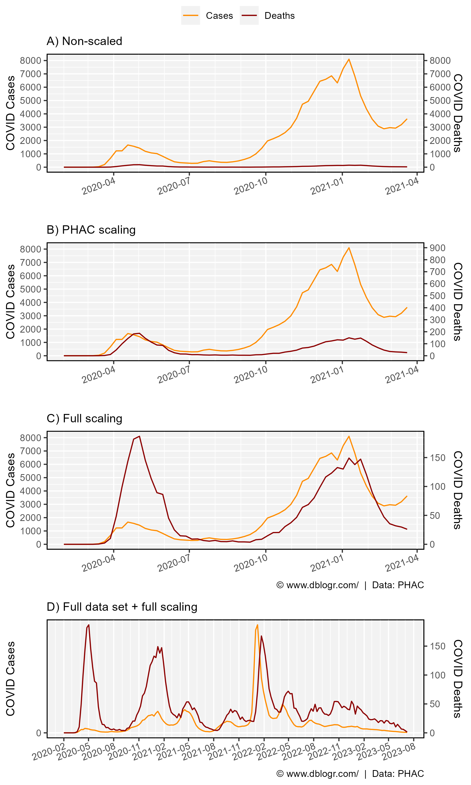

```{r}
# Prep data
xx <- read.csv("https://health-infobase.canada.ca/src/data/covidLive/covid19-download.csv") %>%
  rename(area=prname) %>%
  filter(area == "Canada", date < "2021-03-25") %>%
  mutate(date = as.POSIXct(date, format = "%Y-%m-%d"),
         numcases_daily = numtotal_last7 / 7,
         numdeaths_daily = numdeaths_last7 / 7)
y1_max <- max(xx$numcases_daily, na.rm = T)
y2_max <- max(xx$numdeaths_daily, na.rm = T)
xx <- xx %>%
  mutate(deaths_scaled1 = numdeaths_daily * y1_max / 900,
         deaths_scaled2 = numdeaths_daily * y1_max / y2_max)
# Plot
mp <- ggplot(xx, aes(x = date)) +
  geom_line(aes(y = numcases_daily, color = "1")) +
  scale_color_manual(name = NULL, labels = c("Cases","Deaths"),
                     values = c("darkorange","darkred")) +
  scale_x_datetime(date_breaks = "3 month", date_minor_breaks = "1 month", 
                   date_labels = "%Y-%m") +
  theme_agData(axis.text.x = element_text(angle = 20, hjust = 1, vjust = 1.1)) +
  labs(y = "COVID Cases", x = NULL)
# 0 - 9000
mp1 <- mp +
  labs(subtitle = "A) Non-scaled") +
  geom_line(aes(y = numdeaths_daily, color = "2")) +
  scale_y_continuous(breaks = seq(0, 9000, 1000), 
    sec.axis = sec_axis(~ ., breaks = seq(0, 9000, 1000), 
                        name = "COVID Deaths"))
# 0 - 900
mp2 <- mp +
  labs(subtitle = "B) PHAC scaling") +
  geom_line(aes(y = deaths_scaled1, color = "2")) +
  scale_y_continuous(breaks = seq(0, 9000, 1000),
    sec.axis = sec_axis(~ . * 900 / y1_max, name = "COVID Deaths",
                        breaks = seq(0, 900, 100)))
# 0 - 200
mp3 <- mp +
  labs(subtitle = "C) Full scaling", 
       caption = "\u00A9 www.dblogr.com/  |  Data: PHAC") +
  geom_line(aes(y = deaths_scaled2, color = "2")) +
  scale_y_continuous(breaks = seq(0, 9000, 1000),
    sec.axis = sec_axis(~ . * y2_max / y1_max, name = "COVID Deaths"))
# full data set
yy <- read.csv("https://health-infobase.canada.ca/src/data/covidLive/covid19-download.csv") %>%
  rename(area=prname) %>%
  filter(area == "Canada") %>%
  mutate(date = as.POSIXct(date, format = "%Y-%m-%d"),
         numcases_daily = numtotal_last7 / 7,
         numdeaths_daily = numdeaths_last7 / 7)
y3_max <- max(yy$numcases_daily, na.rm = T)
y4_max <- max(yy$numdeaths_daily, na.rm = T)
yy <- yy %>%
  mutate(deaths_scaled3 = numdeaths_daily * y3_max / y4_max)
mp4 <- ggplot(yy, aes(x = date)) +
  geom_line(aes(y = numcases_daily, color = "1")) +
  geom_line(aes(y = deaths_scaled3, color = "2")) +
  scale_y_continuous(breaks = seq(0, max(xx$numcases_daily, na.rm = T), 10000),
    sec.axis = sec_axis(~ . * y4_max / y3_max, name = "COVID Deaths")) +
  scale_color_manual(name = NULL, labels = c("Cases","Deaths"),
                     values = c("darkorange","darkred")) +
  scale_x_datetime(date_breaks = "3 month", date_minor_breaks = "1 month", 
                   date_labels = "%Y-%m") +
  theme_agData(axis.text.x = element_text(angle = 20, hjust = 1, vjust = 1.1)) +
  labs(subtitle = "D) Full data set + full scaling", y = "COVID Cases", x = NULL,
       caption = "\u00A9 www.dblogr.com/  |  Data: PHAC")
# Append
mp <- ggarrange(mp1, mp2, mp3, mp4, ncol = 1, align = "hv",
                common.legend = T, legend = "top")
ggsave("misleading_graphs_03.png", mp, width = 6, height = 10)
```

In this example, the two data sets are at least related to each other. However, if they aren’t, dual y-axes can also lead to spurious correlations.

---

# 3. Spurious Correlations

Spurious correlation occur when two variables appear to have a cause-and-effect relationship, when in reality, there may not be. A popular example is Nicolas Cage films and the number of deaths by drowning.

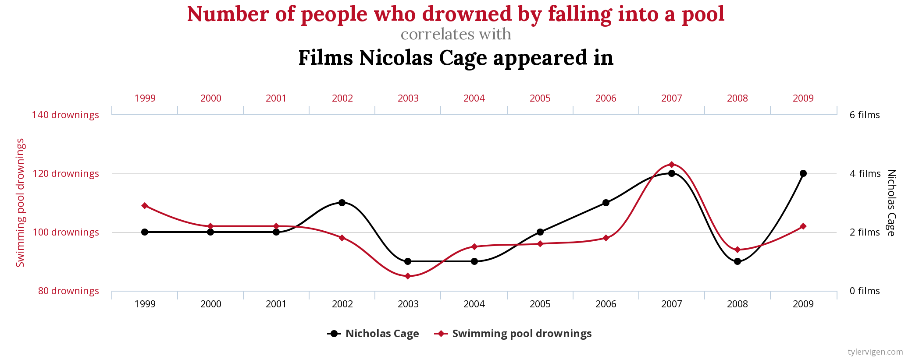

Now lets make our own by correlating autism rates in Quebec with soybean production in Quebec and the rise of organic agriculture in Canada. Although an *R^2* of 0.906 and 0.956 is an extremely high correlation coefficient, these data sets are obviously completely unrelated to each other.

Data for Canadian autism rates can be found at https://www.canada.ca/en/public-health/services/publications/diseases-conditions/autism-spectrum-disorder-children-youth-canada-2018.html.

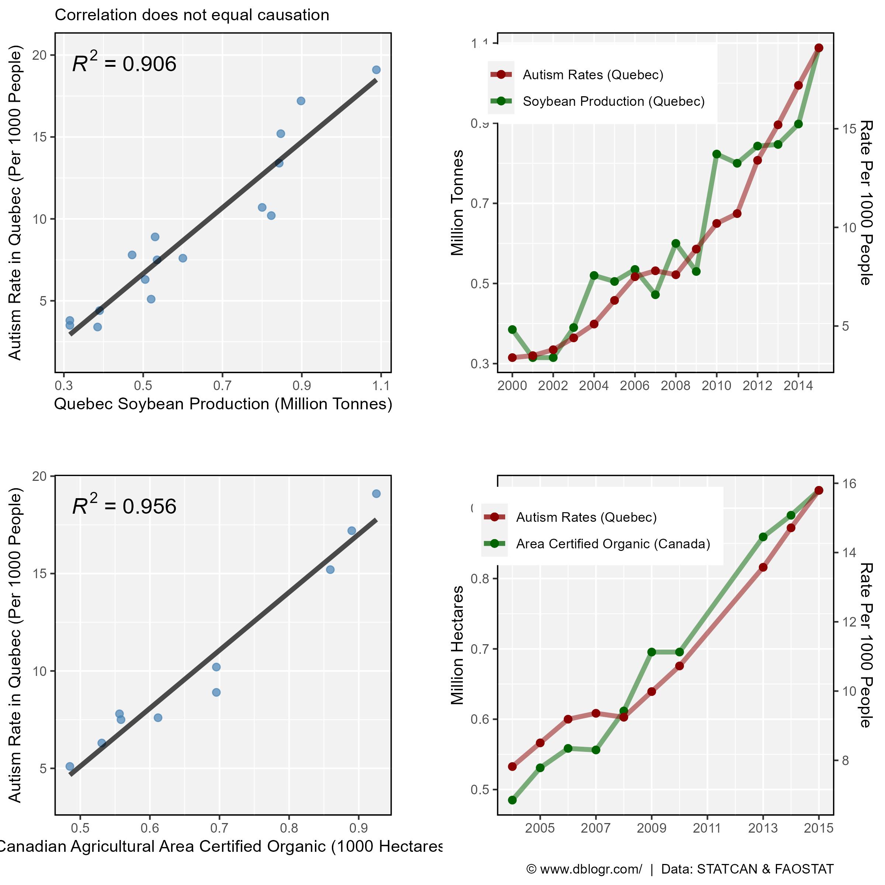

```{r}
# Prep data
x1 <- read.csv("data_quebec_autism_rates.csv")
x2 <- agData_STATCAN_Crops %>% 
  filter(Item == "Soybeans", 
         Measurement == "Production",
         Area == "Quebec") %>%
  select(Year, Soybean_Production=Value) %>%
  mutate(Soybean_Production = Soybean_Production / 1000000)
x3 <- agData_FAO_LandUse %>% 
  filter(Item == "Agriculture area certified organic", 
         Area == "Canada") %>%
  select(Year, Organic_Area=Value) %>%
  mutate(Organic_Area = Organic_Area / 1000000)
xx <- left_join(x1, x2, by = "Year") %>% 
  left_join(x3, by = "Year")
#
y1_min <- min(xx$Soybean_Production)
y1_max <- max(xx$Soybean_Production)
y2_min <- min(xx$Autism_Rate)
y2_max <- max(xx$Autism_Rate)
xx <- xx %>%
  mutate(AR_scaled1 = (Autism_Rate - y2_min) * (y1_max - y1_min) / 
                           (y2_max - y2_min) +  y1_min)
#
z1_min <- min(xx$Organic_Area, na.rm = T)
z1_max <- max(xx$Organic_Area, na.rm = T)
z2_min <- min(xx$Autism_Rate)
z2_max <- max(xx$Autism_Rate)
xx <- xx %>%
  mutate(AR_scaled2 = (Autism_Rate - z2_min) * (z1_max - z1_min) / 
                           (z2_max - z2_min) +  z1_min)
# Plot
mp1 <- ggplot(xx, aes(x = Soybean_Production, y = Autism_Rate)) + 
  geom_point(size = 2, alpha = 0.7, color = "steelblue") + 
  stat_smooth(geom = "line", method = "lm", size = 1.5, alpha = 0.7) +
  stat_poly_eq(formula = y ~ x, aes(label = ..rr.label..), 
               rr.digits = 3, size = 5, parse = T) +
  theme_agData() +
  labs(subtitle = "Correlation does not equal causation",
       x = "Quebec Soybean Production (Million Tonnes)", 
       y = "Autism Rate in Quebec (Per 1000 People)")
mp2 <- ggplot(xx, aes(x = Year)) +
  geom_line(aes(y = Soybean_Production, color = "Soybean Production (Quebec)"), 
            size = 1.5, alpha = 0.5) + 
  geom_point(aes(y = Soybean_Production, color = "Soybean Production (Quebec)"), 
             size = 2) +
  geom_line(aes(y = AR_scaled1, color = "Autism Rates (Quebec)"), 
            size = 1.5, alpha = 0.5) + 
  geom_point(aes(y = AR_scaled1, color = "Autism Rates (Quebec)"), size = 2) +
  scale_color_manual(name = NULL, values = c("darkred", "darkgreen"),
                     breaks = c("Autism Rates (Quebec)", 
                                "Soybean Production (Quebec)")) +
  scale_x_continuous(breaks = seq(2000,2015,2), minor_breaks = 2000:2015) +
  scale_y_continuous(name = "Million Tonnes",  
    sec.axis = sec_axis(~ (. - y1_min) * (y2_max - y2_min) / 
                     (y1_max - y1_min) +  y2_min,
                        name = "Rate Per 1000 People")) +
  theme_agData(legend.position = c(0.30,0.85)) +
  labs(x = NULL)
mp3 <- ggplot(xx, aes(x = Organic_Area, y = Autism_Rate)) + 
  geom_point(size = 2, alpha = 0.7, color = "steelblue") + 
  stat_smooth(geom = "line", method = "lm", size = 1.5, alpha = 0.7) +
  stat_poly_eq(formula = y ~ x, aes(label = ..rr.label..), 
               rr.digits = 3, size = 5, parse = T) +
  theme_agData() +
  labs(x = "Canadian Agricultural Area Certified Organic (1000 Hectares)", 
       y = "Autism Rate in Quebec (Per 1000 People)")
mp4 <- ggplot(xx %>% filter(!is.na(Organic_Area)), aes(x = Year)) +
  geom_line(aes(y = Organic_Area, color = "Area Certified Organic (Canada)"), 
            size = 1.5, alpha = 0.5) + 
  geom_point(aes(y = Organic_Area, color = "Area Certified Organic (Canada)"), 
             size = 2) +
  geom_line(aes(y = AR_scaled2, color = "Autism Rates (Quebec)"), 
            size = 1.5, alpha = 0.5) + 
  geom_point(aes(y = AR_scaled2, color = "Autism Rates (Quebec)"), size = 2) +
  scale_color_manual(name = NULL, values = c("darkred","darkgreen"),
                     breaks = c("Autism Rates (Quebec)", 
                                "Area Certified Organic (Canada)")) +
  scale_x_continuous(breaks = seq(2005,2015,2), minor_breaks = 2004:2015) +
  scale_y_continuous(name = "Million Hectares",  
    sec.axis = sec_axis(~ (. - y1_min) * (y2_max - y2_min) / 
                     (y1_max - y1_min) +  y2_min,
                        name = "Rate Per 1000 People")) +
  theme_agData(legend.position = c(0.30,0.85)) +
  labs(x = NULL, caption = "\u00A9 www.dblogr.com/  |  Data: STATCAN & FAOSTAT")
mp <- ggarrange(mp1, mp2, mp3, mp4, ncol = 2, nrow = 2, align = "hv")
ggsave("misleading_graphs_04.png", mp, width = 8, height = 8)
```

---

# 4. Cherry Picking Data

By ignoring data that doesn't support the desired narrative, and only focusing on the data that does, one can mislead by simply cherry picking the data to present. We will go through a few examples of this:

## Ignoring Data

In 1994 the first GM maize variety was released in the USA. If we only focus on yield data from 1995-2010, it looks as if the introduction of GE crop varieties greatly increased maize yields. However, when we take a step back and look at all the data, we can see that not only have we avoided the poor yields of 2012, but there also has been a trend of yearly increasing yields from long before the introduction of GE varieties. From this perspective, it would be more appropriate to attribute these yield gains to many factors including the more traditional/conventional breeding along with changes in production practices since the 1930's.

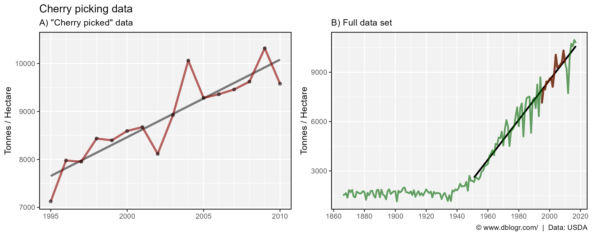

```{r}
# Prep data
xx <- agData_USDA_Grains %>%
  filter(Measurement == "Yield", Item == "Maize") 
y1 <- xx %>% filter(Year > 1994, Year < 2011)
y2 <- xx %>% filter(Year > 1950)
# Plot
mp <- ggplot(y1, aes(x = Year, y = Value)) +
  theme_agData() +
  labs(y = "Tonnes / Hectare", x = NULL)
mp1 <- mp +
  stat_smooth(geom = "line", method = "lm", 
              size = 1.25, color = "black", alpha = 0.5) +
  geom_line(size = 1.25, color = "darkred", alpha = 0.6) + 
  geom_point(size = 1.5, alpha = 0.5) +
  scale_x_continuous(breaks = seq(1995,2010,5), 
                     minor_breaks = 1995:2020) +
  labs(title = "Cherry picking data", 
       subtitle = "A) \"Cherry picked\" data")
mp2 <- mp +
  stat_smooth(data = y2, geom = "line", method = "lm",  
              size = 1, color = "black") +
  geom_line(data = xx, size = 1, color = "darkgreen", alpha = 0.6) +
  geom_line(size = 1.25, color = "darkred", alpha = 0.6) + 
  scale_x_continuous(breaks = seq(1860, 2020, by = 20)) +
  labs(subtitle = "B) Full data set", 
       caption = "\u00A9 www.dblogr.com/  |  Data: USDA")
mp <- ggarrange(mp1, mp2, ncol = 2, align = "h")
ggsave("misleading_graphs_05.png", mp, width = 10, height = 4)
```

---

## Deleting Data

The National Interagency Fire Center (NIFC) recently deleted some data from their database, which can be retrieved using internet archives. Let's take a look at the data they deleted.

https://www.nifc.gov/fire-information/statistics/wildfires

https://web.archive.org/web/20210129125036/https://www.nifc.gov/fireInfo/fireInfo_stats_totalFires.html

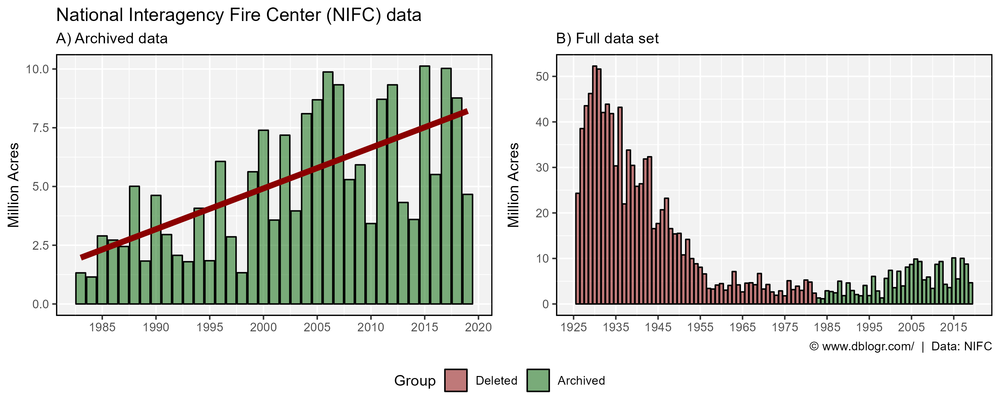

```{r}
# Prep data
dd <- read.csv("data_fires_usa.csv") %>%
  mutate(Group = ifelse(Year < 1983, "Deleted", "Archived"),
         Group = factor(Group, levels = c("Deleted", "Archived")))
# Plot
mp1 <- ggplot(dd %>% filter(Year >= 1983), 
              aes(x = Year, y = Acres / 1000000)) +
  geom_col(color = "black", fill = "darkgreen", alpha = 0.5) +
  stat_smooth(geom = "line", method = "lm", size = 2, color = "darkred") +
  scale_x_continuous(breaks = seq(1985, 2020, 5)) +
  theme_agData() +
  labs(title = "National Interagency Fire Center (NIFC) data", 
       subtitle = "A) Archived data", 
       y = "Million Acres", x = NULL)
mp2 <- ggplot(dd, aes(x = Year, y = Acres / 1000000, fill = Group)) + 
  geom_col(alpha = 0.5, color = "black") +
  scale_fill_manual(values = c("darkred", "darkgreen")) +
  scale_x_continuous(breaks = seq(1925, 2015, 10)) +
  theme_agData() +
  labs(subtitle = "B) Full data set",
       y = "Million Acres", x = NULL,
       caption = "\u00A9 www.dblogr.com/  |  Data: NIFC")
mp <- ggarrange(mp1, mp2, ncol = 2, align = "hv",
                common.legend = T, legend = "bottom")
ggsave("misleading_graphs_06.png", mp, width = 10, height = 4, bg = "white")
```

---

## Political Example

The following is a comical example put out by US democrats. Impressively, this graph uses both cherry picking and a truncated y-axis.

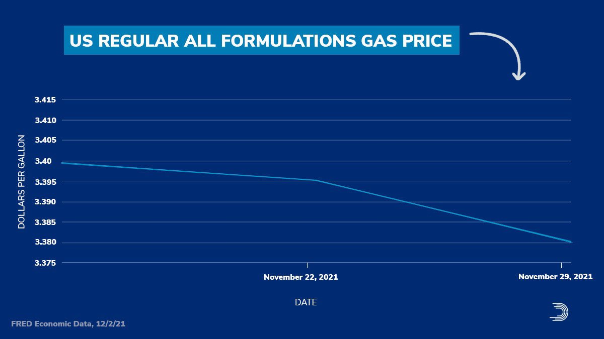

data source: https://www.eia.gov/dnav/pet/pet_pri_gnd_dcus_nus_w.htm

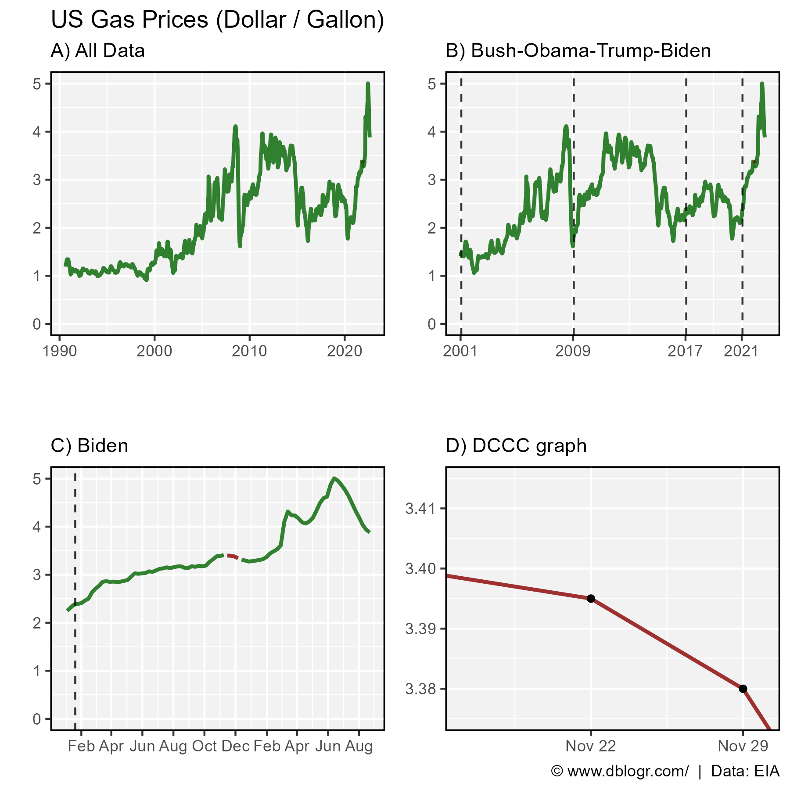

```{r}
# Prep data
xx <- read_xls("data_gas_prices_usa.xls", "Data 1", skip = 2) %>%
  rename(GasPrice=`Weekly U.S. Regular All Formulations Retail Gasoline Prices  (Dollars per Gallon)`) %>%
  mutate(Date = as.Date(Date), 
         Color = ifelse(Date >= "2021-11-15" & Date <= "2021-12-06", "0", "1"),
         Group = ifelse(Date < "2021-11-15", "0", "1"),
         Group = ifelse(Date > "2021-12-06", "2", Group)) %>%
  filter(!is.na(GasPrice))
myMax <- max(xx$Date)
# Plot
mp <- ggplot(xx, aes(x = Date, y = GasPrice, color = Color, group = Group)) +
  geom_line(size = 1, alpha = 0.8) +
  scale_color_manual(values = c("darkred", "darkgreen")) +
  theme_agData(legend.position = "none") + 
    ylim(c(0,max(xx$GasPrice))) +
  labs(y = NULL, x = NULL)
mp1 <- mp + 
  labs(title = "US Gas Prices (Dollar / Gallon)", subtitle = "A) All Data")
myDates1 <- as.Date(c("2001-01-20", "2009-01-20", "2017-01-20", "2021-01-20"))
myDates2 <- as.Date(c("2001-01-01", "2009-01-01", "2017-01-01", "2021-01-01"))
mp2 <- mp +
  geom_vline(xintercept = myDates1, lty = 2, alpha = 0.8) +
  scale_x_date(breaks = myDates2, date_labels = "%Y",
               limits = as.Date(c("2001-01-01", myMax))) +
  labs(subtitle = "B) Bush-Obama-Trump-Biden")
mp3 <- mp +
  geom_vline(xintercept = myDates1[4], lty = 2, alpha = 0.8) +
  scale_x_date(date_breaks = "2 month", date_label = "%b",
               limits = as.Date(c("2021-01-01", myMax))) +
  labs(subtitle = "C) Biden")
mp4 <-  mp + 
  geom_point(color = "black") + 
  coord_cartesian(ylim = c(3.375,3.415), 
                  xlim = as.Date(c("2021-11-16", "2021-11-30"))) +
  labs(subtitle = "D) DCCC graph",
       caption = "\u00A9 www.dblogr.com/  |  Data: EIA")
mp <- ggarrange(mp1, mp2, mp3, mp4, ncol = 2, nrow = 2, align = "hv")
ggsave("misleading_graphs_07.png", mp, width = 6, height = 6)
```

---

# 5. Color Scales

Color scales can be adjusted to present a desired narrative, by exaggerating differences and/or invoking emotional response, *i.e.*, red = bad. Here is an example from the news.


---

To help illustrate this, we can use some data from a flax field trial with a common check used throughout the trial to account for environmental variation within a field. Notice how in (A) the check variety has much less variability than the treatment varieties. Displaying the variation in the check variety across the field using a scale based on its range (B), presents a much different picture that if the color scale is based on the range from the treatment varieties (C).

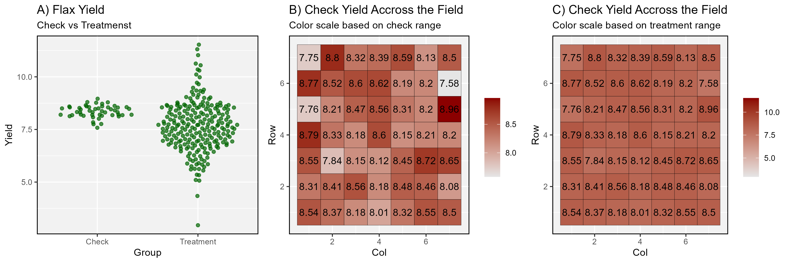

```{r}
# Prep data
xx <- read.csv("data_augmented_designs_2.csv") %>%
  rename(MainCheck=Cp..plot.control., SubCheck=Csp..sub.plot.control.) %>%
  filter(Environment == "M2012") %>%
  filter(MainCheck == 1 | SubCheck == 0) %>%
  mutate(Group = ifelse(MainCheck == 1, "Check", "Treatment"))
x1 <- xx %>% filter(Group == "Check")
# Plot
mp1 <- ggplot(xx, aes(x = Group, y = Yield)) +
  geom_quasirandom(color = "darkgreen", alpha = 0.7) +
  theme_agData() +
  labs(title = "A) Flax Yield", subtitle = "Check vs Treatmenst")
mp2 <- ggplot(x1, aes(x = Col, y = Row)) +
  geom_tile(aes(fill = Yield), color = "black") + 
  geom_text(aes(label = Yield)) +
  scale_fill_continuous(name = NULL, low = "grey90", high = "darkred") +
  theme_agData() +
  labs(title = "B) Check Yield Accross the Field",
       subtitle = "Color scale based on check range")
mp3 <- ggplot(x1, aes(x = Col, y = Row)) +
  geom_tile(aes(fill = Yield), color = "black") + 
  geom_text(aes(label = Yield)) +
  scale_fill_continuous(name = NULL, low = "grey90", high = "darkred",
                        limits = range(xx$Yield)) +
  theme_agData() +
  labs(title = "C) Check Yield Accross the Field",
       subtitle = "Color scale based on treatment range")
mp <- ggarrange(mp1, mp2, mp3, nrow = 1, ncol = 3) +
   bgcolor("grey90")
ggsave("misleading_graphs_08.png", mp, width = 12, height = 4)
```

We can also illustrate this by attempting different way to present results from the 2016 US election.

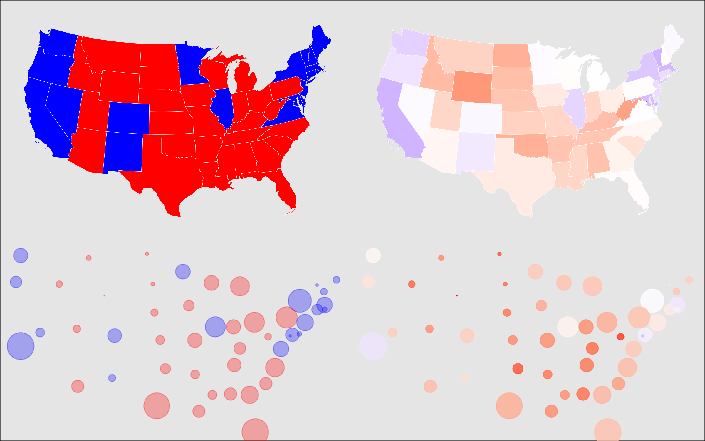

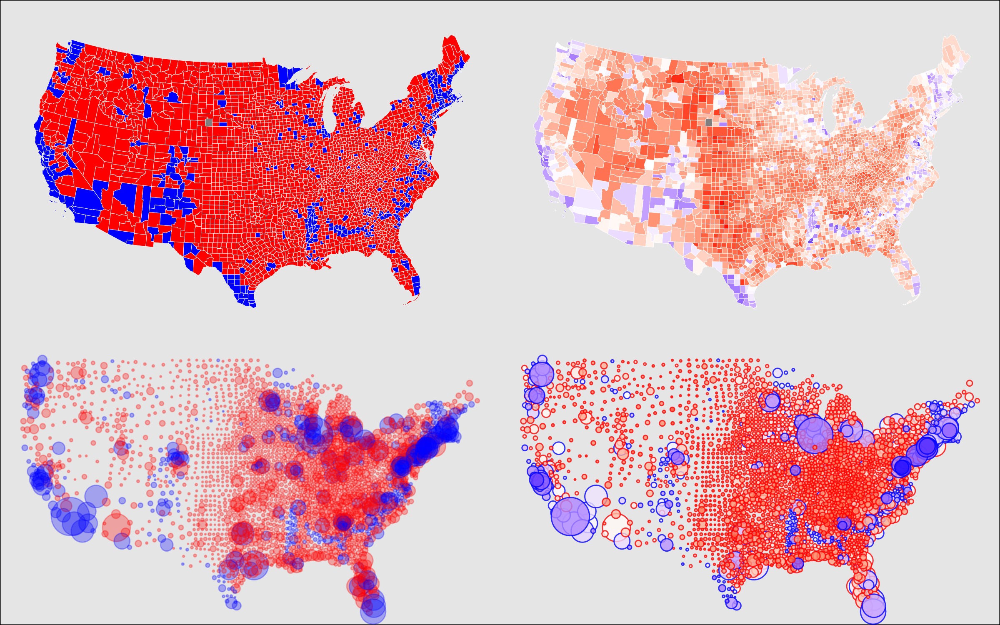

```{r}
# Prep data
x1 <- read.csv("https://raw.githubusercontent.com/tonmcg/US_County_Level_Election_Results_08-20/master/US_County_Level_Presidential_Results_08-16.csv", 
               colClasses = c(rep("factor",2),rep("numeric",12))) %>%
  rename(fips=fips_code) %>% 
  mutate(outcome_2016 = (gop_2016 - dem_2016),
         outcome.rank_2016 = abs(gop_2016 - dem_2016),
         outcome.perc.rank_2016 = abs(gop_2016 - dem_2016) / total_2016,
         outcome.perc_2016 = (gop_2016 - dem_2016) / total_2016,
         victor_2016 = ifelse(outcome_2016 > 0, "GOP","DEM"))
x2 <- geoCounty 

xx <- left_join(x1, x2, by = "fips") %>%
  arrange(outcome.perc.rank_2016)
y1 <- xx %>% group_by(state) %>%
  summarise_at(vars(gop_2016, dem_2016, total_2016), funs(sum)) %>%
  mutate(outcome_2016 = (gop_2016 - dem_2016),
         outcome.rank_2016 = abs(gop_2016 - dem_2016),
         outcome.perc.rank_2016 = abs(gop_2016 - dem_2016) / total_2016,
         outcome.perc_2016 = (gop_2016 - dem_2016) / total_2016,
         victor_2016 = ifelse(outcome_2016 > 0, "GOP","DEM"))
y2 <- xx %>% group_by(state) %>%
  summarise_at(vars(lat, lon), funs(mean))
yy <- left_join(y1, y2, by = "state")
# Plot States
mp1 <- plot_usmap(data = yy, lwd = 0.1, exclude = c("AK","HI"),
           values = "victor_2016", color = "white") +
  scale_fill_manual(values = c("blue", "red"), guide = F)
mp2 <- plot_usmap(data = yy, lwd = 0.1, exclude = c("AK","HI"),
           values = "outcome.perc_2016", color = "white") +
  scale_fill_gradient2(low = "blue", high = "red", mid = "white", guide = F)
mp3 <- ggplot(yy, aes(x = lon, y = lat, size = total_2016, color = victor_2016)) +
  geom_point(alpha = 0.3) +
  scale_color_manual(values = c("blue", "red")) +
  scale_size_continuous(range = c(0,10)) +
  theme_void() +
  theme(legend.position = "none")
mp4 <- ggplot(yy, aes(x = lon, y = lat, 
                      size = total_2016, fill = outcome.perc_2016, color = victor_2016)) +
  geom_point(pch = 21, alpha = 0.8) +
  scale_color_manual(values = alpha(c("blue", "red"),0.5)) +
  scale_fill_gradient2(low = "blue", high = "red", mid = "white") +
  scale_size_continuous(range = c(0,10)) +
  theme_void() +
  theme(legend.position = "none")
mp4 <- ggplot(yy, aes(x = lon, y = lat, 
                      size = total_2016, color = outcome.perc_2016)) +
  geom_point(alpha = 0.8) +
  scale_color_gradientn(colors = c("blue", "white", "red")) +
  scale_size_continuous(range = c(0,10)) +
  theme_void() +
  theme(legend.position = "none")
mp <- ggarrange(mp1, mp2, mp3, mp4, nrow = 2, ncol = 2, heights = c(1,0.8)) +
   bgcolor("grey90")
ggsave("misleading_graphs_09.png", mp, width = 8, height = 5)
# Plot Counties
mp1 <- plot_usmap(regions = "counties", data = xx, lwd = 0.1,
           values = "victor_2016", color = "white", 
           exclude = c("AK","HI")) +
  scale_fill_manual(values = c("blue", "red"), guide = F)
mp2 <- plot_usmap(regions = "counties", data = xx, lwd = 0.1,
           values = "outcome.perc_2016", color = "white", 
           exclude = c("AK","HI")) +
  scale_fill_gradient2(low = "blue", high = "red", mid = "white", guide = F) 
mp3 <- ggplot(xx, aes(x = lon, y = lat, size = total_2016, color = victor_2016)) +
  geom_point(alpha = 0.3) +
  scale_color_manual(values = c("blue", "red")) +
  scale_size_continuous(range = c(0,10)) +
  theme_void() +
  theme(legend.position = "none")
mp4 <- ggplot(xx, aes(x = lon, y = lat, 
                      size = total_2016, fill = outcome.perc_2016, color = victor_2016)) +
  geom_point(pch = 21, alpha = 0.8) +
  scale_color_manual(values = alpha(c("blue", "red"),0.5)) +
  scale_fill_gradient2(low = "blue", high = "red", mid = "white") +
  scale_size_continuous(range = c(0,10)) +
  theme_void() +
  theme(legend.position = "none")
mp <- ggarrange(mp1, mp2, mp3, mp4, nrow = 2, ncol = 2, heights = c(1,0.8)) +
   bgcolor("grey90")
ggsave("misleading_graphs_10.png", mp, width = 8, height = 5)
```

---

```{r eval = F, echo = F}
# https://berkeley-earth-temperature.s3.us-west-1.amazonaws.com/Global/Complete_TAVG_daily.txt
xx <- read.table("https://berkeley-earth-temperature.s3.us-west-1.amazonaws.com/Global/Complete_TAVG_daily.txt", skip = 23)
meanTemp <- 8.59
colnames(xx) <- c("Date Number", "Year", "Month", "Day", "Day of Year", "Anomaly")
xx <- xx %>% mutate(Temp = meanTemp + Anomaly) %>%
  group_by(Year) %>%
  summarise(Temp = mean(Temp), Anomaly = mean(Anomaly))
#
ggplot(xx, aes(x = Year, y = Temp)) +
  geom_line() +
  theme_agData()
ggplot(xx, aes(xmin = Year, xmax = Year+1, fill = Temp)) +
  geom_rect(ymin = 0, ymax = 1) +
  theme_void() +
  theme(legend.position = "none") +
  scale_fill_continuous(high = "darkred", low = "steelblue")
#
#https://www.science.org/doi/10.1126/science.1228026
xx <- read.csv("data_temp.csv") %>% rename(Year=1, Temp=2)
ggplot(xx, aes(x = Year, y = Temp)) +
  geom_line() +
  theme_agData()
ggplot(xx, aes(xmin = Year-10, xmax = Year+10, fill = Temp)) +
  geom_rect(ymin = 0, ymax = 1) +
  theme_void() +
  theme(legend.position = "none") +
  scale_fill_continuous(high = "darkred", low = "steelblue")
```
