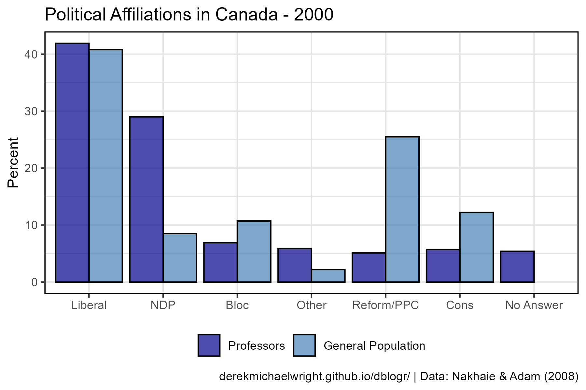
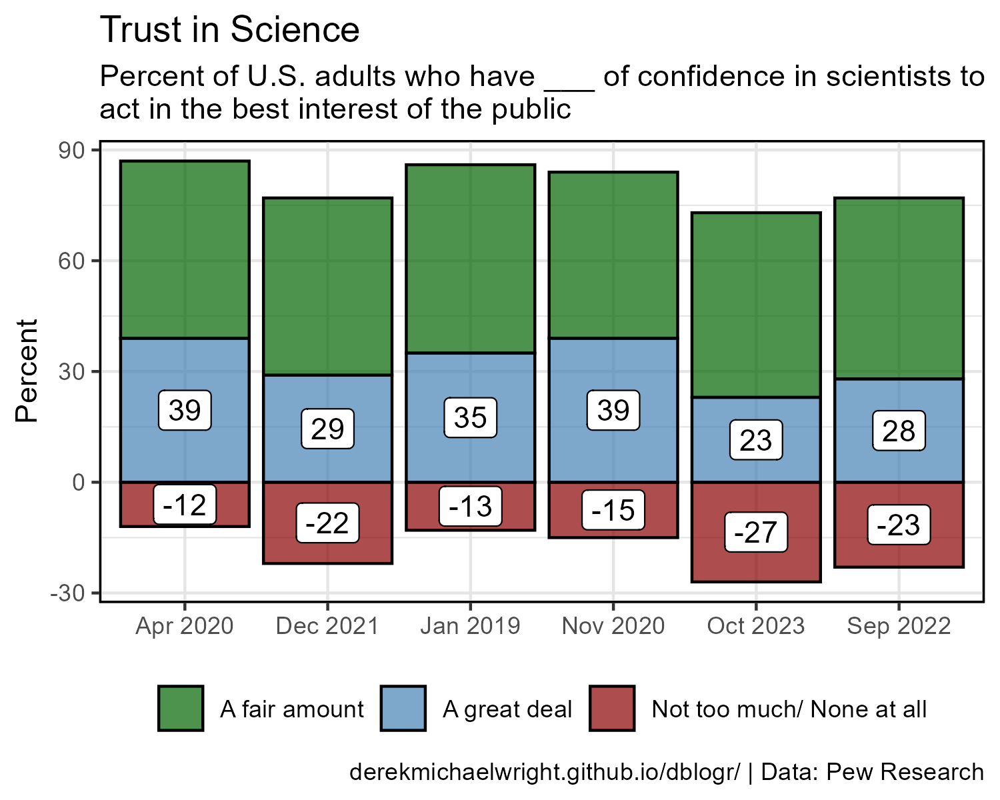
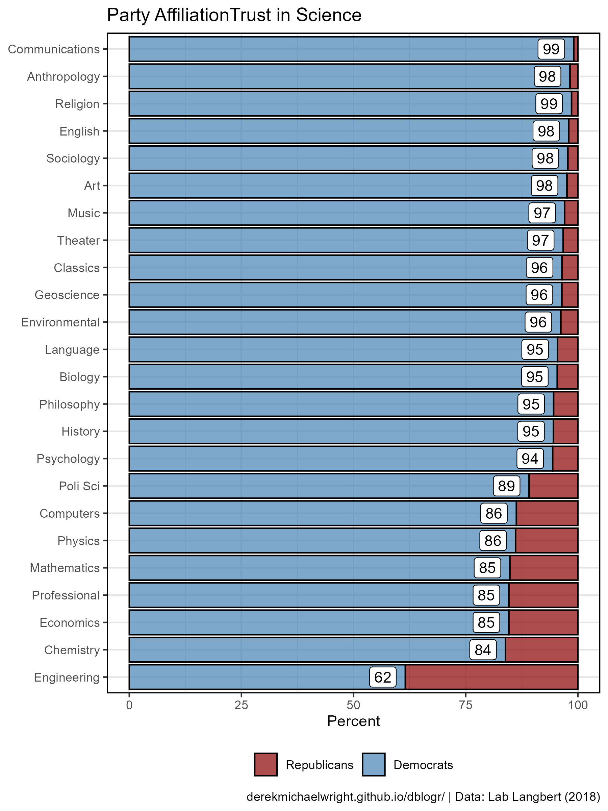

```{r setup, include=FALSE}
knitr::opts_chunk$set(echo = TRUE, message = F, warning = F)
```

---

# Data

> - `r shiny::icon("globe")` [https://macdonaldlaurier.ca/the-viewpoint-diversity-crisis-at-canadian-universities/](https://macdonaldlaurier.ca/the-viewpoint-diversity-crisis-at-canadian-universities/){target="_blank"}
> - `r shiny::icon("file-pdf")` https://www.jstor.org/stable/pdf/canajsocicahican.33.4.873.pdf

> - `r shiny::icon("globe")` [https://www.pewresearch.org/science/2023/11/14/americans-trust-in-scientists-positive-views-of-science-continue-to-decline/](https://www.pewresearch.org/science/2023/11/14/americans-trust-in-scientists-positive-views-of-science-continue-to-decline/){target="_blank"}

> - `r shiny::icon("file-pdf")` [https://climate-science.press/wp-content/uploads/2022/02/012129_2018_Article_9700.pdf](https://climate-science.press/wp-content/uploads/2022/02/012129_2018_Article_9700.pdf){target="_blank"}

> - `r shiny::icon("save")` [data_politics_in_academia.xlsx](data_politics_in_academia.xlsx)

---

# Prepare Data

```{r class.source = "fold-show"}
# devtools::install_github("derekmichaelwright/agData")
library(agData)
library(readxl)
```

```{r}
# Prep data
myCaption1 <- "derekmichaelwright.github.io/dblogr/blog/politics_in_academia | Data: MLI"
myCaption2 <- "derekmichaelwright.github.io/dblogr/blog/politics_in_academia | Data: Nakhaie & Adam (2008)"
d1 <- read_xlsx("data_politics_in_academia.xlsx", "Canada") %>%
  mutate(Party = factor(Party, levels = unique(.$Party)),
         Measurement = factor(Measurement, unique(.$Measurement)))
#
myCaption3 <- "derekmichaelwright.github.io/dblogr/blog/politics_in_academia | Data: Pew Research"
myRespones <- c("Mostly positive", "Equal positive and negative", "Mostly negative")
d2 <- read_xlsx("data_politics_in_academia.xlsx", "Effect on Society") %>%
  mutate(Date = paste(Month, Year),
         Response = factor(Response, levels = myRespones))
d3 <- read_xlsx("data_politics_in_academia.xlsx", "Trust") %>%
  mutate(Date = paste(Month, Year),
         Label_Pos = ifelse(Response != "A fair amount", Percent / 2, NA))
#
myCaption4 <- "derekmichaelwright.github.io/dblogr/blog/politics_in_academia | Data: Lab Langbert (2018)"
d4 <- read_xlsx("data_politics_in_academia.xlsx", "Fields") %>%
  mutate(Field = factor(Field, levels = .$Field),
         Percent_Dem = 100 * (Democrats) / (Democrats + Republicans),
         Percent_Rep = 100 * (Republicans) / (Democrats + Republicans))
```

---

# Political Views in Academia {.tabset .tabset-pills}

## 2021


```{r}
# Plot
mp <- ggplot(d1, aes(x = Party, y = `2021`, fill = Measurement)) + 
  geom_col(position = "dodge", color = "black", alpha = 0.7) +
  scale_fill_manual(name = NULL, values = c("darkblue", "steelblue")) +
  theme_agData(legend.position = "bottom") +
  labs(title = "Political Affiliations in Canada - 2021",
       y = "Percent", x = NULL, caption = myCaption1)
ggsave("politics_in_academia_1_01.png", mp, width = 6, height = 4)
```

```{r echo = F}
ggsave("featured.png", mp, width = 6, height = 4)
```

---

## 2000



```{r}
# Plot
mp <- ggplot(d1, aes(x = Party, y = `2000`, fill = Measurement)) + 
  geom_col(position = "dodge", color = "black", alpha = 0.7) +
  scale_fill_manual(name = NULL, values = c("darkblue", "steelblue")) +
  theme_agData(legend.position = "bottom") +
  labs(title = "Political Affiliations in Canada - 2000",
       y = "Percent", x = NULL, caption = myCaption2)
ggsave("politics_in_academia_1_02.png", mp, width = 6, height = 4)
```

---

## 1997


```{r}
# Plot
mp <- ggplot(d1, aes(x = Party, y = `1997`, fill = Measurement)) + 
  geom_col(position = "dodge", color = "black", alpha = 0.7) +
  scale_fill_manual(name = NULL, values = c("darkblue", "steelblue")) +
  theme_agData(legend.position = "bottom") +
  labs(title = "Political Affiliations in Canada - 1997",
       y = "Percent", x = NULL, caption = myCaption2)
ggsave("politics_in_academia_1_03.png", mp, width = 6, height = 4)
```

---

## 1993


```{r}
# Plot
mp <- ggplot(d1, aes(x = Party, y = `1993`, fill = Measurement)) + 
  geom_col(position = "dodge", color = "black", alpha = 0.7) +
  scale_fill_manual(name = NULL, values = c("darkblue", "steelblue")) +
  theme_agData(legend.position = "bottom") +
  labs(title = "Political Affiliations in Canada - 1993",
       y = "Percent", x = NULL, caption = myCaption2)
ggsave("politics_in_academia_1_04.png", mp, width = 6, height = 4)
```

---

# Public Opinion {.tabset .tabset-pills}

## Trust in Science


```{r}
# Prep data
mySubtitle <- "Percent of U.S. adults who say science has had a(n)\n___ effect on society"
# Plot
mp <- ggplot(d2, aes(x = Date, y = Percent, fill = Response)) + 
  geom_col(color = "black", alpha = 0.7) +
  scale_fill_manual(name = NULL, values = c("darkgreen", "steelblue", "darkred")) +
  theme_agData(legend.position = "bottom") +
  labs(title = "Trust in Science", subtitle = mySubtitle,
       y = "Percent", x = NULL, caption = myCaption3)
ggsave("politics_in_academia_2_01.png", mp, width = 5, height = 4)
```

---

## Positive or Negative



```{r}
# Prep data
mySubtitle <- "Percent of U.S. adults who have ___ of confidence in scientists to\nact in the best interest of the public"
# Plot
mp <- ggplot(d3, aes(x = Date)) + 
  geom_col(aes(y = Percent, fill = Response), 
           color = "black", alpha = 0.7) +
  geom_label(aes(label = Percent, y = Label_Pos)) +
  scale_fill_manual(name = NULL, values = c("darkgreen", "steelblue", "darkred")) +
  theme_agData(legend.position = "bottom") +
  labs(title = "Trust in Science", subtitle = mySubtitle,
       y = "Percent", x = NULL, caption = myCaption3)
ggsave("politics_in_academia_2_02.png", mp, width = 5, height = 4)
```

---

# Academic Fields



```{r}
# Prep data
xx <- d4 %>% select(-Democrats, -Republicans) %>%
  rename(Democrats=Percent_Dem, Republicans= Percent_Rep) %>%
  gather(Party, Percent, 2:3) %>%
  mutate(Party = factor(Party, levels = c("Republicans","Democrats")))
# Plot
mp <- ggplot(xx, aes(x = Field, y = Percent, label = round(Percent))) + 
  geom_col(aes(fill = Party), color = "black", alpha = 0.7) +
  geom_label(data = xx %>% filter(Party == "Democrats"), nudge_y = -5) +
  scale_fill_manual(name = NULL, values = c("darkred","steelblue")) +
  theme_agData(legend.position = "bottom") +
  coord_flip() +
  labs(title = "Party AffiliationTrust in Science", 
       y = "Percent", x = NULL, caption = myCaption4)
ggsave("politics_in_academia_3_01.png", mp, width = 6, height = 8)
```

---
