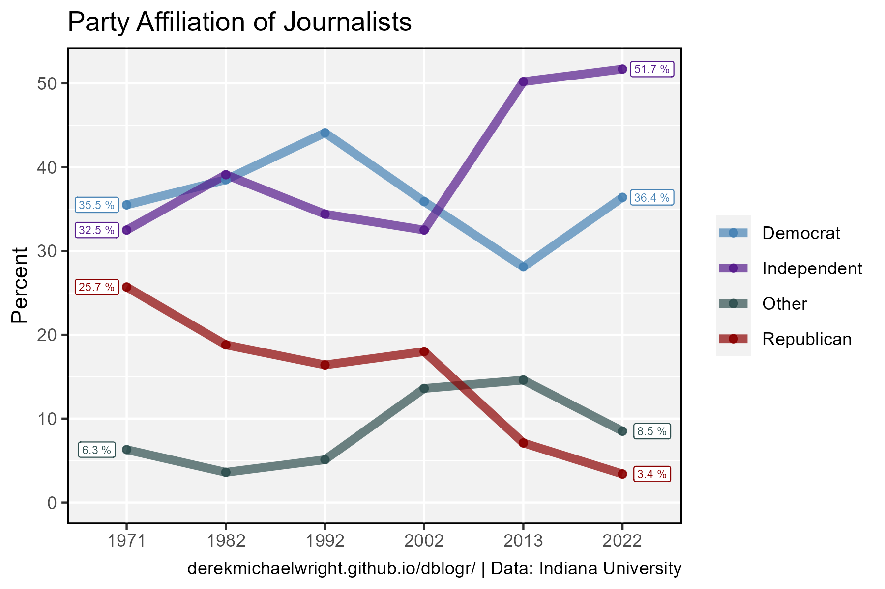

```{r setup, include=FALSE}
knitr::opts_chunk$set(echo = TRUE, message = F, warning = F)
```

---

# Data

> - `r shiny::icon("globe")` [https://www.theamericanjournalist.org/post/american-journalist-findings](https://www.theamericanjournalist.org/post/american-journalist-findings){target="_blank"}
> - `r shiny::icon("globe")` [https://news.gallup.com/poll/651977/americans-trust-media-remains-trend-low.aspx](https://news.gallup.com/poll/651977/americans-trust-media-remains-trend-low.aspx){target="_blank"}
> - `r shiny::icon("save")` [data_politics_in_journalism.xlsx](data_politics_in_journalism.xlsx)

---

# Prepare Data

```{r class.source = 'fold-show'}
# devtools::install_github("derekmichaelwright/agData")
library(agData)
library(readxl)
```

```{r}
# Prep data
myCaption1 <- "www.dblogr.com/ or derekmichaelwright.github.io/dblogr/ | Data: Indiana University"
myCaption2 <- "www.dblogr.com/ or derekmichaelwright.github.io/dblogr/ | Data: Gallup"
myColors1 <- c("steelblue", "purple4", "darkslategrey", "darkred")
myColors2 <- c("steelblue", "purple4", "darkred")
#
d1 <- read_xlsx("data_politics_in_journalism.xlsx", "Journalists") %>%
  gather(Party, Percent, 2:5) %>% mutate(Year = factor(Year))
d2 <- read_xlsx("data_politics_in_journalism.xlsx", "Trust") %>%
  gather(Party, Percent, 2:4) 
```

---

# Party Affiliation

## Bar


```{r}
# Plot
mp <- ggplot(d1, aes(x = Year, y = Percent, fill = Party)) + 
  geom_col(alpha = 0.7, color = "black") +
  scale_fill_manual(name = NULL, values = myColors1) +
  theme_agData() +
  labs(title = "Party Affiliation of Journalists", 
       x = NULL, caption = myCaption1)
ggsave("politics_in_journalism_01.png", mp, width = 6, height = 4)
```

```{r echo = F}
ggsave("featured.png", mp, width = 6, height = 4)
```

---

## Line



```{r}
# Plot
mp <- ggplot(d1, aes(x = Year, y = Percent, color = Party)) + 
  geom_line(aes(group = Party), alpha = 0.7, lwd = 2) +
  geom_point(alpha = 0.9) +
  geom_label(data = d1 %>% filter(Year == "2022"), size = 2, nudge_x = 0.3,
             aes(label = paste(Percent, "%")), show.legend = F) +
  geom_label(data = d1 %>% filter(Year == "1971"), size = 2, nudge_x = -0.3,
             aes(label = paste(Percent, "%")), show.legend = F) +
  scale_color_manual(name = NULL, values = myColors1) +
  expand_limits(y = 0) +
  theme_agData() +
  labs(title = "Party Affiliation of Journalists", 
       x = NULL, caption = myCaption1)
ggsave("politics_in_journalism_02.png", mp, width = 6, height = 4)
```

---

# Public Trust


```{r}
# Prep data
mySubtitle <- "In general, how much trust and confidence do you have in the mass media\nwhen it comes to reporting the news fully, accurately and fairly"
# Plot
mp <- ggplot(d2 %>% filter(Year > 1980), 
             aes(x = Year, y = Percent, color = Party)) + 
  stat_smooth(geom = "line", method = "lm", se = F) +
  geom_line(alpha = 0.7, lwd = 2) +
  geom_point(alpha = 0.9) +
  scale_color_manual(name = NULL, values = myColors2) +
  theme_agData() +
  labs(title = "Public Trust in Media", x = NULL, 
       subtitle = mySubtitle, caption = myCaption2)
ggsave("politics_in_journalism_03.png", mp, width = 6, height = 4)
```

---


```{r}
# Prep data
xx <- d2 %>% filter(Year %in% c(1972, 2024)) %>% mutate(Year = factor(Year))
# Plot
mp <- ggplot(xx, aes(x = Year, y = Percent, fill = Party)) + 
  geom_col(color = "black", alpha = 0.7) +
  geom_label(aes(label = paste(Percent,"%")), fill = "white", show.legend = F) +
  facet_grid(. ~ Party) +
  scale_fill_manual(name = NULL, values = myColors2) +
  scale_alpha_manual(name = NULL, values = c(0.4,0.7)) +
  theme_agData() +
  labs(title = "Public Trust in Media", x = NULL,
       subtitle = mySubtitle, caption = myCaption1)
ggsave("politics_in_journalism_04.png", mp, width = 6, height = 4)
```

---
