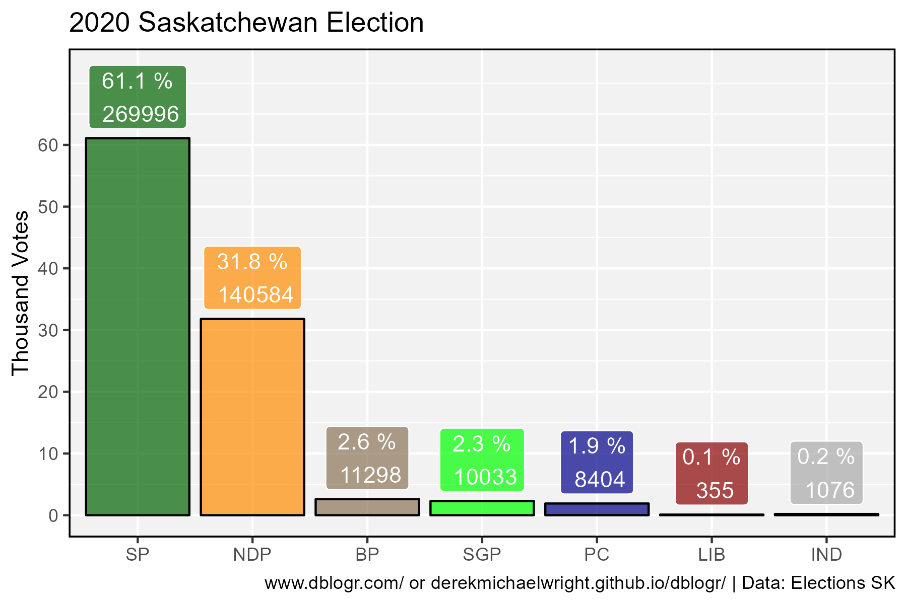
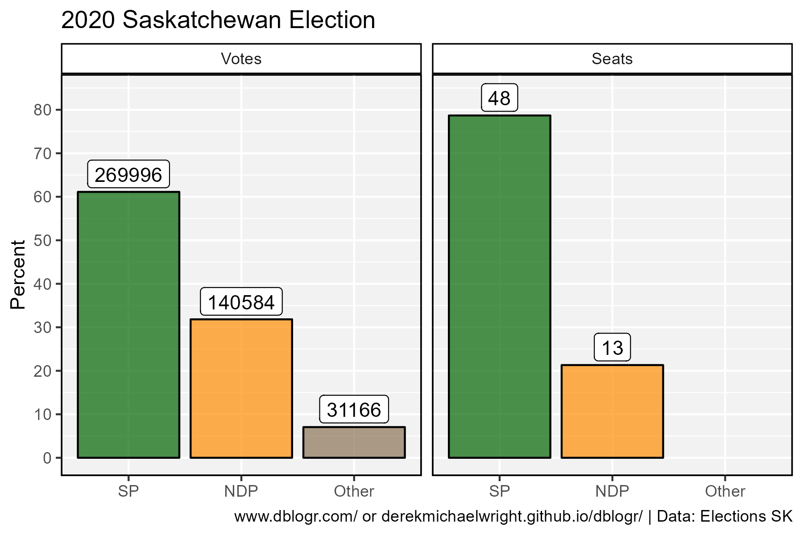
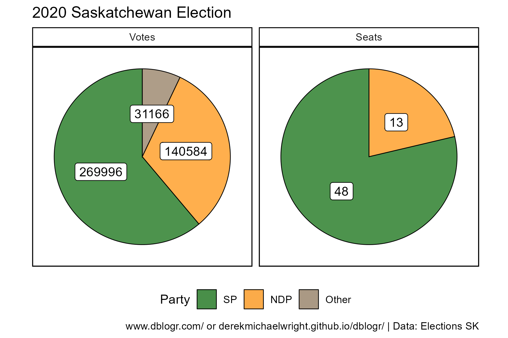
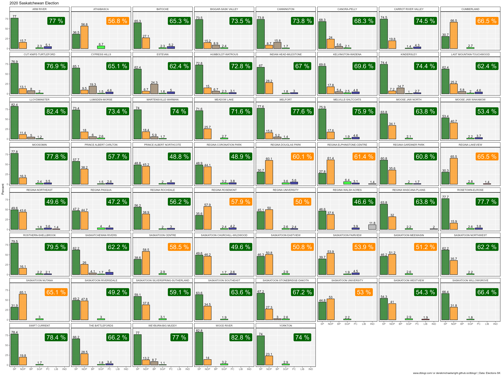
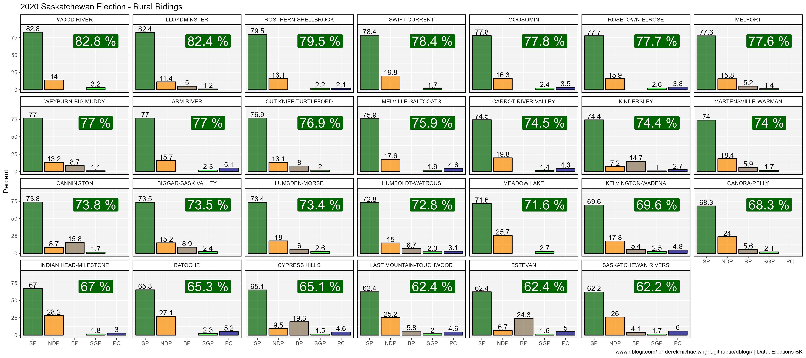
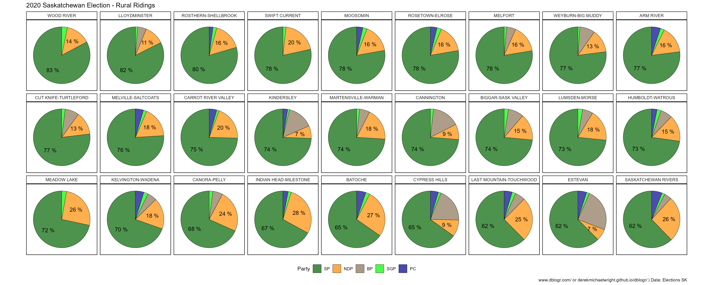
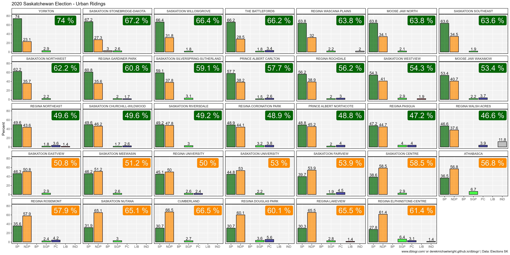
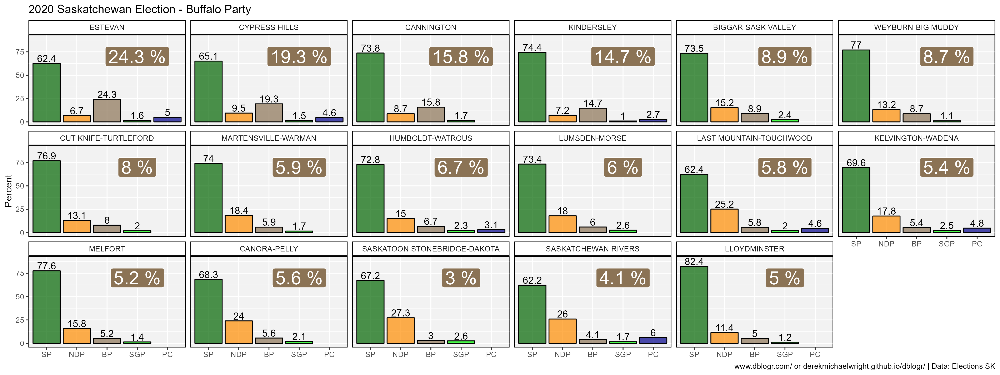
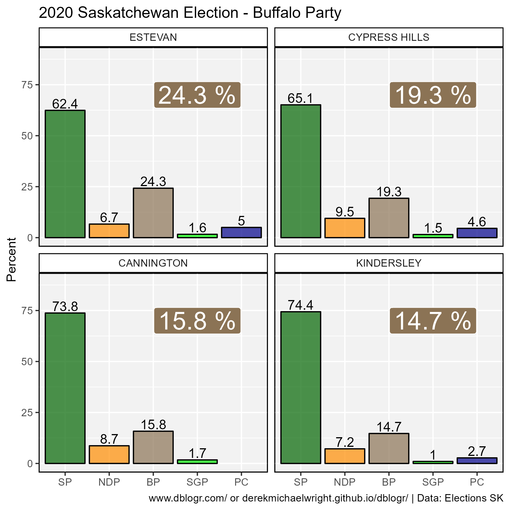
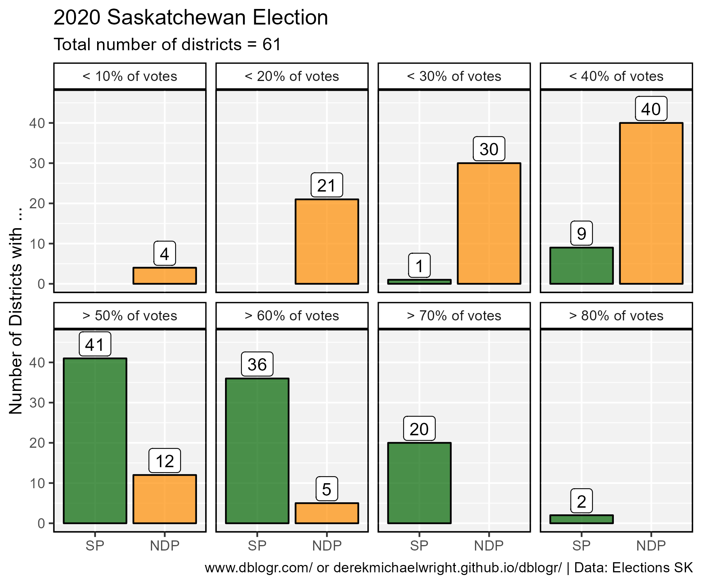

```{r setup, include=FALSE}
knitr::opts_chunk$set(echo = T, message = F, warning = F)
```

---

# Introduction

The [2020 Saskatchewan provincial election](https://en.wikipedia.org/wiki/2020_Saskatchewan_general_election) was won by the [**Saskatchewan Party**](https://en.wikipedia.org/wiki/Saskatchewan_Party) who won 48 (+2) of the 61 seats. Second place went to the [**NDP**](https://en.wikipedia.org/wiki/Saskatchewan_New_Democratic_Party) who won 13 seats. Surpringly, third place went to the newly formed [**Buffalo Party**](https://en.wikipedia.org/wiki/Buffalo_Party_of_Saskatchewan) who beat out the [**Green Party**](https://en.wikipedia.org/wiki/Green_Party_of_Saskatchewan) despite only running candidates in 17 ridings and even came in second in 4 rural ridings, beating out the NDP. Hilariously, the [**Liberal Party**](https://en.wikipedia.org/wiki/Saskatchewan_Liberal_Party) only ran 3 candidates and only received a total of 355 votes throughout the province.


---

# Data

> - `r shiny::icon("globe")` https://results.elections.sk.ca/
> - `r shiny::icon("save")` [data_saskatchewan_2020_election.csv](data_saskatchewan_2020_election.csv)

```{r class.source = 'fold-show'}
# devtools::install_github("derekmichaelwright/agData")
library(agData)
```

---

# Prepare Data

```{r}
# Prep data
myCaption <- "www.dblogr.com/ or derekmichaelwright.github.io/dblogr/ | Data: Elections SK"
myParties <- c("SP", "NDP", "BP", "SGP", "PC", "LIB", "IND")
myColors <- c("darkgreen", "darkorange", "burlywood4", "green", 
              "darkblue", "darkred", "darkgrey")
#
dd <- read.csv("data_saskatchewan_2020_election.csv") %>% 
  mutate(Constituency = gsub("[0-9]", "", Constituency)) %>%
  select(Constituency, BP, NDP, PC, SGP, LIB, SP, IND) %>%
  gather(Party, Votes, BP, NDP, PC, SGP, LIB, SP, IND) %>%
  mutate(Party = factor(Party, levels = myParties)) %>%
  filter(Votes != 0)
```

---

# Total Votes



```{r}
# Prep data
xx <- dd %>% 
  group_by(Party) %>%
  summarise(Votes = sum(Votes)) %>%
  ungroup() %>%
  mutate(Percent = round(100 * Votes / sum(Votes), 1))
# Plot
mp <- ggplot(xx, aes(x = Party, y = Percent, fill = Party)) +
  geom_col(color = "black", alpha = 0.7) +
  geom_label(aes(label = paste(Percent, "%\n", Votes)), 
             vjust = -0.15, color = "white", alpha = 0.7) +
  scale_fill_manual(values = myColors) +
  scale_y_continuous(breaks = seq(0,60,by=10), limits = c(0,72)) +
  theme_agData(legend.position = "none") + 
  labs(title = "2020 Saskatchewan Election", x = NULL,
       y = "Thousand Votes", caption = myCaption)
ggsave("saskatchewan_2020_election_01.png", mp, width = 6, height = 4)
```

```{r echo = F}
ggsave("featured.png", mp, width = 6, height = 4)
```

---

# Votes vs Seats





```{r}
# Seats data
xs <- dd %>% 
  group_by(Constituency) %>%
  top_n(1)
xs <- as.data.frame(table(xs$Party)) %>% 
  rename(Party=1, Value=2) %>%
  filter(Value > 0) %>%
  arrange(desc(Party)) %>%
  mutate(Percent = 100 * Value / sum(Value),
         LabelPos = cumsum(Percent) - (Percent / 2)) %>%
  mutate(Measurement = "Seats")
# Votes data
xv <- dd %>% 
  mutate(Party = ifelse(Party %in% c("SP","NDP"), as.character(Party), "Other"),
         Party = factor(Party, levels = c("SP","NDP","Other"))) %>%
  group_by(Party) %>%
  summarise(Value = sum(Votes)) %>%
  ungroup() %>%
  arrange(desc(Party)) %>%
  mutate(Percent = 100 * Value / sum(Value),
         LabelPos = cumsum(Percent) - (Percent / 2)) %>%
  mutate(Measurement = "Votes")
#
xx <- bind_rows(xv, xs) %>%
  mutate(Measurement = factor(Measurement, levels = c("Votes", "Seats")))
# Plot Bars
mp <- ggplot(xx, aes(x = Party, y = Percent, fill = Party)) +
  geom_col(color = "black", alpha = 0.7) +
  geom_label(aes(label = Value), fill = "white", vjust = -0.15) +
  facet_wrap(Measurement ~ .) +
  scale_fill_manual(values = myColors) +
  scale_y_continuous(breaks = seq(0,80,by=10), limits = c(0,84)) +
  theme_agData(legend.position = "none") +
  labs(title = "2020 Saskatchewan Election", 
       x = NULL, caption = myCaption)
ggsave("saskatchewan_2020_election_02.png", mp, width = 6, height = 4)
# Plot Pie
mp <- ggplot(xx, aes(x = "", y = Percent)) +
  geom_col(aes(fill = Party), color = "black", alpha = 0.7, lwd = 0.3) +
  coord_polar("y", start = 0) +
  geom_label(aes(y = LabelPos, label = Value)) +
  facet_wrap(Measurement ~ .) +
  scale_fill_manual(values = myColors)+
  theme_agData_pie(legend.position = "bottom") +
  labs(title = "2020 Saskatchewan Election", 
       x = NULL, caption = myCaption)
ggsave("saskatchewan_2020_election_03.png", mp, width = 6, height = 4)
```

---

# All Ridings

## PDF

> - `r shiny::icon("file-pdf")` [saskatchewan_2020_election_districts.pdf](saskatchewan_2020_election_districts.pdf)

```{r}
pdf("saskatchewan_2020_election_districts.pdf", width = 8, height = 4)
districts <- unique(dd$Constituency)
#i<-"THE BATTLEFORDS"
for(i in districts) {
  xi <- dd %>% filter(Constituency == i) %>%
    mutate(Percent = 100 * Votes / sum(Votes)) %>%
    arrange(desc(Party)) %>%
    mutate(LabelPos = cumsum(Percent) - (Percent / 2),
           #LabelPos = ifelse(Votes == 0, NA, LabelPos)
           )
  # Bar Chart
  mp1 <- ggplot(xi, aes(x = Party, y = Percent, fill = Party)) +
    geom_col(color = "black", alpha = 0.7) +
    geom_label(aes(label = Votes), vjust = -0.15, 
               color = "white", alpha = 0.7) + 
    facet_wrap(Constituency ~ .) +
    scale_fill_manual(values = myColors, drop = F) +
    scale_x_discrete(drop = F) +
    ylim(c(0,88)) +
    theme_agData(legend.position = "none") +
    labs(title = "2020 Saskatchewan Election", 
         x = NULL, caption = "")
  # Plot Pie
  mp2 <- ggplot(xi, aes(x = "", y = Percent)) +
    geom_col(aes(fill = Party), color = "black", alpha = 0.7, lwd = 0.3) +
    coord_polar("y", start = 0) +
    geom_label(aes(y = LabelPos, label = round(Percent)), nudge_x = 0.3) +
    facet_wrap(Constituency ~ .) +
    scale_fill_manual(values = myColors, breaks = myParties) +
    theme_agData_pie(legend.position = "none") +
    labs(title = "", x = NULL, caption = myCaption)
  #
  mp <- ggarrange(mp1, mp2, ncol = 2, align = "h")
  print(mp)
}
dev.off()
```

---

## Facetted




```{r}
# Prep data
xx <- dd %>%
  group_by(Constituency) %>%
  mutate(Percent = 100 * Votes / sum(Votes)) %>%
  arrange(desc(Party)) %>%
  mutate(LabelPos = cumsum(Percent) - (Percent / 2))
xw <- xx %>% top_n(1, Percent)
# Plot Bar
mp <- ggplot(xx, aes(x = Party, y = Percent)) +
  geom_col(aes(fill = Party), color = "black", alpha = 0.7) +
  geom_text(aes(label = round(Percent,1)), size = 4, vjust = -0.2) +
  geom_label(data = xw, x = 6, y = 70, color = "white", size = 7.5,
             aes(label = paste(round(Percent,1),"%"), fill = Party)) +
  facet_wrap(Constituency ~ ., ncol = 8) +
  scale_fill_manual(values = myColors) +
  ylim(c(0,89)) +
  theme_agData(legend.position = "none") +
  labs(title = "2020 Saskatchewan Election", 
       x = NULL, caption = myCaption)
ggsave("saskatchewan_2020_election_04.png", mp, width = 24, height = 18)
# Plot Pie
xx <- xx %>% mutate(LabelPos = ifelse(Party %in% c("SP","NDP"), LabelPos, NA))
mp <- ggplot(xx, aes(x = "", y = Percent)) +
  geom_col(aes(fill = Party), color = "black", alpha = 0.7, lwd = 0.2) +
  coord_polar("y", start = 0) +
  geom_text(aes(y = LabelPos, label = paste(round(Percent),"%")), size = 5, nudge_x = 0.15) +
  facet_wrap(Constituency ~ ., ncol = 13) +
  scale_fill_manual(values = myColors) +
  theme_agData_pie(legend.position = "bottom") +
  guides(fill = guide_legend(nrow = 1)) +
  labs(title = "2020 Saskatchewan Election", 
       x = NULL, caption = myCaption)
ggsave("saskatchewan_2020_election_05.png", mp, width = 36, height = 16)
```

---

# Rural Ridings





```{r}
# Prep data
xx <- dd %>%
  filter(!grepl("REGINA|SASKATOON|PRINCE ALBERT|MOOSE JAW|BATTLEFORDS|
                SWIFT CURRENT|YORKTON|CUMBERLAND|ATHABASCA", Constituency)) %>%
  group_by(Constituency) %>%
  mutate(Percent = 100 * Votes / sum(Votes)) %>%
  arrange(desc(Party)) %>%
  mutate(LabelPos = cumsum(Percent) - (Percent / 2)) %>%
  arrange(desc(Percent)) %>% 
  mutate(Constituency = factor(Constituency, levels = unique(.$Constituency)))
xw <- xx %>% top_n(1, Percent)
# Plot Bar
mp <- ggplot(xx, aes(x = Party, y = Percent)) +
  geom_col(aes(fill = Party), color = "black", alpha = 0.7) +
  geom_text(aes(label = round(Percent,1)), size = 4, vjust = -0.2) +
  geom_label(data = xw, x = 4, y = 70, color = "white", size = 7.5,
             aes(label = paste(round(Percent,1),"%"), fill = Party)) +
  facet_wrap(Constituency ~ ., ncol = 7) +
  scale_fill_manual(values = myColors) +
  ylim(c(0,89)) +
  theme_agData(legend.position = "none") +
  labs(title = "2020 Saskatchewan Election - Rural Ridings", 
       x = NULL, caption = myCaption)
ggsave("saskatchewan_2020_election_06.png", mp, width = 18, height = 8)
# Plot Pie
xx <- xx %>% mutate(LabelPos = ifelse(Party %in% c("SP","NDP"), LabelPos, NA))
mp <- ggplot(xx, aes(x = "", y = Percent)) +
  geom_col(aes(fill = Party), color = "black", alpha = 0.7, lwd = 0.2) +
  coord_polar("y", start = 0) +
  geom_text(aes(y = LabelPos, label = paste(round(Percent),"%")), size = 4, nudge_x = 0.1) +
  facet_wrap(Constituency ~ ., ncol = 9) +
  scale_fill_manual(values = myColors) +
  theme_agData_pie(legend.position = "bottom") +
  guides(fill = guide_legend(nrow = 1)) +
  labs(title = "2020 Saskatchewan Election - Rural Ridings", 
       x = NULL, caption = myCaption)
ggsave("saskatchewan_2020_election_07.png", mp, width = 20, height = 8)
```


---

# Urban Ridings



```{r}
# Prep data
xx <- dd %>%
  filter(grepl("REGINA|SASKATOON|PRINCE ALBERT|MOOSE JAW|BATTLEFORDS|
                SWIFT CURRENT|YORKTON|CUMBERLAND|ATHABASCA", Constituency)) %>%
  group_by(Constituency) %>%
  mutate(Percent = 100 * Votes / sum(Votes)) %>%
  arrange(desc(Party)) %>%
  mutate(LabelPos = cumsum(Percent) - (Percent / 2)) %>%
  arrange(Party, desc(Percent)) %>% 
  mutate(Constituency = factor(Constituency, levels = unique(.$Constituency)))
xw <- xx %>% top_n(1, Percent)
# Plot Bar
mp <- ggplot(xx, aes(x = Party, y = Percent)) +
  geom_col(aes(fill = Party), color = "black", alpha = 0.7) +
  geom_text(aes(label = round(Percent,1)), size = 4, vjust = -0.2) +
  geom_label(data = xw, x = 6, y = 70, color = "white", size = 7.5,
             aes(label = paste(round(Percent,1),"%"), fill = Party)) +
  facet_wrap(Constituency ~ ., ncol = 7) +
  scale_fill_manual(values = myColors) +
  ylim(c(0,80)) +
  theme_agData(legend.position = "none") +
  labs(title = "2020 Saskatchewan Election - Urban Ridings", 
       x = NULL, caption = myCaption)
ggsave("saskatchewan_2020_election_08.png", mp, width = 20, height = 10)
# Plot Pie
xx <- xx %>% mutate(LabelPos = ifelse(Party %in% c("SP","NDP"), LabelPos, NA))
mp <- ggplot(xx, aes(x = "", y = Percent)) +
  geom_col(aes(fill = Party), color = "black", alpha = 0.7, lwd = 0.2) +
  coord_polar("y", start = 0) +
  geom_text(aes(y = LabelPos, label = paste(round(Percent),"%")), size = 4, nudge_x = 0.1) +
  facet_wrap(Constituency ~ ., ncol = 7) +
  scale_fill_manual(values = myColors) +
  theme_agData_pie(legend.position = "bottom") +
  guides(fill = guide_legend(nrow = 1)) +
  labs(title = "2020 Saskatchewan Election - Urban Ridings", 
       x = NULL, caption = myCaption)
ggsave("saskatchewan_2020_election_09.png", mp, width = 26, height = 20)
```

---

# Buffalo Party

## All Ridings


```{r}
# Prep data
myCs <- dd %>% filter(Party == "BP", Votes > 0) %>% 
  arrange(desc(Votes)) %>% pull(Constituency)
xx <- dd %>%
  filter(Constituency %in% myCs) %>%
  group_by(Constituency) %>%
  mutate(Percent = 100 * Votes / sum(Votes),
         Constituency = factor(Constituency, levels = myCs))
xw <- xx %>% filter(Party == "BP") 
# Plot Bar
mp <- ggplot(xx, aes(x = Party, y = Percent)) +
  geom_col(aes(fill = Party), color = "black", alpha = 0.7) +
  geom_text(aes(label = round(Percent,1)), size = 4, vjust = -0.2) +
  geom_label(data = xw, x = 4, y = 70, color = "white", size = 7.5,
             aes(label = paste(round(Percent,1),"%"), fill = Party)) +
  facet_wrap(Constituency ~ ., ncol = 6) +
  scale_fill_manual(values = myColors) +
  ylim(c(0,89)) +
  theme_agData(legend.position = "none") +
  labs(title = "2020 Saskatchewan Election - Buffalo Party", 
       x = NULL, caption = myCaption)
ggsave("saskatchewan_2020_election_10.png", mp, width = 16, height = 6)
```


---

## Buffalo Wins



```{r}
# Prep data
myCs <- c("ESTEVAN", "CYPRESS HILLS", "CANNINGTON", "KINDERSLEY")
xx <- dd %>%
  filter(Constituency %in% myCs) %>%
  group_by(Constituency) %>%
  mutate(Percent = 100 * Votes / sum(Votes),
         Constituency = factor(Constituency, levels = myCs))
xw <- xx %>% filter(Party == "BP") 
# Plot Bar
mp <- ggplot(xx, aes(x = Party, y = Percent)) +
  geom_col(aes(fill = Party), color = "black", alpha = 0.7) +
  geom_text(aes(label = round(Percent,1)), size = 4, vjust = -0.2) +
  geom_label(data = xw, x = 4, y = 70, color = "white", size = 7.5,
             aes(label = paste(round(Percent,1),"%"), fill = Party)) +
  facet_wrap(Constituency ~ ., ncol = 2) +
  scale_fill_manual(values = myColors) +
  ylim(c(0,89)) +
  theme_agData(legend.position = "none") +
  labs(title = "2020 Saskatchewan Election - Buffalo Party", 
       x = NULL, caption = myCaption)
ggsave("saskatchewan_2020_election_11.png", mp, width = 6, height = 6)
```

---

# Less than ...



```{r}
# Prep data
xp <- dd %>% group_by(Constituency) %>%
  mutate(Percent = 100 * Votes / sum(Votes)) %>%
  filter(Party %in% c("SP", "NDP"))
myMeasures <- c("< 10% of votes", "< 20% of votes",
                "< 30% of votes", "< 40% of votes",
                "> 50% of votes", "> 60% of votes",
                "> 70% of votes", "> 80% of votes")
x1 <- xp %>% filter(Percent < 10) %>% group_by(Party) %>% count() %>%
  mutate(Measurement = myMeasures[1])
x2 <- xp %>% filter(Percent < 20) %>% group_by(Party) %>% count() %>%
  mutate(Measurement = myMeasures[2])
x3 <- xp %>% filter(Percent < 30) %>% group_by(Party) %>% count() %>%
  mutate(Measurement = myMeasures[3])
x4 <- xp %>% filter(Percent < 40) %>% group_by(Party) %>% count() %>%
  mutate(Measurement = myMeasures[4])
x5 <- xp %>% filter(Percent > 50) %>% group_by(Party) %>% count() %>%
  mutate(Measurement = myMeasures[5])
x6 <- xp %>% filter(Percent > 60) %>% group_by(Party) %>% count() %>%
  mutate(Measurement = myMeasures[6])
x7 <- xp %>% filter(Percent > 70) %>% group_by(Party) %>% count() %>%
  mutate(Measurement = myMeasures[7])
x8 <- xp %>% filter(Percent > 80) %>% group_by(Party) %>% count() %>%
  mutate(Measurement = myMeasures[8])
xx <- bind_rows(x1, x2, x3, x4, x5, x6, x7, x8) 
# Plot
mp <- ggplot(xx, aes(x = Party, y = n)) +
  geom_col(aes(fill = Party), color = "black", alpha = 0.7) +
  geom_label(aes(label = n), vjust = -0.1) +
  facet_wrap(. ~ Measurement, ncol = 4) +
  scale_fill_manual(values = myColors) +
  ylim(c(0,46)) +
  theme_agData(legend.position = "none") +
  labs(title = "2020 Saskatchewan Election", 
       subtitle = "Total number of districts = 61",
       y = "Number of Districts with ...", 
       x = NULL, caption = myCaption)
ggsave("saskatchewan_2020_election_12.png", mp, width = 6, height = 5)
```

---
