```{r setup, include=FALSE}
knitr::opts_chunk$set(echo = T, message = F, warning = F)
```

---

# Data

`r shiny::icon("globe")` https://publications.saskatchewan.ca/#/categories/2179

`r shiny::icon("save")` [data_saskatchewan_overdoses.xlsx](data_saskatchewan_overdoses.xlsx)

```{r class.source = 'fold-show'}
# devtools::install_github("derekmichaelwright/agData")
library(agData)
library(readxl) # read_xlsx()
library(gganimate)
```

---

# Prepare Data

```{r}
# Prep data
myCaption <- "derekmichaelwright.github.io/dblogr/ | Data: SK GOV"
myColorsMF <- c("palevioletred3", "steelblue")
myRaces <- c("Unknown", "Other", "Black", "Asian",
             "Metis","First Nations", "Caucasian")
#
d1 <- read_xlsx("data_saskatchewan_overdoses.xlsx", "Annual") %>%
  filter(Year < 2022)
#
d2 <- read_xlsx("data_saskatchewan_overdoses.xlsx", "Meth")  %>%
  filter(Year < 2022)
#
d3 <- read_xlsx("data_saskatchewan_overdoses.xlsx", "Age") %>%
  gather(Year, Deaths, 3:ncol(.)) %>% 
  mutate(Year = as.numeric(Year)) %>%
  filter(Year < 2022)
#
d4 <- read_xlsx("data_saskatchewan_overdoses.xlsx", "Race") %>%
  gather(Year, Deaths, 3:ncol(.)) %>%
  mutate(Year = as.numeric(Year),
         Race = factor(Race, levels = myRaces)) %>%
  filter(Year < 2022)
```

---

# Annual Drug Overdoses

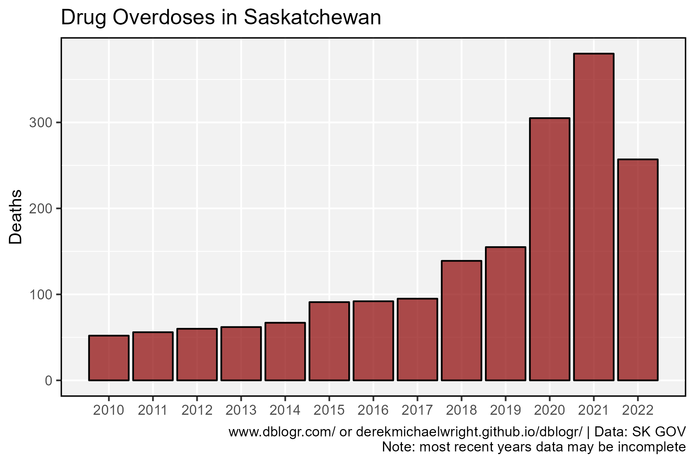

```{r}
mp <- ggplot(d1, aes(x = Year, y = Accident)) +
  geom_bar(stat = "identity", color = "black", 
           fill = "darkred", alpha = 0.7) +
  scale_x_continuous(breaks = 2010:max(d1$Year), 
                     minor_breaks = 2010:max(d1$Year)) +
  theme_agData() +
  labs(title = "Drug Overdoses in Saskatchewan", 
       y = "Deaths", x = NULL, caption = myCaption)
ggsave("saskatchewan_overdoses_01.png", mp, width = 6, height = 4)
```

---

# Meth Related Drug Overdoses

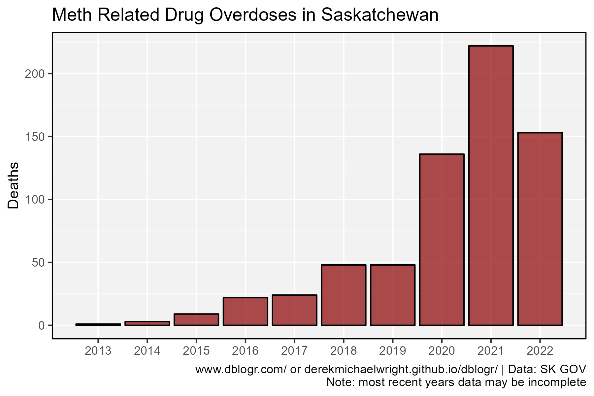

```{r}
mp <- ggplot(d2, aes(x = Year, y = Deaths)) +
  geom_bar(stat = "identity", color = "black", 
           fill = "darkred", alpha = 0.7) +
  scale_x_continuous(breaks = 2013:max(d2$Year),
                     minor_breaks = 2013:max(d2$Year)) +
  theme_agData() +
  labs(title = "Meth Related Drug Overdoses in Saskatchewan", 
       y = "Deaths", x = NULL, caption = myCaption)
ggsave("saskatchewan_overdoses_02.png", mp, width = 6, height = 4)
```

---

# By Sex


```{r}
# Prep data
xx <- d3 %>%
  group_by(Year, Sex) %>%
  summarise(Deaths = sum(Deaths))
# Plot
mp <- ggplot(xx, aes(x = Year, y = Deaths, fill = Sex)) +
  geom_bar(stat = "identity", position = "dodge", 
           color = "black", alpha = 0.7) +
  scale_fill_manual(name = NULL, values = myColorsMF) +
  scale_x_continuous(breaks = 2010:max(xx$Year),
                     minor_breaks = 2010:max(xx$Year)) +
  theme_agData(legend.position = "bottom") +
  labs(title = "Drug Overdoses in Saskatchewan", 
       x = NULL, caption = myCaption)
ggsave("saskatchewan_overdoses_03.png", mp, width = 6, height = 4)
```

```{r echo = F}
ggsave("featured.png", mp, width = 6, height = 4)
```

---

# Age Group

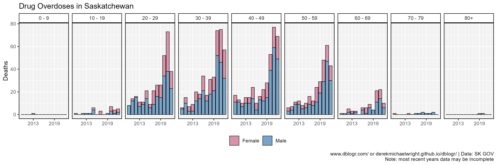

```{r}
mp <- ggplot(d3, aes(x = Year, y = Deaths, fill = Sex)) +
  geom_bar(stat = "identity", color = "black", lwd = 0.3, alpha = 0.7) +
  facet_grid(. ~ `Age Group`) +
  scale_x_continuous(breaks = c(2013, 2019), 
                     minor_breaks = 2010:max(d3$Year)) +
  scale_fill_manual(name = NULL, values = myColorsMF) +
  theme_agData(legend.position = "bottom") +
  labs(title = "Drug Overdoses in Saskatchewan", 
       x = NULL, caption = myCaption)
ggsave("saskatchewan_overdoses_04.png", mp, width = 12, height = 4)
```

---

## By Sex

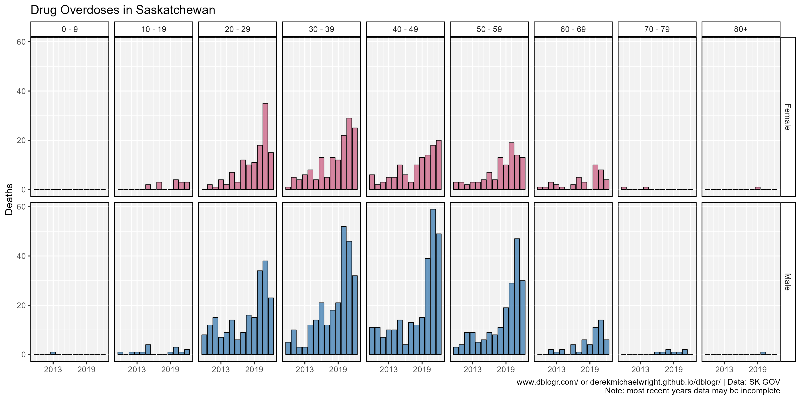

```{r}
mp <- ggplot(d3, aes(x = Year, y = Deaths, fill = Sex)) +
  geom_bar(stat = "identity", position = "dodge", 
           color = "black", lwd = 0.3, alpha = 0.8) +
  facet_grid(Sex ~ `Age Group`) +
  scale_x_continuous(breaks = c(2013, 2019), 
                     minor_breaks = 2010:max(d3$Year)) +
  scale_fill_manual(name = NULL, values = myColorsMF) +
  theme_agData(legend.position = "none") +
  labs(title = "Drug Overdoses in Saskatchewan", 
       x = NULL, caption = myCaption)
ggsave("saskatchewan_overdoses_05.png", mp, width = 12, height = 6)
```

---

## Animation

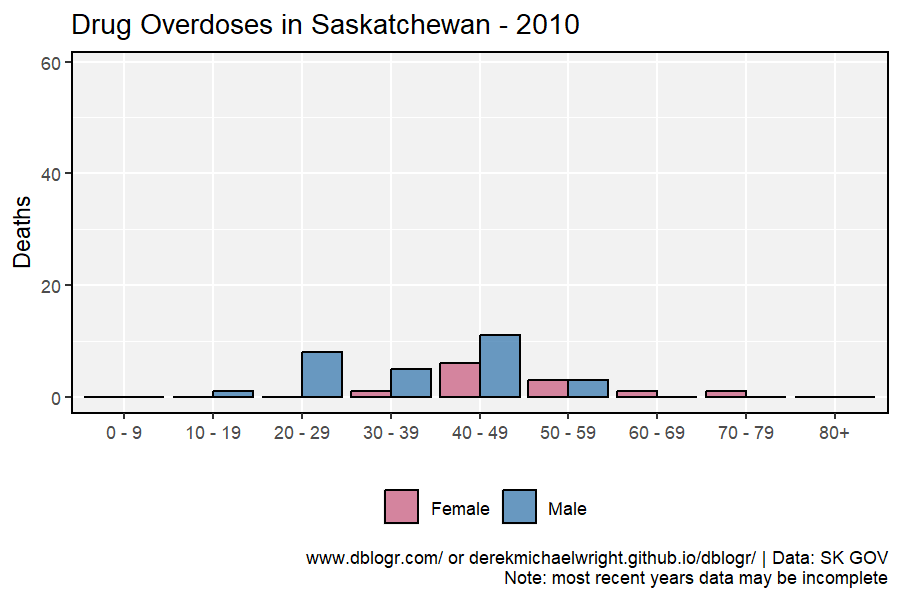

```{r}
mp <- ggplot(d3, aes(x = `Age Group`, y = Deaths, fill = Sex)) +
  geom_bar(stat = "identity", position = "dodge", 
           color = "black", alpha = 0.8) +
  scale_fill_manual(name = NULL, values = myColorsMF) +
  theme_agData(legend.position = "bottom") +
  labs(title = "Drug Overdoses in Saskatchewan - {round(frame_time)}",
       x = NULL, caption = myCaption) +
  transition_time(Year)
anim_save("saskatchewan_overdoses_gif_01.gif", mp, 
          nframes = 300, fps = 30, end_pause = 30, 
          width = 900, height = 600, res = 150)
```

---

## 2021

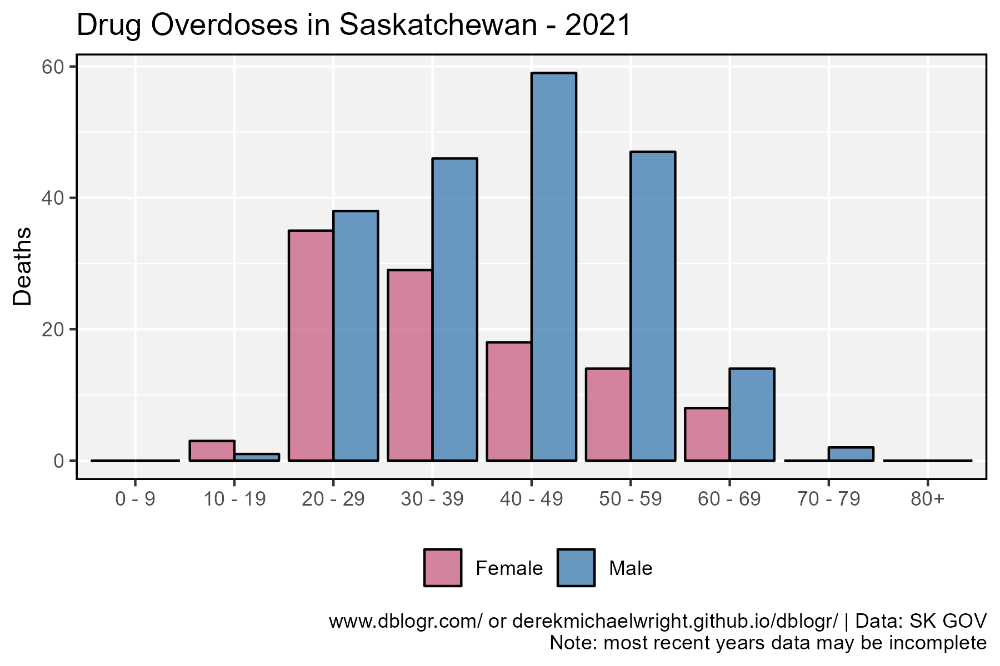

```{r}
mp <- ggplot(d3 %>% filter(Year == 2021), 
             aes(x = `Age Group`, y = Deaths, fill = Sex)) +
  geom_bar(stat = "identity", position = "dodge",
           color = "black", alpha = 0.8) +
  scale_fill_manual(name = NULL, values = myColorsMF) +
  theme_agData(legend.position = "bottom") +
  labs(title = "Drug Overdoses in Saskatchewan - 2021", 
       x = NULL, caption = myCaption)
ggsave("saskatchewan_overdoses_06.png", mp, width = 6, height = 4)
```

---

## 2010 - 2015 - 2019 - 2020

### By Year

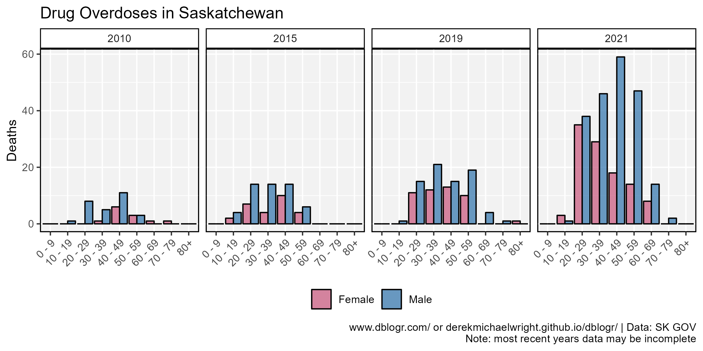

```{r}
mp <- ggplot(d3 %>% filter(Year %in% c(2010,2015,2019,2021)), 
             aes(x = `Age Group`, y = Deaths, fill = Sex)) +
  geom_bar(stat = "identity", position = "dodge",
           color = "black", alpha = 0.8) +
  facet_grid(. ~ Year) +
  scale_fill_manual(name = NULL, values = myColorsMF) +
  theme_agData(legend.position = "bottom",
               axis.text.x = element_text(angle = 45, hjust = 1)) +
  labs(title = "Drug Overdoses in Saskatchewan", 
       x = NULL, caption = myCaption)
ggsave("saskatchewan_overdoses_07.png", mp, width = 8, height = 4)
```

---

### By Sex


```{r}
# Prep data
xx <- d3 %>% filter(Year %in% c(2010, 2015, 2019, 2021))
myColors <- c(alpha("darkred",0.1), alpha("darkred",0.3), 
              alpha("darkred",0.6), alpha("darkred",0.9))
# Plot
mp <- ggplot(xx, aes(x = `Age Group`, y = Deaths, fill = factor(Year))) +
  geom_bar(stat = "identity", position = "dodge",
           color = "black") +
  facet_grid(. ~ Sex) +
  scale_fill_manual(name = NULL, values = myColors) +
  theme_agData(legend.position = "bottom",
               axis.text.x = element_text(angle = 45, hjust = 1)) +
  labs(title = "Drug Overdoses in Saskatchewan", 
       x = NULL, caption = myCaption)
ggsave("saskatchewan_overdoses_08.png", mp, width = 8, height = 4)
```

---

# By Race

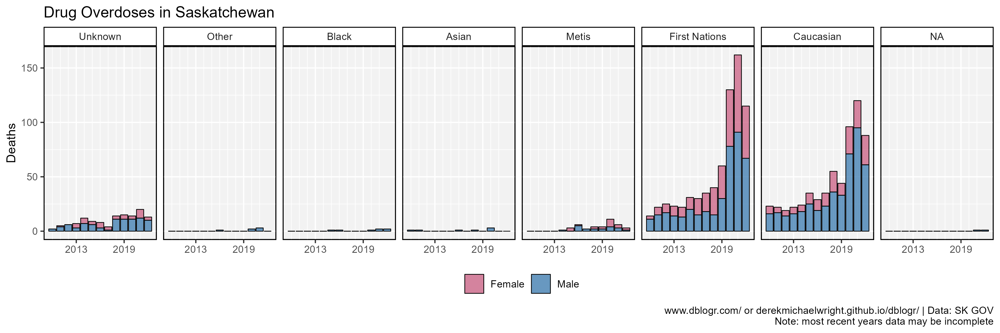

```{r}
mp <- ggplot(d4, aes(x = Year, y = Deaths, fill = Sex)) +
  geom_bar(stat = "identity", color = "black", lwd = 0.3, alpha = 0.8) +
  facet_grid(. ~ Race) +
  scale_x_continuous(breaks = c(2013, 2019), minor_breaks = 2010:2021) +
  scale_fill_manual(name = NULL, values = myColorsMF) +
  theme_agData(legend.position = "bottom") +
  labs(title = "Drug Overdoses in Saskatchewan", 
       x = NULL, caption = myCaption)
ggsave("saskatchewan_overdoses_09.png", mp, width = 12, height = 4)
```

---

## By Sex

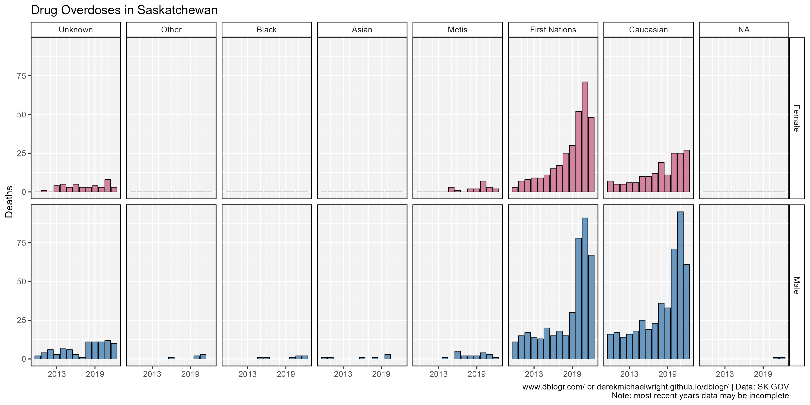

```{r}
mp <- ggplot(d4, aes(x = Year, y = Deaths, fill = Sex)) +
  geom_bar(stat = "identity", position = "dodge", 
           color = "black", lwd = 0.3, alpha = 0.8) +
  facet_grid(Sex ~ Race) +
  scale_x_continuous(breaks = c(2013, 2019), minor_breaks = 2010:2021) +
  scale_fill_manual(name = NULL, values = myColorsMF) +
  theme_agData(legend.position = "none") +
  labs(title = "Drug Overdoses in Saskatchewan", 
       x = NULL, caption = myCaption)
ggsave("saskatchewan_overdoses_10.png", mp, width = 12, height = 6)
```

---

## 2020

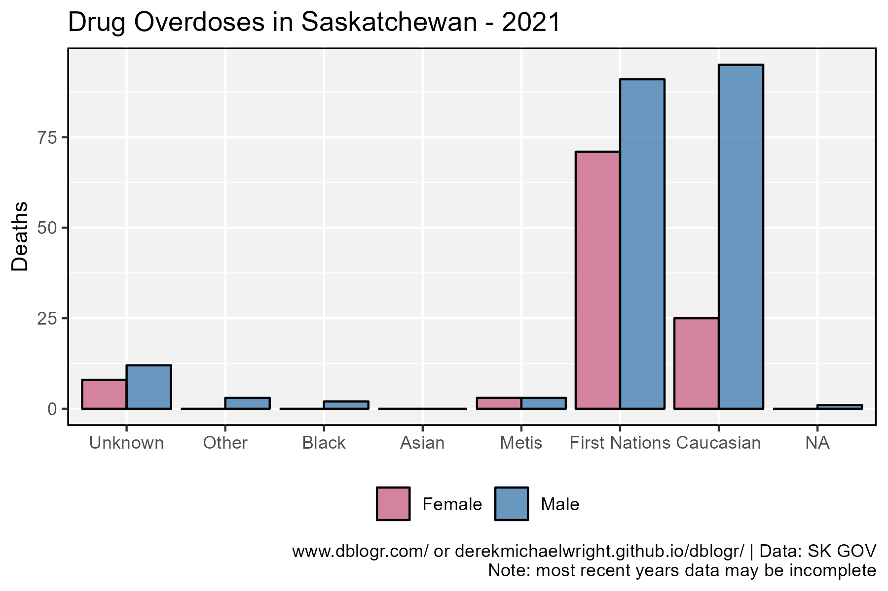

```{r}
mp <- ggplot(d4%>% filter(Year == 2021), 
             aes(x = Race, y = Deaths, fill = Sex)) +
  geom_bar(stat = "identity", position = "dodge",
           color = "black", alpha = 0.8) +
  scale_fill_manual(name = NULL, values = myColorsMF) +
  theme_agData(legend.position = "bottom") +
  labs(title = "Drug Overdoses in Saskatchewan - 2021", 
       x = NULL, caption = myCaption)
ggsave("saskatchewan_overdoses_11.png", mp, width = 6, height = 4)
```

---

## Animation

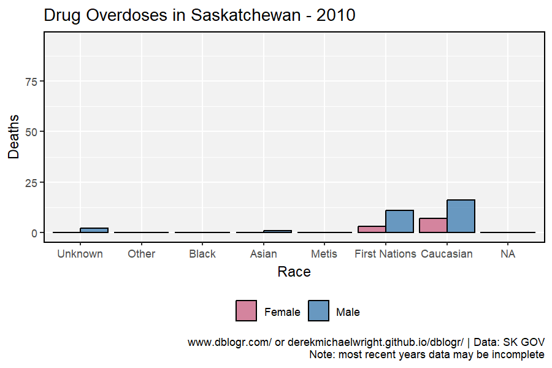

```{r}
mp <- ggplot(d4, aes(x = Race, y = Deaths, fill = Sex)) +
  geom_bar(stat = "identity", position = "dodge", 
           color = "black", alpha = 0.8) +
  scale_fill_manual(name = NULL, values = myColorsMF) +
  theme_agData(legend.position = "bottom") +
  labs(title = "Drug Overdoses in Saskatchewan - {round(frame_time)}",
       caption = myCaption) +
  transition_time(Year)
anim_save("saskatchewan_overdoses_gif_02.gif", mp, 
          nframes = 300, fps = 30, end_pause = 30, 
          width = 900, height = 600, res = 150)
```

---

## 2010 - 2015 - 2019 - 2021


```{r}
# Prep data
xx <- d4 %>% filter(Year %in% c(2010, 2015, 2019, 2021),
                    Race %in% c("First Nations", "Caucasian"))
myColors <- c(alpha("darkred",0.1), alpha("darkred",0.3),
              alpha("darkred",0.6), alpha("darkred",0.9))
# Plot
mp <- ggplot(xx, aes(x = Race, y = Deaths, fill = factor(Year))) +
  geom_bar(stat = "identity", position = "dodge",
           color = "black") +
  facet_grid(. ~ Sex) +
  scale_fill_manual(name = NULL, values = myColors) +
  theme_agData(legend.position = "bottom") +
  labs(title = "Drug Overdoses in Saskatchewan - 2010 vs. 2019 vs. 2021", 
       x = NULL, caption = myCaption)
ggsave("saskatchewan_overdoses_12.png", mp, width = 6, height = 4)
```

---

# Rate

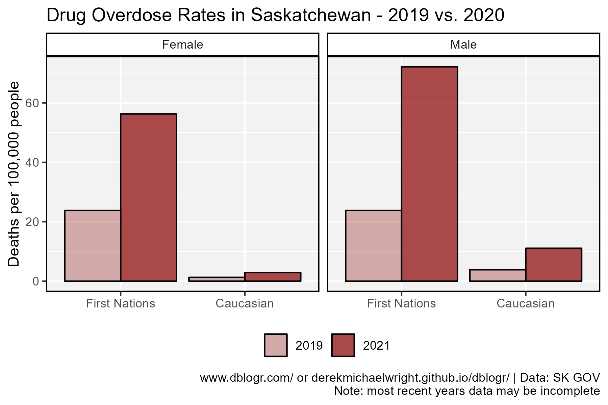

```{r}
# Prep data
pop_FN <- agData_STATCAN_Population %>% 
  filter(Area == "Saskatchewan", Month == 1, Year == 2021) %>% 
  pull(Value) * 0.107
pop_CN <- agData_STATCAN_Population %>% 
  filter(Area == "Saskatchewan", Month == 1, Year == 2021) %>% 
  pull(Value) * 0.728
xx <- d4 %>% 
  filter(Year %in% c(2019, 2021),
         Race %in% c("First Nations", "Caucasian")) %>%
  mutate(Rate = ifelse(Race == "Caucasian", 
                       Deaths / pop_CN * 100000, 
                       Deaths / pop_FN * 100000))
myColors <- c(alpha("darkred",0.3), alpha("darkred",0.7))
# Plot
mp <- ggplot(xx, aes(x = Race, y = Rate, fill = factor(Year))) +
  geom_bar(stat = "identity", position = "dodge",
           color = "black") +
  facet_grid(. ~ Sex) +
  scale_fill_manual(name = NULL, values = myColors) +
  theme_agData(legend.position = "bottom") +
  labs(title = "Drug Overdose Rates in Saskatchewan - 2019 vs. 2020", 
       y = "Deaths per 100,000 people", x = NULL, caption = myCaption)
ggsave("saskatchewan_overdoses_13.png", mp, width = 6, height = 4)
```

---

# Fold Increase


```{r}
# Prep data
xx <- d4 %>% 
  filter(Year %in% c(2010, 2019, 2021),
         Race %in% c("First Nations", "Caucasian")) %>%
  spread(Year, Deaths) %>%
  mutate(`2021 / 2010` = `2021` / `2010`,
         `2021 / 2019` = `2021` / `2019`) %>%
  gather(Trait, Value, `2021 / 2010`, `2021 / 2019`)
# Plot
mp <- ggplot(xx, aes(x = Race, y = Value, fill = Sex)) +
  geom_bar(stat = "identity", position = "dodge",
           color = "black", alpha = 0.7) +
  facet_wrap(. ~ Trait, scales = "free_y") +
  scale_fill_manual(name = NULL, values = myColorsMF) +
  scale_y_continuous(minor_breaks = 0:18) +
  theme_agData(legend.position = "bottom") +
  labs(title = "Drug Overdoses in Saskatchewan - 2019 vs. 2020", 
       y = "Fold Increase", x = NULL, caption = myCaption)
ggsave("saskatchewan_overdoses_14.png", mp, width = 6, height = 4)
```

---

```{r echo = F, eval = F}
# https://healthanalytics.alberta.ca/SASVisualAnalytics/?reportUri=%2Freports%2Freports%2F1bbb695d-14b1-4346-b66e-d401a40f53e6&sectionIndex=0&sso_guest=true&reportViewOnly=true&reportContextBar=false&sas-welcome=false
```
