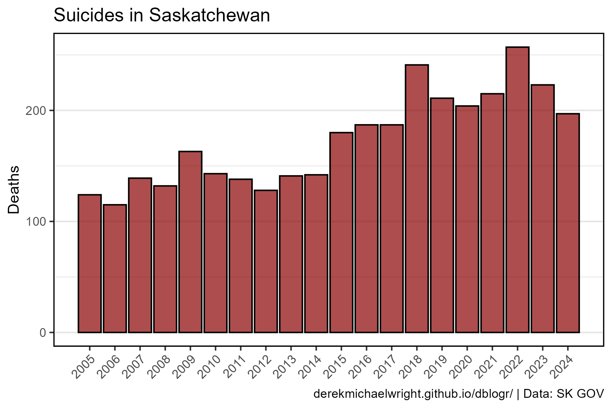
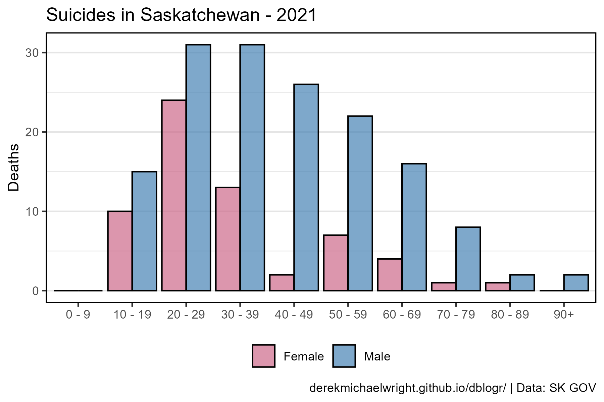
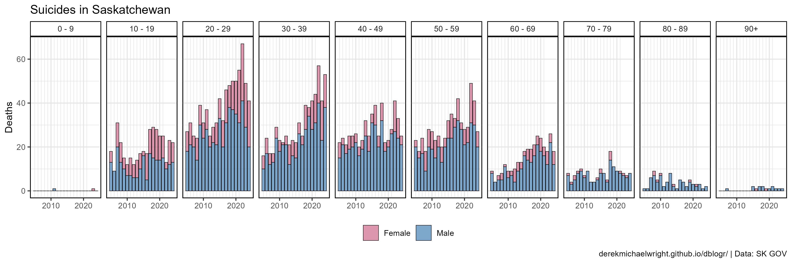
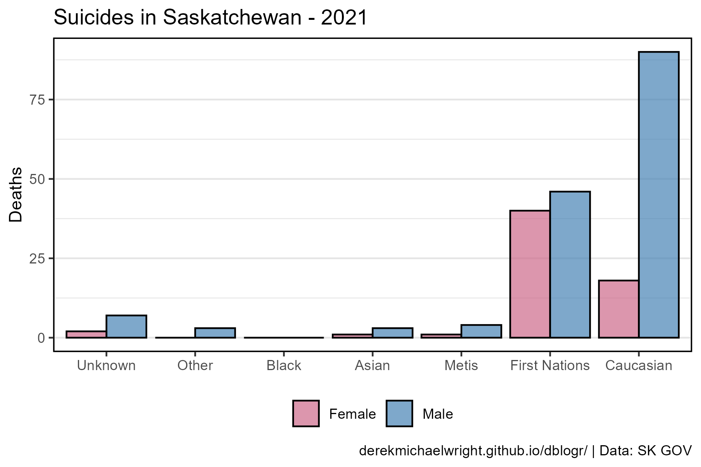
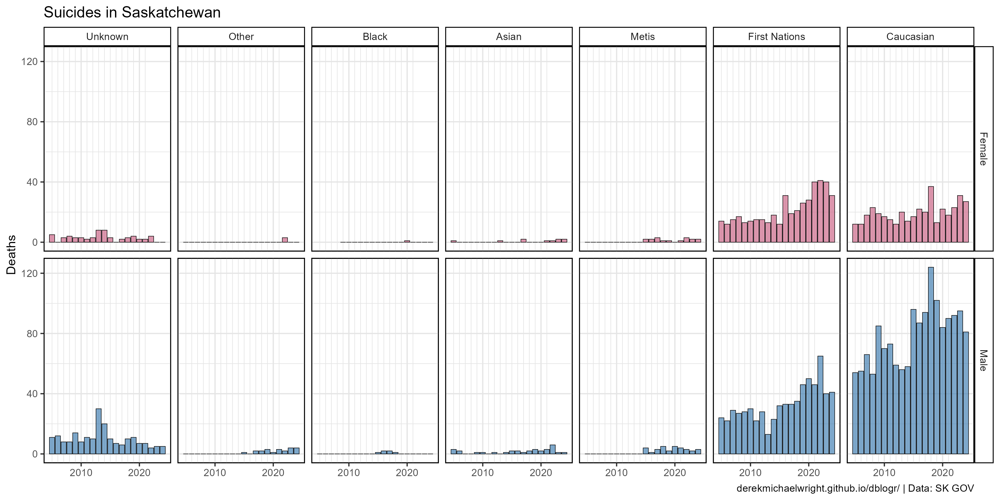

```{r setup, include=FALSE}
knitr::opts_chunk$set(echo = T, message = F, warning = F)
```

---

# Data

Government of Saskatchewan Death Statistics

> - `r shiny::icon("globe")` [https://publications.saskatchewan.ca/#/categories/2179](https://publications.saskatchewan.ca/#/categories/2179){target="_blank"}
> - `r shiny::icon("save")` [data_saskatchewan_suicides.xlsx](data_saskatchewan_suicides.xlsx)

---

# Prepare Data

```{r class.source = "fold-show"}
# devtools::install_github("derekmichaelwright/agData")
library(agData)
library(readxl) # read_xlsx()
library(gganimate)
```

```{r}
# Prep data
myCaption <- "derekmichaelwright.github.io/dblogr/ | Data: SK GOV"
myColors <- c("palevioletred3", "steelblue")
d1 <- read_xlsx("data_saskatchewan_suicides.xlsx", "Age") %>%
  gather(Year, Deaths, 3:ncol(.)) %>% 
  mutate(Year = as.numeric(Year))
myRaces <- c("Unknown", "Other", "Black", "Asian",
             "Metis","First Nations", "Caucasian")
d2 <- read_xlsx("data_saskatchewan_suicides.xlsx", "Race") %>%
  gather(Year, Deaths, 3:ncol(.)) %>% 
  mutate(Year = as.numeric(Year),
         Race = factor(Race, levels = myRaces))
```

---

# Total Suicides



```{r}
# Prep data
xx <- d1 %>% group_by(Year) %>%
  summarise(Deaths = sum(Deaths))
# Plot
mp <- ggplot(xx, aes(x = Year, y = Deaths)) +
  geom_bar(stat = "identity", fill = "darkred", color = "black", alpha = 0.7) +
  scale_x_continuous(breaks = 2005:max(xx$Year)) + 
  theme_agData_col(axis.text.x = element_text(angle = 45, hjust = 1)) +
  labs(title = "Suicides in Saskatchewan", 
       x = NULL, caption = myCaption)
ggsave("saskatchewan_suicides_01.png", mp, width = 6, height = 4)
```

---

# By Age {.tabset .tabset-pills}

## 2021



```{r}
mp <- ggplot(d1 %>% filter(Year == 2021), 
             aes(x = Age, y = Deaths, fill = Sex)) +
  geom_bar(stat = "identity", position = "dodge",
           color = "black", alpha = 0.7) +
  scale_fill_manual(name = NULL, values = myColors) +
  theme_agData_col(legend.position = "bottom") +
  labs(title = "Suicides in Saskatchewan - 2021", 
       x = NULL, caption = myCaption)
ggsave("saskatchewan_suicides_02.png", mp, width = 6, height = 4)
```

```{r echo = F}
ggsave("featured.png", mp, width = 6, height = 4)
```

---

## All Data



```{r}
mp <- ggplot(d1, aes(x = Year, y = Deaths, fill = Sex)) +
  geom_bar(stat = "identity", color = "black", lwd = 0.2, alpha = 0.7) +
  facet_grid(. ~ Age) +
  scale_x_continuous(breaks = c(2010, 2020), minor_breaks = 2005:2021) +
  scale_fill_manual(name = NULL, values = myColors) +
  theme_agData(legend.position = "bottom") +
  labs(title = "Suicides in Saskatchewan", 
       x = NULL, caption = myCaption)
ggsave("saskatchewan_suicides_03.png", mp, width = 12, height = 4)
```

---

## By Sex


```{r}
mp <- ggplot(d1, aes(x = Year, y = Deaths, fill = Sex)) +
  geom_bar(stat = "identity", color = "black", lwd = 0.2, alpha = 0.7) +
  facet_grid(Sex ~ Age) +
  scale_x_continuous(breaks = c(2010, 2020), minor_breaks = 2005:2021) +
  scale_fill_manual(name = NULL, values = myColors) +
  theme_agData(legend.position = "none") +
  labs(title = "Suicides in Saskatchewan", 
       x = NULL, caption = myCaption)
ggsave("saskatchewan_suicides_04.png", mp, width = 12, height = 6)
```

```{r eval = F, echo = F}
## Animation

#
mp <- ggplot(d1, aes(x = Age, y = Deaths, fill = Sex)) +
  geom_bar(stat = "identity", position = "dodge", 
           color = "black", alpha = 0.7) +
  scale_fill_manual(name = NULL, values = myColors) +
  theme_agData(legend.position = "bottom") +
  labs(title = "Suicides in Saskatchewan - {round(frame_time)}",
       caption = myCaption) +
  transition_time(Year)
anim_save("saskatchewan_suicides_gif_01.gif", mp, 
          nframes = 600, fps = 25, end_pause = 60, 
          width = 900, height = 600, res = 150, units = "px")
```

---

# By Race {.tabset .tabset-pills}

## 2021



```{r}
mp <- ggplot(d2 %>% filter(Year == 2021), 
             aes(x = Race, y = Deaths, fill = Sex)) +
  geom_bar(stat = "identity", position = "dodge",
           color = "black", alpha = 0.7) +
  scale_fill_manual(name = NULL, values = myColors) +
  theme_agData_col(legend.position = "bottom") +
  labs(title = "Suicides in Saskatchewan - 2021", 
       x = NULL, caption = myCaption)
ggsave("saskatchewan_suicides_05.png", mp, width = 6, height = 4)
```

---


## All Data


```{r}
mp <- ggplot(d2, aes(x = Year, y = Deaths, fill = Sex)) +
  geom_bar(stat = "identity", color = "black", lwd = 0.2, alpha = 0.7) +
  facet_grid(. ~ Race) +
  scale_x_continuous(breaks = c(2010, 2020), minor_breaks = 2005:2021) +
  scale_fill_manual(name = NULL, values = myColors) +
  theme_agData(legend.position = "bottom") +
  labs(title = "Suicides in Saskatchewan", 
       x = NULL, caption = myCaption)
ggsave("saskatchewan_suicides_06.png", mp, width = 12, height = 4)
```

---

## By Sex



```{r}
mp <- ggplot(d2, aes(x = Year, y = Deaths, fill = Sex)) +
  geom_bar(stat = "identity", color = "black", lwd = 0.2, alpha = 0.7) +
  facet_grid(Sex ~ Race) +
  scale_x_continuous(breaks = c(2010, 2020), minor_breaks = 2005:2021) +
  scale_fill_manual(name = NULL, values = myColors) +
  theme_agData(legend.position = "none") +
  labs(title = "Suicides in Saskatchewan", 
       x = NULL, caption = myCaption)
ggsave("saskatchewan_suicides_07.png", mp, width = 12, height = 6)
```

---
