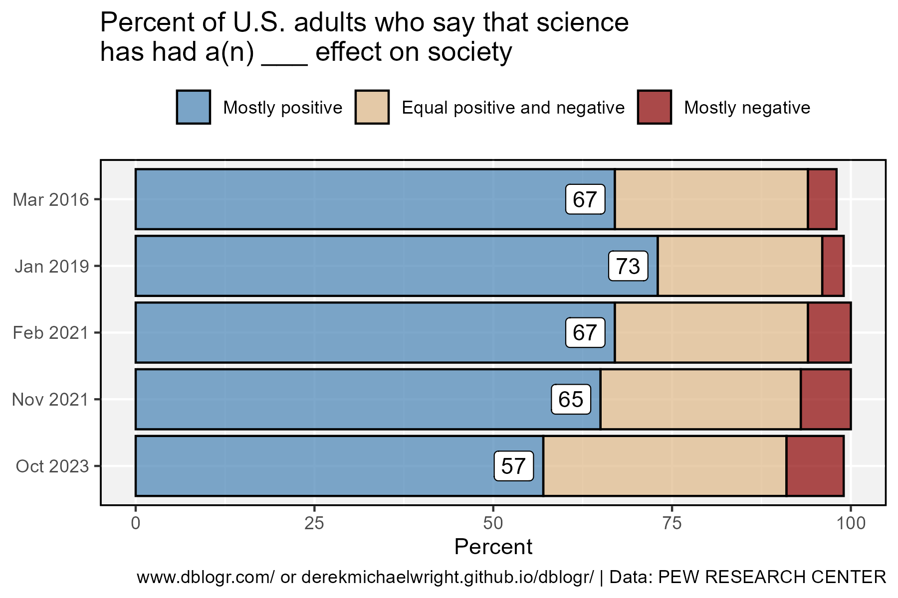

```{r setup, include=FALSE}
knitr::opts_chunk$set(echo = TRUE, message = F, warning = F)
```

---

# Data

> - `r shiny::icon("globe")` [https://www.pewresearch.org/science/](https://www.pewresearch.org/science/2023/11/14/americans-trust-in-scientists-positive-views-of-science-continue-to-decline/){target="_blank"}
> - `r shiny::icon("save")` [data_science_trust.xlsx](data_science_trust.xlsx)

---

# Prepare Data

```{r class.source = "fold-show"}
# devtools::install_github("derekmichaelwright/agData")
library(agData)
library(readxl)
```

```{r}
#Prep data
myCaption <- "derekmichaelwright.github.io/dblogr/ | Data: PEW RESEARCH CENTER"
#
d1 <- read_xlsx("data_science_trust.xlsx", "Effect on Society") %>%
  mutate(Date = paste(Month, Year)) %>%
  mutate(Date = factor(Date, levels = rev(unique(.$Date))),
         Response = factor(Response, levels = rev(unique(.$Response))))
#
d2 <- read_xlsx("data_science_trust.xlsx", "Trust") %>%
  mutate(Date = paste(Month, Year)) %>%
  mutate(Date = factor(Date, levels = unique(.$Date)))
```

---

# Science & Society



```{r}
# Plot
mp <- ggplot(d1, aes(x = Date, y = Percent, label = Percent)) + 
  geom_col(aes(fill = Response), color = "black", alpha = 0.7) +
  geom_label(data = d1%>%filter(Response=="Mostly positive"), hjust = 1.25) +
  scale_fill_manual(name = NULL, guide = guide_legend(reverse = T),
                    values = c("darkred", "burlywood", "steelblue")) +
  coord_flip() +
  theme_agData(legend.position = "top") +
  labs(title = "Percent of U.S. adults who say that science\nhas had a(n) ___ effect on society",
       y = "Percent", x = NULL, caption = myCaption)
ggsave("science_trust_01.png", mp, width = 6, height = 4)
```

---

# Trust In Science


```{r}
# Plot
mp <- ggplot(d2, aes(x = Date, y = Percent, label = Percent)) + 
  geom_col(aes(fill = Response), color = "black", alpha = 0.7) +
  geom_label(data = d2%>%filter(Response=="A great deal"), vjust = 1.25) +
  geom_label(data = d2%>%filter(Response=="Not too much/None at all"), vjust = -0.25) + 
  scale_fill_manual(name = NULL, values = c("darkred", "burlywood", "steelblue")) +
  theme_agData() +
  labs(title = "Percent of U.S. adults who have ___ of confidence in scientists\nto act in the best interest of the public",
       y = "Percent", x = NULL, caption = myCaption)
ggsave("science_trust_02.png", mp, width = 8, height = 4)
```

```{r echo = F}
ggsave("featured.png", mp, width = 8, height = 4)
```

---
