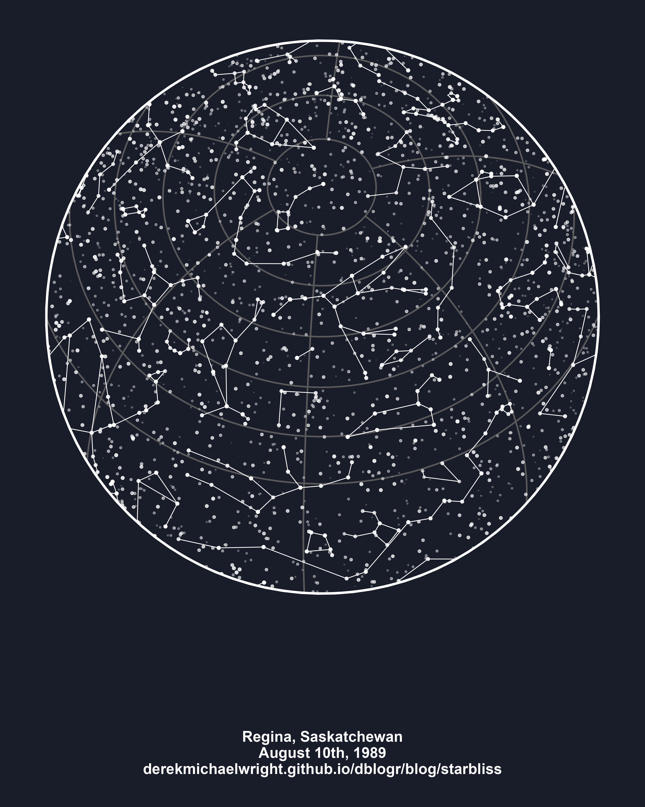

```{r setup, include=FALSE}
knitr::opts_chunk$set(echo = TRUE, message = F, warning = F)
```

---

# Introduction

`r shiny::icon("github")` https://github.com/benyamindsmith/starBliss

`r shiny::icon("code")` https://benyamindsmith.shinyapps.io/starBlissGUI/

```{r class.source = 'fold-show'}
# devtools::install_github("benyamindsmith/starBliss")
library(starBliss)
library(ggplot2)
```

---

# Regina 1989-08-10



```{r}
mp <- plot_starmap(location = "Regina, SK, Canada",
                   date = "1989-08-10",
                   style = "black",
                   line1_text = "Regina, Saskatchewan",
                   line2_text = "August 10th, 1989",
                   line3_text = "derekmichaelwright.github.io/dblogr/")
ggsave("starbliss_regina_1989-08-10.png", mp, width = 12, height = 15)
```

```{r echo = F}
#line3_text="43.6532° N, 79.3832° W"
ggsave("featured.png", mp, width = 12, height = 15)
```

---
