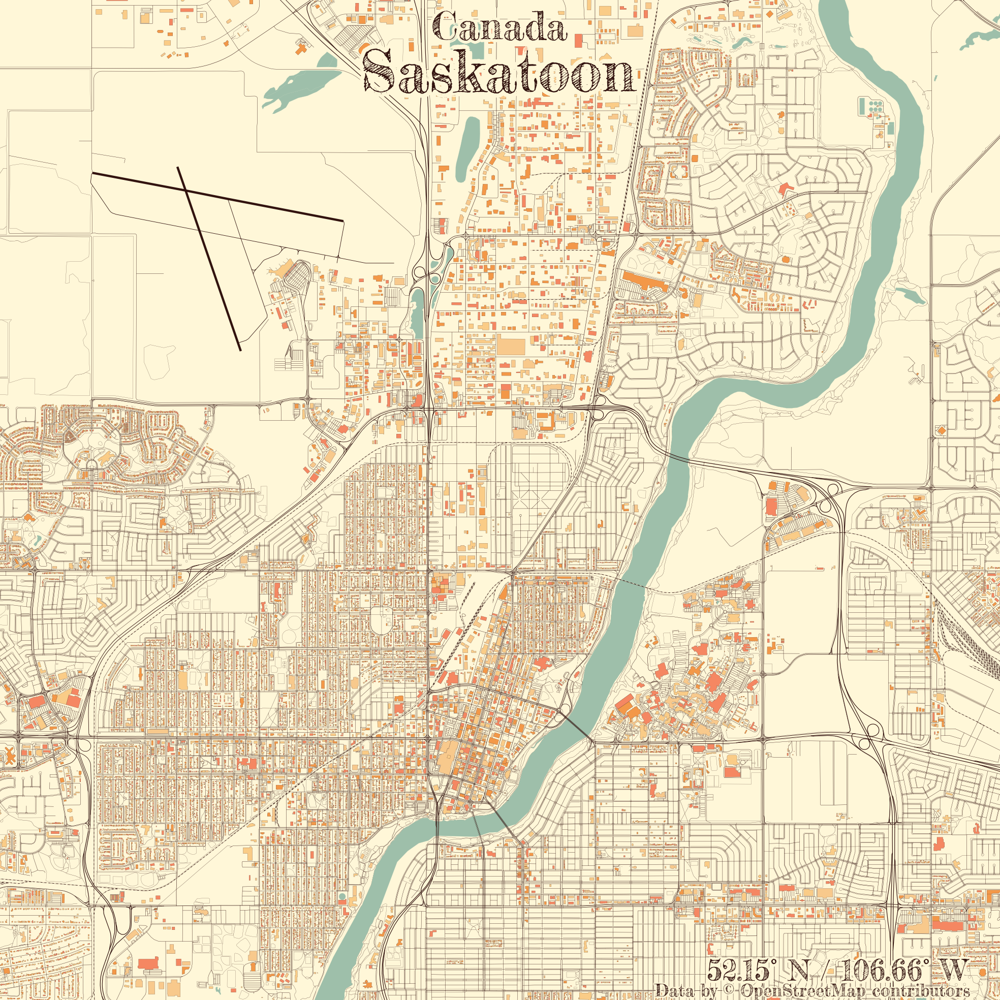

```{r setup, include = FALSE}
knitr::opts_chunk$set(echo = T, message = F, warning = F)
```

---

# Data {.tabset .tabset-pills}

## STATCAN road network files

> - `r shiny::icon("globe")` [https://www12.statcan.gc.ca/census-recensement/2011/geo/RNF-FRR/index-2011-eng.cfm?year=16](https://www12.statcan.gc.ca/census-recensement/2011/geo/RNF-FRR/index-2011-eng.cfm?year=16){target="_blank"}

## Germany rail roads

> - `r shiny::icon("globe")` [https://mapcruzin.com/free-germany-arcgis-maps-shapefiles.htm](https://mapcruzin.com/free-germany-arcgis-maps-shapefiles.htm){target="_blank"}

## My shape files

> - `r shiny::icon("github")` [https://github.com/derekmichaelwright/dblogr/tree/master/content/dblogr/street_maps](https://github.com/derekmichaelwright/dblogr/tree/master/content/dblogr/street_maps){target="_blank"}

---

# Prepare Data

```{r class.source = "fold-show"}
# Load libraries
library(tidyverse)
library(sf)
myCaption <- "derekmichaelwright.github.io/dblogr/blog/street_maps"
```

```{r eval = F}
# STATCAN file
roads <- st_read("lrnf000r16a_e.shp")
# Filter cities
roads_saskatoon <- roads[roads$CSDNAME_L == "Saskatoon",]
roads_regina    <- roads[roads$CSDNAME_L == "Regina",]
# Save
st_write(roads_saskatoon, "roads_saskatoon.shp")
st_write(roads_regina,    "roads_regina.shp")
#
s_roads <- st_read("railways.shp")
```

---

# Maps {.tabset .tabset-pills}

## Saskatoon


```{r}
# Read file
s_roads <- st_read("roads_saskatoon.shp", quiet = T) 
# Crop
s_roads2 <- st_intersection(s_roads, st_buffer(st_centroid(st_union(s_roads)), 8500))
# Plot
mp <- ggplot(s_roads2) +
  geom_sf(color = "black") +
  coord_sf(crs = st_crs(4326)) +
  theme_void() +
  theme(panel.grid.major = element_line("transparent")) +
  labs(caption = myCaption)
ggsave("roads_saskatoon.png", mp, bg = "transparent", width = 6, height = 6)
```

---


```{r}
# Crop
s_roads2 <- st_intersection(s_roads, st_buffer(st_centroid(st_union(s_roads)), 4000))
# Plot
mp <- ggplot(s_roads2) +
  geom_sf(color = "black") +
  coord_sf(crs = st_crs(4326)) +
  theme_void() +
  theme(panel.grid.major = element_line("transparent")) +
  labs(caption = myCaption)
ggsave("roads_saskatoon_zoom.png", mp, bg = "transparent", width = 6, height = 6)
```

```{r echo = F}
ggsave("featured.png", mp, bg = "transparent", width = 6, height = 6)
```

---

## Regina


```{r}
# Read file
r_roads <- st_read("roads_regina.shp", quiet = T) 
# Crop
r_roads2 <- st_intersection(r_roads, st_buffer(st_centroid(st_union(r_roads)), 5000))
# Plot
mp <- ggplot(r_roads2) +
  geom_sf(color = "black") +
  coord_sf(crs = st_crs(4326)) +
  theme_void() +
  theme(panel.grid.major = element_line("transparent")) +
  labs(caption = myCaption)
ggsave(filename = "roads_regina.png", mp, bg = "transparent", width = 6, height = 6)
```

---

## Germany Railroads


```{r}
# Read file
rail_roads <- st_read("railways.shp", quiet = T) 
# Plot
mp <- ggplot(rail_roads) +
  geom_sf(color = "black") +
  coord_sf(crs = st_crs(4326)) +
  theme_void() +
  theme(panel.grid.major = element_line("transparent")) +
  labs(caption = myCaption)
ggsave("railroads_germany.png", mp, bg = "transparent", width = 6, height = 6)
```

---

# rcityviews {.tabset .tabset-pills}

https://koenderks.github.io/rcityviews/

```{r}
library(rcityviews)
```

## Saskatoon



```{r eval = F}
#
xx <- list_cities()
xx <- list_cities(match = "Saskatoon")
#
mp <- cityview(name = "Saskatoon", zoom = 0.5)
#
ggsave("Saskatoon.png", mp, height = 5, width = 5, dpi = 100)
```

---

## Fort Qu'Appelle


```{r}
#
mp <- cityview(name = "Fort Qu'Appelle", zoom = 0.5)
#
ggsave("FortQuAppelle.png", mp, height = 5, width = 5, dpi = 100)
```

---

## Lebret


```{r}
#
city <- new_city(name = "Lebret", country = "Canada", lat = 50.7, long = 103.7)
#
mp <- cityview(name = city, zoom = 0.5)
#
ggsave("Lebret.png", mp, height = 5, width = 5, dpi = 100)
```

---

# rgeedim

https://github.com/brownag/rgeedim

---
