```{r setup, include=FALSE}
knitr::opts_chunk$set(echo = TRUE, message = F, warning = F)
```

---

# Data

CDC - Weekly deaths

> - `r shiny::icon("globe")` [https://www.cdc.gov/nchs/nvss/vsrr/covid19/excess_deaths.htm#dashboard](https://www.cdc.gov/nchs/nvss/vsrr/covid19/excess_deaths.htm#dashboard){target="_blank"}
> - `r shiny::icon("save")` [data_usa_deaths.csv](data_usa_deaths.csv)

USCB - State Population

> - `r shiny::icon("globe")` [https://www.census.gov/data/tables/time-series/demo/popest/2010s-state-total.html](https://www.census.gov/data/tables/time-series/demo/popest/2010s-state-total.html){target="_blank"}
> - `r shiny::icon("save")` [data_usa_population.csv](data_usa_population.csv)

CDC - Age & sex tables

> - `r shiny::icon("globe")` [https://www.census.gov/topics/population/age-and-sex/data/tables.html](https://www.census.gov/topics/population/age-and-sex/data/tables.html){target="_blank"}
> - `r shiny::icon("save")` [data_usa_population.xlsx](data_usa_population.xlsx)

USCB

> - `r shiny::icon("globe")` [https://www.census.gov/library/visualizations/interactive/how-has-our-nations-population-changed.html](https://www.census.gov/library/visualizations/interactive/how-has-our-nations-population-changed.html){target="_blank"}

```{r, echo = F}
dd <- read.csv("https://data.cdc.gov/api/views/y5bj-9g5w/rows.csv?accessType=DOWNLOAD&bom=true&format=true%20target=")
write.csv(dd, "data_usa_deaths.csv", row.names = F)
```

---

# Prepare Data

```{r class.source = "fold-show"}
# devtools::install_github("derekmichaelwright/agData")
library(agData)
library(readxl)
```

```{r}
# Prep data
myCaption1 <- "derekmichaelwright.github.io/dblogr/blog/usa_deaths | Data: US CDC"
myCaption2 <- "derekmichaelwright.github.io/dblogr/blog/usa_deaths | Data: US CDC & USCB"
myColors <- c("darkgreen", "darkred", "darkorange", "steelblue", "darkblue", "purple4", "magenta3")
myAges1 <- c("Under 25 years", "25-44 years", "45-64 years", 
            "65-74 years", "75-84 years", "85 years and older")
myAges2 <- c("Under 5 years", "5 to 9 years", "10 to 14 years", 
             "15 to 19 years", "20 to 24 years", "25 to 29 years",
             "30 to 34 years", "35 to 39 years", "40 to 44 years",
             "45 to 49 years", "50 to 54 years", "55 to 59 years",
             "60 to 64 years", "65 to 69 years", "70 to 74 years",
             "75 to 79 years", "80 to 84 years", "85 years and over")
#
p1 <- read.csv("data_usa_population.csv") %>% 
  select(Area, Population=X2019) %>%
  mutate(Population = as.numeric(gsub(",","",Population)))
#
fixSheet <- function(xx, myYear) { 
  colnames(xx) <- c("Age", "Both sexes", "Both sexes - Percent",
                    "Males", "Males - Percent",
                    "Females", "Females - Percent")
  xx <- xx %>% select(Age, `Both sexes`, Males, Females) %>%
    mutate(Age = gsub("\\.", "", Age),
           Year = myYear) %>%
    select(Year, everything()) %>%
    gather(Sex, Population, 3:ncol(.)) %>%
    mutate(Population = 1000 * Population)
  xx
}
p2 <- bind_rows(
    read_xlsx("data_usa_population_age.xlsx", "2015", range = "A7:G25") %>% fixSheet(myYear = 2015),
    read_xlsx("data_usa_population_age.xlsx", "2016", range = "A7:G25") %>% fixSheet(myYear = 2016),
    read_xlsx("data_usa_population_age.xlsx", "2017", range = "A7:G25") %>% fixSheet(myYear = 2017),
    read_xlsx("data_usa_population_age.xlsx", "2018", range = "A7:G25") %>% fixSheet(myYear = 2018),
    read_xlsx("data_usa_population_age.xlsx", "2019", range = "A7:G25") %>% fixSheet(myYear = 2019),
    read_xlsx("data_usa_population_age.xlsx", "2020", range = "A7:G25") %>% fixSheet(myYear = 2020),
    read_xlsx("data_usa_population_age.xlsx", "2021", range = "A7:G25") %>% fixSheet(myYear = 2021),
    read_xlsx("data_usa_population_age.xlsx", "2022", range = "A7:G25") %>% fixSheet(myYear = 2022) ) %>%
  mutate(Age = factor(Age, levels = myAges2))
#
dd <- read.csv("data_usa_deaths.csv") %>%
  rename(Area=Jurisdiction, Date=Week.Ending.Date) %>%
  mutate(Date = as.Date(Date, format = "%m/%d/%Y"),
         Year = as.numeric(substr(Date, 1, 4)),
         Month = as.numeric(substr(Date, 6, 7)),
         Julian.Day = lubridate::yday(Date),
         Adj.Julian.Day = ifelse(Month < 8, Julian.Day + 365, Julian.Day),
         Age.Group = factor(Age.Group, levels = myAges1),
         Group = ifelse(Year < 2020, "<2020", Year),
         Group = factor(Group, levels = c("<2020", "2020", "2021", "2022", "2023"))) %>%
  arrange(Date)
#
mySeasons <- paste(2014:2023, 2015:2024, sep = "-")
myGroups <- c(rep("pre-2020",5), mySeasons[6:length(mySeasons)])
# Calculate Year Group
#i <- 4695
j <- 1
for(i in 1:nrow(dd)) {
  if(dd$Month[i] < 8) { mySwitch <- T }
  dd$Season[i] <- mySeasons[j]
  dd$Season.Group[i] <- myGroups[j]
  if(dd$Month[i] > 7 & mySwitch == T) { j <- j + 1; mySwitch <- F } 
}
dd <- dd %>% 
    mutate(Season = factor(Season, levels = mySeasons),
           Season.Group = factor(Season.Group, levels = unique(myGroups)))
```

---

# Weekly Deaths {.tabset .tabset-pills}

## Plotting Function

```{r class.source = "fold-show"}
# Create plotting function
ggWeeklyDeaths <- function(myArea = "United States") {
  # Prep data
  xmin <-  2015
  xmax <- max(dd$Year)
  vv <- as.Date(paste0(as.character(xmin:xmax),"-01-01"))
  xx <- dd %>% filter(Area == myArea, Year >= xmin, Type == "Unweighted") %>% 
    group_by(Year, Date, Group) %>% 
    summarise(Number.of.Deaths = sum(Number.of.Deaths, na.rm = T))
  #
  myMax <- xx %>% filter(Year < 2020) %>% group_by(Date) %>% 
    summarise(Number.of.Deaths = sum(Number.of.Deaths, na.rm = T)) %>%
    pull(Number.of.Deaths) %>% max() / 1000
  # Plot
  ggplot(xx, aes(x = Date, y = Number.of.Deaths / 1000, fill = Group)) +
    geom_area(alpha = 0.7) +
    geom_vline(xintercept = vv, lty = 2, alpha = 0.5) +
    geom_hline(yintercept = myMax, alpha = 0.2) +
    scale_fill_manual(values = myColors) +
    scale_x_date(date_breaks = "1 year", date_labels = "%Y", 
                 minor_breaks = "1 year") +
    theme_agData(legend.position = "none") +
    labs(title = myArea, y = "Weekly Deaths (thousand)",
         x = NULL, caption = myCaption1)
}
```

---

## United States {.active}

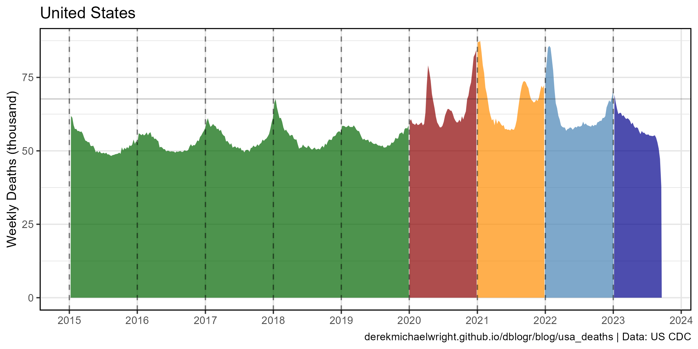

```{r}
mp <- ggWeeklyDeaths(myArea = "United States")
ggsave("usa_deaths_1_01.png", mp, width = 8, height = 4)
```

---

## New York

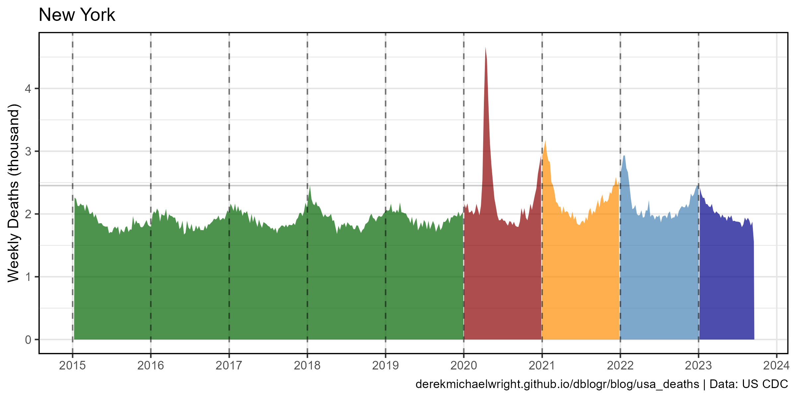

```{r}
mp <- ggWeeklyDeaths(myArea = "New York")
ggsave("usa_deaths_1_02.png", mp, width = 8, height = 4)
```

---

## New Jersey

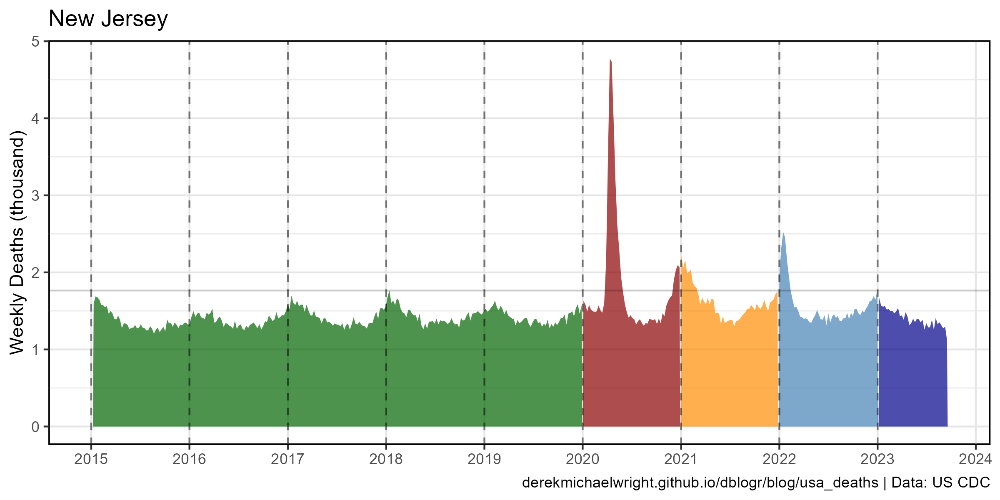

```{r}
mp <- ggWeeklyDeaths(myArea = "New Jersey")
ggsave("usa_deaths_1_03.png", mp, width = 8, height = 4)
```

---

## California

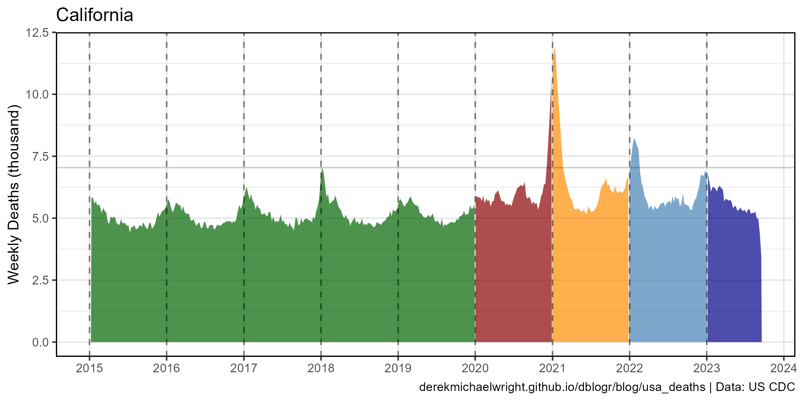

```{r}
mp <- ggWeeklyDeaths(myArea = "California")
ggsave("usa_deaths_1_04.png", mp, width = 8, height = 4)
```

---

## Texas

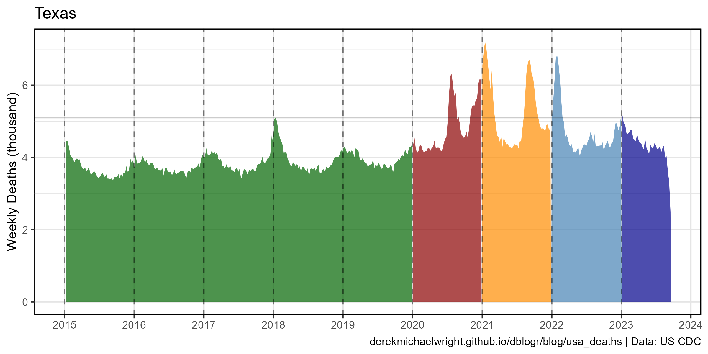

```{r}
mp <- ggWeeklyDeaths(myArea = "Texas")
ggsave("usa_deaths_1_05.png", mp, width = 8, height = 4)
```

---

## Florida

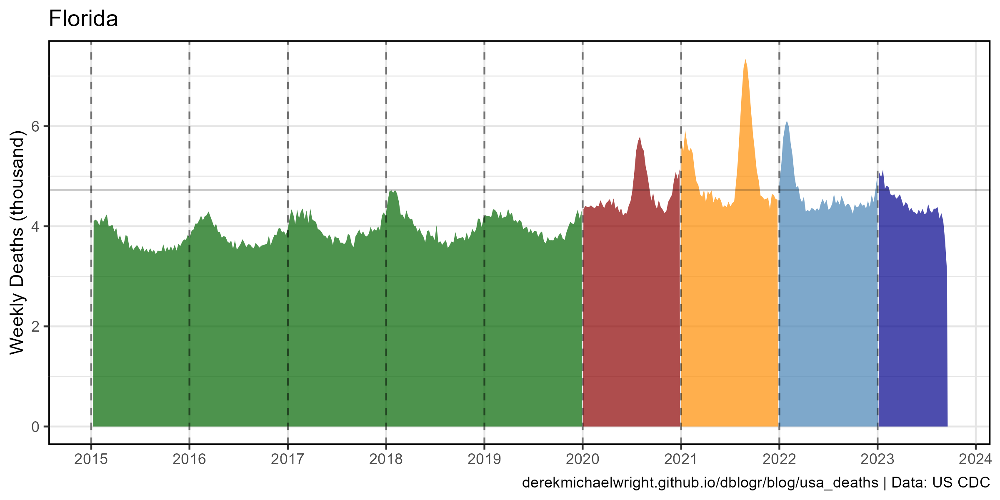

```{r}
mp <- ggWeeklyDeaths(myArea = "Florida")
ggsave("usa_deaths_1_06.png", mp, width = 8, height = 4)
```

---

## Washington

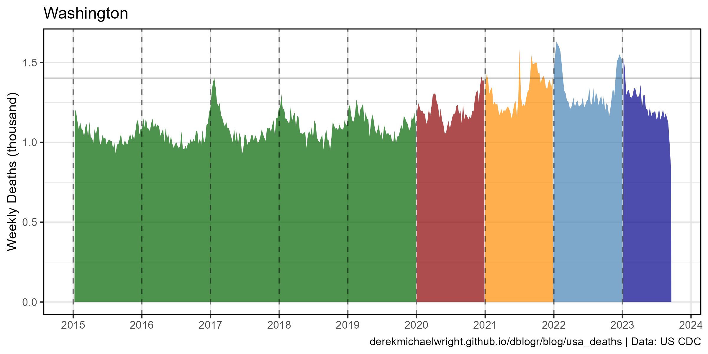

```{r}
mp <- ggWeeklyDeaths(myArea = "Washington")
ggsave("usa_deaths_1_07.png", mp, width = 8, height = 4)
```

---

## Montana

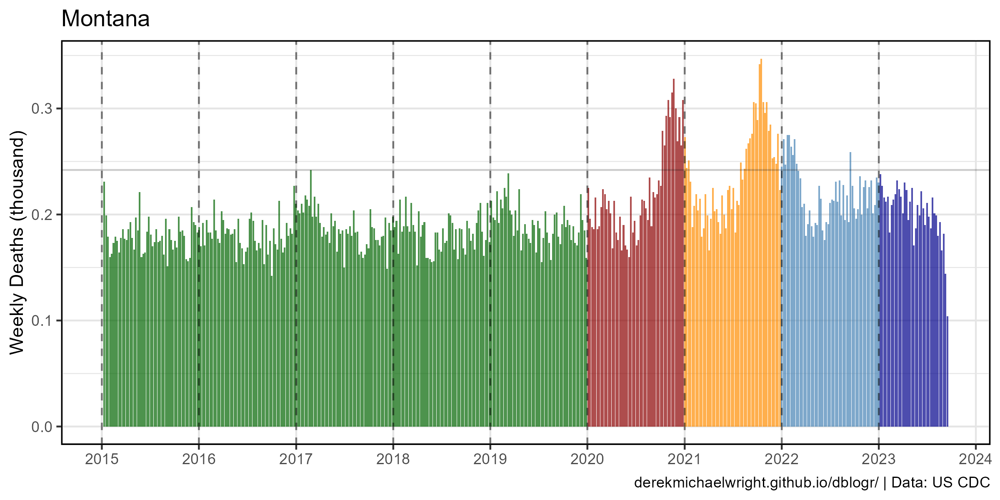

```{r}
mp <- ggWeeklyDeaths(myArea = "Montana")
ggsave("usa_deaths_1_08.png", mp, width = 8, height = 4)
```

---

## North Dakota

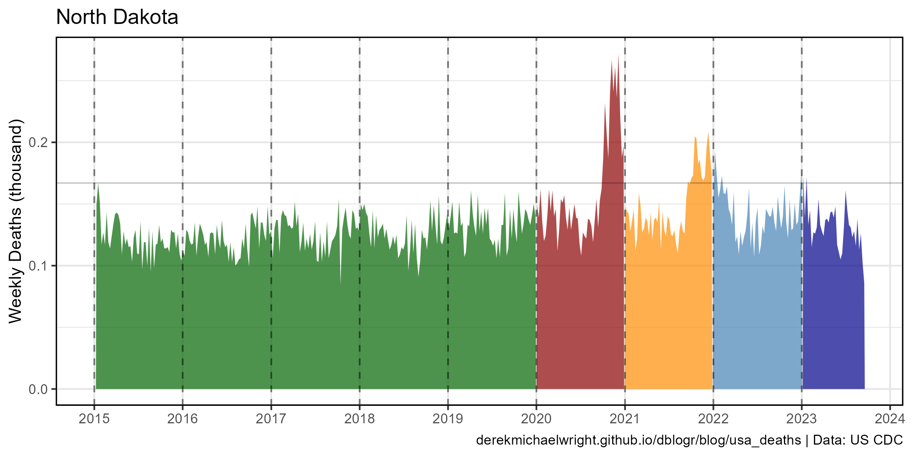

```{r}
mp <- ggWeeklyDeaths(myArea = "North Dakota")
ggsave("usa_deaths_1_09.png", mp, width = 8, height = 4)
```

---

## South Dakota

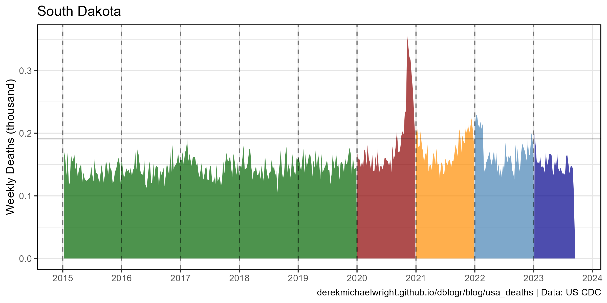

```{r}
mp <- ggWeeklyDeaths(myArea = "South Dakota")
ggsave("usa_deaths_1_10.png", mp, width = 8, height = 4)
```

---

# Yearly Deaths {.tabset .tabset-pills}

## Plotting Function

```{r class.source = "fold-show"}
# Create plotting function
ggYearlyDeaths <- function(myArea = "United States") {
  # Prep data
  xx <- dd %>% 
    filter(Area == myArea, Type == "Unweighted") %>% 
    mutate(Year = as.numeric(substr(Date, 1, 4))) %>%
    group_by(Area, Year, Group) %>% 
    summarise(Value = sum(Number.of.Deaths))
  # Plot
  ggplot(xx, aes(x = Year, y = Value / 1000000, fill = Group, alpha = Group)) +
    geom_bar(stat = "identity", color = "black") +
    scale_fill_manual(values = myColors) +
    scale_alpha_manual(name = NULL, values = c(0.4,0.8,0.8,0.8,0.8)) +
    scale_x_continuous(breaks = min(xx$Year):max(xx$Year)) +
    theme_agData_col(legend.position = "none") +
    labs(title = myArea, y = "Million Deaths", x = NULL, caption = myCaption1)
}
```

---

## United States {.active}

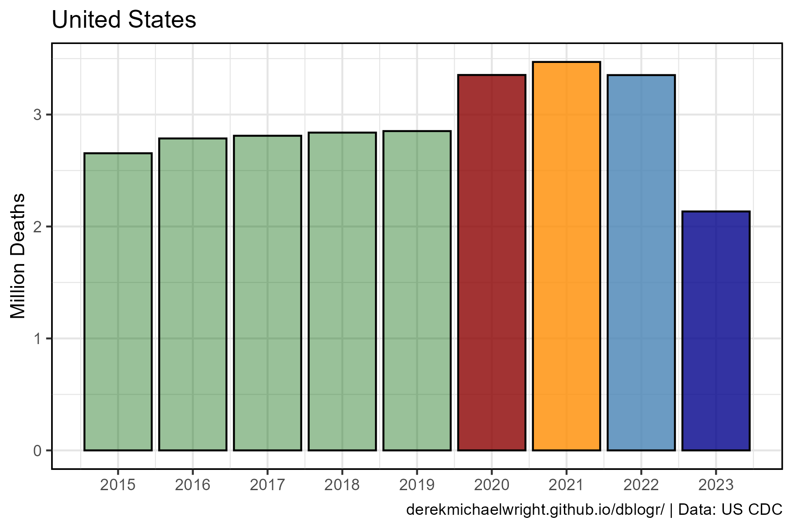

```{r}
mp <- ggYearlyDeaths(myArea = "United States")
ggsave("usa_deaths_2_01.png", mp, width = 6, height = 4)
```

---

## New York

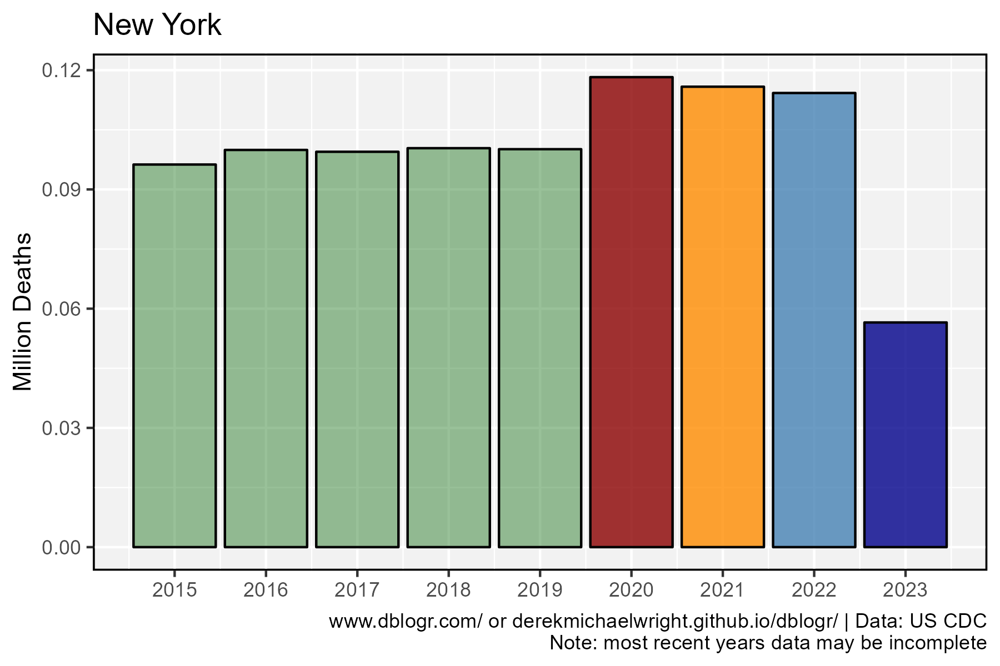

```{r}
mp <- ggYearlyDeaths(myArea = "New York")
ggsave("usa_deaths_2_02.png", mp, width = 6, height = 4)
```

---

## New Jersey

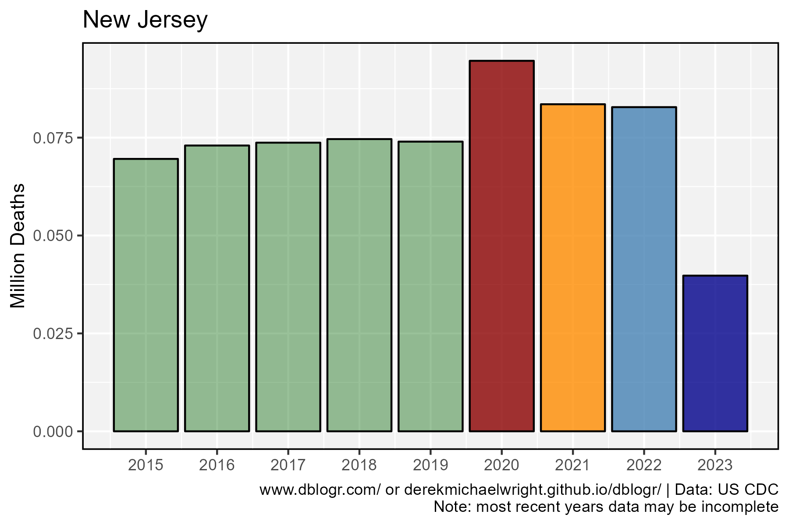

```{r}
mp <- ggYearlyDeaths(myArea = "New Jersey")
ggsave("usa_deaths_2_03.png", mp, width = 6, height = 4)
```

---

## California

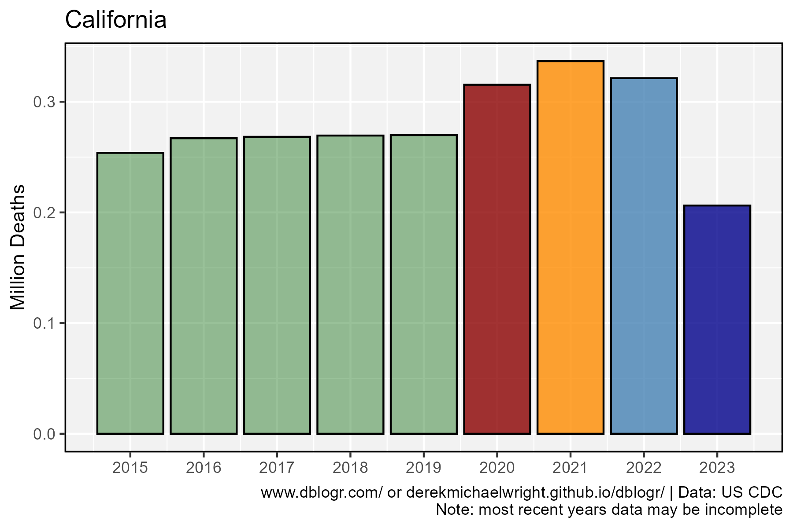

```{r}
mp <- ggYearlyDeaths(myArea = "California")
ggsave("usa_deaths_2_04.png", mp, width = 6, height = 4)
```

---

## Texas

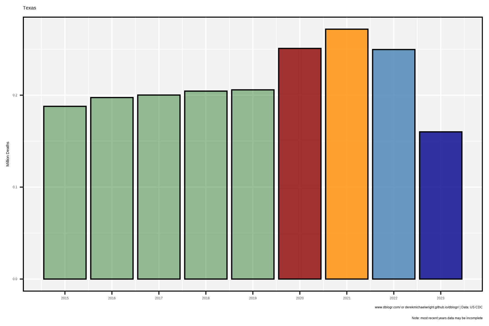

```{r}
mp <- ggYearlyDeaths(myArea = "Texas")
ggsave("usa_deaths_2_05.png", mp, width = 6, height = 4)
```

---

## Florida

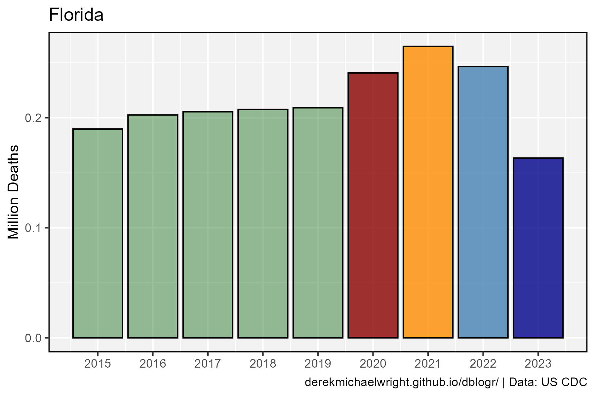

```{r}
mp <- ggYearlyDeaths(myArea = "Florida")
ggsave("usa_deaths_2_06.png", mp, width = 6, height = 4)
```

---

## Washington

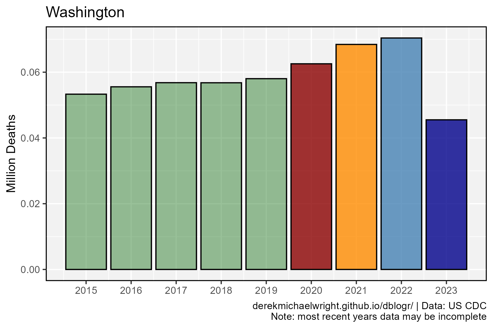

```{r}
mp <- ggYearlyDeaths(myArea = "Washington")
ggsave("usa_deaths_2_07.png", mp, width = 6, height = 4)
```

---

## Montana

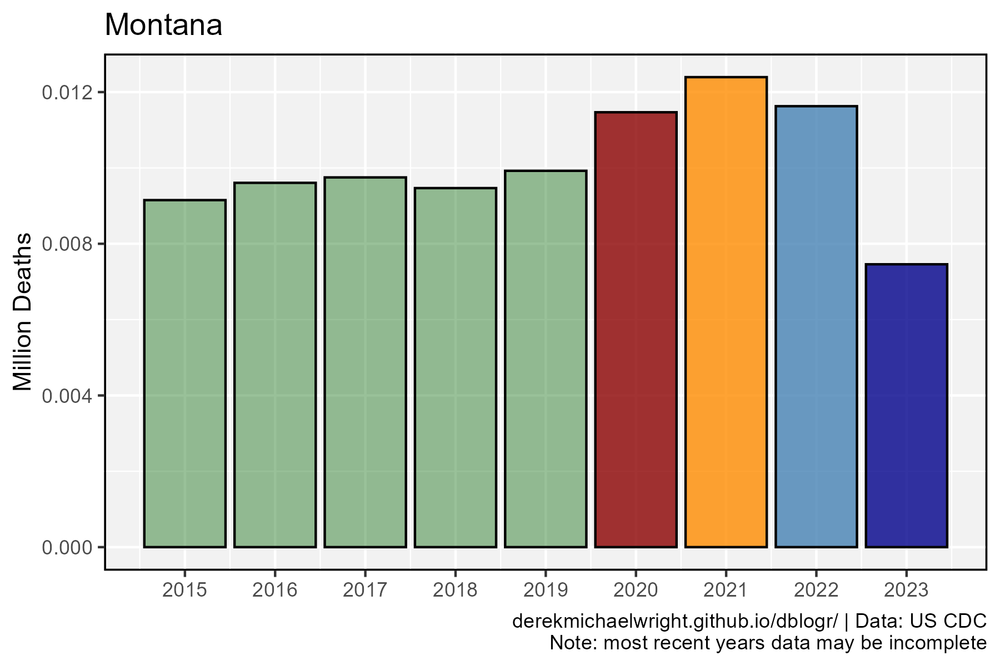

```{r}
mp <- ggYearlyDeaths(myArea = "Montana")
ggsave("usa_deaths_2_08.png", mp, width = 6, height = 4)
```

---

## North Dakota

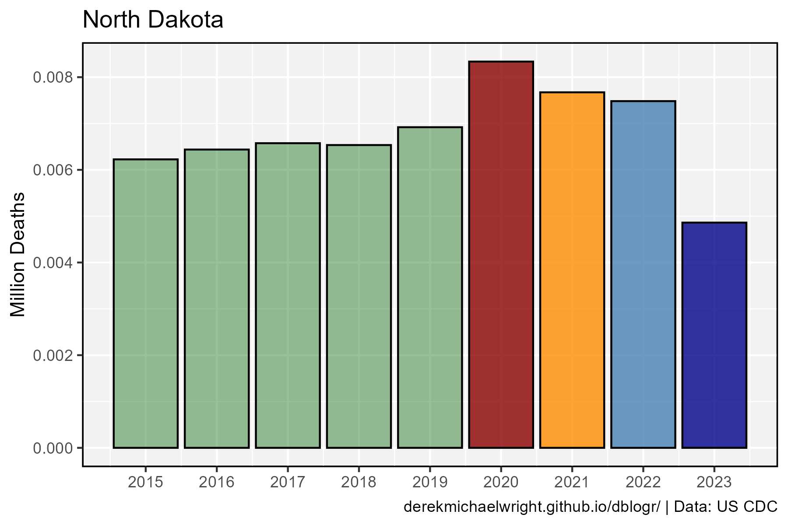

```{r}
mp <- ggYearlyDeaths(myArea = "North Dakota")
ggsave("usa_deaths_2_09.png", mp, width = 6, height = 4)
```

---

## South Dakota

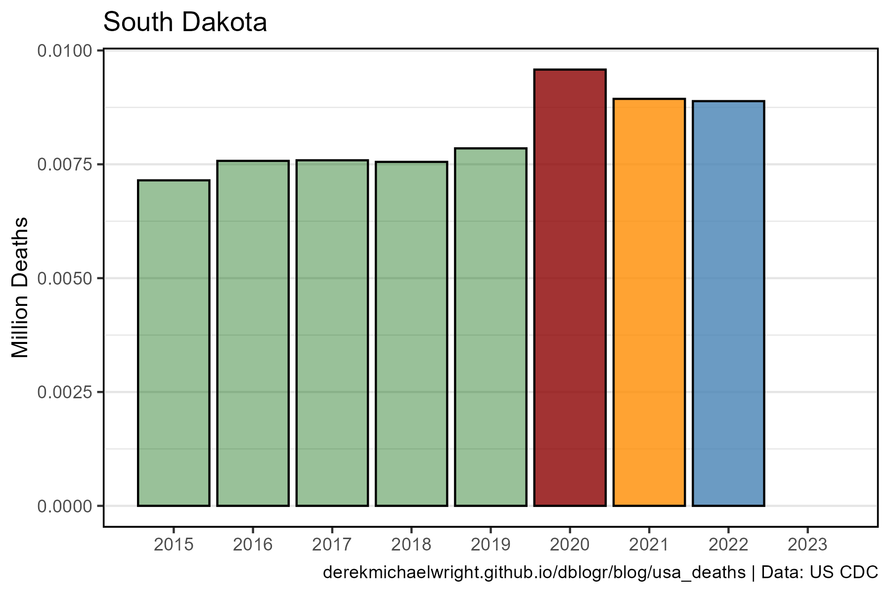

```{r}
mp <- ggYearlyDeaths(myArea = "South Dakota")
ggsave("usa_deaths_2_10.png", mp, width = 6, height = 4)
```

---

# Deaths Vs. Previous Years {.tabset .tabset-pills}

## Plotting Function

```{r class.source = "fold-show"}
# Create plotting function
ggRespSeasons <- function(myAreas = "United States") {
  # Prep data
  xx <- dd %>% filter(Area %in% myAreas, Type == "Unweighted") %>%
    group_by(Area, Year, Group, Season.Group, Season, Date, Adj.Julian.Day) %>% 
    summarise(Number.of.Deaths = sum(Number.of.Deaths))
  zz <- xx %>% filter(Date == "2020-03-14")
  #
  myBreaks <- c(213, 244, 274, 305, 335, 
                366, 397, 425, 456, 486, 517, 547, 577)
  myLabels <- c("Aug","Sept","Oct","Nov","Dec",
                "Jan","Feb","Mar","Apr", "May","June","July","Aug")
  # Plot
  ggplot(xx, aes(x = Adj.Julian.Day, y = Number.of.Deaths / 1000, group = Season, 
                 color = Season.Group, alpha = Season.Group, size = Season.Group)) +
    geom_line() +
    geom_point(data = zz, size = 2, pch = 13, color = "black", alpha = 0.7) +
    facet_wrap(Area ~ ., scales = "free_y", ncol = 5) +
    scale_color_manual(name = NULL, values = myColors) +
    scale_alpha_manual(name = NULL, values = c(0.4,0.8,0.8,0.8,0.8,0.8)) +
    scale_size_manual(name = NULL, values = c(0.5,1,1,1,1,1)) +
    scale_x_continuous(breaks = myBreaks, labels = myLabels) +
    guides(color = guide_legend(nrow = 1)) +
    theme_agData(legend.position = "bottom",
                 axis.text.x = element_text(angle = 45, hjust = 1)) +
    labs(y = "Thousand Deaths Per Week", x = NULL, caption = myCaption1)
}
```

---

## United States {.active}

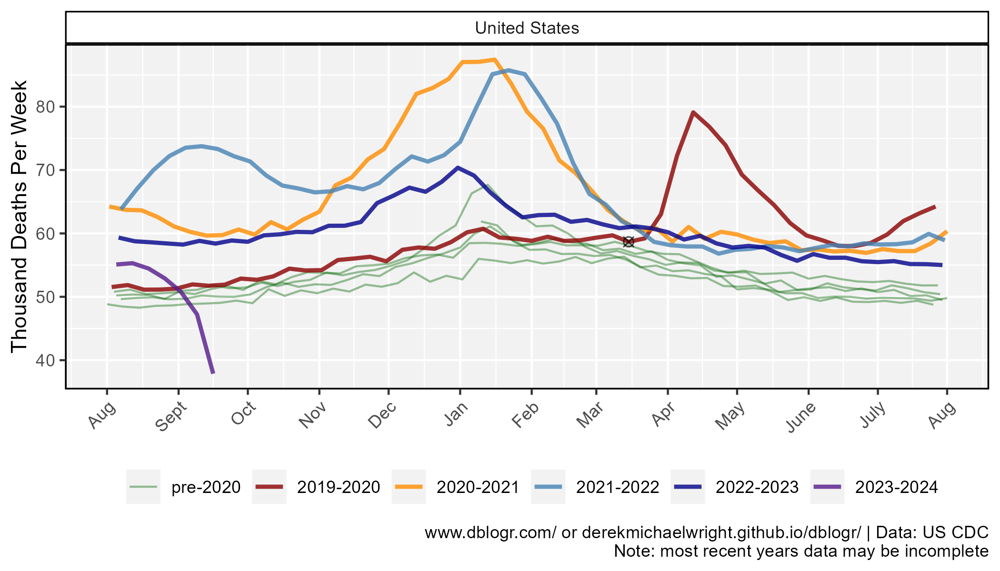

```{r}
mp <- ggRespSeasons(myArea = "United States")
ggsave("usa_deaths_3_01.png", mp, width = 7, height = 4)
```

---

## New York

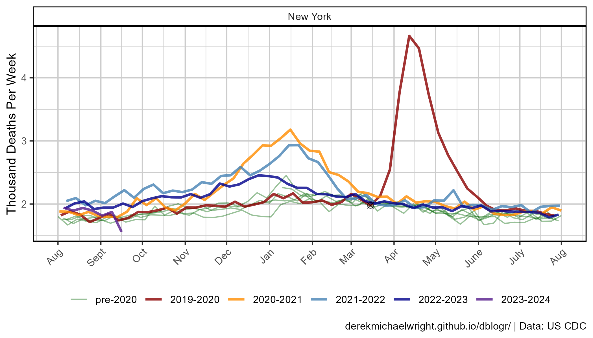

```{r}
mp <- ggRespSeasons(myArea = "New York")
ggsave("usa_deaths_3_02.png", mp, width = 7, height = 4)
```

---

## New Jersey

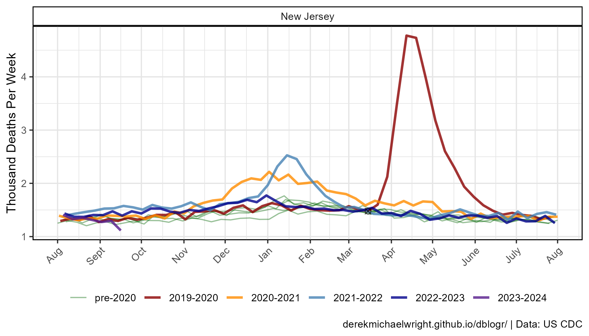

```{r}
mp <- ggRespSeasons(myArea = "New Jersey")
ggsave("usa_deaths_3_03.png", mp, width = 7, height = 4)
```

---

## California

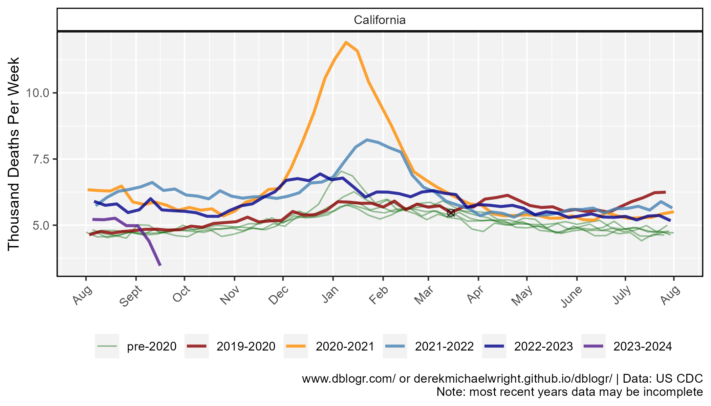

```{r}
mp <- ggRespSeasons(myArea = "California")
ggsave("usa_deaths_3_04.png", mp, width = 7, height = 4)
```

---

## Texas

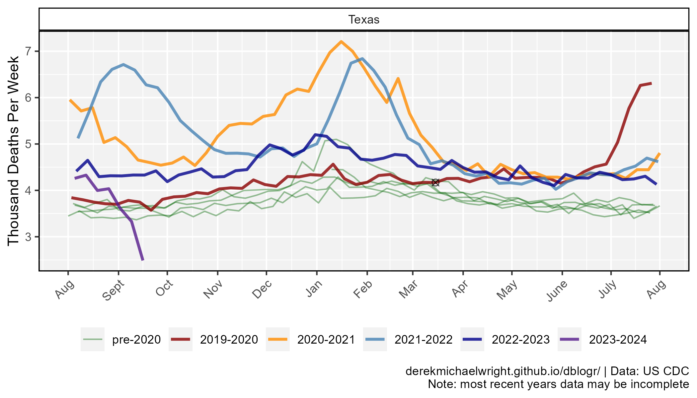

```{r}
mp <- ggRespSeasons(myArea = "Texas")
ggsave("usa_deaths_3_05.png", mp, width = 7, height = 4)
```

---

## Florida

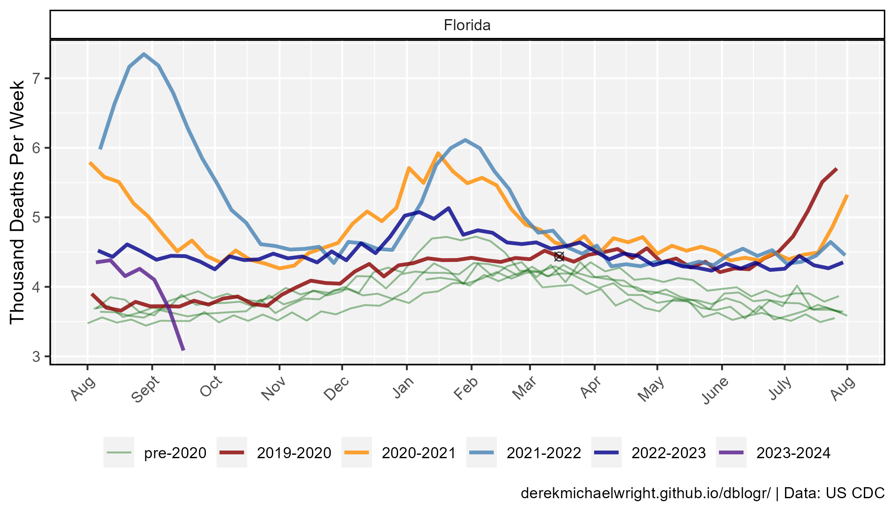

```{r}
mp <- ggRespSeasons(myArea = "Florida")
ggsave("usa_deaths_3_06.png", mp, width = 7, height = 4)
```

---

## Washington

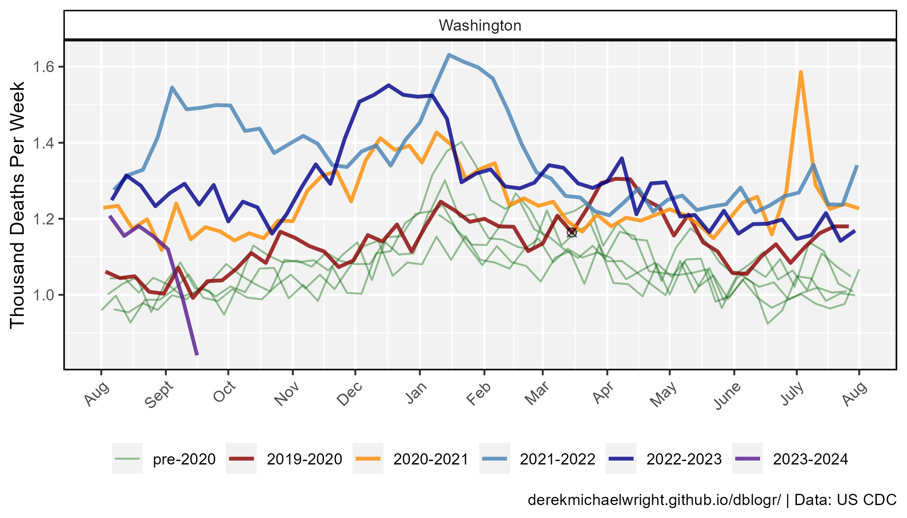

```{r}
mp <- ggRespSeasons(myArea = "Washington")
ggsave("usa_deaths_3_07.png", mp, width = 7, height = 4)
```

---

## Montana

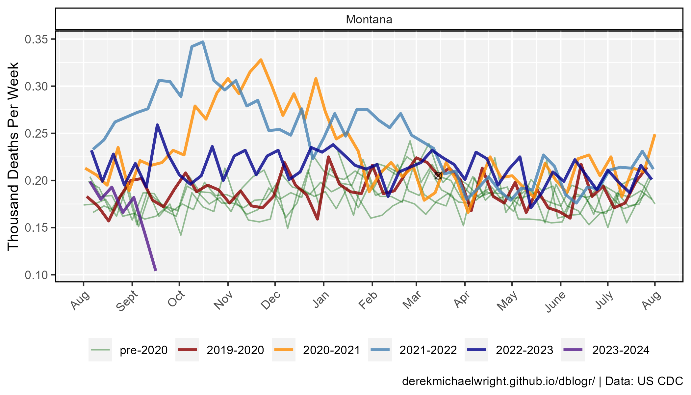

```{r}
mp <- ggRespSeasons(myArea = "Montana")
ggsave("usa_deaths_3_08.png", mp, width = 7, height = 4)
```

---

## North Dakota

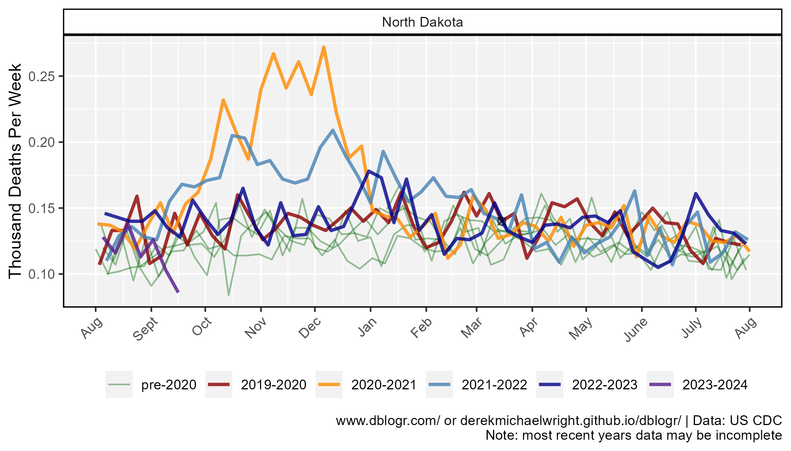

```{r}
mp <- ggRespSeasons(myArea = "North Dakota")
ggsave("usa_deaths_3_09.png", mp, width = 7, height = 4)
```

---

## South Dakota

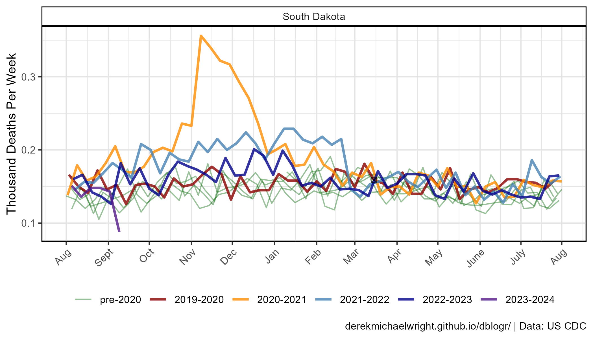

```{r}
mp <- ggRespSeasons(myArea = "South Dakota")
ggsave("usa_deaths_3_10.png", mp, width = 7, height = 4)
```

---

## Selected States

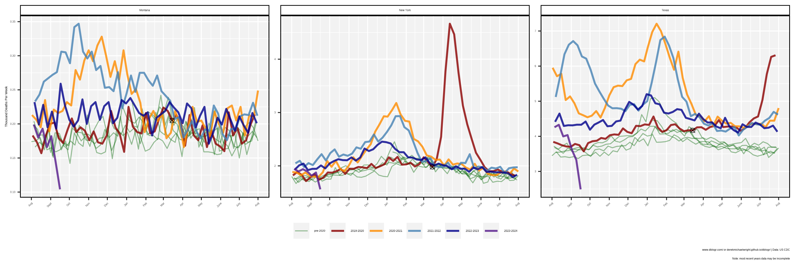

```{r}
mp <- ggRespSeasons(myAreas = c("New York", "Texas", "Montana"))
ggsave("usa_deaths_3_11.png", mp, width = 12, height = 4)
```

---

# Weekly Deaths by Age Group {.tabset .tabset-pills}

## Plotting Function

```{r class.source = "fold-show"}
# Create plotting function
ggRespSeasonsAge <- function(myArea = "United States") {
  # Prep data
  xx <- dd %>% filter(Area %in% myArea, Type == "Unweighted")
  zz <- xx %>% filter(Date == "2020-03-14")
  #
  myBreaks <- c(213, 244, 274, 305, 335, 
                366, 397, 425, 456, 486, 517, 547, 577)
  myLabels <- c("Aug","Sept","Oct","Nov","Dec",
                "Jan","Feb","Mar","Apr", "May","June","July","Aug")
  # Plot
  ggplot(xx, aes(x = Adj.Julian.Day, y = Number.of.Deaths / 1000, group = Season, 
                 color = Season.Group, alpha = Season.Group, size = Season.Group)) +
    geom_line() +
    geom_point(data = zz, size = 2, pch = 13, color = "black", alpha = 0.7) +
    facet_grid(. ~ Age.Group) +
    scale_color_manual(name = NULL, values = myColors) +
    scale_alpha_manual(name = NULL, values = c(0.4,0.8,0.8,0.8,0.8,0.8)) +
    scale_size_manual(name = NULL, values = c(0.5,1,1,1,1,1)) +
    scale_x_continuous(breaks = myBreaks, labels = myLabels) +
    guides(color = guide_legend(nrow = 1)) +
    theme_agData(legend.position = "bottom",
                 axis.text.x = element_text(angle = 45, hjust = 1)) +
    labs(title = myArea, y = "Thousand Deaths Per Week", 
         x = NULL, caption = myCaption1)
}
```

```{r echo = F, eval = F}
# Plotting function
deathPlot4 <- function(myArea) {
  xx <- dd %>% 
    filter(Type == "Unweighted", Area == myArea)
  for(i in unique(xx$Age.Group)) {
    myMin <- min(xx %>% filter(Age.Group == i, Group == "<2020") %>%
                   pull(Number.of.Deaths), na.rm = T)
    xx <- xx %>% filter(!(Age.Group == i & Number.of.Deaths < myMin))
  }
  # Plot
  ggplot(xx, aes(x = Julian.Day, y = Number.of.Deaths, 
                 color = Group, alpha = Group)) +
    geom_line(aes(group = Year)) +
    facet_grid(. ~ Age.Group) +
    scale_color_manual(name = NULL, values = myColors) +
    scale_alpha_manual(name = NULL, values = c(0.4,0.8,0.8,0.8,0.8)) +
    theme_agData(legend.position = "bottom") +
    labs(title = myArea, x = "Julian Day", y = "Weekly Deaths", 
         caption = myCaption1)
}
```

---

## United States {.active}

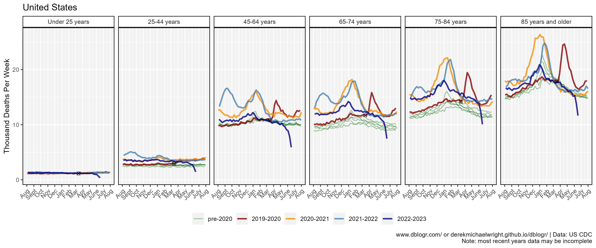

```{r}
mp <- ggRespSeasonsAge(myArea = "United States")
ggsave("usa_deaths_4_01.png", mp, width = 14, height = 4)
```

```{r}
ggsave("featured.png", mp, width = 14, height = 4)
```

---

## New York

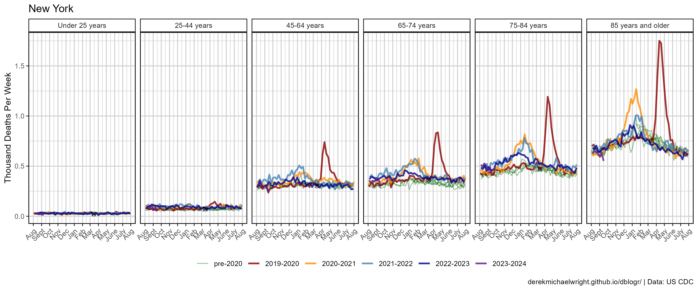

```{r}
mp <- ggRespSeasonsAge(myArea = "New York")
ggsave("usa_deaths_4_02.png", mp, width = 14, height = 4)
```

---

## New Jersey

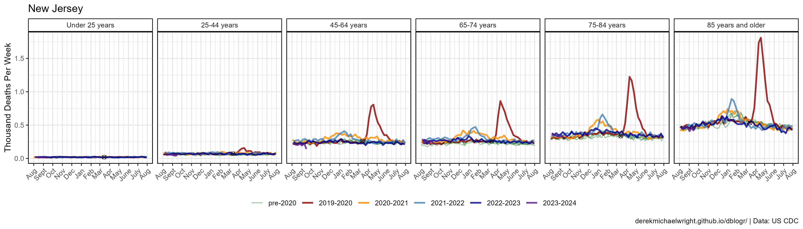

```{r}
mp <- ggRespSeasonsAge(myArea = "New Jersey")
ggsave("usa_deaths_4_03.png", mp, width = 14, height = 4)
```

---

## California

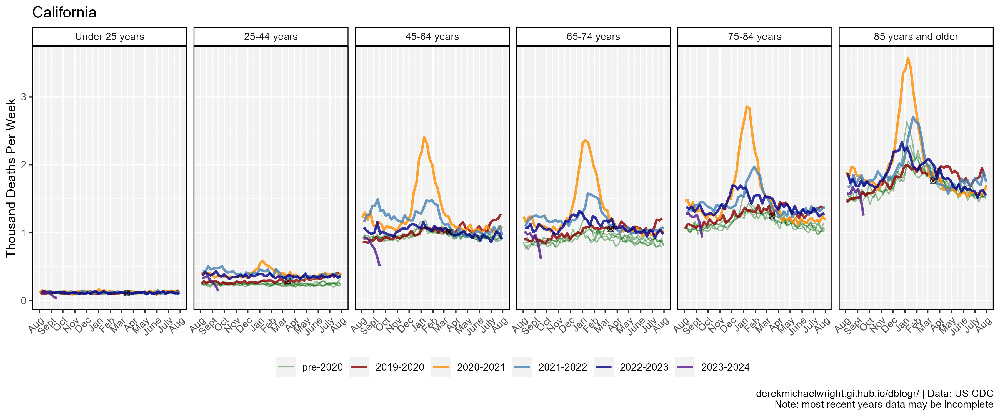

```{r}
mp <- ggRespSeasonsAge(myArea = "California")
ggsave("usa_deaths_4_04.png", mp, width = 14, height = 4)
```

---

## Texas

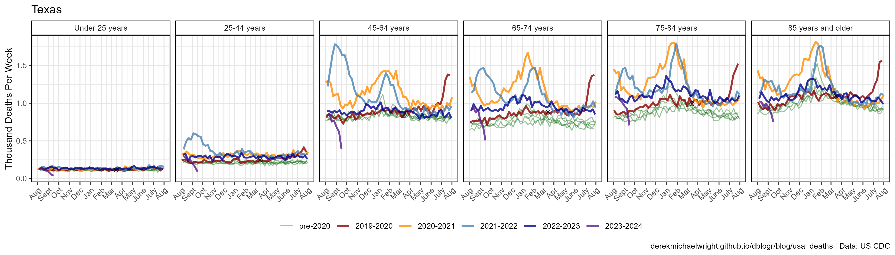

```{r}
mp <- ggRespSeasonsAge(myArea = "Texas")
ggsave("usa_deaths_4_05.png", mp, width = 14, height = 4)
```

---

## Florida

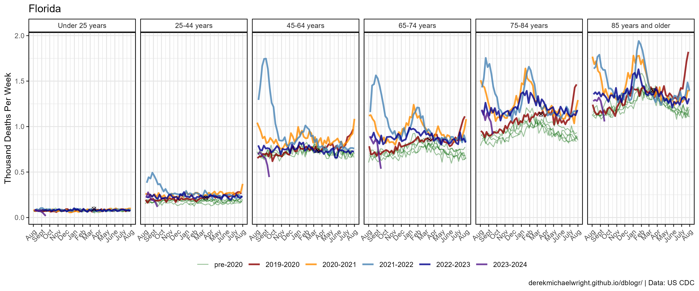

```{r}
mp <- ggRespSeasonsAge(myArea = "Florida")
ggsave("usa_deaths_4_06.png", mp, width = 14, height = 4)
```

---

## Washington

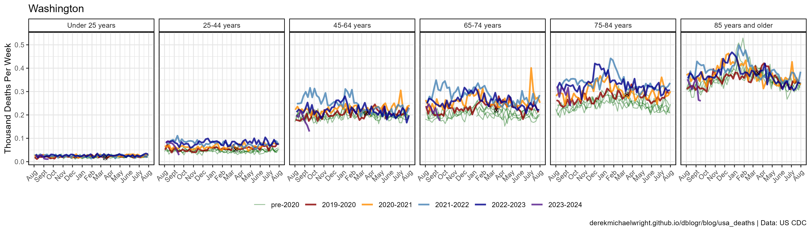

```{r}
mp <- ggRespSeasonsAge(myArea = "Washington")
ggsave("usa_deaths_4_07.png", mp, width = 14, height = 4)
```

---

## Montana

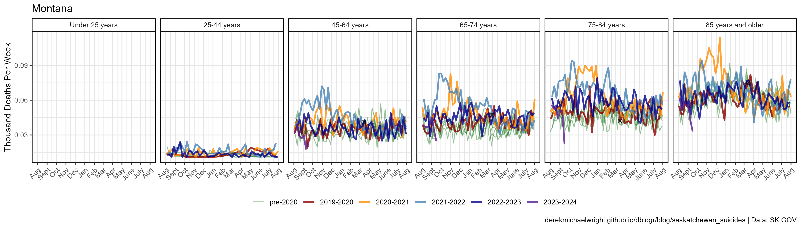

```{r}
mp <- ggRespSeasonsAge(myArea = "Montana")
ggsave("usa_deaths_4_08.png", mp, width = 14, height = 4)
```

---

## North Dakota

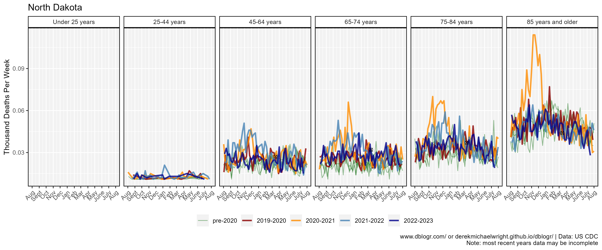

```{r}
mp <- ggRespSeasonsAge(myArea = "North Dakota")
ggsave("usa_deaths_4_09.png", mp, width = 14, height = 4)
```

---

## South Dakota

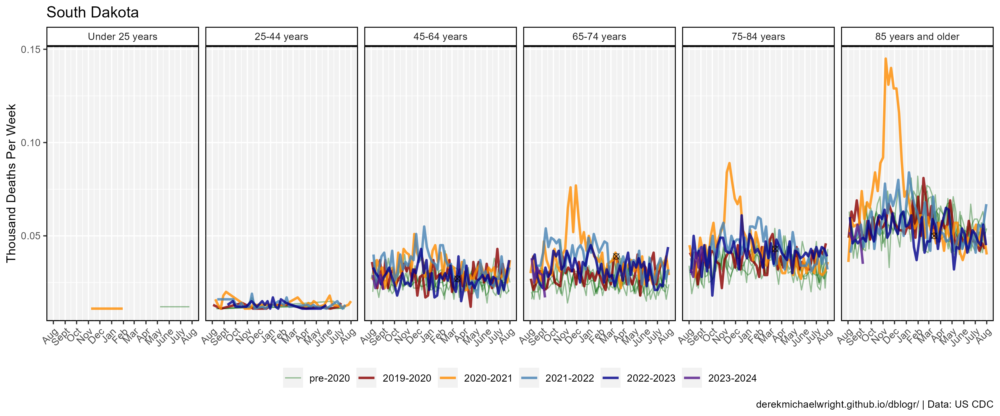

```{r}
mp <- ggRespSeasonsAge(myArea = "South Dakota")
ggsave("usa_deaths_4_10.png", mp, width = 14, height = 4)
```

---

# Yearly Deaths by Age Group {.tabset .tabset-pills}

## Plotting Function

```{r class.source = "fold-show"}
# Plotting function
ggYearlyDeathsAge <- function(myArea) {
  # Prep data
  xx <- dd %>% 
    filter(Type == "Unweighted", Area == myArea, Year < 2023) %>%
    group_by(Year, Age.Group, Group) %>%
    summarise(Number.of.Deaths = sum(Number.of.Deaths, na.rm = T))
  # Plot
  ggplot(xx, aes(x = Year, y = Number.of.Deaths / 1000, 
                 fill = Group, alpha = Group)) +
    geom_bar(stat = "identity", color = "black") + 
    facet_grid(. ~ Age.Group) +
    scale_fill_manual(values = myColors) +
    scale_alpha_manual(values = c(0.4,0.8,0.8,0.8,0.8)) +
    scale_x_continuous(breaks = min(xx$Year):max(xx$Year)) +
    theme_agData_col(legend.position = "none",
                     axis.text.x = element_text(angle = 45, hjust = 1)) +
    labs(title = myArea, x = NULL, y = "Thousand Deaths", caption = myCaption1)
}
```

---

## United States {.active}

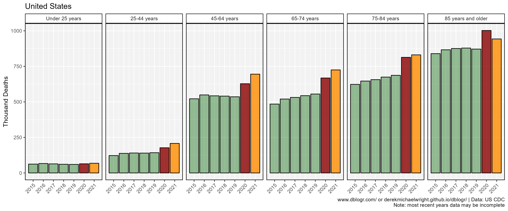

```{r}
mp <- ggYearlyDeathsAge(myArea = "United States")
ggsave("usa_deaths_5_01.png", mp, width = 12, height = 5)
```

---

## New York

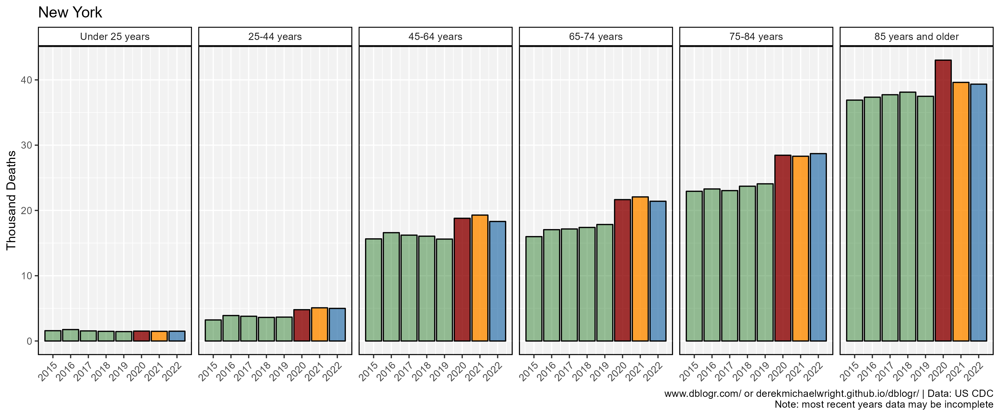

```{r}
mp <- ggYearlyDeathsAge(myArea = "New York")
ggsave("usa_deaths_5_02.png", mp, width = 12, height = 5)
```

---

## New Jersey

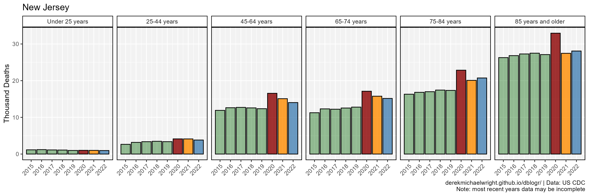

```{r}
mp <- ggYearlyDeathsAge(myArea = "New Jersey")
ggsave("usa_deaths_5_03.png", mp, width = 12, height = 4)
```

---

## California

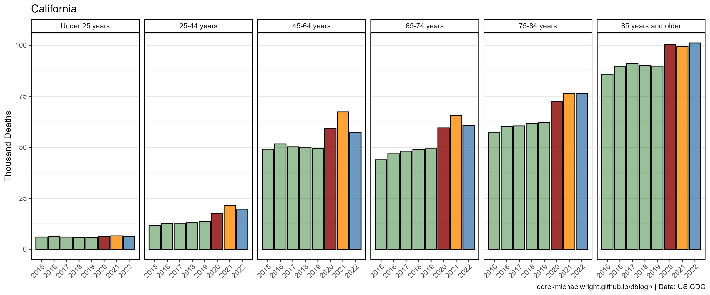

```{r}
mp <- ggYearlyDeathsAge(myArea = "California")
ggsave("usa_deaths_5_04.png", mp, width = 12, height = 5)
```

---

## Texas

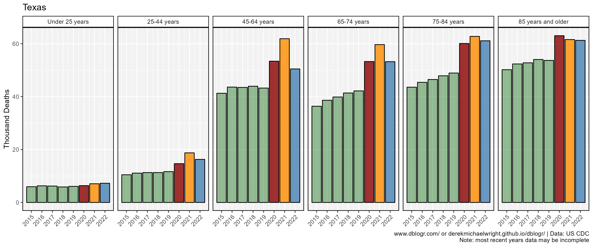

```{r}
mp <- ggYearlyDeathsAge(myArea = "Texas")
ggsave("usa_deaths_5_05.png", mp, width = 12, height = 5)
```

---

## Florida

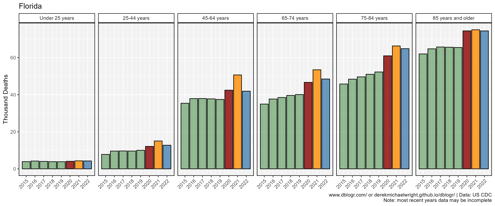

```{r}
mp <- ggYearlyDeathsAge(myArea = "Florida")
ggsave("usa_deaths_5_06.png", mp, width = 12, height = 5)
```

---

## Washington

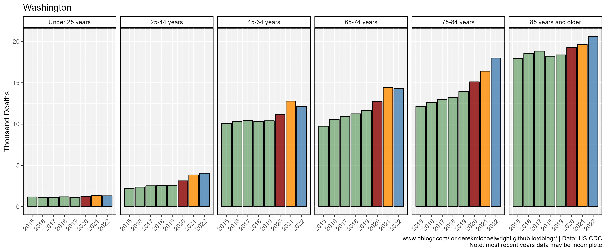

```{r}
mp <- ggYearlyDeathsAge(myArea = "Washington")
ggsave("usa_deaths_5_07.png", mp, width = 12, height = 5)
```

---

## Montana

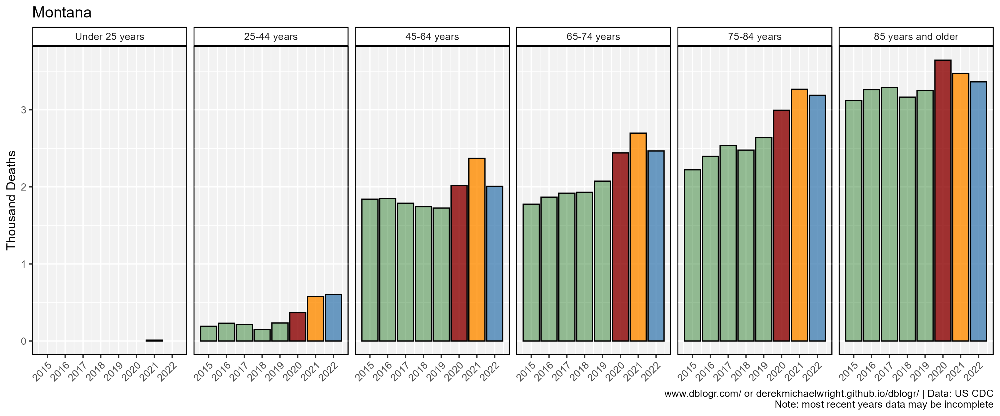

```{r}
mp <- ggYearlyDeathsAge(myArea = "Montana")
ggsave("usa_deaths_5_08.png", mp, width = 12, height = 5)
```

---

## North Dakota

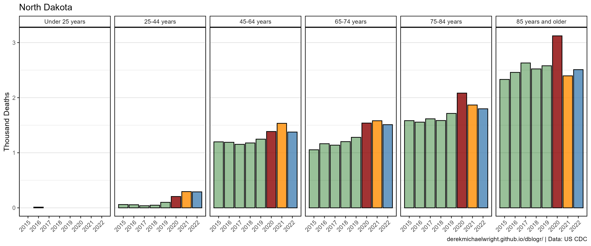

```{r}
mp <- ggYearlyDeathsAge(myArea = "North Dakota")
ggsave("usa_deaths_5_09.png", mp, width = 12, height = 5)
```

---

## South Dakota

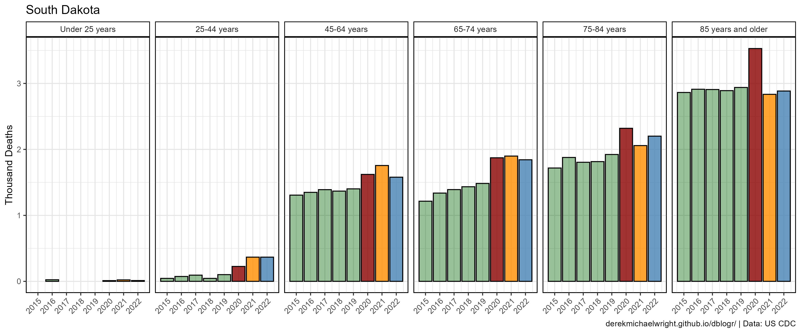

```{r}
mp <- ggYearlyDeathsAge(myArea = "South Dakota")
ggsave("usa_deaths_5_10.png", mp, width = 12, height = 5)
```

---

# Death Rates {.tabset .tabset-pills}

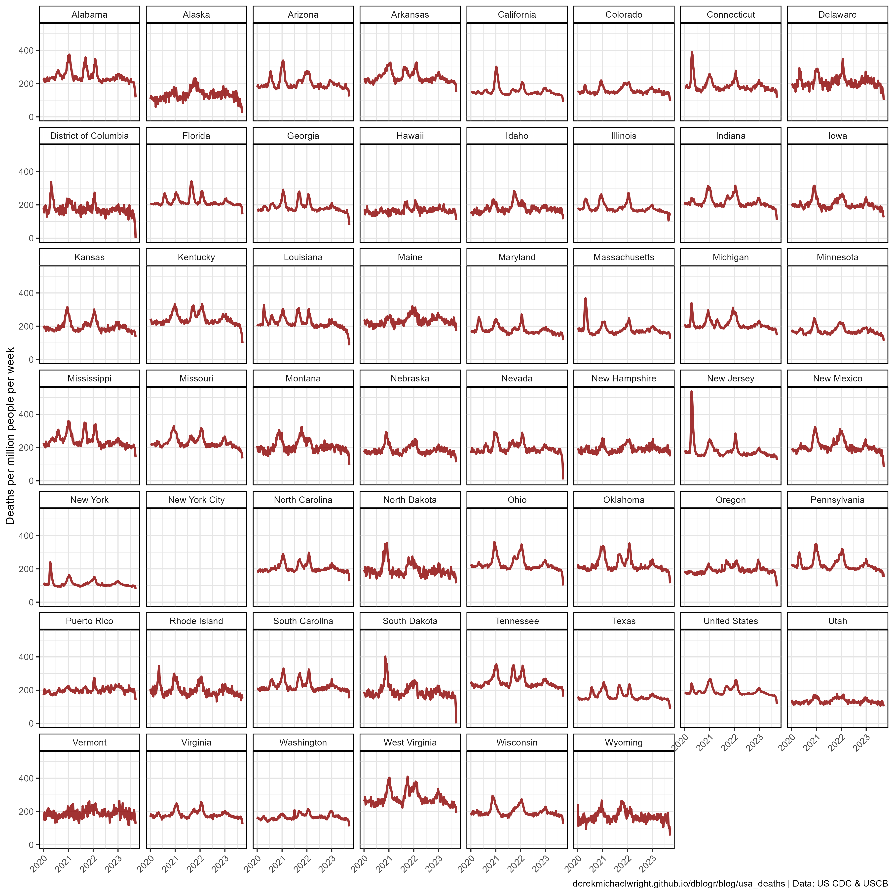

```{r}
# Prep data
xx <- dd %>% 
  filter(Year > 2019, Type == "Unweighted") %>%
  group_by(Area, State.Abbreviation, Date) %>%
  summarise(Number.of.Deaths = sum(Number.of.Deaths, na.rm = T)) %>%
  ungroup() %>% 
  left_join(p1, by = "Area") %>%
  mutate(Death.Rate = 1000000 * Number.of.Deaths / Population)
# Plot
mp <- ggplot(xx, aes(x = Date, y = Death.Rate)) +
  geom_line(color = "darkred", alpha = 0.8, size = 1) +
  facet_wrap(Area ~ .) +
  scale_color_manual(values = agData_Colors) +
  scale_x_date(date_labels = "%Y", date_breaks = "1 year") +
  theme_agData(axis.text.x = element_text(angle = 45, hjust = 1)) +
  labs(x = NULL, y = "Deaths per million people per week", 
       caption = myCaption2)
ggsave("usa_deaths_6_01.png", mp, width = 12, height = 12)
```

---

## North vs South Dakota

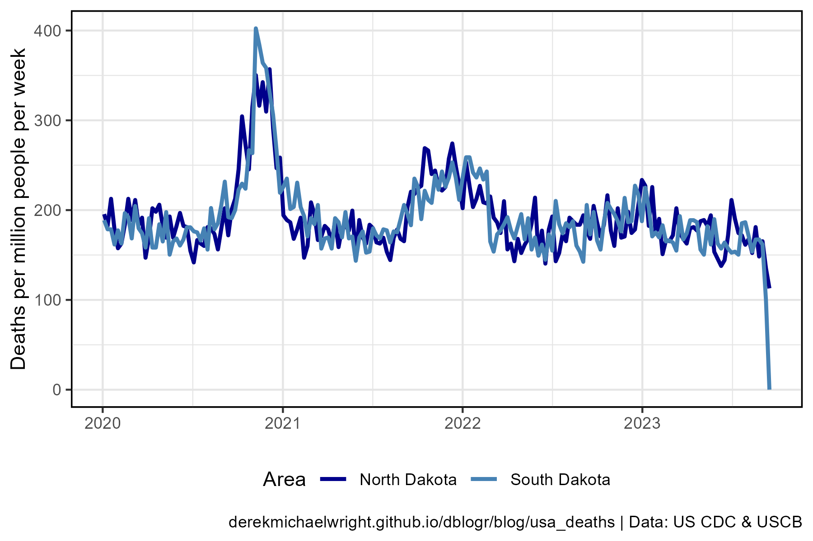

```{r}
# Prep data
x1 <- xx %>% filter(State.Abbreviation %in% c("SD","ND"))
# Plot
mp <- ggplot(x1, aes(x = Date, y = Death.Rate, color = Area)) +
  geom_line(size = 1) +
  scale_color_manual(values = c("darkblue","steelblue")) +
  theme_agData(legend.position = "bottom") +
  labs(x = NULL, y = "Deaths per million people per week", 
       caption = myCaption2)
ggsave("usa_deaths_6_02.png", mp, width = 6, height = 4)
```

---

## California vs Texas

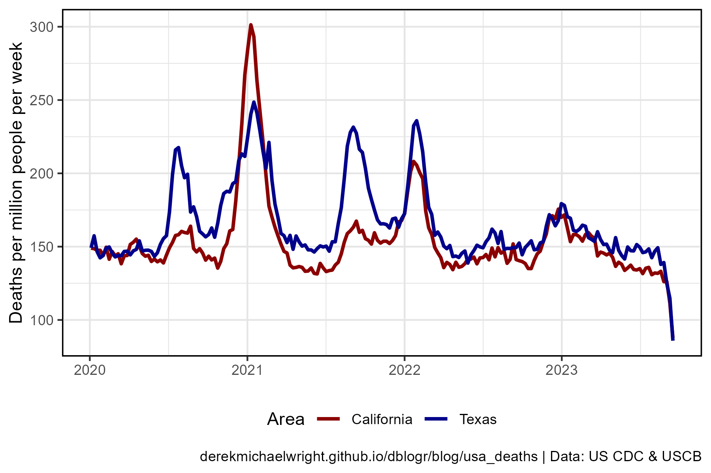

```{r}
# Prep data
x1 <- xx %>% filter(State.Abbreviation %in% c("CA","TX"))
# Plot
mp <- ggplot(x1, aes(x = Date, y = Death.Rate, color = Area)) +
  geom_line(size = 1) +
  scale_color_manual(values = c("darkred","darkblue")) +
  theme_agData(legend.position = "bottom") +
  labs(x = NULL, y = "Deaths per million people per week", 
       caption = myCaption2)
ggsave("usa_deaths_6_03.png", mp, width = 6, height = 4)
```

---

## NY vs NJ vs Fl {.tabset .tabset-pills}

### >2020

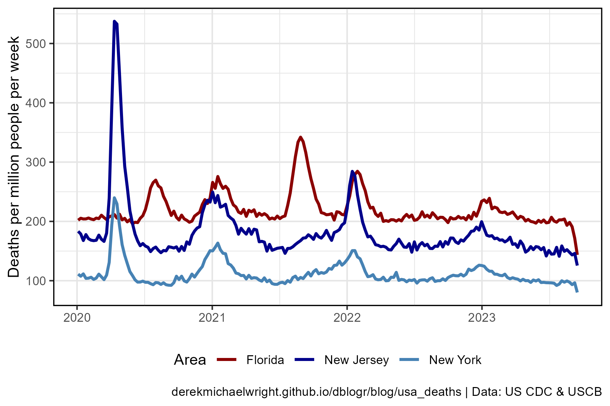

```{r}
# Prep data
colors <- c("darkred", "darkblue", "steelblue")
x1 <- xx %>% filter(State.Abbreviation %in% c("FL","NY","NJ"))
# Plot
mp <- ggplot(x1, aes(x = Date, y = Death.Rate, color = Area)) +
  geom_line(size = 1) +
  scale_color_manual(values = colors) +
  theme_agData(legend.position = "bottom") +
  labs(x = NULL, y = "Deaths per million people per week", 
       caption = myCaption2)
ggsave("usa_deaths_6_04.png", mp, width = 6, height = 4)
```

---

### All Data

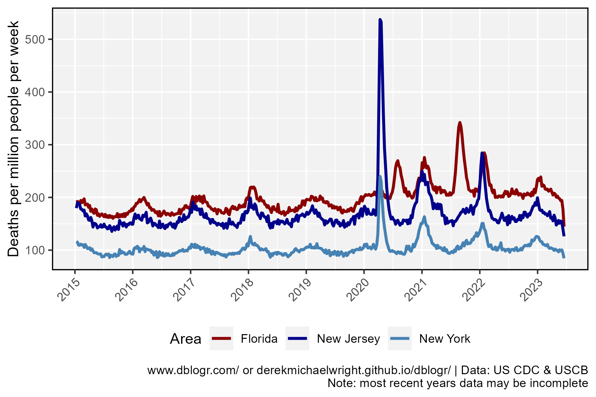

```{r}
# Prep data
xx <- dd %>% 
  filter(Type == "Unweighted",
         State.Abbreviation %in% c("FL","NY","NJ")) %>%
  group_by(Area, State.Abbreviation, Date) %>%
  summarise(Number.of.Deaths = sum(Number.of.Deaths, na.rm = T)) %>%
  ungroup() %>% 
  left_join(p1, by = "Area") %>%
  mutate(Death.Rate = 1000000 * Number.of.Deaths / Population)
# Plot
mp <- ggplot(xx, aes(x = Date, y = Death.Rate, color = Area)) +
  geom_line(size = 1) +
  scale_color_manual(values = colors) +
  scale_x_date(date_breaks = "1 year", date_label = "%Y") +
  theme_agData(legend.position = "bottom",
               axis.text.x = element_text(angle = 45, hjust = 1)) +
  labs(x = NULL, y = "Deaths per million people per week", 
       caption = myCaption2)
ggsave("usa_deaths_6_05.png", mp, width = 6, height = 4)
```

---

# Death Rate - Ages 65+

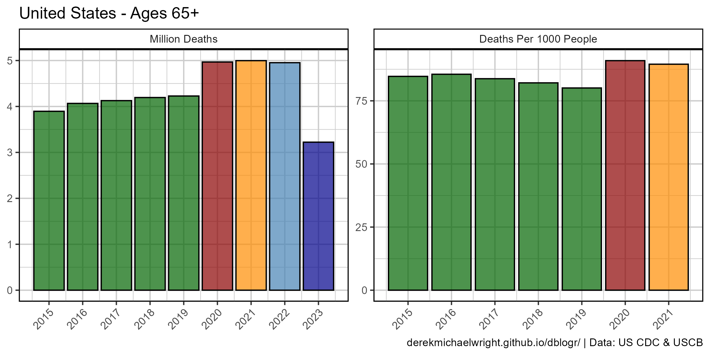

```{r}
# Prep data
x1 <- dd %>% 
  filter(Area == "United States", Age.Group %in% myAges1[4:6]) %>%
  group_by(Year, Group) %>%
  summarise(Deaths = sum(Number.of.Deaths, na.rm = T))
x2 <- p2 %>% filter(Sex == "Both sexes", Age %in% myAges2[14:18]) %>%
  group_by(Year) %>%
  summarise(Population = sum(Population, na.rm = T))
xx <- left_join(x1, x2, by = "Year") %>%
  mutate(`Deaths Per 1000 People` = 1000 * Deaths / Population,
         `Million Deaths` = Deaths / 1000000) %>% 
  select(-Population, -Deaths) %>%
  gather(Trait, Value, 3:4) %>%
  mutate(Trait = factor(Trait, levels = c("Million Deaths","Deaths Per 1000 People")))
# Plot
mp <- ggplot(xx, aes(x = Year, y = Value, fill = Group)) +
  geom_col(color = "black", alpha = 0.7) +
  facet_wrap(Trait ~ ., scales = "free") +
  scale_fill_manual(values = myColors) +
  scale_x_continuous(breaks = min(xx$Year):max(xx$Year)) +
  theme_agData_col(legend.position = "none",
                   axis.text.x = element_text(angle = 45, hjust = 1)) +
  labs(title = "United States - Ages 65+", 
       x = NULL, y = NULL, caption = myCaption2)
ggsave("usa_deaths_7_01.png", mp, width = 8, height = 4)
```

---

# Death Rate - Ages 0 - 44

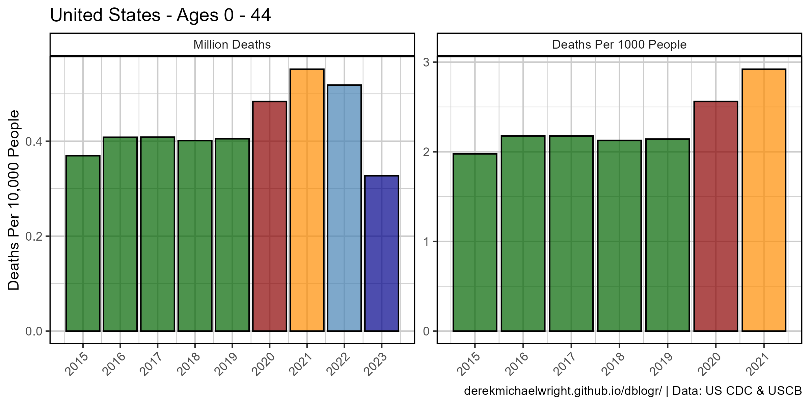

```{r}
# Prep data
x1 <- dd %>% 
  filter(Area == "United States", Age.Group %in% myAges1[1:2]) %>%
  group_by(Year, Group) %>%
  summarise(Deaths = sum(Number.of.Deaths, na.rm = T))
x2 <- p2 %>% filter(Sex == "Both sexes", Age %in% myAges2[1:9]) %>%
  group_by(Year) %>%
  summarise(Population = sum(Population, na.rm = T))
xx <- left_join(x1, x2, by = "Year") %>%
  mutate(`Deaths Per 1000 People` = 1000 * Deaths / Population,
         `Million Deaths` = Deaths / 1000000) %>% 
  select(-Population, -Deaths) %>%
  gather(Trait, Value, 3:4) %>%
  mutate(Trait = factor(Trait, levels = c("Million Deaths","Deaths Per 1000 People")))
# Plot
mp <- ggplot(xx, aes(x = Year, y = Value, fill = Group)) +
  geom_col(color = "black", alpha = 0.7) +
  facet_wrap(Trait ~ ., scales = "free") +
  scale_fill_manual(values = myColors) +
  scale_x_continuous(breaks = min(xx$Year):max(xx$Year)) +
  theme_agData_col(legend.position = "none",
                   axis.text.x = element_text(angle = 45, hjust = 1)) +
  labs(title = "United States - Ages 0 - 44", x = NULL,
       y = "Deaths Per 10,000 People", caption = myCaption2)
ggsave("usa_deaths_7_02.png", mp, width = 8, height = 4)
```

---

# Weekly Deaths 0 - 44 {.tabset .tabset-pills}

## Plotting Function

```{r class.source = "fold-show"}
# Create plotting function
ggWeeklyDeaths044 <- function(myArea = "United States") {
  # Prep data
  xmin <- 2015
  xmax <- max(dd$Year)
  vv <- as.Date(paste0(as.character(xmin:xmax),"-01-01"))
  xx <- dd %>% filter(Area == myArea, Year >= xmin, Type == "Unweighted",
                      Age.Group %in% c("Under 25 years", "25-44 years")) %>%
    group_by(Year, Date, Group) %>% 
    summarise(Number.of.Deaths = sum(Number.of.Deaths, na.rm = T))
  #
  myMax <- xx %>% filter(Year < 2020) %>% group_by(Date) %>% 
    summarise(Number.of.Deaths = sum(Number.of.Deaths, na.rm = T)) %>%
    pull(Number.of.Deaths) %>% max()
  # Plot
  ggplot(xx, aes(x = Date, y = Number.of.Deaths, fill = Group)) +
    geom_area(alpha = 0.7) +
    geom_vline(xintercept = vv, lty = 2, alpha = 0.5) +
    geom_hline(yintercept = myMax, alpha = 0.2) +
    scale_fill_manual(values = myColors) +
    scale_x_date(date_breaks = "1 year", date_labels = "%Y", 
                 minor_breaks = "1 year") +
    theme_agData(legend.position = "none") +
    labs(title = paste(myArea, " - Ages 0 - 44"),
         y = "Weekly Deaths", x = NULL, caption = myCaption1)
}
```

---

## United States {.active}

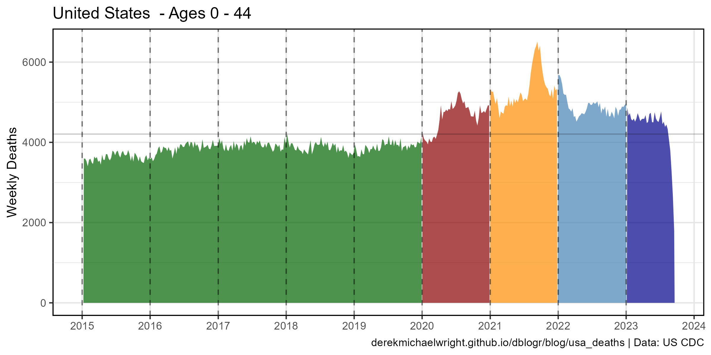

```{r}
mp <- ggWeeklyDeaths044(myArea = "United States")
ggsave("usa_deaths_8_01.png", mp, width = 8, height = 4)
```

---

## New York

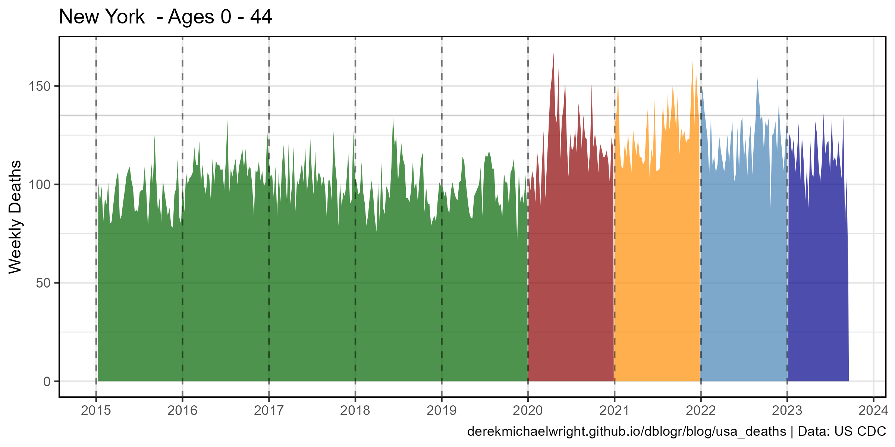

```{r}
mp <- ggWeeklyDeaths044(myArea = "New York")
ggsave("usa_deaths_8_02.png", mp, width = 8, height = 4)
```

---

## New Jersey

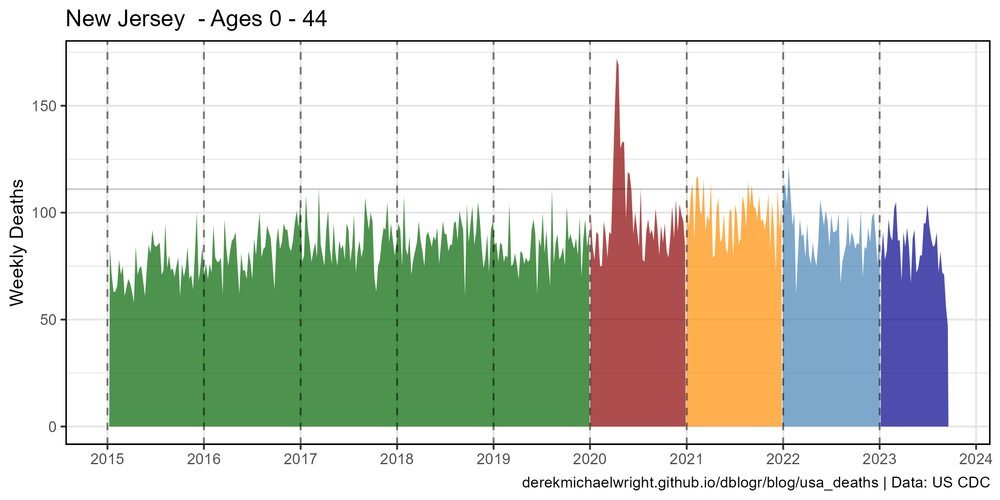

```{r}
mp <- ggWeeklyDeaths044(myArea = "New Jersey")
ggsave("usa_deaths_8_03.png", mp, width = 8, height = 4)
```

---

## California

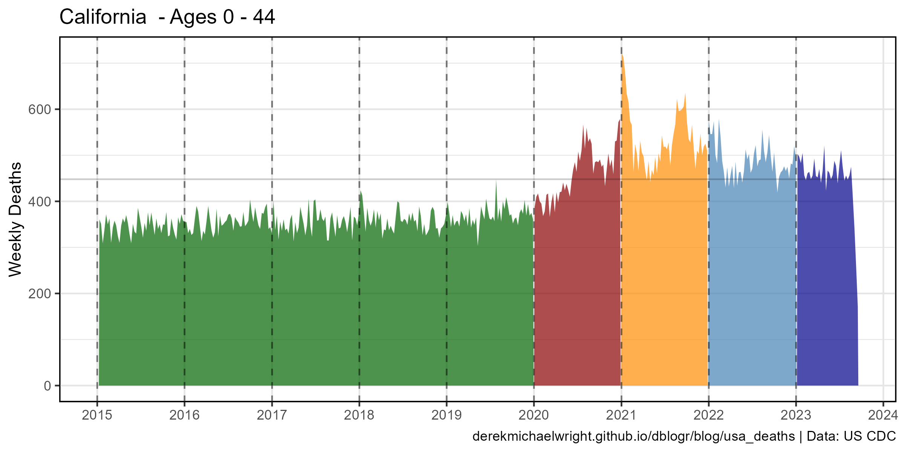

```{r}
mp <- ggWeeklyDeaths044(myArea = "California")
ggsave("usa_deaths_8_04.png", mp, width = 8, height = 4)
```

---

## Texas

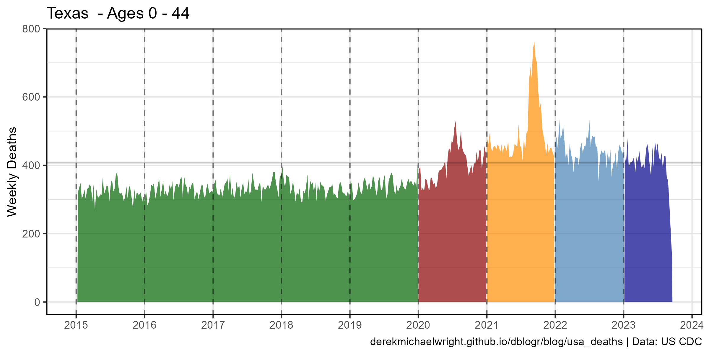

```{r}
mp <- ggWeeklyDeaths044(myArea = "Texas")
ggsave("usa_deaths_8_05.png", mp, width = 8, height = 4)
```

---

## Florida

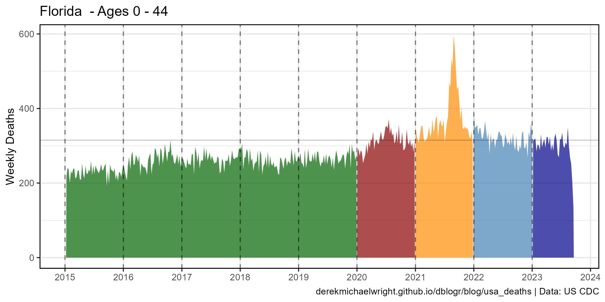

```{r}
mp <- ggWeeklyDeaths044(myArea = "Florida")
ggsave("usa_deaths_8_06.png", mp, width = 8, height = 4)
```

---

## Washington

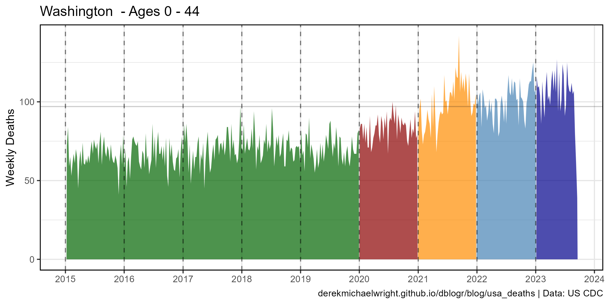

```{r}
mp <- ggWeeklyDeaths044(myArea = "Washington")
ggsave("usa_deaths_8_07.png", mp, width = 8, height = 4)
```

---

## Montana

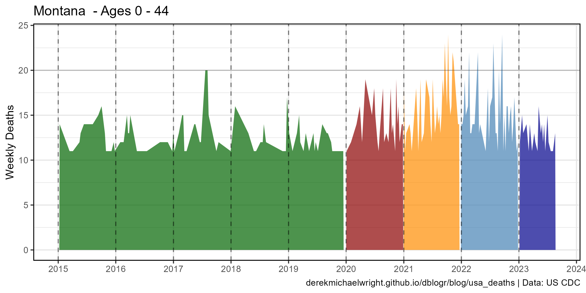

```{r}
mp <- ggWeeklyDeaths044(myArea = "Montana")
ggsave("usa_deaths_8_08.png", mp, width = 8, height = 4)
```

---

## North Dakota

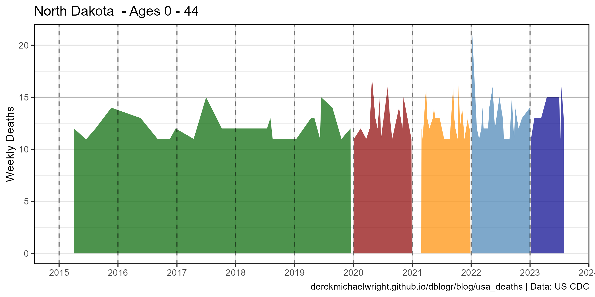

```{r}
mp <- ggWeeklyDeaths044(myArea = "North Dakota")
ggsave("usa_deaths_8_09.png", mp, width = 8, height = 4)
```

---

## South Dakota

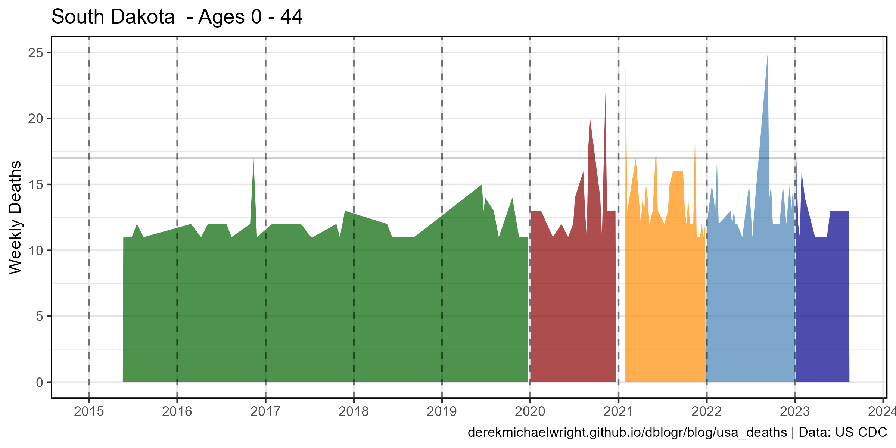

```{r}
mp <- ggWeeklyDeaths044(myArea = "South Dakota")
ggsave("usa_deaths_8_10.png", mp, width = 8, height = 4)
```

---
