```{r setup, include=FALSE}
knitr::opts_chunk$set(echo = TRUE, message = F, warning = F)
```

---

# Data

Drug overdoses, suicides & transportation related deaths

> - `r shiny::icon("globe")` [https://data.cdc.gov/NCHS/Early-Model-based-Provisional-Estimates-of-Drug-Ov/v2g4-wqg2](https://data.cdc.gov/NCHS/Early-Model-based-Provisional-Estimates-of-Drug-Ov/v2g4-wqg2){target="_blank"}
> - `r shiny::icon("save")` [data_usa_overdoses.csv](data_usa_overdoses.csv)

Extra

> - `r shiny::icon("globe")` [https://www.cdc.gov/nchs/nvss/vsrr/vsrr11-dashboard/index.htm](https://www.cdc.gov/nchs/nvss/vsrr/vsrr11-dashboard/index.htm){target="_blank"}
> - `r shiny::icon("globe")` [https://www.cdc.gov/nchs/nvss/vsrr/drug-overdose-data.htm](https://www.cdc.gov/nchs/nvss/vsrr/drug-overdose-data.htm){target="_blank"}

---

# Prepare Data

```{r echo = F}
dd <- read.csv("https://data.cdc.gov/api/views/v2g4-wqg2/rows.csv?accessType=DOWNLOAD")
write.csv(dd, "data_usa_overdoses.csv", row.names = F)
```

```{r class.source = "fold-show"}
# devtools::install_github("derekmichaelwright/agData")
library(agData)
```

---

# Prepare Data

```{r}
# Prep data
dd <- read.csv("data_usa_overdoses.csv") %>%
  rename(Area=State, Date=Week.Ending.Date) %>%
  mutate(Date = as.Date(Date, format = "%m/%d/%Y"))
# Remove states with no data
areas <- NULL
for(i in unique(dd$Area)) {
  xi <- dd %>% filter(Area == i)
  if(sum(!is.na(xi$Rolling.4.Week.Mean)) < 1) { areas <- c(areas, i) }
}
dd <- dd %>% filter(!Area %in% areas)
myCaption <- "derekmichaelwright.github.io/dblogr/ | Data: CDC\nNote: most recent years data may be incomplete"
```

---

# Weekly Overdoses {.tabset .tabset-pills}

## Plotting Function

```{r class.source = "fold-show"}
# Create plotting function
overdosePlot1 <- function(area = "United States") {
  # Prep data
  vv <- as.Date(c("2016-01-01","2017-01-01","2018-01-01",
                  "2019-01-01","2020-01-01","2021-01-01"))
  xx <- dd %>% filter(Outcome == "Drug Overdose") %>% 
    filter(Area %in% area)
  # Plot
  ggplot(xx, aes(x = Date, y = Rolling.4.Week.Mean)) +
    geom_col(size = 1, fill = "darkred", alpha = 0.8) +
    geom_vline(xintercept = vv, lty = 2, alpha = 0.5)  +
    facet_wrap(Area ~ ., scales = "free_y") +
    scale_x_date(date_breaks = "1 year", date_labels = "%Y", 
                 minor_breaks = "1 year") +
    theme_agData(legend.position = "bottom") +
    labs(title = "Drug Overdose Deaths",
         y = "Weekly Deaths (Rolling 4 Week Mean)", 
         x = NULL, caption = myCaption)
}
```

---

## United States {.active}
  
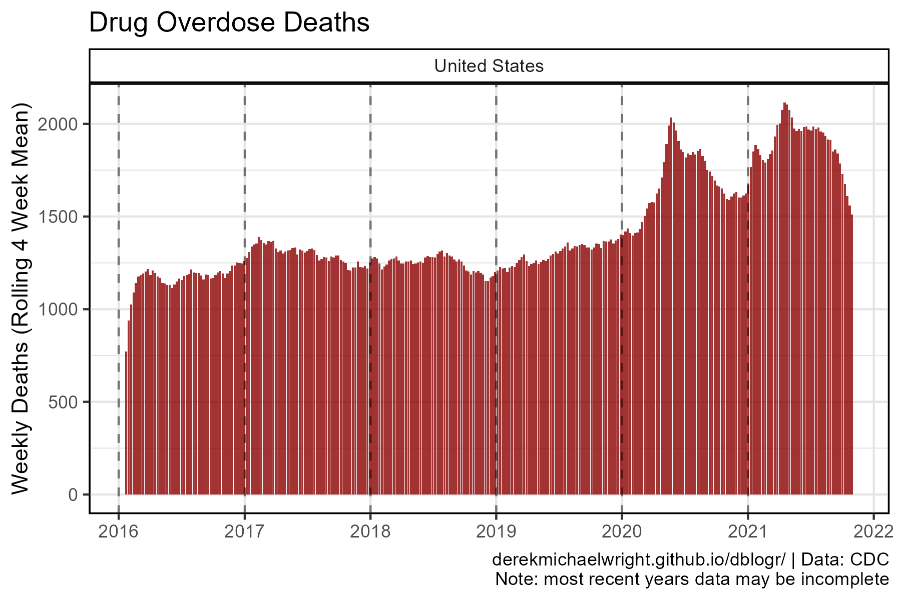
  
```{r}
mp <- overdosePlot1(area = "United States")
ggsave("usa_overdoses_1_01.png", mp, width = 6, height = 4)
```

```{r}
ggsave("featured.png", mp, width = 6, height = 4)
```

---

## All States
  

  
```{r}
mp <- overdosePlot1(area = unique(dd$Area))
ggsave("usa_overdoses_1_02.png", mp, width = 20, height = 10)
```

---

## Arizona
  
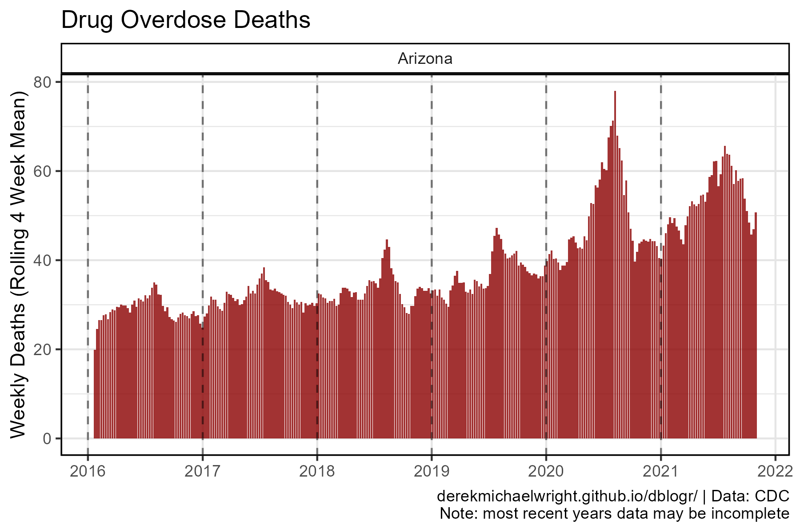
  
```{r}
mp <- overdosePlot1(area = "Arizona")
ggsave("usa_overdoses_1_03.png", mp, width = 6, height = 4)
```

---

## California
  

  
```{r}
mp <- overdosePlot1(area = "California")
ggsave("usa_overdoses_1_04.png", mp, width = 6, height = 4)
```

---

## Colorado
  

  
```{r}
mp <- overdosePlot1(area = "Colorado")
ggsave("usa_overdoses_1_05.png", mp, width = 6, height = 4)
```

---

## New York
  

  
```{r}
mp <- overdosePlot1(area = "New York")
ggsave("usa_overdoses_1_06.png", mp, width = 6, height = 4)
```

---

## Texas
  
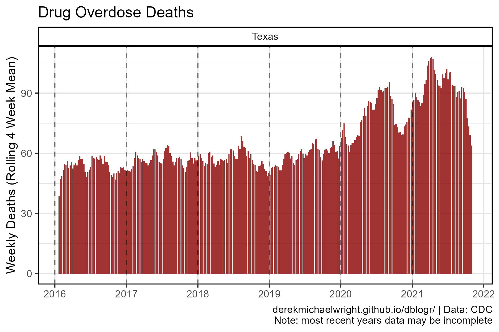
  
```{r}
mp <- overdosePlot1(area = "Texas")
ggsave("usa_overdoses_1_07.png", mp, width = 6, height = 4)
```

---

# Yearly Deaths {.tabset .tabset-pills}

## Plotting Function

```{r class.source = "fold-show"}
# Create plotting function
overdosePlot2 <- function(area = "United States") {
  # Prep data
  xx <- dd %>% 
    mutate(Year = substr(Date, 1, 4)) %>%
    filter(Area %in% area, Outcome == "Drug Overdose") %>% 
    group_by(Area, Year) %>% 
    summarise(Value = sum(Rolling.4.Week.Mean, na.rm = T)) %>%
    mutate(YearGroup = ifelse(Year < 2020, "Pre-Covid", "Covid"),
           YearGroup = factor(YearGroup, levels = c("Pre-Covid", "Covid")))
  myCols <- c(alpha("darkred",0.3), alpha("darkred",0.6))
  # Plot
  ggplot(xx, aes(x = Year, y = Value / 1000)) +
    geom_col(aes(fill = YearGroup), color = "black") +
    geom_label(aes(label = round(Value / 1000, 1)), vjust = 1) +
    facet_wrap(Area ~ ., scales = "free_y") +
    scale_fill_manual(name = NULL, values = myCols) +
    theme_agData_col(legend.position = "bottom") +
    labs(title = "Yearly Drug Overdose Deaths", y = "Thousand Deaths", x = NULL,
         caption = myCaption)
}
```

---

## United States {.active}
  
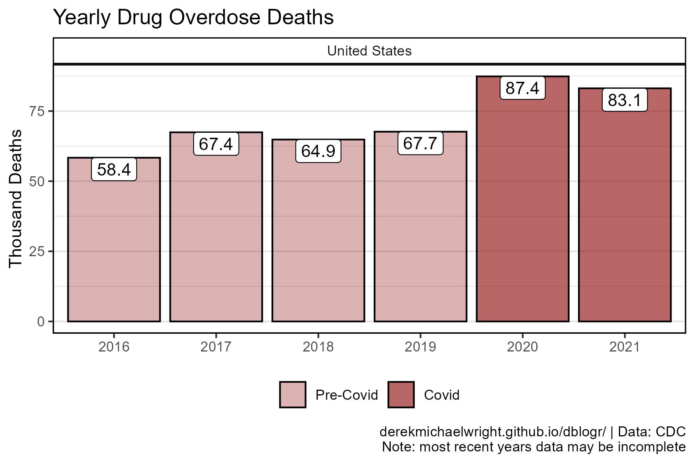
  
```{r}
mp <- overdosePlot2(area = "United States")
ggsave("usa_overdoses_2_01.png", mp, width = 6, height = 4)
```
  
---

## All States
  
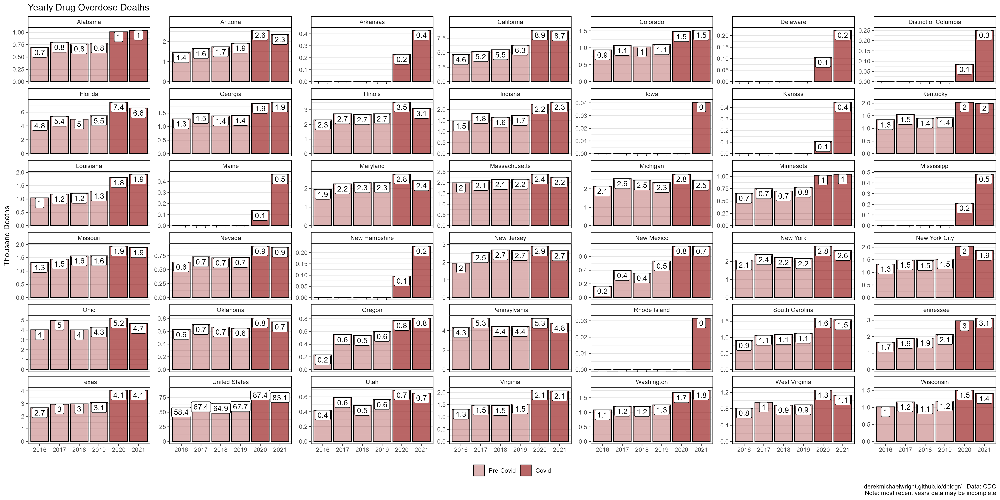
  
```{r}
mp <- overdosePlot2(area = unique(dd$Area))
ggsave("usa_overdoses_2_02.png", mp, width = 20, height = 10)
```

---

## Arizona
  
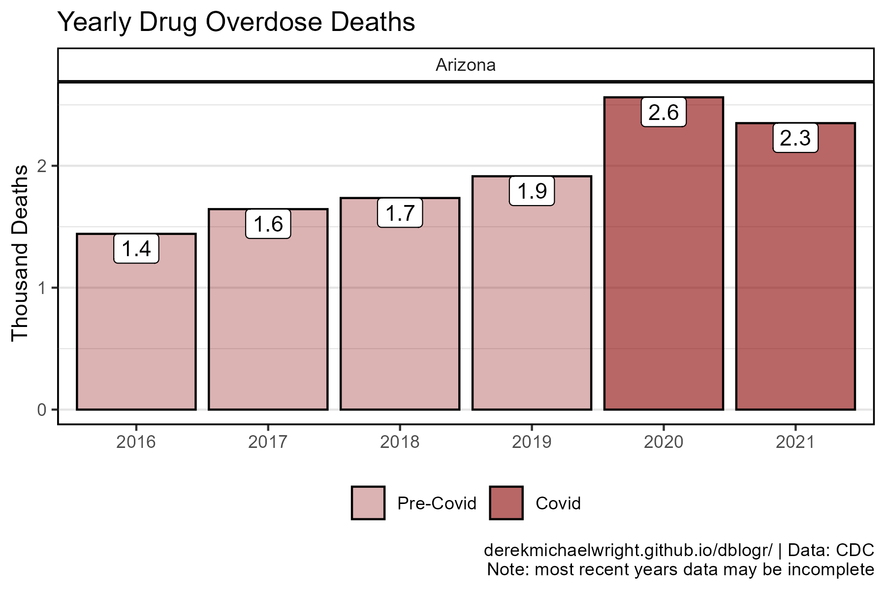
  
```{r}
mp <- overdosePlot2(area = "Arizona")
ggsave("usa_overdoses_2_03.png", mp, width = 6, height = 4)
```

---

## California
  
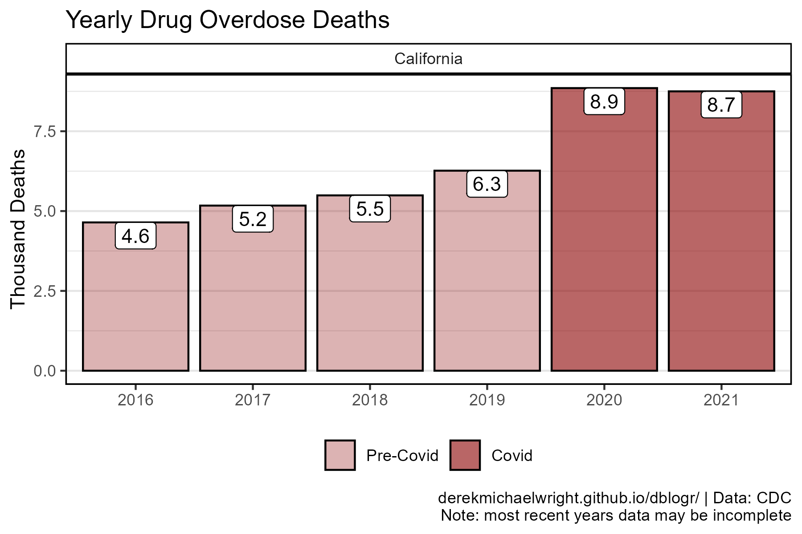
  
```{r}
mp <- overdosePlot2(area = "California")
ggsave("usa_overdoses_2_04.png", mp, width = 6, height = 4)
```

---

## Colorado
  
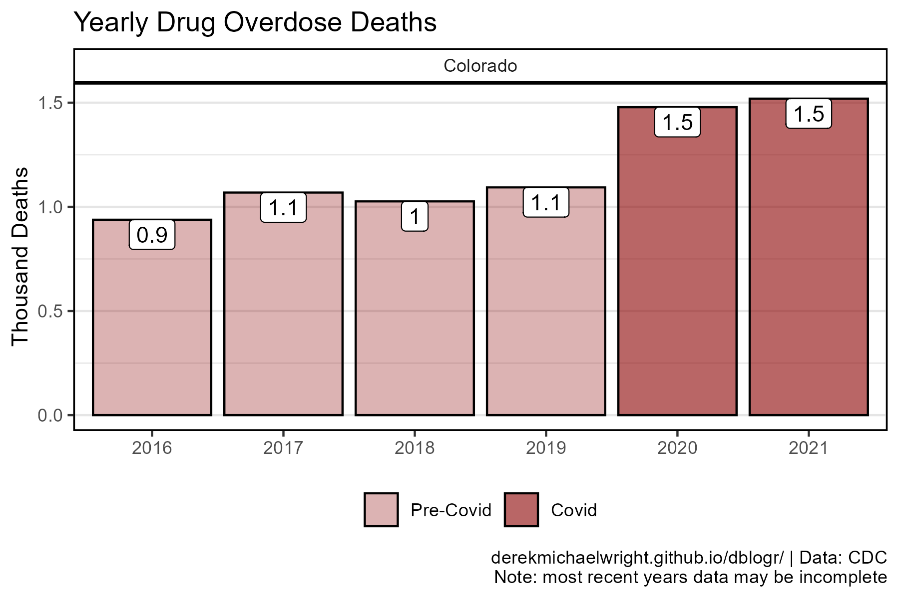
  
```{r}
mp <- overdosePlot2(area = "Colorado")
ggsave("usa_overdoses_2_05.png", mp, width = 6, height = 4)
```

---

## New York
  

  
```{r}
mp <- overdosePlot2(area = "New York")
ggsave("usa_overdoses_2_06.png", mp, width = 6, height = 4)
```

---

## Texas
  
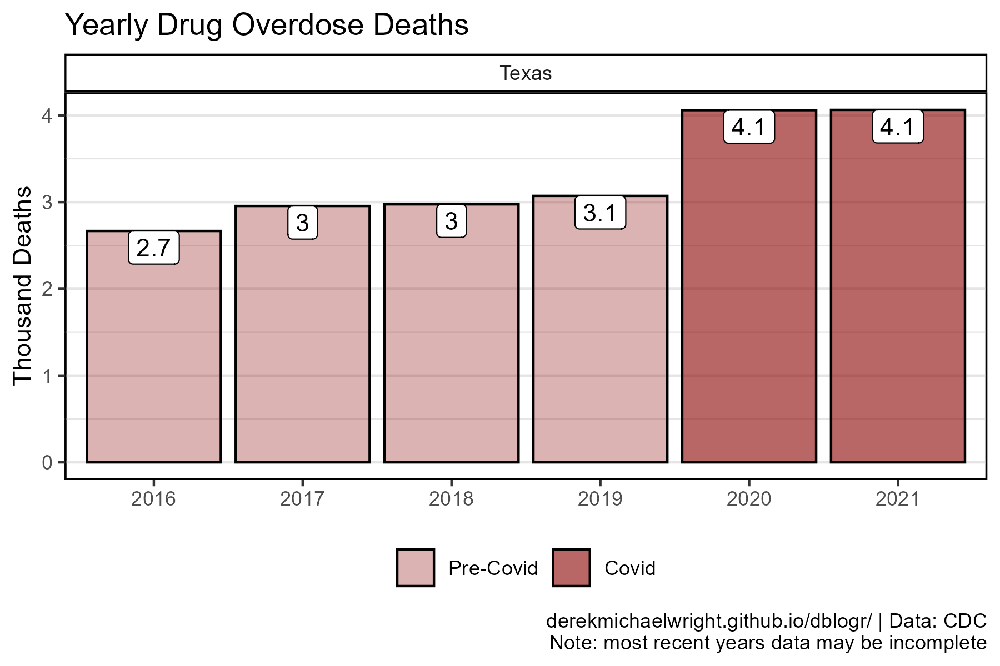
  
```{r}
mp <- overdosePlot2(area = "Texas")
ggsave("usa_overdoses_2_07.png", mp, width = 6, height = 4)
```

---

# Weekly Deaths {.tabset .tabset-pills}

## Plotting Function

```{r class.source = "fold-show"}
# Create plotting function
overdosePlot2 <- function(area = "Alaska") {
  # Prep data
  colors <- c("darkred", "darkorange", "darkgreen")
  vv <- as.Date(c("2016-01-01","2017-01-01","2018-01-01",
                  "2019-01-01","2020-01-01","2021-01-01"))
  xx <- dd %>% 
    filter(Area %in% area, Date > "2016-02-27")
  # Plot
  ggplot(xx, aes(x = Date, y = Rolling.4.Week.Mean, color = Outcome)) +
    geom_line(size = 1, alpha = 0.8) +
    geom_vline(xintercept = vv, lty = 2, alpha = 0.5) +
    facet_wrap(Area ~ ., scales = "free_y") +
    scale_color_manual(name = NULL, values = colors) +
    scale_x_date(date_breaks = "1 year", date_labels = "%Y", 
                 minor_breaks = "1 year") +
    theme_agData(legend.position = "bottom") +
    labs(y = "Weekly Deaths (Rolling 4 Week Mean)", x = NULL,
         caption = myCaption)
}
```

---

## United States {.active}
  
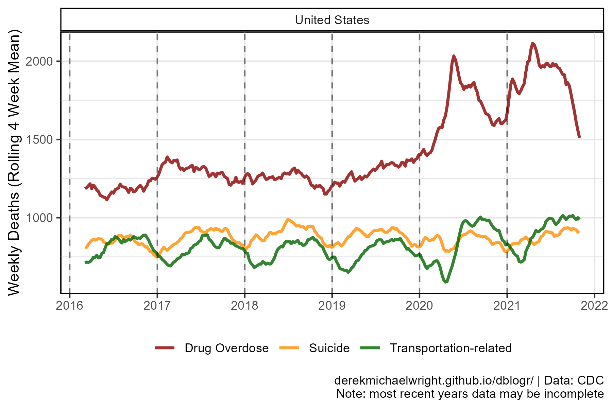
  
```{r}
mp <- overdosePlot2(area = "United States")
ggsave("usa_overdoses_3_01.png", mp, width = 6, height = 4)
```

---

## All States
  
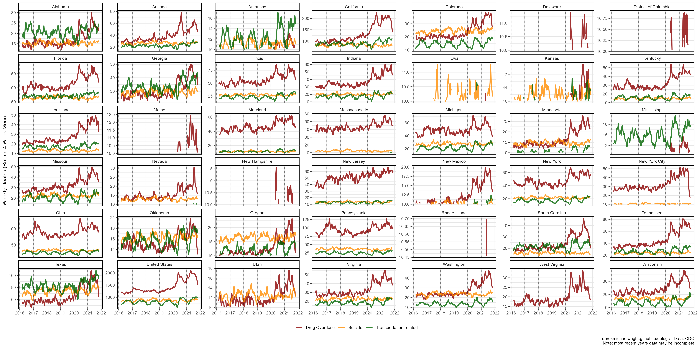
  
```{r}
mp <- overdosePlot2(area = unique(dd$Area))
ggsave("usa_overdoses_3_02.png", mp, width = 20, height = 10)
```

---

## Arizona
  
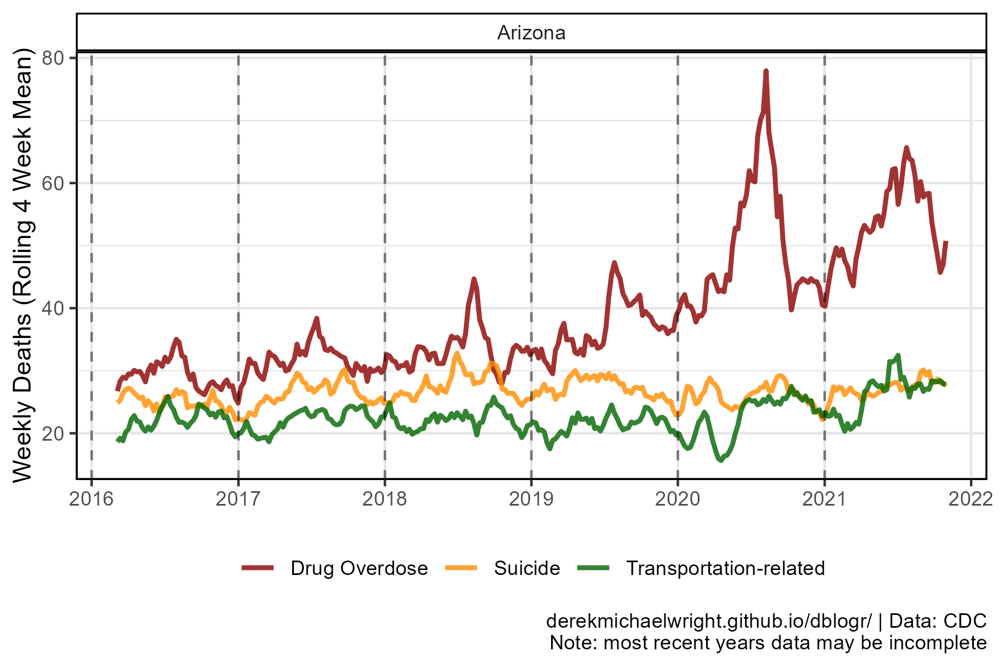
  
```{r}
mp <- overdosePlot2(area = "Arizona")
ggsave("usa_overdoses_3_03.png", mp, width = 6, height = 4)
```

---

## California
  
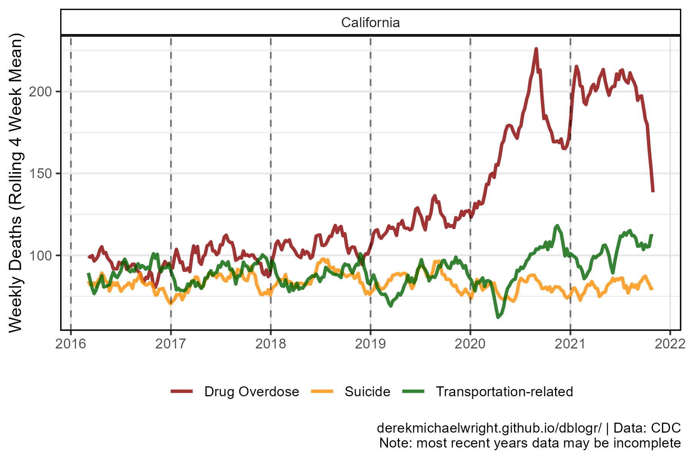
  
```{r}
mp <- overdosePlot2(area = "California")
ggsave("usa_overdoses_3_04.png", mp, width = 6, height = 4)
```

---

## Colorado
  
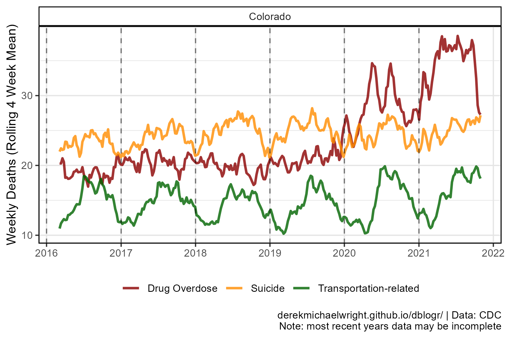
  
```{r}
mp <- overdosePlot2(area = "Colorado")
ggsave("usa_overdoses_3_05.png", mp, width = 6, height = 4)
```

---

## New York
  
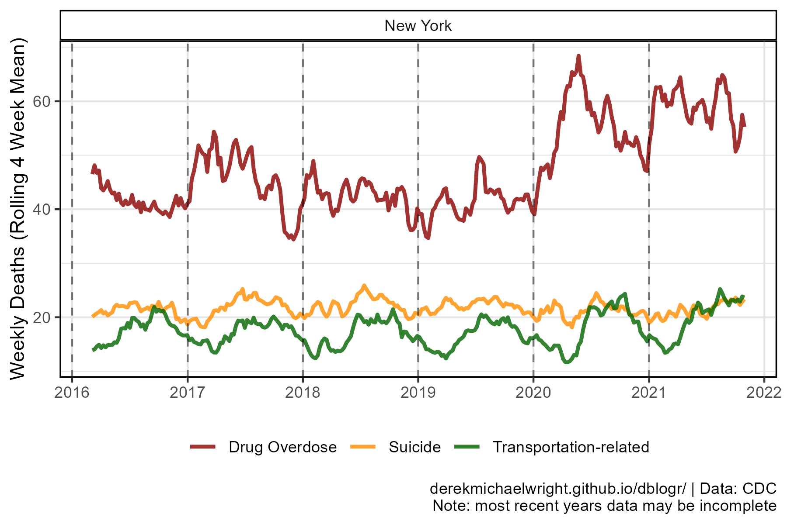
  
```{r}
mp <- overdosePlot2(area = "New York")
ggsave("usa_overdoses_3_06.png", mp, width = 6, height = 4)
```

---

## Texas
  

  
```{r}
mp <- overdosePlot2(area = "Texas")
ggsave("usa_overdoses_3_07.png", mp, width = 6, height = 4)
```

---
