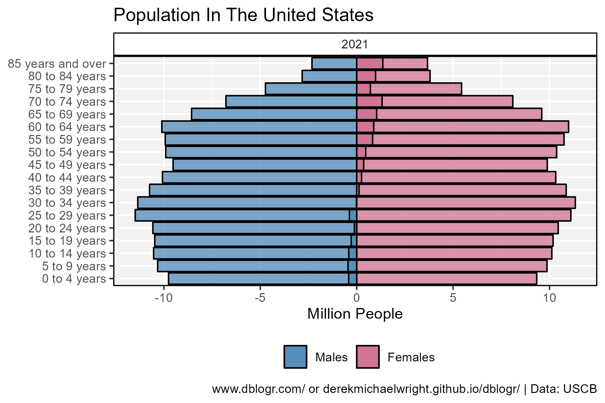
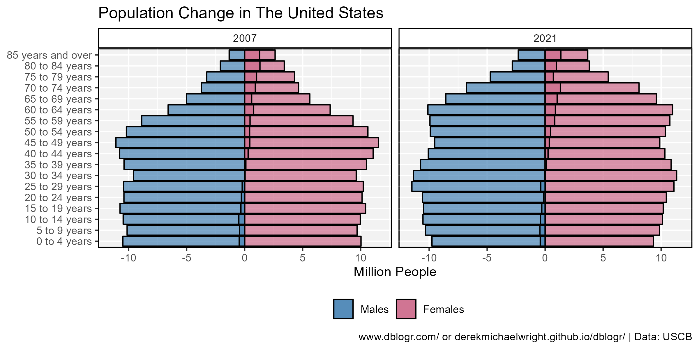
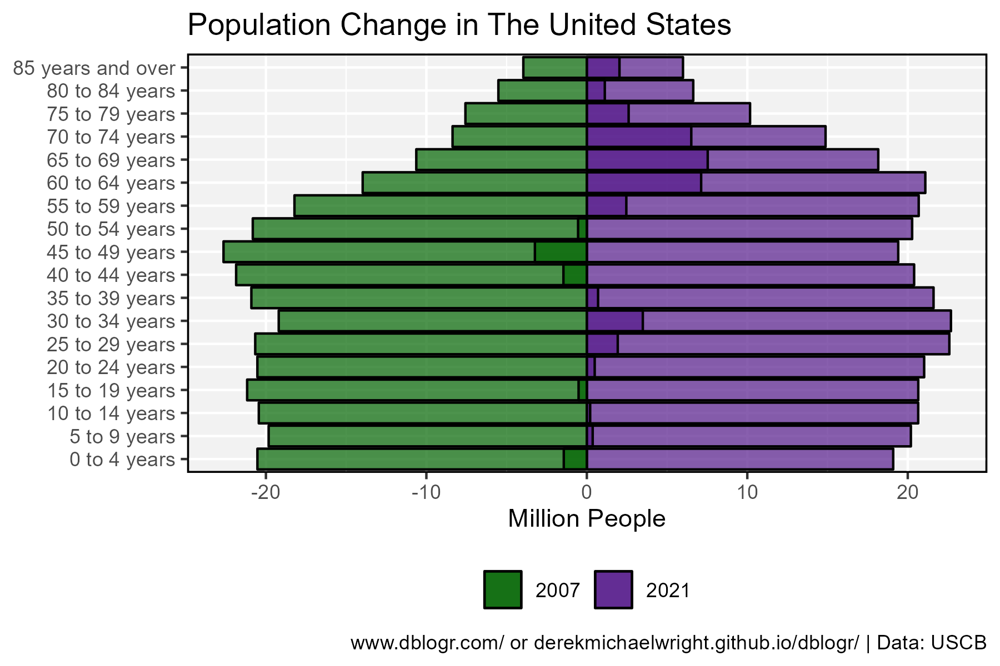

```{r setup, include=FALSE}
knitr::opts_chunk$set(echo = T, message = F, warning = F)
```

---

# Data

CDC age & sex tables

> - `r shiny::icon("globe")` https://www.census.gov/topics/population/age-and-sex/data/tables.html
> - `r shiny::icon("save")` [data_usa_population.csv](data_usa_population.csv)

---

# Prepare Data

```{r class.source = 'fold-show'}
# devtools::install_github("derekmichaelwright/agData")
library(agData)
library(readxl)
```

```{r}
# Prep data
myCaption <- "www.dblogr.com/ or derekmichaelwright.github.io/dblogr/ | Data: USCB"
myColorsMF <- c("steelblue", "palevioletred3")
myAges <- c("0 to 4 years", "5 to 9 years", "10 to 14 years", 
            "15 to 19 years", "20 to 24 years", "25 to 29 years",
            "30 to 34 years", "35 to 39 years", "40 to 44 years",
            "45 to 49 years", "50 to 54 years", "55 to 59 years",
            "60 to 64 years", "65 to 69 years", "70 to 74 years",
            "75 to 79 years", "80 to 84 years", "85 years and over")
#
fixSheet <- function(xx, myYear) { 
  colnames(xx) <- c("Age", "Both sexes", "Both sexes - Percent",
                    "Males", "Males - Percent",
                    "Females", "Females - Percent")
  xx <- xx %>% select(Age, `Both sexes`, Males, Females) %>%
    mutate(Age = gsub("\\.", "", Age),
           Year = myYear) %>%
    select(Year, everything()) %>%
    gather(Sex, Population, 3:ncol(.)) %>%
    mutate(Population = 1000 * Population)
  xx
}
xx <- read_xlsx("data_usa_population.xlsx", "2007", range = "A7:G25")
p1 <- bind_rows(
    read_xlsx("data_usa_population.xlsx", "2007", range = "A7:G25") %>% fixSheet(myYear = 2007),
    read_xlsx("data_usa_population.xlsx", "2008", range = "A7:G25") %>% fixSheet(myYear = 2008),
    read_xlsx("data_usa_population.xlsx", "2009", range = "A7:G25") %>% fixSheet(myYear = 2009),
    read_xlsx("data_usa_population.xlsx", "2010", range = "A7:G25") %>% fixSheet(myYear = 2010),
    read_xlsx("data_usa_population.xlsx", "2011", range = "A7:G25") %>% fixSheet(myYear = 2011),
    read_xlsx("data_usa_population.xlsx", "2012", range = "A7:G25") %>% fixSheet(myYear = 2012),
    read_xlsx("data_usa_population.xlsx", "2013", range = "A7:G25") %>% fixSheet(myYear = 2013),
    read_xlsx("data_usa_population.xlsx", "2014", range = "A7:G25") %>% fixSheet(myYear = 2014),
    read_xlsx("data_usa_population.xlsx", "2015", range = "A7:G25") %>% fixSheet(myYear = 2015),
    read_xlsx("data_usa_population.xlsx", "2016", range = "A7:G25") %>% fixSheet(myYear = 2016),
    read_xlsx("data_usa_population.xlsx", "2017", range = "A7:G25") %>% fixSheet(myYear = 2017),
    read_xlsx("data_usa_population.xlsx", "2018", range = "A7:G25") %>% fixSheet(myYear = 2018),
    read_xlsx("data_usa_population.xlsx", "2019", range = "A7:G25") %>% fixSheet(myYear = 2019),
    read_xlsx("data_usa_population.xlsx", "2020", range = "A7:G25") %>% fixSheet(myYear = 2020),
    read_xlsx("data_usa_population.xlsx", "2021", range = "A7:G25") %>% fixSheet(myYear = 2021) ) %>%
  mutate(Age = factor(Age, levels = myAges),
         Sex = factor(Sex, levels  = c("Both sexes", "Males", "Females")))
#
p2 <- bind_rows(read.csv("nation-populationpyramid-2000-2010-2020.csv"),
                read.csv("state-populationpyramid-2000-2010-2020.csv") )
```

---

# Population Pyramid 2021



```{r}
# Prep data
xx <- p1 %>% 
  filter(Year == 2021, Age != "Median age", Sex != "Both sexes") 
yy <- xx %>% spread(Sex, Population) %>% 
  mutate(Population = Females - Males,
         Sex = ifelse(Population < 0, "Males", "Females"))
xx <- xx %>% 
  mutate(Population = ifelse(Sex == "Males", -Population, Population))
# Plot
mp <- ggplot(xx, aes(y = Population / 1000000, x = Age, fill = Sex)) + 
  geom_col(color = "black", alpha = 0.7) +
  geom_col(data = yy, color = "black", alpha = 0.7) +
  scale_fill_manual(name = NULL, values = myColorsMF) +
  facet_grid(. ~ Year) + 
  theme_agData(legend.position = "bottom") + 
  labs(title = "Population In The United States", x = NULL, 
       y = "Million People", caption = myCaption) +
  coord_cartesian(ylim = c(-max(xx$Population), max(xx$Population))) +
  coord_flip()
ggsave("usa_population_01.png", mp, width = 6, height = 4)
```

```{r echo = F}
ggsave("featured.png", mp, width = 6, height = 4)
```

---

# Population Pyramid 2007 - 2021



```{r}
# Prep data
xx <- p1 %>% 
  filter(Year %in% c(2007, 2021), 
         Age != "Median age", Sex != "Both sexes") 
yy <- xx %>% spread(Sex, Population) %>% 
  mutate(Population = Females - Males,
         Sex = ifelse(Population < 0, "Males", "Females"))
xx <- xx %>% 
  mutate(Population = ifelse(Sex == "Males", -Population, Population))
# Plot
mp <- ggplot(xx, aes(y = Population / 1000000, x = Age, fill = Sex)) + 
  geom_col(color = "black", alpha = 0.7) +
  geom_col(data = yy, color = "black", alpha = 0.7) +
  scale_fill_manual(name = NULL, values = myColorsMF) +
  facet_grid(. ~ Year) + 
  theme_agData(legend.position = "bottom") + 
  labs(title = "Population Change in The United States", x = NULL, 
       y = "Million People", caption = myCaption) +
  coord_cartesian(ylim = c(-max(xx$Population), max(xx$Population))) +
  coord_flip()
ggsave("usa_population_02.png", mp, width = 8, height = 4)
```

---

# Dual Year Population Pyramid 2007 - 2021



```{r}
# Prep data
xx <- p1 %>% filter(Year %in% c(2007,2021), Sex == "Both sexes") 
yy <- xx %>% spread(Year, Population) %>%
  mutate(Population = `2021` - `2007`) %>%
  mutate(Year = ifelse(Population < 0, 2007, 2021),
         Year = factor(Year))
xx <- xx %>% 
  mutate(Population = ifelse(Year == 2007, -Population, Population),
         Year = factor(Year))
# Plot
mp <- ggplot(xx, aes(y = Population / 1000000, x = Age, fill = Year)) + 
  geom_col(color = "black", alpha = 0.7) +
  geom_col(data = yy, color = "black", alpha = 0.7) +
  scale_fill_manual(name = NULL, values = c("darkgreen","purple4")) +
  theme_agData(legend.position = "bottom") + 
  labs(title = "Population Change in The United States", x = NULL, 
       y = "Million People", caption = myCaption) +
  coord_cartesian(ylim = c(-max(xx$Population), max(xx$Population))) +
  coord_flip()
ggsave("usa_population_03.png", width = 6, height = 4)
```

---

# Median Age By Race

```{r}
myRaces1 <- c("White alone, not Hispanic or Latino",
             "Asian alone, not Hispanic or Latino", 
             "Black or African American alone, not Hispanic or Latino",
             "American Indian and Alaska Native alone, not Hispanic or Latino",
             "Hispanic or Latino")
myRaces2 <- c("White", "Asian", "Black", "Indigenous", "Hispanic")
myColors <- c("darkgreen", "darkblue", "black", "darkred", "darkorange")
#
xx <- p2 %>% filter(Group %in% myRaces, Nation == "United States") %>%
  mutate(Group = plyr::mapvalues(Group, myRaces1, myRaces2),
         Group = factor(Group, levels = myRaces2))
#
mp <- ggplot(xx, aes(y = Median.age, x = Year, color = Group)) + 
  geom_line() + geom_point() +
  scale_color_manual(name = NULL, values = myColors) +
  guides(color = guide_legend(ncol = 1)) +
  theme_agData() + 
  labs(title = "Population Change in The United States", 
       y = "Median Age", x = NULL, caption = myCaption)
ggsave("usa_population_04.png", width = 6, height = 4)
```

---
