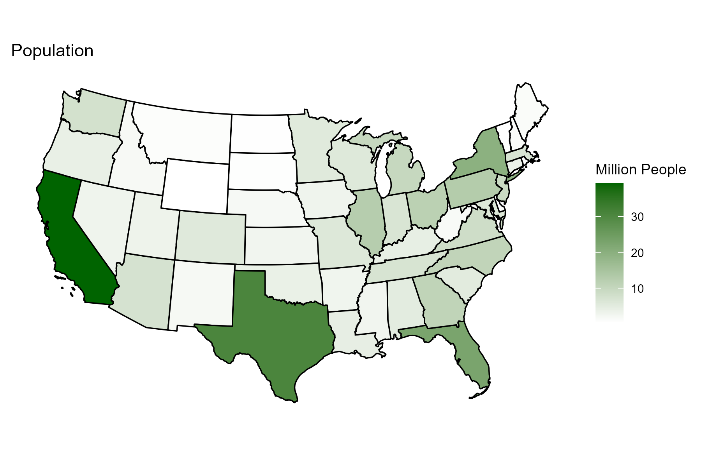

```{r setup, include=FALSE}
knitr::opts_chunk$set(echo = T, message = F, warning = F)
```

---

# Data

Census Bureau State Data

> - `r shiny::icon("globe")` https://www.census.gov/data/tables/time-series/demo/popest/2010s-state-total.html
> - `r shiny::icon("globe")` https://www2.census.gov/programs-surveys/popest/datasets/2020-2021/state/totals/
> - `r shiny::icon("globe")` https://www2.census.gov/programs-surveys/popest/datasets/2020-2022/state/totals/
> - `r shiny::icon("save")` [data_usa_population_state.csv](data_usa_population_state.csv)

Census Bureau Age & Sex Data

> - `r shiny::icon("globe")` https://www.census.gov/topics/population/age-and-sex/data/tables.html
> - `r shiny::icon("save")` [data_usa_population_age.csv](data_usa_population_age.csv)

---

# Prepare Data

```{r class.source = "fold-show"}
# devtools::install_github("derekmichaelwright/agData")
library(agData)
library(readxl)
library(usmap)
library(gganimate)
```

```{r echo = F, eval = F}
x1 <- read.csv("https://www2.census.gov/programs-surveys/popest/datasets/2010-2019/national/totals/nst-est2019-alldata.csv")
#d2 <- read.csv("https://www2.census.gov/programs-surveys/popest/datasets/2020-2022/state/totals/NST-EST2022-alldata.csv")
x2 <- read.csv("https://www2.census.gov/programs-surveys/popest/datasets/2020-2022/state/totals/NST-EST2022-ALLDATA.csv")
xx <- left_join(x1, x2, by = c("SUMLEV","REGION","DIVISION","STATE","NAME"))
write.csv(xx, "data_usa_population_state.csv", row.names = F)
```

```{r}
# Prep data
myCaption <- "www.dblogr.com/ or derekmichaelwright.github.io/dblogr/ | Data: USCB"
myColorsMF <- c("steelblue", "palevioletred3")
myAges <- c("0 to 4 years", "5 to 9 years", "10 to 14 years", 
            "15 to 19 years", "20 to 24 years", "25 to 29 years",
            "30 to 34 years", "35 to 39 years", "40 to 44 years",
            "45 to 49 years", "50 to 54 years", "55 to 59 years",
            "60 to 64 years", "65 to 69 years", "70 to 74 years",
            "75 to 79 years", "80 to 84 years", "85 years and over")
#
d1 <- read.csv("data_usa_population_state.csv")
#
fixSheet <- function(xx, myYear) { 
  colnames(xx) <- c("Age", "Both sexes", "Both sexes - Percent",
                    "Males", "Males - Percent",
                    "Females", "Females - Percent")
  xx <- xx %>% select(Age, `Both sexes`, Males, Females) %>%
    mutate(Age = gsub("\\.", "", Age),
           Year = myYear) %>%
    select(Year, everything()) %>%
    gather(Sex, Population, 3:ncol(.)) %>%
    mutate(Population = 1000 * Population)
  xx
}
#
d2 <- bind_rows(
    read_xlsx("data_usa_population_age.xlsx", "2007", range = "A7:G25") %>% fixSheet(myYear = 2007),
    read_xlsx("data_usa_population_age.xlsx", "2008", range = "A7:G25") %>% fixSheet(myYear = 2008),
    read_xlsx("data_usa_population_age.xlsx", "2009", range = "A7:G25") %>% fixSheet(myYear = 2009),
    read_xlsx("data_usa_population_age.xlsx", "2010", range = "A7:G25") %>% fixSheet(myYear = 2010),
    read_xlsx("data_usa_population_age.xlsx", "2011", range = "A7:G25") %>% fixSheet(myYear = 2011),
    read_xlsx("data_usa_population_age.xlsx", "2012", range = "A7:G25") %>% fixSheet(myYear = 2012),
    read_xlsx("data_usa_population_age.xlsx", "2013", range = "A7:G25") %>% fixSheet(myYear = 2013),
    read_xlsx("data_usa_population_age.xlsx", "2014", range = "A7:G25") %>% fixSheet(myYear = 2014),
    read_xlsx("data_usa_population_age.xlsx", "2015", range = "A7:G25") %>% fixSheet(myYear = 2015),
    read_xlsx("data_usa_population_age.xlsx", "2016", range = "A7:G25") %>% fixSheet(myYear = 2016),
    read_xlsx("data_usa_population_age.xlsx", "2017", range = "A7:G25") %>% fixSheet(myYear = 2017),
    read_xlsx("data_usa_population_age.xlsx", "2018", range = "A7:G25") %>% fixSheet(myYear = 2018),
    read_xlsx("data_usa_population_age.xlsx", "2019", range = "A7:G25") %>% fixSheet(myYear = 2019),
    read_xlsx("data_usa_population_age.xlsx", "2020", range = "A7:G25") %>% fixSheet(myYear = 2020),
    read_xlsx("data_usa_population_age.xlsx", "2021", range = "A7:G25") %>% fixSheet(myYear = 2021) ) %>%
  mutate(Age = factor(Age, levels = myAges),
         Sex = factor(Sex, levels  = c("Both sexes", "Males", "Females")))
```

---

# State Populations {.tabset .tabset-pills}

## 2022 Bar Chart


```{r}
# Prep data
xx <- d1 %>% filter(STATE != 0) %>% arrange(desc(POPESTIMATE2022)) %>%
  mutate(NAME = factor(NAME, levels = .$NAME))
# Plot
mp <- ggplot(xx, aes(y = POPESTIMATE2022 / 1000000, x = NAME)) +
  geom_col(fill = "darkgreen", alpha = 0.7) +
  theme_agData(axis.text.x = element_text(angle = 45, hjust = 1)) +
  labs(title = "Population By State", y = "Million People", x = NULL)
ggsave("usa_population_1_01.png", mp, width = 8, height = 4)
```


---

## Map



```{r}
# Prep data
xx <- d1 %>% rename(fips=STATE) %>% mutate(POPESTIMATE2022 = POPESTIMATE2022 / 1000000)
# Plot
mp <- plot_usmap(data = xx, values = "POPESTIMATE2022", exclude = c("AK","HI")) + 
  scale_fill_gradient(name = "x 1,000,000", 
                       high = "darkgreen", low = "white") + 
  theme(legend.position = "right") +
  labs(title = "Population By State")
ggsave("usa_population_1_02.png", mp, width = 6, height = 4, bg = "white")
```

---

## Animation


```{r eval = F}
# colnames(d1)
#
x1 <- d1 %>% select(Name=NAME, BasePop=POPESTIMATE2010)
xx <- d1 %>% 
  select(Name=NAME, fips=STATE,
         POPESTIMATE2010, POPESTIMATE2011, POPESTIMATE2012, POPESTIMATE2013,
         POPESTIMATE2014, POPESTIMATE2015, POPESTIMATE2016, POPESTIMATE2017,
         POPESTIMATE2018, POPESTIMATE2019, POPESTIMATE2020, POPESTIMATE2021,
         POPESTIMATE2022) %>%
  gather(Year, Population, 3:ncol(.)) %>% 
  left_join(x1, by = "Name") %>% 
  mutate(Year = as.integer(gsub("POPESTIMATE", "", Year)),
         Change = 100 * (Population - BasePop) / BasePop)
# Plot
mp <- plot_usmap(data = xx, values = "Change", exclude = c("AK","HI")) + 
  scale_fill_gradient2(name = "%", 
                       high = "darkgreen", mid = "white", low = "darkred") + 
  theme(legend.position = "right",
        plot.background = ) + 
  labs(title = paste("Year =", "{frame_time}"), subtitle = "Percent Change Since 2010") +
  transition_time(Year)
anim_save("usa_population_state_gif_01.gif", mp,
          nframes = 300, fps = 10, end_pause = 100, 
          width = 600, height = 400, res = 100)
```

---

## CA, NY, TX & FL


```{r}
# Prep data
myStates <- c("California", "New York", "Texas", "Florida")
myColors <- c("darkgreen", "steelblue", "darkred", "darkorange")
xx <- d1 %>% 
  filter(NAME %in% myStates) %>%
  select(NAME, NPOPCHG_2013, NPOPCHG_2014, NPOPCHG_2015, NPOPCHG_2016, 
         NPOPCHG_2017, NPOPCHG_2018, NPOPCHG_2019, NPOPCHG_2020, NPOPCHG_2021,
         NPOPCHG_2022) %>%
  gather(Year, Value, 2:ncol(.)) %>%
  mutate(Year = as.factor(substr(Year, 9, 12)),
         NAME = factor(NAME, levels = myStates))
# Plot
mp <- ggplot(xx, aes(x = Year, Value / 100000, fill = NAME)) + 
  geom_bar(stat = "identity", color = "black", alpha = 0.7) +
  facet_grid(. ~ NAME) +
  scale_fill_manual(values = myColors) +
  theme_agData(legend.position = "none",
               axis.text.x = element_text(angle = 45, hjust = 1)) +
  labs(title = "Population Change", x = NULL, 
       y = "Hundred Thousand People", caption = myCaption)
ggsave("usa_population_1_03.png", mp, width = 10, height = 6)
```

---

# Population Change {.tabset .tabset-pills}

## Plotting Function

```{r class.source = "fold-show"}
# Create plotting function
ggStatePop <- function(myTrait, myTitle, myFacet, myLims = 525) {
  xx <- d1 %>% 
    filter(SUMLEV == 40) %>%
    arrange(get(myTrait)) %>%
    mutate(NAME = factor(NAME, levels = .$NAME))
  # Plot
  mp <- ggplot(xx, aes(x = NAME, y = get(myTrait) / 1000)) +
    geom_bar(stat = "identity", color = "black", lwd = 0.4,
             fill = "steelblue", alpha = 0.7) +
    facet_grid(. ~ paste(myFacet)) +
    ylim(c(-myLims, myLims)) +
    coord_flip() +
    theme_agData(legend.position = "none") +
    labs(title = myTitle, x = NULL, 
         y = "Thousand People", caption = myCaption)
}
```

---

## 2022 {.active}


```{r}
# Plot
mp <- ggStatePop("NPOPCHG_2022", "Population Change", "2022")
ggsave("usa_population_2_01.png", mp, width = 4, height = 6)
```

---

## 2013


```{r}
# Plot
mp <- ggStatePop("NPOPCHG_2022", "Population Change", "2023")
ggsave("usa_population_2_02.png", mp, width = 4, height = 6)
```

---

# Population Pyramid {.tabset .tabset-pills}

## 2021


```{r}
# Prep data
xx <- d2 %>% 
  filter(Year == 2021, Age != "Median age", Sex != "Both sexes") 
yy <- xx %>% spread(Sex, Population) %>% 
  mutate(Population = Females - Males,
         Sex = ifelse(Population < 0, "Males", "Females"))
xx <- xx %>% 
  mutate(Population = ifelse(Sex == "Males", -Population, Population))
# Plot
mp <- ggplot(xx, aes(y = Population / 1000000, x = Age, fill = Sex)) + 
  geom_col(color = "black", alpha = 0.7) +
  geom_col(data = yy, color = "black", alpha = 0.7) +
  scale_fill_manual(name = NULL, values = myColorsMF) +
  facet_grid(. ~ Year) + 
  theme_agData(legend.position = "bottom") + 
  labs(title = "Population In The United States", x = NULL, 
       y = "Million People", caption = myCaption) +
  coord_cartesian(ylim = c(-max(xx$Population), max(xx$Population))) +
  coord_flip()
ggsave("usa_population_3_01.png", mp, width = 6, height = 4)
```

```{r echo = F}
ggsave("featured.png", mp, width = 6, height = 4)
```

---

## 2007 - 2021


```{r}
# Prep data
xx <- d2 %>% 
  filter(Year %in% c(2007, 2021), 
         Age != "Median age", Sex != "Both sexes") 
yy <- xx %>% spread(Sex, Population) %>% 
  mutate(Population = Females - Males,
         Sex = ifelse(Population < 0, "Males", "Females"))
xx <- xx %>% 
  mutate(Population = ifelse(Sex == "Males", -Population, Population))
# Plot
mp <- ggplot(xx, aes(y = Population / 1000000, x = Age, fill = Sex)) + 
  geom_col(color = "black", alpha = 0.7) +
  geom_col(data = yy, color = "black", alpha = 0.7) +
  scale_fill_manual(name = NULL, values = myColorsMF) +
  facet_grid(. ~ Year) + 
  theme_agData(legend.position = "bottom") + 
  labs(title = "Population Change in The United States", x = NULL, 
       y = "Million People", caption = myCaption) +
  coord_cartesian(ylim = c(-max(xx$Population), max(xx$Population))) +
  coord_flip()
ggsave("usa_population_3_02.png", mp, width = 8, height = 4)
```

---

## Dual Year Population Pyramid 2007 - 2021


```{r}
# Prep data
xx <- d2 %>% filter(Year %in% c(2007,2021), Sex == "Both sexes") 
yy <- xx %>% spread(Year, Population) %>%
  mutate(Population = `2021` - `2007`) %>%
  mutate(Year = ifelse(Population < 0, 2007, 2021),
         Year = factor(Year))
xx <- xx %>% 
  mutate(Population = ifelse(Year == 2007, -Population, Population),
         Year = factor(Year))
# Plot
mp <- ggplot(xx, aes(y = Population / 1000000, x = Age, fill = Year)) + 
  geom_col(color = "black", alpha = 0.7) +
  geom_col(data = yy, color = "black", alpha = 0.7) +
  scale_fill_manual(name = NULL, values = c("darkgreen","purple4")) +
  theme_agData(legend.position = "bottom") + 
  labs(title = "Population Change in The United States", x = NULL, 
       y = "Million People", caption = myCaption) +
  coord_cartesian(ylim = c(-max(xx$Population), max(xx$Population))) +
  coord_flip()
ggsave("usa_population_3_03.png", mp, width = 6, height = 4)
```

---

# Bonus - US elections {.tabset .tabset-pills}

> - `r shiny::icon("globe")` https://en.wikipedia.org/wiki/2024_United_States_elections
> - `r shiny::icon("save")` [data_usa_population_age.csv](data_usa_population_age.csv)


## Dodged

```{r}
# Prep data
myPartyColors <- c("darkblue","darkred","darkgreen")
xx <- read.csv("data_us_elections.csv") %>% 
  mutate(Party = factor(Party, levels = c("Dem","Rep","Other")),
         Year = factor(Year))
# Plot
mp <- ggplot(xx, aes(x = Year, y = Votes / 1000000, fill = Party)) +
  geom_col(position = "dodge", color = "black", lwd = 0.2, alpha = 0.7) + 
  scale_fill_manual(values = myPartyColors) +
  theme_agData(legend.position = "bottom") +
  labs(title = "Votes in US Elections", x = NULL, y = "Million Votes")
ggsave("usa_population_4_01.png", mp, width = 6, height = 4)
```

---

## Stacked

```{r}
# Plot
mp <- ggplot(xx, aes(x = Year, y = Votes / 1000000, fill = Party)) +
  geom_col(color = "black", lwd = 0.2, alpha = 0.7) + 
  scale_fill_manual(values = myPartyColors) +
  theme_agData(legend.position = "bottom") +
  labs(title = "Votes in US Elections", x = NULL, y = "Million Votes")
ggsave("usa_population_4_02.png", mp, width = 6, height = 4)
```

---

## Facetted

```{r}
mp <- ggplot(xx, aes(x = Party, y = Votes / 1000000, fill = Party)) +
  geom_col(color = "black", alpha = 0.7) + 
  geom_text(aes(label = Candidate), angle = 90, y = 20) +
  facet_grid(. ~ Year) +
  scale_fill_manual(values = myPartyColors) +
  theme_agData(legend.position = "bottom",
               axis.text.x = element_blank(),
               axis.ticks.x = element_blank()) +
  labs(title = "US Election Results", x = NULL, y = "Million Votes")
ggsave("usa_population_4_03.png", mp, width = 6, height = 4)
```

---

```{r echo = F, eval = F}
# Median Age By Race

#
#
d3 <- bind_rows(read.csv("nation-populationpyramid-2000-2010-2020.csv"),
                read.csv("state-populationpyramid-2000-2010-2020.csv") )

myRaces1 <- c("White alone, not Hispanic or Latino",
             "Asian alone, not Hispanic or Latino", 
             "Black or African American alone, not Hispanic or Latino",
             "American Indian and Alaska Native alone, not Hispanic or Latino",
             "Hispanic or Latino")
myRaces2 <- c("White", "Asian", "Black", "Indigenous", "Hispanic")
myColors <- c("darkgreen", "darkblue", "black", "darkred", "darkorange")
#
xx <- d3 %>% filter(Group %in% myRaces1, Nation == "United States") %>%
  mutate(Group = plyr::mapvalues(Group, myRaces1, myRaces2),
         Group = factor(Group, levels = myRaces2))
#
mp <- ggplot(xx, aes(y = Median.age, x = Year, color = Group)) + 
  geom_line() + geom_point() +
  scale_color_manual(name = NULL, values = myColors) +
  guides(color = guide_legend(ncol = 1)) +
  theme_agData() + 
  labs(title = "Population Change in The United States", 
       y = "Median Age", x = NULL, caption = myCaption)
ggsave("usa_population_4_01.png", width = 6, height = 4)
```

```{r echo = F, eval = F}
# Bonus - Rural Urban Voting

#> - `r shiny::icon("globe")` https://www.cambridge.org/core/journals/perspectives-on-politics/article/sequential-polarization-the-development-of-the-ruralurban-political-divide-19762020/ED2077E0263BC149FED8538CD9B27109
#> - `r shiny::icon("save")` [rural_urban.csv](rural_urban.csv)

# Prep data
xx <- read.csv("rural_urban.csv") %>%
  gather(Type, Value, Rural, Urban) %>%
  mutate(Value = 100 * Value)
# Plot
mp <- ggplot(xx, aes(x = Year, y = Value, color = Type)) +
  geom_line(size = 2) + 
  geom_label(aes(label = Value), size = 2.5, label.padding = unit(0.1, "lines")) +
  scale_color_manual(name = NULL, values = c("darkred", "darkblue")) +
  scale_x_continuous(breaks = unique(xx$Year), minor_breaks = unique(xx$Year)) +
  theme_agData(legend.position = "bottom") +
  labs(x = "Year (Election)", 
       y = "Percent of Votes Going to\nRepublicans Candidate (County-Level)",
       caption = "www.dblogr.com/ or derekmichaelwright.github.io/dblogr/ | Data: Brown & Mettler (2023)")
ggsave("usa_population_4_02.png", width = 7, height = 4)
```
