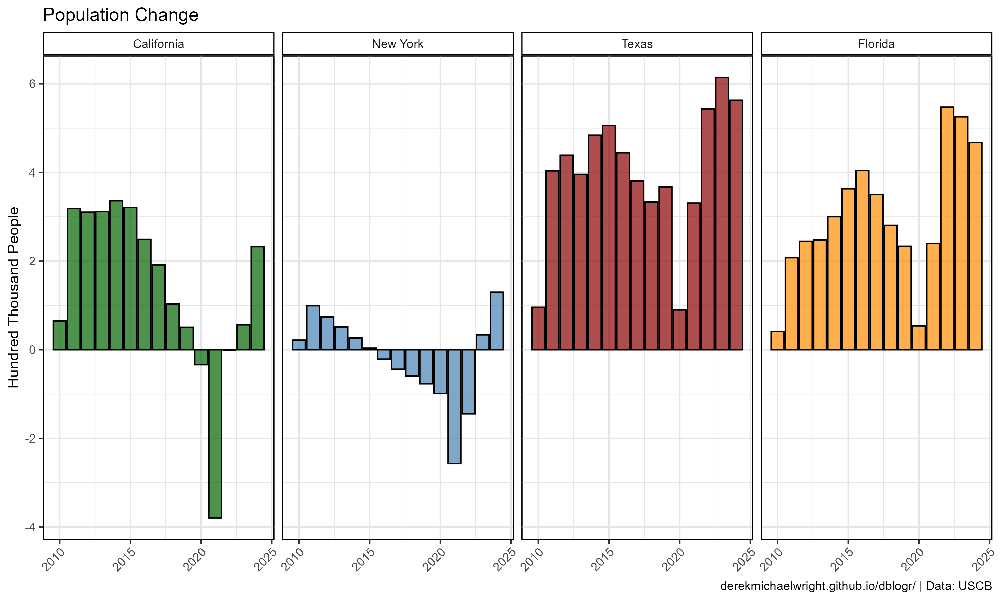
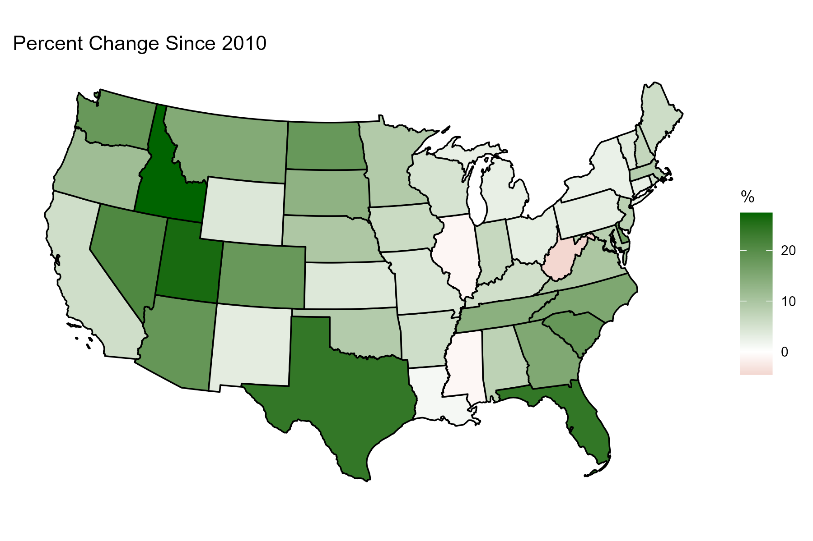
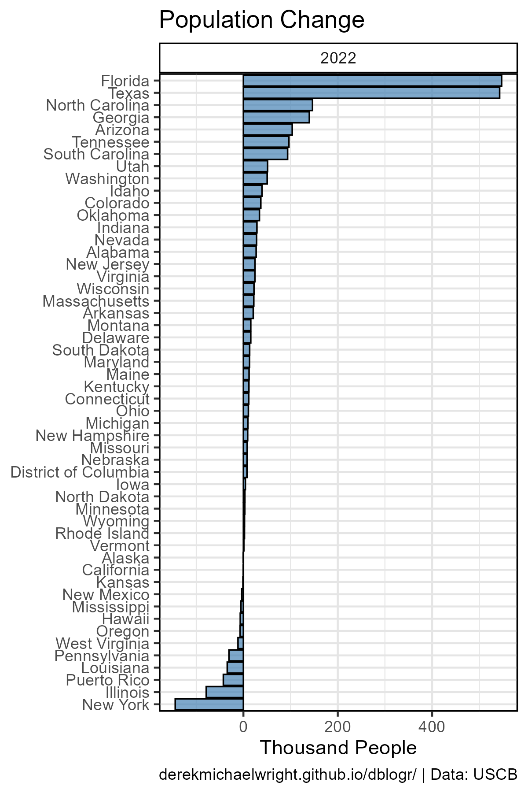
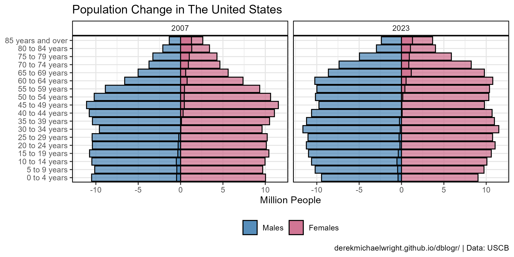
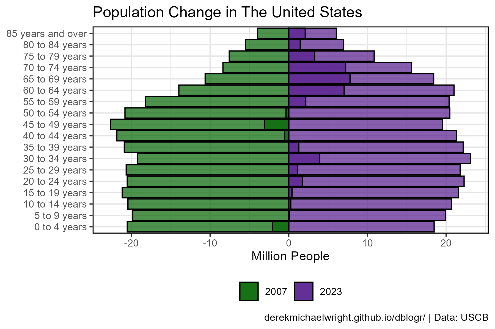

```{r setup, include=FALSE}
knitr::opts_chunk$set(echo = T, message = F, warning = F)
```

---

# Data

Census Bureau State Data

> - `r shiny::icon("globe")` [https://www.census.gov/data/tables/time-series/demo/popest/2010s-state-total.html](https://www.census.gov/data/tables/time-series/demo/popest/2010s-state-total.html){target="_blank"}
> - `r shiny::icon("globe")` [https://www2.census.gov/programs-surveys/popest/datasets/2020-2024/state/totals/](https://www2.census.gov/programs-surveys/popest/datasets/2020-2024/state/totals/){target="_blank"}
> - `r shiny::icon("save")` [data_usa_population_state.csv](data_usa_population_state.csv)

Census Bureau Age & Sex Data

> - `r shiny::icon("globe")` [https://www.census.gov/topics/population/age-and-sex/data/tables.html](https://www.census.gov/topics/population/age-and-sex/data/tables.html){target="_blank"}
> - `r shiny::icon("save")` [data_usa_population_age.csv](data_usa_population_age.csv)

---

# Prepare Data

```{r class.source = "fold-show"}
# devtools::install_github("derekmichaelwright/agData")
library(agData)
library(readxl)
library(usmap)
library(gganimate)
```

```{r echo = F, eval = F}
x1 <- read.csv("https://www2.census.gov/programs-surveys/popest/datasets/2010-2019/national/totals/nst-est2019-alldata.csv")
#d2 <- read.csv("https://www2.census.gov/programs-surveys/popest/datasets/2020-2022/state/totals/NST-EST2022-alldata.csv")
x2 <- read.csv("https://www2.census.gov/programs-surveys/popest/datasets/2020-2024/state/totals/NST-EST2024-ALLDATA.csv")
xx <- left_join(x1, x2, by = c("SUMLEV","REGION","DIVISION","STATE","NAME"))
write.csv(xx, "data_usa_population_state.csv", row.names = F)
```

```{r}
# Prep data
myCaption <- "derekmichaelwright.github.io/dblogr/ | Data: USCB"
myColorsMF <- c("steelblue", "palevioletred3")
myAges <- c("0 to 4 years", "5 to 9 years", "10 to 14 years", 
            "15 to 19 years", "20 to 24 years", "25 to 29 years",
            "30 to 34 years", "35 to 39 years", "40 to 44 years",
            "45 to 49 years", "50 to 54 years", "55 to 59 years",
            "60 to 64 years", "65 to 69 years", "70 to 74 years",
            "75 to 79 years", "80 to 84 years", "85 years and over")
#
# Population demographics
#
d1 <- read.csv("data_usa_population_state.csv") %>%
  gather(Year, Value, 6:ncol(.)) %>%
  mutate(Measurement = substr(Year, 1, regexpr("20", Year)-1),
         Measurement = gsub("_", "", Measurement),
         Year = substr(Year, regexpr("20", Year), regexpr("20", Year)+3),
         Year = as.numeric(Year))
#
# by Sex
#
fixSheet <- function(xx, myYear) { 
  colnames(xx) <- c("Age", "Both sexes", "Both sexes - Percent",
                    "Males", "Males - Percent",
                    "Females", "Females - Percent")
  xx <- xx %>% select(Age, `Both sexes`, Males, Females) %>%
    mutate(Age = gsub("\\.", "", Age),
           Year = myYear) %>%
    select(Year, everything()) %>%
    gather(Sex, Population, 3:ncol(.)) %>%
    mutate(Population = 1000 * Population)
  xx
}
#
d2 <- bind_rows(
    read_xlsx("data_usa_population_age.xlsx", "2007", range = "A7:G25") %>% fixSheet(myYear = 2007),
    read_xlsx("data_usa_population_age.xlsx", "2008", range = "A7:G25") %>% fixSheet(myYear = 2008),
    read_xlsx("data_usa_population_age.xlsx", "2009", range = "A7:G25") %>% fixSheet(myYear = 2009),
    read_xlsx("data_usa_population_age.xlsx", "2010", range = "A7:G25") %>% fixSheet(myYear = 2010),
    read_xlsx("data_usa_population_age.xlsx", "2011", range = "A7:G25") %>% fixSheet(myYear = 2011),
    read_xlsx("data_usa_population_age.xlsx", "2012", range = "A7:G25") %>% fixSheet(myYear = 2012),
    read_xlsx("data_usa_population_age.xlsx", "2013", range = "A7:G25") %>% fixSheet(myYear = 2013),
    read_xlsx("data_usa_population_age.xlsx", "2014", range = "A7:G25") %>% fixSheet(myYear = 2014),
    read_xlsx("data_usa_population_age.xlsx", "2015", range = "A7:G25") %>% fixSheet(myYear = 2015),
    read_xlsx("data_usa_population_age.xlsx", "2016", range = "A7:G25") %>% fixSheet(myYear = 2016),
    read_xlsx("data_usa_population_age.xlsx", "2017", range = "A7:G25") %>% fixSheet(myYear = 2017),
    read_xlsx("data_usa_population_age.xlsx", "2018", range = "A7:G25") %>% fixSheet(myYear = 2018),
    read_xlsx("data_usa_population_age.xlsx", "2019", range = "A7:G25") %>% fixSheet(myYear = 2019),
    read_xlsx("data_usa_population_age.xlsx", "2020", range = "A7:G25") %>% fixSheet(myYear = 2020),
    read_xlsx("data_usa_population_age.xlsx", "2021", range = "A7:G25") %>% fixSheet(myYear = 2021),
    read_xlsx("data_usa_population_age.xlsx", "2022", range = "A7:G25") %>% fixSheet(myYear = 2022),
    read_xlsx("data_usa_population_age.xlsx", "2023", range = "A7:G25") %>% fixSheet(myYear = 2023)) %>%
  mutate(Age = factor(Age, levels = myAges),
         Sex = factor(Sex, levels  = c("Both sexes", "Males", "Females")))
```

---

# State Populations {.tabset .tabset-pills}

## 2022 Bar Chart


```{r}
# Prep data
xx <- d1 %>% 
  filter(STATE != 0, Year == 2023, Measurement == "POPESTIMATE") %>% 
  arrange(desc(Value)) %>%
  mutate(NAME = factor(NAME, levels = .$NAME))
# Plot
mp <- ggplot(xx, aes(y = Value / 1000000, x = NAME)) +
  geom_col(fill = "darkgreen", alpha = 0.7) +
  theme_agData(axis.text.x = element_text(angle = 45, hjust = 1)) +
  labs(title = "2023 Population", y = "Million People", x = NULL)
ggsave("usa_population_1_01.png", mp, width = 8, height = 4)
```


---

## Map


```{r}
# Prep data
xx <- d1 %>% 
  filter(STATE != 0, Year == 2023, Measurement == "POPESTIMATE") %>%
  rename(fips=STATE) %>% 
  mutate(Value = Value / 1000000)
# Plot
mp <- plot_usmap(data = xx, values = "Value", exclude = c("AK","HI")) + 
  scale_fill_gradient(name = "Million People", 
                       high = "darkgreen", low = "white") + 
  theme(legend.position = "right") +
  labs(title = "Population")
ggsave("usa_population_1_02.png", mp, width = 6, height = 4, bg = "white")
```

---

# Population Change {.tabset .tabset-pills}

## 2021


```{r}
# Prep data
xx <- d1 %>% 
  filter(STATE != 0, Year == 2021, Measurement == "NPOPCHG") %>%
  select(NAME, fips=STATE, Year, Value) %>%
  mutate(Value = Value / 1000)
# Plot 2024
mp <- plot_usmap(data = xx, values = "Value", exclude = c("AK","HI")) + 
  scale_fill_gradient2(name = "Thousand People", 
                       high = "darkgreen", mid = "white", low = "darkred") + 
  theme(legend.position = "right",
        plot.background = ) + 
  labs(title = "Population Change 2021")
ggsave("usa_population_2_01.png", mp, width = 6, height = 4, bg = "white")
```

---

## Animation


```{r eval = F}
# Prep data
xx <- d1 %>% 
  filter(STATE != 0, Measurement == "NPOPCHG") %>%
  select(NAME, fips=STATE, Year, Value) %>%
  mutate(Value = Value / 1000)
# Plot Animation
mp <- plot_usmap(data = xx, values = "Value", exclude = c("AK","HI")) + 
  scale_fill_gradient2(name = "%", 
                       high = "darkgreen", mid = "white", low = "darkred") + 
  theme(legend.position = "right",
        plot.background = ) + 
  labs(title = "Population Change",
       subtitle = paste("Year =", "{round(frame_time)}")) +
  transition_time(Year)
anim_save("usa_population_gif_2_01.gif", mp,
          nframes = 300, fps = 10, end_pause = 100, 
          width = 600, height = 400, res = 100)
```

---

## CA, NY, TX & FL



```{r}
# Prep Data
myStates <- c("California", "New York", "Texas", "Florida")
myColors <- c("darkgreen", "steelblue", "darkred", "darkorange")
xx <- d1 %>% 
  filter(NAME %in% myStates, Measurement == "NPOPCHG") %>%
  mutate(NAME = factor(NAME, levels = myStates))
# Plot
mp <- ggplot(xx, aes(x = Year, Value / 100000, fill = NAME)) + 
  geom_bar(stat = "identity", color = "black", alpha = 0.7) +
  facet_grid(. ~ NAME) +
  scale_fill_manual(values = myColors) +
  theme_agData(legend.position = "none",
               axis.text.x = element_text(angle = 45, hjust = 1)) +
  labs(title = "Population Change", x = NULL, 
       y = "Hundred Thousand People", caption = myCaption)
ggsave("usa_population_2_02.png", mp, width = 10, height = 6)
```

---

## Change since 2010 {.tabset .tabset-pills}

### 2024



```{r}
# Prep Data
x1 <- d1 %>% 
  filter(STATE != 0, Year == 2010, Measurement == "POPESTIMATE") %>%
  select(NAME, BasePop=Value)
xx <- d1 %>% 
  filter(STATE != 0, Measurement == "POPESTIMATE") %>%
  select(NAME, fips=STATE, Year, Value) %>%
  left_join(x1, by = "NAME") %>% 
  mutate(PopChange = 100 * (Value - BasePop) / BasePop)
xx <- xx %>% filter(Year == 2024)
# Plot 2024
mp <- plot_usmap(data = xx, values = "PopChange", exclude = c("AK","HI")) + 
  scale_fill_gradient2(name = "%", 
                       high = "darkgreen", mid = "white", low = "darkred") + 
  theme(legend.position = "right",
        plot.background = ) + 
  labs(title = "Percent Change Since 2010")
ggsave("usa_population_2_03.png", mp, width = 6, height = 4, bg = "white")
```

---

### Animation


```{r eval = F}
# Prep Data
x1 <- d1 %>% 
  filter(STATE != 0, Year == 2010, Measurement == "POPESTIMATE") %>%
  select(NAME, BasePop=Value)
xx <- d1 %>% 
  filter(STATE != 0, Measurement == "POPESTIMATE") %>%
  select(NAME, fips=STATE, Year, Value) %>%
  left_join(x1, by = "NAME") %>% 
  mutate(PopChange = 100 * (Value - BasePop) / BasePop)
# Plot Animation
mp <- plot_usmap(data = xx, values = "PopChange", exclude = c("AK","HI")) + 
  scale_fill_gradient2(name = "%", 
                       high = "darkgreen", mid = "white", low = "darkred") + 
  theme(legend.position = "right",
        plot.background = ) + 
  labs(title = "Percent Change Since 2010",
       subtitle = paste("Year =", "{round(frame_time)}"),) +
  transition_time(Year)
anim_save("usa_population_gif_2_02.gif", mp,
          nframes = 300, fps = 10, end_pause = 100, 
          width = 600, height = 400, res = 100)
```

---

## Bar Chart {.tabset .tabset-pills}

### Plotting Function

```{r class.source = "fold-show"}
# Create plotting function
ggPopChange <- function(myYear = 2022, myLims = NULL) {
  xx <- d1 %>% 
    filter(STATE != 0, Year == myYear, Measurement == "NPOPCHG") %>%
    arrange(Value) %>%
    mutate(NAME = factor(NAME, levels = .$NAME))
  # Plot
  mp <- ggplot(xx, aes(x = NAME, y = Value / 1000)) +
    geom_bar(stat = "identity", color = "black", lwd = 0.4,
             fill = "steelblue", alpha = 0.7) +
    facet_grid(. ~ Year) +
    coord_flip() +
    theme_agData(legend.position = "none") +
    labs(title = "Population Change", x = NULL, 
         y = "Thousand People", caption = myCaption)
  if(!is.null(myLims)){ mp <- mp + ylim(c(-myLims, myLims)) }
  mp
}
```

---

### 2010 {.active}


```{r}
# Plot
mp <- ggPopChange(2021)
ggsave("usa_population_3_01.png", mp, width = 4, height = 6)
```

---

### 2021 {.active}


```{r}
# Plot
mp <- ggPopChange(2021)
ggsave("usa_population_3_02.png", mp, width = 4, height = 6)
```

---

### 2022



```{r}
# Plot
mp <- ggPopChange(2022)
ggsave("usa_population_3_03.png", mp, width = 4, height = 6)
```

---

### 2023


```{r}
# Plot
mp <- ggPopChange(2023)
ggsave("usa_population_3_04.png", mp, width = 4, height = 6)
```

---

### 2024


```{r}
# Plot
mp <- ggPopChange(2024)
ggsave("usa_population_3_05.png", mp, width = 4, height = 6)
```

---

# Population Pyramid {.tabset .tabset-pills}

## 2023


```{r}
# Prep data
xx <- d2 %>% 
  filter(Year == 2023, Age != "Median age", Sex != "Both sexes") 
yy <- xx %>% spread(Sex, Population) %>% 
  mutate(Population = Females - Males,
         Sex = ifelse(Population < 0, "Males", "Females"))
xx <- xx %>% 
  mutate(Population = ifelse(Sex == "Males", -Population, Population))
# Plot
mp <- ggplot(xx, aes(y = Population / 1000000, x = Age, fill = Sex)) + 
  geom_col(color = "black", alpha = 0.7) +
  geom_col(data = yy, color = "black", alpha = 0.7) +
  scale_fill_manual(name = NULL, values = myColorsMF) +
  facet_grid(. ~ Year) + 
  theme_agData(legend.position = "bottom") + 
  labs(title = "Population In The United States", x = NULL, 
       y = "Million People", caption = myCaption) +
  coord_cartesian(ylim = c(-max(xx$Population), max(xx$Population))) +
  coord_flip()
ggsave("usa_population_4_01.png", mp, width = 6, height = 4)
```

```{r echo = F}
ggsave("featured.png", mp, width = 6, height = 4)
```

---

## 2007 - 2023



```{r}
# Prep data
xx <- d2 %>% 
  filter(Year %in% c(2007, 2023), 
         Age != "Median age", Sex != "Both sexes") 
yy <- xx %>% spread(Sex, Population) %>% 
  mutate(Population = Females - Males,
         Sex = ifelse(Population < 0, "Males", "Females"))
xx <- xx %>% 
  mutate(Population = ifelse(Sex == "Males", -Population, Population))
# Plot
mp <- ggplot(xx, aes(y = Population / 1000000, x = Age, fill = Sex)) + 
  geom_col(color = "black", alpha = 0.7) +
  geom_col(data = yy, color = "black", alpha = 0.7) +
  scale_fill_manual(name = NULL, values = myColorsMF) +
  facet_grid(. ~ Year) + 
  theme_agData(legend.position = "bottom") + 
  labs(title = "Population Change in The United States", x = NULL, 
       y = "Million People", caption = myCaption) +
  coord_cartesian(ylim = c(-max(xx$Population), max(xx$Population))) +
  coord_flip()
ggsave("usa_population_4_02.png", mp, width = 8, height = 4)
```

---

## Dual Year Population Pyramid 2007 - 2023



```{r}
# Prep data
xx <- d2 %>% filter(Year %in% c(2007, 2023), Sex == "Both sexes") 
yy <- xx %>% spread(Year, Population) %>%
  mutate(Population = `2023` - `2007`) %>%
  mutate(Year = ifelse(Population < 0, 2007, 2023),
         Year = factor(Year))
xx <- xx %>% 
  mutate(Population = ifelse(Year == 2007, -Population, Population),
         Year = factor(Year))
# Plot
mp <- ggplot(xx, aes(y = Population / 1000000, x = Age, fill = Year)) + 
  geom_col(color = "black", alpha = 0.7) +
  geom_col(data = yy, color = "black", alpha = 0.7) +
  scale_fill_manual(name = NULL, values = c("darkgreen","purple4")) +
  theme_agData(legend.position = "bottom") + 
  labs(title = "Population Change in The United States", x = NULL, 
       y = "Million People", caption = myCaption) +
  coord_cartesian(ylim = c(-max(xx$Population), max(xx$Population))) +
  coord_flip()
ggsave("usa_population_4_03.png", mp, width = 6, height = 4)
```

---
