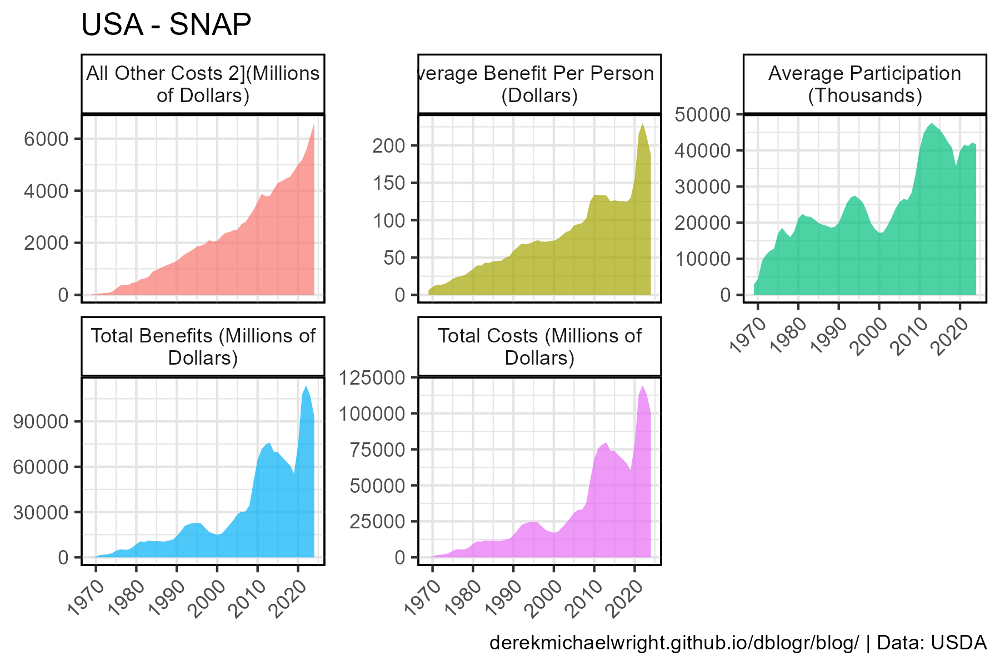
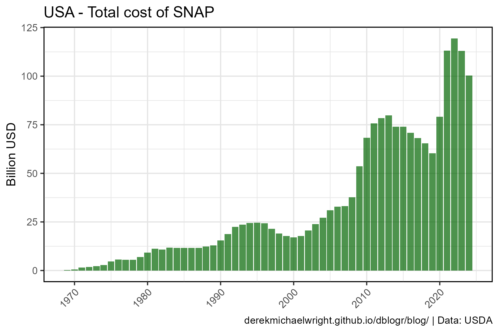

```{r setup, include=FALSE}
knitr::opts_chunk$set(echo = TRUE, message = F, warning = F)
```

---

# Data

> - `r shiny::icon("globe")` [https://www.fns.usda.gov/pd/supplemental-nutrition-assistance-program-snap](https://www.fns.usda.gov/pd/supplemental-nutrition-assistance-program-snap){target="_blank"}
> - `r shiny::icon("save")` [data_.csv](data_.csv)

---

# Prepare Data

```{r class.source = 'fold-show'}
# devtools::install_github("derekmichaelwright/agData")
library(agData)
library(readxl)
```

```{r}
# Prep data
myCaption <- "derekmichaelwright.github.io/dblogr/blog/ | Data: USDA"
#
dd <- read_xlsx("data_usa_snap.xlsx", skip = 2) %>% 
  rename(Year=`Fiscal Year`) %>%
  filter(!is.na(`Total Costs (Millions of Dollars)`)) %>% 
  mutate(Year = as.numeric(Year))
```

---

# SNAP {.tabset .tabset-pills}

## All Data 



```{r}
# Prep data
xx <- dd %>% gather(Measurement, Value, 2:6)
# Plot
mp <- ggplot(xx, aes(x = Year, y = Value, fill = Measurement)) + 
  geom_area(alpha = 0.7) +
  facet_wrap(Measurement ~ ., scales = "free_y", 
             labeller = label_wrap_gen(width = 30)) +
  theme_agData(legend.position = "none",
               axis.text.x = element_text(angle = 45, hjust = 1)) +
  labs(title = "USA - SNAP",
       y = NULL, x = NULL, caption = myCaption)
ggsave("usa_snap_01.png", mp, width = 6, height = 4)
```

---

## Participants


```{r}
# Plot
mp <- ggplot(dd, aes(x = Year, y = `Average Participation (Thousands)` / 1000)) + 
  geom_col(fill = "darkgreen", alpha = 0.7) +
  theme_agData(axis.text.x = element_text(angle = 45, hjust = 1)) +
  labs(title = "USA - Number of SNAP participants",
       y = "Million", x = NULL, caption = myCaption)
ggsave("usa_snap_02.png", mp, width = 6, height = 4)
```

```{r echo = F}
ggsave("featured.png", mp, width = 6, height = 4)
```

---

## Total Costs



```{r}
# Plot
mp <- ggplot(dd, aes(x = Year, y = `Total Costs (Millions of Dollars)` / 1000)) + 
  geom_col(fill = "darkgreen", alpha = 0.7) +
  theme_agData(axis.text.x = element_text(angle = 45, hjust = 1)) +
  labs(title = "USA - Total cost of SNAP",
       y = "Billion USD", x = NULL, caption = myCaption)
ggsave("usa_snap_03.png", mp, width = 6, height = 4)
```

---
