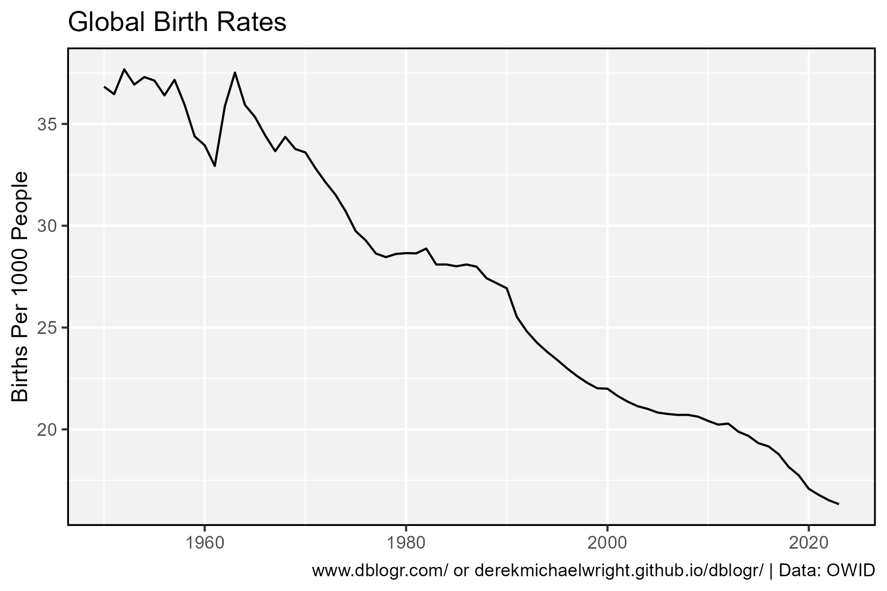
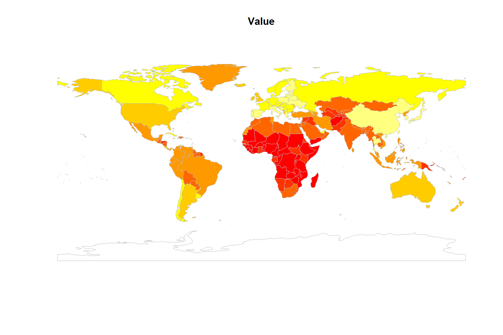

```{r setup, include=FALSE}
knitr::opts_chunk$set(echo = TRUE, message = F, warning = F)
```

---

# Data

> - `r shiny::icon("globe")` [https://ourworldindata.org/grapher/crude-birth-rate?tab=chart](https://ourworldindata.org/grapher/crude-birth-rate?tab=chart){target="_blank"}
> - `r shiny::icon("save")` [data_world_birthrates.csv](data_world_birthrates.csv)

---

# Prepare Data

```{r echo = F, eval = F}
library(jsonlite)
# Fetch the data
df <- read.csv("https://ourworldindata.org/grapher/crude-birth-rate.csv?v=1&csvType=full&useColumnShortNames=true")
# Fetch the metadata
metadata <- fromJSON("https://ourworldindata.org/grapher/crude-birth-rate.metadata.json?v=1&csvType=full&useColumnShortNames=true")
write.csv(df, "data_world_birthrates.csv", row.names = F)
```

```{r class.source = 'fold-show'}
# devtools::install_github("derekmichaelwright/agData")
library(agData)
library(rworldmap)
```

```{r}
# Prep data
myCaption <- "derekmichaelwright.github.io/dblogr/ | Data: OWID"
dd <- read.csv("data_world_birthrates.csv") %>%
  rename(Area=Entity, Value=4)
```

---

# World



```{r}
# Prep data
xx <- dd %>% filter(Area == "World")
# Plot
mp <- ggplot(xx, aes(x = Year, y = Value)) +
  geom_line(color = "darkgreen", lwd = 2, alpha = 0.7) +
  theme_agData(legend.position = "bottom") +
  labs(title = "Global Birth Rates", x = NULL,
       y = "Births Per 1000 People", caption = myCaption)
ggsave("world_birthrates_01.png", mp, width = 6, height = 4)
```

```{r echo = F}
ggsave("featured.png", mp, width = 6, height = 4)
```

---



```{r}
# Prep data
xx <- dd %>% filter(Year == 2023)
xx <- joinCountryData2Map(xx, nameJoinColumn = "Code", nameCountryColumn = "Area")
# Plot
png("world_birthrates_02.png", width = 1500, height = 1000, res = 150)
mapCountryData(xx, nameColumnToPlot="Value", addLegend = F)
dev.off()
```
