```{r setup, include=FALSE}
knitr::opts_chunk$set(echo = T, message = F, warning = F)
```

---

# Data

Energy production and consumption

> - `r shiny::icon("globe")` [https://ourworldindata.org/energy-production-consumption](https://ourworldindata.org/energy-production-consumption){target="_blank"}
> - `r shiny::icon("save")` [global-energy-substitution.csv](global-energy-substitution.csv)

CO2 emissions per capita

> - `r shiny::icon("globe")` [https://ourworldindata.org/worlds-energy-problem](https://ourworldindata.org/worlds-energy-problem){target="_blank"}
> - `r shiny::icon("save")` [consumption-co2-per-capita-vs-gdppc.csv](consumption-co2-per-capita-vs-gdppc.csv)

Extreme poverty & literacy

> - `r shiny::icon("globe")` [https://ourworldindata.org/a-history-of-global-living-conditions-in-5-charts](https://ourworldindata.org/a-history-of-global-living-conditions-in-5-charts){target="_blank"}
> - `r shiny::icon("save")` [world-population-in-extreme-poverty-absolute.csv](world-population-in-extreme-poverty-absolute.csv)
> - `r shiny::icon("save")` [literate-and-illiterate-world-population.csv](literate-and-illiterate-world-population.csv)

---

```{r echo = F}
# https://ourworldindata.org/energy-mix
#df <- read.csv("https://ourworldindata.org/grapher/energy-consumption-by-source-and-country.csv?v=1&csvType=full&useColumnShortNames=true")
```

# Prepare Data

```{r class.source = "fold-show"}
# devtools::install_github("derekmichaelwright/agData")
library(agData)
library(plotly)
library(htmlwidgets)
library(gganimate)
```

```{r}
# Prep data
myCaption_OWID <- "derekmichaelwright.github.io/dblogr/ | Data: OurWorldInData"
myCaption_IEA <- "derekmichaelwright.github.io/dblogr/ | Data: IEA"
myItems <- c("Other", "Biofuels", "Solar", "Wind",
             "Hydro", "Nuclear", "Gas", "Oil", "Coal", "Biomass")
myColors <- c("burlywood3", "darkseagreen4","darkgoldenrod2","steelblue",
              "darkred", "darkblue", "slategray3", 
              "black", "grey50", "darkgreen")
d1 <- read.csv("global-energy-substitution.csv") 
colnames(d1)[4:13] <- myItems
myItems <- myItems[c(1:4,6,5,7:10)]
#
d1 <- d1 %>% gather(Source, Value, 4:13) %>%
  mutate(Source = factor(Source, levels = myItems)) %>%
  group_by(Year) %>%
  mutate(Total = sum(Value),
         Percent = 100 * Value / Total) %>%
  ungroup()
#
d2 <- read.csv("per-capita-energy-use.csv") %>%
  mutate(Unit = "kWh per person") %>%
  rename(Area=Entity, Value=4)
#
oldnames <- c("United States", "South Korea", "Brunei")
newnames <- c("USA", "Republic of Korea", "Brunei Darussalam")
d3 <- read.csv("consumption-co2-per-capita-vs-gdppc.csv") %>%
  select(Country=Entity, Year,
         CO2=Per.capita.consumption.based.CO..emissions, 
         GDP=GDP.per.capita..PPP..constant.2017.international...,
         Population=Population..historical.) %>%
  mutate(Country = plyr::mapvalues(Country, oldnames, newnames)) %>%
  left_join(agData_FAO_Country_Table, by = "Country") %>% 
  filter(!(is.na(GDP) & is.na(CO2) & is.na(Population)))
#
d4 <- read.csv("world-population-in-extreme-poverty-absolute.csv") %>%
  rename(`Not in extreme poverty`    = 4,
         `Living in extreme poverty` = 5) %>%
  mutate(Total = `Not in extreme poverty` + `Living in extreme poverty`) %>%
  gather(Measurement, Value, 4:5) %>%
  mutate(Percent = 100 * Value / Total)
#
d5 <- read.csv("literate-and-illiterate-world-population.csv") %>%
  rename(Literate  = 4,
         Iliterate = 5) %>%
  gather(Measurement, Percent, 4:5)
#
d6 <- read.csv("API_EG.USE.ELEC.KH.PC_DS2_en_csv_v2_2076.csv", skip = 4) %>%
  gather(Year, Value, 5:ncol(.)) %>%
  mutate(Year = as.numeric(gsub("X","",Year))) %>%
  filter(!is.na(Value))
```

---

# Global Energy by Source

## Consumption {.tabset .tabset-pills}

### All Data

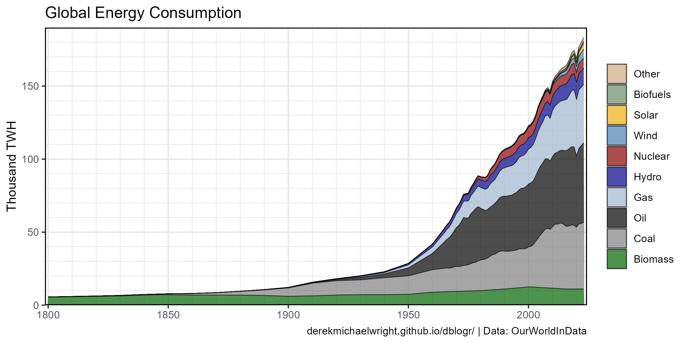

```{r}
# Plot
mp <- ggplot(d1, aes(x = Year, y = Value / 1000, fill = Source)) +
  geom_area(alpha = 0.7, color = alpha("black",0.7), lwd = 0.3) +
  scale_fill_manual(name = NULL, values = myColors) +
  scale_y_continuous(expand = c(0,0), limits = c(0,190),
                     minor_breaks = seq(0,200,10)) +
  scale_x_continuous(breaks = seq(1800, 2030, by = 50), expand = c(0.005,0),
                     minor_breaks = seq(1800, 2030, by = 10)) +
  guides(fill = guide_legend(override.aes = list(lwd = 0.4))) +
  theme_agData() +
  labs(title = "Global Energy Consumption",
       y = "Thousand TWH", x = NULL, caption = myCaption_OWID)
ggsave("world_energy_1_01.png", mp, width = 8, height = 4)
```

```{r echo = F}
ggsave("featured.png", mp, width = 8, height = 4)
```

---

### > 1950


```{r}
# Prep data
xx <- d1 %>% filter(Year > 1949)
# Plot
mp <- ggplot(xx, aes(x = Year, y = Value / 1000, fill = Source)) +
  geom_area(alpha = 0.7, color = alpha("black",0.7), lwd = 0.3) +
  scale_fill_manual(name = NULL, values = myColors) +
  scale_y_continuous(expand = c(0,0), limits = c(0,190),
                     minor_breaks = seq(0, 200, by = 10)) +
  scale_x_continuous(breaks = seq(1950, 2030, by = 10), expand = c(0.005,0),
                     minor_breaks = seq(1950, 2030, by = 5)) +
  guides(fill = guide_legend(override.aes = list(lwd = 0.4))) +
  theme_agData() +
  labs(title = "Global Energy Consumption",
       y = "Thousand TWH", x = NULL, caption = myCaption_OWID)
ggsave("world_energy_1_02.png", mp, width = 8, height = 4)
```

---

### Line

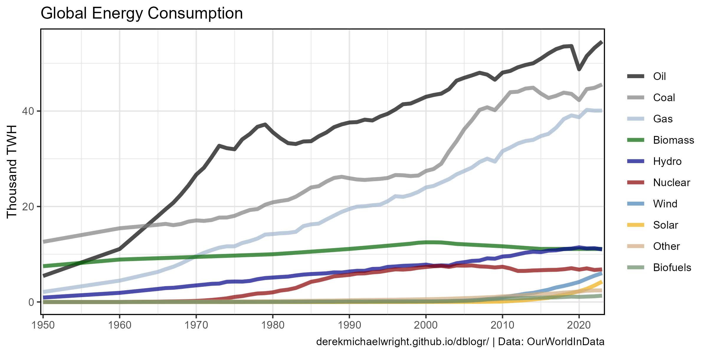

```{r}
# Prep data
myOrder <- c(8,9,7,10,6,5,4,3,1,2)
xx <- d1 %>% filter(Year > 1949) %>%
  mutate(Source = factor(Source, levels = myItems[myOrder]))
# Plot
mp <- ggplot(xx, aes(x = Year, y = Value / 1000, color = Source)) +
  geom_line(size = 1.5, alpha = 0.7) +
  scale_color_manual(name = NULL, values = myColors[myOrder]) +
  scale_y_continuous(minor_breaks = seq(0, 60, by = 10)) +
  scale_x_continuous(breaks = seq(1950, 2030, by = 10), expand = c(0.005,0)) +
  theme_agData() +
  labs(title = "Global Energy Consumption",
       y = "Thousand TWH", x = NULL, caption = myCaption_OWID)
ggsave("world_energy_1_03.png", mp, width = 8, height = 4)
```

---

### Select Years


```{r}
# Prep data
xx <- d1 %>% filter(Year %in% c(1800, 1850, 1900, 1950, 1975, 2000, 2021))
# Plot
mp <- ggplot(xx, aes(x = 1, y = Value / 1000, fill = Source)) +
  geom_col(color = "black", alpha = 0.7, lwd = 0.3) +
  scale_fill_manual(name = NULL, values = myColors) +
  scale_y_continuous(expand = c(0.01,0), minor_breaks = seq(0,180,10)) +
  facet_grid(. ~ Year) +
  guides(fill = guide_legend(override.aes = list(lwd = 0.4))) +
  theme_agData_col(axis.text.x = element_blank(),
                   axis.ticks.x = element_blank()) +
  labs(title = "Global Energy Consumption",
       y = "Thousand TWH", x = NULL, caption = myCaption_OWID)
ggsave("world_energy_1_04.png", mp, width = 6, height = 4)
```

---

### Fossil Fuels {.tabset .tabset-pills}

> - `r shiny::icon("globe")` https://globalenergymonitor.org/projects/global-coal-plant-tracker/tracker/

#### Stacked


```{r}
# Prep data
xx <- d1 %>% filter(Source %in% myItems[7:9]) 
# Plot
mp <- ggplot(xx, aes(x = Year, y = Value / 1000, fill = Source)) +
  geom_area(alpha = 0.7, color = "black") +
  scale_fill_manual(name = NULL, values = myColors[9:7], breaks = myItems[9:7]) +
  scale_y_continuous(breaks = seq(0, 160, by = 20), limits = c(0,150), 
                     minor_breaks = seq(0, 150, by = 10), expand = c(0,0)) +
  scale_x_continuous(breaks = seq(1800, 2020, by = 50), expand = c(0.005,0),
                     minor_breaks = seq(1800, 2020, by = 10)) +
  theme_agData() +
  guides(fill = guide_legend(reverse=T)) +
  labs(title = "Global Consumption of Fossil Fuels",
       y = "Thousand TWH", x = NULL, caption = myCaption_OWID)
ggsave("world_energy_1_05.png", mp, width = 6, height = 4)
```

---

#### Facetted


```{r}
# Prep data
xx <- d1 %>% filter(Source %in% myItems[9:7]) %>%
  mutate(Source = factor(Source, levels = myItems[9:7]))
# Plot
mp <- ggplot(xx, aes(x = Year, y = Value / 1000, fill = Source)) +
  geom_area(alpha = 0.7, color = "black") +
  scale_fill_manual(name = NULL, values = myColors[9:7]) +
  facet_wrap(Source ~ .) +
  scale_y_continuous(breaks = seq(0, 60, by = 10), limits = c(0,55),
                     minor_breaks = seq(0, 60, by = 5), expand = c(0,0)) +
  scale_x_continuous(breaks = seq(1800, 2020, by = 50), expand = c(0.01,0), 
                     minor_breaks = seq(1800, 2020, by = 10)) +
  theme_agData(legend.position = "none") +
  labs(title = "Global Consumption of Fossil Fuels",
       y = "Thousand TWH", x = NULL, caption = myCaption_OWID)
ggsave("world_energy_1_06.png", mp, width = 6, height = 3)
```

---

### Renewables

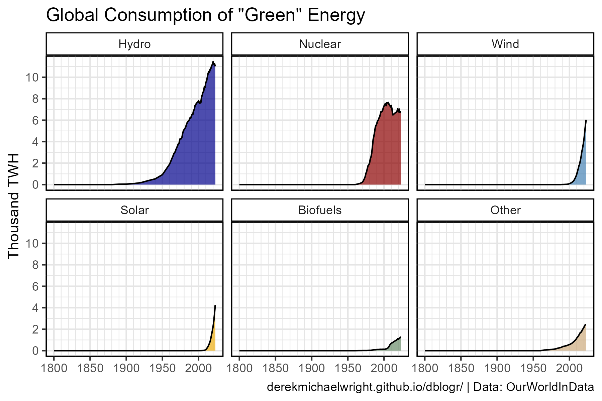

```{r}
# Prep data
xx <- d1 %>% filter(Source %in% myItems[1:6]) %>%
  mutate(Source = factor(Source, levels = myItems[6:1]))
# Plot
mp <- ggplot(xx, aes(x = Year, y = Value / 1000, fill = Source)) +
  geom_area(alpha = 0.7, color = "black") +
  scale_fill_manual(name = NULL, values = myColors[6:1]) +
  facet_wrap(Source ~ .) +
  scale_y_continuous(breaks = seq(0, 11, by = 2),
                     minor_breaks = seq(0, 11, by = 1)) +
  scale_x_continuous(breaks = seq(1800, 2020, by = 50), 
                     minor_breaks = seq(1800, 2020, by = 10)) +
  theme_agData(legend.position = "none") +
  labs(title = "Global Consumption of \"Green\" Energy",
       y = "Thousand TWH", x = NULL, caption = myCaption_OWID)
ggsave("world_energy_1_07.png", mp, width = 6, height = 4)
```

---

## Bar Animation


```{r}
# Prep data
xx <- d1 %>% filter(Year > 1870)
# Plot
mp <- ggplot(xx, aes(x = 1, y = Value / 1000, fill = Source)) +
  geom_col(color = "black", alpha = 0.7) +
  scale_fill_manual(name = NULL, 
                    values = rev(myColors), breaks = rev(myItems)) +
  scale_x_continuous(expand = c(0,0)) +
  theme_agData(legend.position = "bottom",
               axis.text.y = element_blank(),
               axis.ticks.y = element_blank()) +
  coord_flip() +
  guides(fill = guide_legend(nrow = 1)) +
  labs(title = "Global Energy Consumption - {round(frame_time)}",
       y = "Thousand TWH", x = NULL, caption = myCaption_OWID) +
  transition_time(Year)
anim_save("world_energy_gif_1_01.gif", mp,
          nframes = 300, fps = 10, end_pause = 30, 
          width = 1200, height = 300, res = 150, units = "px")
```

---

## Projections {.tabset .tabset-pills}

### Fossil Fuels

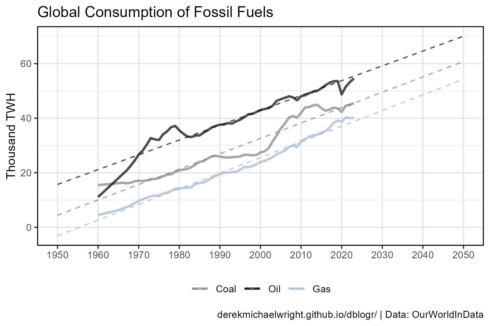

```{r}
# Prep data
xx <- d1 %>% filter(Source %in% myItems[9:7], Year > 1950) %>%
  mutate(Source = factor(Source, levels = myItems[9:7]))
fit1 <- lm(Value ~ Year, data = xx %>% filter(Source == "Coal"))
fit2 <- lm(Value ~ Year, data = xx %>% filter(Source == "Oil"))
fit3 <- lm(Value ~ Year, data = xx %>% filter(Source == "Gas"))
x1 <- data.frame(Year = c(1950, 2050), Source = "Coal")
x1$Value <- predict(fit1, newdata = x1)
x2 <- data.frame(Year = c(1950, 2050), Source = "Oil")
x2$Value <- predict(fit2, newdata = x2)
x3 <- data.frame(Year = c(1950, 2050), Source = "Gas")
x3$Value <- predict(fit3, newdata = x3)
yy <- rbind(x1, x2, x3)
# Plot
mp <- ggplot(xx, aes(x = Year, y = Value / 1000, color = Source)) +
  geom_line(alpha = 0.7, lwd = 1) +
  geom_line(data = yy, lwd = 0.5, lty = 2, alpha = 0.7) +
  scale_color_manual(name = NULL, values = myColors[9:7]) +
  scale_x_continuous(breaks = seq(1950, 2050, by = 10),
                     minor_breaks = seq(1950, 2050, by = 10)) +
  theme_agData(legend.position = "bottom") +
  labs(title = "Global Consumption of Fossil Fuels",
       y = "Thousand TWH", x = NULL, caption = myCaption_OWID)
ggsave("world_energy_2_01.png", mp, width = 6, height = 4)
```

---

### Renewables

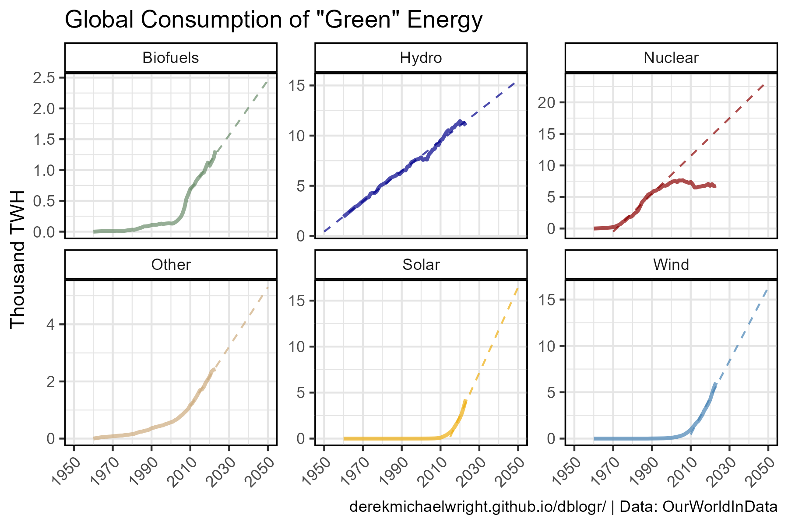

```{r}
# Prep data
xx <- d1 %>% filter(Source == "Nuclear", Year > 1970 & Year < 1990)
fit1 <- lm(Value ~ Year, data = xx)
xx <- d1 %>% filter(Source == "Hydro", Year > 1950)
fit2 <- lm(Value ~ Year, data = xx)
xx <- d1 %>% filter(Source == "Wind", Year > 2010)
fit3 <- lm(Value ~ Year, data = xx)
xx <- d1 %>% filter(Source == "Solar", Year > 2015)
fit4 <- lm(Value ~ Year, data = xx)
xx <- d1 %>% filter(Source == "Biofuels", Year > 2010)
fit5 <- lm(Value ~ Year, data = xx)
xx <- d1 %>% filter(Source == "Other", Year > 2010)
fit6 <- lm(Value ~ Year, data = xx)
#
x1 <- data.frame(Year = c(1970, 2050), Source = "Nuclear")
x1$Value <- predict(fit1, newdata = x1)
x2 <- data.frame(Year = c(1950, 2050), Source = "Hydro")
x2$Value <- predict(fit2, newdata = x2)
x3 <- data.frame(Year = c(2010, 2050), Source = "Wind")
x3$Value <- predict(fit3, newdata = x3)
x4 <- data.frame(Year = c(2015, 2050), Source = "Solar")
x4$Value <- predict(fit4, newdata = x4)
x5 <- data.frame(Year = c(2010, 2050), Source = "Biofuels")
x5$Value <- predict(fit5, newdata = x5)
x6 <- data.frame(Year = c(2010, 2050), Source = "Other")
x6$Value <- predict(fit6, newdata = x6)
#
yy <- rbind(x1, x2, x3, x4, x5, x6)
xx <- d1 %>% filter(Year > 1950, Source %in% myItems[1:6])
# Plot
mp <- ggplot(xx, aes(x = Year, y = Value / 1000, color = Source)) +
  geom_line(alpha = 0.7, lwd = 1) +
  geom_line(data = yy, lwd = 0.5, lty = 2, alpha = 0.7) +
  facet_wrap(Source ~ ., scales  = "free_y") +
  scale_color_manual(name = NULL, values = myColors) +
  scale_x_continuous(breaks = seq(1950, 2050, by = 20),
                     minor_breaks = seq(1950, 2050, by = 10)) +
  theme_agData(legend.position = "none",
               axis.text.x = element_text(angle = 45, hjust = 1)) +
  labs(title = "Global Consumption of \"Green\" Energy",
       y = "Thousand TWH", x = NULL, caption = myCaption_OWID)
ggsave("world_energy_2_02.png", mp, width = 6, height = 4)
```

---

### Nuclear Energy


```{r}
# Prep data
xx <- d1 %>% filter(Source == "Nuclear", Year > 1970 & Year < 1990)
fit1 <- lm(Value ~ Year, data = xx)
#
yy <- data.frame(Year = c(1970, 2050), Source = "Nuclear")
yy$Value <- predict(fit1, newdata = yy)
#
xx <- d1 %>% filter(Year > 1950, Source == "Nuclear")
# Plot
mp <- ggplot(xx, aes(x = Year, y = Value / 1000, color = Source)) +
  geom_line(alpha = 0.7, lwd = 1) +
  geom_line(data = yy, lwd = 0.5, lty = 2, alpha = 0.7) +
  facet_wrap(Source ~ ., scales  = "free_y") +
  scale_color_manual(name = NULL, values = "darkred") +
  scale_x_continuous(breaks = seq(1950, 2050, by = 20),
                     minor_breaks = seq(1950, 2050, by = 10)) +
  theme_agData(legend.position = "none",
               axis.text.x = element_text(angle = 45, hjust = 1)) +
  labs(title = "Global Consumption of Nuclear Energy",
       y = "Thousand TWH", x = NULL, caption = myCaption_OWID)
ggsave("world_energy_2_03.png", mp, width = 6, height = 4)
```

---

## Percent {.tabset .tabset-pills}

### All Data

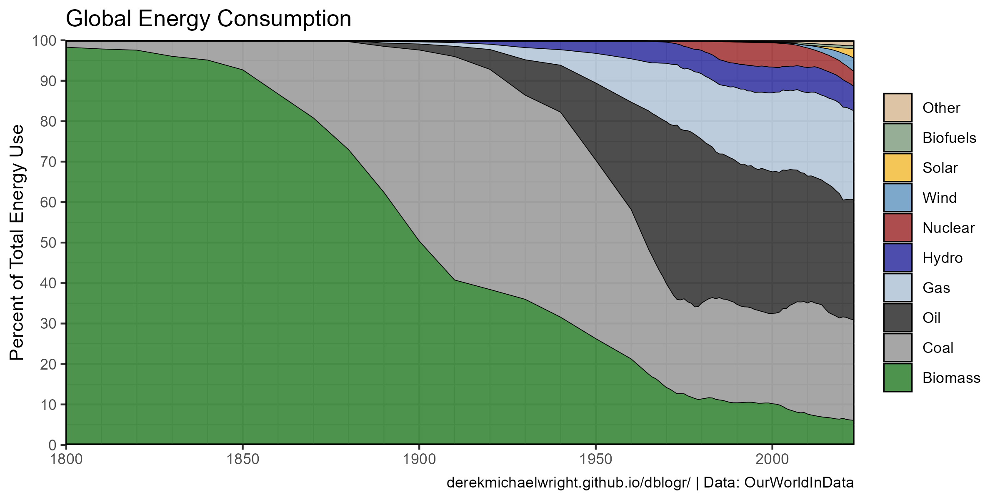

```{r}
# Plot
mp <- ggplot(d1, aes(x = Year, y = Percent, fill = Source)) +
  geom_area(alpha = 0.7, color = "black", lwd = 0.2) +
  scale_fill_manual(name = NULL, values = myColors) +
  scale_y_continuous(breaks = seq(0,100,10), expand = c(0,0)) +
  scale_x_continuous(breaks = seq(1800, 2020, by = 50), expand = c(0,0),
                     minor_breaks = seq(1800, 2020, by = 10)) +
  guides(fill = guide_legend(override.aes = list(lwd = 0.4))) +
  theme_agData() +
  labs(title = "Global Energy Consumption",
       y = "Percent of Total Energy Use", x = NULL, caption = myCaption_OWID)
ggsave("world_energy_3_01.png", mp, width = 8, height = 4)
```

---

### > 2005


```{r}
# Prep data
xx <- d1 %>% filter(Year >= 2005)
# Plot
mp <- ggplot(xx, aes(x = Year, y = Percent, fill = Source)) +
  geom_area(alpha = 0.7, color = "black", lwd = 0.2) +
  scale_fill_manual(name = NULL, values = myColors) +
  scale_y_continuous(breaks = seq(0,100,10), expand = c(0,0)) +
  scale_x_continuous(breaks = seq(2005, 2025, by = 5), expand = c(0,0),
                     minor_breaks = 2005:2025) +
  guides(fill = guide_legend(override.aes = list(lwd = 0.4))) +
  theme_agData() +
  labs(title = "Global Energy Consumption",
       y = "Percent of Total Energy Use", x = NULL, caption = myCaption_OWID)
ggsave("world_energy_3_02.png", mp, width = 8, height = 4)
```

---

### Fossil Fuels

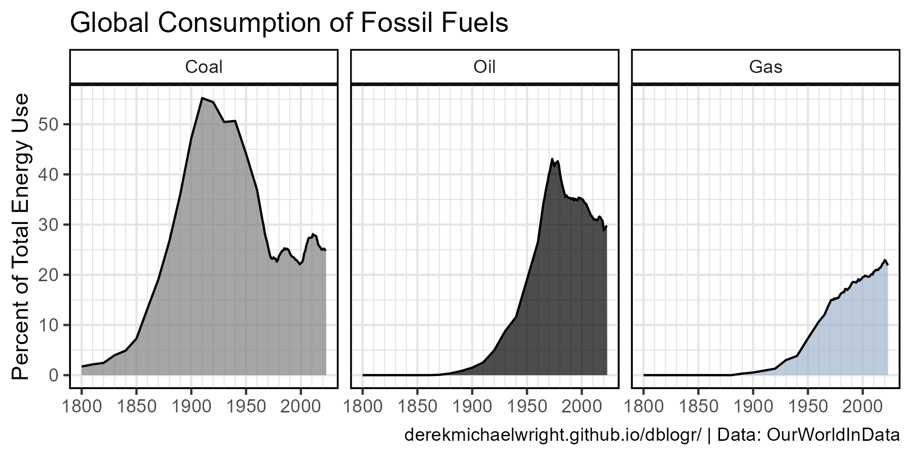

```{r}
# Prep data
xx <- d1 %>% filter(Source %in% myItems[9:7]) %>%
  mutate(Source = factor(Source, levels = myItems[9:7]))
# Plot
mp <- ggplot(xx, aes(x = Year, y = Percent, fill = Source)) +
  geom_area(alpha = 0.7, color = "black") +
  scale_fill_manual(name = NULL, values = myColors[9:7]) +
  facet_wrap(Source ~ .) +
  scale_y_continuous(breaks = seq(0, 60, by = 10),
                     minor_breaks = seq(0, 60, by = 5)) +
  scale_x_continuous(breaks = seq(1800, 2020, by = 50), 
                     minor_breaks = seq(1800, 2020, by = 10)) +
  theme_agData(legend.position = "none") +
  labs(title = "Global Consumption of Fossil Fuels", x = NULL,
       y = "Percent of Total Energy Use", caption = myCaption_OWID)
ggsave("world_energy_3_03.png", mp, width = 6, height = 3)
```

---

### Renewables


```{r}
# Prep data
xx <- d1 %>% filter(Source %in% myItems[1:6], Year > 1850) %>%
  mutate(Source = factor(Source, levels = rev(myItems[c(1:4,6,5)])))
# Plot
mp <- ggplot(xx, aes(x = Year, y = Percent, fill = Source)) +
  geom_area(alpha = 0.7, color = "black", lwd = 0.2) +
  scale_fill_manual(name = NULL, values = rev(myColors[c(1:4,6,5)])) +
  facet_wrap(Source ~ .) +
  scale_x_continuous(breaks = seq(1850, 2020, by = 50), 
                     minor_breaks = seq(1850, 2020, by = 10)) +
  theme_agData(legend.position = "none") +
  labs(title = "Global Consumption of \"Green\" Energy",
       y = "Percent of Total Energy Use", x = NULL, caption = myCaption_OWID)
ggsave("world_energy_3_04.png", mp, width = 6, height = 4)
```

---

### 2021 

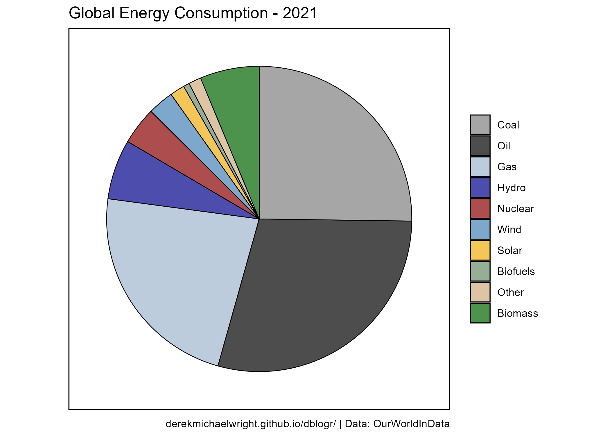

```{r}
# Prep data
xx <- d1 %>% filter(Year == 2021) %>% 
  mutate(Source = factor(Source, levels = myItems[c(9:1,10)]))
# Plot
mp <- ggplot(xx, aes(x = 1, y = -Percent, fill = Source)) +
  geom_col(color = "black", lwd = 0.3, alpha = 0.7) +
  scale_fill_manual(name = NULL, breaks = myItems[c(9:1,10)],
                    values = myColors[c(9:1,10)] ) +
  guides(fill = guide_legend(override.aes = list(lwd = 0.4))) +
  coord_polar("y", start = 0) +
  theme_agData_pie() +
  xlim(0.545, 1.45) +
  labs(title = "Global Energy Consumption - 2021", caption = myCaption_OWID)
ggsave("world_energy_3_05.png", mp, width = 7, height = 5)
```

---

## Pie Animation


```{r}
# Prep data
xx <- d1 %>% filter(Percent > 0)
# Plot
mp <- ggplot(xx, aes(x = "", y = -Percent, fill = Source)) +
  geom_col(color = "black", alpha = 0.7) +
  scale_fill_manual(name = NULL, breaks = myItems[c(9:1,10)],
                    values = myColors[c(9:1,10)]) +
  coord_polar("y", start = 0) +
  theme_agData_pie() +
  labs(title = "Percent of Global Energy Consumption - {round(frame_time)}",
       caption = myCaption_OWID) +
  transition_time(Year)
anim_save("world_energy_gif_3_01.gif", mp,
          nframes = 300, fps = 10, end_pause = 30, 
          width = 900, height = 700, res = 150, units = "px")
```

---

# Per Capita Energy Use {.tabset .tabset-pills}

## Select Countries


```{r}
# Prep data
myAreas <- c("Canada", "United States", "China", "India", "Africa")
myColors <- c("steelblue", "darkblue", "darkred", "darkorange", "darkgreen")
xx <- d2 %>% filter(Area %in% myAreas) %>% 
  mutate(Area = factor(Area, levels = myAreas))
mp <- ggplot(xx, aes(x = Year, y = Value / 1000, color = Area)) +
  geom_line(linewidth = 1.5, alpha = 0.7) +
  scale_color_manual(name = NULL, values = myColors) +
  theme_agData() +
  labs(title = "Per Capita Energy Consumption", x = NULL,
       y = "Thousand kWh Per Person", caption = myCaption_OWID)
ggsave("world_energy_4_01.png", mp, width = 6, height = 4)
```

---

# Canada vs China


```{r}
# Prep data
myAreas <- c("Canada", "China")
myColors <- c("steelblue", "darkred")
xx <- d2 %>% filter(Area %in% myAreas) %>% 
  mutate(Area = factor(Area, levels = myAreas))
mp2 <- ggplot(xx, aes(x = Year, y = Value / 1000, color = Area)) +
  geom_line(alpha = 0.7, lwd = 1.5) +
  scale_color_manual(name = NULL, values = myColors) +
  theme_agData() +
  labs(title = "B) Propaganda For China", x = NULL,
       y = "Thousand kWh Per Person", caption = myCaption_OWID)
mp1 <- mp2 + facet_wrap(Area ~ ., scales = "free_y") +
  labs(title = "A) Propaganda For Canada", caption = NULL)
mp <- ggarrange(mp1, mp2, ncol = 1, common.legend = T, legend = "bottom")
ggsave("world_energy_4_02.png", mp, width = 6, height = 5, bg = "white")
```

---

# CO2 vs GDP {.tabset .tabset-pills}

## 1990

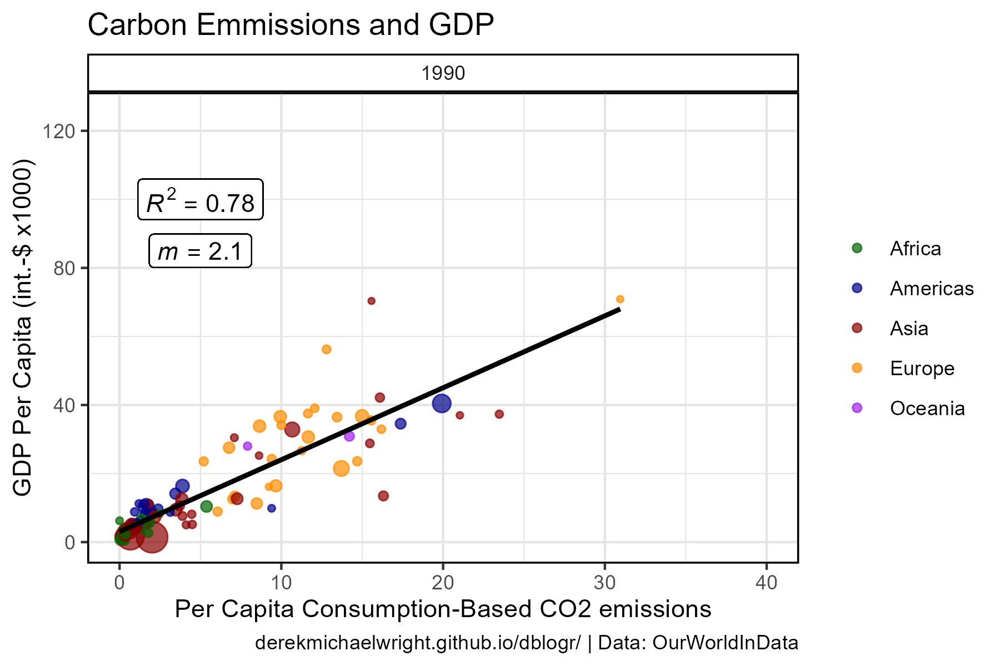

```{r}
# Prep data
xx <- d3 %>% filter(Year == 1990, !is.na(Region), !is.na(CO2), !is.na(GDP))
myColors <- c("darkgreen", "darkblue", "darkred","darkorange", "purple")
r2 <- round(cor(xx$CO2, xx$GDP)^2, 2)
mm <- round(summary(lm(data = xx, GDP / 1000 ~ CO2))$coefficients[2], 1)
# Plot
mp <- ggplot(xx, aes(x = CO2, y = GDP / 1000)) + 
  geom_point(aes(color = Region, size = Population), alpha = 0.7) +
  geom_smooth(method = "lm", se = F, color = "black") +
  geom_label(x = 5, y = 100, label = paste("italic(R)^2 == ", r2), parse = T) +
  geom_label(x = 5, y = 85, label = paste("italic(m) == ", mm), parse = T) +
  facet_grid(. ~ Year) +
  scale_color_manual(name = NULL, values = myColors) +
  guides(size = F) +
  ylim(c(0, 125)) + xlim(c(0, 40)) +
  theme_agData() +
  labs(title = "Carbon Emmissions and GDP",
       y = "GDP Per Capita (int.-$ x1000)", 
       x = "Per Capita Consumption-Based CO2 emissions",
       caption = myCaption_OWID)
ggsave("world_energy_5_01.png", mp, width = 6, height = 4)
```

---

## 2018


```{r}
# Prep data
xx <- d3 %>% filter(Year == 2018, !is.na(Region), !is.na(CO2), !is.na(GDP))
myColors <- c("darkgreen", "darkblue", "darkred","darkorange", "purple")
r2 <- round(cor(xx$CO2, xx$GDP)^2, 2)
mm <- round(summary(lm(data = xx, GDP / 1000 ~ CO2))$coefficients[2], 1)
# Plot
mp <- ggplot(xx, aes(x = CO2, y = GDP / 1000)) + 
  geom_point(aes(color = Region, size = Population, key1 = Country), alpha = 0.7) +
  geom_smooth(method = "lm", se = F, color = "black") +
  geom_label(x = 5, y = 100, label = paste("italic(R)^2 == ", r2), parse = T) +
  geom_label(x = 5, y = 85, label = paste("italic(m) == ", mm), parse = T) +
  facet_grid(. ~ Year) +
  scale_color_manual(name = NULL, values = myColors) +
  guides(size = F) +
  ylim(c(0, 125)) + xlim(c(0, 40)) +
  theme_agData() +
  labs(title = "Carbon Emmissions and GDP",
       y = "GDP Per Capita (int.-$ x1000)", 
       x = "Per Capita Consumption-Based CO2 Emissions",
       caption = myCaption_OWID)
ggsave("world_energy_5_02.png", mp, width = 6, height = 4)
```

---

## Interactive

https://dblogr.com/blog/world_energy/world_energy_5_02.html

<iframe
  src="world_energy_5_02.html"
  style="width:100%; height:600px;"
  data-external="1"
></iframe>

```{r}
mp <- ggplotly(mp)
saveWidget(as_widget(mp), "world_energy_5_02.html")
```

---

## 1990 vs 2018

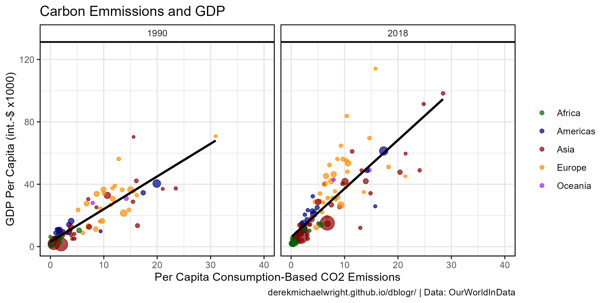

```{r}
# Prep data
xx <- d3 %>% 
  filter(Year %in% c(1990, 2018), !is.na(Region), !is.na(CO2), !is.na(GDP))
myColors <- c("darkgreen", "darkblue", "darkred","darkorange", "purple")
# Plot
mp <- ggplot(xx, aes(x = CO2, y = GDP / 1000)) + 
  geom_point(aes(color = Region, size = Population), alpha = 0.7) +
  geom_smooth(method = "lm", se = F, color = "black") +
  facet_grid(. ~ Year) +
  scale_color_manual(name = NULL, values = myColors) +
  guides(size = F) +
  ylim(c(0, 125)) + xlim(c(0, 40)) +
  theme_agData() +
  labs(title = "Carbon Emmissions and GDP",
       y = "GDP Per Capita (int.-$ x1000)", 
       x = "Per Capita Consumption-Based CO2 Emissions",
       caption = myCaption_OWID)
ggsave("world_energy_5_03.png", mp, width = 8, height = 4)
```

---

## Animation


```{r}
# Prep data
xx <- d3 %>% filter(!is.na(Region), !is.na(CO2), !is.na(GDP))
myColors <- c("darkgreen", "darkblue", "darkred","darkorange", "purple")
r2 <- round(cor(xx$CO2, xx$GDP)^2, 2)
# Plot
mp <- ggplot(xx, aes(x = CO2, y = GDP / 1000)) + 
  geom_point(aes(color = Region, size = Population), alpha = 0.7) +
  scale_color_manual(name = NULL, values = myColors) +
  guides(size = F) +
  theme_agData() +
  labs(title = "Carbon Emmissions and GDP", 
       subtitle = "Year: {frame_time}", 
       y = "GDP Per Capita (int.-$ x1000)", 
       x = "Per Capita Consumption-Based CO2 Emissions",
       caption = myCaption_OWID) +
  transition_time(Year) 
anim_save("world_energy_gif_2_01.gif", mp, 
          nframes = 300, fps = 10, end_pause = 30, 
          width = 900, height = 600, res = 150, units = "px")
```

---

## Change

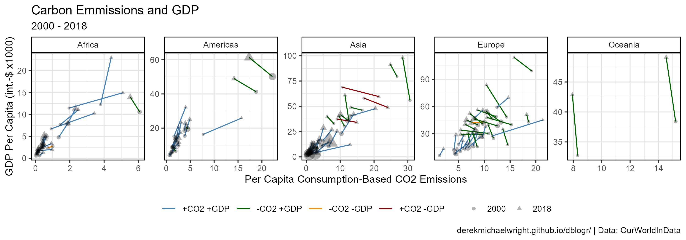

```{r}
# Prep data
xx <- d3 %>% 
  filter(Year %in% c(2000, 2018), !is.na(Region), !is.na(CO2), !is.na(GDP)) %>%
  mutate(Year = factor(Year))
y1 <- xx %>% select(Country, Year, CO2) %>%
  filter(!duplicated(paste(.$Country, .$Year))) %>% 
  spread(Year, CO2) %>%
  mutate(CO2diff = `2018` - `2000` >= 0) %>%
  select(Country, CO2diff)
y2 <- xx %>% select(Country, Year, GDP) %>%
  filter(!duplicated(paste(.$Country, .$Year))) %>% 
  spread(Year, GDP) %>%
  mutate(GDPdiff = `2018` - `2000` >= 0) %>%
  select(Country, GDPdiff)
myGroups1 <- c("TRUE TRUE", "FALSE TRUE", "FALSE FALSE", "TRUE FALSE")
myGroups2 <- c("+CO2 +GDP", "-CO2 +GDP", "-CO2 -GDP", "+CO2 -GDP")
myColors <- c("steelblue", "darkgreen", "darkorange", "darkred")
xx <- xx %>%
  left_join(y1, by = "Country") %>%
  left_join(y2, by = "Country") %>%
  mutate(Group = paste(CO2diff, GDPdiff),
         Group = plyr::mapvalues(Group, myGroups1, myGroups2),
         Group = factor(Group, levels = myGroups2)) %>%
  filter(!is.na(CO2diff), !is.na(GDPdiff))
# Plot
mp <- ggplot(xx, aes(x = CO2, y = GDP / 1000)) + 
  geom_line(aes(group = Country, color = Group)) +
  geom_point(aes(pch = Year, size = Population), alpha = 0.3) +
  facet_wrap(Region ~ ., scales = "free", ncol = 5) + 
  scale_color_manual(name = NULL, values = myColors) +
  scale_shape_manual(name = NULL, values = c(16,17)) +
  guides(size = F) +
  theme_agData(legend.position = "bottom") +
  labs(title = "Carbon Emmissions and GDP",
       subtitle = "2000 - 2018",
       y = "GDP Per Capita (int.-$ x1000)", 
       x = "Per Capita Consumption-Based CO2 Emissions",
       caption = myCaption_OWID)
ggsave("world_energy_5_04.png", mp, width = 10, height = 3.5)
```

---

## Canada

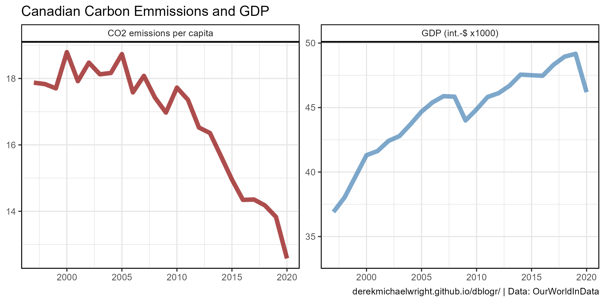

```{r}
# Prep data
xx <- d3 %>% select(Country, Year, GDP, CO2) %>%
    filter(Country == "Canada") %>%
    mutate(GDP = GDP / 1000) %>%
    gather(Measurement, Value, CO2, GDP) %>%
    mutate(Measurement = plyr::mapvalues(Measurement, c("CO2","GDP"),
              c("CO2 emissions per capita", "GDP (int.-$ x1000)")))
# Plot
mp <- ggplot(xx, aes(x = Year, y = Value, color = Measurement)) +
  geom_line(size = 2, alpha = 0.7) +
  facet_wrap(Measurement ~ ., scales = "free") +
  scale_color_manual(values = c("darkred", "steelblue")) +
  xlim(c(1997, 2020)) +
  theme_agData(legend.position = "none") +
  labs(title = "Canadian Carbon Emmissions and GDP", 
       y = NULL, x = NULL, caption = myCaption_OWID)
ggsave("world_energy_5_05.png", mp, width = 8, height = 4)
```

---

# Poverty {.tabset .tabset-pills}

## Global Poverty


```{r}
# Plot
mp <- ggplot(d4, aes(x = Year, y = Value / 1000000000, color = Measurement)) +
  geom_line(size = 1.5, alpha = 0.7) +
  scale_color_manual(name = NULL, values = c("darkred", "steelblue")) +
  scale_y_continuous(breaks = 0:7) +
  scale_x_continuous(breaks = seq(1820, 2020, by = 20)) +
  theme_agData(legend.position = "bottom") +
  guides(color = guide_legend(nrow = 2, ncol = 1)) +
  labs(title = "Global Poverty", x = NULL, 
       y = "Billion People", caption = myCaption_OWID)
ggsave("world_energy_6_01.png", mp, width = 6, height = 4)
```

---

## Percent Poverty

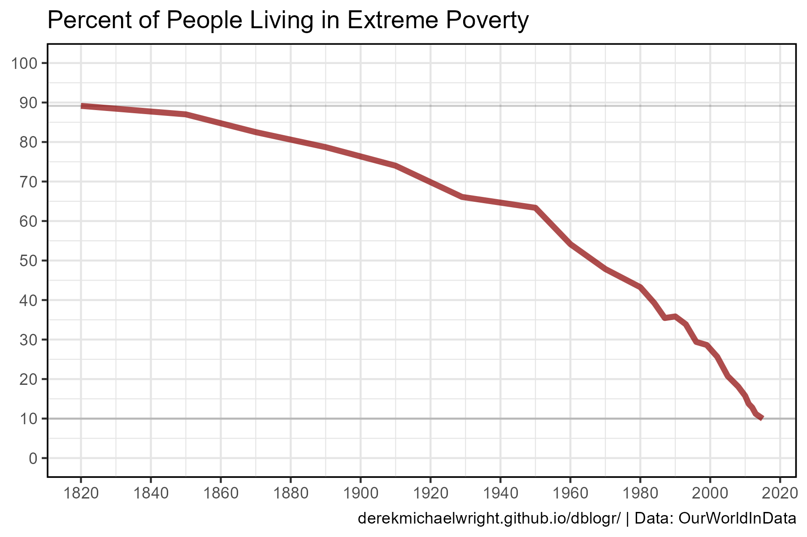

```{r}
# Prep data
xx <- d4 %>% filter(Measurement == "Living in extreme poverty")
# Plot
mp <- ggplot(xx, aes(x = Year, y = Percent)) +
  geom_hline(yintercept = min(xx$Percent), alpha = 0.2) +
  geom_hline(yintercept = max(xx$Percent), alpha = 0.2) +
  geom_line(color = "darkred", size = 1.5, alpha = 0.7) +
  scale_y_continuous(limits = c(0, 100),
                     breaks = seq(0, 100, by = 10)) +
  scale_x_continuous(breaks = seq(1820, 2020, by = 20)) +
  theme_agData(legend.position = "bottom") +
  guides(color = guide_legend(nrow = 2, ncol = 1)) +
  labs(title = "Percent of People Living in Extreme Poverty", 
       y = NULL, x = NULL, caption = myCaption_OWID)
ggsave("world_energy_6_02.png", mp, width = 6, height = 4)
```

---

## Poverty Pie


```{r}
# Plot
mp <- ggplot(d4, aes(x = "", y = Percent, fill = Measurement)) +
  geom_col(color = "black", alpha = 0.7) +
  scale_fill_manual(name = NULL, values = c("darkred", "steelblue")) +
  coord_polar("y", start = 0) +
  theme_agData(legend.position = "bottom") +
  theme_agData_pie() +
  labs(title = "Percent of People Living in Poverty - {round(frame_time)}",
       caption = myCaption_OWID) +
  transition_time(Year)
anim_save("world_energy_gif_6_01.gif", mp,
          nframes = 300, fps = 10, end_pause = 30, 
          width = 900, height = 700, res = 150, units = "px")
```

---

## Literacy

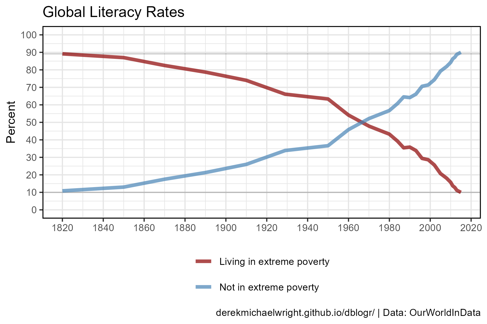

```{r}
# Plot
mp <- ggplot(d4, aes(x = Year, y = Percent, color = Measurement)) +
  geom_hline(yintercept = min(xx$Percent), alpha = 0.2) +
  geom_hline(yintercept = max(xx$Percent), alpha = 0.2) +
  geom_line(size = 1.5, alpha = 0.7) +
  scale_color_manual(name = NULL, values = c("darkred", "steelblue")) +
  scale_y_continuous(limits = c(0, 100),
                     breaks = seq(0, 100, by = 10)) +
  scale_x_continuous(breaks = seq(1800, 2020, by = 20)) +
  theme_agData(legend.position = "bottom") +
  guides(color = guide_legend(nrow = 2, ncol = 1)) +
  labs(title = "Global Literacy Rates", x = NULL,
       y = "Percent", caption = myCaption_OWID)
ggsave("world_energy_6_03.png", mp, width = 6, height = 4)
```

---

## Poverty + Illiteracy

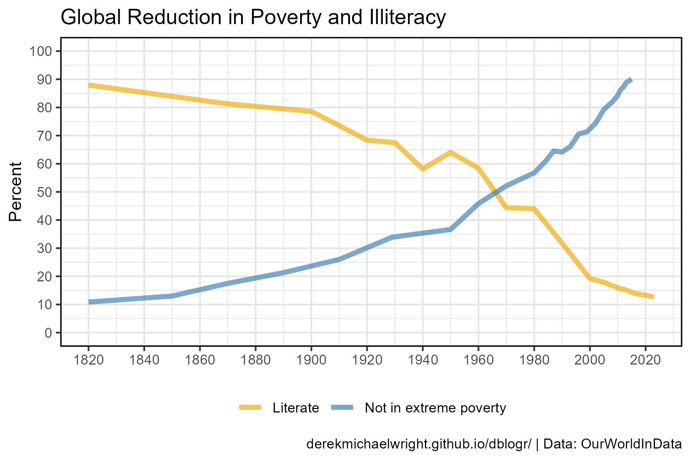

```{r}
# Prep data
x1 <- d4 %>% filter(Measurement == "Not in extreme poverty")
x2 <- d5 %>% filter(Measurement == "Literate", Entity == "World")
xx <- bind_rows(x1, x2)
# Plot
mp <- ggplot(xx, aes(x = Year, y = Percent, color = Measurement)) +
  geom_line(size = 1.5, alpha = 0.7) +
  scale_color_manual(name = NULL, values = c("darkgoldenrod2", "steelblue")) +
  scale_y_continuous(limits = c(0, 100),
                     breaks = seq(0, 100, by = 10)) +
  scale_x_continuous(breaks = seq(1800, 2020, by = 20)) +
  theme_agData(legend.position = "bottom") +
  guides(fill = guide_legend(nrow = 2, ncol = 1)) +
  labs(title = "Global Reduction in Poverty and Illiteracy", 
       y = "Percent", x = NULL, caption = myCaption_OWID)
ggsave("world_energy_6_04.png", mp, width = 6, height = 4)
```

---

## Energy and Poverty

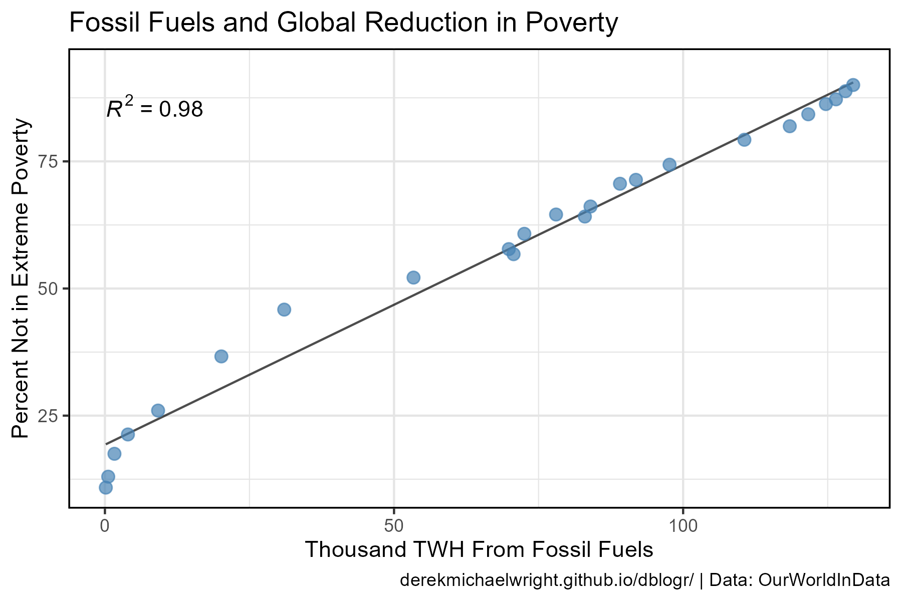

```{r}
# Prep data
x1 <- d4 %>% 
  filter(Measurement == "Not in extreme poverty")
x2 <- d1 %>% filter(Source %in% myItems[7:9]) %>%
  select(Year, Source, Value) %>%
  spread(Source, Value) %>%
  mutate(`Fossil Fuels` = Coal + Gas + Oil)
xx <- left_join(x1, x2, by = "Year") 
# Plot
mp <- ggplot(xx, aes(x = `Fossil Fuels` / 1000, y = Percent)) +
  stat_regline_equation(aes(label = ..rr.label..)) +
  stat_smooth(geom = "line", method = "lm", alpha = 0.7) +
  geom_point(size = 2.5, color = "steelblue", alpha = 0.7) +
  theme_agData(legend.position = "none") +
  guides(fill = guide_legend(nrow = 2, ncol = 1)) +
  labs(title = "Fossil Fuels and Global Reduction in Poverty", 
       y = "Percent Not in Extreme Poverty", 
       x = "Thousand TWH From Fossil Fuels",
       caption = myCaption_OWID)
ggsave("world_energy_6_05.png", mp, width = 6, height = 4)
```

---

```{r echo = F, eval = F}

World Bank Group - IEA

> - `r shiny::icon("globe")` [https://energyforgrowth.org/article/the-fridge-goes-viral-as-an-illustration-of-global-energy-inequality/](https://energyforgrowth.org/article/the-fridge-goes-viral-as-an-illustration-of-global-energy-inequality/){target="_blank"}
> - `r shiny::icon("globe")` [https://data.worldbank.org/indicator/EG.USE.ELEC.KH.PC](https://data.worldbank.org/indicator/EG.USE.ELEC.KH.PC){target="_blank"}
> - `r shiny::icon("save")` [API_EG.USE.ELEC.KH.PC_DS2_en_csv_v2_2076.csv](API_EG.USE.ELEC.KH.PC_DS2_en_csv_v2_2076.csv)

# Electricity {.tabset .tabset-pills}

## Countries


#```{r}
# Prep data
myAreas <- c("Canada", "United States", "Germany", "Africa Eastern and Southern")
xx <- d6 %>% filter(Country.Name %in% myAreas) %>%
  mutate(Country.Name = factor(Country.Name, levels = myAreas))
# Plot
mp <- ggplot(xx, aes(x = Year, y = Value, color = Country.Name)) +
  geom_line(alpha = 0.7, size = 1) +
  scale_color_manual(name = NULL, values = c("darkgreen", "darkblue", "black", "darkred")) +
  theme_agData(legend.position = "bottom") +
  labs(title = "Electricity Use", x = NULL,
       y = "kWh per capita", caption = myCaption_IEA)
ggsave("world_energy_5_01.png", mp, width = 6, height = 4)
#```

---

## Africa vs My Fridge


#```{r}
# Prep data
myAreas <- c("Ethiopia", "Tanzania", "Liberia", "Nigeria", "Kenya", "Ghana", "My fridge")
yy <- data.frame(Country.Name = "My fridge", Year = 2010, Value = 459, Group = "My fridge")
xx <- d6 %>% 
  filter(Country.Name %in% myAreas, Year == 2010) %>%
  mutate(Group = "Africa") %>%
  bind_rows(yy) %>%
  mutate(Country.Name = factor(Country.Name, levels = myAreas))
# Plot
mp <- ggplot(xx, aes(x = Country.Name, y = Value)) +
  geom_col(aes(fill = Group), alpha = 0.7, color = "black") +
  geom_label(aes(label = round(Value)), nudge_y = 20) +
  scale_fill_manual(name = NULL, values = c("darkred","darkgreen")) +
  theme_agData(legend.position = "none") +
  labs(title = "Electricity Use", x = NULL,
       y = "kWh per capita", caption = myCaption_IEA)
ggsave("world_energy_5_02.png", mp, width = 6, height = 4)
#```

---

## Historical Data 


#```{r}
# Prep data
myAreas <- c("Ethiopia", "Tanzania", "Libya", "Nigeria", "Kenya", "Ghana")
myColors <- c("darkgreen", "steelblue", "darkblue", "darkorange", "black", "darkred")
xx <- d6 %>% filter(Country.Name %in% myAreas) %>%
  mutate(Country.Name = factor(Country.Name, levels = myAreas))
# Plot
mp <- ggplot(xx, aes(x = Year, y = Value, color = Country.Name)) +
  geom_line(alpha = 0.7, size = 1) +
  scale_color_manual(name = NULL, values = myColors) +
  theme_agData(legend.position = "bottom") +
  labs(title = "Electricity Use", x = NULL,
       y = "kWh per capita", caption = myCaption_IEA)
ggsave("world_energy_5_03.png", mp, width = 6, height = 4)
#```

---

## Africa {.tabset .tabset-pills}

### East vs West


#```{r}
# Prep data
myAreas <- c("Africa Eastern and Southern", "Africa Western and Central",
             "Middle East & North Africa (excluding high income)",
             "Sub-Saharan Africa (excluding high income)")
xx <- d6 %>% filter(Country.Name %in% myAreas) %>%
  mutate(Country.Name = factor(Country.Name, levels = myAreas))
# Plot
mp <- ggplot(xx, aes(x = Year, y = Value, color = Country.Name)) +
  geom_line(alpha = 0.7, size = 1) +
  scale_color_manual(name = NULL, values = c("darkgreen", "darkblue", "black", "darkred")) +
  theme_agData(legend.position = "bottom") +
  labs(title = "Electricity Use", x = NULL,
       y = "kWh per capita", caption = myCaption_IEA)
ggsave("world_energy_5_04.png", mp, width = 6, height = 4)
#```

---

### Countries


#```{r}
# Prep data
myAreas <- c("Ethiopia", "Rwanda", "Nigeria", "Kenya", "Ghana")
xx <- d6 %>% filter(Country.Name %in% myAreas) %>%
  mutate(Country.Name = factor(Country.Name, levels = myAreas))
# Plot
mp <- ggplot(xx, aes(x = Year, y = Value, color = Country.Name)) +
  geom_line(alpha = 0.7, size = 1) +
  scale_color_manual(name = NULL, values = c("darkgreen", "darkblue", "black", "darkred")) +
  theme_agData(legend.position = "bottom") +
  labs(title = "Electricity Use", x = NULL,
       y = "kWh per capita", caption = myCaption_IEA)
ggsave("world_energy_5_05.png", mp, width = 6, height = 4)
#```

---

#```{r eval = F, echo = F}
#unique(d6$Country.Name)[order(unique(d6$Country.Name))]
# Prep data
myColors <- c("darkgreen", "darkgoldenrod2", "darkred",
              "steelblue", "darkblue", "slategray3", "darkseagreen4")
xx <- read.csv("jusper-table.csv") %>%
  filter(Area != "East Africa") %>%
  arrange(Population) %>% 
  mutate(Area = factor(Area, levels = rev(.$Area)),
         `Per.Capita` = Oil.Use / Population)
myMeasures <- colnames(xx)[2:4]
xx <- xx %>%
  gather(Measurement, Value, 2:4) %>%
  mutate(Measurement = factor(Measurement, levels = myMeasures))
# Plot
mp <- ggplot(xx, aes(x = Area, y = Value, fill = Area)) +
  geom_col(alpha = 0.7, color = "black") +
  facet_grid(Measurement ~ ., scales = "free_y") +
  scale_fill_manual(values = myColors) +
  theme_agData(legend.position = "none",
               axis.text = element_text(angle = 45, hjust = 1)) +
  labs(y = NULL, x = NULL)
ggsave("world_energy_9_01.png", mp, width = 4, height = 6)
#```

```
