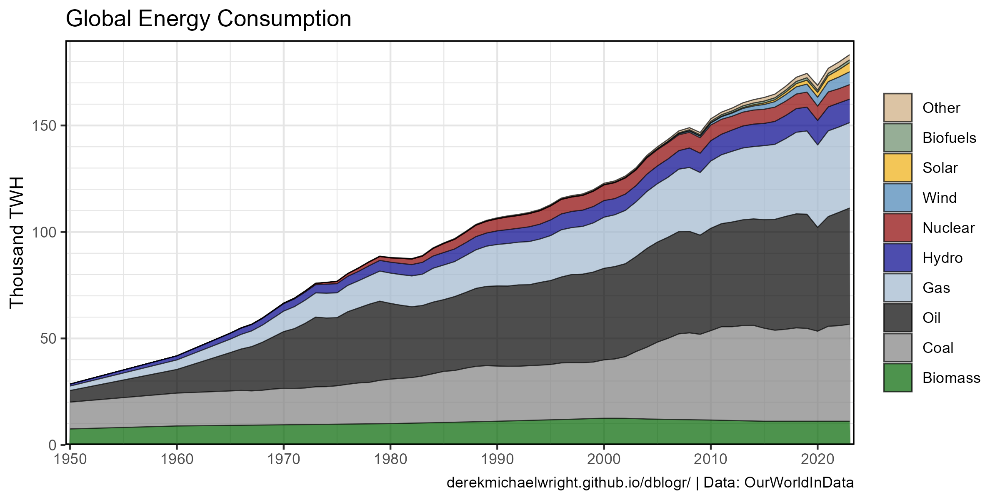
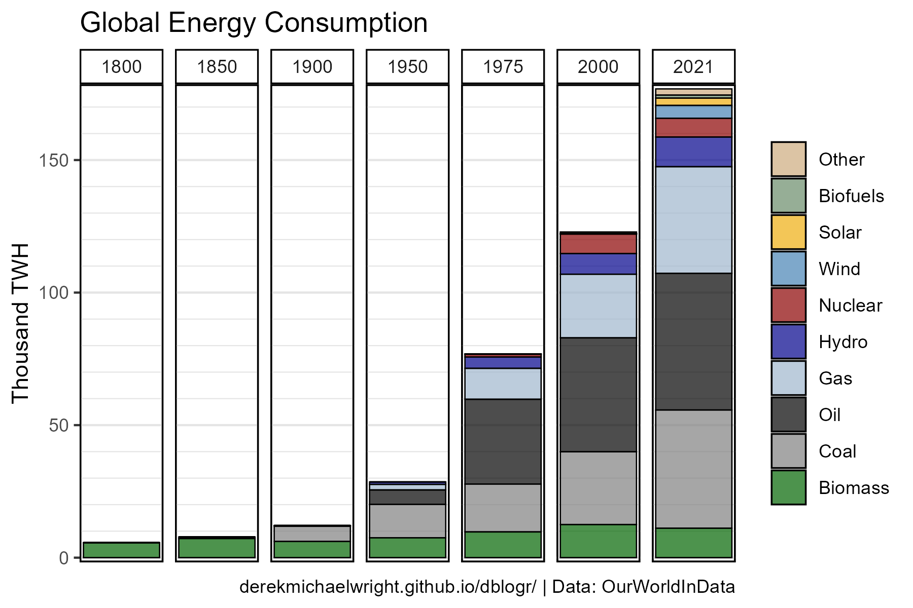
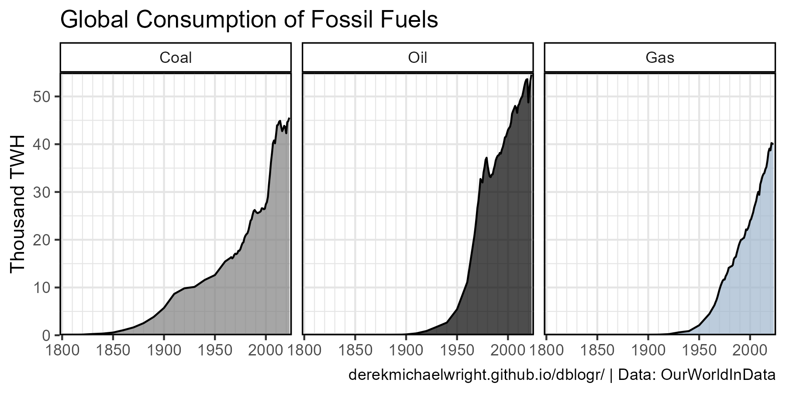
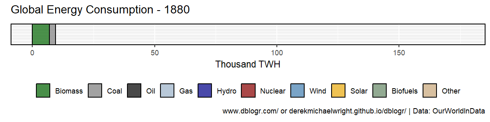
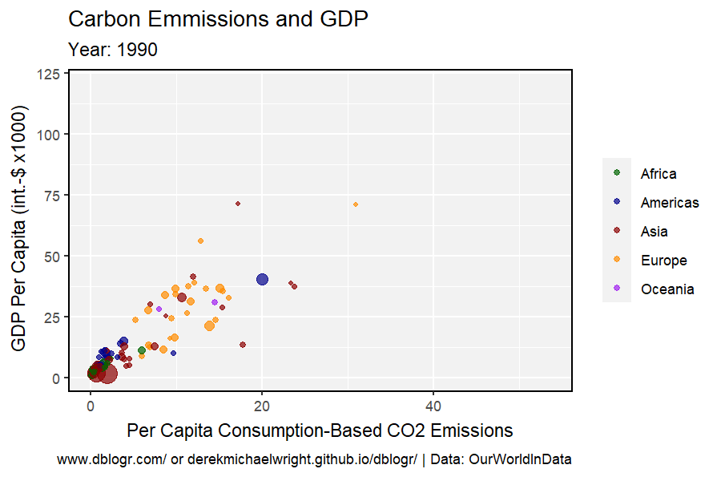
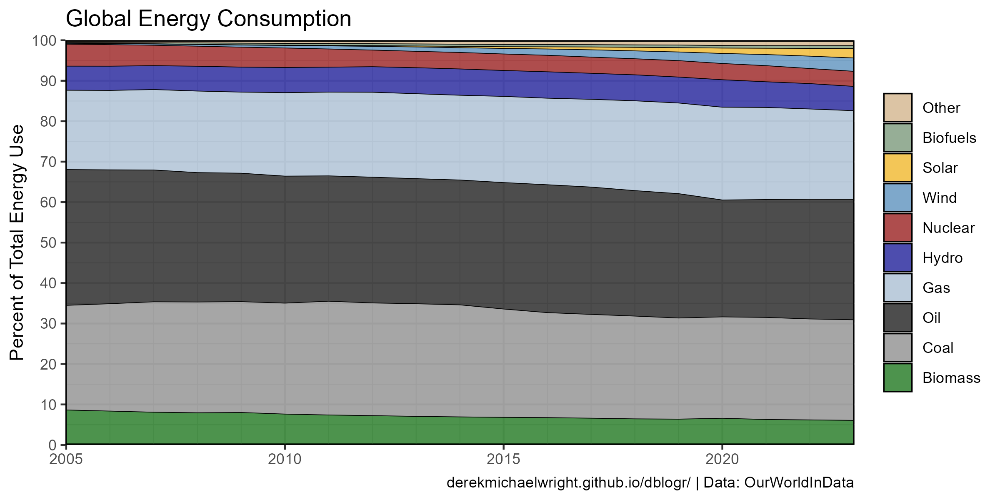

```{r setup, include=FALSE}
knitr::opts_chunk$set(echo = T, message = F, warning = F)
```

---

# Download Data

`r shiny::icon("globe")` https://ourworldindata.org/energy-production-consumption

`r shiny::icon("save")` [global-energy-substitution.csv](global-energy-substitution.csv)

`r shiny::icon("globe")` https://ourworldindata.org/worlds-energy-problem

`r shiny::icon("save")` [consumption-co2-per-capita-vs-gdppc.csv](consumption-co2-per-capita-vs-gdppc.csv)

`r shiny::icon("globe")` https://ourworldindata.org/a-history-of-global-living-conditions-in-5-charts

`r shiny::icon("save")` [world-population-in-extreme-poverty-absolute.csv](world-population-in-extreme-poverty-absolute.csv)

`r shiny::icon("save")` [literate-and-illiterate-world-population.csv](literate-and-illiterate-world-population.csv)

---

# Prepare Data

```{r class.source = 'fold-show'}
# devtools::install_github("derekmichaelwright/agData")
library(agData)
library(plotly) # ggplotly()
library(htmlwidgets) # saveWidget()
library(gganimate)
```

```{r}
# Prep data
myCaption <- "www.dblogr.com/ or derekmichaelwright.github.io/dblogr/ | Data: OurWorldInData"
myItems <- c("Other", "Biofuels", "Solar", "Wind",
             "Hydro", "Nuclear", "Gas", "Oil", "Coal", "Biomass")
myColors <- c("burlywood3", "green","darkgoldenrod2","steelblue",
              "darkblue", "darkred", "slategray3", 
              "black", "grey50", "darkgreen")
d1 <- read.csv("global-energy-substitution.csv") 
colnames(d1)[4:13] <- myItems
#
d1 <- d1 %>% gather(Source, Value, 4:13) %>%
  mutate(Source = factor(Source, levels = myItems)) %>%
  group_by(Year) %>%
  mutate(Total = sum(Value),
         Percent = 100 * Value / Total) %>%
  ungroup()
#
oldnames <- c("United States", "South Korea", "Brunei")
newnames <- c("USA", "Republic of Korea", "Brunei Darussalam")
d2 <- read.csv("consumption-co2-per-capita-vs-gdppc.csv") %>%
  select(Country=1, Year, CO2=4, GDP=5, Population=6) %>%
  mutate(Country = plyr::mapvalues(Country, oldnames, newnames)) %>%
  left_join(agData_FAO_Country_Table, by = "Country") %>% 
  filter(!(is.na(GDP) & is.na(CO2) & is.na(Population)))
#
d3 <- read.csv("world-population-in-extreme-poverty-absolute.csv") %>%
  rename(`Not in extreme poverty`    = 4,
         `Living in extreme poverty` = 5) %>%
  mutate(Total = `Not in extreme poverty` + `Living in extreme poverty`) %>%
  gather(Measurement, Value, 4:5) %>%
  mutate(Percent = 100 * Value / Total)
#
d4 <- read.csv("literate-and-illiterate-world-population.csv") %>%
  rename(Literate  = 4,
         Iliterate = 5) %>%
  gather(Measurement, Percent, 4:5)
```

---

# Global Energy by Source

## Consumption


```{r}
# Plot
mp <- ggplot(d1, aes(x = Year, y = Value / 1000, fill = Source)) +
  geom_area(alpha = 0.7, color = "black", lwd = 0.3) +
  scale_fill_manual(name = NULL, values = myColors) +
  scale_y_continuous(expand = c(0,0), limits = c(0,180),
                     minor_breaks = seq(0,180,10)) +
  scale_x_continuous(breaks = seq(1800, 2020, by = 50), expand = c(0.005,0),
                     minor_breaks = seq(1800, 2020, by = 10)) +
  guides(fill = guide_legend(override.aes = list(lwd = 0.4))) +
  theme_agData() +
  labs(title = "Global Energy Consumption",
       y = "Thousand TWH", x = NULL, caption = myCaption)
ggsave("world_energy_1_01.png", mp, width = 6, height = 4)
```

```{r echo = F}
ggsave("featured.png", mp, width = 6, height = 4)
```

---

### Select Years



```{r}
xx <- d1 %>% filter(Year %in% c(1800, 1850, 1900, 1950, 1975, 2000, 2021))
# Plot
mp <- ggplot(xx, aes(x = 1, y = Value / 1000, fill = Source)) +
  geom_bar(stat = "identity", color = "black", alpha = 0.7, lwd = 0.3) +
  scale_fill_manual(name = NULL, values = myColors) +
  scale_y_continuous(expand = c(0.01,0), minor_breaks = seq(0,180,10)) +
  facet_grid(. ~ Year) +
  guides(fill = guide_legend(override.aes = list(lwd = 0.4))) +
  theme_agData(axis.text.x = element_blank(),
               axis.ticks.x = element_blank(),
               panel.grid.major.x = element_blank(),
               panel.grid.minor.x = element_blank()) +
  labs(title = "Global Energy Consumption",
       y = "Thousand TWH", x = NULL, caption = myCaption)
ggsave("world_energy_1_02.png", mp, width = 6, height = 4)
```

---

### Fossil Fuels

#### Stacked


```{r}
# Prep data
xx <- d1 %>% filter(Source %in% myItems[7:9]) 
# Plot
mp <- ggplot(xx, aes(x = Year, y = Value / 1000, fill = Source)) +
  geom_area(alpha = 0.7, color = "black") +
  scale_fill_manual(name = NULL, values = myColors[7:9]) +
  scale_y_continuous(breaks = seq(0, 150, by = 50), limits = c(0,140), 
                     minor_breaks = seq(0, 150, by = 10), expand = c(0,0)) +
  scale_x_continuous(breaks = seq(1800, 2020, by = 50), expand = c(0.005,0),
                     minor_breaks = seq(1800, 2020, by = 10)) +
  theme_agData(legend.position = "bottom") +
  guides(fill = guide_legend(reverse=T)) +
  labs(title = "Global Consumption of Fossil Fuels",
       y = "Thousand TWH", x = NULL, caption = myCaption)
ggsave("world_energy_1_03.png", mp, width = 6, height = 4)
```

---

#### Facetted



```{r}
# Prep data
xx <- d1 %>% filter(Source %in% myItems[9:7]) %>%
  mutate(Source = factor(Source, levels = myItems[9:7]))
# Plot
mp <- ggplot(xx, aes(x = Year, y = Value / 1000, fill = Source)) +
  geom_area(alpha = 0.7, color = "black") +
  scale_fill_manual(name = NULL, values = myColors[9:7]) +
  facet_wrap(Source ~ .) +
  scale_y_continuous(breaks = seq(0, 60, by = 10), limits = c(0,55),
                     minor_breaks = seq(0, 60, by = 5), expand = c(0,0)) +
  scale_x_continuous(breaks = seq(1800, 2020, by = 50), expand = c(0.01,0), 
                     minor_breaks = seq(1800, 2020, by = 10)) +
  theme_agData(legend.position = "none") +
  labs(title = "Global Consumption of Fossil Fuels",
       y = "Thousand TWH", x = NULL, caption = myCaption)
ggsave("world_energy_1_04.png", mp, width = 6, height = 3)
```

---

### Projections

#### Fossil Fuels


```{r}
# Prep data
xx <- d1 %>% filter(Source %in% myItems[9:7], Year > 1950) %>%
  mutate(Source = factor(Source, levels = myItems[9:7]))
fit1 <- lm(Value ~ Year, data = xx %>% filter(Source == "Coal"))
fit2 <- lm(Value ~ Year, data = xx %>% filter(Source == "Oil"))
fit3 <- lm(Value ~ Year, data = xx %>% filter(Source == "Gas"))
x1 <- data.frame(Year = c(1950, 2050), Source = "Coal")
x1$Value <- predict(fit1, newdata = x1)
x2 <- data.frame(Year = c(1950, 2050), Source = "Oil")
x2$Value <- predict(fit2, newdata = x2)
x3 <- data.frame(Year = c(1950, 2050), Source = "Gas")
x3$Value <- predict(fit3, newdata = x3)
yy <- rbind(x1, x2, x3)
# Plot
mp <- ggplot(xx, aes(x = Year, y = Value / 1000, color = Source)) +
  geom_line(alpha = 0.7, lwd = 1) +
  geom_line(data = yy, lwd = 0.5, lty = 2, alpha = 0.7) +
  scale_color_manual(name = NULL, values = myColors[9:7]) +
  scale_x_continuous(breaks = seq(1950, 2050, by = 10),
                     minor_breaks = seq(1950, 2050, by = 10)) +
  
  theme_agData(legend.position = "bottom") +
  labs(title = "Global Consumption of Fossil Fuels",
       y = "Thousand TWH", x = NULL, caption = myCaption)
ggsave("world_energy_1_05.png", mp, width = 6, height = 4)
```

---

#### All Energy



```{r}
# Prep data
xx <- d1 %>% filter(Source == "Nuclear", Year > 1970 & Year < 2000)
fit1 <- lm(Value ~ Year, data = xx)
xx <- d1 %>% filter(Source == "Hydro", Year > 1950)
fit2 <- lm(Value ~ Year, data = xx)
xx <- d1 %>% filter(Source == "Wind", Year > 2010)
fit3 <- lm(Value ~ Year, data = xx)
xx <- d1 %>% filter(Source == "Solar", Year > 2015)
fit4 <- lm(Value ~ Year, data = xx)
xx <- d1 %>% filter(Source == "Biofuels", Year > 2010)
fit5 <- lm(Value ~ Year, data = xx)
xx <- d1 %>% filter(Source == "Other", Year > 2010)
fit6 <- lm(Value ~ Year, data = xx)
#
x1 <- data.frame(Year = c(1970, 2050), Source = "Nuclear")
x1$Value <- predict(fit1, newdata = x1)
x2 <- data.frame(Year = c(1950, 2050), Source = "Hydro")
x2$Value <- predict(fit2, newdata = x2)
x3 <- data.frame(Year = c(2010, 2050), Source = "Wind")
x3$Value <- predict(fit3, newdata = x3)
x4 <- data.frame(Year = c(2015, 2050), Source = "Solar")
x4$Value <- predict(fit4, newdata = x4)
x5 <- data.frame(Year = c(2010, 2050), Source = "Biofuels")
x5$Value <- predict(fit5, newdata = x5)
x6 <- data.frame(Year = c(2010, 2050), Source = "Other")
x6$Value <- predict(fit6, newdata = x6)
#
yy <- rbind(x1, x2, x3, x4, x5, x6)
xx <- d1 %>% filter(Year > 1950, Source %in% myItems[1:6])
# Plot
mp <- ggplot(xx, aes(x = Year, y = Value / 1000, color = Source)) +
  geom_line(alpha = 0.7, lwd = 1) +
  geom_line(data = yy, lwd = 0.5, lty = 2, alpha = 0.7) +
  facet_wrap(Source ~ ., scales  = "free_y") +
  scale_fill_manual(name = NULL, values = myColors) +
  scale_x_continuous(breaks = seq(1950, 2050, by = 20),
                     minor_breaks = seq(1950, 2050, by = 10)) +
  scale_color_manual(values = myColors) +
  theme_agData(legend.position = "none",
               axis.text.x = element_text(angle = 45, hjust = 1)) +
  labs(title = "Global Consumption of Fossil Fuels",
       y = "Thousand TWH", x = NULL, caption = myCaption)
ggsave("world_energy_1_06.png", mp, width = 6, height = 4)
```

---

### Renewables


```{r}
# Prep data
xx <- d1 %>% filter(Source %in% myItems[1:6]) %>%
  mutate(Source = factor(Source, levels = rev(myItems[c(1:4,6,5)])))
# Plot
mp <- ggplot(xx, aes(x = Year, y = Value / 1000, fill = Source)) +
  geom_area(alpha = 0.7, color = "black") +
  scale_fill_manual(name = NULL, values = rev(myColors[c(1:4,6,5)])) +
  facet_wrap(Source ~ .) +
  scale_y_continuous(breaks = seq(0, 11, by = 2),
                     minor_breaks = seq(0, 11, by = 1)) +
  scale_x_continuous(breaks = seq(1800, 2020, by = 50), 
                     minor_breaks = seq(1800, 2020, by = 10)) +
  theme_agData(legend.position = "none") +
  labs(title = "Global Consumption of Renewable Energy",
       y = "Thousand TWH", x = NULL, caption = myCaption)
ggsave("world_energy_1_07.png", mp, width = 6, height = 4)
```

---

## Percent


```{r}
# Plot
mp <- ggplot(d1, aes(x = Year, y = Percent, fill = Source)) +
  geom_area(alpha = 0.7, color = "black", lwd = 0.2) +
  scale_fill_manual(name = NULL, values = myColors) +
  scale_y_continuous(breaks = seq(0,100,10), expand = c(0,0)) +
  scale_x_continuous(breaks = seq(1800, 2020, by = 50), expand = c(0,0),
                     minor_breaks = seq(1800, 2020, by = 10)) +
  guides(fill = guide_legend(override.aes = list(lwd = 0.4))) +
  theme_agData() +
  labs(title = "Global Energy Consumption",
       y = "Percent of total energy use", x = NULL, caption = myCaption)
ggsave("world_energy_1_08.png", mp, width = 6, height = 4)
```

---

### Fossil Fuels


```{r}
# Prep data
xx <- d1 %>% filter(Source %in% myItems[9:7]) %>%
  mutate(Source = factor(Source, levels = myItems[9:7]))
# Plot
mp <- ggplot(xx, aes(x = Year, y = Percent, fill = Source)) +
  geom_area(alpha = 0.7, color = "black") +
  scale_fill_manual(name = NULL, values = myColors[9:7]) +
  facet_wrap(Source ~ .) +
  scale_y_continuous(breaks = seq(0, 60, by = 10),
                     minor_breaks = seq(0, 60, by = 5)) +
  scale_x_continuous(breaks = seq(1800, 2020, by = 50), 
                     minor_breaks = seq(1800, 2020, by = 10)) +
  theme_agData(legend.position = "none") +
  labs(title = "Global Energy Consumption", x = NULL,
       y = "Percent of total energy use", caption = myCaption)
ggsave("world_energy_1_09.png", mp, width = 6, height = 3)
```

---

### Renewables


```{r}
# Prep data
xx <- d1 %>% filter(Source %in% myItems[1:6], Year > 1850) %>%
  mutate(Source = factor(Source, levels = rev(myItems[c(1:4,6,5)])))
# Plot
mp <- ggplot(xx, aes(x = Year, y = Percent, fill = Source)) +
  geom_area(alpha = 0.7, color = "black", lwd = 0.2) +
  scale_fill_manual(name = NULL, values = rev(myColors[c(1:4,6,5)])) +
  facet_wrap(Source ~ .) +
  scale_x_continuous(breaks = seq(1850, 2020, by = 50), 
                     minor_breaks = seq(1850, 2020, by = 10)) +
  theme_agData(legend.position = "none") +
  labs(title = "Global Consumption of Renewable Energy",
       y = "Percent of total energy use", x = NULL, caption = myCaption)
ggsave("world_energy_1_10.png", mp, width = 6, height = 4)
```

---

### 2021 


```{r}
# Prep data
xx <- d1 %>% filter(Year == 2021) %>% 
  mutate(Source = factor(Source, levels = myItems[c(9:1,10)]))
# Plot
mp <- ggplot(xx, aes(x = 1, y = -Percent, fill = Source)) +
  geom_bar(stat = "identity", color = "black", lwd = 0.3, alpha = 0.7) +
  scale_fill_manual(name = NULL, breaks = myItems[c(9:1,10)],
                    values = myColors[c(9:1,10)] ) +
  guides(fill = guide_legend(override.aes = list(lwd = 0.4))) +
  coord_polar("y", start = 0) +
  theme_agData_pie() +
  xlim(0.545, 1.45) +
  labs(title = "Global Energy Consumption - 2021", caption = myCaption)
ggsave("world_energy_1_11.png", mp, width = 5, height = 3.8)
```

---

## Pie Animation


```{r}
# Plot
mp <- ggplot(d1, aes(x = "", y = -Percent, fill = Source)) +
  geom_bar(stat = "identity", color = "black", alpha = 0.7) +
  scale_fill_manual(name = NULL, breaks = myItems[c(9:1,10)],
                    values = myColors[c(9:1,10)]) +
  coord_polar("y", start = 0) +
  theme_agData_pie() +
  labs(title = "Percent of Global Energy Consumption - {round(frame_time)}",
       caption = myCaption) +
  transition_time(Year)
anim_save("world_energy_gif_1_01.gif", mp,
          nframes = 300, fps = 10, end_pause = 30, 
          width = 900, height = 700, res = 150)
```

---

## Bar Animation



```{r}
# Plot
mp <- ggplot(d1, aes(x = 1, y = Value / 1000, fill = Source)) +
  geom_bar(stat = "identity", color = "black", alpha = 0.7) +
  scale_fill_manual(name = NULL, 
                    values = rev(myColors), breaks = rev(myItems)) +
  scale_x_continuous(expand = c(0,0)) +
  theme_agData(legend.position = "bottom",
               axis.text.y = element_blank(),
               axis.ticks.y = element_blank()) +
  coord_flip() +
  guides(fill = guide_legend(nrow = 1)) +
  labs(title = "Global Energy Consumption - {round(frame_time)}",
       y = "Thousand TWH", x = NULL, caption = myCaption) +
  transition_time(Year)
anim_save("world_energy_gif_1_02.gif", mp,
          nframes = 300, fps = 10, end_pause = 30, 
          width = 1200, height = 300, res = 150)
```

---

# CO2 vs GDP

## 1990


```{r}
# Prep data
xx <- d2 %>% filter(Year == 1990, !is.na(Region), !is.na(CO2), !is.na(GDP))
myColors <- c("darkgreen", "darkblue", "darkred","darkorange", "purple")
r2 <- round(cor(xx$CO2, xx$GDP)^2, 2)
mm <- round(summary(lm(data = xx, GDP / 1000 ~ CO2))$coefficients[2], 1)
# Plot
mp <- ggplot(xx, aes(x = CO2, y = GDP / 1000)) + 
  geom_point(aes(color = Region, size = Population), alpha = 0.7) +
  geom_smooth(method = "lm", se = F, color = "black") +
  geom_label(x = 5, y = 100, label = paste("italic(R)^2 == ", r2), parse = T) +
  geom_label(x = 5, y = 85, label = paste("italic(m) == ", mm), parse = T) +
  facet_grid(. ~ Year) +
  scale_color_manual(name = NULL, values = myColors) +
  guides(size = F) +
  ylim(c(0, 125)) + xlim(c(0, 40)) +
  theme_agData() +
  labs(title = "Carbon Emmissions and GDP",
       y = "GDP per capita (int.-$ x1000)", 
       x = "Per capita consumption-based CO2 emissions",
       caption = myCaption)
ggsave("world_energy_2_01.png", mp, width = 6, height = 4)
```

---

## 2018


```{r}
# Prep data
xx <- d2 %>% filter(Year == 2018, !is.na(Region), !is.na(CO2), !is.na(GDP))
myColors <- c("darkgreen", "darkblue", "darkred","darkorange", "purple")
r2 <- round(cor(xx$CO2, xx$GDP)^2, 2)
mm <- round(summary(lm(data = xx, GDP / 1000 ~ CO2))$coefficients[2], 1)
# Plot
mp <- ggplot(xx, aes(x = CO2, y = GDP / 1000)) + 
  geom_point(aes(color = Region, size = Population, key1 = Country), alpha = 0.7) +
  geom_smooth(method = "lm", se = F, color = "black") +
  geom_label(x = 5, y = 100, label = paste("italic(R)^2 == ", r2), parse = T) +
  geom_label(x = 5, y = 85, label = paste("italic(m) == ", mm), parse = T) +
  facet_grid(. ~ Year) +
  scale_color_manual(name = NULL, values = myColors) +
  guides(size = F) +
  ylim(c(0, 125)) + xlim(c(0, 40)) +
  theme_agData() +
  labs(title = "Carbon Emmissions and GDP",
       y = "GDP per capita (int.-$ x1000)", 
       x = "Per capita consumption-based CO2 emissions",
       caption = myCaption)
ggsave("world_energy_2_02.png", mp, width = 6, height = 4)
```

---

## Interactive

https://dblogr.com/blog/world_energy/world_energy_2_02.html

<iframe
  src="world_energy_2_02.html"
  style="width:100%; height:600px;"
  data-external="1"
></iframe>

```{r}
mp <- ggplotly(mp)
saveWidget(as_widget(mp), "world_energy_2_02.html")
```

---

## 1990 vs 2018


```{r}
# Prep data
xx <- d2 %>% 
  filter(Year %in% c(1990, 2018), !is.na(Region), !is.na(CO2), !is.na(GDP))
myColors <- c("darkgreen", "darkblue", "darkred","darkorange", "purple")
# Plot
mp <- ggplot(xx, aes(x = CO2, y = GDP / 1000)) + 
  geom_point(aes(color = Region, size = Population), alpha = 0.7) +
  geom_smooth(method = "lm", se = F, color = "black") +
  facet_grid(. ~ Year) +
  scale_color_manual(name = NULL, values = myColors) +
  guides(size = F) +
  ylim(c(0, 125)) + xlim(c(0, 40)) +
  theme_agData() +
  labs(title = "Carbon Emmissions and GDP",
       y = "GDP per capita (int.-$ x1000)", 
       x = "Per capita consumption-based CO2 emissions",
       caption = myCaption)
ggsave("world_energy_2_03.png", mp, width = 8, height = 4)
```

---

## Animation



```{r}
# Prep data
xx <- d2 %>% filter(!is.na(Region), !is.na(CO2), !is.na(GDP))
myColors <- c("darkgreen", "darkblue", "darkred","darkorange", "purple")
r2 <- round(cor(xx$CO2, xx$GDP)^2, 2)
# Plot
mp <- ggplot(xx, aes(x = CO2, y = GDP / 1000)) + 
  geom_point(aes(color = Region, size = Population), alpha = 0.7) +
  scale_color_manual(name = NULL, values = myColors) +
  guides(size = F) +
  theme_agData() +
  labs(title = "Carbon Emmissions and GDP", 
       subtitle = "Year: {frame_time}", 
       y = "GDP per capita (int.-$ x1000)", 
       x = "Per capita consumption-based CO2 emissions",
       caption = myCaption) +
  transition_time(Year) 
anim_save("world_energy_gif_2_01.gif", mp, 
          nframes = 300, fps = 10, end_pause = 30, 
          width = 900, height = 600, res = 150)
```

---

## Change


```{r}
# Prep data
xx <- d2 %>% 
  filter(Year %in% c(2000, 2018), !is.na(Region), !is.na(CO2), !is.na(GDP)) %>%
  mutate(Year = factor(Year))
y1 <- xx %>% select(Country, Year, CO2) %>%
  filter(!duplicated(paste(.$Country, .$Year))) %>% 
  spread(Year, CO2) %>%
  mutate(CO2diff = `2018` - `2000` >= 0) %>%
  select(Country, CO2diff)
y2 <- xx %>% select(Country, Year, GDP) %>%
  filter(!duplicated(paste(.$Country, .$Year))) %>% 
  spread(Year, GDP) %>%
  mutate(GDPdiff = `2018` - `2000` >= 0) %>%
  select(Country, GDPdiff)
myGroups1 <- c("TRUE TRUE", "FALSE TRUE", "FALSE FALSE", "TRUE FALSE")
myGroups2 <- c("+CO2 +GDP", "-CO2 +GDP", "-CO2 -GDP", "+CO2 -GDP")
myColors <- c("steelblue", "darkgreen", "darkorange", "darkred")
xx <- xx %>%
  left_join(y1, by = "Country") %>%
  left_join(y2, by = "Country") %>%
  mutate(Group = paste(CO2diff, GDPdiff),
         Group = plyr::mapvalues(Group, myGroups1, myGroups2),
         Group = factor(Group, levels = myGroups2)) %>%
  filter(!is.na(CO2diff), !is.na(GDPdiff))
# Plot
mp <- ggplot(xx, aes(x = CO2, y = GDP / 1000)) + 
  geom_line(aes(group = Country, color = Group)) +
  geom_point(aes(pch = Year, size = Population), alpha = 0.3) +
  facet_wrap(Region ~ ., scales = "free", ncol = 5) + 
  scale_color_manual(name = NULL, values = myColors) +
  scale_shape_manual(name = NULL, values = c(16,17)) +
  guides(size = F) +
  theme_agData(legend.position = "bottom") +
  labs(title = "Carbon Emmissions and GDP",
       subtitle = "2000 - 2018",
       y = "GDP per capita (int.-$ x1000)", 
       x = "Per capita consumption-based CO2 emissions",
       caption = myCaption)
ggsave("world_energy_2_04.png", mp, width = 10, height = 3.5)
```

---

## Canada


```{r}
# Prep data
xx <- d2 %>% select(Country, Year, GDP, CO2) %>%
    filter(Country == "Canada") %>%
    mutate(GDP = GDP / 1000) %>%
    gather(Measurement, Value, CO2, GDP) %>%
    mutate(Measurement = plyr::mapvalues(Measurement, c("CO2","GDP"),
              c("CO2 emissions per capita", "GDP (int.-$ x1000)")))
# Plot
mp <- ggplot(xx, aes(x = Year, y = Value, color = Measurement)) +
  geom_line(size = 2, alpha = 0.7) +
  facet_wrap(Measurement ~ ., scales = "free") +
  scale_color_manual(values = c("darkred", "darkgreen")) +
  xlim(c(1997, 2020)) +
  theme_agData(legend.position = "none") +
  labs(title = "Canadian Carbon Emmissions and GDP", 
       y = NULL, x = NULL, caption = myCaption)
ggsave("world_energy_2_05.png", mp, width = 6, height = 4)
```

---

# Poverty

## Global Poverty


```{r}
# Plot
mp <- ggplot(d3, aes(x = Year, y = Value / 1000000000, color = Measurement)) +
  geom_line(size = 1.5, alpha = 0.7) +
  scale_color_manual(name = NULL, values = c("darkred", "darkgreen")) +
  scale_y_continuous(breaks = 0:7) +
  scale_x_continuous(breaks = seq(1820, 2020, by = 20)) +
  theme_agData(legend.position = "bottom") +
  guides(color = guide_legend(nrow = 2, ncol = 1)) +
  labs(title = "Global Poverty", x = NULL, 
       y = "Billion People", caption = myCaption)
ggsave("world_energy_3_01.png", mp, width = 6, height = 4)
```

---

## Percent Poverty



```{r}
# Prep data
xx <- d3 %>% filter(Measurement == "Living in extreme poverty")
# Plot
mp <- ggplot(xx, aes(x = Year, y = Percent)) +
  geom_hline(yintercept = min(xx$Percent), alpha = 0.2) +
  geom_hline(yintercept = max(xx$Percent), alpha = 0.2) +
  geom_line(color = "darkred", size = 1.5, alpha = 0.7) +
  scale_y_continuous(limits = c(0, 100),
                     breaks = seq(0, 100, by = 10)) +
  scale_x_continuous(breaks = seq(1820, 2020, by = 20)) +
  theme_agData(legend.position = "bottom") +
  guides(color = guide_legend(nrow = 2, ncol = 1)) +
  labs(title = "Percent of People Living in Extreme Poverty", 
       y = NULL, x = NULL, caption = myCaption)
ggsave("world_energy_3_02.png", mp, width = 6, height = 4)
```

---

## Poverty Pie


```{r}
# Plot
mp <- ggplot(d3, aes(x = "", y = Percent, fill = Measurement)) +
  geom_bar(stat = "identity", color = "black", alpha = 0.7) +
  scale_fill_manual(name = NULL, values = c("darkred", "darkgreen")) +
  coord_polar("y", start = 0) +
  theme_agData(legend.position = "bottom") +
  theme_agData_pie() +
  labs(title = "Percent of People Living in Poverty - {round(frame_time)}",
       caption = myCaption) +
  transition_time(Year)
anim_save("world_energy_gif_3_01.gif", mp,
          nframes = 300, fps = 10, end_pause = 30, 
          width = 700, height = 700, res = 150)
```

---

## Literacy


```{r}
# Plot
mp <- ggplot(d4, aes(x = Year, y = Percent, color = Measurement)) +
  geom_hline(yintercept = min(xx$Percent), alpha = 0.2) +
  geom_hline(yintercept = max(xx$Percent), alpha = 0.2) +
  geom_line(size = 1.5, alpha = 0.7) +
  scale_color_manual(name = NULL, values = c("darkred", "darkgreen")) +
  scale_y_continuous(limits = c(0, 100),
                     breaks = seq(0, 100, by = 10)) +
  scale_x_continuous(breaks = seq(1800, 2020, by = 20)) +
  theme_agData(legend.position = "bottom") +
  guides(fill = guide_legend(nrow = 2, ncol = 1)) +
  labs(title = "Global Literacy Rates", x = NULL,
       y = "Percent", caption = myCaption)
ggsave("world_energy_3_03.png", mp, width = 6, height = 4)
```

---

## Poverty + Illiteracy


```{r}
# Prep data
x1 <- d3 %>% filter(Measurement == "Not in extreme poverty")
x2 <- d4 %>% filter(Measurement == "Literate")
xx <- bind_rows(x1, x2)
# Plot
mp <- ggplot(xx, aes(x = Year, y = Percent, color = Measurement)) +
  geom_line(size = 1.5, alpha = 0.7) +
  scale_color_manual(name = NULL, values = c("darkgoldenrod2", "darkgreen")) +
  scale_y_continuous(limits = c(0, 100),
                     breaks = seq(0, 100, by = 10)) +
  scale_x_continuous(breaks = seq(1800, 2020, by = 20)) +
  theme_agData(legend.position = "bottom") +
  guides(fill = guide_legend(nrow = 2, ncol = 1)) +
  labs(title = "Global Reduction in Poverty and Illiteracy", 
       y = "Percent", x = NULL, caption = myCaption)
ggsave("world_energy_3_04.png", mp, width = 6, height = 4)
```

---

## Energy and Poverty


```{r}
# Prep data
x1 <- d3 %>% 
  filter(Measurement == "Not in extreme poverty")
x2 <- d1 %>% filter(Source %in% myItems[7:9]) %>%
  select(Year, Source, Value) %>%
  spread(Source, Value) %>%
  mutate(`Fossil Fuels` = Coal + Gas + Oil)
xx <- left_join(x1, x2, by = "Year") 
# Plot
mp <- ggplot(xx, aes(x = `Fossil Fuels` / 1000, y = Percent)) +
  stat_smooth(geom = "line", method = "lm", alpha = 0.7) +
  geom_point(size = 2.5, color = "darkgreen", alpha = 0.7) +
  theme_agData(legend.position = "none") +
  guides(fill = guide_legend(nrow = 2, ncol = 1)) +
  labs(title = "Fossil Fuels and Global Reduction in Poverty", 
       y = "Percent Not in Extreme Poverty", 
       x = "Thousand TWH From fossil Fuels",
       caption = myCaption)
ggsave("world_energy_3_05.png", mp, width = 6, height = 4)
```

---
