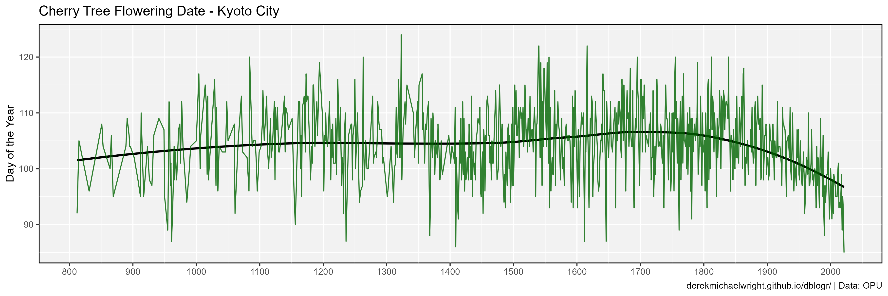
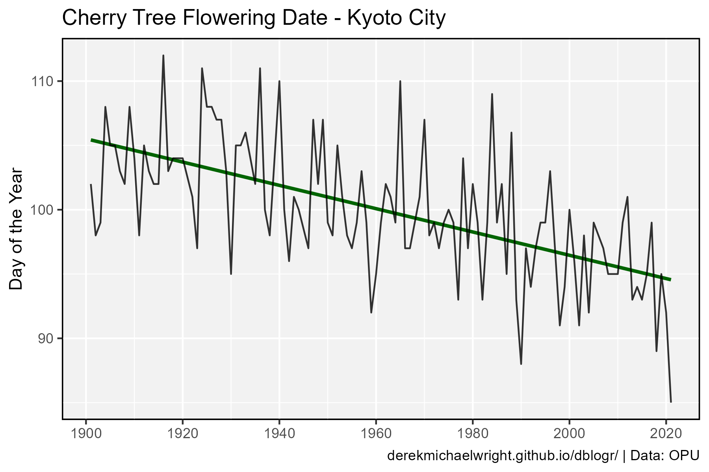

```{r setup, include=FALSE}
knitr::opts_chunk$set(echo = T, message = F, warning = F)
```

---

# Data

> - `r shiny::icon("globe")` [http://atmenv.envi.osakafu-u.ac.jp/aono/kyophenotemp4/](http://atmenv.envi.osakafu-u.ac.jp/aono/kyophenotemp4/){target="_blank"}
> - `r shiny::icon("save")` [KyotoFullFlower7.csv](KyotoFullFlower7.csv)

---

# Prepare Data

```{r class.source = "fold-show"}
# devtools::install_github("derekmichaelwright/agData")
library(agData)
```

```{r}
# Prep data
myCaption <- "derekmichaelwright.github.io/dblogr/ | Data: OPU"
dd <- read.csv("KyotoFullFlower7.csv") %>%
  filter(!is.na(Full.flowering.date..DOY.))
```

---

# All Data



```{r}
# Plot
mp <- ggplot(dd, aes(x = AD, y = Full.flowering.date..DOY.)) +
  geom_smooth(method = "loess", se = F, color = "black") +
  geom_line(alpha = 0.8, color = "darkgreen") +
  scale_x_continuous(breaks = seq(800, 2000, 100)) +
  theme_agData() +
  labs(title = "Cherry Tree Flowering Date - Kyoto City", 
       y = "Day of the Year", x = NULL, caption = myCaption)
ggsave("cherry_trees_01.png", mp, width = 12, height = 4)
```

```{r echo = F}
ggsave("featured.png", mp, width = 12, height = 4)
```

---

# Last 100 Years



```{r}
# Prep data
xx <- dd %>% filter(AD > 1900)
# Plot
mp <- ggplot(xx, aes(x = AD, y = Full.flowering.date..DOY.)) +
  geom_smooth(method = "lm", se = F, color = "darkgreen") +
  geom_line(alpha = 0.8) +
  scale_x_continuous(breaks = seq(1900, 2020, 20), 
                     minor_breaks = seq(1900, 2020, 10)) +
  theme_agData() +
  labs(title = "Cherry Tree Flowering Date - Kyoto City",
       y = "Day of the Year", x = NULL, caption = myCaption)
ggsave("cherry_trees_02.png", mp, width = 6, height = 4)
```

---

```{r eval = F, echo = F}
xx <- dd %>% arrange(Full.flowering.date..DOY.) 
grep("2020", as.character(dd$AD) )
#
lubridate::yday("2016-04-04")
lubridate::yday("2017-04-09")
lubridate::yday("2018-03-30")
lubridate::yday("2019-04-05")
lubridate::yday("2020-04-01")
lubridate::yday("2021-03-26")
```
